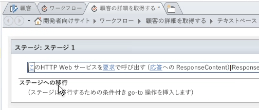
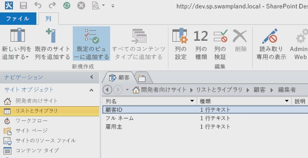
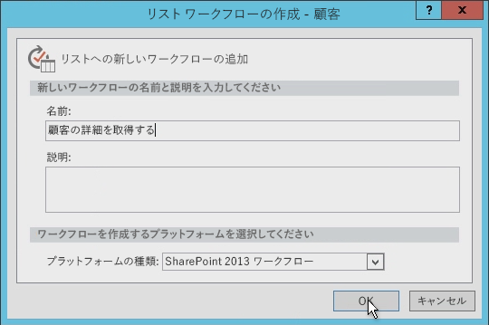
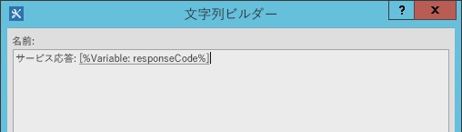
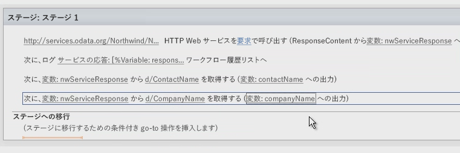
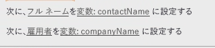
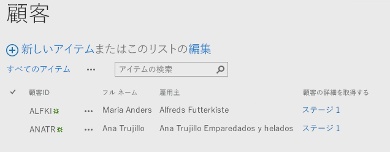

# SharePoint Designer 2013 を使用した SharePoint 2013 ワークフローにおける Web サービスの操作
SharePoint Designer 2013 ワークフロー内で Web サービスを使用する方法を示します。 
 **執筆者:** [Andrew Connell](http://social.msdn.microsoft.com/profile/andrew%20connell%20%5bmvp%5d/)、 [www.AndrewConnell.com](http://www.andrewconnell.com)
  
    
    

Microsoft は、SharePoint Server 2013 内のワークフローに対して新しいアプローチを採用しています。ワークフロー チームは Microsoft Azure チームと協力し、ワークフロー マネージャー という新しい製品を作成しました。ワークフロー マネージャー は最新バージョンの Windows Workflow Foundation ランタイムのホストとなり、必要なすべてのサービスを提供すると共に Microsoft Azure サービス バスを活用して、パフォーマンスとスケーラビリティを強化します。展開した後は、オンプレミスの展開の場合でもクラウドに展開された場合でも、同じように実行します。重要なこととして、SharePoint 2013 はすべてのワークフロー実行と関連タスクを SharePoint 2013 の外部にある ワークフロー マネージャー ファームに渡します。
ワークフロー アーキテクチャで最も重要な変更の 1 つは、Visual Studio 2012 を使用して構築されたワークフローを含むすべてのワークフローが、デザイナー画面で宣言的に作成されるようになったことです。以前のバージョンの SharePoint では、、Visual Studio 2012 を使用して開発されたワークフローは、すべてが宣言型であったわけではなく、宣言型 XAML とワークフローのビジネス ロジックを含むコンパイル済みのアセンブリとが混在していました。
  
    
    

以前に SharePoint Designer を使用してワークフローを作成したことのあるお客様にとって、これは新しいことではありません。SharePoint Designer を使用して作成されたワークフローは、いつも完全な宣言型でした。しかし、SharePoint Designer 2013 ワークフローは Web サービスの呼び出しと使用をサポートするようになるので、この変更は SharePoint Designer 2013 を使用してワークフローを作成するお客様にとって役立つものとなります。
## SharePoint 2013 ワークフローで Web サービスが重要な理由

どのようなシナリオで Web サービスの使用が意味あるものとなるのかを理解することからはじめましょう。SharePoint 2007 や SharePoint 2010 の時代には、Visual Studio を使用してワークフローを作成するためにカスタム コードを記述することが一般的でした。そうすることが計算の実行やカスタム ビジネス ロジックの実装のための最善の方法だったためです。既定のアクションやアクティビティによってニーズが満たされない状況が生じた際には常に、マネージ アセンブリのカスタム コードを使用して対応することができました。
  
    
    
その一方で、SharePoint Designer 2013 の開発者以外のユーザーにとっては、これは簡単なことではありませんでした。既存のワークフロー アクションでは処理できないユース ケースが生じた場合、開発者に連絡してカスタム アクションの記述を依頼する必要がありました。多くの場合、(ホスト環境のは) サンド ボックス用のコードしか作成できないため、または、オンプレミスに実装されている場合は完全信頼ソリューションしか使用できないために、対応は困難でした。その他のケースでは、SharePoint Designer ではニーズが満たされないために、ワークフローを完全に開発者に渡して完全信頼ソリューションを構築する必要がありました。
  
    
    
嬉しいことに、SharePoint 2013 の世界では、SharePoint Designer 2013 に必要なアクションが備わっていない場合、カスタム Web サービスを作成するだけで済みます。そしてカスタム Web サービスの作成は、カスタム アクションの作成よりもずっと容易です。さらに、カスタム アクションは、それがインストールされているワークフローでのみ (つまり最大でも SharePoint ワークフローでのみ) 使用可能でしたが、カスタム Web サービスはポータブルであり、任意の数のコンシューマーがこれを使用できます。
  
    
    
最大の利点と考えられるのは、アクセスする必要のある既存の Web サービスがあるケースで、それがパブリックのサービスであってもユーザーの企業がホストするプライベートな Web サービスであっても、SharePoint Designer 2013 がその Web サービスの呼び出しに使用できるアクションを提供するようになったことです。既存の Web サービスを呼び出す必要があるときにそれを開発者に依頼する必要はなくなりました。
  
    
    
SharePoint 2013 はすべての種類の Web サービスを使用できますが、データの受信や返信に  [Atom](http://msdn.microsoft.com/ja-jp/library/ff478141.aspx) または [JSON](http://json.org/) (JavaScript Object Notation) の標準の [OData](http://www.odata.org/) 形式を使用する Web サービスを使用することが最も簡単です (そして推奨されます)。
  
    
    
この推奨は、SharePoint 2013 ワークフロー作成ツール (SharePoint Designer 2013 と Visual Studio 2012 の両方) でのこれらの OData 形式のサポートに基づいています。どちらのツールも、サービスに送信するペイロードの構築と Web サービスから返される応答の処理をサポートします。さらに、OData 形式は、匿名の Web サービスやさまざまな種類の認証によって保護された Web サービスとの通信をサポートします。つまり、各サービス呼び出しの要求と応答を完全に制御することができます。これにより、ワークフロー内の一連のアクティビティを使用して、まず 1 つのサービスを使用して認証し、OAuth トークンを取得してから、 [OAuth 2.0](http://oauth.net/2/) プロトコルを使用して保護されたサービスへの将来の要求にそのトークンを組み込むことができます。
  
    
    

## SharePoint ワークフローでの Web サービスの活用

SharePoint 2013 を使用するワークフローからの Web サービスの呼び出しは、2 つのステージで行われます。最初のステージは Web サービスの呼び出しで、2 番目は Web サービスとのデータの交換です。
  
    
    
SharePoint 2013 ワークフローで、 **Call HTTP Web Service** という名前の SharePoint 2013 で導入された新しいアクションを使用して Web サービスを呼び出します。このアクションはフレキシブルで、Web サービスへの簡潔な呼び出しを簡単に行うことを可能にします。または必要であれば、HTTP 動詞を使用してより複雑な呼び出しを作成したり、HTTP ヘッダーの追加を可能にしたりすることもできます。図 1 は、SharePoint Designer 2013 表面での **Call HTTP Web Service** アクションを示しています。
  
    
    

**図 1. Call HTTP Web サービスのアクションを示している SharePoint Designer 2013 ステージ**

  
    
    

  
    
    

  
    
    
 **Call HTTP Web Service** アクションにより、 **GET**、 **PUT**、 **POST**、 **DELETE** など、いくつかの要求メソッドのいずれかを指定できます。これにより、Web サービス (特に [RESTful](http://msdn.microsoft.com/ja-jp/library/office/jj164022.aspx) サービス) に、アクティビティの URI プロパティに指定されたサービスで何を行うかを指定できます。
  
    
    
たとえば、特定のアイテム用のすべてのプロパティを取得するためには、サービス URL にアイテムの固有アドレスを組み込んで、メソッドを **GET** に設定します。アイテムを削除するためのプロセスもそれと同じですが、メソッドは **DELETE** に設定します。アイテムを更新する方法も同様で、メソッドは **POST** に設定します。アイテムを作成するとき、URL をアイテムを作成するコレクションの固有アドレスに設定してから、メソッドを **POST** に設定します。アイテムを作成または更新するとき、通常はサービスで使用するデータが必要となります。このデータは、要求に含まれるコンテンツと共に渡してから、 **Call HTTP Web Service** アクションの **request** プロパティで指定します。
  
    
    
Web サービスで作業を行う際の 2 番目のステージには、Web サービスとの間でデータを送受信することが含まれます。これは **Call HTTP Web Service** アクションで **request** または **response** プロパティを使用することによって行います。ただし、データはストリームとしてではなく、 [動的な値](http://msdn.microsoft.com/ja-jp/library/windowsazure/microsoft.activities.dynamicvalue%28v=azure.10%29.aspx)オブジェクトを使用して複合構造として渡されることに注意してください。(動的な値について詳しくは、「 [動的な値について](http://msdn.microsoft.com/ja-jp/library/windowsazure/jj193505%28v=azure.10%29.aspx)」を参照してください。)
  
    
    
動的な値のデータ構造は、JavaScript Object Notation (JSON) ストリングとして書式設定されます。ただし、開発者がワークフロー内のストリングを手動で作成したり操作したりするのではなく、Microsoft は階層データと Web サービス呼び出しに対する応答の両方を保管するために使用できるオブジェクト タイプ **DynamicValue** を提供しています。
  
    
    
応答に含まれるアイテム数を判別したり、応答から値を抽出したり、アイテムを更新または作成するための新しい構造を構築したりするために使用できる、 **DynamicValue** タイプに関連付けられた一連のアクティビティがあります。SharePoint Designer 2013 では、 **DynamicValue** タイプを直接扱うことはサポートされていません。代わりに、ワークフロー作成者は **Dictionary** タイプを使用します。
  
    
    

## SharePoint 2013 ワークフローのための Web サービスの作成

ここまでで、SharePoint Designer 2013 が Web サービスの呼び出しをサポートしていること、ただしワークフローからのカスタム コードの起動はサポート *していない*  ことを学習しました。そこで次に、ワークフローの機能をデフォルトのアクションから拡張するために Web サービスを作成する方法を知る必要があります。
  
    
    
幸いなことに、SharePoint 2013 ワークフローで使用するカスタム Web サービスを作成するための多くのオプションがあります。特に **HttpSend** アクティビティと **DynamicValue** データ タイプは、OData プロトコルに準拠する RESTful Web サービスの作成にとても適しています。
  
    
    
 OData は、REST サービスの原理に基づいてデータを作成、使用するためのプロトコルです。成熟度、信頼性、および強度に優れた HTTP プロトコルを使用してデータの交換を標準化する目的で開発されました。OData の指定が終わった段階で、異なる組織がテクノロジ スタック上にそれぞれ異なるプロトコルを実装しました。Microsoft も独自のバージョンの OData を実装し、これに [WCF Data Services](http://msdn.microsoft.com/ja-jp/library/hh487257%28v=vs.103%29.aspx) というブランドを付けました。
  
    
    
以下では、RESTful Web サービスがワークフロー開発者に役立つものとなる 2 つの一般的なシナリオについて検討します。
  
    
    

- OData サービスの CRUDQ 操作を実装する
    
  
- OData サービスの操作を実装する
    
  

### OData サービスの CRUDQ 操作を実装する

Web サービスの一般的な使用方法は、データベース内のデータに対して、単純な作成、読み取り、更新、削除、および照会 (CRUD-Q) の操作を行うことです。WCF データ サービスを使用して、ワークフローによって使用される SharePoint 2013 ワークフロー WCF データ サービスと OData サービス用に OData Web サービスを作成することは比較的に容易です。Web サービスを作成するためのチュートリアルやサンプルは、「 [WCF Data Services](http://msdn.microsoft.com/ja-jp/library/cc668792.aspx)、「 [www.OData.org](http://www.odata.org)」その他のサイトで参照できます。 
  
    
    
操作対象にできるデータベースが既に存在すると想定した場合、4 つの簡潔なステップがあります。
  
    
    

1. Microsoft  [Entity Framework](http://msdn.microsoft.com/ja-jp/data/aa937723) を使用して、データベースのモデルを作成します。これは Visual Studio でウィザードを使用して作成できるので、コーディングは必要ありません。詳しくは、「 [Visual Studio 2010 での Entity Framework 4.0 と WCF Data Services 4.0](http://msdn.microsoft.com/ja-jp/magazine/ee336128.aspx)」および「 [Entity Framework Designer が Visual Studio 2012 で評価される](http://msdn.microsoft.com/ja-jp/magazine/jj721589.aspx)」を参照してください。
    
  
2. 新しい WCF データ サービスを作成します。今回も、この Visual Studio ウィザードでコーディングは必要ありません。詳しくは、「 [Visual Studio での WCF データ サービスの作成とアクセス](http://msdn.microsoft.com/ja-jp/library/vstudio/cc668184.aspx)」のチュートリアルを参照してください。
    
  
3. サービス コード ファイルで、ステップ 1 で作成したエンティティ モデルの名前をサービスのソースに設定し、モデル中の各エンティティについてアクセシビリティとアクセス許可を設定します (両方のステップはわずか 2 行のコード内に実装されます)。
    
  
4. ワークフロー マネージャーがアクセスできる場所にサービスを公開します。
    
  

### OData サービスの操作を実装する

ワークフローが、制限のある CRUD-Q には収まらないビジネス ロジックを実行する必要が生じる可能性があります。例えば、新しい銀行ローンを作成するときに CRUD-Q 操作をサポートする OData サービスがあるとします。このサービスはまた、現在の利率を取り出すために、使用者がサービスを呼び出してクレジット スコアを提供するように求めることがあります。このような作業は、メソッドを呼び出し、整数を渡し、応答を取り出すので、単純な CRUD-Q 操作の機能を上回っています。
  
    
    
ただし、OData および WCF データ サービスを使用して [サービス操作](http://msdn.microsoft.com/ja-jp/library/cc668788.aspx)を実装することにより、このシナリオをサポートできます。サービス操作は一般的で、SharePoint 2013 サービスでも使用されています。たとえば、SharePoint がアドレス形式  `http://[..]/_api/web/lists/GetByTitle('ListTitle')` を使用して特定のリストを検索するとき、アドレス内の **GetByTitle()** 関数は、実際には SharePoint 2013 チームによって作成されたサービス操作です。通常、開発者はカスタム サービス操作を、WCF データ サービスを使用して作成した Web サービス内に作成します。
  
    
    

## SharePoint Designer 2013 でワークフローを作成する

次のチュートリアルでは、Northwind データベースの OData Web サービスを呼び出すカスタム ワークフローを作成する方法を示します。このデータベースは、 [www.odata.org](http://www.odata.org) サイトでパブリックにホストされています。このサンプルで、ユーザーは顧客 ID を入力してからワークフローを開始します。ワークフローは顧客 ID を取得し、それにより Web サービスを照会して、顧客に関する追加情報 (具体的にはユーザーの氏名と雇用主) を収集します。その後、ワークフローはこの情報を取得して、ユーザーの顧客名と雇用主を追加することによりリスト項目を更新します。
  
    
    

### 顧客リストを作成する

1. SharePoint Designer 2013 で、カスタム リストを作成し、「顧客」という名前を付けます。
    
  
2. [ **タイトル**] フィールドの名前を [ **顧客 ID**] に変更します。
    
  
3. 図 2 に示されているように、 **String** 型の 2 つの新しいフィールドを追加して、それらの名前を [ **氏名**] および [ **雇用主**] にします。
    
   **図 2. SharePoint Designer 2013 で顧客リストを作成する**

  

  

  

  

### ワークフローを作成する

1. SharePoint Designer 2013 ナビゲーション ウィンドウで、[ **ワークフロー**] オプションを選択します。
    
  
2. リボンで [ **リスト ワークフロー**] ボタンをクリックし、表示されるドロップダウン リストから [ **顧客**] を選択します。
    
  
3. ワークフローに「顧客の詳細を取得」という名前を付けます。
    
  
4. 図 3 に示されているように、[ **プラットフォームの種類**] を [ **SharePoint 2013 ワークフロー**] に設定します。
    
   **図 3. SharePoint Designer 2013 を使用して新しいリスト ワークフローを作成する**

  

  

  

  

### Web サービスで顧客の詳細を照会する

これでワークフローを作成したので、そこから Web サービスを呼び出すことができるようにします。そのためには、[ **HTTP Web サービスを呼び出す**] アクションをワークフローの既定のステージに追加します。
  
    
    

1. [ **this**] というラベルの付いたリンクをクリックします。
    
  
2. [ **HTTP web サービスの URL を入力**] テキスト ボックスの右にあるビルダー ボタン ([ **…**]) をクリックして、[ **文字列ビルダー**] ダイアログ ボックスを開きます。
    
  
3. [ **文字列ビルダー**] に  `http://services.odata.org/Northwind/Northwind.svc/Customers('CUSTOMERID')?$format=json&amp;$select=ContactName,CompanyName` という URL を入力します。URL の「 `$select`」の部分は、このリストに関連するフィールドだけを取得することに注意してください。 
    
  
4. URL の中で、URL セグメント  `CUSTOMERID` を見つけて削除します。かっこと単一引用符はそのままの位置に残しておきます。
    
  
5. その後、完全な URL を動的に作成するには、[ **文字列ビルダー**] の [ **参照の追加または変更**] ボタンをクリックします。
    
  
6. 表示される [ **文字列の参照**] ダイアログ ボックスで、図 4 に示されているように、[ **データ ソース**] を [ **現在のアイテム**] に設定し、[ **ソースのフィールド**] を [ **CustomerId**] に設定します。
    
   **図 4. Web サービス要求の URL を動的に作成する**

  

  

  

  
7. [ **OK**] をクリックし、再度 [ **OK**] をクリックして、新しい URL を受け入れます。
    
    これで、Web サービスからの結果を受け取るためのセットアップが完了しました。次に、結果を別の変数に保管する必要があります。
    
  
8. [ **HTTP Web サービスを呼び出す**] アクションで、アクション内の [ **応答**] リンクをクリックして **Dictionary** 型の新しい変数を作成し、その名前を **nwServiceResponse** にします。
    
    [ **Call HTTP Web Service**] アクションは、デザイナーで長い文なので、その全体が表示されることはあまりありません。右にスクロールして、応答ステータス コードが **responseCode** という変数に保管されることを確認してください。これは便利であり、ワークフローの履歴リストを使用してワークフロー インスタンスの統計情報ページに書き込むことができるものです。
    
  
9. 図 5 に示されているように、[ **履歴リストに記録する**] アクションを [ **HTTP Web サービスを呼び出す**] アクションの後に追加して、応答の状態コードをログに書き込むようにその [ **メッセージ**] を設定します。
    
   **図 5. Web サービスの応答コードを履歴リストに書き込む**

  

  

  

  

### 応答から値を抽出する

これで、Web サービスの応答を **nwServiceResponse** 変数に保管しました。次のステップは、これらの値を抽出してローカル変数に入れることです。
  
    
    
これを行うには、2 つの [ **辞書からアイテムを取得する**] アクションをワークフローに追加します。値を抽出するアイテムへのパスは応答の構造と一致している必要があり、特定の形式でなければなりません。これを判別する優れた方法は、URL をブラウザーに入力して、返される応答を確認することです。結果は **d** というオブジェクト内にネストされていることに注意してください。そのため、Web サービスの応答に含まれるフィールド [ **CompanyName**] へのパスは、 `d/CompanyName` となります。
  
    
    

1. 2 つの [ **辞書からアイテムを取得する**] アクションをワークフローに追加します。
    
  
2. これら 2 つの新しいアクションの最初のアクションで、[ **名前またはパスに基づいて取得したアイテム**] を  `d/ComopanyName` に設定します。
    
  
3. [ **辞書**] リンクを **nwServiceResponse** に設定します。
    
  
4. [ **アイテム**] リンクを **CompanyName** という新しい **String** 変数に設定します。
    
  
5. 2 番目の [ **辞書からアイテムを取得する**] アクションの、ステップ 2、3、および 4 を繰り返します。ただし、図 6 に示されているように、 **ContactName** を「CompanyName」の代わりに使用します。
    
   **図 6. Web サービスの辞書の応答から値を抽出する**

  

  

  

  

### リスト アイテムを更新する

最後のステップでは、[ **現在のアイテムにフィールドを設定する**] アクションの 2 つを使用してリスト アイテムを更新します。これらのアクションにより、図7 に示されているように、リスト アイテム内のフィールドが作成した変数に保管されている値に設定されます。
  
    
    

**図 7. リスト アイテムを更新する**

  
    
    

  
    
    

  
    
    
そして最後に、ワークフロー ステージの [ **ステージへの遷移**] セクションを完成させます。
  
    
    

1. [ **ステージに移動**] アクションを追加します。
    
  
2. [ **ワークフローの最後**] を選択します。
    
  
3. ワークフローを保存して公開します。
    
  

### ワークフローのテスト

1. ブラウザーを開いて [ **顧客**] に移動します。
    
  
2. 2 つの新しいリスト アイテム **ALFKI** と **ANATR** で、Northwind サービスに含まれる 2 つの顧客 ID を追加します。
    
  
3. 各アイテムを選択してからリボンの [ **ワークフロー**] ボタンをクリックすることにより、ワークフローを手動で開始します。
    
  
4. [ **顧客の詳細を取得**] ワークフローを選択します。
    
    この時点で、ワークフローが開始して Web サービスを照会します。
    
  
5. [ **顧客**] リストに戻って、ページを更新します。ワークフローが完了するために、数回の更新が必要な場合もありまが、やがて図 8 の画像のようになります。両方のリストが、Northwind Web サービスから取得された顧客の氏名と雇用主の情報で更新されていることを確認できます。
    
   **図 8. カスタム ワークフローによって更新されたリスト アイテム**

  

  

  

  

## まとめ

SharePoint 2013 には、新製品、ワークフロー マネージャー 1.0 によって実行が支援される新しいワークフローが導入されています。社内展開、Office 365 でのホストのいずれであれ、SharePoint 2013 展開の選択に依存することなく、すべてのカスタム ワークフローが必ず動作するように、現在ではワークフローが完全に宣言型になっています。SharePoint Designer 2013 で作成されたワークフローから Web サービスを呼び出すための追加のサポートにより、ワークフローの作成プロセスは、以前のバージョンのときよりも柔軟で強力なものになります。
  
    
    
 Microsoft では、SharePoint Designer 2013 の新しい **Call HTTP Web Service** アクションを使用した、ワークフロー マネージャー での Web サービスの呼び出しに対するサポートを導入しています。また ワークフロー マネージャー には、Web サービスに送信する構造体を作成したり、 **Dictionary** 変数型を使用して応答を使用したりする際に必要なサポートも導入されています。ワークフローの作成時には、 **Dictionary** 型と、外部 Web サービスを使用する SharePoint ワークフロー内の対応するアクションを使用してください。
  
    
    

## その他の技術情報

-  [SharePoint 2013 のワークフロー](workflows-in-sharepoint-2013.md)
    
  
-  [OData](http://www.odata.org/)
    
  
-  [JSON の導入](http://json.org/)
    
  
-  [SharePoint 2013 REST サービスの概要](http://msdn.microsoft.com/ja-jp/library/office/fp142380.aspx)
    
  
-  [Visual Studio 2010 での Entity Framework 4.0 と WCF Data Services 4.0](http://msdn.microsoft.com/ja-jp/magazine/ee336128.aspx)
    
  

  
    
    

