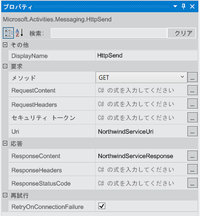
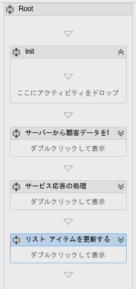
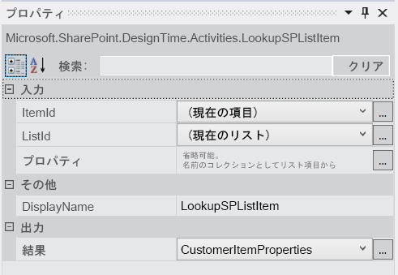
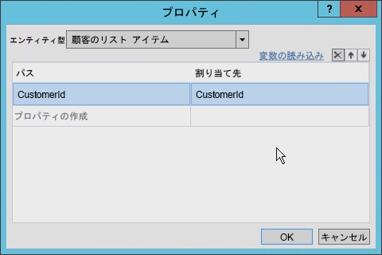
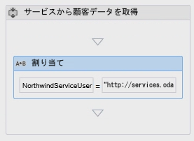
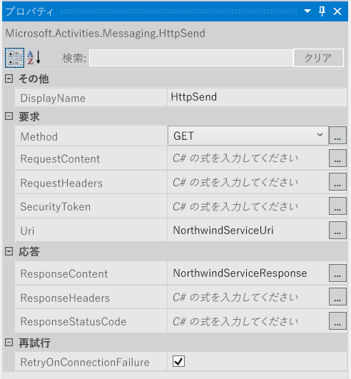
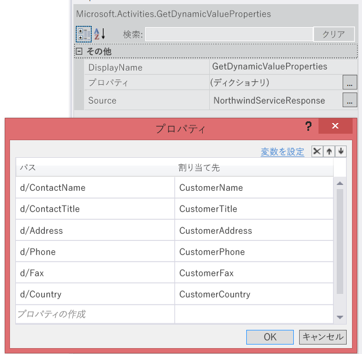
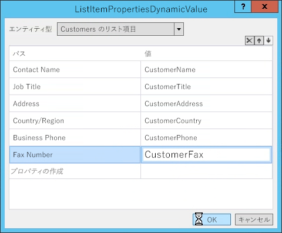
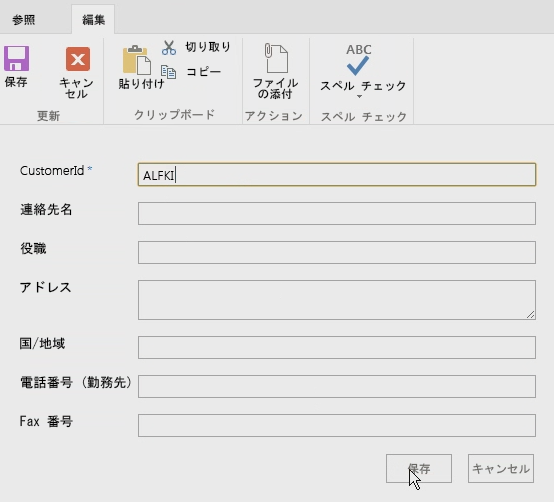
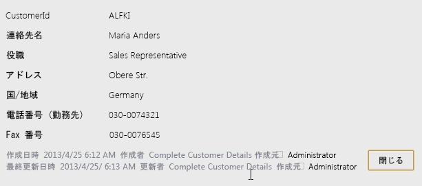

# Visual Studio 2012 を使用した SharePoint 2013 ワークフローにおける Web サービスの操作
Visual Studio 2012 を使用して SharePoint 2013 ワークフロー内で Web サービスを使用する方法を示します。
 **提供者:** [Andrew Connell](http://social.msdn.microsoft.com/profile/andrew%20connell%20%5bmvp%5d/),  [AndrewConnell.com](http://www.andrewconnell.com)
  
    
    

  
    
    

> **メモ**
> この記事には、エンドツーエンドのコード サンプルが添付されていて、記事に合わせて使用したり、独自の SharePoint ワークフロー プロジェクトのひな形として使用することができます。次の MSDN Code Gallery にダウンロード可能なコードがあります: 「 [Visual Studio 2012 を使用した SharePoint 2013 ワークフローにおける Web サービスの操作](http://code.msdn.microsoft.com/ja-jp/Working-with-Web-in-46148199)」 
  
    
    

  
    
    
Microsoft では、SharePoint Server 2013 に以前の SharePoint とは異なるアプローチを採用しています。ワークフロー チームは、Azure チームと共同で、ワークフロー マネージャーという新しい製品を作成しました。ワークフロー マネージャー は、最新バージョンの Windows Workflow Foundation (バージョン 4) ランタイム、および必要なサービスすべてを可用性とスケーラビリティに優れた方法でホスティングするという役割を果たします。Workflow Manager ではパフォーマンスとスケーラビリティを維持するために、Microsoft Azure サービス バスが利用されており、展開すれば、社内展開、またはクラウドでの展開のいずれを問わず同様に実行されます。SharePoint 2013 はさらに、ワークフローの実行と関連するタスクをすべてワークフロー マネージャーファームにハンドオフするように接続、構成されます。新しいワークフロー アーキテクチャで最も重要な変更の 1 つは、SharePoint 2013 中のカスタム ワークフローがすべて、Visual Studio 2012 を使用して構築されたワークフローも含め、完全に宣言型になっている点です。以前のバージョンの SharePoint では、Visual Studio 2012 を使用して開発したワークフローは、完全に宣言型というわけではありませんでした。代わりに、宣言型 XAML とコンパイル済みのペアリングが使用されていました。マネージド アセンブリには、ワークフローのビジネス ロジックが含まれていました。このことは、経験豊富な SharePoint 開発者にとっては衝撃に思えるかも知れません。「コンパイル済みアセンブリを使わずにカスタム ビジネス ロジックをいったいどのように実装したらよいのかと疑問に思われるでしょう。Microsoft では、カスタム Web サービス (可能であれば JavaScript Object Notation (JSON) フォーマットでデータを返す WCF、OData、または RESTful の Web サービスなら理想的) を作成して、この新しいバージョンでの新規のアクティビティやオブジェクトの一部を使用することを推奨します。
## SharePoint 2013 における Web サービスの使用のシナリオ

SharePoint 2013 ワークフロー中で Web サービスを活用したシナリオは、容易に想像することができます。SharePoint 2007 または SharePoint 2010 を使用してワークフローを作成してきた開発者は、こうしたワークフローは本来、プログラミングに関連するものであるため、カスタム コードでの作業には精通しているものです。こうしたワークフローにカスタム コードを追加することは特に必須ではありませんでしたが、きわめて一般的に実施されてきました。
  
    
    
SharePoint 2013 ワークフローは純粋に宣言型になっているため、従来、カスタム コードの記述で対応してきた多くの事例で、これまでワークフローから呼び出され、使用されていた外部の Web サービスに記述されたコードでの処理が必要になります。
  
    
    
SharePoint 2013 ワークフローではどのような Web サービスでも使用できます。とは言え、ワークフローにとって **Atom** または **json** のいずれかの形式で提供される Open Data protocol ( **OData** ) によってデータを送る Web サービスとやり取りするのが最も簡単な方法です。OData は、SharePoint 2013 ワークフロー (SharePoint Designer 2013 と Visual Studio 2012 の両方) で完全にサポートされので、最良の方法です。
  
    
    
さらに匿名 Web サービスのほか、各種の認証によって保護された Web サービスもサポートされます。実際、個々のサービス呼び出しについて要求と応答の処理を全面的に制御することができます。したがって、たとえば、あるワークフローに含まれる一連のアクティビティを使用して、特定の OAuth トークンを取得した後、 [OAuth 2.0](http://oauth.net/2/) を使用してセキュリティが保護されたサービスに対する今後の要求に当該のトークンを組み込むことができます。
  
    
    

## ワークフローでの Web サービスの活用

SharePoint 2013 ワークフローで Web サイトを使用するには、次の 2 つの段階を伴います。まず、SharePoint 2013 に新たに導入された **HttpSend** アクティビティを使用して Web サービスを呼び出します。 **HttpSend** では、最も単純な Web サービスを呼び出すことができます。また複雑なタスクの場合は、HTTP の動詞とヘッダーが提供されます。図 1 に、 **HttpSend** アクティビティで利用できる各種のプロパティを示します。
  
    
    

**図 1. HttpSend アクティビティのプロパティ ツール ウィンドウ**

  
    
    

  
    
    

  
    
    
サービス要求で使用するメソッドの種類も指定する必要があります。図 1 では、[ **要求**] ブロックの中でメソッドの種類 (この例では **GET**) を指定できます。 **GET**、 **PUT**、 **POST**、および **DELETE** の各オプション (これ以外にもあります) を指定できます。これが、アクティビティの URI で定義されたリソースをどのように処理するかについて、Web サービス、特に RESTful サービスに指示を与えるための主な方法です。
  
    
    
たとえば、特定のアイテムに関するすべてのプロパティが取得されるように、 **Uri** には、項目の一意のアドレスが記載され、メソッドが **GET** に設定されます。 **Uri** には、アイテムの削除のために、同じ一意のアドレスが保持されますが、メソッドは **DELETE** に設定されます。アイテムの更新時も、メソッドが **POST** に設定される点を除き、同様です。アイテムの作成時は、 **Uri** は、アイテムを作成するコレクションの一意のアドレスを参照し、メソッドは **POST** に設定されます。アイテムの作成時、または更新時に、サービスによりデータには、 **HttpSend** アクティビティの **RequestContent** プロパティで指定した要求内のコンテンツとして引き渡すものを使用していることが条件付けられます。
  
    
    
ここで説明する Web サービスで実施する 2 つの段階は、Web サービスを対象としたデータの送信と受信に関するものです。 **HttpSend** アクティビティで **RequestContent** または **ResponseContent** プロパティを使用するかどうかを問わず、JavaScript Object Notation (JSON) 文字列としてフォーマットした複雑な構造としてデータを渡すことができます。なお、これらの json 文字列は手動で作成したり、操作したりする必要はありません。代わりに、タスクがより容易になる [DynamicValue](http://msdn.microsoft.com/ja-jp/library/windowsazure/jj193446%28v=azure.10%29.aspx) という新しいオブジェクト タイプが用意されています。
  
    
    
 **DynamicValue** DynamicValue オブジェクトには、階層データをはじめ、Web サービス呼び出しの応答も格納できます。また、応答中のアイテム数をカウントする、応答から値を抽出する、アイテムの更新または作成に使用する新しい構造体を構築する場合に利用できる **DynamicValue** オブジェクトに関連付けられた一連のアクティビティもあります。
  
    
    

## SharePoint 2013 ワークフローのための Web サービスの作成

Web サービスの呼び出しがサポートされている一方、ワークフロー内でのカスタム コードのサポートが得られていなければ、この段階で開発者は、サービスの作成方法がわかっていなければなりません。SharePoint 2013 ワークフローで使用するカスタム Web サービスを作成するためのオプションが数多くあります。 **HttpSend** アクティビティ値と **DynamicValue** のデータ型は、RESTful サービス、および OData プロトコルに準拠したサービスに最も適しています。
  
    
    
OData は、REST サービスの原理に基づいてデータを作成、使用するためのプロトコルです。成熟度、信頼性、および強度に優れた HTTP プロトコルを使用してデータの交換を標準化する目的で開発されました。OData の指定が終わった段階で、異なる組織がテクノロジ スタック上にそれぞれ異なるプロトコルを実装しました。Microsoft も独自のバージョンの OData を実装し、これに  [Windows Communication Foundation (WCF) Data Services 5.0 ](http://msdn.microsoft.com/ja-jp/library/hh487257%28v=vs.103%29.aspx) というブランドを付けました。
  
    
    
SharePoint 2013 で実装された RESTful サービスでは、これらのサービスが WCF Data Services (具体的には、OData 3.0 仕様を補完している WCF Data Services 5.0) を使用して構築されているため、実際に OData がサポートされています。
  
    
    

### OData サービスの CRUDQ 操作を実装

Web サービスの一般的な使い方は、データベース中のデータを対象に単純な作成、読み取り、更新、削除、クエリ (CRUDQ) を実行することです。SharePoint 2013 ワークフローで使用する OData サービスは、WCF を使えばきわめて簡単に作成できます。既に特定のデータベースが存在することを前提とすれば、ほとんどコーディングの必要のない次の 4 つの簡単なステップに従って作成できます。
  
    
    

1.  [Entity Framework ](http://msdn.microsoft.com/ja-jp/library/bb399567%28v=vs.110%29.aspx) を使用してデータベースのモデルを作成します。コードの記述は必要ありません (Visual Studio によりウィザードが提供されます)。
    
  
2. 新しい WCF データ サービスを作成します。コードの記述は必要ありません (Visual Studio によりウィザードが提供されます)。
    
  
3. サービス コード ファイルで、エンティティ モデル (ステップ 1 で作成したモデル) の名前をサービスのソースに設定し、モデル中の各エンティティについてアクセシビリティとアクセス許可を設定します。いずれのステップも、わずか 2 行のコードが必要になります。
    
  
4. ワークフロー マネージャーがアクセスできる場所にサービスを公開します。
    
  

### OData サービスの操作の実装

Web サービスを使用して実施すべきもう 1 つのタスクは、CRUDQ モデルにあてはめられるビジネス ロジックを実行することです。たとえば、新規の銀行ローンを作成する CRUDQ 操作をサポートする OData サービスの例を考えてみます。 ここでは、このサービスを呼び出して、将来のローンに対して現在の金利を取得できるようにクレジット スコアを提供することによって消費者をサポートするものと仮定します。この種のタスクは、特定のメソッドを呼び出して、整数で渡すことにより、応答が取得されるため、CRUDQ モデルには該当しません。
  
    
    
このシナリオは、OData および WCF のデータ サービスが [サービスの操作 ](http://msdn.microsoft.com/ja-jp/library/cc668788%28v=vs.110%29.aspx)を提供することによってサポートされます。サービスの操作は一般的なもので、たとえば、アドレス  `http://[..]/_api/web/lists/GetByTitle('ListTitle')` を使用して特定のリストを取得する場合など、SharePoint 2013 サービス内でも使用されます。 **GetByTitle** メソッドは、SharePoint 2013 のチームが開発したサービス オペレーターです。開発者は、WCF Data Services を使用して作成したカスタム Web サービス内に独自のカスタム サービス操作を作成します。
  
    
    

## チュートリアル: Visual Studio 2012 によるワークフローの作成

次のチュートリアルでは、Northwind データベースで OData Web サービスを呼び出すカスタム ワークフローを作成する方法を示します。Northwind データベースは、 [OData.org ](http://www.odata.org) でホストされています。
  
    
    
ワークフローが完了すると、ユーザーは顧客 ID を入力し、ワークフローを開始します。ワークフローが開始すると、追加の顧客情報が取得され、リスト アイテムが、取得されたデータで更新されます。
  
    
    

1. Visual Studio 2012 を開始して、SharePoint でホストされる新規のアプリ プロジェクトを作成します。
    
  
2. このプロジェクトで、新規のカスタム リストを作成し、「顧客」という名前を付けます。
    
  
3. 新しいリストで次のフィールドを作成します。各フィールドについて既定のデータ型を **string** のまま設定します。
    
  - 顧客 ID (既定の「Title」フィールドの名前を変更します)
    
  
  - 顧客名
    
  
  - ジョブ タイトル
    
  
  - アドレス
    
  
  - 国/地域設定
    
  
  - 勤務先電話番号
    
  
  - Fax 番号
    
  
4. [ **ソリューション エクスプローラー**] で [ **追加**] > [ **新しいアイテム**] をクリックしてプロジェクトにワークフローを追加します。次に、[ **新しいアイテムの追加**] ダイアログ ボックスで [ **Office/SharePoint**] から [ **ワークフロー**] プロジェクトのアイテムを選択します。
    
  
5. ワークフローに「CompleteCustomerDetails」という名前を付け、[ **次へ**] をクリックします。
    
  
6. [ **カスタマイズ ウィザード**] から要求されたら、「Complete Customer Details」という名前を付け、[ **リスト**] ワークフローに設定します。[ **次へ**] をクリックします。
    
  
7. 次のウィザード ページで、関連付けを作成するためのボックスをオンにして、[ **顧客リスト**] を選択し、ワークフロー履歴とタスク リストについて [ **新規作成**] を選択します。[ **次へ**] をクリックします。
    
  
8. ウィザードの最後のページで、ワークフローを手動で開始するためのボックスをオンにします。自動的に開始するためのオプションは **オフ** のままにします。[ **完了**] をクリックします。
    
  
9. この時点で、Visual Studio では、 **Sequence** アクティビティを 1 つだけ含むワークフロー デザイナー画面が表示されます。
    
  
10. [ **シーケンス**] アクティビティの名前を [ **ルート**] に変更します。
    
  
11. ルートアクティビティの中に **Sequence** アクティビティを 4 つ追加し、次のように名前を付けます。
    
  - Init
    
  
  - Get Customer Data From Service
    
  
  - Process Service Response
    
  
  - Update List Item
  
    
    

    
  
12. この段階で、図 2 のようなワークフローが表示されます。
    
   **図 2. 4 つの空のシーケンスを含む完全な顧客の詳細のワークフロー**

  

  

  

  

### ユーザーが入力した顧客 ID を取得する

ワークフローが最初に行うべきことは、ユーザーが入力した顧客 ID を取得することです。そのためには、2 つの変数を作成する必要があります。
  
    
    

1. ワークフロー デザイナーの下方にある [ **変数**] タブをクリックして、2 つの変数を作成します。
    
  - **CustomerItemProperties** (data type = **DynamicValue**; scope = **Init**)。この変数により、リスト アイテムからすべてのプロパティを取得するアクティビティが返す結果セットが格納されます。
    
    > **メモ**
      > 既定により、 **DynamicValue** のデータ型は表示されません。これを確認するには、[ **変数の型**] 列から [ **型の参照**] オプションを選択します。ダイアログ上方にある検索ボックスで「 **DynamicValue**」と入力し、 **Microsoft.Activities.DynamicValue** を選択します。
  - **CustomerId** (data type = **String**; scope = **Root**)。この変数により、ユーザーが入力した顧客 ID を格納します。
    
  
2. ツールボックスの [ **SharePoint - リスト**] セクションから [ **LookupSpListItem**] アクティビティを探し、これを [ **Init**] シーケンスにドラッグします。図 3 のようにアクティビティ プロパティを設定します。
    
   **図 3. LookupSPListItem アクティビティのプロパティ ツール ウィンドウ**

  

  

    このアクティビティにより、ワークフロー マネージャーは、SharePoint REST API を使用して、現在のリスト アイテムのプロパティを取得し、先に作成した **DynamicValue** 変数に **JSON** 応答を格納するようになります。
    
  
3. [ **LookupSpListItem**] アクティビティの [プロパティの取得] リンクをクリックして、リスト アイテムから顧客 ID を取得します。これにより、[ **GetDynamicValueProperties**] アクティビティがデザイン画面に追加されます。
    
  
4. 図 4 のように、[ **プロパティ**] ダイアログボックスで、省略記号 ([ **…**]) をクリックして、プロパティ セレクターを開きます。ウィザードで、[ **エンティティ型**] を [ **顧客のリスト アイテム**] に設定し、次の図のように、[パス] を [顧客ID] に、[割り当て先] を [顧客ID] (先に作成した変数) にそれぞれ設定した状態でプロパティ、顧客 ID を追加します。
    
  
5. [ **プロパティの作成**] をクリックして、[ **パス**] 列に [ **顧客ID**] を入力します。
    
  
6. [ **割り当て先**] 列に、先に作成した変数、[ **顧客ID**] を入力します。図 4 に記入の済んだ [ **プロパティ**] ダイアログ ボックスを示します。
    
   **図 4. GetDynamicValueProperties アクティビティのプロパティ ダイアログ**

  

  

  

  

### Northwind OData Web サービスの呼び出し

ワークフローには、顧客 ID への参照が含まれているため、次のステップでは、Web サービスの呼び出しを行います。これには主に、[ **サービスから顧客データを取得**] シーケンスを使用して行います。
  
    
    

1. [ **サービスから顧客データを取得**] シーケンスを選択して、新しい変数を 2 つ作成します。
    
  - **NorthwindServiceUri** (data type = **String**; scope = [ **サービスから顧客データを取得**])。この変数により、Web サービスのクエリ実行に使用する URI が格納されます。
    
  
  - **NorthwindServiceResponse** (data type = **DynamicValue**; scope = **Root**)。この変数により、Web サービスの応答が格納されます。
    
  
2. Web サービスのクエリに使用する URL を作成するには、ワークフロー ツールボックスから [ **割り当て**] アクティビティを探し、[ **サービスから顧客データを取得**] シーケンスにドラッグします。[ **割り当て**] アクティビティは、名前と値をペアを表す 2 つ部分で構成されています。
    
  
3. [ **割り当て**] アクティビティの左の部分を [ **NorthwindServiceUri**] に設定します。
    
  
4. アクティビティの右の部分を文字列、 `"http://services.odata.org/Northwind/Northwind.svc/Customers('" + CustomerId + "')?$format=json"` に設定します。図 5 に記入の済んだアクティブを示します。
    
   **図 5. OData サービスを含む変数の設定に使用する割り当てアクティビティ**

  

  

  

  
5. [ **割り当て**] アクティビティのすぐ後に、 **HttpSend** アクティビティをツールボックスから [ **サービスから顧客データを取得**] シーケンスにドラッグします。
    
  
6. 図 6 に示す値を使用して [ **HttpSend**] アクティビティにプロパティを設定します。
    
   **図 6. HttpSend プロパティ**

  

  

  

  

### Northwind OData Web サービス応答の処理

Web サービス要求が出され、結果がローカル変数に格納されたら、次のステップとして、応答を処理します。応答に含まれる個々の値は、それぞれ個別の変数に追加する必要があります。
  
    
    

1. このチュートリアルの冒頭で作成した下記の各フィールドについて変数を作成します (顧客 ID フィールドは除きます)。
    
  - 顧客名
    
  
  - ジョブ タイトル
    
  
  - アドレス
    
  
  - 国/地域設定
    
  
  - 勤務先電話番号
    
  
  - Fax 番号
    
  
2. 個々のフィールド名に従って各変数に名前を付けます。
    
  
3. 変数の型はすべて **String** とします。変数の範囲はすべて **Root** とします。
    
  
4. **GetDynamicValueProperties** アクティビティを [ **サービス要求処理**] シーケンスに追加します。
    
  
5. [ **プロパティ**] ウィンドウで、図 7 のように、[ **ソース**] の値を **NorthwindServiceResponse** に設定します。
    
  
6. 図 7 のように、[ **プロパティ**] プロパティの省略記号 ([ **…**]) ボタンをクリックして、[ **パス**] と [ **割り当て先**] の列に値を指定します。[ **割り当て先**] 列の値は、各 [ **顧客**] リスト フィールドで作成した変数になっています。
    
   **図 7. プロパティ ダイアログの GetDynamicValueProperties およびコンテンツのプロパティ ツール ウィンドウ**

  

  

  

  

### 顧客リスト アイテムの更新

最後のステップとして、リスト アイテムを更新します。
  
    
    

1. [ **リスト アイテムの更新**] シーケンスに **UpdateListItem** アクティビティを追加し、[ **プロパティ**] ウィンドウを使用して次の値を設定します。
    
  - [ **ListId**] : (最新リスト)
    
  
  - [ **ItemId**] : (最新アイテム)
    
  
2. **ListItemPropertiesDynamicValues** プロパティの省略記号 ([ **…**])ボタンをクリックし、表示されるダイアログ ボックスで、[ **エンティティ型**] を [ **顧客のリスト アイテム**] に設定します。
    
  
3. 最後に、Web サービスから抽出する個々の値について、図 8 のようにワークフロー中の各変数にリスト アイテムの値を設定します。
    
   **図 8. 値を設定した ListItemPropertiesDynamicValue ダイアログ**

  

  

  

  

### ワークフローのテスト

これでワークフローが作成されたので、正しく動作するはずです。その安定性を確認するために、テストしてみます。
  
    
    

1. [ **F5**] を押してデバッグを開始します。Visual Studio により SharePoint でホストされるアプリが構築、展開されます。
    
  
2. ブラウザーが開いたら、[ **顧客**] リストに移動し、図 9 に示すように「ALFKI」という [ **顧客 ID**] の顧客レコードを 1 つ作成し、アイテムを保存します。
    
   **図 9. 新しいリスト アイテム**

  

  

  

  
3. 次に、ワークフローを手動で開始し、リスト アイテムに戻ります。ページを随時更新して、図 10 のようにワークフローに最新のリスト アイテムが表示されるようにします。
    
   **図 10. リスト アイテムの更新**

  

  

    リスト アイテムは、ワークフローを開始したユーザーに代わり、SharePoint でホストされるアプリによって更新されます。ただし、このチュートリアルでは、管理者によって開始されています。
    
  

## まとめ

SharePoint 2013 には、新製品、ワークフロー マネージャー 1.0 によって実行が支援される新しいワークフローが導入されています。社内展開、Office 365 でのホストのいずれであれ、SharePoint 2013 展開の選択に依存することなく、すべてのカスタム ワークフローが必ず動作するように、現在ではワークフローが完全に宣言型になっています。したがって、旧バージョンの SharePoint の Visual Studio で作成したワークフロー中のカスタム コードとして実装されていたカスタム ビジネス ロジックは、もうサポートされません。
  
    
    
Microsoft では、新しい **HttpSend** アクティビティを使用して、ワークフロー マネージャーでの Web サービスの呼び出しに対するサポートを導入しています。またワークフロー マネージャーには、Web サービスに送信する構造体を作成したり、データ型が **DynamicValue** という応答を使用したりする際に必要なサポートも導入されています。ワークフローの作成時には、このデータ型と対応するアクションを使用することにより、SharePoint 2013 ワークフロー中で外部 Web サービスを利用しながら強固なビジネス プロセスの作成や活用が促進されるようになります。
  
    
    

## その他の技術情報

-  [ワークフローの複雑なデータの操作](http://msdn.microsoft.com/ja-jp/library/windowsazure/jj193441%28v=azure.10%29.aspx)
    
  
-  [Microsoft SharePoint 2010 SDK へようこそ](http://msdn.microsoft.com/ja-jp/library/ee557253.aspx)
    
  

