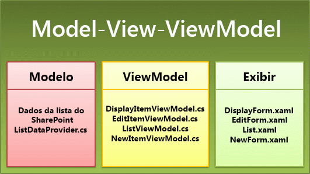
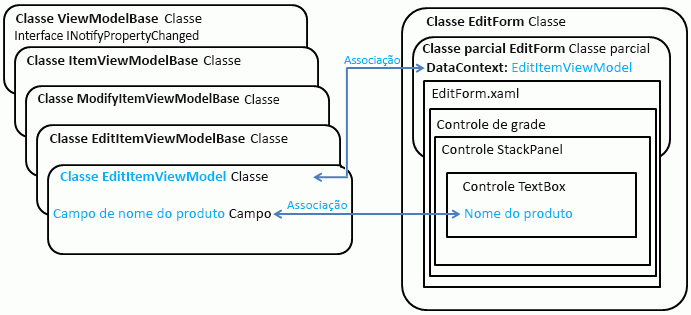

# Arquitetura do modelo de Aplicativo de Lista do SharePoint para Windows Phone
Compreenda o padrão de design de projetos criados do modelo de Aplicativo de Lista do SharePoint para Windows Phone.
O modelo de Aplicativo de Lista do SharePoint para Windows Phone instalado pelo Software Development Kit do SharePoint para Windows Phone foi projetado para gerar aplicativos Windows Phone baseados em um padrão que separa partes do projeto em diferentes componentes. O modelo faz o trabalho de criar as classes e os arquivos para estabelecer o padrão, permitindo que os desenvolvedores se concentrem em estender os projetos gerados de acordo com seus requisitos específicos, sua lógica de negócios e seus dados.
  
    
    

## O modelo de Aplicativo de Lista do SharePoint para Windows Phone e o padrão de design MVVM

O modelo de Aplicativo de Lista do SharePoint para Windows Phone gera um projeto Visual Studio 2010 para um aplicativo Windows Phone baseado no Silverlight desenvolvido de acordo com um padrão de design de software conhecido como o padrão MVVM (View-Model-ViewModel). O padrão MVVM é uma maneira de organizar e dividir códigos em um projeto em camadas gerenciáveis, que podem ser desenvolvidas, testadas e modificadas de forma independente. É um padrão de desenvolvimento particularmente eficaz para projetos do WPF (Windows Presentation Foundation) e Silverlight pois, dentre outras vantagens, permite que a camada de apresentação de determinado aplicativo tenha uma dependência menos rígida da estrutura dos dados subjacentes, liberando os desenvolvedores para adaptar a camada de apresentação para diferentes contextos (por exemplo, navegadores da Web, interfaces de dispositivo móvel ou aplicativos da área de trabalho), ao mesmo tempo que mantém as mesmas estruturas de dados subjacentes.
  
    
    
Em vez de uma abordagem mais simples de, digamos, escrever todo o código de gerenciamento de dados nos arquivos code-behind associados a arquivos XAML específicos em um aplicativo do Silverlight, a organização de um projeto de acordo com o padrão MVVM envolve um investimento inicial adicional de esforço para planejar e desenvolver as classes necessárias, o modelo de herança e os métodos de comunicação entre os componentes do padrão. O modelo de Aplicativo de Lista do SharePoint para Windows Phone cuida desse trabalho inicial de configuração e desenvolvimento para configurar o padrão para você, permitindo que você personalize e estenda o projeto a fim de desenvolver rapidamente um aplicativo MVVM funcional.
  
    
    
Os três principais componentes ou camadas do padrão MVVM são View, Model e ViewModel. Em projetos baseados no modelo de Aplicativo de Lista do SharePoint para Windows Phone, esses componentes são implementados por vários arquivos de projeto, conforme mostrado na Figura 1.
  
    
    

**Figura 1. Arquivos do Aplicativo de Lista do SharePoint para Windows Phone no padrão MVVM**

  
    
    

  
    
    

  
    
    
As seções a seguir explicam alguns detalhes relacionados à implementação desses componentes no modelo de Aplicativo de Lista do SharePoint para Windows Phone.
  
    
    

### O componente Model

O componente Model no padrão MVVM refere-se às classes e estruturas usadas para representar os dados de um aplicativo. Para um aplicativo baseado em uma lista do SharePoint, a lista e seus itens servem como os dados subjacentes. No Aplicativo de Lista do SharePoint para Windows Phone, a classe **ListDataProvider** manipula as operações padrão de modelo de objeto do cliente do SharePoint para a conexão a uma lista do SharePoint; por exemplo, criar uma instância da classe **ClientContext** e definir suas propriedades. Os detalhes exatos da implementação da classe **ListDataProvider** no modelo dependem das opções especificadas nas etapas do Assistente do Aplicativo de Telefone do SharePoint durante a criação de um projeto baseado no modelo.
  
    
    
A classe base, **ListDataProviderBase** (no Microsoft.SharePoint.Phone.Application.dll), da qual a classe **ListDataProvider** é derivada, implementa um mecanismo de cache para os dados da lista do SharePoint. Quando os itens da lista são recuperados do servidor, eles são armazenados em cache pela classe **ListDataProvider** na memória local alocada ao aplicativo de telefone e, quando esses itens são necessários no aplicativo, o cache é verificado primeiro para conservar os recursos e reduzir as viagens ao servidor.
  
    
    
Caso você deseje filtrar os dados recuperados da lista do SharePoint ou especificar exatamente quais dados serão recuperados, é possível modificar o código na classe **ListDataProvider** (no arquivo ListDataProvider.cs). As partes do arquivo que você mais provavelmente modificaria para essas finalidades são o método **LoadDataFromServer** e a implementação da classe estática **CamlQueryBuilder**. Você também pode derivar sua própria classe da classe **ListDataProviderBase**. Se você fizer isso, certifique-se de implementar os métodos abstratos da classe base, **LoadData** e **LoadItem**, e também implementar o membro da propriedade **Context** da classe base, fornecendo um método do acessador **get** adequado.
  
    
    

### O componente View

O componente View no padrão MVVM refere-se à interface do usuário de um aplicativo. No aplicativo Windows Phone baseado no Silverlight, o componente View é constituído por arquivos XAML para declarar e qualificar elementos da interface do usuário e arquivos code-behind associados a esses arquivos XAML que implementam manipuladores de eventos e outros códigos para determinar como os usuários interagem com os elementos da interface do usuário.
  
    
    
É importante distinguir entre duas acepções da palavra "modo de exibição" no contexto de desenvolvimento de aplicativos de lista do SharePoint para Windows Phone. Uma lista do SharePoint é associada a um ou mais modos de exibição, por exemplo, o modo de exibição Todos os Itens padrão de uma lista ou o modo de exibição Eventos Atuais de uma lista baseada no modelo de Lista de aplicativos. Esses modos de exibição representam maneiras de organizar e exibir itens de lista em uma lista do SharePoint. Dependendo do tipo de lista do SharePoint (e se foram adicionados modos de exibição personalizados à lista) ao qual o aplicativo é direcionado, os modos de exibição associados à lista, tais como Todas as Tarefas ou Eventos Atuais, são disponibilizados para você como opções para incluir no aplicativo no Assistente do Aplicativo de Telefone do SharePoint durante a criação de um projeto com base no modelo. Se você incluir determinado modo de exibição, o modelo gerará um controle **PivotItem** (contido em um controle **Pivot**) para renderizar o modo de exibição da lista.
  
    
    
Essa acepção do termo "modo de exibição" deve ser distinta de quando o termo se aplica aos Modos de Exibição do modelo. Em um projeto baseado no modelo de Aplicativo de Lista do SharePoint para Windows Phone, os Modos de Exibição (implementados como arquivos XAML na pasta Modos de Exibição do projeto) referem-se conceitualmente ao componente View do padrão MVVM. Em outras palavras, os Modos de Exibição do projeto representam a camada de apresentação dos dados (ou Modelo) de determinada entidade. Nesse caso, a entidade é uma lista ou um item de lista do SharePoint.
  
    
    
Embora o formulário de Lista (List.xaml) do projeto possa ser considerado um correspondente ao modo de exibição padrão associado a uma lista do SharePoint, a distinção conceitual entre o modo de exibição padrão de uma lista do SharePoint e o Modo de Exibição, conforme representado pelo fomulário de Lista ainda deve ser mantido, pois o formulário de Lista do projeto não é necessariamente mapeado para o modo de exibição padrão da lista no servidor. Se, por exemplo, você modificar o modo de exibição de lista padrão no servidor (digamos, com a especificação de uma ordem de classificação específica ou com a exibição de determinados campos e outros não), as modificações não serão representadas no XAML que constitui o formulário de Lista do projeto. Você define a ordem na qual os itens são mostradas no formulário de lista em seu aplicativo de acordo com suas escolhas no Assistente do Aplicativo de Telefone do SharePoint (ou com base em personalizações posteriores do formulário de Lista), independentemente da ordem configurada para o modo de exibição padrão associado à lista do SharePoint no servidor.
  
    
    
O formulário de Lista representa o Modo de Exibição (ou a camada de apresentação) da lista do SharePoint. Os outros três arquivos View referem-se a itens de lista individuais e podem ser considerados como correspondentes aos formulários disponíveis (de modo geral) no menu de um item de lista no SharePoint.
  
    
    

- O formulário de Exibição (DisplayForm.xaml) corresponde ao formulário de Item de Modo de Exibição (DispForm.aspx) de uma lista do SharePoint. Este formulário apresenta um Modo de exibição de um item individual em uma lista do SharePoint.
    
  
- O formulário de Edição (EditForm.xaml) corresponde ao formulário de Edição de Itens (EditForm.aspx) de uma lista do SharePoint. Este formulário apresenta um Modo de Exibição de determinado item conforme é exposto para edição.
    
  
- O arquivo do formulário Novo (NewForm.xaml) corresponde ao formulário Novo Item (NewForm.aspx) de uma lista do SharePoint. Este formulário apresenta um Modo de Exibição de determinado item que será criado e adicionado à lista.
    
  
O formulário Lista é sempre incluído por padrão em um projeto baseado no modelo de Aplicativo de Lista do SharePoint para Windows Phone. Os arquivos XAML para os outros formulários na pasta Views do projeto são gerados de acordo com as operações da lista (New, Display ou Edit) selecionadas no Assistente do Aplicativo de Telefone do SharePoint.
  
    
    

### O componente ViewModel

O componente ViewModel no padrão MVVM destina-se a atuar como um tipo de agente para facilitar as interações entre o componente View e o componente Model, ao mesmo tempo que separa o componente View do componente Model, para que seja mais fácil alterar um sem afetar o outro. A rigor, o componente ViewModel poderia ser considerado parte da camada de apresentação, pois ele geralmente inclui uma lógica para "moldar" dados subjacentes para a apresentação no componente View. Em projetos baseados no modelo de Aplicativo de Lista do SharePoint para Windows Phone, o ViewModels implementa o código de associação dos dados da lista do SharePoint recuperados do componente Model (ou seja, de um objeto da classe **ListDataProvider**) para os controles de interface do usuário em uma parte do componente View (por exemplo, o formulário Edição). Dependendo do tipo de controle usado para exibir os dados da lista e o tipo de dados (ou seja, se o tipo de campo do item de lista é texto ou dados numéricos ou algo parecido com um campo de Opções do SharePoint), o ViewModel primeiro processa ou converte os dados de forma que possam estar associados a determinado controle de interface do usuário.
  
    
    
Especificamente, as classes ViewModel do projeto (por exemplo, a classe **EditItemViewModel**) são derivadas de uma classe base **ViewModelBase** (no Microsoft.SharePoint.Phone.Application.dll), que implementa a interface **INotifyPropertyChanged** para que os controles do Silverlight que constituem a interface do usuário do aplicativo possam ser atualizados quando houver alteração nos valores nos dados subjacentes, bem como as alterações (seguindo a outra direção) nos valores armazenados nos controles de interface do usuário possam ser aplicadas aos dados subjacentes (se forem bidirecionais, a associação será configurada para um controle).
  
    
    
A Figura 2 mostra uma representação simplificada da hierarquia de herança de classe para a classe **EditItemViewModel** e a associação de determinado controle de interface do usuário no formulário Edição com o campo correspondente no ViewModel.
  
    
    

**Figura 2. As classes EditItemViewModel e EditForm**

  
    
    

  
    
    

  
    
    
A classe **EditForm** (que representa o componente View do padrão MVVM) está definido e implementado por dois arquivos, o arquivo EditForm.xaml e seu arquivo code-behind associado, EditForm.xaml.cs. No arquivo EditForm.xaml.cs, a classe **EditItemViewModel** (representando o componente ViewModel do padrão MVVM) é acoplada a View no arquivo EditForm.xaml.cs definindo a propriedade **DataContext** da classe **EditForm** a um objeto da classe **EditItemViewModel**.
  
    
    
Com frequência, designs de software baseados no padrão MVVM restringem a lógica de negócios e as rotinas de validação ao componente Model do padrão. No entanto, em projetos baseados no modelo de Aplicativo de Lista do SharePoint para Windows Phone, algumas operações que, normalmente, são consideradas parte do componente Model foram implementadas no componente ViewModel para tornar mais conveniente para os desenvolvedores estenderem os projetos, em detrimento de obscurecer ligeiramente a distinção conceitual entre a camada de dados (Model) e a camada de apresentação (ViewModel). Por exemplo, as classes ViewModel para edição e criação de itens da lista (ou seja, as classes **EditItemViewModel** e **NewItemViewModel**) expõem um método **Validate** que os desenvolvedores podem substituir para implementar a validação de dados inseridos pelos usuários. (Para obter informações sobre como implementar a validação de dados com esses ViewModels, veja [Como: implementar a validação de dados e de lógica de negócios em um aplicativo do Windows Phone para o SharePoint 2013](how-to-implement-business-logic-and-data-validation-in-a-windows-phone-app-for-s.md).)
  
    
    

    
> **OBSERVAçãO**
> O objeto **ListDataProvider** somente carrega os dados do servidor. Outras operações, tais como **Add**, **Update** e **Delete**, são executadas no próprio ViewModel, seguido de uma chamada de atualização para atualizar os dados de ViewModel por meio do servidor. Este design reduz o acúmulo do código. 
  
    
    

## O arquivo App.xaml e o modelo de aplicativo do Silverlight

O arquivo App.xaml e seu arquivo code-behind associado, App.xaml.cs, são componentes padrão de um aplicativo do Silverlight gerenciado. Os aplicativos que usam a API gerenciada do Silverlight devem incluir uma classe derivada da classe  [Application](http://msdn.microsoft.com/pt-br/library/system.windows.application%28VS.95%29.aspx) do Silverlight, a fim de implementar o modelo de aplicativo do Silverlight. A classe **Application** dá suporte a eventos do ciclo de vida do aplicativo e meios para o gerenciamento de recursos, como imagens, cadeias de caracteres e modelos XAML.
  
    
    
Para obter informações sobre os tipos de modificações que você poderia fazer ao arquivo App.xaml.cs em seus projetos, veja  [Como: armazenar e recuperar SharePoint listam itens em um Windows Phone](how-to-store-and-retrieve-sharepoint-list-items-on-a-windows-phone.md) sobre como implementar manipuladores de eventos no arquivo App.xaml.cs para preservar as informações de estado do aplicativo, e [Como: usar SharePoint 2013 várias listas em um aplicativo do Windows Phone](how-to-use-multiple-sharepoint-2013-lists-in-a-windows-phone-app.md) sobre como criar uma instância e configurar objetos **ListDataProvider** adicionais no App.xaml.cs.
  
    
    

## Recursos adicionais

-  [Usando o padrão Model-View-ViewModel](http://msdn.microsoft.com/pt-br/library/hh821028.aspx)
    
  
-  [Arquitetura de controle dinâmico para Windows Phone](http://msdn.microsoft.com/pt-br/library/ff941097%28VS.92%29.aspx)
    
  
-  [Modelo de aplicativo do Silverlight](http://msdn.microsoft.com/pt-br/library/cc872869%28VS.95%29.aspx)
    
  
-  [Developing a Windows Phone Application using the MVVM Pattern (Desenvolvendo um aplicativo Windows Phone usando o padrão MVVM)](http://msdn.microsoft.com/pt-br/library/hh848247.aspx)
    
  
-  [Aplicativos do WPF com o padrão de design Model-View-ViewModel](http://msdn.microsoft.com/pt-br/magazine/dd419663.aspx)
    
  
-  [Windows Phone SDK 8.0](http://www.microsoft.com/en-us/download/details.aspx?id=35471)
    
  
-  [SDK do Microsoft SharePoint para Windows Phone 8](http://www.microsoft.com/en-us/download/details.aspx?id=36818)
    
  
-  [SDK do Microsoft SharePoint para Windows Phone 7.1](http://www.microsoft.com/en-us/download/details.aspx?id=30476)
    
  

