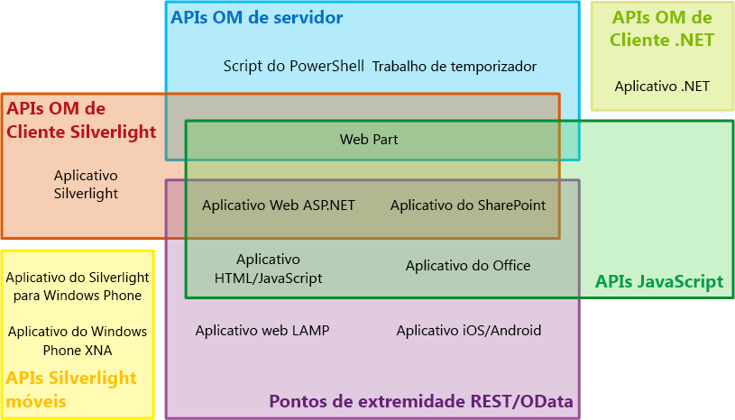
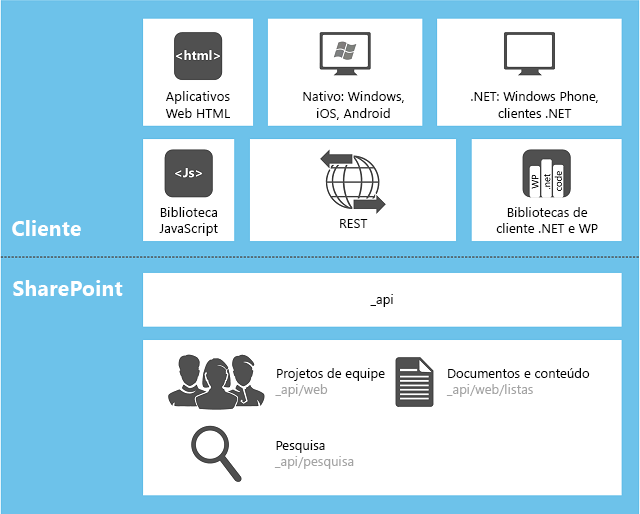

# Escolha o conjunto de APIs certo no SharePoint 2013
Saiba mais sobre os vários conjuntos de APIs que são fornecidos no SharePoint 2013, incluindo o modelo de objeto servidor e os diversos modelos de objeto cliente e o serviço Web REST/OData.
**Assista ao vídeo: Estratégia de SharePoint 2013 para o CSOM (modelo de objeto cliente) do SharePoint e o REST**

  
    
    

  
    
    

  
    
    

  
    
    

  
    
    

## Fatores que determinam qual conjunto de APIs deve ser usado

Você pode escolher dentre vários conjuntos de APIs para acessar a plataforma SharePoint 2013. A opção a ser usada depende dos seguintes fatores:
  
    
    

- **O tipo de aplicativo.** As possibilidades incluem, sem limitação, os seguintes itens, que não são categorias mutuamente exclusivas: um Suplemento do SharePoint, uma Web Part em uma página do SharePoint, um aplicativo Silverlight em execução em um computador cliente ou em um dispositivo móvel cliente, um aplicativo ASP.NET exposto no SharePoint por um IFrame, um JavaScript em execução em uma página de site do SharePoint, uma página de aplicativo SharePoint, um aplicativo Microsoft .NET Framework em execução em um computador cliente , um script do Windows PowerShell e um trabalho do temporizador em execução em um servidor SharePoint.
    
  
- **Suas habilidades existentes.** De forma surpreendente, você pode criar aplicativos no SharePoint 2013 sem precisar aprender muito sobre a programação no SharePoint. Você pode iniciar diretamente o desenvolvimento no SharePoint se já tiver experiência com qualquer um dos seguintes modelos de programação:
    
  - JavaScript
    
  
  - ASP.NET
    
  
  - REST/OData
    
  
  - .NET Framework
    
  
  - Windows Phone
    
  
  - Silverlight
    
  
  - Windows PowerShell
    
  
- **O dispositivo em que o código é executado.** As possibilidades incluem um servidor no farm do SharePoint, um servidor externo, como um servidor na nuvem, um computador cliente e um dispositivo móvel.
    
  
Este tópico fornece uma visão geral dos vários conjuntos de API que são fornecidos pelo SharePoint 2013. A Figura 1 mostra quais conjuntos de APIs podem ser usados para desenvolver cada um dos 13 aplicativos comuns relacionados ao SharePoint. Para muitos aplicativos, há mais de uma opção de API.
  
    
    

**Figura 1. Tipos de extensão do SharePoint selecionados e conjuntos de APIs do SharePoint**

  
    
    

  
    
    

  
    
    

  
    
    
A tabela a seguir fornece orientação sobre o conjunto de APIs a ser usado para uma lista selecionada de projetos de extensibilidade comuns do SharePoint. As demais seções deste tópico descrevem os diversos conjuntos de APIs.
  
    
    

|**Se você quiser fazer isto...**|**... use estas APIs**|
|:-----|:-----|
|Criar um aplicativo Web do ASP.NET que executa operações CRUD (criação/leitura/atualização/exclusão) em um firewall no SharePoint ou dados externos apresentados no SharePoint por um tipo de conteúdo externo do Microsoft Business Connectivity Services (BCS)    |Modelo de objeto cliente JavaScript    |
|Criar um aplicativo Web ASP.NET que execute operações CRUD em dados do SharePoint ou em dados externos apresentados no SharePoint por um tipo de conteúdo externo do BCS, mas que não precise chamar o SharePoint através de um firewall    |Modelo de objeto cliente .NET Framework, modelo de objeto cliente Silverlight ou pontos de extremidade REST/OData    |
|Criar um aplicativo Web LAMP que execute operações CRUD em dados do SharePoint ou em dados externos apresentados no SharePoint por um tipo de conteúdo externo do BCS    |Pontos de extremidade REST/OData    |
|Criar um aplicativo Windows Phone que execute operações CRUD em dados do SharePoint    |Modelo de objeto cliente móvel    |
|Criar um aplicativo Windows Phone que use o Serviço de Notificação por Push da Microsoft para alertar o dispositivo móvel de eventos no SharePoint    |Modelo de objeto cliente móvel e o modelo de objeto servidor    |
|Criar um aplicativo para iOS ou Android que execute operações CRUD em dados do SharePoint    |Pontos de extremidade REST/OData    |
|Criar um aplicativo .NET Framework que execute operações CRUD em dados do SharePoint    |Modelo de objeto cliente .NET Framework    |
|Criar um aplicativo Silverlight que execute operações CRUD em dados do SharePoint    |Modelo de objeto cliente Silverlight    |
|Criar um aplicativo HTML/JavaScript que execute operações CRUD em dados do SharePoint    |Modelo de objeto cliente JavaScript    |
|Criar um Suplemento do Office que funcione com o SharePoint    |Modelo de objeto cliente JavaScript    |
|Criar um comando personalizado do Windows PowerShell    |Modelo de objeto servidor    |
|Criar um trabalho de temporizador    |Modelo de objeto servidor    |
|Criar uma extensão da Administração Central    |Modelo de objeto servidor    |
|Criar uma identidade visual consistente em um farm do SharePoint inteiro    |Modelo de objeto servidor    |
|Criar uma Web Part, uma página de aplicativo ou um controle de usuário do ASP.NET personalizado    |Modelo de objeto servidor    > **IMPORTANTE**> Se a funcionalidade que você deseja oferecer aos clientes não estiver voltada para a administração do SharePoint em um escopo mais amplo do que o conjunto de sites, recomendamos que, em vez de usar o modelo de objeto servidor, você crie um Suplemento do SharePoint que inclua um aplicativo Web ASP.NET remoto com controles de usuário e Web Parts personalizados, conforme necessário. Confira as duas linhas superiores da tabela.           |
   

## Modelo de objeto servidor

O maior conjunto de APIs está no modelo de objeto servidor de classes gerenciadas. No nível do SharePoint Foundation 2013, esse modelo de objeto inclui classes e membros que habilitam o controle programático de site básico e estrutura de lista do SharePoint Foundation. A maioria dessas classes está no namespace  [Microsoft.SharePoint](https://msdn.microsoft.com/library/Microsoft.SharePoint.aspx) . Além disso, você pode estender quase todos os componente do SharePoint Foundation usando o modelo de objeto servidor, incluindo fluxos de trabalho, alertas, Web Parts, pesquisa básica e Microsoft Business Connectivity Services (BCS). O modelo de objeto servidor também inclui um conjunto abrangente de APIs para habilitar extensões do sistema de administração e segurança do SharePoint Foundation, incluindo backup, integridade e diagnóstico de farm, logs, gerenciamento de farms e aplicativos Web, atualização, implantação, armazenamento em cache e personalização do Windows PowerShell.
  
    
    
No nível do SharePoint Server 2013, muito mais classes são adicionadas para habilitar a programação de ECM (Gerenciamento de Conteúdo Corporativo), perfis de usuário, taxonomia, pesquisa avançada e outros recursos do SharePoint Server 2013.
  
    
    
Você pode usar o  [LINQ to Objects](http://msdn.microsoft.com/pt-br/library/bb397919.aspx) para consultar qualquer conjunto de **IEnumerable** na memória, mas um [provedor do LINQ to SharePoint](http://msdn.microsoft.com/library/3fa2dc5f-d308-4337-aefd-191a5df8dbbe%28Office.15%29.aspx) habilita consultas diretas das listas nos bancos de dados de conteúdo do SharePoint. A rigor, esse provedor não está disponível com nenhum outro conjunto de APIs discutido neste tópico. No entanto, existem maneiras de usar a sintaxe LINQ na maioria dos outros.
  
    
    
Os assemblies que definem as classes internas do servidor são instalados no cache global de assemblies de cada servidor quando o SharePoint 2013 é instalado. Quando você programa em relação ao modelo de objeto servidor, os assemblies são instalados como soluções de farm no cache global de assemblies.
  
    
    

> **OBSERVAçãO**
> O desenvolvimento de novo soluçăos em área restrita em relação ao SharePoint 2013 é preterido em favor do desenvolvimento de Suplementos do SharePoint, mas o soluçăos em área restrita ainda pode ser instalado para conjuntos de sites no SharePoint 2013. Os assemblies dessas soluções permanecem no pacote, exceto quando realmente estão em uso. Nesse momento, são instalados temporariamente em uma pasta no servidor. Para obter mais informações, confira  [Where are Assemblies in Sandboxed Solutions Deployed?](http://msdn.microsoft.com/library/dadbb20b-1bf7-442c-9eeb-bd9f01dbda45%28Office.15%29.aspx). 
  
    
    

### Limitações para quando você pode usar o modelo de objeto servidor

A lógica personalizada em Suplementos do SharePoint é sempre distribuída "para baixo" até o cliente ou "para cima" até a nuvem (ou "para cima" até algum servidor fora do farm do SharePoint). Em todos esses modelos de distribuição, um dos modelos de objeto cliente ou os pontos de extremidade REST/OData devem ser usados. (Você não pode usar o modelo de objeto servidor em um Suplemento do SharePoint.) Por exemplo, se o aplicativo contém páginas hospedadas do SharePoint, essas páginas podem acessar dados do SharePoint usando o modelo de objeto cliente JavaScript. As páginas também podem expor aplicativos Silverlight que usam o modelo de objeto cliente Silverlight do SharePoint 2013. Para obter mais informações sobre Suplementos do SharePoint, confira  [Aspectos importantes do Add-in SharePoint arquitetura e desenvolvimento cenário](http://msdn.microsoft.com/library/ae96572b-8f06-4fd3-854f-fc312f7f2d88%28Office.15%29.aspx).
  
    
    

## Modelos de objeto cliente para código gerenciado

O SharePoint 2013 tem três modelos de objeto cliente para código gerenciado: .NET, Silverlight e móvel.
  
    
    

### Modelo de objeto cliente .NET

O modelo de objeto SharePoint 2013 para .NET Framework é usado em aplicativos .NET Framework executados em um cliente Windows que não seja para telefone. Qualquer um dos seguintes itens conta como um cliente:
  
    
    

- O computador de um usuário
    
  
- Um servidor externo ao farm do SharePoint 2013
    
  
- Uma função Web ou de trabalho no Microsoft Azure
    
  
Quase todas as classes no modelo de objeto servidor de lista e site principal têm uma classe correspondente no modelo de objeto cliente .NET Framework. Além disso, o modelo de objeto cliente .NET Framework expõe um conjunto completo de APIs para estender outros recursos, incluindo alguns recursos do SharePoint Server 2013 como ECM, taxonomia, perfis de usuário, pesquisa avançada, análise, BCS e outros.
  
    
    
Para melhorar o desempenho, linhas de código escritas em relação ao modelo de objeto cliente .NET Framework são enviadas ao servidor SharePoint em lotes, sendo convertidas em código do servidor e executadas. Os resultados consultados e o novo estado de todas as variáveis são então retornados ao cliente. Como desenvolvedor, você determina se um lote é executado de maneira síncrona ou assíncrona. Em um lote síncrono, o aplicativo .NET Framework aguarda os resultados retornados do servidor antes de continuar; em um lote assíncrono, o processamento no cliente continua imediatamente, e a IU (interface do usuário) continua a responder.
  
    
    
Você pode usar a sintaxe de consulta LINQ no código de cliente para consultar qualquer objeto **IEnumerable**, inclusive objetos SharePoint 2013 que implementam **IEnumerable**. No entanto, ao fazer isso, você usa o  [LINQ to Objects](http://msdn.microsoft.com/pt-br/library/bb397919.aspx), não o  [Provedor do LINQ to SharePoint](http://msdn.microsoft.com/library/3fa2dc5f-d308-4337-aefd-191a5df8dbbe%28Office.15%29.aspx). Portanto, a documentação deste último não é relevante para o código do cliente.
  
    
    
Os assemblies para o modelo de objeto cliente .NET Framework devem ser instalados no cliente. Eles são incluídos em um pacote redistribuível que você pode obter nos  [Componentes de cliente SharePoint](http://www.microsoft.com/en-us/download/details.aspx?id=35585).
  
    
    
Para obter exemplos de como usar o modelo de objeto .NET Framework, confira  [Concluir operações básicas usando o código de biblioteca do cliente SharePoint 2013](http://msdn.microsoft.com/library/5a69c9e3-73bf-4ed5-bc19-182056bdb394%28Office.15%29.aspx).
  
    
    

> **OBSERVAçãO**
> Você também pode usar os pontos de extremidade REST/OData do SharePoint em um aplicativo .NET Framework. Para ver uma comparação entre o modelo de objeto cliente .NET Framework e os pontos de extremidade REST/OData do SharePoint, confira a seção  [Pontos de extremidade REST/OData](#RESTOData) mais adiante neste artigo.
  
    
    

### Modelo de objeto cliente Silverlight

O modelo de objeto SharePoint 2013 para Silverlight é usado em aplicativos Silverlight, independentemente de onde o arquivo .xap compilado é mantido. Pode ser em uma biblioteca de ativos em um site do SharePoint 2013, em um computador cliente, no armazenamento na nuvem ou em um servidor externo. Normalmente, um aplicativo Silverlight é apresentado no SharePoint 2013 em um objeto  [SilverlightWebPart](https://msdn.microsoft.com/library/Microsoft.SharePoint.WebPartPages.SilverlightWebPart.aspx) . O modelo de objeto cliente Silverlight no SharePoint 2013 é quase idêntico ao modelo de objeto cliente .NET Framework e inclui suporte para as mesmas áreas de extensibilidade. A principal diferença é que, na versão Silverlight, todos os lotes de comandos são enviados ao servidor de forma assíncrona para que a interface do usuário do aplicativo permaneça ativa.
  
    
    
Os assemblies do modelo de objeto cliente Silverlight são mantidos em cada servidor SharePoint 2013 em %ProgramFiles%\\Common Files\\Microsoft Shared\\web server extensions\\15\\TEMPLATE\\LAYOUTS\\ClientBin. Eles não precisam ser instalados no computador que está executando o aplicativo Silverlight, embora você tenha a opção de fazer isso. Além disso, você pode empacotá-los no arquivo .xap do aplicativo.
  
    
    
Os arquivos .xap do Silverlight podem ser incluídos em Suplementos do SharePoint, inclusive aplicativos hospedados do SharePoint. Neste último caso, o arquivo .xap é implantado em uma biblioteca no aplicativo Web. (Para obter mais informações sobre aplicativos Web, confira  [Host webs, suplemento webs e componentes do SharePoint no SharePoint 2013](http://msdn.microsoft.com/library/b791cdf5-8aa2-47fa-bc4c-aee437354759%28Office.15%29.aspx).) Isso torna um aplicativo Silverlight uma maneira útil de incluir código personalizado do SharePoint em um aplicativo, pois código personalizado do servidor não é permitido no Suplementos do SharePoint. Também habilita desenvolvedores do Silverlight a usar suas habilidades existentes para criar aplicativos do SharePoint 2013 com curva de aprendizado mínima.
  
    
    

> **OBSERVAçãO**
> Você também pode usar os pontos de extremidade REST/OData do SharePoint em um aplicativo Silverlight. Para ver uma comparação entre o modelo de objeto cliente Silverlight e os pontos de extremidade REST/OData do SharePoint, confira a seção  [Pontos de extremidade REST/OData](#RESTOData) mais adiante neste artigo.
  
    
    

### Modelo de objeto cliente

Uma versão especial do modelo de objeto cliente Silverlight está disponível para dispositivos Windows Phone. Ele inclui algumas APIs adicionais que são relevantes somente para telefones, como APIs que habilitam um aplicativo de telefone a se registrar para receber notificações do Serviço de Notificação por Push da Microsoft. Ele dá suporte a toda a funcionalidade principal do SharePoint 2013; no entanto, não dá suporte a nenhuma das áreas de extensibilidade não principais que têm suporte nos outros dois modelos de objeto cliente para código gerenciado. Para acessar essas áreas adicionais, use os pontos de extremidade REST/OData do SharePoint no aplicativo móvel. Confira a seção  [Pontos de extremidade REST/OData](#RESTOData) mais adiante neste artigo.
  
    
    
Os assemblies do modelo de objeto móvel são persistentes em cada servidor SharePoint 2013 em %ProgramFiles%\\Common Files\\Microsoft Shared\\web server extensions\\15\\TEMPLATE\\LAYOUTS\\ClientBin. Você os empacota no arquivo .xap do aplicativo do Windows Phone.
  
    
    

## Modelo de objeto JavaScript

O SharePoint 2013 fornece um modelo de objeto JavaScript para uso em script embutido ou arquivos .js separados. Ele inclui a mesma funcionalidade que os modelos de objeto cliente .NET Framework e Silverlight. Assim como o modelo de objeto cliente Silverlight, o modelo de objeto JavaScript é uma maneira útil de incluir código personalizado do SharePoint em um aplicativo, pois código personalizado no servidor não é permitido em Suplementos do SharePoint. Ele também habilita desenvolvedores da Web a usar suas habilidades de JavaScript existentes para criar aplicativos do SharePoint com curva de aprendizado mínima.
  
    
    
Assim como os modelos de objeto cliente de código gerenciado, a infraestrutura do JavaScript para SharePoint 2013 interage com os servidores de farm em lotes. Os lotes sempre são executados de forma assíncrona. Além disso, agora é possível acessar dados do SharePoint em todos os domínios no JavaScript (mas apenas os dados que estão no mesmo conjunto de sites pai), o que não era permitido em versões anteriores do SharePoint. Para obter mais informações, confira  [Acessar dados do SharePoint 2013 de suplementos usando a biblioteca de domínio cruzado](http://msdn.microsoft.com/library/bc37ff5c-1285-40af-98ae-01286696242d%28Office.15%29.aspx). Os dados são retornados do servidor no JavaScript Object Notation (JSON).
  
    
    
O modelo de objeto JavaScript é definido em um conjunto de arquivos *.js localizados em %ProgramFiles%\\Common Files\\Microsoft Shared\\web server extensions\\15\\TEMPLATE\\LAYOUTS em cada servidor.
  
    
    
Para obter exemplos de como usar o modelo de objeto .NET Framework, confira  [Como concluir operações básicas usando código da biblioteca do JavaScript no SharePoint 2013](http://msdn.microsoft.com/library/29089af8-dbc0-49b7-a1a0-9e311f49c826%28Office.15%29.aspx).
  
    
    

> **OBSERVAçãO**
> Você também pode usar os pontos de extremidade REST/OData do SharePoint em um aplicativo JavaScript. Para ver uma comparação entre o modelo de objeto cliente JavaScript e os pontos de extremidade REST/OData do SharePoint, confira a próxima seção,  [Pontos de extremidade REST/OData](#RESTOData). 
  
    
    

## Pontos de extremidade REST/OData

Para cenários em que você precisa acessar entidades do SharePoint por meio de tecnologias de cliente que não usam o JavaScript e não são compiladas nas plataformas .NET Framework ou Silverlight, o SharePoint 2013 fornece uma implementação de um serviço Web REST (Transferência de Estado Representacional) que usa o  [protocolo OData](http://www.odata.org/) para executar operações CRUD em dados de lista do SharePoint. Além disso, quase todas as APIs nos modelos de objeto cliente têm um ponto de extremidade REST correspondente. Isso habilita o código a interagir diretamente com artefatos do SharePoint usando qualquer tecnologia que dê suporte a solicitações e respostas HTTP padrão. Para usar os recursos REST internos do SharePoint 2013, o código cria uma solicitação HTTP RESTful para um ponto de extremidade que corresponde à API do modelo de objeto cliente desejado. O serviço Web client.svc manipula a solicitação HTTP e fornece uma resposta no formato Atom ou JSON.
  
    
    
Para obter mais informações sobre como usar o serviço Web REST/OData, confira o nó  [Programação usando o serviço SharePoint 2013 REST](use-odata-query-operations-in-sharepoint-rest-requests.md). Para obter exemplos, confira o tópico  [Realizar operações básicas usando os pontos de extremidade REST do SharePoint 2013](http://msdn.microsoft.com/library/e3000415-50a0-426e-b304-b7de18f2f7d9%28Office.15%29.aspx).
  
    
    

### Comparação da programação REST/OData à programação de modelo de objeto cliente

Em algumas situações, pode ser preferível usar os pontos de extremidade REST até mesmo em aplicativos para os quais um modelo de objeto SharePoint está disponível, especialmente para desenvolvedores que não têm experiência com desenvolvimento no Windows. A tabela a seguir fornece uma comparação dos principais recursos dessas opções de programação para um desenvolvedor que esteja criando um aplicativo em uma plataforma Windows ou com uma plataforma que dê suporte a JavaScript.
  
    
    

|**Recurso**|**Modelos de objeto .NET Framework ou Silverlight**|**Modelo de objeto JavaScript**|**Pontos de extremidade REST/OData chamados de uma plataforma Windows ou JavaScript**|
|:-----|:-----|:-----|:-----|
|Programação orientada a objeto    |Sim    |Sim    |Não    |
|Processamento em lotes    |Sim    |Sim    |Sim    |
|APIs para processamento condicional e manipulação de exceções    |Sim    |Não    |Não    |
|Disponibilidade da sintaxe LINQ    |Sim    |Não    |Não    |
|Combinação de dados de lista de diferentes aplicativos Web do SharePoint    |Sim    |Não    |Sim    |
|Familiaridade para desenvolvedores experientes de REST/OData    |Não    |Não    |Sim    |
|Semelhança à programação não Windows ou à programação em JavaScript    |Não    |Sim    |Sim    |
|Tipos fortes para campos de item de lista    |Não (exceto com LINQ)    |Não    |Sim, da plataforma Windows          Não, do JavaScript    |
|Aproveitamento de jQuery, Knockout e outras bibliotecas JavaScript    |Não    |Sim    |Não, da plataforma Windows          Sim, do JavaScript    |
   

## Estrutura WCF Data Services

Se você prefere usar a sintaxe LINQ em aplicativos cliente .NET Framework ou Silverlight, o SharePoint 2013 dá suporte ao  [WCF Data Services](http://msdn.microsoft.com/pt-br/library/cc668792.aspx) como um provedor de LINQ. Você pode direcionar o listdata.svc (somente para dados de lista), como nas versões anteriores do SharePoint Foundation, ou pode direcionar o mesmo client.svc que dá suporte à interface de OData para obter acesso a todas as entidades do SharePoint, além de dados de lista. Para obter mais informações, confira [Query SharePoint Foundation with ADO.NET Data Services](http://msdn.microsoft.com/library/3e3e16f7-620a-4710-a3f3-19d0236f4b4a%28Office.15%29.aspx).
  
    
    
A Figura 2 ilustra a relação entre as várias APIs de cliente, os diversos tipos de aplicativos cliente e o SharePoint. As várias URLs _api* são as URLs relativas ao farm para os pontos de extremidade REST. Para obter mais informações, confira o tópico  [Como saber mais sobre o serviço REST do SharePoint 15](get-to-know-the-sharepoint-2013-rest-service.md#bk_learnmore).
  
    
    

**Figura 2. Aplicativos cliente e APIs no SharePoint**

  
    
    

  
    
    

  
    
    

  
    
    

  
    
    

## Conjuntos de APIs preteridos

Dois conjuntos de APIs ainda têm suporte na estrutura do SharePoint 2013 para compatibilidade com versões anteriores, mas recomendamos que você não os use para novos projetos: os  [serviços Web ASP.NET (asmx)](http://msdn.microsoft.com/library/c587ee90-1f88-43f3-b1a7-5f3072d038f8%28Office.15%29.aspx) e as chamadas [RPC (chamadas de procedimento remoto) diretas para o arquivo owssvr.dll](http://msdn.microsoft.com/library/4aa5c82b-90fb-4be5-b30c-d35ecae42a81%28Office.15%29.aspx).
  
    
    

## Recursos adicionais

-  [Visão geral do desenvolvimento do SharePoint 2013](sharepoint-2013-development-overview.md)
    
  
-  [Modelos de programação no SharePoint 2013](programming-models-in-sharepoint-2013.md)
    
  
-  [Suplementos do SharePoint em comparação com soluções do SharePoint](sharepoint-add-ins-compared-with-sharepoint-solutions.md)
    
  
-  [Programação usando o serviço SharePoint 2013 REST](use-odata-query-operations-in-sharepoint-rest-requests.md)
    
  
-  [Realizar operações básicas usando os pontos de extremidade REST do SharePoint 2013](http://msdn.microsoft.com/library/e3000415-50a0-426e-b304-b7de18f2f7d9%28Office.15%29.aspx)
    
  
-  [Concluir operações básicas usando o código de biblioteca do cliente SharePoint 2013](http://msdn.microsoft.com/library/5a69c9e3-73bf-4ed5-bc19-182056bdb394%28Office.15%29.aspx)
    
  
-  [Como concluir operações básicas usando código da biblioteca do JavaScript no SharePoint 2013](http://msdn.microsoft.com/library/29089af8-dbc0-49b7-a1a0-9e311f49c826%28Office.15%29.aspx)
    
  
-  [Query SharePoint Foundation with ADO.NET Data Services](http://msdn.microsoft.com/library/3e3e16f7-620a-4710-a3f3-19d0236f4b4a%28Office.15%29.aspx)
    
  

  
    
    
