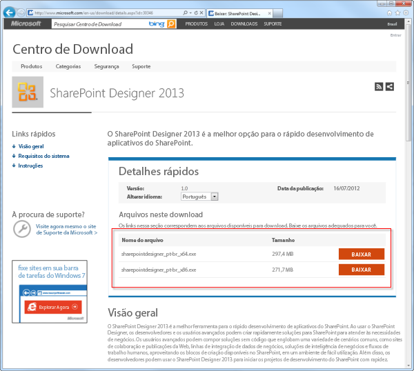
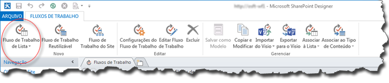
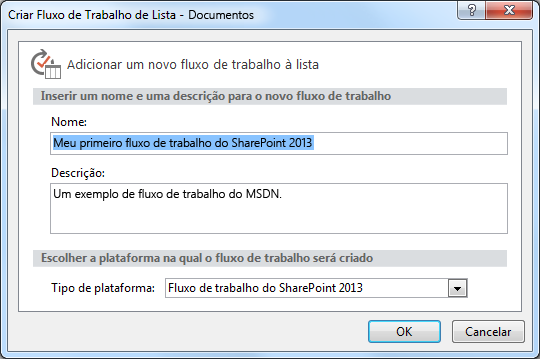
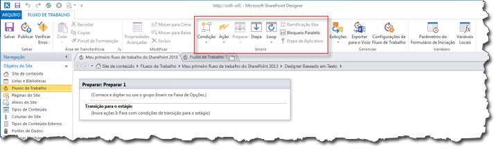

# Criar um fluxo de trabalho usando o SharePoint Designer 2013 e a plataforma Fluxo de Trabalho do SharePoint 2013
Saiba como instalar, abrir e criar um fluxo de trabalho usando o SharePoint Designer 2013 e a plataforma de Fluxo de Trabalho do SharePoint 2013. 
||
|:-----|
||
   

## Instalar o SharePoint Designer 2013

O SharePoint Designer 2013 é um download gratuito. Para baixar e instalar o SharePoint Designer 2013, siga estas etapas: 
  
    
    

### Para instalar o SharePoint Designer 2013

1. Abra o seu navegador da Web e acesse o Centro de Download da Microsoft:  [http://www.microsoft.com/download](http://www.microsoft.com/download.aspx). 
    
  
2. Digite SharePoint Designer 2013 no campo de pesquisa.
    
  
3. Clique no link para o "SharePoint Designer 2013". 
    
  
4. Leia a visão geral, requisitos de sistema e instruções de instalação. Certifique-se de que o seu sistema é compatível. 
    
  
5. Selecione o tipo da sua plataforma: 64 bits ( **x64**) ou 32 bits ( **x86**), como mostrado na figura. 
    
  
6. Siga as instruções para instalar o SharePoint Designer 2013.
    
  

**Figura: página de download do SharePoint Designer 2013**

  
    
    

  
    
    

  
    
    

  
    
    

  
    
    

## Abrir o SharePoint Designer 2013 e conectar a um site do SharePoint 2013

O SharePoint Designer 2013 é instalado como um aplicativo do Office 2013. Para abrir o SharePoint Designer 2013 e conectar a um site do SharePoint 2013, siga estas etapas: 
  
    
    

### Para abrir o SharePoint Designer 2013 e conectar a um site do SharePoint 2013

1. Abra o SharePoint Designer 2013 selecionando-o no menu **Iniciar**. Clique no ícone **Iniciar**, clique em **Todos os Programas**, clique em **Microsoft Office 2013** e, em seguida, clique em **SharePoint Designer 2013**. 
    
  
2. Clique em **Abrir Site** na página inicial do SharePoint Designer 2013.
    
  
3. Entre no site do SharePoint 2013 ao qual deseja se conectar. Por exemplo, http://www.contoso.com/sites/um-site-do-sharepoint
    
  
4. Clique em **Abrir** para abrir o site.
    
  
5. Insira as suas credenciais, se solicitado. (Se a segurança não estiver integrada ao computador em que você entrou, você será solicitado a inserir as suas credenciais). Certifique-se de usar as credenciais com acesso ao site do SharePoint 2013.
    
  

## Criar um fluxo de trabalho de Lista com base na plataforma de Fluxo de Trabalho do SharePoint 2013

O SharePoint Designer 2013 pode ser usado para várias tarefas importantes. O painel de navegação é usado para alternar entre diferentes aspectos do SharePoint Designer 2013. Para criar um novo fluxo de trabalho de Lista com base na plataforma de Fluxo de Trabalho do SharePoint 2013, siga uma destas etapas:
  
    
    

### Para criar um fluxo de trabalho com base na plataforma de Fluxo de Trabalho do SharePoint 2013

1. Clique no nó de Fluxos de Trabalho no painel de Navegação.
    
  
2. Clique na lista suspensa **Fluxo de Trabalho de Lista** na seção **Novo** da faixa de opções, como mostrado na figura.
    
  
3. Selecione a lista que deseja associar ao novo fluxo de trabalho.
    
  
4. Na caixa de diálogo **Criar Fluxo de Trabalho de Lista**, insira um nome e uma descrição para o fluxo de trabalho e certifique-se de que o **Tipo de Plataforma** é definido como **Fluxo de Trabalho do SharePoint 2013**, como mostrado na figura.
    
    > **OBSERVAçãO**
      > Se você não vir o Fluxo de Trabalho do SharePoint 2013 como um tipo de plataforma disponível, o Workflow Manager não está configurado para trabalhar com o farm do SharePoint Server 2013. 
5. Clique em **OK** para criar o fluxo de trabalho.
    
  

**Figura: o botão da faixa de opções para criar um novo fluxo de trabalho de lista**

  
    
    

  
    
    

  
    
    

  
    
    

  
    
    

**Figura: caixa de diálogo Criar Fluxo de Trabalho de Lista**

  
    
    

  
    
    

  
    
    

  
    
    

  
    
    
Agora que o fluxo de trabalho foi criado, você pode adicionar Ações, Condições, Estágios, Etapas e Loops para criar o seu fluxo de trabalho. Esses componentes de fluxo de trabalho estão disponíveis na faixa de opções do SharePoint Designer 2013, como mostrado na figura. 
  
    
    

**Figura: itens de Fluxo de Trabalho da plataforma de Fluxo de Trabalho do SharePoint 2013**

  
    
    

  
    
    

  
    
    

    
> **OBSERVAçãO**
> O procedimento acima é usado para criar um fluxo de trabalho de Lista. Um fluxo de trabalho Reutilizável ou fluxo de trabalho de Site pode ser criado usando o mesmo procedimento com a modificação a seguir. Em vez de selecionar o botão de Fluxo de Trabalho de Lista na faixa de opções, selecione o botão **Fluxo de Trabalho Reutilizável** ou **Fluxo de Trabalho de Site** ao criar o fluxo de trabalho.
  
    
    

Para saber mais sobre os componentes de desenvolvimento de fluxo de trabalho disponíveis, consulte  [Referência rápida de ações de fluxo de trabalho (plataforma de Fluxo de Trabalho do SharePoint 2013)](workflow-actions-quick-reference-sharepoint-2013-workflow-platform.md).
  
    
    

## Recursos adicionais

-  [What's new in workflow in SharePoint Server 2013](http://msdn.microsoft.com/library/6ab8a28b-fa2f-4530-8b55-a7f663bf15ea.aspx)
    
  
-  [Getting started with SharePoint Server 2013 workflow](http://msdn.microsoft.com/library/cc73be76-a329-449f-90ab-86822b1c2ee8.aspx)
    
  
-  [Desenvolvimento de fluxos de trabalho no SharePoint Designer e no Visio](workflow-development-in-sharepoint-designer-and-visio.md)
    
  

  
    
    

