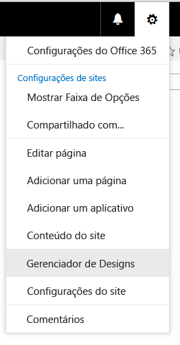

# Tutorial: criar um layout de página no SharePoint 2013
Ao usar o Gerenciador de Design para criar um layout de página, dois arquivos são criados: um arquivo .aspx que é usado pelo SharePoint, e uma versão HTML do layout da página que você pode editar no seu editor de HTML. O layout da página e do arquivo HTML são associados, para que sempre que você editar e salvar o arquivo HTML, as suas alterações sejam sincronizadas para o layout da página associada.
## Introdução aos layouts de página
<a name="Introduction"> </a>

Ao usar o Gerenciador de Design para criar um layout de página, dois arquivos são criados: um arquivo .aspx que é usado pelo SharePoint, e uma versão HTML do layout da página que você pode editar no seu editor de HTML. O layout da página e do arquivo HTML são associados, para que sempre que você editar e salvar o arquivo HTML, as suas alterações sejam sincronizadas para o layout da página associada.
  
    
    
Ao criar uma página mestra, você carrega e converte um arquivo HTML diretamente em uma página mestra. Mas, ao contrário de uma página mestra, você não converte diretamente um arquivo HTML em um layout de página. Isso deve-se ao fato de o propósito principal de um layout de página ser conter os campos de página, que devem ser adicionados quando o layout da página é criado no Gerenciador de Design.
  
    
    
Ao criar um layout de página:
  
    
    

- Um arquivo .aspx e um arquivo HTML com o mesmo nome são criados na Galeria de Páginas Mestras.
    
  
- Todas as marcações necessárias no SharePoint são adicionadas ao arquivo .aspx para que o layout da página seja renderizado corretamente.
    
  
- Outras marcações como comentários, marcas **<div>**, trechos de código e espaços reservados de conteúdo são adicionados ao arquivo HTML.
    
  
- Campos de página exclusivos do tipo de conteúdo são adicionados automaticamente a um layout de página. Outros campos de página estão disponíveis para serem adicionados na faixa de opções da Galeria de Trechos de Código.
    
  
- O arquivo HTML e o arquivo .aspx são associados, para que quaisquer edições ao arquivo HTML sejam sincronizadas com o arquivo .aspx sempre que o arquivo HTML seja salvo. Outras marcações como comentários, marcas **<div>**, trechos de código e espaços reservados de conteúdo são adicionados ao arquivo HTML.
    
  

> **OBSERVAçãO**
> A sincronização ocorre em somente uma direção. As alterações ao layout da página HTML são sincronizadas com o arquivo .aspx associado, mas se você escolher editar o arquivo .aspx diretamente, essas alterações não serão sincronizadas com o arquivo HTML. Cada layout de página HTML (e cada página mestra HTML) têm uma propriedade chamada **Arquivo Associado** que é definido como **True** por padrão, o que cria a associação e a sincronização entre os arquivos.
  
    
    

Por exemplo, se você tiver um par de arquivos associados (HTML e .aspx) e editar o arquivo .aspx sem interromper a associação, as alterações ao arquivo .aspx são salvas, mas você não pode fazer check-in ou publicar o arquivo .aspx, portanto essas alterações não são salvas de maneira significativa. Quaisquer alterações ao arquivo HTML substituem o arquivo .aspx. Se você fizer check-in ou publicar o arquivo HTML, as alterações ao arquivo HTML substituem quaisquer alterações que tenham sido feitas ao arquivo .aspx. As alterações ao arquivo .aspx serão perdidas.
  
    
    
Se você for um desenvolvedor familiarizado com o ASP.NET, você pode escolher trabalhar somente com o arquivo .aspx interrompendo a associação entre os arquivos. Para interromper a associação entre o arquivo HTML e o arquivo .aspx, no Gerenciador de Design, escolha **Editar Propriedades** para o arquivo HTML, em seguida, limpe a caixa de seleção **Arquivo Associado**. Você pode reassociar os arquivos editando as propriedades e selecionando esta caixa de seleção, em cujo caso as alterações salvas no arquivo HTML substituirão o arquivo .aspx novamente.
  
    
    

## Entendendo a relação entre campos de página e um tipo de conteúdo
<a name="UnderstandingPageFields"> </a>

Cada layout de página é associado a um tipo de conteúdo, tipicamente um dos tipos de conteúdo no grupo de Layouts de Página. Por exemplo, o tipo de conteúdo Página de Artigo, que é associado ao layout de página Página de Artigo, ambos incluídos em um site de publicação.
  
    
    
Um tipo de conteúdo é feito de colunas de site, que juntas definem um esquema de tipos de dados permitidos. Você pode dizer que as colunas de site são exclusivas do tipo de conteúdo atual porque a coluna de Fonte está vazia. Isso significa que essas colunas de site são definidas pelo tipo de conteúdo atual e não são herdadas de um tipo de conteúdo pai.
  
    
    
Para qualquer layout de página, as colunas de site que constituem o tipo de conteúdo correspondem diretamente aos campos de página que estão disponíveis para esse layout de página. O primeiro grupo de campos de página na faixa de opções são campos de página que são adicionados automaticamente ao layout de página ao serem criados. O SharePoint adiciona esses campos automaticamente porque eles são exclusivos deste tipo de conteúdo, e por isso é provável que esses campos tenham sido criados especificamente para serem usados pelo layout de página, em vez de serem metadados gerais do SharePoint.
  
    
    
Antes de criar um layout de página no Gerenciador de Design, você poderá ter que criar primeiro um tipo de conteúdo que defina os campos de página desejados para o layout
  
    
    

## Entendendo a relação entre espaços reservados de conteúdo em um layout de página e página mestra
<a name="UnderstandingContentPlaceholders"> </a>

Um layout de página e uma página mestra devem ter o mesmo conjunto de espaços reservados de conteúdo para que o layout da página seja renderizado corretamente. Isso não será um problema se você usar o Gerenciador de Design para criar páginas mestras e layouts de página, porque o conjunto correto de espaços reservados de conteúdo é adicionado a cada arquivo ao criá-lo. Isso garante que cada layout de página funcionará em todos os canais que usem uma página mestra diferente. Você não precisa ter conhecimentos sobre ou trabalhar com nenhum desses espaços reservados de conteúdo. Eles existem porque são necessários para que o SharePoint renderize a página corretamente.
  
    
    
Mas se você editar um layout de página HTML e adicionar manualmente um espaço reservado de conteúdo, deverá adicionar esse mesmo espaço reservado de conteúdo a cada página mestra que precise trabalhar com esse layout de página. Este cenário não é comum.
  
    
    
Se você estiver usando o Gerenciador de Design para criar layouts de página e páginas mestras, o cenário mais comum é estar trabalhando somente com os espaços reservados de conteúdo a seguir:
  
    
    

- **PlaceHolderMain** A página mestra contém um espaço reservado de conteúdo com o `ID="PlaceholderMain"`, que contém a marca **DefaultContentBlock** **<div>** com a caixa amarela que diz **Esta área será preenchida com conteúdos que você cria nos seus layouts de página.** Você não deve por nenhum conteúdo dentro deste espaço reservado na página mestra. O layout de página contém um espaço reservado de conteúdo com a mesma ID. Você deve por as marcações somente dentro do espaço reservado, e nenhuma marcação fora, em um layout de página. As IDs dos dois espaços reservados ( **PlaceholderMain**) devem ser correspondentes.
    
  
- **PlaceHolderAdditionalPageHead** Ao trabalhar com um layout de página, você normalmente não insere elementos na marca **<head>**do layout de página. Em vez disso, você adiciona elementos ao espaço reservado de conteúdo com o  `id="PlaceHolderAdditionalPageHead"`. Quando uma página é renderizada no navegador, esse cabeçalho de página é mesclado no fim do cabeçalho da página mestra. 
    
  

## Criar um layout de página
<a name="CreatePageLayout"> </a>

Antes de começar, você precisa saber com que tipo de conteúdo e página mestra o layout de página será associado.
  
    
    

### Para criar um layout de página


1. Navegue até o seu site de publicação.
    
  
2. No canto superior direito da página, escolha o ícone de engrenagem e, em seguida, escolha **Gerenciador de Design**.
    
   **Menu do ícone de engrenagem**

  


  

  

  
3. No Gerenciador de Design, no painel de navegação à esquerda, escolha **Editar Layouts de Página**.
    
  
4. Escolha **Criar um layout de página**.
    
  
5. Na caixa de diálogo **Criar um Layout de Página**, insira um nome para o seu layout de página.
    
  
6. Selecione uma página mestra.
    
    A página mestra que você escolher aqui será exibida na visualização deste layout de página. Esta página mestra também determina que espaços reservados de conteúdo são adicionados ao layout de página.
    
    > **OBSERVAçãO**
      > Após escolher esta página mestra, você não pode visualizar o layout de página com uma página mestra diferente, mesmo após aplicar uma página mestra diferente ao site online. 
7. Selecione um tipo de conteúdo. O tipo de conteúdo para este layout de página determina que campos de página estarão disponíveis para este layout de página na Galeria de Trechos de Código.
    
  
8. Escolha **OK**.
    
    Neste ponto, o SharePoint criará um arquivo HTML e um arquivo .aspx com o mesmo nome.
    
    No Gerenciador de Design, o seu arquivo HTML agora será exibido com uma coluna de Status que mostra um dos dois status possíveis:
    
  - **Avisos e Erros**
    
  
  - **Conversão com sucesso**
    
  
9. Clique no link na coluna de Status para visualizar o arquivo e exibir quaisquer erros ou avisos sobre a página mestra.
    
    A página de visualização é uma visualização do lado do servidor do seu layout de página. A parte superior da visualização exibe quaisquer avisos ou erros que você poderá ter que resolver editando o arquivo HTML em um editor de HTML. Os erros devem ser resolvidos antes que a visualização exiba o layout da página corretamente.
    
    Para saber mais sobre como resolver erros e avisos, consulte  [Como: resolver erros e avisos ao visualizar uma página no SharePoint 2013](how-to-resolve-errors-and-warnings-when-previewing-a-page-in-sharepoint-2013.md).
    
    Para saber mais sobre como visualizar o layout de página, consulte  [Como: alterar a página de visualização no Gerenciador de Design do SharePoint 2013](how-to-change-the-preview-page-in-sharepoint-2013-design-manager.md).
    
    A página de visualização também contém um link de **Trechos de Código** no canto superior direito. Este link abre a Galeria de Trechos de Código, onde você pode começar a substituir controles modelo no seu design por controles dinâmicos do SharePoint. Para saber mais, consulte [Trechos de código do Gerenciador de Design do SharePoint 2013](sharepoint-2013-design-manager-snippets.md).
    
  
10. Para resolver quaisquer erros, edite o arquivo HTML que reside diretamente no servidor usando um editor de HTML para abrir e editar o arquivo HTML no dispositivo mapeado. Sempre que você salvar o arquivo HTML, as alterações são sincronizadas com o arquivo .aspx associado.
    
  
11. A visualização do layout de página mostra os campos de página que foram adicionados automaticamente ao layout de página. Esses campos de página são colunas de site que são exclusivos do tipo de conteúdo atual. Agora você está pronto para personalizar o layout da página de acordo com os seus modelos HTML originais.
    
  

## Determinar onde devem ser guardados os estilos de um layout de página
<a name="WhereStyles"> </a>

Ao criar modelos HTML para o seu site, você pode ter arquivos HTML que representem diferentes classes de páginas, como uma página de artigo ou uma página de detalhes de item que contenha uma Web Part para exibir os detalhes de um único item de um catálogo. Após criar o layout de página que representa essa classe de páginas, você está pronto para transferir os estilos do seu modelo HTML para a versão HTML do seu layout de página.
  
    
    
Você pode simplesmente por os estilos de um ou mais layouts de página na mesma folha de estilos à qual a página mestra está vinculada. Mas se quiser minimizar o peso do CSS que é carregado em cada página, você também pode usar diferentes folhas de estilo para diferentes layouts de página. Ao fazer isso, é importante saber que um link para uma folha de estilos não ser inserido em uma marca **<head>** de um layout de página. Em vez disso, o link deve ser inserido no espaço reservado de conteúdo chamado **PlaceHolderAdditionalPageHead**. 
  
    
    

> **OBSERVAçãO**
> Nesta marcação, o atributo  `ms-design-css-conversion="no"` exclui a folha de estilos do tema. Além disso, o link para a folha de estilos deve ser exibido após as linhas com o comentário **<!--SPM**. 
  
    
    


```HTML

<!--MS:<asp:ContentPlaceHolder id="PlaceHolderAdditionalPageHead" runat="server">-->
            <!--SPM:<%@Register Tagprefix="SharePoint" Namespace="Microsoft.SharePoint.WebControls" Assembly="Microsoft.SharePoint, Version=15.0.0.0, Culture=neutral, PublicKeyToken=71e9bce111e9429c"%>-->
            <!--SPM:<%@Register Tagprefix="Publishing" Namespace="Microsoft.SharePoint.Publishing.WebControls" Assembly="Microsoft.SharePoint.Publishing, Version=15.0.0.0, Culture=neutral, PublicKeyToken=71e9bce111e9429c"%>-->
<link href="MyPageLayout.css" rel="stylesheet" type="text/css" ms-design-css-conversion="no" />
        <!--ME:</asp:ContentPlaceHolder>-->

```

Quando um visitante de site navegar por uma página que use este layout de página, este cabeçalho de página adicional é mesclado no fim do cabeçalho da página mestra; portanto, os estilos do layout de página são aplicados após os estilos da página mestra.
  
    
    
Deste modo, cada layout de página pode ter a sua própria folha de estilos. Por exemplo, você pode fazer com que um **<div>** with `id="xyz"` seja exibido à esquerda em um layout de página e à direita em outro layout de página.
  
    
    
Cada layout de página também pode ter um ou mais folhas de estilo específicas do canal do dispositivo. Por exemplo, você pode querer que um layout de página tenha layouts diferentes para celulares e para a área de trabalho. Para fazer isso, você pode incluir um ou mais painéis de canal de dispositivo dentro do **PlaceHolderAdditionalPageHead**, onde cada painel de canal inclui um link para uma folha de estilos com estilos específicos do canal. Deste modo, por exemplo, um **<div>** with `id="abc"` pode exibir texto grande em um canal e texto pequeno em outro canal.
  
    
    
Os cenários a seguir são cenários comuns de posicionamento dos links de folha de estilos para layouts de página.
  
    
    

### Vincular aos estilos de uma página mestra

O cenário mais simples é incluir estilos para um ou mais layouts de página na mesma folha de estilos à qual a página mestra se vincula. Na página mestra, posicione o link para o arquivo .css imediatamente antes da marca **</head>** de fechamento, para que ele se sobreponha às folhas de estilo padrão do SharePoint, como corev15.css.
  
    
    

```HTML

<head>
…
<link rel="stylesheet" type="text/css" href="MyStyleSheet.css" />
</head>

```


### Vincular aos estilos de um layout de página

Se desejar minimizar o peso do CSS carregado com cada página, você pode ter arquivos CSS separados para cada layout de página. Neste cenário, os estilos de um layout de página são inseridos no espaço reservado de conteúdo chamado **PlaceHolderAdditionalPageHead**.
  
    
    

```HTML

<!--MS:<asp:ContentPlaceHolder id="PlaceHolderAdditionalPageHead" runat="server">-->
            <!--SPM:<%@Register Tagprefix="SharePoint" Namespace="Microsoft.SharePoint.WebControls" Assembly="Microsoft.SharePoint, Version=15.0.0.0, Culture=neutral, PublicKeyToken=71e9bce111e9429c"%>-->
            <!--SPM:<%@Register Tagprefix="Publishing" Namespace="Microsoft.SharePoint.Publishing.WebControls" Assembly="Microsoft.SharePoint.Publishing, Version=15.0.0.0, Culture=neutral, PublicKeyToken=71e9bce111e9429c"%>-->
<link href="MyPageLayout.css" rel="stylesheet" type="text/css" ms-design-css-conversion="no" />
        <!--ME:</asp:ContentPlaceHolder>-->

```


### Vincular aos estilos do layout de página por canal de dispositivo

Se você tiver canais de dispositivo diferentes, poderá querer que os seus layouts de página sejam renderizados de maneira diferente em canais diferentes. Neste cenário, você deverá incluir um ou mais painéis de canal de dispositivo no **PlaceHolderAdditionalPageHead** e, em seguida, incluir um link para arquivos CSS específicos dentro de cada painel de canal.
  
    
    

```HTML

<!--MS:<asp:ContentPlaceHolder id="PlaceHolderAdditionalPageHead" runat="server">-->
<div data-name="DeviceChannelPanel">
    <!--CS: Start Device Channel Panel Snippet-->
    <!--SPM:<%@Register Tagprefix="Publishing" Namespace="Microsoft.SharePoint.Publishing.WebControls" Assembly="Microsoft.SharePoint.Publishing, Version=15.0.0.0, Culture=neutral, PublicKeyToken=71e9bce111e9429c"%>-->
    <!--MS:<Publishing:DeviceChannelPanel runat="server" IncludedChannels="Channel1">-->
…..
<link rel="stylesheet" type="text/css" href="MyStyleSheet.css" ms-design-css-conversion="no" />
    <!--ME:</Publishing:DeviceChannelPanel>-->
    <!--CE: End Device Channel Panel Snippet-->
</div><div data-name="DeviceChannelPanel">
    <!--CS: Start Device Channel Panel Snippet-->
    <!--SPM:<%@Register Tagprefix="Publishing" Namespace="Microsoft.SharePoint.Publishing.WebControls" Assembly="Microsoft.SharePoint.Publishing, Version=15.0.0.0, Culture=neutral, PublicKeyToken=71e9bce111e9429c"%>-->
    <!--MS:<Publishing:DeviceChannelPanel runat="server" IncludedChannels="Channel2">-->
…..
<link rel="stylesheet" type="text/css" href="CSS5.css" />
    <!--ME:</Publishing:DeviceChannelPanel>-->
    <!--CE: End Device Channel Panel Snippet-->
</div>

```


## Entendendo as marcações no layout de página HTML
<a name="UnderstandMarkup"> </a>

Ao criar um layout de página, é criado um arquivo .aspx que é usado pelo SharePoint, e algumas marcações HTML são adicionadas à versão HTML do layout da página. Ao editar o layout da página HTML no seu editor de HTML, pode ser útil entender o propósito de algumas destas marcações. Muitas delas são similares às marcações que são adicionadas a uma página mestra HTML. Para saber mais, consulte  [Como: converter um arquivo HTML em uma página mestra no SharePoint 2013](how-to-convert-an-html-file-into-a-master-page-in-sharepoint-2013.md).
  
    
    
A marcação que é exclusiva a cada layout de página são os campos de página que são adicionados ao layout de página com base no tipo de conteúdo ao qual o layout de página é associado. Os campos de página são exibidos dentro do espaço reservado de conteúdo com o  `id="PlaceHolderMain"`. Por exemplo, a seguinte marcação para o **PlaceHolderMain** contém dois campos de página que representam os campos **Title** e **Page Image** do tipo de conteúdo associado.
  
    
    


```HTML

<!--MS:<asp:ContentPlaceHolder ID="PlaceHolderMain" runat="server">-->
            <div>
                <!--CS: Start Page Field: Title Snippet-->
                <!--SPM:<%@Register Tagprefix="PageFieldTextField" Namespace="Microsoft.SharePoint.WebControls" Assembly="Microsoft.SharePoint, Version=15.0.0.0, Culture=neutral, PublicKeyToken=71e9bce111e9429c"%>-->
                <!--SPM:<%@Register Tagprefix="Publishing" Namespace="Microsoft.SharePoint.Publishing.WebControls" Assembly="Microsoft.SharePoint.Publishing, Version=15.0.0.0, Culture=neutral, PublicKeyToken=71e9bce111e9429c"%>-->
                <!--MS:<Publishing:EditModePanel runat="server" CssClass="edit-mode-panel">-->
                    <!--MS:<PageFieldTextField:TextField FieldName="fa564e0f-0c70-4ab9-b863-0177e6ddd247" runat="server">-->
                    <!--ME:</PageFieldTextField:TextField>-->
                <!--ME:</Publishing:EditModePanel>-->
                <!--CE: End Page Field: Title Snippet-->
            </div>
            <div>
                <!--CS: Start Page Field: Page Image Snippet-->
                <!--SPM:<%@Register Tagprefix="PageFieldRichImageField" Namespace="Microsoft.SharePoint.Publishing.WebControls" Assembly="Microsoft.SharePoint.Publishing, Version=15.0.0.0, Culture=neutral, PublicKeyToken=71e9bce111e9429c"%>-->
                <!--MS:<PageFieldRichImageField:RichImageField FieldName="3de94b06-4120-41a5-b907-88773e493458" runat="server">-->
                    <!--PS: Start of READ-ONLY PREVIEW (do not modify)--><div id="ctl02_label" style="display:none">Page Image</div><div id="ctl02__ControlWrapper_RichImageField" class="ms-rtestate-field" style="display:inline" aria-labelledby="ctl02_label"><div align="left" class="ms-formfieldcontainer"><div class="ms-formfieldlabelcontainer" nowrap="nowrap"><span class="ms-formfieldlabel" nowrap="nowrap">Page Image</span></div><div class="ms-formfieldvaluecontainer"><div class="ms-rtestate-field"></div></div></div></div><!--PE: End of READ-ONLY PREVIEW-->
                <!--ME:</PageFieldRichImageField:RichImageField>-->
                <!--CE: End Page Field: Page Image Snippet-->
            </div>
        <!--ME:</asp:ContentPlaceHolder>-->

```


## Recursos adicionais
<a name="AdditionalResources"> </a>


-  [Visão geral do Gerenciador de Design no SharePoint 2013](overview-of-design-manager-in-sharepoint-2013.md)
    
  
-  [Como: converter um arquivo HTML em uma página mestra no SharePoint 2013](how-to-convert-an-html-file-into-a-master-page-in-sharepoint-2013.md)
    
  
-  [Trechos de código do Gerenciador de Design do SharePoint 2013](sharepoint-2013-design-manager-snippets.md)
    
  

