# Como criar formulários de fluxo de trabalho personalizados do SharePoint Server 2013 com o Visual Studio 2012
Apresenta formulários de fluxo de trabalho no SharePoint Server 2013. Este artigo usa o SharePoint Server 2013 com a Atualização Pública de março de 2013 aplicada e o Office Developer Tools para Visual Studio 2012. Todas as informações desse artigo se aplicam às implantações locais de SharePoint Server 2013 bem como ao Office 365.
 **Fornecido por:** [Andrew Connell](http://social.msdn.microsoft.com/profile/andrew%20connell%20%5bmvp%5d/),  [www.AndrewConnell.com](http://www.andrewconnell.com)
  
    
    

Desde o lançamento do Microsoft SharePoint 2007, a plataforma do SharePoint oferece suporte usando fluxos de trabalho para automatizar os processos empresariais. A plataforma de fluxo de trabalho do SharePoint é desenvolvida no Windows Workflow Foundation, que faz parte do .NET Framework. Enquanto o Workflow Foundation fornece muitos recursos para a criação de fluxos de trabalho personalizados e gerenciamento de processos empresariais automatizados. O SharePoint também adiciona integração de usuário final. Esta integração é implementada em duas partes: 
- **Tarefas** atribuídas aos usuários e aos grupos que podem ser criadas e monitoradas pelos fluxos de trabalho.
    
  
- **Formulários** que coletam informações de usuários quando os fluxos de trabalho são associados a um tipo de conteúdo (por exemplo, um site, uma lista ou uma biblioteca) ou quando um fluxo de trabalho é iniciado.
    
  

## Formulários de fluxo de trabalho no SharePoint 2007 e no SharePoint 2010
<a name="sec1"> </a>

A implementação de fluxos de trabalho no SharePoint 2007 e no SharePoint 2010 forneceu aperfeiçoamentos contínuos a cada versão. Em especial, a Microsoft adicionou novas funcionalidades ao SharePoint 2010, tais como a capacidade de associar fluxos de trabalho a sites. Também aprimorou as ferramentas de criação de fluxo de trabalho no SharePoint Designer 2010 e no Visual Studio 2010, superando os predecessores. No entanto, no SharePoint 2013, a implementação das tarefas e formulários de fluxo de trabalho permaneceu em grande parte inalterada.
  
    
    
Antes do SharePoint Server 2013, os desenvolvedores tinham duas opções para criar formulários de fluxo de trabalho. No SharePoint 2007, os formulários do InfoPath e os Web Forms do ASP.NET eram recomendados igualmente. Cada um apresentava vantagens e desvantagens. No SharePoint 2010, os desenvolvedores eram encorajados a usar os Web Forms do ASP.NET já que eles eram criados pelas ferramentas de desenvolvedor do SharePoint no Visual Studio 2010 usando os modelos de item de projeto de formulários de fluxo de trabalho de associação e de iniciação, mas a implementação era bastante semelhante à do SharePoint 2007.
  
    
    

## Alterações nos formulários de fluxo de trabalho do SharePoint 2013
<a name="sec2"> </a>

O SharePoint Server 2013 introduziu uma nova arquitetura e plataforma de fluxo de trabalho que reflete algumas mudanças fundamentais no modo de pensar sobre o SharePoint. A principal alteração é que os fluxos de trabalho no SharePoint Server 2013 não são mais gerenciados e executados pelo mecanismo de tempo de execução do SharePoint. Em vez disso, o SharePoint Server 2013 utiliza um novo componente denominado Workflow Manager, que hospeda o tempo de execução do Windows Workflow Foundation e os serviços necessários exigidos pelo Workflow Foundation. O ponto importante é que o Workflow Manager pode ser executado fora do SharePoint. Quando um fluxo de trabalho é publicado, ou uma nova instância de um fluxo de trabalho publicado é iniciada, o SharePoint notifica o Workflow Manager, que por sua vez processa os episódios do fluxo de trabalho. Quando o fluxo de trabalho precisa acessar informações no SharePoint, como propriedades do item de lista ou propriedades do usuário, ele autentica o usuário com o modelo de autorização OAuth e se comunica por meio das APIs REST que foram introduzidas na versão do SharePoint Server 2013.
  
    
    
A orientação geral para personalizações na plataforma do SharePoint também foi alterada na versão do SharePoint Server 2013, embora essa mudança tenha começado com o SharePoint 2010 e o soluçăos em área restrita. No SharePoint Server 2013, a Microsoft introduziu recursos que removeram as personalizações do servidor do SharePoint e as moveram para o navegador do cliente ou para outros recursos externos. Estes recursos incluem o novo Modelo de Aplicativo do SharePoint, suporte para atribuição de uma identidade para os aplicativos, autenticação usando o modelo de autorização OAuth e aperfeiçoamento do modelo de objeto do lado do cliente (CSOM) e das APIs REST.
  
    
    
Como isso afeta os formulários de fluxo de trabalho? Lembre-se de que a partir do SharePoint 2010, a Microsoft começou a encorajar os desenvolvedores a usar Web Forms do ASP.NET durante a criação de formulários em fluxos de trabalho usando o Visual Studio. Obviamente, esta abordagem requer código de servidor para processar o formulário e uma comunicação controlada entre o formulário e o mecanismo de fluxo de trabalho. No entanto, no SharePoint Server 2013, isso só é possível no desenvolvimento de estilo de solução (ou seja, implantação de pacotes do *.WSP). O novo Modelo de Aplicativo do SharePoint introduzido no SharePoint Server 2013 não permite que o código de servidor seja executado no processo do SharePoint.
  
    
    
Para aliviar essa limitação, a Microsoft ampliou o CSOM para incluir uma API para interação com o mecanismo de fluxo de trabalho. Para conectar um farm do SharePoint Server 2013 ao farm do Workflow Manager, você deve instalar o Workflow Manager Client nos servidores do SharePoint. Esse componente funciona como um proxy que o SharePoint usa para se comunicar com o farm do Workflow Manager. A API CSOM de Serviços de Fluxo de Trabalho é o componente do lado do cliente que você usa para interagir com o novo mecanismo de fluxo de trabalho. Para saber mais sobre o CSOM de Serviços de Fluxo de Trabalho do SharePoint Server 2013, consulte  [Trabalhando com o modelo de objeto SharePoint 2013 Workflow Services cliente lado](working-with-the-sharepoint-2013-workflow-services-client-side-object-model.md).
  
    
    
Sendo assim, como isso beneficia os formulários de fluxo de trabalho do SharePoint? Durante a criação de fluxos de trabalho do SharePoint Server 2013 usando o Visual Studio 2012, você cria formulários de fluxo de trabalho usando os Web Forms do ASP.NET. Você pode implantar esses formulários como uma solução do SharePoint ou (e esta é a parte importante) no . Isso proporciona o acesso a todos os controles do servidor que já foram implantados, como os Controles da Web do ASP.NET e outros controles úteis (e, às vezes, obrigatórios) do SharePoint. Você também pode usar o CSOM dos Serviços de Fluxo de Trabalho para executar todas as tarefas necessárias dos formulários de associação e de iniciação incluindo, sem limitações, as seguintes:
  
    
    

- Criar uma tarefa de fluxo de trabalho e listas do histórico
    
  
- Criar uma nova associação de fluxo de trabalho em um site, lista ou biblioteca de documentos
    
  
- Iniciar uma nova instância de uma associação de fluxo de trabalho existente
    
  
O CSOM de Serviços de Fluxo de Trabalho é muito robusto e fornece a você uma ampla margem para inovação nos fluxos de trabalho, tudo a partir do navegador ou de um computador remoto.
  
    
    

## Formulários de fluxo de trabalho disponíveis no SharePoint Sever 2013
<a name="sec3"> </a>

Antes da versão do SharePoint Server 2013, existiam três tipos de formulários de fluxo de trabalho personalizados que poderiam ser criados: formulários de **Iniciação**, **Associação** e **Edição de Tarefa**. Desses três tipos, os formulários de edição de tarefa perderam a importância como solução de formulários personalizados. O declínio dos formulários de Edição de Tarefa começou com o SharePoint 2010 porque as ferramentas de desenvolvedor do Visual Studio 2010 no SharePoint não possuíam um item de projeto para os formulários de tarefa, se baseando na exibição da lista padrão e nos formulários de edição para renderizar tarefas.
  
    
    
O SharePoint Server 2013 aperfeiçoa o modo como você trabalha com as tarefas de fluxo de trabalho em que você pode criar botões de resultado personalizados para cenários específicos. Você também pode personalizar a renderização e o comportamento de colunas específicas em itens de tarefa usando a nova Renderização do Lado do Cliente (CSR), que foi introduzida no SharePoint Server 2013. Observe que a CSR usa o JavaScript executado no cliente. Esses tópicos são abordados no artigo  [Trabalhando com tarefas em fluxos de trabalho do SharePoint 2013 usando o Visual Studio 2012](working-with-tasks-in-sharepoint-2013-workflows-using-visual-studio-2012.md). Você também pode saber mais consultando o artigo  [Personalizar um modo de exibição de lista de suplementos do SharePoint usando o processamento do lado do cliente](http://msdn.microsoft.com/library/8d5cabb2-70d0-46a0-bfe0-9e21f8d67d86%28Office.15%29.aspx).
  
    
    

### Compreendendo os formulários de iniciação de fluxo de trabalho

Um formulário de iniciação é aberto quando um usuário inicializa manualmente um fluxo de trabalho, cuja definição de fluxo de trabalho está associada ao formulário. Quando o fluxo de trabalho é iniciado, o usuário é apresentado ao formulário de iniciação e solicitado a inserir informações que serão necessárias. Por exemplo, o usuário poderia inserir uma justificativa para um fluxo de trabalho iniciando uma aprovação para uma nova despesa empresarial.
  
    
    
Um ponto importante sobre os formulários de iniciação é que eles somente são mostrados quando um fluxo de trabalho é iniciado manualmente. Os fluxos de trabalho que são configurados para começar automaticamente não lançam o formulário de iniciação quando iniciados. Essa condição pode criar complicações para fluxos de trabalho que esperam que os dados sejam passados a partir do formulário. Lembre-se de que se os seus fluxos de trabalho estiverem configurados para começar automaticamente e o fluxo de trabalho exigir entradas de usuário, você deve usar um formulário de associação, não de iniciação.
  
    
    

### Compreendendo os formulários de associação de fluxo de trabalho

Os formulários de associação são mostrados para os administradores quando eles decidem adicionar, ou associar, um fluxo de trabalho a uma lista específica ou biblioteca de dados. Use os formulários de associação para permitir que o administrador especifique parâmetros, valores padrão e outras informações para o fluxo de trabalho que se aplica aos itens na lista ou na biblioteca.
  
    
    
Esse formulário de associação padrão permite que o administrador selecione a definição do fluxo de trabalho, forneça um nome para exibição para a associação, especifique as listas que serão os contêineres para quaisquer tarefas e itens de lista do histórico criados pelo fluxo de trabalho selecionado na associação e especifique as condições em que o fluxo de trabalho pode ser iniciado, manualmente ou automaticamente, quando os itens de lista ou da biblioteca forem criados ou atualizados.
  
    
    
Também é possível criar formulários de associação personalizados. Caso tenha um formulário de associação personalizado em uma definição de fluxo de trabalho, o SharePoint redireciona o usuário para o formulário personalizado assim que o formulário padrão é concluído. Use o formulário personalizado para coletar informações de configuração que o fluxo de trabalho pode precisar, como chamadas para um serviço Web externo que requer que o chamador faça autenticação com ou passe uma chave de API única para acesso. Esse é o tipo de informação que um desenvolvedor não deseja codificar no fluxo de trabalho. Você verá esse cenário caso um fluxo de trabalho esteja incluído em um aplicativo vendido no Repositório do SharePoint. Nesse caso, cada cliente precisa da sua própria conta com o serviço remoto. Esse é o tipo de informação que você coleta do usuário no momento da criação da associação do fluxo de trabalho.
  
    
    
Outro cenário comum é quando você precisa coletar informações que o iniciador do fluxo de trabalho normalmente enviaria para fluxos de trabalho iniciados automaticamente. Conforme explicado anteriormente, os formulários de iniciação são apresentados apenas quando os fluxos de trabalho são iniciados manualmente. Por outro lado, quando os fluxos de trabalho são configurados para iniciar automaticamente, e se o fluxo de trabalho espera dados em alguns campos do formulário, a solução preferencial é usar um formulário de associação personalizado. 
  
    
    
Sendo assim, no formulário de iniciação, esses valores padrão seriam apresentados ao iniciar o fluxo de trabalho manualmente. Quando iniciado automaticamente, o fluxo de trabalho poderia detectar que nenhum dado foi passado a partir do formulário de iniciação e voltar para os valores especificados no formulário de associação.
  
    
    

## Passo a passo: criar e implantar um formulário de associação personalizado
<a name="sec4"> </a>

Nesse passo a passo, demonstraremos como criar um formulário de associação personalizado e usá-lo para coletar informações que serão passadas para o fluxo de trabalho. Antes de começar, certifique-se de que você possui acesso a um site de desenvolvedor do SharePoint Server 2013.
  
    
    

### Criar o formulário de associação personalizado


1. Crie um fluxo de trabalho personalizado usando o Visual Studio 2012. 
    
  
2. No Visual Studio, crie um novo projeto de aplicativo do SharePoint Server 2013 e configure-o como um aplicativo hospedado no SharePoint.
    
  
3. Adicione uma nova lista **Comunicado** ao projeto. Essa lista será associada ao fluxo de trabalho e os eventos dela dispararão o fluxo de trabalho.
    
  
4. Adicione um item de fluxo de trabalho ao projeto clicando com o botão direito em **Gerenciador de Soluções** e selecionando **Adicionar**, seguido por **Novo Item**. Na caixa de diálogo **Adicionar Novo Item**, selecione o o item de projeto do **Fluxo de Trabalho** na categoria **Office/SharePoint**. Insira "SampleWorkflow" como nome e clique em **Avançar**. Quando solicitado pelo Assistente para Personalização do SharePoint, defina o novo item como um **Fluxo de Trabalho de Lista**.
    
  
5. A próxima página do **Assistente para Personalização do SharePoint**, mostrada na Figura 1, permite que você crie automaticamente uma associação de fluxo de trabalho. No entanto, ao criar formulários de associação personalizados, você **não** deve utilizar essa opção. Cancele a seleção dessa caixa e clique em **Finalizar**.
    
   **Figura 1. Cancele a seleção da opção para associar automaticamente o fluxo de trabalho.**

  

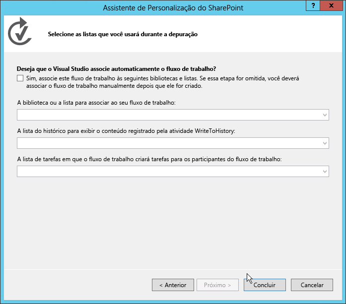
  

  

  
6. Em seguida, adicione o formulário ao projeto do Visual Studio clicando com o botão direito no item de fluxo de trabalho em **Gerenciador de Soluções**, selecionando **Adicionar**, **Novo Item**. 
    
    Esta última etapa é importante porque informa à caixa de diálogo **Adicionar Novo Item** que o contexto é um item de fluxo de trabalho. Isso faz com que a caixa de diálogo **Adicionar Novo Item** exiba dois modelos de item de projeto de formulário (Formulário de Iniciação e de Associação) como opções, conforme exibido na Figura 2.
    

   **Figura 2. Seleção do modelo do Formulário de Associação.**

  

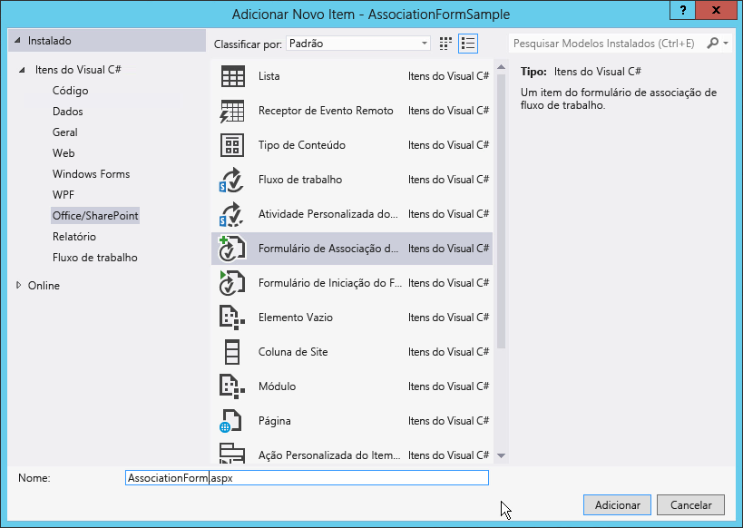
  

  

  
7. Selecione o item **Formulário de Associação de Fluxo de Trabalho** e remova o "1" do campo nome. Clique em Adicionar para concluir o processo.
    
  

### Atualizar o HTML e o JavaScript no formulário de associação padrão

Assim que o novo formulário é adicionado ao projeto, o Visual Studio o abre automaticamente. Nesse momento, você só precisa realizar duas ações para tornar o formulário compatível com seu fluxo de trabalho:
  
    
    

- Atualizar o formulário HTML para refletir os elementos de dados que você precisa coletar dos usuários, bem como indicar como o formulário deve ser renderizado.
    
  
- Atualizar o JavaScript padrão para puxar os valores do formulário atualizado e fazer a correspondência dos nomes de propriedade com os nomes dos argumentos criados no fluxo de trabalho.
    
  

1. Abra o formulário para exibir o código.
    
  
2. Localize o controle de servidor mostrado no seguinte trecho do código:
    
  ```
  
<WorkflowServices:WorkflowAssociationFormContextControl ID="WorkflowAssociationFormContextControl1" runat="server" />
  ```


    Esse controle de servidor desempenha duas tarefas importantes. Primeiro, ele adiciona as bibliotecas necessárias do JavaScript ao formulário de associação. Segundo, ele usa os valores de formulário que foram enviados pelo formulário anterior e os grava na página como controles de entrada HTML ocultos. A página anterior era o formulário de associação padrão do SharePoint, onde o usuário especificou a definição de fluxo de trabalho, o nome da associação, a lista de histórico e tarefas de fluxo de trabalho, e as opções de inicialização. Este formulário usou um HTTP POST para ir mover o formulário de associação personalizado que foi adicionado ao fluxo de trabalho. Por se tratar de um HTTP POST, os valores não são acessíveis no formulário, já que toda a lógica personalizada deve ser implementada sem o código do lado do servidor. Portanto, o SharePoint fornece este controle de servidor para extrair os valores do pipeline de solicitação HTTP e adicioná-los a esta página.
    
  
3. Role para baixo no arquivo de origem até localizar a tabela HTML de modelo e a substitua pelo seguinte:
    
  ```XML
  <table>
    <tr>
      <td colspan="2">
        String:<br /><textarea id="strInput" rows="1" columns="50"/>
      </td>
    </tr>
    <tr>
        <td><button id="Save" onclick="return runAssocWFTask()">Save</button></td>
        <td><button id="Cancel" onclick="location.href = cancelRedirectUrl; return false;">Cancel</button></td>
    </tr>
</table>

  ```


    Esta tabela exibe uma caixa de texto HTML simples que é usada para passar informações para a associação de fluxo de trabalho. Observe que o formulário possui dois botões. Esses botões são usados para salvar ou cancelar o fluxo de trabalho. Ao clicar no botão **Salvar**, o fluxo de trabalho chama a função JavaScript, **runAssocWfTask()**, que está localizada algumas linhas mais abaixo no arquivo de origem. Em seguida, é necessário modificar isso.
    
  

### Atualizar o CSOM de Serviços de Fluxo de Trabalho para criar a associação de fluxo de trabalho

Imediatamente após a seção de formulário HTML no arquivo de origem há um bloco de código do  _ecmascriptshort_ com cerca de 200 linhas. Este bloco de código ilustra a nova implementação da API de Modelo de Cliente do Lado do Objeto (CSOM) dos Serviços de Fluxo de Trabalho do JavaScript no SharePoint Server 2013. Na maior parte do tempo, esse código JavaScript deve permanecer inalterado porque desempenha funções importantes:
  
    
    

- Determina se uma nova lista de tarefas de fluxo de trabalho associada deve ser criada e, em caso afirmativo, a cria.
    
  
- Determina se uma nova lista de histórico de fluxo de trabalho associada deve ser criada e, em caso afirmativo, a cria.
    
  
- Cria uma nova associação de fluxo de trabalho com o nome especificado, a definição de fluxo de trabalho, as opções de inicialização e as listas associadas.
    
  
A parte essencial com a qual é necessário se preocupar ao criar os formulários de associação personalizado é onde os valores do formulário são coletados e passados para a nova associação. Abordaremos isso no procedimento a seguir.
  
    
    

1. No bloco de scripts na associação de fluxo de trabalho JSOM, localize a função JavaScript **associateWF()**.
    
  
2. Dentro do bloco de script para esta função, localize a linha que define uma nova matriz denominada **metadata**: 
  
    
    
 `var metadata = new Object();`
    
  
3. Em seguida, adicione uma coleção de pares de nome-valor que representa os campos do formulário que você deseja passar para o SharePoint. Para o formulário personalizado neste passo a passo, tudo o que você precisa é o seguinte JavaScript, então atualize o bloco que define o **metadata** como variável da seguinte maneira:
    
  ```XML
  
var strInputValue = document.getElementById("strInput").value;
if (strInputValue) {
  metadata['AssociationFormValue'] = strInputValue;
}
  ```

4. Agora o formulário de associação personalizado está concluído.
    
  

### Consumir os valores dos formulários de associação no fluxo de trabalho

Com o formulário completo, a próxima etapa é configurar o fluxo de trabalho para usar os valores que estão sendo transmitidos do formulário de associação. Quando um valor é passado do formulário de associação, ele é passado como um valor de configuração. Para obter isso, use uma atividade especial para extrair o valor de configuração dos metadados da associação do fluxo de trabalho e armazená-lo em uma variável para uso posterior.
  
    
    

1. Abra o fluxo de trabalho no Visual Studio, acesse a guia **Variáveis** e crie uma variável de sequência denominada **AssociationFormValue**, conforme mostrado na Figura 3.
    
   **Figura 3. Criação da variável ValorDoFormulárioDeAssociação.**

  

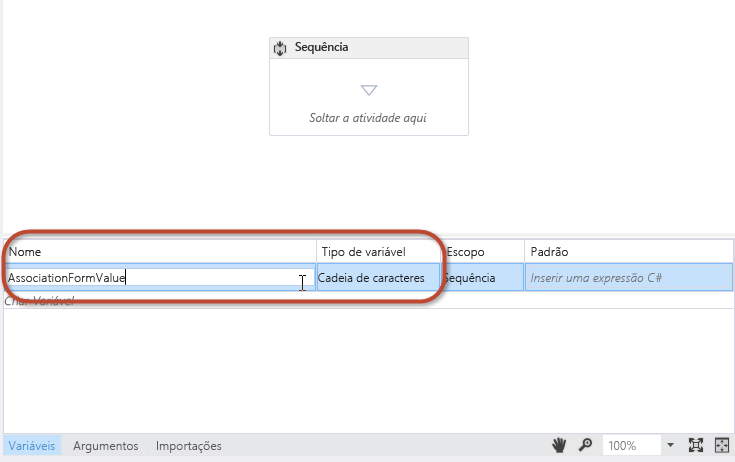
  

  

  
2. Arraste e solte uma atividade **ObterValorDeConfiguração** na superfície do designer do fluxo de trabalho e defina a propriedade **Name** para o nome da propriedade de metadados usada no formulário, conforme mostrado na Figura 4.
    
   **Figura 4.**

  

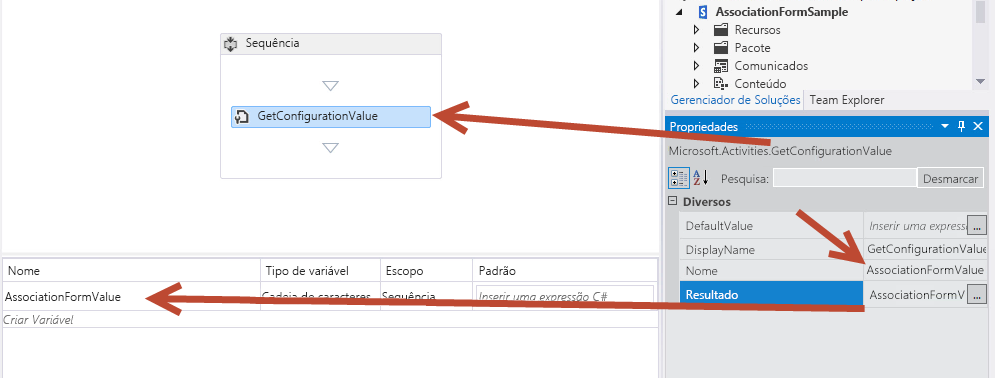
  

  

  
3. Defina a propriedade **Result** para o nome da variável, conforme mostrado na Figura 4.
    
    Essa atividade retira o valor de propriedade **AssociationFormValue** dos metadados do fluxo de trabalho e o armazena na variável local. Para visualizar os conteúdos da variável, adicione uma atividade **GravarNoHistórico** ao fluxo de trabalho e defina a propriedade **Message** para gravar o valor da variável na lista do histórico.
    
  
4. Você concluiu as etapas necessárias para associar os valores de formulário ao fluxo de trabalho. Salve seu trabalho e teste o formulário.
    
  

### Testar o formulário de associação personalizado


1. Para testar o fluxo de trabalho, pressione **F5** ou clique no botão **Iniciar** no Visual Studio. Esse passo a passo pressupõe uma instalação local do SharePoint Server 2013, de forma que o Visual Studio inicializa o utilitário do Host de Serviço de Teste do Gerenciador de Fluxo de Trabalho e implanta o fluxo de trabalho ao site do desenvolvedor.
    
  
2. Crie a associação navegando até a lista **Comunicados**, na faixa de opções selecione a guia **Lista** e clique no botão **Configurações do Fluxo de Trabalho** e, em seguida, clique no link **Adicionar um fluxo de trabalho**. Nesse momento será apresentado o formulário de associação do SharePoint.
    
  
3. No formulário de associação, selecione o fluxo de trabalho que você deseja testar e dê um nome a ele.
    
  
4. Opte por criar novas listas de tarefas e do histórico, defina o fluxo de trabalho para iniciar manualmente e, em seguida, clique em **Avançar**.
    
  
5. Como você especificou um formulário de associação personalizado na definição do fluxo de trabalho, o formulário de associação personalizado mostrado na Figura 5 será exibido.
    
   **Figura 5. O formulário de associação de fluxo de trabalho personalizado.**

  

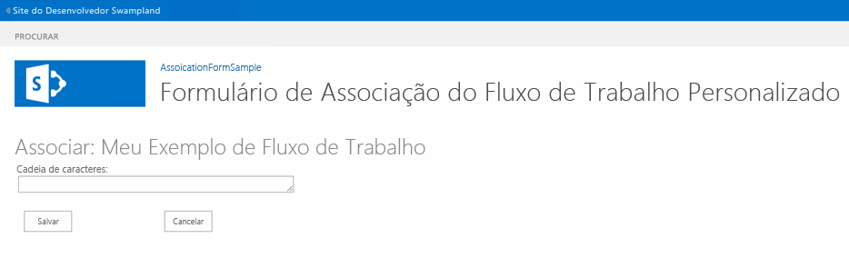
  

  

  
6. Insira um valor no campo do formulário e clique em **Salvar**. Isso cria a associação e armazena o valor personalizado nos metadados para a associação de fluxo de trabalho.
    
  
7. Para verificar se o fluxo de trabalho pode extrair o valor das definições de configuração, navegue de volta até a lista **Comunicados** e crie um novo item. Após criar o item, inicie manualmente o fluxo de trabalho personalizado. Uma vez iniciado o fluxo de trabalho, navegue até a página de status de instância de fluxo de trabalho do item e confirme que o valor foi escrito para a lista do histórico, como ilustrado na Figura 6.
    
   **Figura 6. Página de status do fluxo de trabalho.**

  

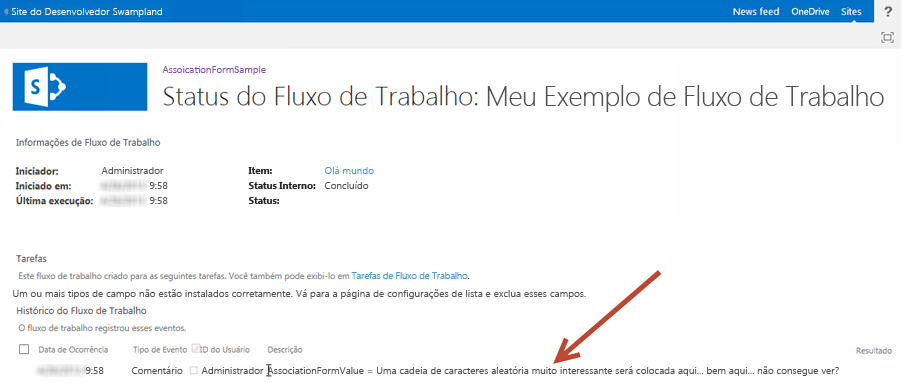
  

  

  

## Passo a passo: Criar um formulário de iniciação personalizado
<a name="sec4"> </a>

Esta explicação passo a passo demonstra como criar um formulário de associação personalizado e usá-lo para coletar informações do usuário quando o fluxo de trabalho é iniciado manualmente.
  
    
    

### Criar um novo projeto de fluxo de trabalho


1. Comece criando um fluxo de trabalho personalizado usando o Visual Studio 2012, certifique-se de que você possui acesso a um site do desenvolvedor do SharePoint Server 2013.
    
  
2. Crie um novo projeto do SharePoint que esteja configurado como um aplicativo hospedado do SharePoint.
    
  
3. Adicione uma nova lista **Comunicado** ao projeto. Utilizaremos essa lista como o contêiner para os itens que usamos para disparar o fluxo de trabalho.
    
  
4. Em seguida, adicione um item de fluxo de trabalho ao projeto, clicando com o botão direito no ícone do projeto no **Gerenciador de Soluções** e selecionando **Adicionar**, **Novo Item** e, em seguida, na caixa de diálogo **Adicionar Novo Item** selecionando o item de projeto **Fluxo de Trabalho**. e 
    
  
5. Nomeie o novo fluxo de trabalho "ModeloDeFormulárioDeIniciaçãoDeFluxoDeTrabalho" e clique em **Avançar**.
    
  
6. Quando solicitado, defina o novo item de fluxo de trabalho como um **Fluxo de Trabalho de Lista** associado à lista **Comunicados**; configure o fluxo de trabalho para iniciar manualmente. (Observe que o formulário de iniciação não será exibido caso o fluxo de trabalho inicie automaticamente.)
    
  
7. Nesse momento, o projeto aparece no **Gerenciador de Soluções** conforme mostrado na Figura 7. Observe que alguns elementos, como a **WorkflowHistoryList** e a **WorkflowTaskList**, foram adicionados automaticamente quando a associação foi criada.
    
   **Figura 7. Aparência do projeto no Gerenciador de Soluções.**

  

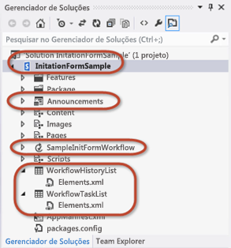
  

  

  

### Adicionar argumentos para coletar valores de formulário de iniciação

O formulário de iniciação de fluxo de trabalho pede aos usuários dois tipos de informação necessários para iniciar o fluxo de trabalho: uma sequência de caracteres aleatória, além de um usuário selecionado usando o controle seletor de pessoas. Para permitir isso, configure dois argumentos cujos valores a API CSOM de Serviços de Fluxo de Trabalho obterá a partir do formulário quando ele for enviado.
  
    
    

1. No designer de fluxo de trabalho, clique na guia **Argumentos** na parte inferior da tela e crie dois argumentos, conforme mostrado na Figura 8. Nomeie-os **UserLoginName** e **SomeRandomString**. 
    
   **Figura 8. Configuração dos argumentos do formulário de iniciação.**

  

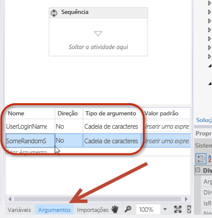
  

  

  
2. Defina o **Tipo de argumento** como **String** para ambos. Também defina a **Direção** como **In**, conforme mostrado na Figura 8.
    
    Você pode pensar na propriedade **Direction** como uma propriedade de classe .NET. Quando a direção é definida como **In**, a propriedade possui um método **Set** público, mas um método **Get** particular. Quando a direção é definida como **Out**, a propriedade apresenta um método **Get** público, mas um método **Set** particular. Por fim, quando definida como **In/Out**, tanto o método **Get** como o **Set** são públicos.
    
  
3. Para visualizar os conteúdos desses dois argumentos, adicione um par de atividades **GravarNoHistórico** ao fluxo de trabalho e configure cada uma para gravar os conteúdos dos argumentos na lista do histórico.
    
    Você pode usar esses argumentos da mesma forma que usa variáveis, mas lembre-se de que ao definir a **Direção** você está ditando a capacidade de leitura/gravação. A Figura 9 mostra qual deve ser a aparência de uma destas atividades quando configurada.
    

   **Figura 9. Configuração de uma atividade GravarNoHistórico para testar os argumentos**

  

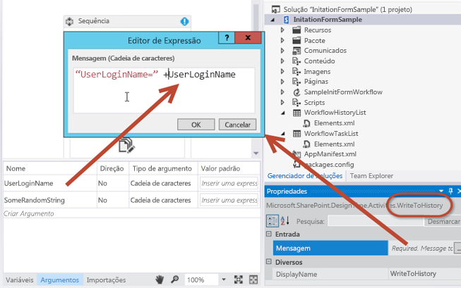
  

  

  

### Adicionar o item de projeto de formulário de iniciação

Com o fluxo de trabalho configurado para aceitar os dois argumentos de entrada do formulário, a próxima etapa é adicionar o formulário ao projeto.
  
    
    

1. Clique com o botão direito no item de fluxo de trabalho no **Gerenciador de Soluções** e selecione **Adicionar**, em seguida, selecione **Novo Item**.
    
  
2. Selecione o item de projeto do **Formulário de Iniciação de Fluxo de Trabalho** e remova o número "1" do nome, para que o formulário seja nomeado "FormulárioDeIniciação.aspx" e, em seguida, clique em **Adicionar**. Isso faz com que o Visual Studio adicione uma nova página ASPX ao módulo **Páginas** já apresentado na árvore do projeto. Essa ação garante que o formulário será provisionado para a subpasta **Páginas** no aplicativo. O Visual Studio também alterou propriedades no item de fluxo de trabalho.
    
  
3. Selecione o item de fluxo de trabalho **FormulárioDeIniciaçãoDeFluxoDeTrabalhoSimples** no **Gerenciador de Soluções** e na grade **Propriedades**, observe quais propriedades do formulário de iniciação foram definidas. Uma delas, na verdade, está apontando para o caminho relativo do site do formulário que acabou de ser adicionado ao módulo **Páginas**.
    
  

### Analisar e atualizar o formulário de iniciação padrão

Quando você adicionou o novo formulário de iniciação ao projeto, obteve automaticamente o Visual Studio 2012. Bem como no caso do formulário de associação, esse novo formulário de iniciação necessita que duas ações sejam executadas:
  
    
    

- Atualize o formulário HTML para especificar os elementos de dados que devem ser coletados do usuário, bem como para especificar como o formulário deve ser apresentado.
    
  
- Atualize o bloco JavaScript padrão para receber os valores de entrada do usuário do formulário e fazer a correspondência entre os nomes de propriedade e os nomes dos argumentos que criamos no fluxo de trabalho.
    
  

> **OBSERVAçãO**
> No arquivo de origem, observe que o primeiro espaço reservado para o conteúdo do ASP.NET, **PlaceHolderAdditionalPageHead**, contém referências à biblioteca CSOM de Serviços do Fluxo de Trabalho ( **sp.workflowservices.js** ) e às principais bibliotecas CSOM do SharePoint Server 2013 ( **sp.js** e **sp.runtime.js** ). Imediatamente após esta seção do código, há um comentário no lado do servidor que contém uma observação comentada. Lembre-se de que esta observação, mostrada na Figura 10, é irrelevante e deve ser ignorada.
  
    
    


**Figura 10. Comentário do código para ignorar.**

  
    
    

  
    
    
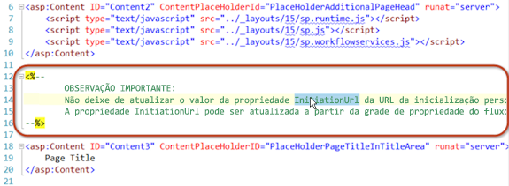
  
    
    

### Atualizar o formulário HTML


1. Role para baixo no arquivo de código do formulário até chegar ao espaço reservado para o conteúdo ASP.NET denominado  `PlaceHolderMain`. Observe que a primeira parte desta seção contém uma tabela HTML com três campos de formulário. Precisamos de apenas dois.
    
  
2. Atualize esta tabela HTML, substituindo-a pelo seguinte:
    
  ```
  
<table>
  <tr>
    <td>
      String:<br />
      <input type="text" id="strInput" />
    </td>
  </tr>
  <tr>
    <td>
      User Picker:<br />
      <SharePoint:PeopleEditor AllowEmpty="false" ValidatorEnabled="true" MultiSelect="false" ID="peoplePicker" runat="server" />
    </td>
  </tr>
  <tr>
    <td>
      <input type="button" name="startWorkflowButton" value="Start" onclick="StartWorkflow()" />
      <input type="button" name="cancelButton" value="Cancel" onclick="RedirFromInitForm()" />
      <br />
    </td>
  </tr>
</table>

  ```

A tabela contém agora dois controles de entrada. O primeiro é uma caixa de texto HTML padrão cuja ID é **strInput**. O segundo é um controle seletor de pessoas do SharePoint cuja ID é **peoplePicker**. Esse último é um controle de servidor. No entanto, é permitido na página porque foi implantado para cada computador do SharePoint Server 2013. Além disso, o controle é mencionado na parte superior do formulário de iniciação.
  
    
    
Agora, observe os dois botões no formulário, **Iniciar** ("BotãoIniciarFluxoDeTrabalho") e **Cancelar** ("BotãoCancelar"). Clicar no botão Iniciar chama a função **StartWorkflow()**JavaScript. A função está localizada em um bloco de script mais abaixo no arquivo do formulário e é o assunto da próxima alteração que precisamos executar.
  
    
    

### Atualize o bloco de código JSOM para iniciar o fluxo de trabalho


1. Localize o bloco de código JavaScript que aparece imediatamente após a tabela HTML que alteramos. Deixaremos o código no bloco de script praticamente inalterado.
    
    Este código demonstra a enorme potência e a flexibilidade disponível na API do Modelo de Objeto do Lado do Cliente (JSOM) dos Serviços de Fluxo de Trabalho de JavaScript que foi implementada no SharePoint Server 2013. De forma geral, o código executa as seguintes etapas.
    
  
2. Localize a seguinte linha do código:  `var wfParams = new Object();`
    
  
3. Imediatamente após essa linha, substitua o código existente com seu próprio código para recepção de valores de dois campos de formulário HTML criados alguns minutos atrás: **strInput** e **peoplePicker**. Para fazer isso, adicione a seguinte referência à biblioteca do jQuery para o elemento **PlaceHolderAdditionalPageHead** na marcação HTML. Isso facilita a obtenção dos valores do formulário.
    
  ```
  
<script type="text/javascript" src="../Scripts/jquery-1.8.2.min.js"></script>
  ```

4. Agora, volte para a parte do bloco de script JSOM onde os parâmetros são coletados do formulário. Substitua o JavaScript existente pelo código a seguir:
    
  ```
  var wfParams = new Object();
// get people picker value
var html = $("ctl00_PlaceHolderMain_peoplePicker_upLevelDiv");
wfParams['UserLoginName'] = $("#divEntityData", html).attr("key");

// get string input
var strInputValue = $("strInput").value;
wfParams['SomeRandomString'] = strInputValue

  ```

5. Salve as alterações.
    
  
O código modificado no procedimento anterior executa grande parte do trabalho:
  
    
    

- Obtém esses três parâmetros a partir da sequencia de consulta na URL:
    
  - A ID do item que será associada à nova instância de fluxo de trabalho, salva na variável JavaScript **[itemId]**.
    
  
  - A ID da associação de fluxo de trabalho no site atual, na lista ou na biblioteca de documentos salvos na variável JavaScript **[subscriptionId]**.
    
  
  - A URL da qual o usuário veio, salva na variável JavaScript **[redirectUrl]**. É para ela que o usuário será direcionado depois de preencher o formulário e quando o fluxo de trabalho for iniciado.
    
  
- Cria uma matriz de propriedades a ser enviada para o fluxo de trabalho, salvo na variável JavaScript **[wfParams]**. Estes são os valores que você precisará coletar do formulário e a segunda das duas etapas mínimas necessário para editar o formulário de iniciação personalizado.
    
  
- Obtém as referências para um contexto de cliente do CSOM do SharePoint, bem como os serviços de fluxo de trabalho necessários.
    
  
- Depois que o script está conectado ao Serviço de Assinatura de Serviços de Fluxo de Trabalho (referenciado na variável **[subscriptionService]** ), ele executa uma das seguintes tarefas:
    
  
- 
  - Se o script tiver obtido uma ID de item da sequência de consulta na primeira etapa, em seguida, ele iniciará uma nova instância do fluxo de trabalho no item de lista especificado ao chamar a função **[startWorkflowOnListItem()]** do serviço de instância dos Serviços de Fluxo de Trabalho.
    
  
  - Se nenhuma ID for encontrada, ele iniciará uma nova instância do fluxo de trabalho no site atual ao chamar a função **[startWorkflow()]** do serviço de instância dos Serviços de Fluxo de Trabalho.
    
  

### Teste o formulário de iniciação personalizado

Teste o fluxo de trabalho pressionando F5 ou clicando no botão **Iniciar** no Visual Studio 2012. Se estiver realizando o teste em uma instalação local do SharePoint Server 2013, o Visual Studio 2012 iniciará o utilitário do Host do Serviço de Teste do Gerenciador de Fluxo de Trabalho e implantará o fluxo de trabalho para o site do desenvolvedor. Após alguns instantes, será aberto o site do desenvolvedor.
  
    
    
Navegue até a lista **Comunicados** e crie um novo item. Após a criação do item, inicie o fluxo de trabalho personalizado.
  
    
    
Como a definição de fluxo de trabalho contém uma referência a um formulário de iniciação, o usuário é direcionado primeiro para esse formulário. Preencha os valores solicitados e clique no botão **Iniciar**. Isso dispara o JavaScript na página, o que inicia a instância do fluxo de trabalho, como mostrado na Figura 11.
  
    
    

**Figura 11. Disparando o fluxo de trabalho.**

  
    
    

  
    
    
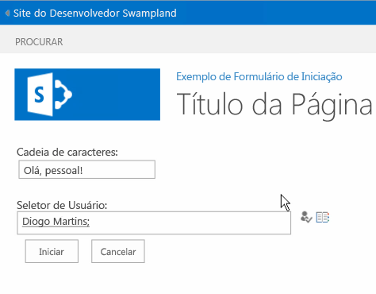
  
    
    
Depois de iniciar o fluxo de trabalho, a página redireciona o usuário para a página de origem. Dê ao fluxo de trabalho alguns instantes para que ele seja iniciado, em seguida, volte para o item e exiba a página de status da instância do fluxo de trabalho. Observe que a lista do histórico contém os valores que foram enviados no formulário e enviados ao SharePoint depois que a instância de fluxo de trabalho foi criada com o JSOM de Serviços de Fluxo de Trabalho.
  
    
    

**Figura 12. Conclusão do fluxo de trabalho.**

  
    
    

  
    
    
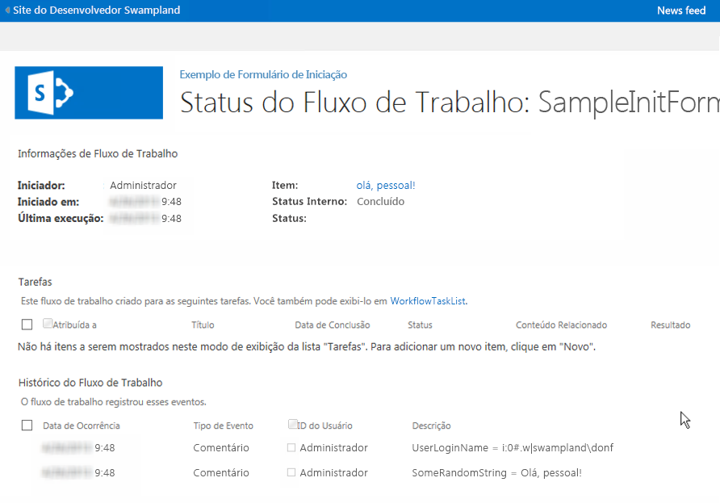
  
    
    

  
    
    

  
    
    

## Conclusão
<a name="sec6"> </a>

O SharePoint 2013 introduziu várias melhorias para fluxos de trabalho. Este artigo detalha as alterações relacionadas a formulários de fluxo de trabalho que foram orientadas a partir de alterações feitas na arquitetura do fluxo de trabalho do SharePoint Server 2013. Este artigo também demonstrou como criar os formulários de associação e iniciação personalizados que podem ser usados para atender a requisitos exigentes na automatização de processos empresariais atuais usando o Visual Studio 2012.
  
    
    

## Recursos Adicionais
<a name="sec7"> </a>


-  [Formulários de Associação e Iniciação de Fluxo de Trabalho (SharePoint Foundation)](http://msdn.microsoft.com/pt-br/library/office/ms481192%28v=office.14%29.aspx)
    
  
-  [Trabalhando com o modelo de objeto SharePoint 2013 Workflow Services cliente lado](working-with-the-sharepoint-2013-workflow-services-client-side-object-model.md)
    
  
-  [Personalizar um modo de exibição de lista de suplementos do SharePoint usando o processamento do lado do cliente](http://msdn.microsoft.com/library/8d5cabb2-70d0-46a0-bfe0-9e21f8d67d86%28Office.15%29.aspx)
    
  

