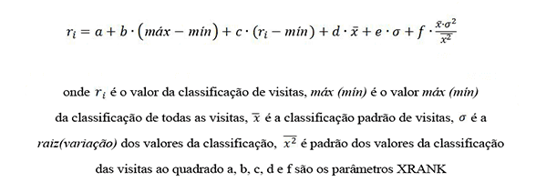

# Referência de sintaxe da Linguagem de Consulta de Palavra-chave (KQL)
Aprenda a criar consultas KQL para o Pesquisa no SharePoint 2013. Esta referência de sintaxe descreve os elementos de consulta KQL e como usar os operadores e as restrições de propriedade em consultas KQL.
## Elementos de uma consulta KQL

Uma consulta KQL consiste em um ou mais dos seguintes elementos: 
  
    
    

- Palavras-chave de texto livres — palavras ou frases 
    
  
- Restrições de propriedade 
    
  
Você pode combinar elementos de consulta KQL com um ou mais operadores disponíveis.
  
    
    
Se a consulta KQL contém apenas operadores ou se estiver vazia, ela não é válida. As consultas KQL não diferenciam maiúsculas de minúsculas, já os operadores diferenciam (letras maiúsculas).
  
    
    

> **OBSERVAçãO**
> O tamanho limite de uma consulta KQL varia dependendo de como foi criada. Se você criar uma consulta KQL usando o padrão do front end de pesquisa do SharePoint, o limite é de 2.048 caracteres. Entretanto, as consultas que você cria de forma programática usando o modelo de objeto de consulta tem um limite padrão de 4.096 caracteres. Você pode aumentar este limite para até 20.480 caracteres usando a propriedade do  [MaxKeywordQueryTextLength](https://msdn.microsoft.com/library/Microsoft.Office.Server.Search.Administration.SearchServiceApplication.MaxKeywordQueryTextLength.aspx) ou a propriedade do [DiscoveryMaxKeywordQueryTextLength](https://msdn.microsoft.com/library/Microsoft.Office.Server.Search.Administration.SearchServiceApplication.DiscoveryMaxKeywordQueryTextLength.aspx) (para a Descoberta eletrônica).
  
    
    

## Criando consultas de texto livre usando KQL

Quando você cria sua consulta KQL usando expressões de texto livre, o Pesquisa no SharePoint 2013 combina os resultados para os termos que você escolheu com base nos termos armazenados no índice de texto completo. Isso inclui os valores de propriedade gerenciada em que o  [FullTextQueriable](https://msdn.microsoft.com/library/Microsoft.Office.Server.Search.Administration.ManagedProperty.FullTextQueriable.aspx) é definido como **true**.
  
    
    
Consultas KQL texto livre diferenciam maiúsculas de minúsculas, mas os operadores devem estar em maiúsculas. Você pode criar consultas KQL usando um ou mais das expressões de texto livre a seguir:
  
    
    

- Uma **word** (inclui um ou mais caracteres sem espaços ou pontuação)
    
  
- Uma **phrase** (inclui duas ou mais palavras juntas, separadas por espaços; no entanto, as palavras devem ser colocadas entre aspas duplas)
    
  
Para criar consultas complexas, você pode combinar várias expressões de texto livre com operadores de consulta KQL. Se houver várias expressões de texto livre sem os operadores entre eles, o comportamento da consulta é o mesmo que o usado no operador de **AND**.
  
    
    

### Usando palavras na consulta KQL de texto livre

Quando você usa palavras em uma consulta KQL de texto livre, o Pesquisa no SharePoint 2013 retorna resultados com base em correspondências exatas de suas palavras com os termos armazenados no índice de texto completo. Você pode usar apenas uma parte de uma palavra, desde o início da palavra, usando o operador curinga (*) para habilitar a correspondência de prefixo. Na correspondência de prefixo Pesquisa no SharePoint 2013 corresponde aos resultados com termos que contêm a palavra seguida de zero ou mais caracteres.
  
    
    
Por exemplo, as seguintes consultas KQL retornam itens de conteúdo que contenham os termos "federados" e "pesquisa": 
  
    
    
 `federated search`
  
    
    
 `federat* search`
  
    
    
 `search fed*`
  
    
    
Consultas KQL não oferecem suporte à correspondência de sufixo.
  
    
    

### Usando expressões na consulta KQL de texto livre

Quando você usar frases em uma consulta KQL de texto livre, o Pesquisa no SharePoint 2013 retorna apenas os itens em que as palavras estão localizadas próximas umas das outras na frase. Para especificar uma frase em uma consulta KQL, você deve usar aspas duplas. 
  
    
    
Consultas KQL não dão suporte para a correspondência de sufixos, portanto, você não pode usar o operador curinga antes de uma frase em consultas de texto livre. No entanto, você pode usar o operador curinga após uma frase.
  
    
    

## Consultas de restrição da propriedade em KQL

Com o KQL você pode criar consultas que usam restrições de propriedade para definir que o foco da consulta corresponda apenas aos resultados com base em uma condição especificada.
  
    
    

### Especificando restrições de propriedade

Uma restrição básica de propriedade consiste em:
  
    
    
 `<Property Name><Property Operator><Property Value>`
  
    
    
A tabela 1 lista alguns exemplos de sintaxe de restrições de propriedade válida em consultas KQL.
  
    
    

**A tabela 1. Sintaxe de restrição de propriedade válida**

|**Sintaxe**|**Retorna**|
|:-----|:-----|
| `author:"John Smith"`   |Retorna os itens de conteúdo criados por Pedro Gonçalves.    |
| `filetype:docx`   |Retornar documentos do Microsoft Word.    |
| `filename:budget.xlsx`   |Retorna itens de conteúdo com o nome do arquivo  `budget.xlsx`.    |
   
A restrição de propriedade não deve incluir o espaço em branco entre o nome da propriedade, o operador da propriedade e o valor da propriedade, ou a restrição de propriedade será tratada como uma consulta de texto livre. O comprimento de uma restrição de propriedade é limitado a 2.048 caracteres. 
  
    
    
Nos exemplos a seguir, o espaço em branco faz com que a consulta retorne os itens de conteúdo que contenham os termos "autor" e "Pedro Gonçalves", em vez dos itens de conteúdo criados por Pedro Gonçalves:
  
    
    
 `author: "John Smith"`
  
    
    
 `author :"John Smith"`
  
    
    
 `author : "John Smith"`
  
    
    
Em outras palavras, as restrições de propriedade anterior são equivalentes às seguintes:
  
    
    
 `author "John Smith"`
  
    
    

### Especificando nomes de propriedades para restrições de propriedade

Você deve especificar um nome válido de propriedade gerenciada para a restrição de propriedade. Por padrão, o Pesquisa no SharePoint 2013 inclui várias propriedades gerenciadas para documentos.
  
    
    
Para especificar uma restrição de propriedade para um valor de propriedade rastreada, primeiro você deve mapear a propriedade rastreada em uma propriedade gerenciada. Consulte **Propriedades gerenciadas e rastreadas** em [Planejar a experiência de pesquisa do usuário final](http://technet.microsoft.com/pt-br/library/cc263089.aspx). 
  
    
    
A propriedade gerenciada deve ser a  [Queryable](https://msdn.microsoft.com/library/Microsoft.Office.Server.Search.Administration.ManagedProperty.Queryable.aspx) para que você possa procurar essa propriedade gerenciada em um documento. Além disso, a propriedade gerenciada pode ser [Retrievable](https://msdn.microsoft.com/library/Microsoft.Office.Server.Search.Administration.ManagedProperty.Retrievable.aspx) para que a propriedade gerenciada seja recuperada. No entanto, a propriedade gerenciada não precisa ser [Retrievable](https://msdn.microsoft.com/library/Microsoft.Office.Server.Search.Administration.ManagedProperty.Retrievable.aspx) para executar pesquisas de propriedades.
  
    
    

### Operadores de propriedade que são suportados nas restrições de propriedade

Pesquisa no SharePoint 2013 oferece suporte a vários operadores de propriedade para as restrições de propriedade, conforme mostrado na tabela 2. 
  
    
    

**Tabela 2. Operadores de propriedade válidos para restrições de propriedade**

|**Operador**|**Descrição**|**Suporte para o tipo de propriedade gerenciada**|
|:-----|:-----|:-----|
|:    |Retorna resultados em que o valor especificado na restrição de propriedade é igual ao valor da propriedade armazenado no banco de dados do repositório de propriedade ou coincide com termos individuais no valor da propriedade armazenado no índice de texto completo.    | [Text](https://msdn.microsoft.com/library/Microsoft.Office.Server.Search.Administration.ManagedDataType.Text.aspx)    [DateTime](https://msdn.microsoft.com/library/Microsoft.Office.Server.Search.Administration.ManagedDataType.DateTime.aspx)    [Integer](https://msdn.microsoft.com/library/Microsoft.Office.Server.Search.Administration.ManagedDataType.Integer.aspx)    [Decimal](https://msdn.microsoft.com/library/Microsoft.Office.Server.Search.Administration.ManagedDataType.Decimal.aspx)    [Double](https://msdn.microsoft.com/library/Microsoft.Office.Server.Search.Administration.ManagedDataType.Double.aspx)    [YesNo](https://msdn.microsoft.com/library/Microsoft.Office.Server.Search.Administration.ManagedDataType.YesNo.aspx)   |
|=    |Retorna resultados de pesquisa em que o valor da propriedade é igual ao valor especificado na restrição de propriedade.    > **OBSERVAçãO**> Não é recomendável combinar o operador **=** com o asterisco ( *****) quando você faz uma correspondência exata.           | [Text](https://msdn.microsoft.com/library/Microsoft.Office.Server.Search.Administration.ManagedDataType.Text.aspx)    [DateTime](https://msdn.microsoft.com/library/Microsoft.Office.Server.Search.Administration.ManagedDataType.DateTime.aspx)    [Integer](https://msdn.microsoft.com/library/Microsoft.Office.Server.Search.Administration.ManagedDataType.Integer.aspx)    [Decimal](https://msdn.microsoft.com/library/Microsoft.Office.Server.Search.Administration.ManagedDataType.Decimal.aspx)    [Double](https://msdn.microsoft.com/library/Microsoft.Office.Server.Search.Administration.ManagedDataType.Double.aspx)    [YesNo](https://msdn.microsoft.com/library/Microsoft.Office.Server.Search.Administration.ManagedDataType.YesNo.aspx)   |
|<    |Retorna resultados em que o valor da propriedade é menor que o valor especificado na restrição de propriedade.    | [DateTime](https://msdn.microsoft.com/library/Microsoft.Office.Server.Search.Administration.ManagedDataType.DateTime.aspx)    [Integer](https://msdn.microsoft.com/library/Microsoft.Office.Server.Search.Administration.ManagedDataType.Integer.aspx)    [Decimal](https://msdn.microsoft.com/library/Microsoft.Office.Server.Search.Administration.ManagedDataType.Decimal.aspx)    [Double](https://msdn.microsoft.com/library/Microsoft.Office.Server.Search.Administration.ManagedDataType.Double.aspx)   |
|>    |Retorna resultados de pesquisa em que o valor da propriedade é maior que o valor especificado na restrição de propriedade.    | [DateTime](https://msdn.microsoft.com/library/Microsoft.Office.Server.Search.Administration.ManagedDataType.DateTime.aspx)    [Integer](https://msdn.microsoft.com/library/Microsoft.Office.Server.Search.Administration.ManagedDataType.Integer.aspx)    [Decimal](https://msdn.microsoft.com/library/Microsoft.Office.Server.Search.Administration.ManagedDataType.Decimal.aspx)    [Double](https://msdn.microsoft.com/library/Microsoft.Office.Server.Search.Administration.ManagedDataType.Double.aspx)   |
|<=    |Retorna resultados de pesquisa em que o valor da propriedade é menor ou igual ao valor especificado na restrição de propriedade.    | [DateTime](https://msdn.microsoft.com/library/Microsoft.Office.Server.Search.Administration.ManagedDataType.DateTime.aspx)    [Integer](https://msdn.microsoft.com/library/Microsoft.Office.Server.Search.Administration.ManagedDataType.Integer.aspx)    [Decimal](https://msdn.microsoft.com/library/Microsoft.Office.Server.Search.Administration.ManagedDataType.Decimal.aspx)    [Double](https://msdn.microsoft.com/library/Microsoft.Office.Server.Search.Administration.ManagedDataType.Double.aspx)   |
|>=    |Retorna resultados de pesquisa em que o valor da propriedade é maior ou igual ao valor especificado na restrição de propriedade.    | [DateTime](https://msdn.microsoft.com/library/Microsoft.Office.Server.Search.Administration.ManagedDataType.DateTime.aspx)    [Integer](https://msdn.microsoft.com/library/Microsoft.Office.Server.Search.Administration.ManagedDataType.Integer.aspx)    [Decimal](https://msdn.microsoft.com/library/Microsoft.Office.Server.Search.Administration.ManagedDataType.Decimal.aspx)    [Double](https://msdn.microsoft.com/library/Microsoft.Office.Server.Search.Administration.ManagedDataType.Double.aspx)   |
|<>    |Retorna resultados de pesquisa em que o valor da propriedade não é igual ao valor especificado na restrição da propriedade.    | [DateTime](https://msdn.microsoft.com/library/Microsoft.Office.Server.Search.Administration.ManagedDataType.DateTime.aspx)    [Integer](https://msdn.microsoft.com/library/Microsoft.Office.Server.Search.Administration.ManagedDataType.Integer.aspx)    [Decimal](https://msdn.microsoft.com/library/Microsoft.Office.Server.Search.Administration.ManagedDataType.Decimal.aspx)    [Text](https://msdn.microsoft.com/library/Microsoft.Office.Server.Search.Administration.ManagedDataType.Text.aspx)    [Double](https://msdn.microsoft.com/library/Microsoft.Office.Server.Search.Administration.ManagedDataType.Double.aspx)    [YesNo](https://msdn.microsoft.com/library/Microsoft.Office.Server.Search.Administration.ManagedDataType.YesNo.aspx)   |
|..    |Retorna resultados de pesquisa em que o valor da propriedade esteja dentro do intervalo especificado na restrição de propriedade.    Por exemplo, o intervalo A..B representa um conjunto de valores de A para B onde tanto A quanto B são inclusivos. Para intervalos de datas, isso representa desde o começo de um dia A até o final do dia B.    | [DateTime](https://msdn.microsoft.com/library/Microsoft.Office.Server.Search.Administration.ManagedDataType.DateTime.aspx)    [Integer](https://msdn.microsoft.com/library/Microsoft.Office.Server.Search.Administration.ManagedDataType.Integer.aspx)    [Decimal](https://msdn.microsoft.com/library/Microsoft.Office.Server.Search.Administration.ManagedDataType.Decimal.aspx)    [Double](https://msdn.microsoft.com/library/Microsoft.Office.Server.Search.Administration.ManagedDataType.Double.aspx)   |
   

### Especificando valores de propriedade

Você deve especificar um valor de propriedade que seja um tipo de dados válidos para o tipo da propriedade gerenciada. A tabela 3 lista estes tipos de mapeamentos.
  
    
    

**Tabela 3. Tipos de mapeamentos de dados válidos para tipos de propriedades gerenciadas**

|**Tipo gerenciado**|**Tipo de dados**|
|:-----|:-----|
| [Text](https://msdn.microsoft.com/library/Microsoft.Office.Server.Search.Administration.ManagedDataType.Text.aspx)   | [String](https://msdn.microsoft.com/library/System.String.aspx)   |
| [Integer](https://msdn.microsoft.com/library/Microsoft.Office.Server.Search.Administration.ManagedDataType.Integer.aspx)   | [Int64](https://msdn.microsoft.com/library/System.Int64.aspx)   |
| [Double](https://msdn.microsoft.com/library/Microsoft.Office.Server.Search.Administration.ManagedDataType.Double.aspx)   | [System.Double](https://msdn.microsoft.com/library/System.Double.aspx)   |
| [Decimal](https://msdn.microsoft.com/library/Microsoft.Office.Server.Search.Administration.ManagedDataType.Decimal.aspx)   | [Decimal](https://msdn.microsoft.com/library/System.Decimal.aspx)   |
| [DateTime()](https://msdn.microsoft.com/library/Microsoft.Office.Server.Search.Administration.ManagedDataType.DateTime.aspx)   | [DateTime](https://msdn.microsoft.com/library/System.DateTime.aspx)   |
| [YesNo](https://msdn.microsoft.com/library/Microsoft.Office.Server.Search.Administration.ManagedDataType.YesNo.aspx)   | [Boolean](https://msdn.microsoft.com/library/System.Boolean.aspx)   |
   

#### Valores de propriedade de texto

Para valores de propriedade de texto, o comportamento de correspondência depende do local de armazenamento da propriedade, se no índice de texto completo ou no índice de pesquisa 
  
    
    

#### Valores de propriedade no índice de texto completo

Valores de propriedade são armazenados no índice de texto completo, quando a propriedade **FullTextQueriable** estiver definida como **true** para uma propriedade gerenciada. Você pode configurar isso apenas para propriedades de cadeia de caracteres. Valores de propriedade especificados na consulta são comparados com termos individuais armazenados no índice de texto completo. Use a propriedade [NoWordBreaker](https://msdn.microsoft.com/library/Microsoft.Office.Server.Search.Administration.ManagedProperty.NoWordBreaker.aspx) para determinar se vai coincidir com o valor da propriedade inteira.
  
    
    
Por exemplo, se você estiver procurando por um item de conteúdo criado por Paulo Araújo, a seguinte consulta KQL retorna resultados correspondentes:
  
    
    
 `author:Shakespear`
  
    
    
 `author:Paul`
  
    
    
Também há suporte para a correspondência de prefixo. Você pode usar o operador curinga (*), mas não é necessário quando você especificar palavras individuais. Continuando com o exemplo anterior, a seguinte consulta KQL retorna itens de conteúdo criado por Paulo Araújo, como a seguir: 
  
    
    
 `author:Shakesp*`
  
    
    
Quando você especificar uma frase para o valor da propriedade, os resultados correspondentes deverão conter a frase especificada dentro do valor de propriedade que é armazenado no índice de texto completo. O exemplo de consulta a seguir retorna os itens de conteúdo com o texto "Pesquisa avançada" no título, como "XML de pesquisa avançada", "Aprendizado sobre a Web Part Pesquisa Avançada" e assim por diante:
  
    
    
 `title:"Advanced Search"`
  
    
    
Também há suporte para a correspondência de prefixo com expressões especificadas nos valores de propriedade, mas você deve usar o operador curinga (*) na consulta e só há suporte no final da frase, da seguinte maneira:
  
    
    
 `title:"Advanced Sear*"`
  
    
    
As consultas a seguir não retornam os resultados esperados:
  
    
    
 `title:"Advan* Search"`
  
    
    
 `title:"Advanced Sear"`
  
    
    

#### Valores numéricos para propriedades

Para valores de propriedade numérica, que incluem o tipos gerenciados **Integer**, **Double** e **Decimal**, a restrição de propriedade é comparada com todo o valor da propriedade. 
  
    
    

### Valores de data ou hora para propriedades

KQL fornece o tipo de dados **datetime** de data e hora. Há suporte para os seguintes formatos de datetime compatíveis com ISO 8601 em consultas:
  
    
    

- AAAA-MM-DD
    
  
- AAAA-MM-DDThh:mm:ss
    
  
- AAAA-MM-DDThh:mm:ssZ
    
  
- AAAA-MM-DDThh:mm:ssfrZ
    
  
Nestes formatos de **datetime**:
  
    
    

-  _YYYY_ especifica um ano de quatro dígitos.
    
    > **OBSERVAçãO**
      > Há suporte apenas para anos de quatro dígitos. 
-  _MM_ especifica um mês de dois dígitos. Por exemplo, 01 = janeiro.
    
  
-  _DD_ especifica um dia de dois dígitos do mês (01 a 31).
    
  
-  _T_ especifica a letra "T".
    
  
-  _hh_ especifica uma hora de dois dígitos (de 00 a 23); Indicação AM/PM não é permitida..
    
  
-  _mm_ especifica um minuto de dois dígitos (de 00 a 59).
    
  
-  _ss_ especifica um segundo de dois dígitos (de 00 a 59).
    
  
-  _fr_ especifica uma fração opcional de segundos, ss; entre os dígitos de 1 a 7 que seguem o **.** após os segundos. Por exemplo, 2012-09-27T11:57:34.1234567.
    
  
Todos os valores de data/hora devem ser especificados de acordo com o UTC (Tempo Universal Coordenado), também conhecido como fuso de horário GMT (Hora de Greenwich). O identificador de zona de tempo do UTC (um caractere "Z" à direita) é opcional.
  
    
    

#### Intervalos de datas relevantes para os que o KQL dá suporte

KQL permite que você crie consultas de pesquisa que oferecem suporte a consulta de intervalo relativo "dia", com palavras-chave reservadas como mostrado na tabela 4. Use aspas duplas ("") para intervalos de data com um espaço entre os nomes.
  
    
    

|**Nome do intervalo de datas**|**Descrição**|
|:-----|:-----|
|hoje    |Representa o tempo desde o início do dia atual até o final do dia atual.    |
|ontem    |Representa o tempo desde o início do dia até o final do dia que antecede o dia atual.    |
|esta semana    |Representa o tempo desde o início da semana atual até o final da semana atual. A cultura na qual o texto da consulta foi formulado é levada em conta para determinar o primeiro dia da semana.    |
|este mês    |Representa o tempo desde o início do mês atual até o final do mês atual.    |
|mês passado    |Representa todo o mês que precede o mês atual.    |
|este ano    |Representa o tempo desde o início do ano atual até o final do ano atual.    |
|ano passado    |Representa o ano inteiro que precede o ano atual.    |
   

### Usando várias restrições de propriedade em uma consulta KQL

Pesquisa no SharePoint 2013 oferece suporte ao uso de várias restrições de propriedade na mesma consulta KQL. Você pode usar a mesma propriedade para mais de uma restrição de propriedade ou uma propriedade diferente para cada restrição de propriedade. 
  
    
    
Quando você usa várias instâncias da mesma restrição de propriedade, as correspondências se baseiam na união das restrições de propriedade na consulta KQL. Correspondências incluem itens de conteúdo criados pelo Pedro Gonçalves ou Leila Gonçalves, da seguinte maneira:
  
    
    
 `author:"John Smith" author:"Jane Smith"`
  
    
    
Essa funcionalidade é igual à funcionalidade operador booliano **OR**, da seguinte maneira:
  
    
    
 `author:"John Smith" OR author:"Jane Smith"`
  
    
    
Quando você usa restrições de propriedades diferentes, as correspondências são baseadas em uma interseção das restrições de propriedade na consulta KQL, da seguinte maneira:
  
    
    
 `author:"John Smith" filetype:docx`
  
    
    
As correspondências são documentos da Microsoft Word criados pelo Pedro Gonçalves. Este é o mesmo que usar o operador booliano **AND**, da seguinte maneira::
  
    
    
 `author:"John Smith" AND filetype:docx`
  
    
    

## Operadores KQL para consultas complexas

Sintaxe KQL inclui vários operadores que você pode usar para criar consultas complexas. 
  
    
    

### Operadores Boolianos

Você pode usar os operadores boolianos para ampliar ou restringir sua pesquisa. Você pode usar os operadores boolianos com expressões de texto livre e restrições de propriedade em consultas KQL. A tabela 5 mostra os operadores boolianos com suporte.
  
    
    

**Tabela 5. Operadores boolianos com suporte no KQL**

|**Operador**|**Descrição**|
|:-----|:-----|
|**AND**   |Retorna resultados de pesquisa que incluem todas as expressões de texto livre ou restrições de propriedade especificadas com o operador **AND**. Você deve especificar uma expressão válida de texto livre e/ou uma restrição de propriedade válida antes e após o operador **AND**. Isto funciona da mesma maneira que usar o sinal de mais ("+").    |
|**NOT**   |Retorna resultados de pesquisa que não incluem as expressões de texto livre especificado ou restrições de propriedade. Você deve especificar uma expressão válida de texto livre e/ou uma restrição de propriedade válida após o operador **NOT**. Isso funciona da mesma maneira que usar o sinal de menos ("-").    |
|**OR**   |Retorna resultados de pesquisa que incluem uma ou mais expressões de texto livre especificado ou restrições de propriedade. Você deve especificar uma expressão válida de texto livre e/ou uma restrição de propriedade válida antes e após o operador **OR**.    |
   

  
    
    

### Operadores de proximidade

Usar operadores de proximidade que corresponda aos resultados em termos de pesquisa especificados que estejam dentro de uma proximidade entre si. Os operadores de proximidade só podem ser usados com expressões de texto classificados são compatíveis com as restrições de propriedade em consultas KQL. Há dois operadores de proximidade: **NEAR** e **ONEAR**.
  
    
    

#### Operador NEAR

O operador **NEAR** corresponde aos resultados em termos de pesquisa especificados que estejam dentro de uma proximidade entre si, sem preservar a ordem dos termos. A sintaxe para **NEAR** é a seguinte:
  
    
    
 `<expression> NEAR(n=4) <expression>`
  
    
    
Onde  _n_ é um parâmetro opcional que indica a distância máxima entre os termos. O valor de _n_ é um inteiro > = 0 com um padrão de **8**.
  
    
    
O parâmetro  _n_ pode ser especificado como `n=v` em que o _v_ representa o valor ou é reduzido apenas para _v_; como  `NEAR(4)` em que o _v_ é 4.
  
    
    
Por exemplo:
  
    
    
 `"acquisition" NEAR "debt"`
  
    
    
Esta consulta corresponde aos itens onde os termos "aquisição" e "dívida" aparecem dentro do mesmo item, onde uma instância de "aquisição" é seguida por até oito outros termos e, em seguida, uma instância do termo "dívida"; ou vice-versa. A ordem dos termos não é significativa para a correspondência.
  
    
    
Se você precisar de uma distância menor entre os termos, você pode especificá-la. A consulta a seguir corresponde aos itens em que os termos "aquisição" e "dívida" aparecem dentro do mesmo item, em que há uma distância máxima de 3 termos entre eles. Mais uma vez a ordem dos termos não afeta a correspondência.
  
    
    
 `"acquisition" NEAR(n=3) "debt"`
  
    
    

> **OBSERVAçãO**
> No SharePoint 2013 o operador **NEAR** não preserva a ordem dos tokens. Além disso, o operador **NEAR** agora recebe um parâmetro opcional que indica a distância máxima de token. No entanto, o valor padrão ainda é **8**. Se você precisar usar o comportamento anterior, use o **ONEAR**.
  
    
    

#### Operador ONEAR

O operador **ONEAR** corresponde aos resultados em termos de pesquisa especificados que estejam dentro de uma proximidade entre si, preservando a ordem dos termos. A sintaxe para o **ONEAR** é a seguinte, onde o _n_ é um parâmetro opcional que indica a distância máxima entre os termos. O valor de _n_ é um número inteiro >= 0 com um valor padrão de **8**.
  
    
    
 `<expression> ONEAR(n=4) <expression>`
  
    
    
O parâmetro  _n_ pode ser especificado como `n=v` em que o _v_ representa o valor ou é reduzido apenas para _v_; como  `ONEAR(4)` em que _v_ é 4.
  
    
    
Por exemplo, a consulta a seguir corresponde a itens em que os termos "aquisição" e "dívida" aparecem dentro do mesmo item, em que uma instância de "aquisição" é seguida por até oito outros termos e, em seguida, por uma instância do termo "dívida". A ordem dos termos **deve** corresponder a um item a ser retornado:
  
    
    
 `"acquisition" ONEAR "debt"`
  
    
    
Se você precisar de uma distância menor entre os termos, você pode especificá-la da seguinte maneira. Esta consulta corresponde a itens em que os termos "aquisição" e "dívida" aparecem dentro do mesmo item, em que há uma distância máxima de 3 termos entre eles. A ordem dos termos **deve** corresponder a um item a ser retornado:
  
    
    
 `"acquisition" ONEAR(n=3) "debt"`
  
    
    

### Operadores de sinônimo

Use o operador **WORDS** para especificar se os termos da consulta são sinônimos e se os resultados retornados devem corresponder qualquer um dos termos especificados. Você pode usar o operador **WORDS** com expressões de texto livre. Ele não oferece suporte para restrições de propriedade em consultas KQL.
  
    
    
O exemplo de consulta a seguir corresponde aos resultados que contêm o termo "TV" ou o termo "televisão". Esse comportamento de correspondência funciona da mesma maneira caso você feito a seguinte consulta:
  
    
    
 `WORDS(TV, Television)`
  
    
    
 `TV OR Television`
  
    
    
Essas consultas diferem em como os resultados são classificados. Quando você usa o operador **WORDS**, os termos "TV" e "televisão" são tratados como sinônimos, em vez de termos separados. Portanto, instâncias de qualquer um dos termos são classificadas como se fossem o mesmo termo. Por exemplo, um item de conteúdo que continha uma instância do termo "televisão" e cinco instâncias do termo "TV" deverão ser classificados da mesma forma que um item de conteúdo com seis instâncias do termo "TV".
  
    
    

### Operador curinga

Use o operador curinga — o caractere de asterisco (" ***** ") — para habilitar a correspondência de prefixo. Você pode especificar a parte de uma palavra, desde o início da palavra, seguido pelo operador curinga, em sua consulta, da seguinte maneira. Essa consulta deve corresponder aos resultados que incluem termos começando com "serv", seguidos por zero ou mais caracteres, como servem, servidor, serviço e assim por diante:
  
    
    
 `serv*`
  
    
    

### Operadores de inclusão e exclusão

Você pode especificar se os resultados são retornados devem incluir ou excluir o conteúdo que corresponde ao valor especificado na expressão de texto livre ou na restrição de propriedade usando os operadores de inclusão e exclusão, descritos na tabela 6.
  
    
    

**Tabela 6. Operadores para incluir e excluir conteúdo nos resultados**

|**Nome**|**Operador**|**Comportamento**|
|:-----|:-----|:-----|
|Inclusão    |" **+** "   |Inclui o conteúdo com valores que correspondem a inclusão.    Esse é o comportamento padrão se nenhum caractere for especificado. Isso é o mesmo que usar o operador **AND**.    |
|Exclusão    |" **-** "   |Exclui o conteúdo com valores que correspondam a exclusão. Isso é o mesmo que usar o operador **NOT**.    |
   

### Operador de classificação dinâmico

Use o operador **XRANK** para aumentar a classificação dinâmica de itens com base em determinadas ocorrências do termo dentro do _match expression_, sem alterar os itens que correspondem à consulta. Uma expressão de **XRANK** contém um ou mais componentes que devem apresentar uma correspondência, o _match expression_, e um ou mais componentes que contribuem apenas para a classificação dinâmica, e o  _rank expression_. Pelo menos **um** dos parâmetros, exceto _n_, deve ser especificado para que uma expressão de **XRANK** seja válida.
  
    
    
 _Match expressions_ pode ser qualquer expressão válida de KQL, incluindo expressões aninhadas **XRANK**.  _Rank expressions_ pode ser qualquer expressão válida do KQL sem expressões **XRANK**. Se suas consultas KQL tem vários operadores **XRANK** o valor final de classificação dinâmico é calculado conforme a soma aumenta em todos os operadores **XRANK**.
  
    
    

> **OBSERVAçãO**
> Use parênteses para indicar explicitamente a ordem de cálculo para consultas KQL que tiverem mais de um operador **XRANK** no mesmo nível.
  
    
    

Você pode usar o operador **XRANK** na seguinte sintaxe:
  
    
    
 `<match expression> XRANK(cb=100, rb=0.4, pb=0.4, avgb=0.4, stdb=0.4, nb=0.4, n=200) <rank expression>`
  
    
    
O cálculo de classificação dinâmico do operador **XRANK** baseia-se nesta fórmula:
  
    
    

  
    
    

  
    
    
A tabela 7 lista os parâmetros básicos disponíveis para o operador **XRANK**.
  
    
    

**Tabela 7. Parâmetros de operador XRANK**

|**Parâmetro**|**Valor**|**Descrição**|
|:-----|:-----|:-----|
| _n_   | _<valor_inteiro>_   |Especifica o número de resultados para calcular as estatísticas.    Este parâmetro não afeta o número de resultados para os que a classificação dinâmica contribui; é apenas um meio para excluir os itens sem importância dos cálculos das estatísticas.    Padrão: **0**. Um valor zero executa a semântica de *todos os documentos*  .   |
| _nb_   | _<valor_flutuante>_   |O parâmetro  _nb_ se refere ao aumento normalizado. Este parâmetro especifica o fator que será multiplicado com o produto de pontuação média e de variação dos valores de classificação do conjunto de resultados.    _f_na fórmula XRANK..    |
   
Normalmente, o aumento normalizado,  _nb_, é o único parâmetro que é modificado. Este parâmetro fornece o controle necessário para elevar ou rebaixar um item específico, sem que haja o desvio padrão da conta. 
  
    
    
Os parâmetros avançados a seguir também estão disponíveis. No entanto, geralmente eles não são usados.
  
    
    

**Tabela 8. Parâmetros avançados para XRANK**

|**Parâmetro**|**Valor**|**Descrição**|
|:-----|:-----|:-----|
| _cb_   | _<valor_flutuante>_   |O parâmetro  _cb_ se refere ao aumento constante.   Padrão: **0**.    _a_na fórmula XRANK.    |
| _stdb_   | _<valor_flutuante>_   |O parâmetro  _stdb_ se refere ao aumento do desvio padrão.   Padrão: **0**.    _e_na fórmula XRANK.    |
| _avgb_   | _<valor_flutuante>_   |O parâmetro  _avgb_ se refere ao aumento médio.   Padrão: **0**.    _d_na fórmula XRANK.    |
| _rb_   | _<valor_flutuante>_   |O  _rb_ parâmetro se refere ao aumento do intervalo. Este fator é multiplicado com o intervalo de valores de classificação no conjunto de resultados.   Padrão: **0**.    _b_na fórmula XRANK.    |
| _pb_   | _<valor_flutuante>_   |O parâmetro  _pb_ se refere a porcentagem de aumento. Esse fator é multiplicado com a classificação do item comparado com o valor mínimo no corpo.   Padrão: **0**.    _c_na fórmula XRANK.    |
   

#### Exemplos

 **Exemplo 1.** A expressão a seguir corresponde a itens para os quais o índice de texto completo padrão contém "gato" ou "cachorro". A expressão aumenta a ordem dinâmica desses itens com um aumento constante de 100 para itens que também contêm "de raça".
  
    
    
 `(cat OR dog) XRANK(cb=100) thoroughbred`
  
    
    
 **Exemplo 2.** A expressão a seguir corresponde a itens para os quais o índice de texto completo padrão contém "gato" ou "cachorro". A expressão aumenta a ordem dinâmica desses itens com um aumento normalizado de 1,5 para itens que também contêm "de raça".
  
    
    
 `(cat OR dog) XRANK(nb=1.5) thoroughbred`
  
    
    
 **Exemplo 3.** A expressão a seguir corresponde a itens para os quais o índice de texto completo padrão contém "gato" ou "cachorro". A expressão aumenta a ordem dinâmica desses itens com um aumento constante de 100 e com um aumento normalizado de ,1,5, para itens que também contêm "de raça".
  
    
    
 `(cat OR dog) XRANK(cb=100, nb=1.5) thoroughbred`
  
    
    
 **Exemplo 4.** A expressão a seguir corresponde a todos os itens que contêm o termo "animais" e aumenta a ordem dinâmica da seguinte maneira:
  
    
    

- A classificação dinâmica de itens que contêm o termo "cachorros" é aumentada em 100 pontos.
    
  
- A classificação dinâmica de itens que contêm o termo "gatos" é aumentada em 200 pontos.
    
  
- A classificação dinâmica de itens que contenham os termos "cachorros" e "gatos" é aumentada em 300 pontos.
    
  
 `(animals XRANK(cb=100) dogs) XRANK(cb=200) cats`
  
    
    

### Parênteses

Você pode combinar diferentes partes de uma consulta de palavra-chave, usando o caractere abrir aspas " **(** "e o caractere fechar aspas " **)** ". Cada abrir aspas " **(** "deve ter um fecha aspas correspondente " **)** ". Um espaço em branco antes ou depois das aspas não afeta a consulta.
  
    
    

## Recursos adicionais

-  [Consultas de pesquisa de construção do SharePoint 2013](building-search-queries-in-sharepoint-2013.md)
    
  
