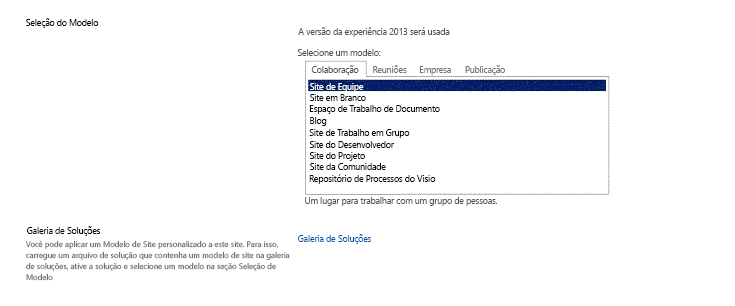

# Configurar um ambiente de desenvolvimento geral para o SharePoint 2013
Conheça as etapas para configurar um ambiente de desenvolvimento SharePoint instalando o SharePoint e o Visual Studio.
## Como determinar o ambiente de desenvolvimento de que você precisa
<a name="SP15_bk_determinedevenv"> </a>

Primeiro, decida o que deseja compilar (para saber mais sobre o Suplementos do SharePoint, consulte  [Suplementos do SharePoint](http://msdn.microsoft.com/library/cd1eda9e-8e54-4223-93a9-a6ea0d18df70%28Office.15%29.aspx)):
  
    
    

- Se deseja compilar soluções de farm, forneceremos as etapas neste artigo.
    
  
- Se você deseja criar Suplementos do SharePoint, confira  [Ferramentas e ambientes para o desenvolvimento de suplementos do SharePoint](http://msdn.microsoft.com/library/6906eb86-8270-4098-8106-1e8d0d3c212e%28Office.15%29.aspx).
    
  

## Criar um ambiente de desenvolvimento do SharePoint em uma máquina virtual do Microsoft Azure
<a name="SP15_bk_devenvazure"> </a>

Se tiver uma assinatura do MSDN, você pode rapidamente provisionar uma máquina virtual no Azure.
  
    
    
Se não tiver ativado o benefício do Microsoft Azure quem vem com sua assinatura MSDN, você pode obter mais informações no  [Microsoft Azure benefício paras os assinantes do MSDN](http://azure.microsoft.com/pt-br/pricing/member-offers/msdn-benefits/).
  
    
    

> **OBSERVAçãO**
> A Galeria de Imagens do Microsoft Azure não fornece mais imagens com o SharePoint e o Visual Studio pré-instalados. Mas uma máquina virtual do Microsoft Azure ainda é uma boa opção para uma máquina de desenvolvimento. > Entre no  [portal de gerenciamento do Microsoft Azure](https://manage.windowsazure.com). > Crie uma máquina virtual usando uma das imagens na galeria do Windows Server 2008 R2 Service Pack 1 x64, Windows Server 2012 (ou posterior). Siga as instruções fornecidas pelo assistente de criação de máquina virtual. Recomendamos um tamanho de máquina virtual **Extra Grande** para o desenvolvimento do SharePoint.> Depois que o computador estiver provisionado e em execução, conclua a configuração usando os mesmos procedimentos na seção abaixo **Criar um ambiente de desenvolvimento do SharePoint no local**. (Pule a seção sobre como instalar o sistema operacional.)> Depois de configurar o ambiente de desenvolvimento, você pode acessar o controle de origem do Visual Studio na máquina virtual, usando o uma conexão ponto a site do Azure. Confira  [Configurar uma conexão VPN de ponto a site para uma Rede Virtual do Microsoft Azure](http://msdn.microsoft.com/pt-br/library/azure/dn133792.aspx) para obter instruções sobre como fazer isso.
  
    
    


## Criar um ambiente de desenvolvimento do SharePoint no local
<a name="SP15_bk_devenvazure"> </a>


  
    
    

### Instalar o sistema operacional para o ambiente de desenvolvimento do Suplementos do SharePoint
<a name="SP15_bk_InstallOS"> </a>

Os requisitos para um ambiente de instalação do SharePoint são menos rigorosos e têm menores custos que os requisitos para um ambiente de produção. Em qualquer ambiente de desenvolvimento, você deve usar um computador com uma CPU com capacidade para x64 e, pelo menos, 16 GB de RAM para instalar e executar o SharePoint; é preferível 24 GB de RAM. Dependendo dos requisitos e do orçamento, você pode escolher uma das seguintes opções:
  
    
    

- Instale o SharePoint no Windows Server 2008 R2 Service Pack 1 x64 ou Windows Server 2012 (ou posterior).
    
  
- Use o Microsoft Hyper-V e instale o SharePoint em uma máquina virtual executando um sistema operacional Windows Server 2008 R2 Service Pack 1 x64 ou convidado do Windows Server 2012. Consulte  [Usar as configurações de prática recomendada para máquinas virtuais do SharePoint 2013 e ambiente Hyper-V](http://technet.microsoft.com/pt-br/library/ff621103%28v=office.15%29.aspx) para obter orientações sobre como configurar uma máquina virtual da Microsoft Hyper-V para o SharePoint.
    
  

### Instalar os pré-requisitos do desenvolvimentos de aplicativos para o sistema operacional e para o SharePoint 2013
<a name="SP15_bk_prereqsOS"> </a>

O SharePoint requer que o sistema operacional tenha alguns pré-requisitos instalados antes de começar a instalação. Por este motivo, o SharePoint inclui a ferramenta PrerequisiteInstaller.exe que instala todos os pré-requisitos para você. Execute essa ferramenta antes de executar a ferramenta Setup.exe.
  
    
    

1. Execute a ferramenta PrerequisiteInstaller.exe.
    
  
2. Execute a ferramenta Setup.exe incluída com os arquivos de instalação.
    
  
3. Aceite os Termos de Licença de Software da Microsoft.
    
  
4. Na página **Escolher a instalação desejada**, escolha **Autônoma**.
    
   **Figura 2. Escolha do tipo de instalação**

  


  

  

  
5. Se ocorrer algum erro na instalação, examine o arquivo de log. Para encontrar o arquivo de log, abra uma janela do prompt de comando e, em seguida, digite os seguintes comandos no prompt de comando. Um link para o arquivo de log também aparece quando a instalação for concluída.
    
  ```
  
cd %temp
dir /od *.log
  ```

6. Depois que a instalação for concluída, você precisará iniciar o Assistente de Produtos e Tecnologias do SharePoint.
    
    > **OBSERVAçãO**
      > O Assistente de Produtos e Tecnologias do SharePoint pode falhar se você estiver usando um computador que tenha ingressado em um domínio, mas que não está conectado a um controlador de domínio. Caso esta falha ocorra, conecte-o a um controlador de domínio diretamente ou através de uma conexão VPN (rede virtual privada), ou entre com uma conta local que tenha privilégios administrativos no computador. 
7. Depois que Assistente de configuração for concluído, você poderá ver a página **Seleção de modelo** no novo site do SharePoint.
    
   **Figura 3. Escolher a página de modelo do site**

  


  

  

  

### Instalar o Visual Studio
<a name="SP15_bk_installVS"> </a>

Ao instalar o Visual Studio, você obtém todos os modelos, ferramentas e assemblies para desenvolver o SharePoint na sua máquina de desenvolvimento local.
  
    
    
Consulte  [Instalando o Visual Studio](http://msdn.microsoft.com/pt-br/library/e2h7fzkw.aspx) para obter instruções sobre como instalar o Visual Studio.
  
    
    

#### Registro de log detalhado no Visual Studio

Siga estas etapas, se você deseja ativar o registro detalhado:
  
    
    

1. Abra o registro e navegue até o **HKEY_CURRENT_USER\\Software\\Microsoft\\VisualStudio\\ _nn.n_\\SharePointTools**, em que _nn.n_ é a versão do Visual Studio, como 12.0 ou 14.0.
    
  
2. Adicione uma chave DWORD nomeada **EnableDiagnostics**.
    
  
3. Forneça o valor **1** para a chave.
    
  
O caminho de registro será alterado em futuras versões do Visual Studio.
  
    
    

## Próximas etapas
<a name="SP15_bk_devenvazure"> </a>

Se você for criar fluxos de trabalho, continue com  [Início: Instalar e configurar o Gerenciador de fluxo de trabalho do SharePoint 2013](set-up-and-configure-sharepoint-2013-workflow-manager.md).
  
    
    

## Recursos adicionais
<a name="SP15_bk_AddlResources"> </a>


-  [Instalando o Visual Studio](http://msdn.microsoft.com/pt-br/library/e2h7fzkw%28v=vs.110%29.aspx)
    
  
-  [Ferramentas e ambientes para o desenvolvimento de suplementos do SharePoint](http://msdn.microsoft.com/library/6906eb86-8270-4098-8106-1e8d0d3c212e%28Office.15%29.aspx)
    
  

  
    
    

