# Trabalhando com tarefas em fluxos de trabalho do SharePoint 2013 usando o Visual Studio 2012
Saiba mais sobre a nova estrutura de tarefas de fluxo de trabalho revisada introduzida no SharePoint 2013, que é interna ao novo Workflow Manager. 
 **Fornecido por:** [Andrew Connell](http://social.msdn.microsoft.com/profile/andrew%20connell%20%5bmvp%5d/),  [AndrewConnell.com](http://www.andrewconnell.com)
  
    
    


  
    
    

> **OBSERVAçãO**
> Este artigo é acompanhado por um exemplo de código completo que você pode usar para seguir o artigo ou como um ponto de partida para seus próprios projetos de fluxo de trabalho do SharePoint. É possível baixar o código  [aqui](http://assets.andrewconnell.com/media/Default/Downloads/SP2013Wf-CustomTasks.zip). 
  
    
    


  
    
    
Um dos maiores benefícios que o SharePoint traz para o Windows Workflow Foundation é a implementação de uma nova e aprimorada estrutura de gerenciamento de tarefas que incorpora o novo Workflow Manager como seu ambiente de hospedagem.
## Revisando tarefas de fluxo de trabalho no SharePoint 2007 e no SharePoint 2010

O SharePoint 2007 e o SharePoint 2010 implementavam tarefas de fluxo de trabalho de uma maneira semelhantes. Quando você criava uma associação de fluxo de trabalho em uma lista, tipo de conteúdo ou site (no SharePoint 2010), designava uma lista específica como o local onde as tarefas de fluxo de trabalho deveriam ser criados. Essa lista era uma lista padrão do SharePoint **Task** (ID = 107) que usavam o tipo de conteúdo padrão do SharePoint **Task** (ID = 0x0108). Em seguida, os usuários podiam acessar itens na lista para exibir, editar e concluir a tarefa. As instâncias de fluxo de trabalho monitoravam os itens de tarefa na lista de atualizações caso o fluxo de trabalho fosse configurado para fazer isso.
  
    
    
Entretanto, a renderização padrão do formulário de tarefa no SharePoint era pré-determinada, mesmo para fluxos de trabalho personalizados. Para obter flexibilidade total, era necessário usar os ASP.NET [Formulários da Web](http://www.asp.net/web-forms) ou [Formulários do InfoPath](http://msdn.microsoft.com/pt-br/library/ms540731%28v=office.14%29.aspx) na criação de soluções de formulário personalizadas para dar suporte a suas tarefas.
  
    
    

## Novidades em tarefas no SharePoint 2013

A maneira na qual as tarefas são criadas, gerenciadas e manipuladas no SharePoint 2013 foi alterada devido a alterações na arquitetura do SharePoint.
  
    
    
A alteração central é que os fluxos de trabalho não são mais gerenciados e processados no SharePoint. Em vez disso, o SharePoint 2013 utiliza um novo componente chamado Workflow Manager, que é executado externamente. O Workflow Manager hospeda o tempo de execução do Windows Workflow Foundation e os serviços necessários exigidos pelo Windows Workflow Foundation. Quando um fluxo de trabalho é publicado ou uma nova instância de um fluxo de trabalho publicado é iniciada, o SharePoint notifica o Workflow Manager, que, por sua vez, processa os episódios de fluxo de trabalho. Quando um fluxo de trabalho precisa acessar informações no SharePoint, como propriedades de um item de lista ou propriedades de usuário, ele autentica a si mesmo usando o OAuth e conversa com o SharePoint com chamadas de serviço Web usando as APIs REST.
  
    
    
A tendência de personalização geral para a plataforma do SharePoint também foi alterada no SharePoint 2013, embora essa alteração tenha começado com a implementação de soluçăos em área restrita no SharePoint 2010. No SharePoint 2013, a Microsoft introduziu alterações que moveram personalizações para fora do SharePoint Server e para o navegador do cliente ou para recursos externos. Essas alterações incluem o novo modelo de aplicativo do SharePoint, o suporte para atribuição de identidade de aplicativos, a autenticação usando OAuth, aprimoramentos feitos no modelo de objeto do lado cliente (CSOM) e as APIs REST.
  
    
    

## Alterações de arquitetura em tarefas de fluxo de trabalho no SharePoint 2013

Como as alterações de arquitetura feitas no SharePoint 2013 afetam tarefas de fluxo de trabalho? Para tarefas de fluxo de trabalho, o impacto não será significativo, exceto quando você estiver trabalhando com formulários de tarefas personalizadas. No passado, você criava formulários de tarefas usando o InfoPath ou os Formulários da Web do ASP.NET. O SharePoint 2013, por outro lado, usa o formulário de renderização de item de lista padrão para tarefas de fluxo de trabalho. 
  
    
    
Às vezes, talvez seja necessário personalizar a aparência ou o comportamento de campos de tarefas. Para fazer isso, crie um tipo de conteúdo de tarefa personalizado que contenha uma coluna de site. A coluna de site pode então usar a nova estrutura de renderização do lado cliente no SharePoint 2013, que exige a criação de um arquivo do JavaScript que define como deverá ser a aparência do campo e como ele deverá agir no navegador. 
  
    
    
Para saber mais sobre o uso da renderização usando a renderização do lado cliente, consulte  [Como personalizar uma exibição de lista em aplicativos para o SharePoint usando a renderização do lado cliente](http://msdn.microsoft.com/pt-br/library/jj220045.aspx).
  
    
    
Os itens de tarefa individuais se baseiam em tipos de conteúdo. Mais importante, existem algumas alterações feitas em tipos de conteúdo no SharePoint 2013. No SharePoint 2007 e no SharePoint 2010, as tarefas de fluxo de trabalho eram criadas com o tipo de conteúdo **Task** (ID = 0x0108). Esse é o mesmo tipo de conteúdo usado para criar manualmente tarefas que não são de fluxo de trabalho nas listas de tarefas. O SharePoint 2013 altera isso introduzindo um novo tipo de conteúdo, a **Workflow Task (SharePoint 2013)** (ID = 0x0108003365C4474CAE8C42BCE396314E88E51F), que herda o tipo de conteúdo Tarefa e que indica que as tarefas só deverão ser usadas para o fluxo de trabalho.
  
    
    
Esse novo tipo de conteúdo do **Workflow Task** difere do tipo de conteúdo anterior do **Task** pois tem duas colunas novas:
  
    
    

- **WorkflowInstanceId**: contém uma referência ao identificador de instância de fluxo de trabalho que criou a tarefa, que é usada em locais como a página de status da instância de fluxo de trabalho. A página de status pode usar esse campo para consultar a lista de tarefas do fluxo de trabalho associada para todos os itens de lista cuja coluna **WorkflowInstanceId** contenha a ID especificada.
    
  
- **TaskOutcome**: um campo de opção usado na apresentação do formulário da tarefa para permitir que o usuário selecione opções de critérios de conclusão diferentes. O formulário de edição da tarefa apresenta os resultados da tarefa de fluxo de trabalho especificada como botões na parte inferior do formulário, ao lado dos botões **Salvar** e **Cancelar**. Os fluxos de trabalho no SharePoint 2013 não estão limitados a apenas as duas opções **Approved** e **Rejected**, como mostrado na Figura 1.
    
   **Figura 1. Resultados da tarefa de fluxo de trabalho**

  

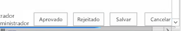
  

  

  
É claro que os tipos de conteúdo fazem parte de tarefas de fluxo de trabalho. Os tipos de conteúdo simplesmente ditam a estrutura dos itens de lista de tarefas. Igualmente importante é o modelo de lista de tarefas, que também foi alterado no SharePoint 2013.
  
    
    
Antes do SharePoint 2013, a lista de tarefas de fluxo de trabalho usava o mesmo modelo de lista do que a lista de tarefas padrão (ID = 107). Era uma lista de tarefas padrão do SharePoint que também poderia conter tarefas que não eram do fluxo de trabalho. Mas no SharePoint 2013, a abordagem é diferente, pois introduz um novo tipo de lista. Essa lista, chamada de lista de tarefas de hierarquia, introduz um modo de exibição de linha do tempo na parte superior da página para mostrar o agendamento de tarefas, como mostrado na Figura 2. Observe que ele também permite que os usuários exibam dependências de tarefa.
  
    
    

**Figura 2. Listas de tarefas de hierarquia**

  
    
    

  
    
    

  
    
    

  
    
    

  
    
    

## Criando opções de tarefas de fluxo de trabalho no SharePoint 2013

O SharePoint Designer 2013 e o Visual Studio 2012 oferecem aos autores de fluxo de trabalho duas maneiras de criar tarefas de fluxo de trabalho. Uma é criar uma tarefa única atribuída a uma pessoa ou a um grupo. A outra é criar uma tarefa e atribuí-la a várias pessoas. Ao criar uma tarefa única em um fluxo de trabalho personalizado usando o Visual Studio 2012, use a atividade **SingleTask**. Usando essa atividade, você pode modificar as propriedades na janela de ferramentas **Propriedades** ou com o assistente como mostrado na Figura 3.
  
    
    

**Figura 3. Assistente de tarefa única**

  
    
    

  
    
    
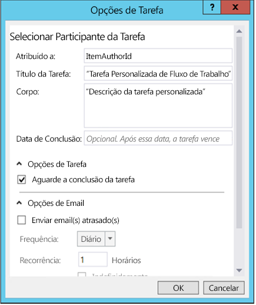
  
    
    
O SharePoint permite que você especifique se várias tarefas devem ser executadas de forma serial ou em paralelo, além da especificação dos critérios para a conclusão da tarefa. O SharePoint deve aguardar que todas as tarefas sejam concluídas ou que uma porcentagem delas seja concluída com um resultado específico? Para criar várias tarefas no Visual Studio 2012, use a atividade **CompositeTask**, cujo assistente e propriedades lembram a atividade **SingleTask**, como mostrado na Figura 4.
  
    
    

**Figura 4. Assistente de tarefa composta**

  
    
    

  
    
    
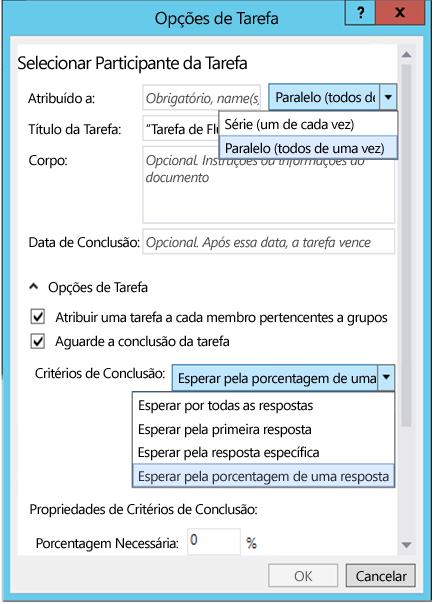
  
    
    

  
    
    

  
    
    

## Como criar e atribuir tarefas em fluxos de trabalho personalizados

A seguir, um passo a passo que demonstra como criar e atribuir tarefas em um fluxo de trabalho personalizado. Antes de começar, verifique se você tem acesso a um site do desenvolvedor do SharePoint 2013.
  
    
    

### 1. Criar um novo projeto de aplicativo do SharePoint 2013


1. Crie um novo projeto de aplicativo do SharePoint 2013 e configure o projeto como um suplemento hospedado no SharePoint.
    
  
2. Para o projeto, adicione uma nova instância de lista do **Announcement** para o projeto. Isso será usado como o contêiner para itens usados para testar o fluxo de trabalho.
    
  
3. Adicione um item de fluxo de trabalho ao projeto clicando com o botão direito do mouse no **Gerenciador de Soluções** e selecionando **Adicionar**, seguido por **Novo Item**.
    
  
4. Na caixa de diálogo **Adicionar Novo Item**, selecione o item de projeto **Fluxo de Projeto** da categoria **Office/SharePoint** e o chame de "CustomTaskWorkflow" e clique em **Avançar**.
    
  

### 2. Coletar informações sobre o item Novo Anúncio

Vamos criar uma tarefa em nosso fluxo de trabalho e a atribuir à pessoa que criou o item de lista de anúncio que inicia o fluxo de trabalho. O próprio item de lista fornecerá as informações para o fluxo de trabalho. Usaremos uma atividade **LookupSPListItemProperties**, que retorna um valor dinâmico do serviço Web REST que ele chama no SharePoint. Vamos armazenar esse valor em uma nova variável chamada **AnnouncementItemProperties**, cujo tipo de dados será alterado para **DynamicValue**.
  
    
    

1. Crie uma variável **AnnouncementItemAuthorId** para armazenar a ID da pessoa que criou o item de lista, como mostrado na Figura 5.
    
   **Figura 5. Atividade LookupSPListItemProperties**

  

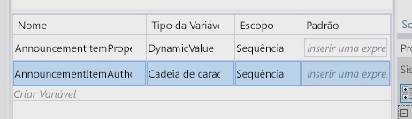
  

  

  
2. Solte a atividade **LookupSPListItem** na superfície de design do fluxo de trabalho e define a propriedade **ListID** como _(current list)_.
    
  
3. Defina a **ItemId** para _(current item)_.
    
  
4. Defina a saída de **Result** para a variável **AnnouncementItemProperties** que criamos anteriormente.
    
  
5. Para obter o autor do item da variável, clique no link **Obter Propriedades** na atividade **LookupSPListItem** e adicione uma atividade **GetDynamicValueProperties** à superfície de design. Defina a propriedade **Source** para a saída da atividade **LookupSPListItem**.
    
  
6. Clique no botão **[…]** na propriedade **Properties** para exibir a caixa de diálogo **Propriedades**.
    
  
7. Na caixa de diálogo **Propriedades**, altere o **Tipo de Entidade** para **Item de Lista de Anúncios**, como mostrado na Figura 6.
    
  
8. Atribua o caminho **Criado por** à variável **AnnouncementItemAuthorId**, como mostrado na Figura 6.
    
   **Figura 6. Caixa de diálogo Propriedades**

  

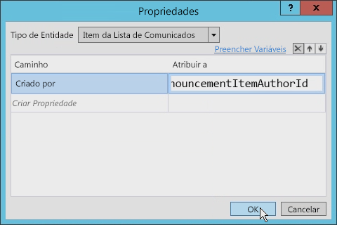
  

  

  

### 3. Criar e Atribuir a tarefa

Neste ponto, criamos e atribuímos a tarefa ao autor do item de anúncio.
  
    
    

1. Da caixa de ferramentas, adicione uma atividade **SingleTask** à superfície de design de fluxo de trabalho.
    
  
2. Clique no link **Configurar** na atividade para abrir a caixa de diálogo **Opções de Tarefa**.
    
  
3. Defina a propriedade **Atribuir a** à variável usada para armazenar o identificador do autor.
    
  
4. Modifique o título e o corpo da tarefa, como mostrado na Figura 7.
    
   **Figura 7. Caixa de diálogo Opções de Tarefa**

  

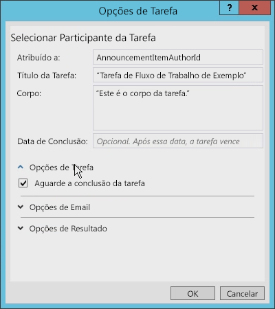
  

  

  
Existem muitas outras opções que podem ser definidas no caixa de diálogo **Opções de Tarefa**. Por exemplo, você pode definir o fluxo de trabalho para que ele aguarde a conclusão da tarefa simplesmente marcando a caixa (consulte a Figura 7). As versões anteriores dos fluxos de trabalho do SharePoint exigiam uma solução alternativa difícil para que isso fosse obtido.
  
    
    
Observe na Figura 8 as opções de email que podem ser definidas. Entre outras opções, você pode garantir que mensagens de email seja enviadas sempre que a tarefa esteja vencida, além de especificar com que frequência os lembretes serão enviados. 
  
    
    

**Figura 8. Configurações de Opções de Email**

  
    
    

  
    
    
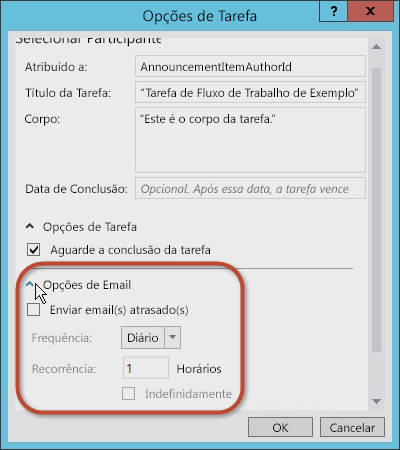
  
    
    
Você também pode definir as opções de resultado da tarefa. É possível selecionar o tipo de conteúdo da tarefa do fluxo de trabalho, o **Campo de Resultado** e o **Resultado Padrão**, como mostrado na Figura 9.
  
    
    

**Figura 9. Configurações de Opções de Resultado**

  
    
    

  
    
    
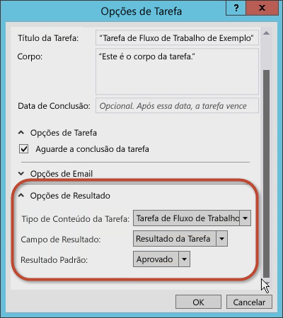
  
    
    

  
    
    

  
    
    

### 4. Examinar e modificar as propriedades da tarefa

Assim que você tiver aceitado valores na caixa de diálogo **Opções de Tarefa**, selecione a atividade **SingleTask** e então inspecione a grade de propriedades **Propriedades** (consulte a Figura 10).
  
    
    

**Figura 10. Janela da ferramenta Propriedades**

  
    
    

  
    
    
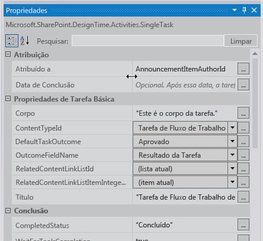
  
    
    
Usando a grade de propriedades **Propriedades**, você pode especificar se deseja que a tarefa aguarde a conclusão antes de prosseguir e pode configurar as mensagens de email geradas pela tarefa, incluindo a mensagem de email de atribuição inicial, a mensagem de email vencida e a mensagem de email de cancelamento da tarefa.
  
    
    
Observe que a propriedade **Outcome** criou automaticamente uma variável chamada **outcome_0** para a tarefa. Para ver o que estava contido na variável, adicione uma atividade **WriteToHistory** à superfície de design e atualize a mensagem para exibir o resultado, como mostrado na Figura 11.
  
    
    

**Figura 11. Valor da propriedade Resultado**

  
    
    

  
    
    
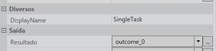
  
    
    

  
    
    

  
    
    

### 5. Testar o fluxo de trabalho

Para testar o fluxo de trabalho, faça o seguinte:
  
    
    

1. Pressione **F5** para compilar e executar ou clique no botão **Iniciar** no Visual Studio 2012. Se você estiver testando em uma instalação local do SharePoint 2013, o Visual Studio 2012 iniciará o utilitário Testar Host de Serviço do Workflow Manager e implantar o fluxo de trabalho para o site do desenvolvedor. Depois de alguns instantes, o site do desenvolvedor será aberto.
    
  
2. Navegue até a lista **Anúncios** e crie um item de lista, então inicie o fluxo de trabalho personalizado manualmente.
    
  
3. Volte para a página de status da instância do fluxo de trabalho para localizar a tarefa criada pelo fluxo de trabalho. Clique na tarefa para ver o formulário. Observe que os campos **Nome da Tarefa** e **Atribuído a** definidos no fluxo de trabalho, como mostrado na Figura 12.
    
   **Figura 12. Formulário Tarefa**

  

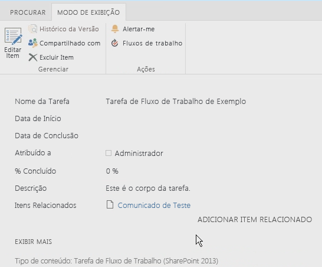
  

  

  
4. Por fim, volte para a tarefa, edite o formulário e então clique em **Aprovar** ou em **Rejeitar** para concluir a tarefa. Observe que o resultado da tarefa é mostrado na lista **Histórico do Fluxo de Trabalho** para a instância do fluxo de trabalho, como mostrado na Figura 13.
    
   **Figura 13. Lista Histórico do Fluxo de Trabalho**

  

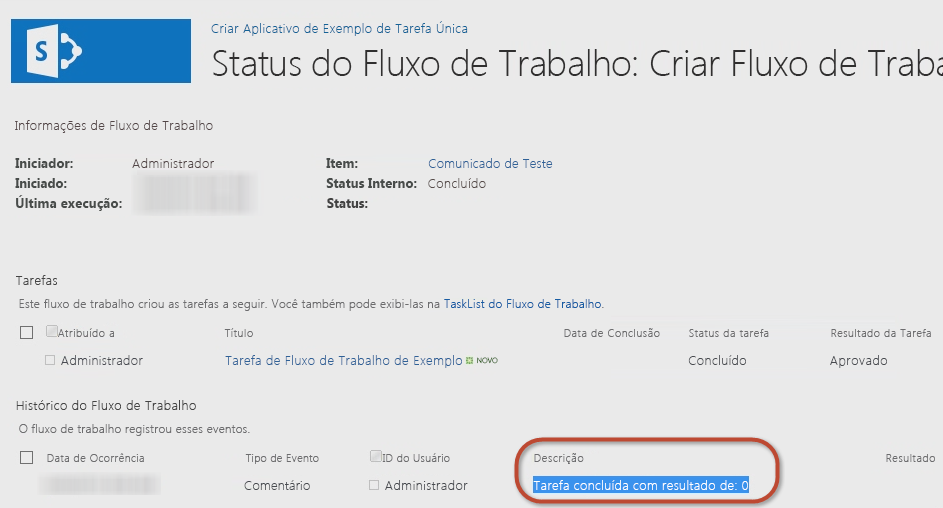
  

  

  

## Como criar um tipo de tarefa personalizado com um resultado personalizado

O passo a passo anterior demonstrou como criar uma tarefa simples e configurar suas propriedades. Entretanto, em algumas ocasiões, as opções padrão podem não atender às suas necessidades. Por exemplo, considere uma tarefa que solicite que alguém examine um documento. Na revisão do documento de rascunho, o revisor deverá exercitar uma de duas opções: enviar o documento de rascunho de volta ao autor para revisão ou encaminhar o documento para o editor. Infelizmente, nenhuma das opções padrão ( **Aprovado** e **Rejeitado**) atende ás necessidades dos revisores. Outras opções adequadas seriam "Devolver ao Autor" e "Prosseguir para o Editor".
  
    
    
Ao criar fluxos de trabalho usando o SharePoint Designer 2013 ou o Visual Studio 2012, você pode criar tarefas do fluxo de trabalho personalizadas que incluam resultados de tarefa personalizados. Para fazer isso, crie uma tarefa personalizada como um tipo de conteúdo especial e então adicione uma coluna de site personalizada que define os resultados desejados. Você pode derivar a coluna personalizada do tipo de campo chamado **OutcomeChoice**, que é um campo de opção.
  
    
    
Entretanto, essa abordagem pode representar um desafio, já que o tipo de conteúdo do qual a tarefa personalizada deriva é o tipo de conteúdo **Workflow Task (SharePoint 2013)**, que inclui a coluna de site **TaskOutcome** padrão que contém as opções **Aprovado** e **Rejeitado**. No entanto, você pode trabalhar a configuração padrão removendo a coluna **TaskOutcome** do tipo de conteúdo de tarefa personalizado e garantir que ele não esteja presente na lista de tarefas do fluxo de trabalho. Caso contrário, isso resultaria na exibição de várias opções. Por exemplo, considere um resultado personalizado com duas opções "Comprimido Vermelho" e "Comprimido Azul". Se o resultado padrão não for removido, então os usuários que concluírem a tarefa obterão todas as opções de resultado disponíveis, como mostrado na Figura 14, mesmo se essas opções de resultado não se aplicarem.
  
    
    

**Figura 14. Opções de Resultado**

  
    
    

  
    
    
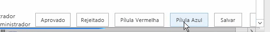
  
    
    
Como uma prática recomendada, você deseja criar uma lista de tarefas do fluxo de trabalho diferente para cada tipo de tarefa criado. 
  
    
    

### Criar um projeto de aplicativo do SharePoint 2013

Para iniciar o passo a passo para a criação de um fluxo de trabalho personalizado usando o Visual Studio 2012, primeiro garanta o acesso a um site do desenvolvedor do SharePoint 2013. 
  
    
    

1. No Visual Studio 2012, crie um projeto de aplicativo do SharePoint 2013 configurado como um suplemento hospedado no SharePoint.
    
  
2. Para o projeto, adicione uma nova instância de lista do **Announcement**. Você usará isso como o contêiner para itens usados para testar o fluxo de trabalho.
    
  
3. Em seguida, adicione um item de fluxo de trabalho ao projeto clicando com o botão direito do mouse no ícone do projeto no **Gerenciador de Soluções** e selecionando **Adicionar**, seguido por **Novo Item**.
    
  
4. Na caixa de diálogo **Adicionar Novo Item**, selecione o item de projeto **Fluxo de Trabalho** na categoria **Office/SharePoint** e chame-a de "CustomTaskWorkflow"; então clique em **Avançar**.
    
  

### Criar a coluna de resultado personalizado

Logo após a criação da lista **Announcements**, criaremos o tipo de conteúdo personalizado que conterá a tarefa personalizada e a coluna de site para o campo de resultado personalizado. 
  
    
    

1. Clique com o botão direito do mouse no projeto e selecione **Adicionar**, seguido por **Novo Item**.
    
  
2. Agora escolha o modelo de item de projeto **Coluna de Site** e defina o nome desse campo como "CustomOutcomeColumn". No modelo para a coluna de site, há algumas alterações que precisam ser feitas.
    
  
3. Defina o tipo de campo da coluna como **OutcomeChoice**, que é o tipo de campo exigido para uma coluna de resultado.
    
  
4. Remova a coluna **Obrigatório**.
    
  
5. Em seguida, como o tipo de campo **OutcomeChoice** se baseia no tipo de campo de opção, adicione algumas opções próprias.
    
  
A nova marcação de coluna de site personalizada agora deve ter esta aparência:
  
    
    


```XML

<?xml version="1.0" encoding="utf-8"?>
<Elements xmlns="http://schemas.microsoft.com/sharepoint/">  
  <Field
       ID="{7b7edd9e-f5d1-4558-a2c8-e733dcfb0a5e}"
       Name="CustomSiteColumn"
       DisplayName="Better State"
       Type="Choice"
       Required="FALSE"
       Group="Custom Site Columns">
       <CHOICES>
         <CHOICE>Florida</CHOICE>
         <CHOICE>Georgia</CHOICE>
       </CHOICES>
       <Default>Florida</Default>
  </Field>
</Elements>
```


### Criar um tipo de conteúdo de tarefa personalizado

Após a criação da coluna de site, a próxima etapa será criar um tipo de conteúdo especializado para a tarefa personalizada.
  
    
    

1. Adicione um novo item de projeto de tipo de conteúdo ao projeto com o nome **CustomTaskContentType**.
    
  
2. Quando solicitado a selecionar o tipo de conteúdo em que ele se baseia, selecione o tipo de conteúdo **Workflow Task (SharePoint 2013)**.
    
  
3. Em seguida, adicione a coluna de resultado personalizado à lista de colunas disponíveis e também remova a coluna de resultado padrão de forma que a marcação do tipo de conteúdo se pareça com o exemplo a seguir.
    
  ```XML
  
<?xml version="1.0" encoding="utf-8"?>
<Elements xmlns="http://schemas.microsoft.com/sharepoint/">
  <!-- Parent ContentType: Workflow Task (SharePoint 2013) (0x0108003365C4474CAE8C42BCE396314E88E51F) -->
  <ContentType 
      ID="0x0108003365C4474CAE8C42BCE396314E88E51F00D368DFB2B31A447BB184BA1334E5119E" 
      Name="CustomContentType" 
      Group="Custom Content Types" 
      Description="My Content Type" 
      Inherits="TRUE" Version="0">
      <FieldRefs>
         <FieldRef 
            ID="{7b7edd9e-f5d1-4558-a2c8-e733dcfb0a5e}" 
            DisplayName="Better State" 
            Required="FALSE" 
            Name="CustomSiteColumn" />
            <RemoveFieldRef 
               ID="{55B29417-1042-47F0-9DFF-CE8156667F96}" 
               Name="TaskOutcome" />
      </FieldRefs>
  </ContentType>
</Elements>
  ```


### Criar um fluxo de trabalho

Agora criamos um fluxo de trabalho para podermos testar a coluna de site e o tipo de conteúdo personalizados. 
  
    
    

1. Adicione um fluxo de trabalho ao nosso projeto e configure-o para ser um fluxo de trabalho de lista.
    
  
2. Crie uma associação com esse fluxo de trabalho usando a lista **Anúncios** criada anteriormente.
    
  
3. Crie uma nova variável do tipo **DynamicValue** e chame-a de "ItemProperties"; vamos usar essa variável para armazenar o item que inicia as propriedades do fluxo de trabalho.
    
  
4. Crie uma variável **Int32** e chame-a de "ItemAuthorId", como mostrado na Figura 15.
    
   **Figura 15. Criando uma variável de fluxo de trabalho**

  

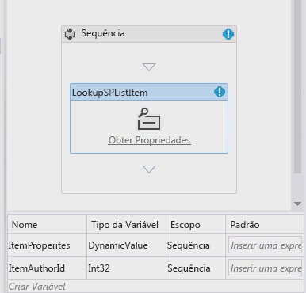
  

  

  

### Coletar as propriedades do item de lista

Agora nós coletamos as propriedades do item de lista.
  
    
    

1. Remova a atividade **LookupSPListItem** da superfície de design e defina a propriedade **ListID** como _(current list)_ e a propriedade **ItemId** como _(current item)_. 
    
  
2. Agora definimos a saída de **Result** como a variável **ItemProperties** **DynamicValue** que criamos há alguns momentos.
    
  
3. Para obter o autor do item da variável, clique no link **Obter Propriedades** na atividade **LookupSPListItem** e adicione uma atividade **GetDynamicValueProperties** à superfície de design.
    
  
4. Defina a propriedade **Source** do item como a saída da atividade **LookupSPListItem** automaticamente.
    
  
5. Clique no botão **[…]** na propriedade **Properties** para exibir a caixa de diálogo **Propriedades**.
    
  
6. Altere **Entity Type** para **List Item of Announcements** para oferecer à caixa de diálogo um contexto e atribua o caminho de **Created By** à variável **ItemAuthorId**, como mostrado na Figura 16.
    
   **Figura 16. Caixa de diálogo Propriedades**

  

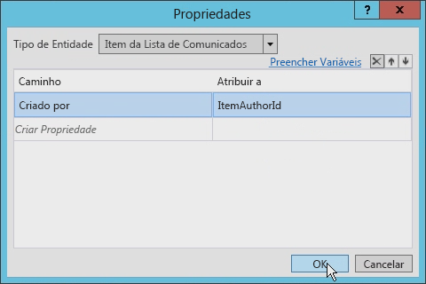
  

  

  

### Criar uma tarefa única

Agora podemos criar a tarefa única. 
  
    
    

1. Adicione uma atividade **SingleTask** à superfície de design.
    
  
2. Clique no link **Configurar** na atividade para abrir a caixa de diálogo **Opções de Tarefa**.
    
  
3. Defina o campo **Corpo**como alguma cadeia de caracteres (não importa qual) e então defina a propriedade **Atribuído a** à variável que estiver usando para armazenar o identificador do autor (em nosso caso, **ItemAuthorId**).
    
  
4. Altere o título da tarefa, como mostrado na Figura 17.
    
   **Figura 17. Configuração de Título da Tarefa**

  

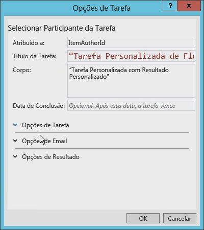
  

  

  
5. Por fim, defina **Opções de Resultado** para usar o novo tipo de conteúdo personalizado e a coluna de resultado personalizada.
    
    A caixa de diálogo determina o que está disponível ao examinar todos os tipos de conteúdo derivados do tipo de conteúdo **Workflow Task (SharePoint 2013)**, como mostrado na Figura 18.
    

   **Figura 18. Configurações de Opções de Resultado**

  

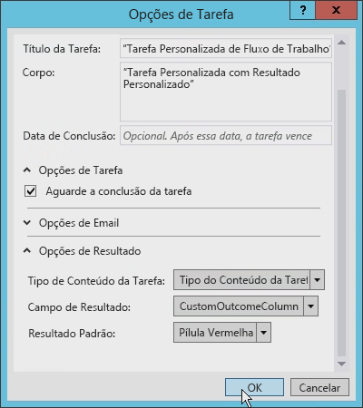
  

  

  

### Atualizar o campo AssignedTo

Antes de prosseguirmos, precisamos atualizar o campo **AssignedTo** na atividade **SingleTask** porque ele está esperando uma cadeia de caracteres e não um inteiro. para corrigir isso, adicione **ToString()** ao final da expressão.
  
    
    
Além disso, observe que a propriedade **Outcome** criou automaticamente uma variável chamada **outcome_0**. Para ver o que há nessa variável, adicione uma atividade **WriteToHistory** à superfície de design e atualize a mensagem para exibir o resultado.
  
    
    

### Atualizar a lista de tarefas do fluxo de trabalho

A etapa final é configurar a lista de tarefas do fluxo de trabalho. Por padrão, a lista de tarefas criada pelo aplicativo aceita somente o tipo de conteúdo **Workflow Task (SharePoint 2013)**. Esse fluxo de trabalho usa um tipo de conteúdo personalizado para o resultado personalizado. Abra o arquivo  `Elements.xml` para a lista de tarefas do fluxo de trabalho e altere o atributo **ContentTypeId** do elemento **<ContentTypeBinding>** para corresponder ao tipo de conteúdo no projeto, como mostrado no exemplo de código a seguir.
  
    
    

```XML

<?xml version="1.0" encoding="utf-8" ?>
<Elements xmlns="http://schemas.microsoft.com/sharepoint/">
  <ListInstance 
      FeatureId="{f9ce21f8-f437-4f7e-8bc6-946378c850f0}"
      TemplateType="171"
      Title="WorkflowTaskList"
      Description="This list instance is used for workflow Task items."
      Url="Lists/WorkflowTaskList"
      RootWebOnly="FALSE" />
  <!-- CustomContentType -->
  <ContentTypeBinding 
      ListUrl="Lists/WorkflowTaskList"
      RootWebOnly="FALSE"
      ContentTypeId="0x0108003365C4474CAE8C42BCE396314E88E51F00D368DFB2B31A447BB184BA1334E5119E"/>
</Elements>
```


### Testar a tarefa de conteúdo personalizada com um resultado de tarefa personalizado

Agora vamos testar o fluxo de trabalho. 
  
    
    

1. No Visual Studio 2012, pressione **F5** ou clique no botão **Iniciar**. Se os testes acontecerem em uma instalação local do SharePoint 2013, o Visual Studio 2012 iniciará o utilitário Testar Host de Serviço do Workflow Manager e implantará o fluxo de trabalho no site do desenvolvedor. Depois de alguns instantes, o site do desenvolvedor será aberto.
    
  
2. Navegue até a lista **Anúncios** e crie um novo item. Depois de criar o item, inicie o fluxo de trabalho personalizado manualmente.
    
  
3. Em seguida, volte para a página de status da instância do fluxo de trabalho para localizar a tarefa criada pelo fluxo de trabalho.
    
  
4. Clique na tarefa e, usando o botão **Editar** da faixa de opções, altere para o modo de edição. Na parte inferior do formulário, deve haver quatro botões. Os dois primeiros botões são os botões de resultado personalizados que, quando pressionados, marcarão a tarefa como concluída. Os dois outros botões são os botões **Salvar** e **Cancelar** padrão que simplesmente atualizam o item de lista sem concluírem a tarefa, como mostrado na Figura 19.
    
   **Figura 19. Botões de resultado personalizados**

  

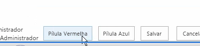
  

  

  

## Conclusão

A Microsoft introduziu fluxos de trabalho na plataforma do SharePoint 2007 e eles permaneceram quase inalterados no SharePoint 2010 na arquitetura, na implementação ou no processo. Isso também foi verdadeiro para tarefas em fluxos de trabalho do SharePoint. Entretanto, o SharePoint 2013 introduziu várias alterações feitas em fluxos de trabalho na arquitetura e na implementação.
  
    
    
Este artigo discutiu as alterações relacionadas a tarefas de fluxo de trabalho orientadas de alterações feitas na história do fluxo de trabalho no SharePoint 2013. Ele demonstrou como criar um fluxo de trabalho simples que utilizava tarefas no SharePoint 2013 usando o Visual Studio 2012. Esses tipos de tarefas são adequadas para vários desenvolvedores, embora em algumas ocasiões as tarefas personalizadas e os resultados personalizados sejam desejados, que podem ser obtidos usando o Visual Studio 2012 como mostrado.
  
    
    

## Recursos adicionais
<a name="bk_addresources"> </a>


-  [Fluxos de trabalho no SharePoint 2013](http://msdn.microsoft.com/pt-br/library/jj163986.aspx)
    
  
-  [Autorização e autenticação para aplicativos no SharePoint 2013](http://msdn.microsoft.com/pt-br/library/office/fp142384.aspx)
    
  
-  [Como personalizar um modo de exibição de lista em aplicativos para o SharePoint usando a renderização do lado cliente](http://msdn.microsoft.com/pt-br/library/jj220045.aspx)
    
  

