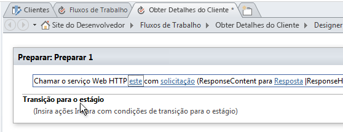
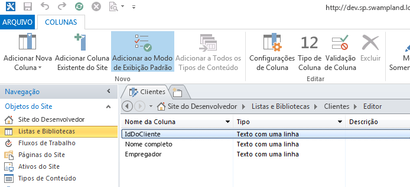
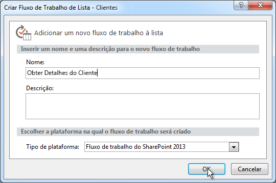
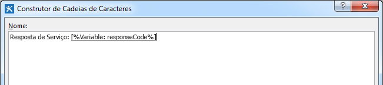
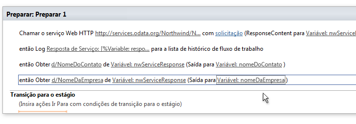
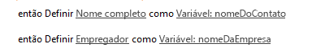
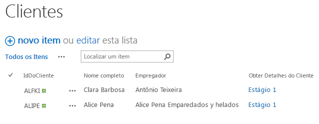

# Trabalhando com serviços Web em fluxos de trabalho do SharePoint 2013 usando o SharePoint Designer 2013
Demonstra como usar serviços Web em fluxos de trabalho do SharePoint Designer 2013. 
 **Fornecido por:** [Andrew Connell](http://social.msdn.microsoft.com/profile/andrew%20connell%20%5bmvp%5d/),  [www.AndrewConnell.com](http://www.andrewconnell.com)
  
    
    

A Microsoft adotou uma nova abordagem a fluxos de trabalho no SharePoint Server 2013. A equipe de fluxo de trabalho trabalhou com a equipe do Microsoft Azure para criar um novo produto chamado Workflow Manager. O Workflow Manager serve como o host para a versão mais recente do tempo de execução do Windows Workflow Foundation e oferece todos os serviços necessários, além de usar o Microsoft Azure Service Bus para aprimorar o desempenho e a escalabilidade. Depois de implantado, ele será executado da mesma forma, em uma implantação local ou implantado na nuvem. De modo significativo, o SharePoint 2013 inicia toda a execução do fluxo de trabalho e as tarefas relacionadas para o farm do Workflow Manager, que é externo ao SharePoint 2013.
Uma ou mais alterações significativas na arquitetura de fluxo de trabalho é que agora todos os fluxos de trabalho são criados em uma superfície de designer de forma declarativa, incluindo os criados usando o Visual Studio 2012. Em versões anteriores do SharePoint, os fluxos de trabalho desenvolvidos com o Visual Studio 2012 não eram exclusivamente declarativos.
  
    
    

Para esses clientes que criaram fluxos de trabalho usando o SharePoint Designer no passado, isso não é novidade. Os fluxos de trabalho criados usando o SharePoint Designer sempre foram totalmente declarativos. No entanto, essa alteração beneficia clientes que criam fluxos de trabalho usando o SharePoint Designer 2013, porque os fluxos de trabalho do SharePoint Designer 2013 agora dão suporte à chamada e ao consumo de serviços Web.
## Por que os serviços Web são importantes para fluxos de trabalho do SharePoint 2013

Vamos começar entendendo os cenários nos quais o uso de serviços Web faz sentido. Na época do SharePoint 2007 ou do SharePoint 2010, escrever código personalizado era comum ao usar o Visual Studio para criar fluxos de trabalho porque essa era a melhor maneira de executar cálculos ou de implementar lógica de negócios personalizada. Sempre que você encontrava uma situação na qual as ações e atividades prontas para uso não atendiam às suas necessidades, você poderia converter em código personalizado em um assembly gerenciado.
  
    
    
Para os usuários não desenvolvedores do SharePoint Designer 2013, por outro lado, isso não era tão fácil. Quando você encontrava um caso de uso que não conseguia tratar com as ações de fluxo de trabalho existentes, tinha de chamar um desenvolvedor para escrever uma ação personalizada. Com frequência, isso era difícil porque eles só poderiam criar código para a área restrita (quando em um ambiente hospedado) ou só poderia usar soluções totalmente confiáveis caso estivessem em uma implantação local. Em outros casos, o fluxo de trabalho tinha de ser completamente entregue a um desenvolvedor para criação como uma solução totalmente confiável porque o necessário não poderia ser feito no SharePoint Designer.
  
    
    
Agora vem a boa notícia: no mundo do SharePoint 2013, quando o SharePoint Designer 2013 não tiver uma ação necessária, tudo o que você precisará criar é um serviço Web personalizado. E a criação de um serviço Web personalizado é muito mais fácil do que a criação de uma ação personalizada. E não é só isso, mas enquanto uma ação personalizada só podia ser usada pelo fluxo de trabalho na qual estava instalada (ou, na melhor das hipóteses, somente por um fluxo de trabalho do SharePoint), um serviço Web personalizado é portável e pode ser usado por qualquer número de clientes.
  
    
    
E, talvez, o melhor de tudo, em casos onde há um serviço Web existente que você precise acessar - público ou talvez um serviço Web privado hospedado por sua empresa - o SharePoint Designer 2013 agora oferece uma ação que pode ser usada para chamar o serviço Web. Não há mais a necessidade de contar com um desenvolvedor quando for necessário chamar um serviço Web existente.
  
    
    
Embora o SharePoint 2013 possa consumir qualquer tipo de serviço Web, é mais fácil (e recomendável) que você use serviços Web que aceitem e retornem dados usando formatos  [OData](http://www.odata.org/) padrão de [Atom](http://msdn.microsoft.com/pt-br/library/ff478141.aspx) ou [JSON](http://json.org/) (Notação de Objeto JavaScript).
  
    
    
Essa recomendação se baseia no suporte desses formatos OData nas ferramentas de criação de fluxo de trabalho do SharePoint 2013 (o SharePoint Designer 2013 e o Visual Studio 2012). Ambas as ferramentas dão suporte à criação de cargas a serem enviadas para o serviço e à manipulação das respostas retornadas pelos serviços Web. Adicionalmente, os formatos OData dão suporte à comunicação com serviços Web anônimos assim como os protegidos por diversos tipos de autenticação. Em resumo, você tem controle total sobre a solicitação e a resposta de cada chamada de serviço. Isso permite que você use uma série de atividades em um fluxo de trabalho para autenticar primeiro usando um serviço e obter um token OAuth e então incluir esse token em solicitações futuras em serviços protegidos usando o protocolo  [OAuth 2.0](http://oauth.net/2/).
  
    
    

## Usando serviços Web em fluxos de trabalho do SharePoint

A invocação de serviços Web de fluxos de trabalho usando o SharePoint 2013 acontece em dois estágios: o primeiro é chamar o serviço Web e depois trocar dados com o serviço Web.
  
    
    
Em fluxos de trabalho do SharePoint 2013, você chama um serviço Web usando uma nova ação introduzida no SharePoint 2013 chamada **Call HTTP Web Service**. Essa ação é flexível e permite que você faça chamadas simples em um serviço Web com facilidade ou, se necessário, você poderá criar chamadas mais complexas usando verbos HTTP, além de permitir que você adicione cabeçalhos HTTP. A Figura 1 mostra a você a ação **Call HTTP Web Service** na superfície do SharePoint Designer 2013.
  
    
    

**Figura 1. Estágio do SharePoint Designer 2013 mostrando a ação Chamar Serviço Web HTTP**

  
    
    

  
    
    

  
    
    
A ação **Call HTTP Web Service** permite que você especifique qualquer um dos vários métodos de solicitação, incluindo **GET**, **PUT**, **POST** e **DELETE**. Isso permite que você diga aos serviços Web, especificamente serviços  [RESTful](http://msdn.microsoft.com/pt-br/library/office/jj164022.aspx), o que fazer no serviço especificado na propriedade do URI na atividade.
  
    
    
Por exemplo, para obter todas as propriedades de um item específico, a URL do serviço conteria o endereço exclusivo do item e você definiria o método como **GET**. Para excluir o item, o processo é o mesmo, exceto que você define o método como **DELETE**. O mesmo é verdadeiro para a atualização de um item, exceto para a definição do método como **POST**. Quando você criar um item, defina a URL como o endereço exclusivo da coleção onde o item deve ser criado e então defina o método como **POST**. Ao criar ou atualizar itens, os serviços geralmente exigem os dados a serem usados, que você passa como conteúdo na solicitação, então indica o uso da propriedade **request** na ação **Call HTTP Web Service**.
  
    
    
O segundo estágio do trabalho com serviços Web envolve o envio de dados e o recebimento de dados de um serviço Web, que você faz usando as propriedades **request** ou **response** na ação **Call HTTP Web Service**. Observe, no entanto, que, em vez de passados como um fluxo, os dados são passados como uma estrutura complexa usando o objeto  [Valor Dinâmico](http://msdn.microsoft.com/pt-br/library/windowsazure/microsoft.activities.dynamicvalue%28v=azure.10%29.aspx) (para saber mais sobre os valores dinâmicos, consulte [Noções básicas sobre valor dinâmico](http://msdn.microsoft.com/pt-br/library/windowsazure/jj193505%28v=azure.10%29.aspx)).
  
    
    
As estruturas de dados de valor dinâmico são formatadas como cadeias de caracteres JavaScript Object Notation (JSON). Entretanto, em vez de fazer um desenvolvedor criar e manipular cadeias de caracteres manualmente no fluxo de trabalho, a Microsoft forneceu o tipo de objeto **DynamicValue** que pode ser usado para armazenar dados hierárquicos e a resposta a uma chamada a serviço Web.
  
    
    
Há uma série de atividades associadas ao tipo de **DynamicValue** que pode ser usado para contar o número de itens na resposta, extrair valores da resposta ou criar uma nova estrutura para atualizar ou criar itens. Observe que o SharePoint Designer 2013 não dá suporte ao trabalho direto com o tipo **DynamicValue** e, em vez disso, os autores de fluxo de trabalho usarão o tipo **Dictionary**.
  
    
    

## Criando serviços Web para fluxos de trabalho do SharePoint 2013

Dessa forma, nós aprendemos que o SharePoint Designer 2013 dá suporte à chamada de serviços Web, mas isso  *não*  dá suporte à chamada de código personalizado de fluxos de trabalho. Consequentemente, você precisará saber como criar um serviço Web se quiser estender a funcionalidade de seus fluxos de trabalho além das ações padrão.
  
    
    
Felizmente, há várias opções para a criação de serviços Web personalizados para uso em fluxos de trabalho do SharePoint 2013. Especificamente, a atividade **HttpSend**, junto com o tipo de dados **DynamicValue**, são idealmente próprias para a criação de serviços Web RESTful em conformidade com o protocolo OData.
  
    
    
 O OData é um protocolo para a criação e o consumo de dados com base nos princípios de serviços REST. Ele foi desenvolvido para padronizar a troca de dados usando protocolos HTTP maduros, confiáveis e robustos. Assim que a especificação OData foi concluída, diferentes organizações implementaram o protocolo em suas pilhas de tecnologia. A Microsoft implementou sua própria versão do OData, que tem a marca [WCF Data Services](http://msdn.microsoft.com/pt-br/library/hh487257%28v=vs.103%29.aspx).
  
    
    
A seguir, discussões de dois cenários comuns nos quais serviços Web RESTful são úteis para desenvolvedores de fluxo de trabalho:
  
    
    

- Implementando operações CRUD-Q do serviço OData
    
  
- Implementando operações do serviço OData
    
  

### Implementando operações CRUD-Q do serviço OData

Um uso comum para serviços Web é a execução de operações de criação, de leitura, de atualização, de exclusão e de consulta (CRUD-Q) simples em dados em um banco de dados. É relativamente fácil criar um serviço Web OData para um serviço de dados WCF do fluxo de trabalho do SharePoint 2013 a ser usado por um fluxo de trabalho usando WCF Data Services. Você pode examinar os passo a passos e os exemplos de criação de serviços Web em sites como  [WCF Data Services](http://msdn.microsoft.com/pt-br/library/cc668792.aspx),  [www.OData.org](http://www.odata.org) e outros.
  
    
    
Supondo que você já tenha um banco de dados que poderá ser operado, há quatro etapas curtas:
  
    
    

1. Crie um modelo do banco de dados usando o Microsoft  [Entity Framework](http://msdn.microsoft.com/pt-br/data/aa937723). Não há código necessário porque é uma criação baseada em assistente no Visual Studio. Para obter informações adicionais, consulte  [Entity Framework 4.0 e WCF Data Services 4.0 no Visual Studio 2010](http://msdn.microsoft.com/pt-br/magazine/ee336128.aspx) e [Entity Framework Designer ganha atenção no Visual Studio 2012](http://msdn.microsoft.com/pt-br/magazine/jj721589.aspx).
    
  
2. Crie um novo WCF Data Service. Novamente, nenhum código será necessário nesse assistente do Visual Studio. Para saber mais, consulte o Passo a passo:  [criando e acessando um WCF Data Services no Visual Studio](http://msdn.microsoft.com/pt-br/library/vstudio/cc668184.aspx).
    
  
3. No arquivo de código de serviço, defina o nome do modelo de entidade criado na etapa um para a origem do serviço; em seguida, defina a acessbilidade e a permissão para as entidades no modelo (ambas etapas implementadas em apenas duas linhas de código).
    
  
4. Publique o serviço em um local que o Workflow Manager possa acessar.
    
  

### Implementando operações do serviço OData

Há uma boa chance de que seu fluxo de trabalho queira executar alguma lógica de negócios que não se ajuste ao que foi limitado pelo modelo CRUD-Q. Por exemplo, pode haver um serviço OData que dê suporte a operações CRUD-Q ao criar um novo empréstimo bancário. Esse serviço também pode solicitar que os clientes chamem o serviço e fornecer uma pontuação de crédito para que ele possa recuperar a taxa de jutos atual. Essa tarefa excede a capacidade de operações CRUD-Q simples, já que chama um método, passa um inteiro e recebe uma resposta.
  
    
    
Entretanto, você pode dar suporte a este cenário usando OData e WCF Data Services, por meio dos quais será possível implementar  [Operações de serviço](http://msdn.microsoft.com/pt-br/library/cc668788.aspx). As operações de serviço são comuns e até mesmo usadas nos serviços do SharePoint 2013. Por exemplo, quando o SharePoint recupera uma lista específica usando o formato de endereço  `http://[..]/_api/web/lists/GetByTitle('ListTitle')`, a função **GetByTitle()** no endereço será, na verdade, um operador de serviço criado pela equipe do SharePoint 2013. Tipicamente, os desenvolvedores criam suas operações de serviço personalizadas em serviços Web criados usando WCF Data Services.
  
    
    

## Criar um fluxo de trabalho com o SharePoint Designer 2013

O passo a passo a seguir demonstra como criar um fluxo de trabalho personalizado que chama o serviço Web OData do banco de dados Northwind, que você pode localizar publicamente hospedado no site  [www.odata.org](http://www.odata.org). Neste exemplo, o usuário insere uma ID do cliente e então inicia o fluxo de trabalho, que obtém a ID do cliente e a usa para consultar o serviço Web para coletar informações adicionais sobre o cliente - especificamente, o nome completo e o empregador do usuário. O fluxo de trabalho então obtém essas informações e atualiza o item de lista ao adicionar o nome de cliente e o empregador do usuário.
  
    
    

### Criar uma lista de clientes

1. No SharePoint Designer 2013, crie uma lista personalizada e chame-a de "Clientes".
    
  
2. Renomeie o campo **Título** como **Id do Cliente**.
    
  
3. Adicione novos campos do tipo **String** e chame-os de **Nome Completo** e **Empregador**, como mostrado na Figura 2.
    
   **Figura 2. Criando a lista Clientes no SharePoint Designer 2013**

  

  

  

  

### Criar o fluxo de trabalho

1. No painel de navegação do SharePoint Designer 2013, selecione a opção **Fluxos de Trabalho**.
    
  
2. Na faixa de opções, clique no botão **Fluxos de Trabalho de Lista** e selecione **Clientes** da lista suspensa resultante.
    
  
3. Nomeie o fluxo de trabalho "Obter Detalhes do Cliente".
    
  
4. Defina o **Tipo de Plataforma** como **Fluxo de Trabalho do SharePoint 2013**, como mostrado na Figura 3.
    
   **Figura 3. Criando um novo Fluxo de Trabalho de Lista usando o SharePoint Designer 2013**

  

  

  

  

### Consultar o serviço Web para obter os detalhes do cliente

Agora que você criou o fluxo de trabalho, queremos permitir que ele chame um serviço Web, que faremos ao adicionar uma ação **Chamar Serviço Web HTTP** ao estágio padrão do fluxo de trabalho.
  
    
    

1. Clique no link rotulado como **este**.
    
  
2. À direita da caixa de texto **Inserir a URL do serviço Web HTTP**, clique no botão do construtor ( **...**) para abrir a caixa de diálogo **Construtor de Cadeias de Caracteres**.
    
  
3. No **Construtor de Cadeias de Caracteres**, insira esta URL:  `http://services.odata.org/Northwind/Northwind.svc/Customers('CUSTOMERID')?$format=json&amp;$select=ContactName,CompanyName`. Observe que a parte " `$select`" da URL está recuperando somente os campos relevantes para esta lista. 
    
  
4. Na URL, localize o segmento  `CUSTOMERID` da URL e remova-o. Deixe os parênteses e as aspas simples no lugar.
    
  
5. para então criar dinamicamente a URL completa, clique no botão **Adicionar ou Alterar Pesquisa** no **Construtor de Cadeias de Caracteres**.
    
  
6. Na caixa de diálogo **Pesquisar Cadeia de Caracteres**, defina a **Fonte de Dados** como **Item Atual** e defina **Campo da Fonte** como **CustomerId**, como mostrado na Figura 4.
    
   **Figura 4. Criação dinâmica da URL para a solicitação do serviço Web**

  

  

  

  
7. Clique em **OK**, então em **OK** novamente para aceitar a nova URL.
    
    Agora que configuramos isso para receber resultados do serviço Web, em seguida precisaremos armazenar os resultados em outra variável.
    
  
8. Na ação **Chamar Serviço Web HTTP**, clique no link de **resposta** na ação e crie uma nova variável do tipo **Dictionary** e chame-a de **nwServiceResponse**.
    
    A ação **Chamar Serviço Web HTTP** inteira provavelmente não será visível, já que é uma frase longa no designer. Role para a direita e observe que o código de status da resposta é armazenado em uma variável chamada **responseCode**. Isso é conveniente e algo que pode ser escrito na página de estatísticas da instância de fluxo de trabalho usando a lista do histórico do fluxo de trabalho.
    
  
9. Adicione uma ação **Registrar na Lista de Histórico** após a ação **Chamar Serviço Web HTTP** e defina sua **mensagem** para gravar o código de status para a resposta ao log, como mostrado na Figura 5.
    
   **Figura 5. Escrevendo código de resposta do serviço Web para a Lista do Histórico**

  

  

  

  

### Extrair valores de resposta

Agora que temos a resposta do serviço Web armazenada na variável **nwServiceResponse**, a próxima etapa será extrair esses valores e colocá-los em variáveis locais.
  
    
    
Para fazer isso, vamos adicionar duas ações **Obter item de dicionário** ao fluxo de trabalho. Observe que o caminho para o item do qual vamos extrair um valor tem que corresponder à estrutura da resposta e estar em um formato específico. Uma boa maneira de descobrir isso é inserir a URL no navegador para ver a resposta obtida. Observe que os resultados são aninhados no objeto chamado **d**. Portanto, o caminho para o campo **CompanyName** na resposta do serviço Web é `d/CompanyName`.
  
    
    

1. Adicione duas ações **Obter item de dicionário** ao fluxo de trabalho.
    
  
2. Na primeira dessas novas ações, defina **item por nome ou caminho** como `d/ComopanyName`.
    
  
3. Defina o link **dicionário** como **nwServiceResponse**.
    
  
4. Defina o link **item** como uma nova variável **String** chamada **CompanyName**.
    
  
5. Repita as etapas 2, 3 e 4 na segunda ação **Obter item de dicionário**, exceto para usar **ContactName** em vez de "CompanyName", como mostrado na Figura 6.
    
   **Figura 6. Extraindo valores da resposta do dicionário do serviço Web**

  

  

  

  

### Atualizar o item de lista

A etapa final é atualizar o item de lista usando duas das ações **Definir campo no item atual**. Elas definem os campos no item de lista como os valores armazenados nas variáveis que criamos, como mostrado na Figura 7.
  
    
    

**Figura 7. Atualizar o Item de Lista**

  
    
    

  
    
    

  
    
    
E, por fim, nós concluímos a seção **Transição para o estágio** do estágio do fluxo de trabalho.
  
    
    

1. Adicione uma ação **Ir para Estágio**.
    
  
2. Selecione **Fim do fluxo de trabalho**.
    
  
3. Salve e publique o fluxo de trabalho.
    
  

### Testar o fluxo de trabalho

1. Abra um navegador e navegue até a lista **Clientes**.
    
  
2. Adicione as duas IDs do cliente que estão no serviço do Northwind em dois novos itens de lista, **ALFKI** e **ANATR**.
    
  
3. Inicie manualmente os fluxos de trabalho selecionando cada item então clicando no botão **Fluxos de Trabalho** na faixa de opções.
    
  
4. Selecione o fluxo de trabalho **Obter Detalhes do Cliente**.
    
    Neste ponto, o fluxo de trabalho será iniciado e consultará o serviço Web.
    
  
5. Navegue de volta para a lista **Clientes** e atualize a página. Podem ser necessárias algumas atualizações para que os fluxos de trabalho sejam concluídos, mas eventualmente ele poderá ter a aparência da Figura 8. Você deverá ver itens de lista atualizados com o nome completo do cliente e seu empregador, que vieram do serviço Web do Northwind.
    
   **Figura 8. Itens de lista atualizados por fluxo de trabalho personalizado**

  

  

  

  

## Conclusão

O SharePoint 2013introduziu uma nova arquitetura de fluxo de trabalho facilitada por um novo produto, o Workflow Manager 1.0. Para garantir que todos os fluxos de trabalho personalizados funcionem independentemente da opção de implantação do SharePoint 2013, local ou hospedada no Office 365, todos os fluxos de trabalho agora são 100% declarativos. O suporte adicionado à chamada de serviços Web de fluxos de trabalho criados pelo SharePoint Designer 2013 oferece um processo de criação de fluxos de trabalho mais flexível e poderoso do que em versões anteriores.
  
    
    
 A Microsoft introduziu o suporte à chamada de serviços Web no Workflow Manager usando a nova ação **Call HTTP Web Service** no SharePoint Designer 2013. O Workflow Manager também introduziu o suporte à criação de estruturas para o envio de serviços Web, além do consumo das respostas usando o tipo de variável **Dictionary**. Ao criar fluxos de trabalho, use o tipo **Dictionary** e as ações associadas em fluxos de trabalho do SharePoint que usam serviços Web externos.
  
    
    

## Recursos adicionais

-  [Workflows in SharePoint 2013](workflows-in-sharepoint-2013.md)
    
  
-  [OData](http://www.odata.org/)
    
  
-  [Introdução ao JSON](http://json.org/)
    
  
-  [Introdução ao serviço REST do SharePoint 2013](http://msdn.microsoft.com/pt-br/library/office/fp142380.aspx)
    
  
-  [Entity Framework 4.0 e WCF Data Services 4.0 no Visual Studio 2010](http://msdn.microsoft.com/pt-br/magazine/ee336128.aspx)
    
  

  
    
    

