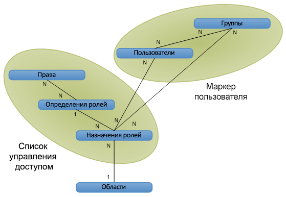

# Авторизация, пользователи, группы и объектная модель в SharePoint 2013

В SharePoint 2013 управление доступом к веб-сайтам, спискам, папкам и элементам списков осуществляется с помощью основанной на ролях системы членства, с помощью которой пользователям назначаются роли, разрешающие доступ к объектам SharePoint 2013.
  
    
    

Чтобы разрешить пользователю доступ к объекту, можно добавить его в группу, которая уже обладает разрешениями на доступ к объекту, или создать объект назначения роли, определить пользователя для назначения роли, при необходимости привязав назначение роли к соответствующему определению роли с базовыми разрешениями, а затем добавить назначение в коллекцию назначений ролей для элемента списка, папки, списка или веб-сайта. Если при назначении роли пользователю не привязать назначение роли к определению роли, разрешение пользователю предоставлено не будет.
Ниже перечислены способы управления доступом к объектам в SharePoint 2013:
  
    
    

- Объекты могут использовать те же разрешения, что и родительский веб-сайт, список или папка (наследуя роли и пользователей родительского объекта) или могут уникальные разрешения. 
    
  
- Для веб-сайтов, списков, папок и элементов предоставляются отдельные коллекции назначений ролей, что позволяет гибко управлять доступом пользователей к объектам.
    
  
- Группы состоят из пользователей, и им могут назначаться или не назначаться роли. В состав SharePoint 2013 по умолчанию входят следующие три группы:
    
  - **owners** (администратор);
    
  
  - **members** (корреспондент);
    
  
  - **visitors** (читатель).
    
  

    При создании веб-сайта с уникальными разрешениями через пользовательский интерфейс выполняется переход на страницу, на которой пользователи помещаются в группы для контроля доступа к сайту.
    
  
- Анонимный доступ позволяет пользователям анонимно принимать участие в опросах и просматривать страницы. Кроме того, можно разрешить доступ "всем пользователям, прошедшим проверку", чтобы все члены домена могли обращаться к веб-сайту без необходимости включения анонимного доступа. 
    
  
- Права создания веб-сайта ( **CreateSSCSite** и **ManageSubwebs**) управляют правом пользователей на создание веб-сайтов верхнего уровня, дочерних сайтов или рабочих областей.
    
  
Пользователи могут стать членами объекта SharePoint неявно, через группу, которой назначена соответствующая роль, или напрямую с помощью назначения. Пользователи также могут быть членами группы домена Microsoft Windows NT, которая добавляется к группе или роли. Определение роли связывает пользователя или группу с правом или набором прав, соответствующих значениям перечисления  [Microsoft.SharePoint.SPBasePermissions](https://msdn.microsoft.com/library/Microsoft.SharePoint.SPBasePermissions.aspx) . Каждый пользователь или группа имеет уникальный идентификатор [ID](https://msdn.microsoft.com/library/Microsoft.SharePoint.SPMember.ID.aspx) .Возможности объектной модели для создания или изменения назначений и определений ролей отличаются от возможностей, предоставляемых файлами addrole.aspx и editrole.aspx. В отличие от этих страниц, представленных в пользовательском интерфейсе, объектная модель не вводит зависимость прав, поэтому возможно создание определения с любой их комбинацией. В то же время при использовании объектной модели для настройки определений ролей и разрешений следует тщательно продумывать план, так как плохо спланированное определение ролей и неправильно назначенные права могут привести к возникновению проблем при использовании.Дополнительные сведения о правах SharePoint 2013 см. в статье  [SPBasePermissions](https://msdn.microsoft.com/library/Microsoft.SharePoint.SPBasePermissions.aspx) .
## Политика безопасности

Политика безопасности позволяет обеспечивать единый уровень безопасности для всех семейств сайтов внутри веб-приложения (виртуального сервера). Политика позволяет назначать роль (или коллекцию прав) отдельным пользователям SharePoint 2013 и группам домена, использующим проверку подлинности Windows или подключаемые системы проверки подлинности. Назначение ролей группам SharePoint через политику безопасности невозможно. Каждая запись политики указывает права для пользователя или группы пользователей в веб-приложении.
  
    
    
Политика настраивается на уровне логического веб-приложения или зоны. Например, пользователь может использовать различные политики для веб-сайтов  `http://Server` и `http://Server.extranet.microsoft.com`, даже если оба приложения предоставляют одинаковое содержимое.
  
    
    
Политика позволяет предоставлять или отзывать права. Предоставление права дает пользователю или группе пользователей это право на все защищаемые объекты веб-приложения вне зависимости от локальных разрешений объекта. Отзыв права обладает большим приоритетом, чем предоставление права, блокируя соответствующее право для пользователей или группы пользователей на все защищаемые объекты веб-приложения. Отзыв всех прав для пользователя запрещает ему доступ ко всему контенту, даже если пользователь имеет явные разрешения на определенный контент: политика переопределяет разрешения уровня веб-сайта.
  
    
    
В ролях политики пользователи и группы пользователей определяются по идентификатору безопасности (SID) и имени пользователя или имени входа. Процедура применения роли политики схожа с процедурой управления разрешениями для веб-сайта, списка, папки или документа. Добавленные пользователи или группы включаются в одно или несколько определений ролей. Каждое веб-приложение использует собственные роли политики. Другим отличием ролей политики от разрешений является то, что центральные администраторы могут отозвать у пользователя право на все веб-приложение.
  
    
    

> **Примечание**
> Роли политики центрального администрирования отличаются от определений ролей для семейства веб-сайтов. 
  
    
    

## Пользователи, группы и субъекты

Пользователь ( [SPUser](https://msdn.microsoft.com/library/Microsoft.SharePoint.SPUser.aspx) ) получает доступ к объекту SharePoint непосредственно через назначение роли или косвенно через членство в группе доменов или группе SharePoint ( [SPGroup](https://msdn.microsoft.com/library/Microsoft.SharePoint.SPGroup.aspx) ), которой назначена роль. При прямом назначении роли субъект — это пользователь ( [SPPrincipal](https://msdn.microsoft.com/library/Microsoft.SharePoint.SPPrincipal.aspx) ). При назначении роли в группе доменов или группе SharePoint субъект — это группа.
  
    
    
SharePoint Server поддерживает пользователей Windows (например,  _DOMAIN_\\ _User_Alias_) и внешних пользователей (с помощью модульной проверки подлинности). Удостоверение пользователя поддерживается системой управления удостоверениями (например, службой каталогов Active Directory). Область профиля пользователя (включающий отображаемое имя пользователя, адрес электронной почты и другую информацию) устанавливается на уровне семейства веб-сайтов. Изменение отображаемого имени повлияет на все семейство веб-сайтов.
  
    
    
Группа — это коллекция пользователей, с помощью которых SharePoint Server управляет безопасностью. Управлять на уровне пользователей просто на простых сайтах, но с ростом числа ресурсов с уникальной защитой становится сложнее. Например, пользователь может иметь роль **Contribute** для списка 1, роль **Read** для списка 2 и роль **Design** для списка 3. Эта модель будет плохо масштабироваться, если количество пользователей равно, допустим, 50 000, и в списках управления доступом (ACL) будет, соответственно, 50 000 элементов управления доступом (ACE) на каждом объекте с уникальной защитой.
  
    
    
Управление на уровне групп позволяет решить проблемы управляемости и масштабирования, связанные с управлением разрешениями на уровне пользователей. Оно может быть более абстрактным или сложным для представления, но облегчает управление сложными веб-сайтами с большим количеством объектов с уникальной защитой. Например, при добавлении пользователя в группу, которой уже назначена определенная роль на различных объектах в системе. Проверка разрешений для групп лучше масштабируется, так как для необходимо хранить значительно меньше элементов управления доступом.
  
    
    
SharePoint Server поддерживает два вида групп: группы доменов и группы SharePoint. Группами доменов нельзя управлять в SharePoint Server; пользователи не могут использовать SharePoint Server, чтобы определять, просматривать или изменять членство группы доменов. Группы SharePoint можно использовать только в семействе веб-сайтов. Группы доменов можно использовать везде в области применения службы каталогов Active Directory.
  
    
    
Субъект — это пользователь или группа, которая используется для управления безопасностью. Если добавить на веб-сайт пользователя, то субъектом будет пользователь, но если добавить группу, то субъектом будет группа. Главное в масштабировании безопасности в SharePoint Server — это разумное количество субъектов в области. Благодаря группам для предоставления прав большому количеству пользователей можно использовать небольшое количество субъектов.
  
    
    

## Высокоуровневое представление связей объектов: области, пользователи, группы и роли

На рисунке 1 показано высокоуровневое представление системы управления безопасностью SharePoint Server в виде логической схемы базы данных. Каждая ячейка представляет объект безопасности в системе. Линии показывают отношения между объектами. Символы **1** и **N** обозначают тип отношения. На рисунке показано, как данные разрешений структурированы в маркере пользователя и ACL.
  
    
    

**Рисунок 1. Отношения объектов авторизации**

  
    
    

  
    
    

  
    
    
Область представляет собой объект или набор объектов с уникальной защитой. Область можно установить на уровне веб-сайта, списка, папки или элемента.
  
    
    
Пользователи и группы имеют отношение "многие ко многим" (N к N). Каждый пользователь ( [SPUser](https://msdn.microsoft.com/library/Microsoft.SharePoint.SPUser.aspx) ) может быть членом нескольких групп, а каждая группа ( [SPGroup](https://msdn.microsoft.com/library/Microsoft.SharePoint.SPGroup.aspx) ) может содержать несколько пользователей.
  
    
    
Права и определения ролей также имеют отношение "многие ко многим" (N к N). Каждое право ( [SPBasePermissions](https://msdn.microsoft.com/library/Microsoft.SharePoint.SPBasePermissions.aspx) ) может быть частью нескольких определений ролей. Например, право **Insert List Items** включено в определения ролей **Contributor**, **Designer** и **Administrator**. Каждое определение роли ( [SPRoleDefinition](https://msdn.microsoft.com/library/Microsoft.SharePoint.SPRoleDefinition.aspx) ) также может содержать несколько прав. Например, **Contributor** включает права на вставку, обновление и удаление элементов списка.
  
    
    
Определения и назначения ролей ( [SPRoleAssignment](https://msdn.microsoft.com/library/Microsoft.SharePoint.SPRoleAssignment.aspx) ) имеют отношение "один ко многим" (1 к N). Каждое определение роли используется в нескольких назначениях ролей. В списке 1 и списке 2 могут быть разные читатели, но их роли могут иметь одно определение: **Reader**.
  
    
    
Пользователи или группы и роли имеют отношение "многие ко многим" (N к N). Каждый пользователь или группа может иметь нескольких ролей для данного объекта. Например, пользователь может иметь роль **Designer** и роль **Administrator** для одного и того же объекта.
  
    
    
Области и роли имеют отношение "один ко многим" (1 к N). Каждая область имеет несколько ролей, однако каждая роль имеет только одну область. Например, один пользователь может быть читателем в списке событий, а другой — автором, но ни одна из этих ролей не применяется к списку объявлений. Два списка могут иметь одну роль, только унаследовав разрешения от родительского контейнера. В этом случае областью безопасности будет контейнер, а не два списка.
  
    
    

## Маркеры пользователей и списки управления доступом

Чтобы ускорить проверку разрешений, SharePoint Server добавляет в свою модель безопасности маркеры пользователей и ACL. Маркер пользователя определяет проверку подлинности по отношению к учетной записи. Пользователь Windows имеет сложный маркер: уникальная строка (ИД безопасности) и список всех групп доменов Windows для пользователя (например,  _DOMAIN_\\Department 15688). Учетная запись без проверки подлинности Windows может иметь очень простой маркер с уникальной строкой для имени пользователя или сложный маркер с членством в группе или роли, как при проверке подлинности Windows. Членство каждого пользователя в группе SharePoint выражается через маркер пользователя так, что при его чтении SharePoint Server определяет все группы для текущего пользователя.
  
    
    
ACL — это двоичный объект, который определяет права пользователей и групп по отношению к данному объекту. ACL состоит из нескольких элементов ACE, каждый из которых представляет субъект безопасности (пользователя или группу). Права, определения ролей и роли структурированы в ACL для каждой области, поэтому SharePoint Server знает, какие разрешения пользователь или группа имеет в данной области.
  
    
    

## Изменения объектной модели: устаревшие объекты безопасности с обратной совместимостью

В SharePoint 2013 принцип управления разрешениями — один для всех областей объектов. SharePoint 2013 управляет разрешениями с помощью определений ролей, которые одинаковые результаты на уровне списка, папки и элемента. Следующие объекты безопасности, используемые в Службы Windows SharePoint Services 2.0, устарели, но продолжают работать для обеспечения обратной совместимости:
  
    
    

-  [Microsoft.SharePoint.SPPermission](https://msdn.microsoft.com/library/Microsoft.SharePoint.SPPermission.aspx)
    
  
-  [Microsoft.SharePoint.SPPermissionCollection](https://msdn.microsoft.com/library/Microsoft.SharePoint.SPPermissionCollection.aspx)
    
  
-  [Microsoft.SharePoint.SPRights](https://msdn.microsoft.com/library/Microsoft.SharePoint.SPRights.aspx)
    
  
-  [Microsoft.SharePoint.SPRole](https://msdn.microsoft.com/library/Microsoft.SharePoint.SPRole.aspx)
    
  
-  [Microsoft.SharePoint.SPRoleCollection](https://msdn.microsoft.com/library/Microsoft.SharePoint.SPRoleCollection.aspx)
    
  
Чтобы назначить пользователей на роли, используйте члены классов  [Microsoft.SharePoint.SPRoleAssignment](https://msdn.microsoft.com/library/Microsoft.SharePoint.SPRoleAssignment.aspx) и [Microsoft.SharePoint.SPRoleAssignmentCollection](https://msdn.microsoft.com/library/Microsoft.SharePoint.SPRoleAssignmentCollection.aspx) . Перечисление [SPBasePermisssions](https://msdn.microsoft.com/library/Microsoft.SharePoint.SPBasePermisssions.aspx) , которое заменило [SPRights](https://msdn.microsoft.com/library/Microsoft.SharePoint.SPRights.aspx) , включает дополнительные разрешения. Перечисление [SPBasePermisssions](https://msdn.microsoft.com/library/Microsoft.SharePoint.SPBasePermisssions.aspx) также включает устаревшие разрешения, которые сопоставляются с теми же постоянными значениями, что и предыдущие разрешения в [SPRights](https://msdn.microsoft.com/library/Microsoft.SharePoint.SPRights.aspx) . Концепция группы SharePoint сопоставляется с существующими объектами [SPGroup](https://msdn.microsoft.com/library/Microsoft.SharePoint.SPGroup.aspx) и [SPGroupCollection](https://msdn.microsoft.com/library/Microsoft.SharePoint.SPGroupCollection.aspx) , которые представляют межсайтовые группы.
  
    
    

### Роли политик: создание или изменение политик безопасности для зон URL-адресов

Чтобы создать или изменить политики безопасности для зон URL-адресов, используйте следующие классы и их члены:
  
    
    

-  [Microsoft.SharePoint.Administration.SPPolicy](https://msdn.microsoft.com/library/Microsoft.SharePoint.Administration.SPPolicy.aspx)
    
  
-  [Microsoft.SharePoint.Administration.SPPolicyCollection](https://msdn.microsoft.com/library/Microsoft.SharePoint.Administration.SPPolicyCollection.aspx)
    
  
-  [Microsoft.SharePoint.Administration.SPPolicyRole](https://msdn.microsoft.com/library/Microsoft.SharePoint.Administration.SPPolicyRole.aspx)
    
  
-  [Microsoft.SharePoint.Administration.SPPolicyRoleCollection](https://msdn.microsoft.com/library/Microsoft.SharePoint.Administration.SPPolicyRoleCollection.aspx)
    
  
-  [Microsoft.SharePoint.Administration.SPPolicy.SPPolicyRoleBindingCollection](https://msdn.microsoft.com/library/Microsoft.SharePoint.Administration.SPPolicy.SPPolicyRoleBindingCollection.aspx)
    
  
-  [Microsoft.SharePoint.Administration.SPPolicyPermissions](https://msdn.microsoft.com/library/Microsoft.SharePoint.Administration.SPPolicyPermissions.aspx)
    
  

## Гостевые роли (ограниченный доступ) для размещения общих ресурсов

Гостевая роль необходима для размещения общих ресурсов на платформе. Например, чтобы преобразовать страницу для просмотра списка, необходима тема и структура навигации веб-сайта. Позже в эту концепцию включены разрешения на уровне папки и списка.
  
    
    
В объектной модели SharePoint она по-прежнему называется ролью **Guest** для семантической совместимости с предыдущей объектной моделью, хотя в пользовательском интерфейсе эта роль теперь называется **Ограниченный доступ**. 
  
    
    

### Расширения папок и элементов

Когда пользователю предоставляются разрешения на папку, ему также предоставляется роль **Guest** в родительском списке этой папки и на родительском веб-сайте этого списка — в каждой области с уникальной защитой выше папки вплоть до первого уникального сайта-предка. То же самое касается элементов списка: если предоставить пользователю разрешения на элемент, ему также будет предоставлена роль **Guest** во всех родительских папках, списках и веб-сайтах вплоть до первого уникального сайта-предка.
  
    
    

## Удаление пользователей из одной области или из всех областей

Если удалить пользователя из области, он будет удален из всех областей с уникальной защитой ниже текущей области. Например, если удалить пользователя с веб-сайта, он будет удален из списков с уникальной защитой на этом сайте.
  
    
    
Удалить пользователя из всех областей можно, только удалив его из семейства веб-сайтов, после чего пользователь будет удален из всех ролей во всех областях семейства веб-сайтов.
  
    
    

## Дополнительные ресурсы

-  [Проверка подлинности, авторизация и безопасность в SharePoint 2013](authentication-authorization-and-security-in-sharepoint-2013.md)
    
  
-  [Роли, наследования, несанкционированное получение прав и изменения паролей в SharePoint 2013](role-inheritance-elevation-of-privilege-and-password-changes-in-sharepoint-2013.md)
    
  
-  [Удостоверение, основанное на основе утверждений в SharePoint 2013](claims-based-identity-in-sharepoint-2013.md)
    
  
-  [Удостоверение, основанное на утверждениях и концепций в SharePoint 2013](claims-based-identity-and-concepts-in-sharepoint-2013.md)
    
  
-  [Настройки, администрирования и ресурсы в SharePoint 2013](configuration-administration-and-resources-in-sharepoint-2013.md)
    
  

