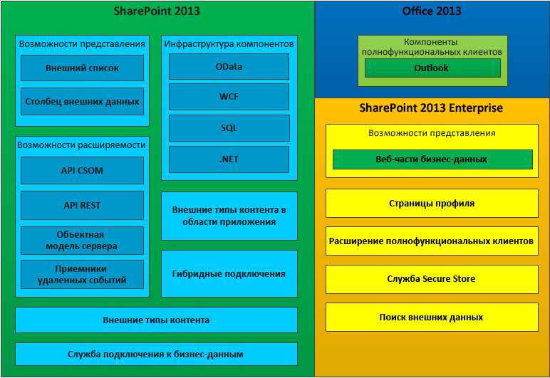

# Business Connectivity Services в SharePoint 2013
Информация о службах Службы Business Connectivity Services (BCS), их назначении и требованиях для разработки приложений BCS в SharePoint 2013.
Вы можете использовать SharePoint 2013 в качестве концентратора для создания высокопроизводительных решений для совместной работы, которые могут работать с различными внешними системами. Службы Business Connectivity Services (BCS) предоставляет инфраструктуру, которая включает SharePoint 2013 для переноса данных из внешних систем в центральную. Благодаря гибким и расширяемым средствам для описания источника данных внешних систем и методу взаимодействия с ними, BCS дает веские основания для использования SharePoint 2013 в качестве центрального интерфейса для работы с устаревшими бизнес-системами в дополнение к новым Надстройки SharePoint.
  
    
    

## Возможности BCS

BCS предоставляет опытным пользователям, разработчикам и специалистам ИТ-подразделений организации механизмы для облегчения выполнения следующих действий:
  
    
    

- Выявления внешних данных из корпоративных приложений, веб-служб и служб OData в SharePoint Server 2013 и в приложениях Office с расширенными возможностями клиента.
    
  
- Обеспечение поведение типа Office (например, контакты, задачи и встречи) и предоставление возможностей для внешних данных и служб.
    
  
- Обеспечение полного взаимодействия с данными, включая возможности выполнения обратной записи из приложений Office и SharePoint Server в базовые данные внешней системы и бизнес-объекты.
    
  
- Обеспечение автономного использования внешних данных и процессов.
    
  
- Соединение неструктурированного мира документов и людей и соответствующие структурированные данные, которые заблокированы во внешних системах.
    
  

## Компоненты BCS

На рис. 1 показаны функции, которые включены в SharePoint 2013 и Office 2013.
  
    
    

**Рис. 1. Набор функций служб Business Connectivity Services**

  
    
    

  
    
    

  
    
    

  
    
    

  
    
    

## Использование внешних типов контента в BCS

Внешние типы контента являются ядром BCS. Они позволяют управлять и повторно использовать метаданные и поведения бизнес-элемента, например клиента или заказа, из центрального расположения. Они позволяют пользователям более осмысленно взаимодействовать с этими внешними данными и процессами.
  
    
    
В качестве примера рассмотрим такой бизнес-элемент как клиент. Вы хотите поместить данные из собственной базы данных и работать с ней в SharePoint. Вам также необходимо иметь возможность позволять своим продавцам пользоваться данными в автономном режиме в Outlook 2013. Либо вы хотите, чтобы пользователь имел возможность выбрать клиента из списка клиентов в документе с контактной информацией клиента внутри Microsoft Word. Для того чтобы все это осуществить, вы можете создать единый внешний тип контента и затем повторно использовать его при необходимости.
  
    
    
Дополнительную информацию по использованию внешних типов контента в BCS можно узнать в статье  [Внешние типы контента в SharePoint 2013](external-content-types-in-sharepoint-2013.md).
  
    
    

## Разработка решений с использованием BCS

В SharePoint 2013 можно построить широкий спектр решений с помощью BCS. Сюда относятся простые решения, которые основываются на собственных возможностях с небольшой настройкой или без нее, промежуточные решения, которые подразумевают пользовательские функции в SharePoint 2013 и Office 2013, и дополнительные решения, которые включают сложные сценарии и большие приложения, расширяющие их функционал. Дополнительные решения предполагают написание кода с использованием Visual Studio. Они могут быть полными комплексными приложениями или повторно используемыми компонентами на основе кода, которые включены в промежуточное решение.
  
    
    
BCS позволяет бизнес-пользователям быстро и легко решать широкий круг потребностей во внешних данных за счет использования веб-браузера и клиентского приложения Microsoft Office, например Word или Excel. Без необходимости написания кода пользователи могут собрать составные решения за счет функций BCS, например внешних списков и столбцы внешних данных и повторно используемых компонентов BCS, которые создаются разработчиками и утверждаются ИТ, в клиентских приложениях Office и сайтах SharePoint. Эти решения включают бизнес-пользователей (и их команды), которые позволяют работать с внешними данными так же легко, как с данными SharePoint, в автономном режиме или с подключением к Интернету либо напрямую в Office 2013.
  
    
    
Дополнительную информацию о начале работы можно узнать в статье  [Настройка среды разработки для BCS в SharePoint 2013](setting-up-a-development-environment-for-bcs-in-sharepoint-2013.md).
  
    
    

## Использование OData с помощью служб Business Connectivity Services в SharePoint 2013

Протокол открытых данных (OData) — это веб-протокол, позволяющий раскрывать данные в Интернете с помощью таких технологий, как HTTP, Нотация объектов JavaScript (JSON) и AtomPub. Доступ к данным осуществляется через специально созданные URL-адреса. Данная архитектура позволяет вам взаимодействовать с данными, используя различные технологии.
  
    
    
Более подробную информацию можно узнать в статье  [Использование источников OData со службами Business Connectivity Services в SharePoint 2013](using-odata-sources-with-business-connectivity-services-in-sharepoint-2013.md).
  
    
    

## В этом разделе

-  [Новые возможности служб Business Connectivity Services в SharePoint 2013](what-s-new-in-business-connectivity-services-in-sharepoint-2013.md)
    
  
-  [Начало работы со службами Business Connectivity Services в SharePoint 2013](get-started-with-business-connectivity-services-in-sharepoint-2013.md)
    
  
-  [Внешние типы контента в SharePoint 2013](external-content-types-in-sharepoint-2013.md)
    
  
-  [Использование источников OData со службами Business Connectivity Services в SharePoint 2013](using-odata-sources-with-business-connectivity-services-in-sharepoint-2013.md)
    
  
-  [Внешние события и оповещения в SharePoint 2013](external-events-and-alerts-in-sharepoint-2013.md)
    
  
-  [Добавьте в пределах внешних типов контента в SharePoint 2013](add-in-scoped-external-content-types-in-sharepoint-2013.md)
    
  
-  [Начало работы с помощью клиентской объектной модели с внешними данными в SharePoint 2013](get-started-using-the-client-object-model-with-external-data-in-sharepoint-2013.md)
    
  
-  [Справочник по программистов Business Connectivity Services для SharePoint 2013](business-connectivity-services-programmers-reference-for-sharepoint-2013.md)
    
  

## Дополнительные ресурсы

-  [Добавление возможностей SharePoint 2013](add-sharepoint-2013-capabilities.md)
    
  
-  [Настройка среды разработки для BCS в SharePoint 2013](setting-up-a-development-environment-for-bcs-in-sharepoint-2013.md)
    
  
-  [Обзор разработки решений с помощью SharePoint 2013](sharepoint-2013-development-overview.md)
    
  

