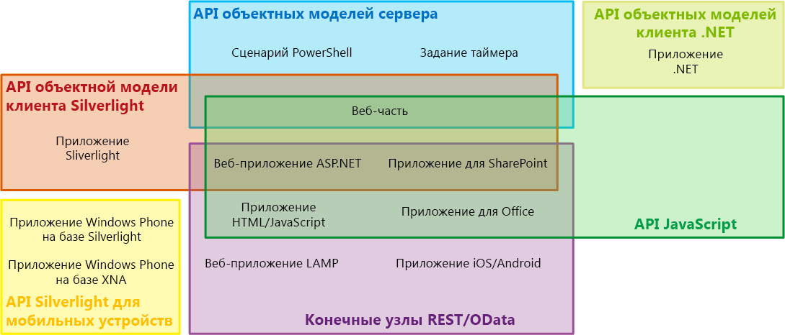
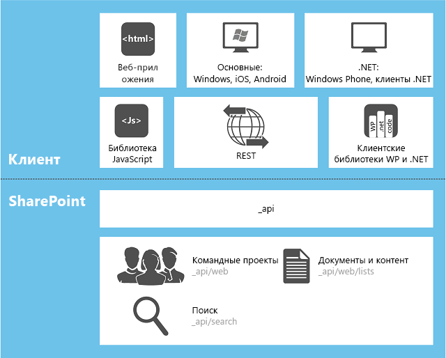

# Выбор правильного набора API в SharePoint 2013
Сведения о нескольких наборах API, включенных в SharePoint 2013, в том числе для серверной объектной модели, различных клиентских объектных моделей и веб-службы REST или OData.
**Просмотрите видео о стратегии развития SharePoint, касающейся REST и клиентской объектной модели SharePoint 2013 (CSOM)**

  
    
    

  
    
    

  
    
    

  
    
    

  
    
    

## Факторы, определяющие, какой набор API нужно использовать

Доступ к платформе SharePoint 2013 можно получить с помощью нескольких наборов интерфейсов API. Какой из них использовать, зависит от следующих факторов:
  
    
    

- **Тип приложения.** Можно использовать, помимо прочего, следующие не взаимоисключающие типы: Надстройка SharePoint, веб-часть на странице SharePoint, приложение Silverlight, которое запускается на клиентском компьютере или клиентском мобильном устройстве, приложение ASP.NET, которое представлено в SharePoint благодаря IFrame, код JavaScript, который выполняется на странице веб-сайта SharePoint, страница приложения SharePoint, приложение Microsoft .NET Framework, которое выполняется на клиентском компьютере, сценарий Windows PowerShell и задание таймера, которое выполняется на сервере SharePoint.
    
  
- **Ваши навыки.** Вы удивитесь, но в SharePoint 2013 можно создавать приложения, не вникая особо в программирование для SharePoint. Можно сразу приступить к разработке приложений для SharePoint, имея опыт работы с одной из следующих моделей программирования:
    
  - JavaScript
    
  
  - ASP.NET
    
  
  - REST или OData
    
  
  - .NET Framework
    
  
  - Windows Phone
    
  
  - Silverlight
    
  
  - Windows PowerShell
    
  
- **Устройство, на котором выполняется код.** Можно использовать сервер фермы SharePoint, внешний сервер (например, облачный сервер), клиентский компьютер и мобильное устройство.
    
  
В этом разделе предлагается обзор различных наборов интерфейсов API, предоставляемых в SharePoint 2013. На рисунке 1 показано, какие наборы интерфейсов API можно использовать для разработки каждого из 13 стандартных приложений для SharePoint. В большинстве случаев для этого доступны несколько интерфейсов API.
  
    
    

**Рисунок 1. Выбранные типы расширений SharePoint и наборы интерфейсов API для SharePoint**

  
    
    

  
    
    

  
    
    

  
    
    
В таблице ниже представлены рекомендации о том, какой набор API использовать для списка выбранных стандартных проектов расширений SharePoint. В оставшихся разделах статьи описаны различные наборы интерфейсов API.
  
    
    

|**Что нужно сделать**|**Какой интерфейс API подойдет**|
|:-----|:-----|
|Создать веб-приложение ASP.NET, выполняющее операции создания, чтения, обновления и удаления (CRUD) данных SharePoint или внешних данных, подключаемых в SharePoint через внешний тип контента Службы Microsoft Business Connectivity Services (BCS), с использованием брандмауэра.    |Клиентская объектная модель JavaScript.    |
|Создать веб-приложение ASP.NET, выполняющее операции CRUD с данными SharePoint или внешними данными, подключаемыми в SharePoint с использованием внешнего типа контента BCS, не вызывая SharePoint через брандмауэр.    |Клиентская объектная модель .NET Framework или Silverlight, а также конечные точки REST или OData.    |
|Создать веб-приложение LAMP, выполняющее операции CRUD с данными SharePoint или внешними данными, подключаемыми в SharePoint с использованием внешнего типа контента BCS.    |Конечные точки REST или OData.    |
|Создать приложение для Windows Phone, выполняющее операции CRUD с данными SharePoint.    |Клиентская объектная модель для мобильных устройств.    |
|Создать приложение для Windows Phone, использующее службу push-уведомлений (Майкрософт), чтобы оповещать мобильное устройство о событиях в SharePoint.    |Клиентская объектная модель для мобильных устройств и серверная объектная модель.    |
|Создать приложение для iOS или Android, выполняющее операции CRUD с данными SharePoint.    |Конечные точки REST или OData.    |
|Создать приложение .NET Framework, выполняющее операции CRUD с данными SharePoint.    |Клиентская объектная модель .NET Framework.    |
|Создать приложение Silverlight, выполняющее операции CRUD с данными SharePoint.    |Клиентская объектная модель Silverlight.    |
|Создать приложение HTML или JavaScript, выполняющее операции CRUD с данными SharePoint.    |Клиентская объектная модель JavaScript.    |
|Создать Надстройка Office, совместимое с SharePoint.    |Клиентская объектная модель JavaScript.    |
|Создать пользовательскую команду Windows PowerShell.    |Серверная объектная модель.    |
|Создать задание таймера.    |Серверная объектная модель.    |
|Создать расширение центра администрирования.    |Серверная объектная модель.    |
|Создать единую фирменную символику для всей ферме SharePoint.    |Серверная объектная модель.    |
|Создать пользовательскую веб-часть, страницу приложения или пользовательский элемент управления ASP.NET.    |Серверная объектная модель.    > **Важно!**> Если функции, которые вы планируете предложить клиентам, ориентированы на администрирование с помощью SharePoint только в случае семейства веб-сайтов, вместо использования серверной объектной модели рекомендуем создать Надстройка SharePoint, при необходимости включающее в себя удаленное веб-приложение ASP.NET с настраиваемыми веб-частями и пользовательскими элементами управления. См. первые две строки таблицы.           |
   

## Серверная объектная модель.

Серверная объектная модель управляемых классов содержит самый большой набор интерфейсов API. На уровне SharePoint Foundation 2013 в ее состав входят классы и элементы, обеспечивающие программный способ управления базовым сайтом, и структура списка SharePoint Foundation. Большая часть этих классов находится в пространстве имен  [Microsoft.SharePoint](https://msdn.microsoft.com/library/Microsoft.SharePoint.aspx) . Кроме того, с помощью серверной объектной модели можно расширить возможности практически каждого компонента SharePoint Foundation, в том числе рабочих процессов, оповещений, веб-частей, базового поиска и Службы Microsoft Business Connectivity Services (BCS). Серверная объектная модель также содержит расширенный набор интерфейсов API, чтобы обеспечить расширение возможностей системы администрирования и безопасности SharePoint Foundation, в том числе резервного копирования, диагностики работоспособности фермы, ведения журнала, управления веб-приложениями и фермой, обновления версии, развертывания, кэширования и настройки Windows PowerShell.
  
    
    
На уровне SharePoint Server 2013 добавляется намного больше классов для программирования управления корпоративным информационным содержимым (ECM), профилей пользователей, таксономии, расширенного поиска и других функций SharePoint Server 2013.
  
    
    
Можно использовать  [LINQ to Objects](http://msdn.microsoft.com/ru-ru/library/bb397919.aspx), чтобы отправлять запросы к любой коллекции **IEnumerable**, но  [Поставщик LINQ to SharePoint](http://msdn.microsoft.com/library/3fa2dc5f-d308-4337-aefd-191a5df8dbbe%28Office.15%29.aspx) позволяет отправлять прямые запросы к спискам в базах данных контента SharePoint. Строго говоря, этот поставщик недоступен в случае любого другого набора интерфейсов API, упомянутого в этой статье. Но использование синтаксиса LINQ возможно с большинством других наборов.
  
    
    
Сборки, определяющие встроенные серверные классы, устанавливаются в глобальный кэш сборок каждого сервера при установке SharePoint 2013. Когда программирование выполняется для серверной объектной модели, сборки устанавливаются как решения ферм в глобальный кэш сборок.
  
    
    

> **Примечание**
> Разработка новых изолированные решения для SharePoint 2013 не рекомендуется. Предпочтительно разрабатывать Надстройки SharePoint, но изолированные решения все равно можно установить в семейства веб-сайтов SharePoint 2013. Сборки этих решений остаются в пакете, если они не используются. В противном случае они временно устанавливаются в папке на сервере. Дополнительные сведения см. в статье  [Где развертываются сборки изолированных решений?](http://msdn.microsoft.com/library/dadbb20b-1bf7-442c-9eeb-bd9f01dbda45%28Office.15%29.aspx). 
  
    
    

### Ограничения на использование серверной объектной модели

Настраиваемая логика Надстройки SharePoint всегда распространяется "вниз" (к клиенту), "вверх" (в облако) или "через" (к определенному серверу, не входящему в ферму SharePoint). Во всех этих моделях распространения необходимо использовать одну из клиентских объектных моделей либо конечные точки REST или OData. (Вы не можете использовать серверную объектную модель в Надстройка SharePoint.) Например, если приложение содержит страницы с размещением в SharePoint, они могут получать доступ к данным SharePoint с помощью клиентской объектной модели JavaScript. На таких страницах также могут быть представлены приложения Silverlight, использующие клиентскую объектную модель Silverlight SharePoint 2013. Дополнительные сведения о Надстройки SharePoint см. в статье  [Важные аспекты архитектуры и разработки надстройки SharePoint](http://msdn.microsoft.com/library/ae96572b-8f06-4fd3-854f-fc312f7f2d88%28Office.15%29.aspx).
  
    
    

## Клиентские объектные модели для управляемого кода

В SharePoint 2013 используются три клиентские объектные модели для управляемого кода: Silverlight, .NET и модель для мобильных устройств.
  
    
    

### Клиентская объектная модель .NET

Объектная модель SharePoint 2013 для .NET Framework используется в приложениях .NET Framework, которые работают с клиентом Windows, отличном от телефона. Таким клиентом можно считать любое из следующих устройств:
  
    
    

- компьютер пользователя;
    
  
- сервер, не входящий в ферму SharePoint 2013;
    
  
- рабочая или веб-роль в Microsoft Azure.
    
  
Почти каждый класс основного сайта и серверной объектной модели списка имеет соответствующий класс в клиентской объектной модели .NET Framework. Кроме того, в клиентской объектной модели .NET Framework представлен полный набор интерфейсов API для расширения других функций, в том числе некоторых функций SharePoint Server 2013 (например, ECM, таксономии, профилей пользователей, расширенного поиска, аналитики и BCS).
  
    
    
Для повышения производительности строки кода, написанные с помощью клиентской объектной модели .NET Framework, отправляются на сервер SharePoint в виде пакетов. Там эти строки преобразовываются в серверный код, который выполняется. Затем запрашиваемые результаты и информация о новом состоянии всех переменных возвращаются клиенту. Как разработчик вы определяете, будет ли код пакета выполняться синхронно или асинхронно. (В случае синхронного выполнения приложение .NET Framework сначала подождет, пока будут возвращены результаты с сервера. При асинхронном выполнении сразу же продолжится обработка на стороне клиента, а пользовательский интерфейс не перестанет отвечать.)
  
    
    
Чтобы запрашивать любой объект **IEnumerable**, в том числе объекты SharePoint 2013, которые реализуют **IEnumerable**, вы можете использовать синтаксис запросов LINQ в клиентском коде. Но для этого необходимо использовать  [LINQ to Objects](http://msdn.microsoft.com/ru-ru/library/bb397919.aspx), а не  [поставщик LINQ to SharePoint](http://msdn.microsoft.com/library/3fa2dc5f-d308-4337-aefd-191a5df8dbbe%28Office.15%29.aspx), так как документация последнего не подходит для клиентского кода.
  
    
    
Сборки для клиентской объектной модели .NET Framework должны устанавливаться на клиенте. Они входят в состав распространяемого пакета, который можно получить на странице  [Клиентские компоненты SharePoint](http://www.microsoft.com/en-us/download/details.aspx?id=35585).
  
    
    
Примеры использования объектной модели .NET Framework см. в статье  [Выполнение базовых операций с использованием кода библиотеки клиента в SharePoint 2013](http://msdn.microsoft.com/library/5a69c9e3-73bf-4ed5-bc19-182056bdb394%28Office.15%29.aspx).
  
    
    

> **Примечание**
> В приложении .NET Framework вы можете также использовать конечные точки REST или OData SharePoint. Сравнение клиентской объектной модели .NET Framework с конечными точками REST или OData SharePoint см. в разделе  [Конечные точки REST или OData](#RESTOData) далее в этой статье.
  
    
    

### Клиентская объектная модель Silverlight

Объектная модель SharePoint 2013 для Silverlight используется в приложениях Silverlight независимо от места сохранения компилированного XAP-файла. Это может быть библиотека на веб-сайте SharePoint 2013, на клиентском компьютере, в облачном хранилище или на внешнем сервере. Обычно приложение Silverlight подключается в SharePoint 2013 в объекте  [SilverlightWebPart](https://msdn.microsoft.com/library/Microsoft.SharePoint.WebPartPages.SilverlightWebPart.aspx) . Клиентская объектная модель Silverlight в SharePoint 2013 практически идентична клиентской объектной модели .NET Framework и предусматривает поддержку тех же областей расширений. Главное отличие состоит в том, что в версии Silverlight все пакеты команд отправляются на сервер асинхронно, чтобы элементы пользовательского интерфейса приложения оставались активны.
  
    
    
Сборки для клиентской объектной модели Silverlight сохраняются на каждом сервере SharePoint 2013 в папке %ProgramFiles%\\Common Files\\Microsoft Shared\\web server extensions\\15\\TEMPLATE\\LAYOUTS\\ClientBin. Их не нужно устанавливать на компьютер, на котором установлено приложение Silverlight, хотя это предусмотрено. Кроме того, вы их можете сохранить в XAP-файл приложения.
  
    
    
XAP-файлы Silverlight можно включить в Надстройки SharePoint, в том числе в приложения с размещением в SharePoint. В последнем случае выполняется развертывание XAP-файла в библиотеке на сайте приложения. (Дополнительные сведения о сайтах приложения см в статье  [Хост-сайты, сайты надстроек и компоненты SharePoint в SharePoint 2013](http://msdn.microsoft.com/library/b791cdf5-8aa2-47fa-bc4c-aee437354759%28Office.15%29.aspx).) Поэтому благодаря приложению Silverlight можно включить настраиваемый код SharePoint в состав любого приложения, так как настраиваемый серверный код недопустим в Надстройки SharePoint. Это также позволяет разработчикам Silverlight использовать свои навыки для создания приложений SharePoint 2013, почти не тратя время на обучение.
  
    
    

> **Примечание**
> Кроме того, в приложении Silverlight можно использовать конечные точки REST или OData SharePoint. Сравнение клиентской объектной модели Silverlight и конечных точек REST или OData SharePoint см. в разделе  [Конечные точки REST или OData](#RESTOData) далее в этой статье.
  
    
    

### Объектная модель для мобильных устройств

Специальная версия клиентской объектной модели Silverlight доступна для устройств Windows Phone. Она содержит дополнительные интерфейсы API, которые подходят только для телефонов. Например, интерфейсы API, позволяющие регистрацию телефона для получения сообщений службы push-уведомлений (Майкрософт). Эта модель поддерживает все основные функции SharePoint 2013. Но поддержка не распространяется на дополнительные расширения, которые поддерживаются двумя другими клиентскими объектными моделями для управляемого кода. Для доступа к этим дополнительным функциям используйте конечные точки REST или OData SharePoint в мобильном приложении. См. раздел  [Конечные точки REST или OData](#RESTOData) далее в этой статье.
  
    
    
Сборки для объектной модели для мобильных устройств сохраняются на каждом сервере SharePoint 2013 в папке %ProgramFiles%\\Common Files\\Microsoft Shared\\web server extensions\\15\\TEMPLATE\\LAYOUTS\\ClientBin. Их необходимо поместить в XAP-файл приложения для Windows Phone.
  
    
    

## Объектная модель JavaScript

В SharePoint 2013 предоставлена объектная модель JavaScript, которую можно использовать во встроенном сценарии или отдельных JS-файлах. В ней предусмотрены те же функции, что и в клиентских объектных моделях .NET Framework и Silverlight. Как и клиентская объектная модель Silverlight, объектная модель JavaScript позволяет включить настраиваемый код SharePoint в состав любого приложения, так как настраиваемый код недопустим в Надстройки SharePoint. Это также позволяет веб-разработчикам использовать свои навыки работы с JavaScript, чтобы создавать приложения для SharePoint, почти не тратя время на обучение.
  
    
    
Как и клиентские объектные модели для управляемого кода, инфраструктура JavaScript для SharePoint 2013 взаимодействует с серверами фермы с помощью пакетов с кодом, который всегда выполняется асинхронно. Кроме того, сейчас возможно получать доступ к данным SharePoint на разных доменах с помощью JavaScript (но только к данным одного и того же родительского семейства веб-сайтов), что было недопустимо в предыдущих версиях SharePoint. Дополнительные сведения см. в статье  [Обращение к данным SharePoint 2013 из надстроек с помощью междоменной библиотеки](http://msdn.microsoft.com/library/bc37ff5c-1285-40af-98ae-01286696242d%28Office.15%29.aspx). Данные возвращаются с сервера с помощью Нотация объектов JavaScript (JSON).
  
    
    
Объектная модель JavaScript определяется в наборе JS-файлов, размещенных в папке %ProgramFiles%\\Common Files\\Microsoft Shared\\web server extensions\\15\\TEMPLATE\\LAYOUTS на каждом сервере.
  
    
    
Примеры использования объектной модели .NET Framework см. в статье  [Выполнение базовых операций с использованием кода библиотеки JavaScript в SharePoint 2013](http://msdn.microsoft.com/library/29089af8-dbc0-49b7-a1a0-9e311f49c826%28Office.15%29.aspx).
  
    
    

> **Примечание**
> Кроме того, в приложении JavaScript можно использовать конечные точки REST или OData SharePoint. Сравнение клиентской объектной модели JavaScript и конечных точек REST или OData SharePoint см. в разделе  [Конечные точки REST или OData](#RESTOData). 
  
    
    

## Конечные точки REST или OData

В случае сценариев, при которых необходимо получить доступ к объектам SharePoint со стороны клиентских технологий, которые не используют JavaScript и не созданы на платформах .NET Framework или Silverlight, SharePoint 2013 обеспечивает реализацию веб-службы передачи репрезентативного состояния (REST), использующей  [протокол ODatal](http://www.odata.org/) для выполнения операций CRUD с данными списков SharePoint. Кроме того, почти каждый интерфейс API клиентской объектной модели имеет соответствующую конечную точку REST. Это позволяет коду напрямую взаимодействовать с артефактами SharePoint с помощью любой технологии, поддерживающей стандартные HTTP-запросы и отклики. Чтобы использовать возможности REST, встроенные в SharePoint 2013, код создает запрос RESTful HTTP для конечной точки, соответствующей необходимому интерфейсу API клиентской объектной модели. Веб-служба client.svc обрабатывает HTTP-запрос и направляет отклик в формате Atom или JSON.
  
    
    
Дополнительные сведения об использовании веб-службы REST или OData см. в статье  [Программирование с использованием службы SharePoint 2013 REST](use-odata-query-operations-in-sharepoint-rest-requests.md), примеры — в статье  [Выполнение базовых операций с использованием конечных точек SharePoint 2013 REST](http://msdn.microsoft.com/library/e3000415-50a0-426e-b304-b7de18f2f7d9%28Office.15%29.aspx).
  
    
    

### Сравнение программирования с помощью REST или OData с программированием с помощью клиентской объектной модели

В некоторых случаях, возможно, лучше использовать конечные точки REST даже в приложениях, для которых доступна объектная модель SharePoint. Это в первую очередь касается разработчиков, не имеющих опыта разработки для Windows. В таблице ниже сравниваются основные функции этих типов программирования при создании приложения на платформе Windows или платформе, поддерживающей JavaScript.
  
    
    

|**Функция**|**Объектная модель .NET Framework или Silverlight**|**Объектная модель JavaScript**|**Конечные точки REST или OData, вызываемые с помощью платформы Windows или JavaScript**|
|:-----|:-----|:-----|:-----|
|Объектно-ориентированное программирование    |Да    |Да    |Нет    |
|Пакетная обработка    |Да    |Да    |Да    |
|Интерфейсы API для условной обработки и обработки исключений    |Да    |Нет    |Нет    |
|Доступность синтаксиса LINQ    |Да    |Нет    |Нет    |
|Объединение данных списков из различных веб-приложений SharePoint    |Да    |Нет    |Да    |
|Знание разработчиками, использующим REST или OData    |Нет    |Нет    |Да    |
|Сходство с программированием не для Windows или с помощью JavaScript    |Нет    |Да    |Да    |
|Строгая типизация полей элементов списка    |Нет (если не использовать LINQ)    |Нет    |Да (в случае платформы Windows)          Нет (в случае JavaScript)    |
|Использование jQuery, Knockout и других библиотек JavaScript    |Нет    |Да    |Нет (в случае платформы Windows)          Да (в случае JavaScript)    |
   

## Платформа WCF Data Services

Предпочитаете использовать синтаксис LINQ в клиентских приложениях .NET Framework или Silverlight? SharePoint 2013 поддерживает  [WCF Data Services](http://msdn.microsoft.com/ru-ru/library/cc668792.aspx) как поставщика LINQ. Можно ориентироваться на файл listdata.svc для доступа к данным списка, как в ранних версиях SharePoint Foundation, или на тот же файл client.svc, который поддерживает интерфейс OData, чтобы получить доступ ко всем объектам SharePoint (в дополнение к данным списка). Дополнительные сведения см. в статье [Запрос SharePoint Foundation с помощью служб данных ADO.NET](http://msdn.microsoft.com/library/3e3e16f7-620a-4710-a3f3-19d0236f4b4a%28Office.15%29.aspx).
  
    
    
На рисунке 2 показаны отношения между различными клиентскими интерфейсами API, клиентскими приложениями и SharePoint. URL-адреса _api* — URL-адреса конечных точек REST, связанные с фермой. Дополнительные сведения см. в статье  [Дополнительные сведения о службе REST в SharePoint 15](get-to-know-the-sharepoint-2013-rest-service.md#bk_learnmore).
  
    
    

**Рисунок 2. Клиентские приложения и интерфейсы API в SharePoint**

  
    
    

  
    
    

  
    
    

  
    
    

  
    
    

## Нерекомендуемые наборы интерфейсов API

Платформа SharePoint 2013 до сих пор поддерживает обратную совместимость двух наборов API, но мы не рекомендуем их использовать в новых проектах. Эти наборы относятся к  [веб-службам ASP.NET (asmx)](http://msdn.microsoft.com/library/c587ee90-1f88-43f3-b1a7-5f3072d038f8%28Office.15%29.aspx) и [прямым RPC-вызовам файла owssvr.dll](http://msdn.microsoft.com/library/4aa5c82b-90fb-4be5-b30c-d35ecae42a81%28Office.15%29.aspx).
  
    
    

## Дополнительные ресурсы

-  [Обзор разработки решений с помощью SharePoint 2013](sharepoint-2013-development-overview.md)
    
  
-  [Модели программирования в SharePoint 2013](programming-models-in-sharepoint-2013.md)
    
  
-  [Сравнение надстроек SharePoint с решениями SharePoint](sharepoint-add-ins-compared-with-sharepoint-solutions.md)
    
  
-  [Программирование с использованием службы SharePoint 2013 REST](use-odata-query-operations-in-sharepoint-rest-requests.md)
    
  
-  [Выполнение базовых операций с использованием конечных точек SharePoint 2013 REST](http://msdn.microsoft.com/library/e3000415-50a0-426e-b304-b7de18f2f7d9%28Office.15%29.aspx)
    
  
-  [Выполнение базовых операций с использованием кода библиотеки клиента в SharePoint 2013](http://msdn.microsoft.com/library/5a69c9e3-73bf-4ed5-bc19-182056bdb394%28Office.15%29.aspx)
    
  
-  [Выполнение базовых операций с использованием кода библиотеки JavaScript в SharePoint 2013](http://msdn.microsoft.com/library/29089af8-dbc0-49b7-a1a0-9e311f49c826%28Office.15%29.aspx)
    
  
-  [Запрос SharePoint Foundation с помощью служб данных ADO.NET](http://msdn.microsoft.com/library/3e3e16f7-620a-4710-a3f3-19d0236f4b4a%28Office.15%29.aspx)
    
  

  
    
    
