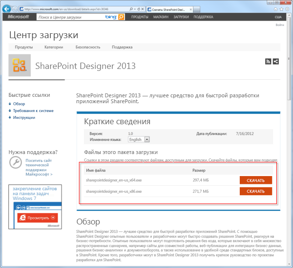
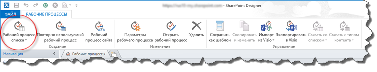
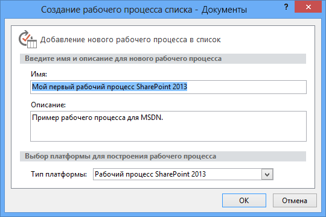
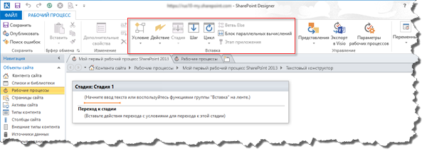

# Создание рабочего процесса с помощью SharePoint Designer 2013 и платформы SharePoint 2013 Workflow
Узнайте, как установить, открыть и создать рабочий процесс с помощью SharePoint Designer 2013 и платформы SharePoint 2013 Workflow. 
||
|:-----|
||
   

## Установка SharePoint Designer 2013

SharePoint Designer 2013 можно скачать бесплатно. Чтобы скачать и установить SharePoint Designer 2013, выполните описанные ниже шаги. 
  
    
    

### Чтобы установить SharePoint Designer 2013:

1. Откройте свой веб-браузер и перейдите в Центр загрузки Майкрософт:  [http://www.microsoft.com/download](http://www.microsoft.com/download.aspx). 
    
  
2. Введите в поле поиска SharePoint Designer 2013.
    
  
3. Щелкните ссылку "SharePoint Designer 2013". 
    
  
4. Ознакомьтесь с обзором, системными требованиями и инструкциями по установке. Убедитесь, что ваша система совместима. 
    
  
5. Выберите 64-разрядный ( **x64**) или 32-разрядный ( **x86**) тип платформы, как показано на рисунке. 
    
  
6. Следуйте инструкции по установке SharePoint Designer 2013.
    
  

**Рисунок. Страница загрузки SharePoint Designer 2013**

  
    
    

  
    
    

  
    
    

  
    
    

  
    
    

## Открытие SharePoint Designer 2013 и подключение к сайту SharePoint 2013

SharePoint Designer 2013 устанавливается как приложение Office 2013. Чтобы открыть SharePoint Designer 2013 и подключиться к сайту SharePoint 2013, выполните описанные ниже шаги. 
  
    
    

### Чтобы открыть SharePoint Designer 2013 и подключиться к сайту SharePoint 2013:

1. Откройте SharePoint Designer 2013, выбрав его в меню **Пуск**. Нажмите значок **Пуск**, выберите пункт **Все программы**, а затем — **Microsoft Office 2013** и **SharePoint Designer 2013**. 
    
  
2. Щелкните **Открыть сайт** на начальной странице SharePoint Designer 2013.
    
  
3. Введите сайт SharePoint 2013, к которому хотите подключиться. Например, http://www.contoso.com/sites/a-sharepoint-site.
    
  
4. Нажмите кнопку **Открыть**, чтобы открыть веб-сайт.
    
  
5. При необходимости введите свои учетные данные. (Если с компьютером, с которого вы выполнили вход, не интегрирована система безопасности, далее вам будет предложено ввести учетные данные.) Убедитесь, что вы используете учетные данные с правами доступа на сайт SharePoint 2013.
    
  

## Создание рабочего процесса списка на основе платформы SharePoint 2013 Workflow

SharePoint Designer 2013 можно использовать для многих важных задач. Панель навигации используется для переключения между различными аспектами SharePoint Designer 2013. Чтобы создать новый рабочий процесс списка на основе платформы SharePoint 2013 Workflow, выполните описанные ниже шаги.
  
    
    

### Чтобы создать рабочий процесс на основе платформы SharePoint 2013 Workflow:

1. Щелкните на панели навигации узел "Рабочие процессы".
    
  
2. Щелкните выпадающее меню **Рабочий процесс списка** в разделе **Создание** ленты, как показано на рисунке.
    
  
3. Выберите список, который нужно связать с новым рабочим процессом.
    
  
4. В диалоговом окне **Создание рабочего процесса списка** введите название и описание рабочего процесса, а затем убедитесь, что **Тип платформы** установлен в **SharePoint 2013 Workflow**, как показано на рисунке.
    
    > **Примечание**
      > Если тип платформы SharePoint 2013 Workflow недоступен, то Workflow Manager не настроен для работы с фермой SharePoint Server 2013. 
5. Нажмите кнопку **ОК**, чтобы создать рабочий процесс.
    
  

**Рисунок. Кнопка на ленте для создания нового рабочего процесса списка**

  
    
    

  
    
    

  
    
    

  
    
    

  
    
    

**Рисунок. Диалоговое окно "Создание рабочего процесса списка"**

  
    
    

  
    
    

  
    
    

  
    
    

  
    
    
Теперь, когда рабочий процесс создан, вы можете добавлять к нему нужные действия, условия, стадии, шаги и циклы. Эти компоненты доступны на ленте SharePoint Designer 2013, как показано на рисунке. 
  
    
    

**Рисунок. Элементы рабочего процесса для платформы SharePoint 2013 Workflow**

  
    
    

  
    
    

  
    
    

    
> **Примечание**
> Процедура, описанная выше, используется для создания рабочего процесса списка. Повторно используемый рабочий процесс или рабочий процесс сайта можно создать по аналогичной процедуре со следующими изменениями: при создании рабочего процесса на ленте вместо кнопки "Рабочий процесс списка" нажмите кнопку **Повторно используемый рабочий процесс** или **Рабочий процесс сайта**. 
  
    
    

Дополнительную информацию о доступных компонентах для разработки рабочих процессов можно узнать в статье  [Краткий справочник по действиям рабочего процесса (платформа рабочих процессов в SharePoint 2013)](workflow-actions-quick-reference-sharepoint-2013-workflow-platform.md).
  
    
    

## Дополнительные ресурсы

-  [What's new in workflow in SharePoint Server 2013](http://msdn.microsoft.com/library/6ab8a28b-fa2f-4530-8b55-a7f663bf15ea.aspx)
    
  
-  [Getting started with SharePoint Server 2013 workflow](http://msdn.microsoft.com/library/cc73be76-a329-449f-90ab-86822b1c2ee8.aspx)
    
  
-  [Разработка рабочих процессов в SharePoint Designer и Visio](workflow-development-in-sharepoint-designer-and-visio.md)
    
  

  
    
    

