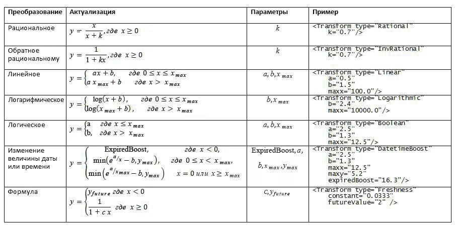
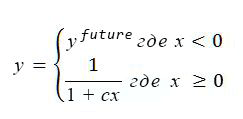
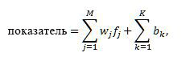
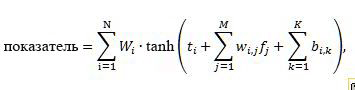
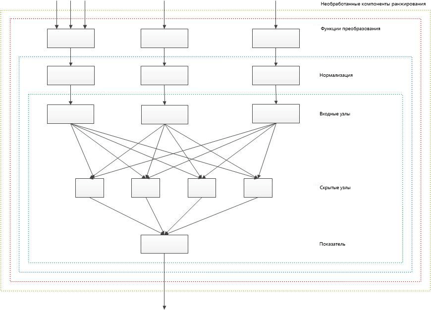

# Настройка моделей ранжирования для улучшения релевантности в SharePoint 2013
Повышение релевантности поиска путем настройки моделей ранжирования для точного вычисления рангов релевантности с помощью компонентов ранжирования в SharePoint Server 2013.
Вы можете  [сортировать результаты поиска в SharePoint 2013](sorting-search-results-in-sharepoint-2013.md) четырьмя способами, один из которых — по рангу. При сортировке результатов поиска по рангу SharePoint Server 2013 помещает наиболее релевантные результаты в начало списка.
  
    
    

Результат поиска является релевантным, если он получает высокий ранг — специальный числовой показатель, вычисляемый поисковой системой с помощью модели ранжирования. Модель ранжирования — это список этапов, содержащих наборы компонентов ранжирования.
Модель ранжирования задает, как поисковая система вычисляет ранг релевантности, с помощью различных факторов, которые представлены в модели как компоненты ранжирования. К факторам вычисления ранга релевантности, помимо прочих, относятся следующие факторы:
  
    
    


- Наличие терминов запросов в полнотекстовом индексе, в частности таких сведений, как заголовок и основной текст документа.
    
  
- Метаданные, связанные с определенным элементом, например тип файла документа или длина URL-адреса.
    
  
- Текст привязки, связанный с URL-ссылками, указывающими на определенный элемент.
    
  
- Сведения о нажатиях элементов пользователями.
    
  
- Расположение терминов запросов в основном тексте или заголовке документа.
    
  

## Начало настройки модели ранжирования на основе шаблона модели ранжирования SharePoint
<a name="sp15_using_custom_ranking_model"> </a>

Чтобы упростить настройку, начните с использования одной из стандартных моделей ранжирования SharePoint Server 2013 в качестве шаблона. Затем измените эту модель ранжирования в соответствии с вашим набором данных.
  
    
    
По умолчанию SharePoint Server 2013 содержит 14 моделей ранжирования. Подробные сведения об этих моделях и их назначении см. в разделе  [Что такое "модель ранжирования"?](http://technet.microsoft.com/library/7c8ddec1-c8ff-4a90-afae-387b27a653f1.aspx#Ranking_Models) (на сайте TechNet).
  
    
    

> **Важно!**
> Если установлено накопительное обновление SharePoint Server 2013 за август 2013 г., рекомендуем использовать модель **Search Ranking Model with Two Linear Stages** в качестве базовой модели ранжирования. Модель **Search Ranking Model with Two Linear Stages** является копией **Default Search Model** с линейным вторым этапом вместо нейронной сети.
  
    
    

Для настройки моделей ранжирования можно использовать следующие командлеты Windows PowerShell:
  
    
    

-  [Get-SPEnterpriseSearchRankingModel](http://technet.microsoft.com/ru-ru/library/ff607990.aspx)
    
  
-  [New-SPEnterpriseSearchRankingModel](http://technet.microsoft.com/ru-ru/library/ff607980.aspx)
    
  
-  [Remove-SPEnterpriseSearchRankingModel](http://technet.microsoft.com/ru-ru/library/ff608045.aspx)
    
  
-  [Set-SPEnterpriseSearchRankingModel](http://technet.microsoft.com/ru-ru/library/ff607940.aspx)
    
  

### Получение списка всех доступных моделей ранжирования


1. Откройте Командная консоль SharePoint от имени администратора.
    
  
2. Запустите следующую последовательность командлетов Windows PowerShell.
    
  ```
  
$ssa = Get-SPEnterpriseSearchServiceApplication -Identity "Search Service Application"
$owner = Get-SPenterpriseSearchOwner -Level ssa
Get-SPEnterpriseSearchRankingModel -SearchApplication $ssa -Owner $owner
  ```


### Получение стандартной модели ранжирования в качестве шаблона


1. Откройте Командная консоль SharePoint от имени администратора.
    
  
2. Запустите следующую последовательность командлетов Windows PowerShell.  *filename.xml*  — это имя файла, в котором нужно сохранить модель ранжирования.
    
  ```
  
$ssa = Get-SPEnterpriseSearchServiceApplication
$owner = Get-SPenterpriseSearchOwner -Level ssa
$defaultRankingModel = Get-SPEnterpriseSearchRankingModel -SearchApplication $ssa -Owner $owner | Where-Object { $_.IsDefault -eq $True }
$defaultRankingModel.RankingModelXML > filename.xml

  ```

Если установлено накопительное обновление SharePoint Server 2013 за август 2013 г., вы можете выполнить указанные ниже действия, чтобы получить модель ранжирования поиска с двумя линейными этапами для использования в качестве шаблона пользовательской модели.
  
    
    

### Получение модели ранжирования поиска с двумя линейными этапами в качестве шаблона


1. Откройте Командная консоль SharePoint от имени администратора.
    
  
2. Запустите следующую последовательность командлетов Windows PowerShell.  *filename.xml*  — это имя файла, в котором нужно сохранить модель ранжирования.
    
  ```
  
$ssa = Get-SPEnterpriseSearchServiceApplication
$owner = Get-SPenterpriseSearchOwner -Level ssa 
$twoLinearStagesRankingModel = Get-SPEnterpriseSearchRankingModel -SearchApplication $ssa -Owner $owner -Identity 5E9EE87D-4A68-420A-9D58-8913BEEAA6F2 
$twoLinearStagesRankingModel.RankingModelXML > filename.xml

  ```


### Развертывание пользовательской модели ранжирования


1. Скопируйте GUID нужной модели из списка доступных моделей ранжирования. Нужная последовательность командлетов Windows PowerShell описана в разделе  [Получение списка всех доступных моделей ранжирования](#sp15_list_available_ranking_models).
    
  
2. Запустите следующую последовательность командлетов Windows PowerShell, используя GUID, скопированный на этапе 1, в качестве значения параметра  _<GUID>_.
    
  ```
  
$ssa = Get-SPEnterpriseSearchServiceApplication
$owner = Get-SPenterpriseSearchOwner -Level ssa
$rm = Get-SPEnterpriseSearchRankingModel -Identity <GUID> -SearchApplication $ssa -Owner $owner
$rm.RankingModelXML > myrm.xml 

  ```

3. Отредактируйте файл  `myrm.xml` в редакторе XML. В качестве атрибутов **id** в элементе _RankModel2Stage_ и всех элементах _RankingModel2NN_ необходимо использовать новые значения GUID. Чтобы получить новое значение GUID, вы можете использовать следующую команду Windows PowerShell: `[guid]::NewGuid()`
    
  
4. Создайте новую модель ранжирования с помощью командлета  [New-SPEnterpriseSearchRankingModel](http://technet.microsoft.com/ru-ru/library/ff607980.aspx), выполнив следующие команды.
    
  ```
  
$myRankingModel = Get-Content .\\myrm.xml
$myRankingModel = [String]$myRankingModel
$ssa = Get-SPEnterpriseSearchServiceApplication
$owner = Get-SPenterpriseSearchOwner -Level ssa
$newrm = New-SPEnterpriseSearchRankingModel -SearchApplication $ssa -Owner $owner -RankingModelXML $myRankingModel
  ```


### Сведения о ранге


> **Важно!**
> Сведения о ранге и страница ExplainRank предоставляются для удобства и только в целях отладки пользовательских моделей ранжирования. На состав подробных сведений о ранге и содержимое страницы ExplainRank не распространяется поддержка, и они могут быть изменены без предупреждения в последующих исправлениях и обновлениях программного обеспечения. 
  
    
    

Сведения о ранге — это XML-документ, содержащий сведения о вычислении ранга для отдельного элемента, который соответствует определенному запросу пользователя. Сведения о ранге хранятся в специальном управляемом свойстве под названием **rankdetail**.
  
    
    
У каждого компонента ранжирования в модели есть отдельный узел XML в сведениях о ранге, где описывается вычисление ранга. Подробные сведения о ранге предоставляются только для запросов, результаты поиска по которым содержат не более 100 элементов.
  
    
    
Концептуально общий формат сведений о ранге имеет следующий вид.
  
    
    


```XML

<rank_log version='15.0.0000.1000' id='[internal guid of ranking model used for calculation]' >
    <query tree='[representation of user query used for ranking]'/>
    <stage type='linear'>
        [Details of rank calculation of the first ranking stage. One XML node for each rank feature.]
        <stage_model>
            [Definition of the first stage of the ranking model]
        </stage_model>
    </stage>
    <stage type='neural_net' >
        [Details of rank calculation of the second ranking stage. One XML node for each rank feature.]
        <stage_model>
            [Definition of the second stage of the ranking model]
        </stage_model>
    </stage>
</rank_log>
```

Чтобы получить сведения о ранге, необходимо быть администратором приложения-службы поиска (SSA).
  
    
    

### Получение сведений о ранге


1. Откройте Командная консоль SharePoint от имени администратора.
    
  
2. Запустите следующую последовательность командлетов Windows PowerShell, заменив параметры  _<query_text>_ и _<url>_ фактическими значениями.
    
  ```
  
$app = Get-SPEnterpriseSearchServiceApplication
$searchAppProxy =  Get-spenterprisesearchserviceapplicationproxy | Where-Object { ($_.ServiceEndpointUri.PathAndQuery -like $app.Uri.PathAndQuery)}
$request = New-Object Microsoft.Office.Server.Search.Query.KeywordQuery($searchAppProxy)
$request.ResultTypes = [Microsoft.Office.Server.Search.Query.ResultType]::RelevantResults
$request.QueryText = "<query_text> AND path:""<url>"""
$request.SelectProperties.Add("rankdetail")
$searchexecutor = new-Object Microsoft.Office.Server.Search.Query.SearchExecutor 
$resultTables = $searchexecutor.ExecuteQuery($request) 
$resultTables[([Microsoft.Office.Server.Search.Query.ResultType]::RelevantResults)].Table

  ```


### Общие сведения о вычислении ранга на странице ExplainRank

SharePoint Server 2013 включает страницу **ExplainRank**, расположенную в папке макетов ( `<searchCenter>/_layouts/15/`). Эта страница содержит подробные сведения о ранге для каждого компонента ранжирования на основе определенного поискового запроса, идентификатора документа и, при необходимости, идентификатора модели ранжирования. Эти сведения получаются и анализируются из сведений о ранге
  
    
    
Вы можете перейти на странице **ExplainRank** по следующему URL-адресу:
  
    
    
 `http://<searchCenter>/_layouts/15/ExplainRank.aspx?q={x}&amp;d={y}&amp;rm={z}`
  
    
    
Где:
  
    
    

-  *x*  — это поисковый запрос.
    
  
-  *y*  — это идентификатор документа.
    
  
-  *z*  — это необязательный идентификатор модели ранжирования. Если он не указан, используется модель ранжирования по умолчанию.
    
  
Как и со сведениями о ранге, для просмотра страницы **ExplainRank** необходимо быть администратором приложения-службы поиска (SSA).
  
    
    

## Настройка модели с помощью компонентов ранжирования
<a name="sp15_rank_features"> </a>

Компоненты ранжирования подобны ручкам управления моделью ранжирования. В следующих разделах описываются компоненты ранжирования, доступны в стандартной модели ранжирования SharePoint Server 2013, и то, как они участвуют в вычислении ранга релевантности.
  
    
    

### BM25

Компонент ранжирования BM25 оценивает элементы по внешнему виду терминов запросов в полнотекстовом индексе. Входными данными компонента BM25 могут быть любые управляемые свойства полнотекстового индекса.
  
    
    

> **Примечание**
> В этом контексте используется версия компонента ранжирования BM25 с полями, BM25F. 
  
    
    

Компонент ранжирования BM25 вычисляет ранг релевантности по следующей формуле.
  
    
    

  
    
    

  
    
    
Где:
  
    
    

-  _D_ — это документ, представленный в виде списка текстовых полей, например заголовка или основного текста.
    
  
-  _Q_ — запрос пользователя, представленный в виде списка терминов запроса, _t_.
    
  
-  _S_ задает список полей, которые участвуют в ранжировании релевантности. Этот список задается в модели ранжирования.
    
  
-  _w_f— это числовое значение, которое задает относительный вес поля  _f_ ∈ _S_. Это значение задается моделью ранжирования.
    
  
-  _b_f— это числовое значение, которое задает нормализацию длины документа для каждого поля  _f_ ∈ _S_.
    
  
-  _TF_f _(t,D)_ — это количество вхождений термина запроса _t_ в поле _f_ документа _D_.
    
  
-  _DL_f _(D)_ — это общее количество слов в поле _f_ документа _D_.
    
  
-  _N_ — это общее количество документов в индексе.
    
  
-  _n_t— это количество документов, содержащих термин  _t_ хотя бы в одном из свойств.
    
  
-  _AVDL_f— это среднее значение  _DL_f _(D)_ во всех проиндексированных документах.
    
  
-  _k_1— это скалярный параметр. Его значение задается моделью ранжирования.
    
  
Управляемые свойства, используемые компонентом ранжирования BM25, необходимо сопоставить со стандартным полнотекстовым индексом в интерфейсе **Выбор дополнительных параметров поиска**.
  
    
    
В поисковом запросе из вычислений ранга релевантности исключаются термины, являющиеся частью следующих операторов:  `NOT(…)` в FQL, `NOT(…)` в KQL и `FILTER(…)` в FQL.
  
    
    
Кроме того, из вычислений исключаются термины, входящие в область, например  `title:apple AND body:orange`.
  
    
    
 **Пример определения компонента ранжирования BM25**
  
    
    


```XML

<BM25Main name="ContentRank" k1="1">
    <Layer1Weights>
        <Weight>0.26236235707678</Weight>
    </Layer1Weights>
    <Properties>
        <Property name="body" w="0.019391078235467" b="0.44402228898786156" propertyName="body" />
        <Property name="Title" w="0.36096989709360422" b="0.38179554361297785" propertyName="Title" />
        <Property name="Author" w="0.15808522836934547" b="0.13896219383271818" propertyName="Author" />
        <Property name="Filename" w="0.15115036355698144" b="0.96245017871125826" propertyName="Filename" />
        <Property name="QLogClickedText" w="0.3092664171701901" b="0.056446823262849853" propertyName="QLogClickedText" />
        <Property name="AnchorText" w="0.021768362296187508" b="0.74173561196103566" propertyName="AnchorText" />
        <Property name="SocialTag" w="0.10217215754116529" b="0.55968554315932328" propertyName="SocialTag" />
    </Properties>
</BM25Main>
```

 **Пример сведений о ранге для компонента ранжирования BM25**
  
    
    


```

<bm25 name='ContentRank'>
<schema pid_mapping='[1:content::7:%default] [2:content::1:%default] [3:content::5:%default] [56:content::2:%default] [100:content::3:link] [10:content::6:link] [264:content::14:link] ' pids_not_mapped=''/>
<query_term term='WORDS(content:integration, content:integrations, content:integrations)'>
    <index name='content' N='10035' n='8'
           avdl='1 2.98018 2.00427 1 1 2.39394 1 637.308 1 1 1 1 1 1 1 1 '>
        <group id='%default'
               ext_doc_id='55' int_doc_id='16' precalc='0' tf_prime='0.500486' weight='1'
               tf='0 1 1 0 0 0 0 11 0 0 0 0 0 0 0 0 '
               dl='0 4 9 0 0 2 0 1291 0 0 0 0 0 0 0 0 '/>
        <group id='link'/>
    </index>
    <rank score='2.37967' score_acc='2.37967' term_weight='7.13439'/>
</query_term>

<query_term term='WORDS(content:effort, content:efforts, content:efforts)'>
    <index name='content' N='10035' n='9'
           avdl='1 2.98018 2.00427 1 1 2.39394 1 637.308 1 1 1 1 1 1 1 1 '>
        <group id='%default'/>
        <group id='link'/>
    </index>
    <rank score='0' score_acc='2.37967' term_weight='7.01661'/>
</query_term>

<query_term term='PHRASE(content:fastserver, content:plugin)'>
    <index name='content' N='10035' n='3'
           avdl='1 2.98018 2.00427 1 1 2.39394 1 637.308 1 1 1 1 1 1 1 1 '>
        <group id='%default'
               ext_doc_id='55' int_doc_id='16' precalc='0' tf_prime='0.0399696' weight='1'
               tf='0 0 0 0 0 0 0 3 0 0 0 0 0 0 0 0 '
               dl='0 4 9 0 0 2 0 1291 0 0 0 0 0 0 0 0 '/>
        <group id='link'/>
    </index>
    <rank score='0.311896' score_acc='2.69157' term_weight='8.11522'/>
</query_term>
<final score='2.69157' transformed='2.69157' normalized='2.69157' hidden_nodes_adds='0.706166 '/>
</bm25>

```


#### Группы веса

В пользовательской модели ранжирования могут быть одно или два управляемых свойства, сопоставленных с одной группой веса в схеме поиска. В таких случаях содержимое этих управляемых свойств объединяется в полнотекстовый индекс, и его нельзя ранжировать отдельно в вычислениях BM25. Этот эффект аналогичен назначению одинаковых значений параметрам  _w_.fи  _b_fв каждой группе управляемых свойств, сопоставленных с одной группой веса в схеме поиска. Во избежание этого сопоставляйте управляемые свойств с одной из 16 групп веса, доступных в схеме поиска.
  
    
    
Группы веса также называют контекстом. Дополнительные сведения об отношениях между управляемым свойством и его контекстом см. в разделе  [Влияние на ранжирование результатов поиска с помощью схемы поиска](http://technet.microsoft.com/library/7c8ddec1-c8ff-4a90-afae-387b27a653f1.aspx#Ranking_Schema) (на сайте TechNet).
  
    
    

### Статический компонент

Статический компонент ранжирования оценивает элементы по числовым управляемым свойствам, которые хранятся в индексе поиска. Числовые управляемые свойства, используемые для вычисления ранга релевантности в статических компонентах ранжирования, должны иметь тип  [Integer](https://msdn.microsoft.com/library/System.Integer.aspx) и атрибут [Refinable](https://msdn.microsoft.com/library/Microsoft.Office.Server.Search.Administration.ManagedProperty.Refinable.aspx) или [Sortable](https://msdn.microsoft.com/library/Microsoft.Office.Server.Search.Administration.ManagedProperty.Sortable.aspx) в схеме поиска. Многозначные управляемые свойства невозможно использовать в сочетании со статическим компонентом ранжирования.
  
    
    
Прежде чем объединить статический компонент ранжирования с остальными компонентами ранжирования, необходима предварительная обработка каждого статического компонента путем простого преобразования. В таблице 1 перечислены все поддерживаемые функции преобразования.
  
    
    

**Таблица 1. Поддерживаемые функции преобразования для компонентов ранжирования с учетом расположения и статических компонентов ранжирования**

  
    
    

  
    
    

  
    
    
 **Пример определения статического компонента ранжирования**
  
    
    


```XML

<Static name="clickdistance" default="5" propertyName="clickdistance">
    <Transform type="InvRational" k="0.27618729159042193" />
    <Layer1Weights>
        <Weight>0.616326852981262</Weight>
    </Layer1Weights>
</Static>

```

 **Пример сведения о ранге для статического компонента ранжирования**
  
    
    


```

<static_feature name='clickdistance' property_name='clickdistance'
    used_default='1' raw_value='5' raw_value_transformed='5' 
    transformed='0.420003' normalized='0.420003'
    hidden_nodes_adds='0.258859 '/>

```


### Сегментированный статический компонент

Сегментированный статический компонент ранжирования оценивает документы по типу файла и языку. Определение сегментированного статического компонента в модели ранжирования зависит от того, является ли компонент ранжирования частью линейной модели или нейронной сети. Приведенные ниже примеры относятся только к линейным моделям. Для нейронных сетей количество атрибутов  `<Add>` для каждого сегмента должно совпадать с количеством скрытых узлов нейронной сети.
  
    
    
Управляемые свойства, используемые для вычисления ранга релевантности в сегментированных статических компонентах ранжирования, должны иметь тип  [Integer](https://msdn.microsoft.com/library/System.Integer.aspx) и атрибут [Refinable](https://msdn.microsoft.com/library/Microsoft.Office.Server.Search.Administration.ManagedProperty.Refinable.aspx) или [Sortable](https://msdn.microsoft.com/library/Microsoft.Office.Server.Search.Administration.ManagedProperty.Sortable.aspx) в схеме поиска. Многозначные управляемые свойства невозможно использовать в сочетании с сегментированным статическим компонентом ранжирования.
  
    
    
 **Пример определения сегментированного статического компонента ранжирования для типа файла**
  
    
    
С каждым документом связан тип файла, который компонент обработки содержимого определяет и сохраняет в индексе поиска как целое число от нуля. При использовании сегментированного статического компонента ранжирования для оценки документов по типу файла каждому типу документа назначается определенный показатель ранга релевантности. Например, в приведенном ниже определении сегмент **2** соответствует PPT-документу, а узел `<Add>0.680984743282165</Add>` задает дополнительные баллы ранга, которые добавляются к рангу релевантности всех PPT-документов.
  
    
    


```XML

<BucketedStatic name="InternalFileType" default="0" propertyName="InternalFileType">
    <Bucket name="Html" value="0">
        <HiddenNodesAdds>
            <Add>0.464062832328107</Add>
        </HiddenNodesAdds>
    </Bucket>
    <Bucket name="Doc" value="1">
        <HiddenNodesAdds>
            <Add>0.551558196047853</Add>
        </HiddenNodesAdds>
    </Bucket>
    <Bucket name="Ppt" value="2">
        <HiddenNodesAdds>
            <Add>0.680984743282165</Add>
        </HiddenNodesAdds>
    </Bucket>
    <Bucket name="Xls" value="3">
        <HiddenNodesAdds>
            <Add>-0.143152682829863</Add>
        </HiddenNodesAdds>
    </Bucket>
    <Bucket name="Xml" value="4">
        <HiddenNodesAdds>
            <Add>-1.29219869408375</Add>
        </HiddenNodesAdds>
    </Bucket>
    <Bucket name="Txt" value="5">
        <HiddenNodesAdds>
            <Add>-0.456669562992298</Add>
        </HiddenNodesAdds>
    </Bucket>
    <Bucket name="ListItems" value="6">
        <HiddenNodesAdds>
            <Add>0.170944938307345</Add>
        </HiddenNodesAdds>
    </Bucket>
    <Bucket name="Message" value="7">
        <HiddenNodesAdds>
            <Add>-0.0666769377412764</Add>
        </HiddenNodesAdds>
    </Bucket>
    <Bucket name="Image" value="8">
        <HiddenNodesAdds>
            <Add>0.106988843357609</Add>
        </HiddenNodesAdds>
    </Bucket>
</BucketedStatic>
```

 **Пример определения сегментированного статического компонента ранжирования по языку документа**
  
    
    
Компонент обработки содержимого определяет язык каждого документа автоматически, прежде чем добавлять его в индекс поиска. Используя сегментированный статический компонент ранжирования для оценки документов по языку, вы можете задать способ вычисления показателя ранга в зависимости от того, совпадает ли автоматически определенный язык документа с языком запроса.
  
    
    
Во время запроса сведения о языке пользователя записываются в поисковую систему в виде свойства запроса.
  
    
    

### Компонент ранжирования с учетом расположения

Компонент ранжирования с учетом расположения оценивает элементы по расстоянию между терминами запроса в полнотекстовом индексе. Показатель ранга увеличивается, если два термина запроса встречаются в одних и тех же управляемых свойствах в полнотекстовом индексе. Вычисления с учетом расположения требуют значительного использования диска и ресурсов ЦП. В результате этого бонус за расположение начисляется только на втором уровне стандартной модели ранжирования SharePoint Server 2013 (если он доступен).
  
    
    
Вы можете оценить компонент ранжирования с учетом расположения с помощью различных параметров, контролируемых атрибутами, которые описываются в таблице 2.
  
    
    

**Таблица 2. Атрибуты, которые управляют оценкой компонентов ранжирования с учетом расположения**


|**Атрибуты**|**Описание**|
|:-----|:-----|
| `isExact=0` <br/> |В этом режиме алгоритм пытается определить минимальный размер подмножества терминов запросов в документе.  <br/> Алгоритм учитывает фрагменты с терминами запросов в том же порядке, в котором они встречаются в запросе пользователя. Если фрагмент для всех терминов запросов отсутствует, алгоритм ищет фрагменты, содержащие все термины, кроме одного. Этот процесс повторяется с уменьшением количества терминов, пока длина фрагмента не превысит значение  `maxMinSpan`.  <br/>  `maxMinSpan` — это атрибут компонента ранжирования с учетом расположения, который задает порог установки максимальной длины фрагмента. <br/> Идеальный фрагмент должен содержать все термины запросов и иметь длину меньше  `maxMinSpan`.  <br/> |
| `isExact=1` <br/> |В этом режиме алгоритм пытается найти цельный отрывок документа, содержащий все термины (или фразу) запроса.  <br/> |
| `isDiscounted` <br/> |Этот атрибут применим как к  `isExact=1`, так и к  `isExact=0`. Если атрибут  `isDiscounted` включен, значение расположения умножается на (количество вхождений лучшего фрагмента или точных совпадений), разделенное на (количество вхождений самого редкого термина запроса в данном контексте). <br/> |
| `proximity="complete"` <br/> |В этом режиме компонент повышает ранг только тех документов, где текст запроса встречается только в определенном управляемом свойстве.  <br/> |
| `proximity="perfect"` <br/> |Этот режим подобен режиму  `complete`. но применяется к коротким полям, например **title**. Компонент ранжирования с учетом расположения повышает ранг только тех документов, где текст запроса полностью совпадает со значением **title** в определенном управляемом свойстве. Если значение **title** содержит термины, не входящие в запрос, алгоритм не учитывает элемент. <br/> |
| `default` <br/> |Этот атрибут применяется только к запросам, состоящим из одного термина. Для элементов, содержащих термин запроса, значение  `default` используется в качестве выходного показателя ранга для компонента ранжирования с учетом расположения. <br/> Результат  `perfect` является исключением из этого правила. В случае получения результата `perfect` значение по умолчанию не используется. Вместо этого запросы, состоящие из одного термина, обрабатываются так же, как и остальные запросы. <br/> |
   
 **Пример определения компонента ранжирования с учетом расположения**
  
    
    
Приведенный ниже пример является отрывком стандартной модели ранжирования SharePoint Server 2013. В этой модели компонент ранжирования с учетом расположения, является частью только второго уровня вычислений, где используется нейронная сеть. Таким образом, пример содержит несколько элементов веса,  `<LayerWeights>`, которые соответствуют количество нейронов в скрытом слое нейронной сети.
  
    
    


```XML

<MinSpan name="Title_MinSpanExactDiscounted" default="0.43654446989518952" maxMinSpan="1" isExact="1" isDiscounted="1" propertyName="Title">
    <Normalize SDev="0.20833333333333334" Mean="0.375" />
    <Transform type="Linear" a="1" b="0" maxx="10000" />
    <Layer1Weights>
        <Weight>0.0399835450090479</Weight>
        <Weight>-0.00693681478614802</Weight>
        <Weight>0.0286196612755843</Weight>
        <Weight>0.11775902923563</Weight>
        <Weight>0.0885860088190342</Weight>
        <Weight>0.102859503886488</Weight>
    </Layer1Weights>
</MinSpan>

```

Управляемые свойства, используемые в компонентах ранжирования с учетом расположения, необходимо сопоставить со стандартным полнотекстовым индексом в схеме поиска.
  
    
    
 **Пример сведений о ранге для компонента ранжирования с учетом расположения**
  
    
    


```XML

<proximity_feature name='Title_MinSpanExactDiscounted' pid='2'
                   proximity_type='exact_discounted' 
                   used_default='0' raw_value='0' transformed='0'
                   normalized='-1.8' 
                   hidden_nodes_adds='-0.0719704 0.0124863 -0.0515154 -0.211966 -0.159455 -0.185147 ' />

```


### Динамический компонент

Динамический компонент ранжирования оценивает элемент в зависимости от того, совпадает ли свойство запроса с определенным управляемым свойством. Если обнаружено совпадение, показатель ранга элемента умножается на определенное значение, чтобы выделить этот элемент. Атрибут веса используется для управления влиянием компонента на общий показатель ранга.
  
    
    

> **Примечание**
> Динамический компонент ранжирования не подлежит настройке. Тем не менее, если установлено накопительное обновление SharePoint Server 2013 за август 2013 г., компонент ранжирования AnchortextComplete является настраиваемым динамическим компонентом, входящим в стандартную модель ранжирования. 
  
    
    

 **Пример определения динамического компонента ранжирования**
  
    
    


```XML

<Dynamic name="AnchortextComplete" pid="501" default="0" property="AnchortextCompleteQueryProperty">
    <Transform type="Rational" k="0.91495552365614574" />
        <Layer1Weights>
            <Weight>0.715419978898093</Weight>
        </Layer1Weights>
</Dynamic>
```


### Компонент ранжирования по актуальности

Стандартная модель ранжирования SharePoint 2013 не повышает ранг результатов поиска по их актуальности. Вы можете добавить эту возможность, создав новый статический компонент ранжирования, которые объединяет сведения из управляемого свойства **LastModifiedTime** со свойством запроса **DateTimeUtcNow**, используя функцию преобразования актуальности. Функция преобразования актуальности — это единственная функция преобразования, которую можно использовать для этого компонента ранжирования, так как она преобразует возраст элемента из внутреннего представления в дни.
  
    
    
Преобразование актуальности выполняется по следующей формуле:
  
    
    

  
    
    

  
    
    
Где:
  
    
    

-  _c_ и _y_будущийзадаются моделью ранжирования.
    
  
-  _x_ — это возраст элемента в днях.
    
  
- Значение  _y_будущийзадает бонус за актуальность для элементов, параметр **LastModifiedTime** которых превышает текущие дату и время.
    
  
 **Пример определения компонента ранжирования по актуальности**
  
    
    


```XML

<Static name='freshboost' propertyName='LastModifiedTime' default='-1' convertPropertyToDatetime='1' rawValueTransform='compare' property='DateTimeUtcNow'>
    <Transform type="Freshness" constant="0.0333" futureValue="2" />
    <Layer1Weights>
        <Weight>1.0</Weight>
    </Layer1Weights>
</Static>
```

 **Пример сведений о ранге для компонента ранжирования по актуальности (возраст около 580 дней)**
  
    
    


```XML

<static_feature name='freshboost' property_name='LastModifiedTime' raw_value_transform='compare' used_default='0' property_value_found='1' property_value='9807115930137649186' raw_value='9.80661e+018' raw_value_transformed='-5.03135e+014' transformed='0.0490396' normalized='0.0490396' hidden_nodes_adds='0.0490396 '/>

```

 **Пример сведений о ранге для компонента ранжирования по актуальности с использованием нового документ (возраст <1 дня)**
  
    
    


```XML

<static_feature name='freshboost' property_name='LastModifiedTime' raw_value_transform='compare' used_default='0' property_value_found='1' property_value='9807115934928966979' raw_value='9.80712e+018' raw_value_transformed='-2.55529e+011' transformed='0.990248' normalized='0.990248'hidden_nodes_adds='0.990248 '/>

```


## Объединение компонентов ранжирования
<a name="sp15_aggregation_of_rank_features"> </a>

Модель ранжирования состоит из различных компонентов ранжирования, которые учитываются при вычислении ранга.
  
    
    

### Двухуровневые модели ранжирования

Модель ранжирования может состоять из двух уровней. На первом уровне модель ранжирования применяет относительно простые компоненты, чтобы получить примерные ранги результатов. На втором уровне модель применяет дополнительные, более затратные компоненты к элементам с самыми высокими показателями ранга.
  
    
    
Стандартная модель ранжирования SharePoint Server 2013 является примером двухуровневой модели ранжирования. Ее второй уровень работает с первыми 1000 элементами, которые получили самые высокие показатели ранга на первом уровне.
  
    
    
По завершении процесса ранжирования на первом уровне поисковая система повторно сортирует все элементы, включая те, которые были исключены из второго уровня. Как правило, в результате этого элементы из второго уровня имеют более низкий ранг, чем элементы на первом уровне.
  
    
    
Тем не менее, чтобы обеспечить точную сортировку элементов, элементы из второго уровня должны иметь более высокий ранг, чем элементы первого уровня. Для этого повышаются показатели ранга на втором уровне. Поисковая система автоматически выполняет эти вычисления с помощью сочетания компонентов ранжирования.
  
    
    

> **Примечание**
> Если установлено накопительное обновление SharePoint Server 2013 за август 2013 г., стандартная модель ранжирования использует линейный первый уровень и нейронную сеть на втором уровне. **The Search Ranking Model with Two Linear Stages** — это копия **Default Search Model** с двумя линейными уровнями. Рекомендуем использовать ее как базовую модель для создания собственной модели ранжирования, поскольку линейную модель легче настраивать, чем модель с нейронной сетью.
  
    
    


#### Линейная модель

Линейная модель задает линейное сочетание показателей ранга из компонентов ранжирования.
  
    
    
Показатель ранга, предоставляемый линейными моделями, вычисляется по следующей формуле:
  
    
    

  
    
    

  
    
    

  
    
    

  
    
    
Где:
  
    
    

-  _score_ — это результат, возвращаемый линейной моделью.
    
  
-  _M_ — это количество компонентов ранжирования без учета сегментированных статических компонентов.
    
  
-  _K_ — это количество сегментированных статических компонентов ранжирования.
    
  
-  _f_j — это значение функции _j_ после преобразования.
    
  
-  _w_j — это значимый вес функции _j_для линейного сочетания.
    
  

#### Нейронная сеть

Нейронная сеть задает нелинейное сочетание показателей ранга из компонентов ранжирования. В настоящий момент SharePoint Server 2013 поддерживает нейронные сети, ограниченные одним скрытым слоем до восьми нейронов.
  
    
    
Показатель ранга, возвращаемый нейронной сетью, вычисляется по следующей формуле:
  
    
    

  
    
    

  
    
    

  
    
    

  
    
    
Где:
  
    
    

-  _score_ — это показатель ранга, возвращаемый нейронной сетью.
    
  
-  _N_ — это количество нейронов в скрытом слое нейронной сети.
    
  
-  _M_ — это количество компонентов ранжирования без учета сегментированных статических компонентов.
    
  
-  _K_ — это количество сегментированных статических компонентов ранжирования.
    
  
-  _W_i — это значимый вес скрытого нейрона _i_.
    
  
-  _t_i — это пороговое значение скрытого нейрона _i_.
    
  
-  _W_i,j — это значимый вес функции _j_ для скрытого нейрона _i_.
    
  
-  _b_i,k — это добавление сегментированного статического компонента _k_ в скрытый нейрон _i_.
    
  
Общая схема вычисления показателя ранга в двухслойной нейронной сети представлена на следующей диаграмме. В ней не учитывается сегментированный статический компонент ранжирования, который добавляет пользовательские значения непосредственно в скрытые узлы нейронных сетей без преобразования и нормализации.
  
    
    

**Рисунок 1. Общая схема вычисления показателя ранга в двухслойной нейронной сети**

  
    
    

  
    
    

  
    
    

  
    
    

  
    
    

## Предварительное вычисление в BM25 и статических компонентах ранжирования
<a name="sp15_precalculation_BM25_static_rank_features"> </a>

В модели ранжирования BM25 и статические компоненты ранжирования могут сократить задержку запросов для терминов, которые часто встречаются в запросах, с помощью предварительных вычислений. Это достигается за счет дополнительного индексирования, как в отношении дискового пространства, используемого индексом поиска, так и в отношении потребления ресурсов ЦП.
  
    
    
Предварительные вычисления следует использовать только на первом уровне модели ранжирования. Если включить предварительные вычисления, сведения о ранге для первого уровня будут неполными.
  
    
    
Чтобы включить предварительные вычисления, задайте для атрибута  `precalcEnabled` значение **1** в определении уровня ранжирования. В модели ранжирования можно использовать предварительные вычисления только один раз.
  
    
    

## Свойства запросов
<a name="sp15_query_properties_ranking"> </a>

Свойства запросов — это механизм ранжирования, который заполняет дополнительные сведения, полезные для вычисления ранга. Например, свойствами запросов могут быть время и дата выполнения запроса, необходимые компоненту ранжирования по актуальности. В таблице 3 перечислены свойства запросов, доступные для ранжирования. Настраивать свойства запросов невозможно.
  
    
    

**Таблица 3. Свойства запросов для ранжирования**


|**Свойство запроса**|**Описание**|
|:-----|:-----|
|AnchortextCompleteQueryProperty  <br/> |Задает полный текст привязки.  <br/> |
|DateTimeUtcNow  <br/> |Текущие дата и время. Это свойство запроса может использовать компонент ранжирования по актуальности.  <br/> |
|DetectedLanguageRanking  <br/> |Идентификатор языка запроса. Это свойство запроса используется компонентом ранжирования **DetectedLanguageRanking**.  <br/> |
|PersonalizationData  <br/> |Оценивает персонализированные данные.  <br/> |
|RecommendedforQueryProperty  <br/> |Оценивает рекомендации.  <br/> |
   

## Пример 1. Базовая модель ранжирования с одним линейным этапом, содержащим один статический компонент ранжирования
<a name="sp15_example_1_ranking"> </a>

Эта модель предполагает, что клиент создал управляемое свойство под названием **CustomRating**. Статический компонент ранжирования требует, чтобы параметр **CustomRating** имел тип [Integer](https://msdn.microsoft.com/library/System.Integer.aspx) и атрибут [Sortable](https://msdn.microsoft.com/library/Microsoft.Office.Server.Search.Administration.ManagedProperty.Sortable.aspx) или [Refinable](https://msdn.microsoft.com/library/Microsoft.Office.Server.Search.Administration.ManagedProperty.Refinable.aspx) в схеме поиска. Для каждого документа в наборе результатов показатель ранга, возвращаемый моделью ранжирования, равен значению параметра **CustomRating** для этого документа. Результат работы этой модель подобен сортировке всех результатов поиска по убыванию с помощью управляемого свойства **CustomRating**.
  
    
    

```XML

<?xml version="1.0"?>
<RankingModel2Stage name="RankModel1"
    description="Rank model -- example 1"
    id="D3FAF680-D213-4916-A95A-0409031643F8"
    xmlns="urn:Microsoft.Search.Ranking.Model.2NN">
    <RankingModel2NN id="619F2ECD-24F7-41CD-824C-234FC2EFDDCA" precalcEnabled="0" >
        <HiddenNodes count="1">
            <Thresholds>
                <Threshold>0</Threshold>
            </Thresholds>
            <Layer2Weights>
                <Weight>1</Weight>
            </Layer2Weights>
        </HiddenNodes>
        <RankingFeatures>
            <Static name="CustomRating" propertyName="CustomRating" default="0.0">
                <Transform type="Linear" a="1" b="0" maxx="1000"/>
                    <Layer1Weights>
                        <Weight>1.0</Weight>
                    </Layer1Weights>
            </Static>
        </RankingFeatures>
    </RankingModel2NN>
</RankingModel2Stage>
```


## Пример 2. Более сложная модель ранжирования с одним линейным уровнем и четырьмя компонентами ранжирования
<a name="sp15_example_2_ranking"> </a>

Эта модель ранжирования с одним линейным уровнем содержит четыре компоненты ранжирования:
  
    
    

-  `BM25` Этот компонент ранжирования основан на управляемых свойствах **Title** и **body**. Атрибут  `w` для **title** задан так, чтобы совпадения терминов запросов в **Title** были вдвое важнее, чем совпадения терминов в **body**.
    
  
-  `UrlDepth` Этот компонент ранжирования основан на управляемом свойстве **UrlDepth**, доступном по умолчанию в установках SharePoint. В URL-адресе документа **UrlDepth** содержит несколько обратных косых черт (\\). Обратное рациональное ( `InvRational`) преобразование обеспечивает более высокие показатели ранга для документов с короткими URL-адресами.
    
  
-  `TitleProximity` Этот компонент ранжирования повышает ранг документов, если некоторые из терминов запроса встречаются рядом друг с другом в свойстве **title** этих документов.
    
  
-  `InternalFileType` Этот компонент ранжирования повышает ранг документов типов HTML, DOC, XLS и PPT. имена сегментов в определении модели ранжирования приводятся только для удобочитаемости.
    
    > **Примечание**
      > Управляемое свойство  `InternalFileType`, доступное по умолчанию, использует нулевое значение ( `0`) для кодирования HTML-документов, значение  `1` для DOC-файлов, значение `2` для XLS-файлов и т. д. В определении стандартной модели ранжирования SharePoint представлен список всех типов файлов, используемых для управляемого свойства **FileType**. 

```XML

<?xml version="1.0"?>
<RankingModel2Stage name=" RankModel2"
                    description="Rank model -- example 2"
                    id="DE48A3A1-67CE-44A2-9712-E8A5128787CF"
                    xmlns="urn:Microsoft.Search.Ranking.Model.2NN">
    <RankingModel2NN id="A0A030D1-805D-437E-A001-CC151ED7473A" precalcEnabled="0">
        <HiddenNodes count="1">
            <Thresholds>
                <Threshold>0</Threshold>
            </Thresholds>
            <Layer2Weights>
                <Weight>1</Weight>
            </Layer2Weights>
        </HiddenNodes>
        <RankingFeatures>
            <BM25Main name="BM25" k1="1">
                <Layer1Weights>
                    <Weight>1</Weight>
                </Layer1Weights>
                <Properties>
                    <Property name="Title" propertyName="Title" w="2" b="0.5" />
                    <Property name="body" propertyName="body" w="1" b="0.5" />
                </Properties>
            </BM25Main>
            <Static name="UrlDepth" propertyName="UrlDepth" default="1">
                <Transform type="InvRational" k="1.5"/>
                <Layer1Weights>
                    <Weight>0.5</Weight>
                </Layer1Weights>
            </Static>
            <MinSpan name="TitleProximity" propertyName="Title" default="0" maxMinSpan="1" isExact="0" isDiscounted="0">
                <Normalize SDev="1" Mean="0"/>
                <Transform type="Linear" a="1" b="-0.5" maxx="2"/>
                <Layer1Weights>
                    <Weight>1.2</Weight>
                </Layer1Weights>
            </MinSpan>
            <BucketedStatic name="InternalFileType" propertyName="InternalFileType" default="0">
                <Bucket name="http" value="0">
                    <HiddenNodesAdds>
                        <Add>1.5</Add>
                    </HiddenNodesAdds>
                </Bucket>
                <Bucket name="doc" value="1">
                    <HiddenNodesAdds>
                        <Add>2.5</Add>
                    </HiddenNodesAdds>
                </Bucket>
                <Bucket name="ppt" value="2">
                    <HiddenNodesAdds>
                        <Add>0.5</Add>
                    </HiddenNodesAdds>
                </Bucket>
                <Bucket name="xls" value="3">
                    <HiddenNodesAdds>
                        <Add>-3.5</Add>
                    </HiddenNodesAdds>
                </Bucket>
            </BucketedStatic>
        </RankingFeatures>
    </RankingModel2NN>
</RankingModel2Stage>

```


## Дополнительные ресурсы
<a name="bk_addresources"> </a>


-  [Поиск в SharePoint 2013](search-in-sharepoint-2013.md)
    
  
-  [Справочник по синтаксису языка запросов по ключевым словам (KQL)](keyword-query-language-kql-syntax-reference.md)
    
  
-  [справочник по синтаксису языка запросов FAST (FQL)](fast-query-language-fql-syntax-reference.md)
    
  
-  [Обзор ранжирования результатов поиска в SharePoint Server 2013](http://technet.microsoft.com/library/7c8ddec1-c8ff-4a90-afae-387b27a653f1.aspx)
    
  
-  [Создание пользовательской модели ранжирования с помощью приложения для настройки моделей ранжирования](http://office.microsoft.com/pt-br/office365-sharepoint-online-enterprise-help/create-a-custom-ranking-model-by-using-the-ranking-model-tuning-app-HA104104860.aspx?CTT=1)
    
  

  
    
    

