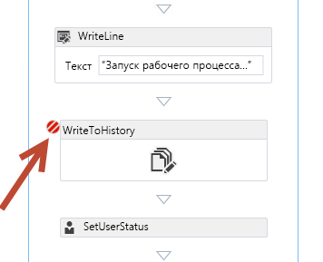
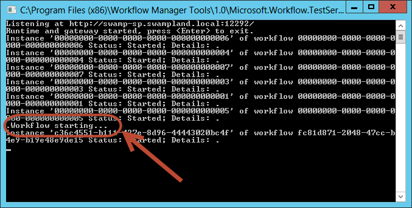
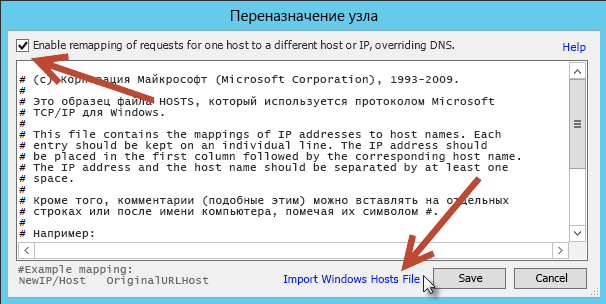
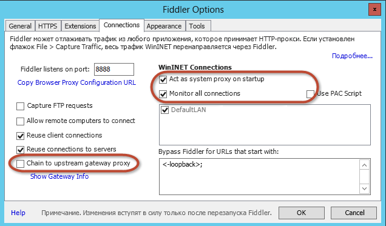
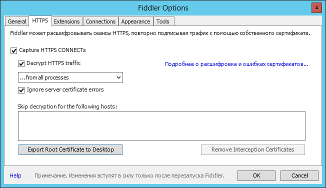
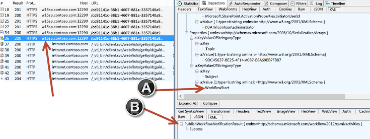
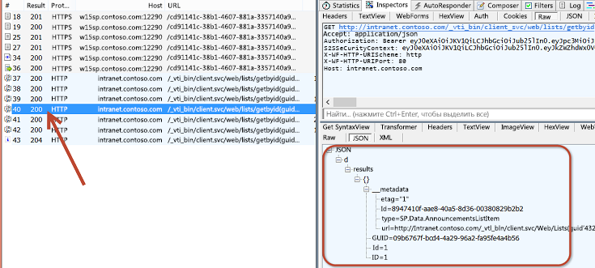
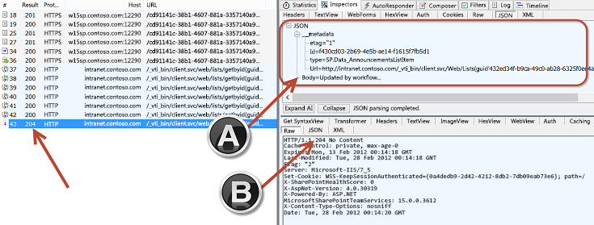

# Отладка рабочих процессов SharePoint Server 2013
В этой статье описываются обработка рабочих процессов SharePoint Server 2013 и управление ими в Workflow Manager 1.0, а также способы отладки.
 **Автор:** [Эндрю Коннелл (Andrew Connell)](http://social.msdn.microsoft.com/profile/andrew%20connell%20%5bmvp%5d/),  [www.AndrewConnell.com](http://www.andrewconnell.com)
  
    
    


## 

В SharePoint Server 2013 корпорация Майкрософт изменила подход к рабочим процессам. В сотрудничестве с командой Azure команда рабочих процессов создала новый продукт под названием Workflow Manager. В Workflow Manager размещены последняя версия среды выполнения Windows Workflow Foundation и все необходимые службы (они имеют высокий уровень доступности и масштабируемости). Производительность и масштабируемость обеспечивает служебная шина Microsoft Azure. Этот диспетчер работает абсолютно одинаково в локальном развертывании и облаке, подобно Office 365. После подключения и настройки SharePoint 2013 выполнение всех рабочих процессов и сопутствующие задачи передаются в ферму Workflow Manager.
  
    
    
Для этого изменения архитектуры потребовалось изменить два основных средства разработки рабочих процессов (SharePoint Designer 2013 и Visual Studio 2012), используемых клиентами. Однако способы отладки, используемые разработчиками в SharePoint 2007 и SharePoint 2010, по-прежнему применимы. В новой архитектуре добавлен способ отладки для рабочих процессов, созданных с помощью SharePoint Designer 2013 или Visual Studio 2012, позволяющий для отслеживать трафик между SharePoint Server 2013 и Workflow Manager с помощью Fiddler.
  
    
    

## Обзор отладки рабочих процессов SharePoint 2013

Отладка пользовательских рабочих процессов SharePoint Server 2013 похожа на отладку рабочих процессов предыдущих версий, в том числе SharePoint 2010 и SharePoint 2007. Доступные способы отладки зависят от того, какое средство используется для создания рабочего процесса (SharePoint Designer 2013 или Visual Studio 2012), и типа развертывания SharePoint, например локального или Office 365 (размещаемого).
  
    
    
Разработчики рабочих процессов могут использовать четыре способа отладки:
  
    
    

- запись в журнал рабочего процесса;
    
  
- настройка точек останова;
    
  
- отправка сообщений отладки в консоль;
    
  
- мониторинг трафика между SharePoint и Workflow Manager с помощью Fiddler.
    
  
У каждого способа есть свои преимущества и недостатки. Полезно иметь представление о возможностях двух средств разработки рабочих процессов (SharePoint Designer 2013 или Visual Studio 2012), а также типе развертывания рабочих процессов (локальное или в Office 365). В таблице ниже представлена матрица средств разработки, целей развертывания и способов, доступных в каждом сценарии.
  
    
    


||**Локальное развертывание SharePoint 2013**|**SharePoint Online в Office 365**|
|:-----|:-----|:-----|
|SharePoint Designer 2013, SharePoint Online  <br/> | Запись в журнал <br/>  Fiddler <br/> | Запись в журнал <br/> |
|Visual Studio 2012  <br/> | Запись в журнал <br/>  Точки останова <br/>  Сообщения отладки в консоли <br/>  Fiddler <br/> | Запись в журнал <br/>  Точки останова <br/> |
   

## Отладка с помощью журнала рабочего процесса

Единственный способ отладки, доступный в каждом типе развертывания SharePoint 2013, — запись сообщений в журнал рабочего процесса. Добавить строковое сообщение в список, который указан в сопоставлении рабочего процесса и является контейнером для всех сообщений журнала, можно с помощью действия **Записать в журнал** в SharePoint Designer 2013 или операции **WriteToHistory** в Visual Studio 2012. Эти строки могут быть простыми или составленными путем объединения значений переменных в рабочем процессе.
  
    
    
Отладка с помощью списка журнала не является идеальным решением, так как пользователям доступны сообщения. Поэтому после сеанса отладки и развертывания рабочего процесса в рабочей среде разработчик должен удалять эти сообщения, что создает дополнительный этап между отладкой и развертыванием. Тем не менее это единственный вариант, доступный в любом сценарии, независимо от средства, которое используется для создания рабочего процесса, и типа развертывания SharePoint 2013.
  
    
    

## Отладка с помощью точек останова Visual Studio 2012

Еще один способ отладки — использование точек останова. Точки останова доступны только для рабочих процессов, созданных с помощью Visual Studio 2012, так как в SharePoint Designer 2013 невозможно создавать точки останова и подключать отладчик к запущенному процессу. Эти функции доступны в локальных развертываниях SharePoint 2013 и размещаемых развертываниях, например Office 365. В этом сценарии можно задать точку останова для операции в рабочем процессе, а затем запустить процесс в режиме отладки.
  
    
    

**Рисунок 1. Запуск рабочего процесса**

  
    
    

  
    
    

  
    
    
Visual Studio развернет рабочий процесс в целевой среде SharePoint и подключит отладчик. Когда рабочий процесс достигает операции, для которой задана точка останова, фокус переключается на Visual Studio, после чего вы можете изучить значения переменных рабочего процесса и поочередно выполнить все операции из Visual Studio 2012, как показано на рисунке ниже.
  
    
    

**Рис. 2. Точка останова рабочего процесса**

  
    
    

  
    
    

  
    
    

  
    
    

  
    
    

## Отладка рабочих процессов с помощью сообщений отладки и узла тестовой службы

После интеграции SharePoint 2013 с Workflow Manager появились два новых способа отладки, доступные при создании рабочих процессов с помощью Visual Studio 2012 и их тестировании в локальном развертывании. Visual Studio 2012 включает операцию **WriteLine**, которая принимает в качестве входного параметра одно строковое сообщение.
  
    
    

**Рис. 3. Операция WriteLine**

  
    
    

  
    
    

  
    
    
Эта операция записывает сообщение подобно методу **System.Diagnostics.Debug.WriteLine()** в стандартном консольном приложении .NET для Windows. Средство разработки Workflow Manager 1.0 включает служебную программу консоли **Узел тестовой службы**, которую Visual Studio 2012 открывает при запуске нового сеанса отладки и тестировании в локальном развертывании SharePoint 2013. Эта служебная программа, **Microsoft.Workflow.TestServiceHost.exe** в **C:\\Program Files (x86)\\Workflow Manager Tools\\1.0**, подключается к зарегистрированному экземпляру Workflow Manager и отслеживает сообщения, записанные с помощью операции **WriteLine**, как показано на рисунке ниже.
  
    
    

**Рис. 4. Сообщения для операции WriteLine**

  
    
    

  
    
    

  
    
    
Эти сообщения похожи на комментарии к коду и сообщения отладки в консольном приложении. В отличие от записи в журнал рабочего процесса, эти сообщения не требуется удалять перед развертыванием в рабочей среде. Если служебная программа **Узел тестовой службы** не подключена к Workflow Manager, эти сообщения безопасны.
  
    
    
Этот способ отладки недоступен для рабочих процессов, созданных с помощью SharePoint Designer 2013, так как ни одно действие не соответствует операции **WriteLine**. К сожалению, этот способ отладки доступен только в локальных установках SharePoint 2013, так как порт, используемый служебной программой "Узел тестовой службы" обычно недоступен за пределами локальной сети. Это также касается Office 365. Для подключения к Workflow Manager SharePoint использует те же порты, что и узел тестовой службы. Эти порты доступны только в доверенной сети. Однако это не означает, что вам необходимо изменять их рабочие процессы, что удалить операции **WriteLine** перед развертыванием Office 365. Их можно оставить в рабочем процессе, так как они не отображаются, если **узел тестовой службы** не подключен к Workflow Manager.
  
    
    

## Отладка с помощью Fiddler для отслеживания трафика HTTP

Последний способ отладки рабочих процессов SharePoint Server 2013 появился в результате изменения способа обработки рабочих процессов в текущей платформе. Как вы уже знаете, в SharePoint Server 2013 обработка всех рабочих процессов передается внешнему продукту — Workflow Manager 1.0. Когда рабочему процессу необходимо взаимодействовать с SharePoint, например для обновления текущего состояния рабочего процесса, сбора данных элементов или пользователей на сайте SharePoint или работы с задачами, Workflow Manager использует REST API SharePoint 2013 для выполнения этих операций. SharePoint взаимодействует с Workflow Manager с помощью клиентской библиотеки, которая служит прокси-сервером для служб REST, предоставляемых Workflow Manager. Как SharePoint 2013, так и Workflow Manager взаимодействуют друг с другом с помощью стандартных протоколов HTTP и HTTPS.
  
    
    
В этой архитектуре представлен новый способ отладки для разработчиков рабочих процессов. С помощью Fiddler, прокси-отладчика для HTTP, вы можете отслеживать все запросы и соответствующие ответы между двумя продуктами. Кроме того, с помощью Fiddler можно отслеживать и проверять все пользовательские службы, вызываемые пользовательскими рабочими процессами с помощью операции **HttpSend** в Visual Studio 2012 или соответствующего действия **Call HTTP Web Service** в SharePoint Designer 2013. Эта модель отладки также доступна независимо от средства, которое используется для создания рабочих процессов (SharePoint Designer 2013 или Visual Studio 2012).
  
    
    
Этот способ недоступен только при тестировании рабочих процессов с помощью развертывания SharePoint 2013 в Office 365. Так как все взаимодействия между SharePoint Server 2013 и Workflow Manager выполняются на стороне сервера, невозможно подключиться к одному из серверов в Office 365 и запустить Fiddler из консоли.
  
    
    
При использовании этого нового способа вам доступны все данные об обработчике рабочих процессов, что было невозможно при разработке рабочих процессов в предыдущих версиях SharePoint до SharePoint Server 2013. 
  
    
    
Например, при вызове веб-службы вам доступны необработанные ответы Workflow Manager или SharePoint Server 2013. Иногда ответом Workflow Manager может быть сообщение об ошибке. SharePoint Server 2013 включает понятные сообщения об ошибках, но они могут быть недостаточно подробными. С помощью Fiddler вы можете просмотреть подробное сообщение об ошибке, чтобы устранить проблему. 
  
    
    
Кроме того, вы можете просмотреть ответ, полученный после успешного вызова веб-службы. При работе с веб-службами в рабочих процессах (независимо от средства разработки) необходимо знать точное имя свойства (и путь, если это комплексный ответ) для значения, включенного в ответ. С помощью Fiddler вы можете просмотреть полные данные об ответе.
  
    
    

### Общие сведения о SharePoint и диспетчере Workflow Manager для отладки с помощью Fiddler

Перед отладкой рабочих процессов в SharePoint 2013 и Workflow Manager 1.0 с помощью Fiddler необходимо выполнить некоторые действия по настройке в среде разработки. Прежде чем выполнять эти действия, полезно получить представление о принципе работы Fiddler и особенностях рабочих процессов в SharePoint 2013.
  
    
    

#### Fiddler может проверять только трафик с локального сервера

Fiddler может перехватывать и проверять только запросы с локального сервера, на котором он запущен. Это может вызвать проблему при использовании Fiddler в качестве отладчика рабочих процессов SharePoint Server 2013. 
  
    
    
Если SharePoint Server 2013 и Workflow Manager 1.0 установлены на разных серверах, а Fiddler запущен на сервере SharePoint Server, то в Fiddler будет отображаться только трафик из SharePoint. Исходящий трафик из Workflow Manager 1.0, даже если он предназначен для SharePoint Server, не будет перехватываться.
  
    
    
Таким образом, отлаживать рабочие процессы проще, если SharePoint Server 2013 и Workflow Manager 1.0 установлены на одном сервере. Обратите внимание, что это не обязательно. Вы можете запускать Fiddler на серверах SharePoint Server и Workflow Manager, но отслеживать два экземпляра на двух серверах для одного рабочего процесса будет сложнее.
  
    
    

#### Fiddler может проверять только трафик от текущего пользователя

 Fiddler может перехватывать и проверять только трафик от текущего пользователя. Чтобы просмотреть трафик из SharePoint, необходимо войти в SharePoint Server с помощью учетной записи Windows, настроенной в качестве удостоверения пула приложений, в котором размещается веб-приложение для сайта SharePoint, который запускает рабочий процесс.
  
    
    
Это также касается Workflow Manager. Чтобы перехватывать и проверять трафик из Workflow Manager, необходимо войти на сервер с помощью удостоверения Windows, настроенного во время подготовки фермы Workflow Manager в качестве учетной записи службы для Workflow Manager.
  
    
    
Отлаживать рабочие процессы с помощью Fiddler проще, если Workflow Manager и SharePoint Server 2013 не только установлены и настроены на одном сервере, но и используют одно удостоверение Windows в качестве учетной записи службы. В этом случае Fiddler сможет перехватывать и проверять весь трафик из Workflow Manager и SharePoint Server 2013.
  
    
    

#### Сервер SharePoint должен доверять сертификату Fiddler

Чтобы использовать Fiddler для отладки рабочих процессов SharePoint Server 2013, необходимо понимать, как обрабатывается зашифрованный трафик. Зашифрованный трафик по протоколу HTTP, также известный как HTTPS, реализуется путем шифрования данных с помощью закрытого ключа сертификата и отправки их получателю. У получателя есть открытый ключ сертификата, связанный с закрытым ключом. Получив запрос, он может проверить отправителя, так как подпись зашифрованного содержимого совпадает с открытым ключом, только если оно было зашифровано с помощью закрытого ключа сертификата.
  
    
    
Fiddler может перехватывать трафик HTTPS и расшифровывать его, представляя в понятном для пользователя формате. После отображения запроса Fiddler использует собственный сертификат для повторного шифрования трафика и его отправки получателю. Тем не менее это может вызвать проблему, так как теперь получатель получил исходный ответ, незащищенный с помощью сертификата исходного отправителя. Это может вызывать проблему при отладке рабочих процессов SharePoint, так как SharePoint не доверяет сертификату Fiddler. Следовательно, чтобы использовать Fiddler для перехвата и проверки трафика HTTPS между SharePoint Server 2013 и Workflow Manager, сервер SharePoint должен доверять сертификату Fiddler.
  
    
    

### Настройка SharePoint Server 2013 и Workflow Manager 1.0 для отладки рабочих процессов с помощью Fiddler

В следующих разделах показано, как настроить Fiddler и SharePoint для отладки рабочих процессов.
  
    
    

#### Настройка конфигурации прокси-сервера .NET Framework по умолчанию

Для начала необходимо определить конфигурацию прокси-сервера по умолчанию для .NET Framework. Эти изменения позволят Fiddler перехватывать трафик как из SharePoint Server 2013, так и из Workflow Manager. Откройте файл **machine.config** в каждом из следующих расположений:
  
    
    

-  `%systemdrive%\\Windows\\Microsoft.NET\\Framework\\v4.0.30319\\Config\\machine.config`
    
  
-  `%systemdrive%\\Windows\\Microsoft.NET\\Framework64\\v4.0.30319\\Config\\machine.config`
    
  
Затем добавьте следующую разметку в конец каждого файла, непосредственно перед закрывающим элементом **<configuration>**:
  
    
    


```

<system.net>
  <defaultProxy enabled="true">
    <proxy bypassonlocal="false" usesystemdefault="true" />
  </defaultProxy>
</system.net>
```

Сохраните изменения и закройте файлы.
  
    
    

#### Настройка перехвата и проверки трафика HTTPS в Fiddler

Далее необходимо настроить перехват зашифрованного трафика и его расшифровку для настройки.
  
    
    

1. Запустите Fiddler.
    
  
2. Если используется локальный файл HOSTS, убедитесь, что записи включены в Fiddler, выбрав в меню команду **Tools -> HOSTS** (Сервис -> УЗЛЫ).
    
  
3. Установите флажок **Enable remapping of requests for one host to a different host or IP, overriding DNS** (Разрешить переназначение запросов одного узла запросам другого узла или IP-адреса в обход DNS).
    
  
4. Нажмите ссылку **Import Windows Hosts File** (Импортировать файл узлов Windows), а затем кнопку **Save** (Сохранить).
    
  

**Рис. 5. Переназначение узла**

  
    
    

  
    
    

  
    
    
Затем настройте подключение Fiddler. 
  
    
    

  
    
    

1. Выберите в меню команду **Tools -> Fiddler Options** (Сервис -> Параметры Fiddler).
    
  
2. Откройте вкладку **Connections** (Подключения).
    
  
3. Снимите флажок **Chain to upstream gateway proxy** (Подключаться к вышестоящему прокси-серверу шлюза).
    
  
4. Установите флажки **Act as system proxy on startup** (Выполнять роль системного прокси-сервера при запуске) и **Monitor all connections** (Отслеживать все подключения), как показано на рисунке ниже.
    
   **Рис. 6. Параметры подключения Fiddler.**

  


  

  

  
5. В диалоговом окне **Fiddler Options** (Параметры Fiddler) откройте вкладку **HTTPS**.
    
  
6. Установите флажок **Capture HTTPS CONNECTs** (Захватывать подключения HTTPS).
    
  
7. Установите флажок **Decrypt HTTPS Traffic** (Расшифровывать трафик HTTPS).
    
  
8. Выберите значение **… from all processes** (...от всех процессов).
    
  
9. Установите флажок **Ignore server certificate errors** (Игнорировать ошибки сертификатов).
    
  
10. Нажмите кнопку **Export Root Certificate to Desktop** (Экспортировать корневой сертификат на рабочий стол).
    
  
11. Когда появится предупреждение, нажмите кнопку **Yes** (Да), чтобы **доверять корневому сертификату Fiddler**.
    
  
Вы настроили доверие Windows (не SharePoint) к сертификату.
  
    
    

**Рис. 7. Вкладка "HTTPS"**

  
    
    

  
    
    

  
    
    
 **Примечание**. Если появится предупреждение системы безопасности с указанием не доверять сертификату Fiddler, нажмите кнопку **Yes** (Да), чтобы продолжить установку сертификата.
  
    
    

#### Настройка доверия SharePoint к сертификату

Вам осталось лишь настроить доверие SharePoint к сертификату Fiddler, экспортированному на предыдущем этапе. 
  
    
    

1. Войдите от имени администратора фермы SharePoint.
    
  
2. Запустите командную консоль SharePoint 2013.
    
  
3. Загрузите оснастку SharePoint 2013.
    
  ```
  
PS C:\\> Add-PSSnapIn Microsoft.SharePoint.PowerShell
  ```

4. Установите сертификат Fiddler с помощью служебной программы.
    
  ```
  PS C:\\> $fidderCertificatePath = [full path to exported FiddlerRoot.cer certificate file]
PS C:\\> certutil.exe -addstore -enterprise -f -v root $fidderCertificatePath
PS C:\\> $fiddlerCertificate = Get-PfxCertificate -FilePath $fidderCertificatePath
PS C:\\> New-SPTrustedRootAuthority -Name "Fiddler" -Certificate $fiddlerCertificate

  ```

5. Запустите команду IISRESET, чтобы убедиться, что состояние доверия SharePoint к сертификату изменилось.
    
  

### Пошаговое руководство. Отладка рабочего процесса SharePoint 2013 с помощью Fiddler

В этом простом пошаговом руководстве показано, как использовать Fiddler для отладки рабочего процесса SharePoint Server 2013, созданного с помощью Visual Studio 2012. При запуске рабочий процесс получает идентификатор пользователя из поля настраиваемого списка. Запрос с этим идентификатором отправляется в общедоступную службу для получения дополнительных сведений о пользователе. Затем эти значения используются для обновления исходного элемента списка. Рабочий процесс можно найти в следующем примере кода MSDN:  [SharePoint 2013 Workflow: Call an External Web Service](http://code.msdn.microsoft.com/officeapps/SharePoint-2013-workflow-48ea87d4.aspx).
  
    
    
Ниже приведены условия использования этого пошагового руководства:
  
    
    

- SharePoint Server 2013 и Workflow Manager 1.0 установлены на одном сервере.
    
  
- Удостоверение Windows **CONTOSO\\SP_Content** настроено для удостоверения пула приложений, в котором размещается веб-приложение, обслуживающее сайт SharePoint, который запускает рабочий процесс.
    
  
- Для запуска рабочего процесса используется сайт SharePoint Server 2013 **http://intranet.contoso.com**.
    
  
- Конечная точка фермы Workflow Manager 1.0 — **w15sp.contoso.com**.
    
  
- В SharePoint Server 2013 и Workflow Manager 1.0 разрешена авторизация OAuth через HTTP.
    
    > **Внимание!**
      > Она никогда не используется на рабочем сервере (только для тестирования и отладки). 

1. Войдите на сервер, на котором установлены Workflow Manager и SharePoint 2013 с удостоверением Windows, настроенным в качестве учетной записи фермы Workflow Manager 1.0 и удостоверения пула приложений SharePoint 2013.
    
  
2. Запустите Fiddler. Теперь он будет перехватывать трафик от текущего пользователя, но он может пропускать уже запущенные подключения или процессы. Чтобы Fiddler перехватывал трафик между Workflow Manager и SharePoint Server, перезапустите SharePoint (с помощью команды IISRESET) и Workflow Manager (остановив и заново запустив службу Windows **Workflow Manager Backend**). Для этого выполните указанные ниже команды в административной командной строке.
    
  ```
  
PS C:\\> IISRESET
PS C:\\> net stop WorkflowServiceBackend
PS C:\\> net start WorkflowServiceBackend

  ```

3. Запустите рабочий процесс.
    
  
Обратите внимание, что на приведенном ниже рисунке сеансы 18-36 созданы в SharePoint 2013, а сеансы 37-43 — в Workflow Manager.
  
    
    

**Рис. 8. Запуск рабочего процесса**

  
    
    

  
    
    

  
    
    
Обратите внимание, что в сеансе 36 SharePoint Server 2013 отправляет Workflow Manager запрос на запуск рабочего процесса (отмечено буквой [A] на рисунке), а Workflow Manager отвечает (отмечено буквой [B] на рисунке) сообщением Success:
  
    
    

**Рис 9. Ответ Success**

  
    
    

  
    
    

  
    
    
Во время сеанса 40 Workflow Manager получает код и GUID элемента списка из SharePoint.
  
    
    

**Рис. 10. Получение кода и GUID элемента**

  
    
    

  
    
    

  
    
    
Во время сеанса 43 Workflow Manager изменяет значение поля **Body** в элементе списка SharePoint, передавая объект Нотация объектов JavaScript (JSON) (отмечено буквой [A] на рисунке) в качестве полезной нагрузки. SharePoint отвечает кодом состояния HTTP 204, который означает, что запрос успешно обработан, но в ответе нет сообщения.
  
    
    

**Рис. 11. Обновление элемента списка**

  
    
    

  
    
    

  
    
    

  
    
    

  
    
    

## Заключение

В выпуске SharePoint Server 2013 появился новый слой абстрагирования рабочих процессов — Workflow Manager 1.0. В этой новой архитектуре изменился способ обработки рабочих процессов. Теперь для обработки рабочих процессов SharePoint Server 2013 и управления ими используется Workflow Manager 1.0.
  
    
    
При создании приложений и бизнес-процессов в рабочих процессах необходимо выполнять отладку. В новой архитектуре рабочих процессов SharePoint Server 2013 представлены те же способы отладки, что и в предыдущих версиях SharePoint. Кроме того, в ней представлены два новых способа, доступных при создании рабочих процессов с помощью новой архитектуры. В этой статье мы рассмотрели как старые, так и новые способы отладки с помощью операции **WriteLine**, а также перехват и проверку трафика между SharePoint Server 2013 и Workflow Manager 1.0 с помощью Fiddler.
  
    
    

## Дополнительные ресурсы
<a name="bk_addresources"> </a>


-  [Fiddler](http://fiddler2.com/home)
    
  

  
    
    

