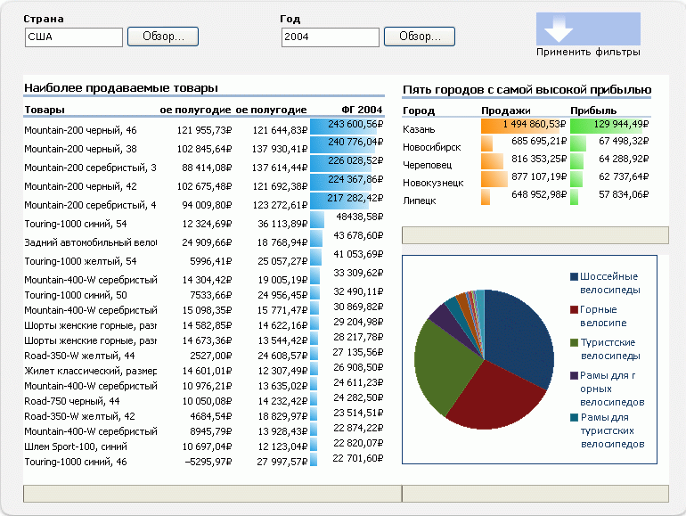
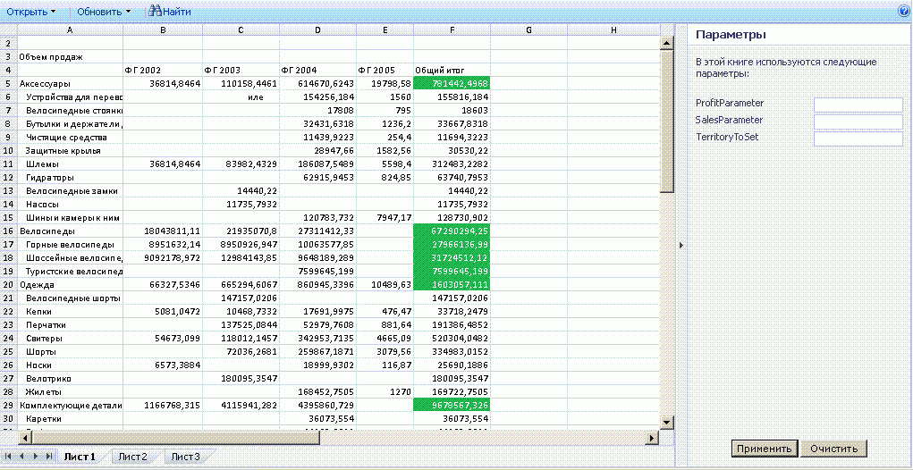

# Общие сведения о службах Excel

Службы Excel — это приложение службы, позволяющее загружать, вычислять и отображать книги Microsoft Excel в Microsoft SharePoint 2013. Службы Excel впервые представлено в Microsoft Office SharePoint Server 2007.
  
    
    

С помощью Службы Excel можно повторно и совместно использовать книги Excel на порталах и панелях мониторинга SharePoint 2013. Например, финансовые аналитики, бизнес-планировщики или инженеры могут создавать содержимое в Excel и предоставлять его для общего доступа с помощью портала и панели мониторинга SharePoint 2013 без написания пользовательского кода. Можно управлять отображением данных и поддерживать единую версию книги Excel. 
Есть четыре основных интерфейса для Службы Excel: 
  
    
    

- Веб-часть Веб-клиент Excel, позволяющая просматривать динамическую книгу с помощью браузера и взаимодействовать с ней 
    
  
- Веб-службы Excel для программного доступа.
    
  
- Объектная модель ECMAScript (JavaScript, JScript) для автоматизации и настройки, контроля элемента управления Веб-клиент Excel, помощи в создании более удобных интегрированных решений, а также для предоставления пользовательских функций для расширения возможностей объектной модели ECMAScript (JavaScript, JScript).
    
  
- API-интерфейс REST (Representational State Transfer) для прямого доступа к частям книги по URL-адресу.
    
  

> **Примечание**
> Функция интерактивного представления Excel отключена. Сведения об удалении этой функции на вашем веб-сайта см. в статье  [Удаление интерактивное представление Excel из веб-страницы](removing-excel-interactive-view-from-a-webpage.md). 
  
    
    

Также можно расширить Службы вычислений Excel с помощью пользовательских функций (UDF).
> **Примечание**
> Дополнительные сведения о Службы вычислений Excel см. в статье  [Архитектура служб Excel](excel-services-architecture.md). 
  
    
    

С помощью Службы Excel можно просматривать интерактивные книги с помощью только браузера. Это означает, что можно сохранять книги Excel и взаимодействовать с ними из сайтов портала.Также можно взаимодействовать с данными на основе Excel путем сортировки, фильтрации, развертывания или свертывания сводных таблиц, а также передачи в них параметров; это предоставляет возможность выполнения анализа опубликованных книг. Можно взаимодействовать с книгой без изменения опубликованной книги, что ценно для авторов и потребителей отчетов.Службы Excel поддерживает книги, подключенные к внешним источникам данных. Можно внедрять строки подключения к внешним источникам данных в книгу или сохранять их централизованно в файле библиотеки подключений к данным.Также можно делать выбранные ячейки на листах редактируемыми, делая их именованными диапазонами (параметрами). Элементы, выбранные для отображения, при сохранении в Службы Excel отображаются в области **Параметры** в Веб-клиент Excel. Значения этих именованных диапазонов можно изменять в области **Параметры** и обновлять книгу. Также можно использовать веб-часть фильтра портала для фильтрации сразу нескольких веб-частей (Веб-клиент Excel и других типов веб-частей).Однако невозможно использовать Службы Excel для создания новых книг или редактирования существующих. Чтобы создать книгу для использования с Службы Excel, можно использовать Microsoft Excel 2013.
> **Примечание**
> Microsoft Excel Online, часть Office Online, также поддерживает книги Excel в браузере. Дополнительные сведения о Excel Online см. в статье  [Краткие руководства по началу работы с новым набором Office](http://office.microsoft.com/ru-ru/support/getting-started-with-office-2013-FX102809998.aspx). 
  
    
    

Для Службы Excel также есть веб-служба. Можно использовать Веб-службы Excel для загрузки книг, задания значений в ячейках и диапазонах, обновления подключений к внешним данным, вычисления данных на листах и извлечения вычисленных результатов (включая значения ячеек, вычисленные данные книги целиком или снимок книги). В SharePoint 2013 также можно выполнять сохранение (в том числе копий) и участвовать в сеансах совместного редактирования при помощи Веб-службы Excel.
> **Примечание**
> Дополнительные сведения о снимках см. в статье  [How to: Get an Entire Workbook or a Snapshot](how-to-get-an-entire-workbook-or-a-snapshot.md). 
  
    
    

Службы Excel поддерживает UDF, которые можно использовать для расширения возможностей Службы вычислений Excel — например, для реализации настраиваемых библиотек вычисления или для чтения данных из веб-служб и источников данных, не поддерживаемых Службы Excel.Службы Excel разработан как масштабируемый, надежный сервер корпоративного класса, предоставляющий функции и точность вычислений Excel.
## Сценарии и функции

Службы Excel поддерживает множество различных сценариев и функций, некоторые из которых описаны в этом разделе. 
  
    
    

### Портал бизнес аналитики и анализ книги

Портал бизнес-аналитики отображает системы показателей и отчеты, а также позволяет пользователям просматривать данные при помощи только браузера. Функция **Центр бизнес-аналитики** в SharePoint Server включает в себя функциональность портала бизнес-аналитики и панели мониторинга. На рис. 1 показана панель мониторинга центра отчетов с уже настроенными библиотекой отчетов, диаграммой и ключевыми индикаторами производительности.
  
    
    
Службы Excel также позволяет вычислять данные на сервере. Службы Excel участвует в **Центре бизнес-аналитики**, предоставляя возможность вычисления и предоставления контента на основе Excel на интегрированных панелях мониторинга бизнес-аналитики. Можно отобразить книгу Excel с помощью веб-части Веб-клиент Excel, подключиться к внешнему источнику данных и взаимодействовать с данными в книге. 
  
    
    
 На рисунке 1 показана панель мониторинга с веб-частью фильтра и книгами Excel, отображаемыми при помощи веб-частей Веб-клиент Excel.
  
    
    

**Рисунок 1. Панель мониторинга с фильтром и контентом Excel**

  
    
    

  
    
    

  
    
    
Помимо участия в интегрированных панелях мониторинга, Службы Excel также можно использовать для отображения всех или части книг Excel для предоставления пользователям возможности взаимодействия с их контентом в знакомом пользовательском интерфейсе Excel. На рисунке 2 показан отображаемый диапазон и ячейки, предоставляемые для ввода пользователем через параметры. Обозначение определенных ячеек как параметров позволяет пользователям изменять значения в этих ячейках на листе с помощью полей редактирования в правой области. Затем Службы Excel повторно вычисляет лист на основе новых значений.
  
    
    
Если требуется использовать определение функциональные возможности в Excel или анализировать книгу с использованием всех функциональных возможностей Excel, можно открыть книгу в Excel, нажав кнопку **Открыть в Excel**. Также можно открыть книгу в Excel для ее печати и для работы в автономном режиме.
  
    
    

    
> **Примечание**
> Чтобы открыть книгу с помощью команды **Открыть в Excel**, необходимо иметь права на открытие. Дополнительные сведения см. в следующем разделе, **Управление книгами**, а также в статье, посвященной  [разрешениям пользователей и уровням разрешений](http://technet.microsoft.com/ru-ru/library/cc721640%28office.14%29.aspx) на сайте [TechNet](http://technet.microsoft.com/ru-ru/library/cc263215%28office.14%29.aspx). Пользователи, не имеющие прав на открытие, могут открыть снимок в Excel. 
  
    
    

**Рис. 2. Использование области "Параметры"**

  
    
    

  
    
    

  
    
    
Также можно анализировать, сводить данные и взаимодействовать с ними при помощи Веб-клиент Excel.
  
    
    
Дополнительные сведения о Службы Excel и возможности бизнес-аналитики в SharePoint 2013 см. в документации по бизнес-аналитике в справке SharePoint Server. 
  
    
    

### Управление книгами

Возможности управления книгами и их блокировки в Службы Excel позволяют:
  
    
    

- Сохранять только одну копию книги, которая создается и изменяется доверенным автором в централизованном, безопасном расположении, вместо хранения нескольких копий на компьютере каждого пользователя. Правильную версию листа проще найти, предоставить для общего доступа и использовать в Excel, SharePoint и других приложениях. 
    
  
- Обеспечивать безопасность и защиту моделей книг и внутренних данных. Можно предоставить пользователям права только на просмотр, чтобы ограничить доступ к книге. Например, можно запретить пользователям открывать книгу в Excel или ограничить их возможности просмотра книги. Пользователи могут иметь доступ к контенту книги, открытому автором для общего доступа, через браузер, но не иметь возможности открыть книгу в клиенте Excel, просматривать формулы, вспомогательный контент или другую интеллектуальную собственность, которая может содержаться в книге. 
    
  
- Создание снимков книги.
    
  
Приложение Службы Excel оптимизировано для большого числа пользователей и книг. Также оно может помогать при балансировке вычислительной нагрузки в ферме серверов.
  
    
    
Дополнительные сведения об управлении книгами с помощью Службы Excel см. в документации по SharePoint Server на сайте  [TechNet](http://technet.microsoft.com/ru-ru/library/ee424405%28office.14%29.aspx) или в справке SharePoint Server.
  
    
    

### Программный доступ с помощью настраиваемых приложений .NET

Можно создавать настраиваемые приложения — например, приложения ASP.NET, — которые:
  
    
    

- Вызывают Веб-службы Excel для доступа, параметризации и вычисления книг.
    
  
- Открывают, обновляют внешние данные, задают ячейки или диапазоны, повторно вычисляют, участвуют в сеансах совместного редактирования с другими приложениями или пользователя, сохраняют, а также сохраняют с изменением имени или формата. 
    
  
- Используют настраиваемые потоки операций для планирования операций вычисления или отправки уведомления по электронной почте. (Для этого используются возможности SharePoint, не собственная часть Службы Excel.)
    
  

### Пользовательские функции (UDF)

Кроме того, можно использовать пользовательские функции Службы Excel, позволяющие с помощью формул в ячейках вызывать настраиваемые функции, написанные в управляемом коде и развернутые в SharePoint Server.
  
    
    
Дополнительные сведения о пользовательских функциях в Службы Excel см. в статье  [Understanding Excel Services UDFs](understanding-excel-services-udfs.md).
  
    
    

### ECMAScript (JavaScript, JScript)

Также можно использовать объектную модель JavaScript в Службы Excel для автоматизации, настройки элемент управления веб-части Веб-клиент Excel и управления им. Можно использовать объектную модель JavaScript для построения более удобных и интегрированных решений.
  
    
    

### Пользовательские функции JavaScript (UDF)

Появившиеся в Службы Microsoft Excel и Microsoft SharePoint 2013 новые пользовательские функции ECMAScript (JavaScript, JScript) позволяют добавлять настраиваемые функции в Excel при использовании внедренных книг Excel с OneDrive или веб-части Веб-клиент ExcelВеб-клиент Excel в SharePoint. Кроме встроенных функций, используемых в Excel, вы можете добавить собственные настраиваемые функции с помощью пользовательских функций JavaScript, которые можно вызвать из внутренних формул в .
  
    
    
Пользовательские функции JavaScript похожи на  [пользовательские функции](http://msdn.microsoft.com/ru-ru/library/ms499792.aspx), которые вы можете создать для Microsoft Excel. Разница состоит в том, что пользовательские функции JavaScript используются только в книгах, внедренных в веб-страницу, и существуют только на этой веб-странице.
  
    
    

### Объектная модель JavaScript

API JSOM для Службы Excel теперь включает следующие функции:
  
    
    

- Возможность перезагрузить внедренную книгу. Теперь вы можете сбросить данные внедренной книги, вернув данные из файла базовой книги.
    
  
- Перемещаемые объекты, созданные пользователем. Для объекта EwaControl существуют новые методы добавления или удаления созданных вами перемещаемых объектов.
    
  
- Больший контроль над видимой областью элемента управления Ewa.
    
  
- Событие SheetChanged. Это событие возникает при каких-либо изменениях на листе, таких как обновление ячеек, удаление или очистка ячеек, копирование, вырезание и вставка диапазонов, отмена и повтор действия.
    
  
- Включение проверки данных. Теперь вы можете проверить данные, введенные пользователем.
    
  

### API-интерфейс REST

Можно использовать API-интерфейс REST в Службы Excel для прямого доступа к частям книги по URL-адресу. Механизмы обнаружения, встроенные в Службы Excel API-интерфейс REST, позволяют разработчиками и пользователям просматривать контент книги вручную или программно. 
  
    
    
Дополнительные сведения об API-интерфейсе REST Службы Excel см. в статье  [API-интерфейс REST служб Excel](excel-services-rest-api.md).
  
    
    

### ODATA REST

Новые функции Службы Microsoft Excel и Microsoft SharePoint 2013. С помощью новых возможностей OData в REST API для Службы Excel можно запрашивать таблицы в книгах Excel в качестве OData. Например, для запроса метаданных Excel о доступных ресурсах в книге SampleWorkbook.xlsx с помощью вызова REST используйте приведенный ниже синтаксис.
  
    
    
http://<ServerName>/_vti_bin/ExcelRest.aspx/Docs/Documents/SampleWorkbook.xlsx/model Дополнительные сведения о REST API см. в статье 
  
    
    
 [REST API для служб Excel 2010](http://msdn.microsoft.com/ru-ru/library/ee556413.aspx) в документации пакета SDK для SharePoint 2013.
  
    
    
Чтобы запросить метаданные о доступных ресурсах в книге SampleWorkbook.xlsx с помощью OData, используйте тот же синтаксис REST, но заменив /Model на /Odata, как показано в приведенном ниже запросе. 
  
    
    
http://<ServerName>/_vti_bin/ExcelRest.aspx/Docs/Documents/sampleWorkbook.xlsx/OData
  
    
    
Здесь можно использовать системные параметры запроса OData для получения конкретных сведений о таблицах в книге.
  
    
    

## Дополнительные ресурсы

-  [Excel Services Development Roadmap](excel-services-development-roadmap.md)
    
  
-  [Архитектура служб Excel](excel-services-architecture.md)
    
  
-  [Общие сведения о пользовательских функций JavaScript](javascript-user-defined-functions-overview.md)
    
  
-  [С помощью OData с помощью служб Excel REST в SharePoint 2013](using-odata-with-excel-services-rest-in-sharepoint-2013.md)
    
  
-  [Пошаговое руководство. Разработка настраиваемого приложения с помощью веб-служб Excel](walkthrough-developing-a-custom-application-using-excel-web-services.md)
    
  
-  [Frequently Asked Questions About Excel Services UDFs](frequently-asked-questions-about-excel-services-udfs.md)
    
  
-  [Unsupported Features in Excel Services](http://msdn.microsoft.com/library/5868e672-4786-4fed-9168-07ff538f6f5c%28Office.15%29.aspx)
    
  
-  [Блоги, форумы и ресурсы для служб Excel](excel-services-blogs-forums-and-resources.md)
    
  

