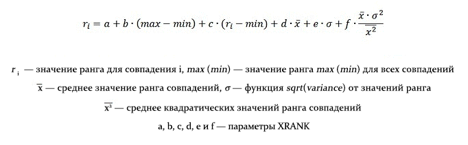

# справочник по синтаксису языка запросов FAST (FQL)
Узнайте о создании сложных поисковых запросов для Поиск в SharePoint 2013 с использованием языка FAST-запросов (FQL). В этом справочнике вы ознакомитесь с элементами FQL-запросов и узнаете, как использовать в них спецификации свойств, выражения с маркерами и операторы.
## Общие сведения о FQL, частях выражений и выражениях языка запросов в SharePoint Server 2013
<a name="SP15FQL_about"> </a>

Язык FAST-запросов (FQL) — это мощный язык запросов, который позволяет разработчикам выполнять точный поиск и сужать область поиска до значений, которые относятся к конкретному управляемого свойству или полнотекстовому индексу.
  
    
    
Выражение языка запросов может содержать вложенные части выражения, которые включают термины запроса, спецификации свойств и операторы, описанные в таблице 1.
  
    
    

**Таблица 1. Части выражений в выражениях языка запросов**


|**Элемент**|**Описание**|
|:-----|:-----|
|Выражения с маркерами  <br/> |Один или несколько поисковых терминов, фраз или числовых значений в запросе.  <br/> |
|Спецификация свойства  <br/> |Свойство или полнотекстовый индекс, соответствующий затрагиваемому выражению.  <br/> |
|Операторы  <br/> |Ключевые слова, определяющие логические операции (например, **AND**, **OR**) или другие ограничения для операндов (например, **FILTER**).  <br/> |
   

### Пример FQL-запроса

Следующий пример запроса FQL служит для поиска терминов "hello" и "world" в управляемом свойстве **body** индексированного элемента:
  
    
    
 `body:string("hello world", mode="and")`
  
    
    
В примере:
  
    
    

-  `body:` ограничивает область запроса текстом управляемого свойства в данном элементе.
    
  
-  `"hello world"` — операнд для оператора **STRING**, указывающий поисковые термины.
    
  
-  `mode="and"` указывает, что логический оператор запроса **AND** будет применен к `"hello world"`.
    
  
Длина FQL-запросов ограничена 2048 символами.
  
    
    

## Спецификация свойств в FQL
<a name="property_specification"> </a>

Спецификация свойств ограничивает область затрагиваемых выражений определенными областями индексированного содержимого. Эта область может быть определена полнотекстовым индексом или управляемым свойством. 
  
    
    
Управляемые свойства типа **Text** или **YesNo** считаются текстом. Все остальные типы управляемых свойств, в том числе тип **Datetime**, считаются числовыми значениями.
  
    
    
Если не включить спецификацию свойства для выражения, поисковая система будет использовать полнотекстовый индекс по умолчанию, определенный в схеме индекса.
  
    
    
После имени свойства всегда должно стоять двоеточие (оператор **In**), а числовые операторы всегда должны включать спецификацию свойства.
  
    
    
Спецификация свойства (оператор **In**) может быть применена к следующим сущностям запроса:
  
    
    

- Одиночному термину или фразе, как показано ниже:
    
     `author:shakespeare`
  
    
    
 `title:"to be or not to be"`
    
  
- Оператору, например **STRING**, как показано ниже:
    
  ```
  
title:string("to be or not to be")
  ```


    В этом случае спецификация свойства применяется ко всему выражению оператора.
    
  

### Примеры

Каждое из следующих выражений соответствует элементам, которые имеют в управляемом свойстве **title** оба слова: и "much", и "nothing".
  
    
    
 `title:and(much, nothing)`
  
    
    
 `and(title:much, title:nothing)`
  
    
    
 `title:string("much nothing", mode="and")`
  
    
    

## Выражения с маркерами в FQL
<a name="token_expressions"> </a>

Выражения с маркерами — это слова, фразы или числовые значения, которые сравниваются с индексом.
  
    
    
Текстовое выражение с маркером может быть одним словом или фразой, заключенной в двойные кавычки.
  
    
    
Числовое выражение с маркером может быть одним значением или диапазоном значений.
  
    
    

### Выражения с подстановочными знаками

Выражение с подстановочными знаками обозначает один термин или фразу, которая включает знак звездочки (" *****"); звездочка обозначает совпадение с любым количеством символов, кроме пробела. FQL поддерживает префиксный поиск отдельных текстовых управляемых свойств и полнотекстовых индексов.
  
    
    

#### Примеры выражений с подстановочными знаками

Ниже приведен список допустимых способов использования выражений с подстановочными знаками в FQL:
  
    
    

-  `text*`
    
  
-  `string("this examp*")`
    
  

### Выражения с числовыми терминами
<a name="fql_token_numeric"> </a>

Каждое выражение с числовым термином должно включать спецификацию свойства совместимого типа схемы индекса. В таблице 2 перечислены числовые типы данных, которые можно использовать в FQL. 
  
    
    

**Таблица 2. Числовые типы данных, которые можно использовать в FQL**


|**Тип FQL**|**Совместимые типы схем индекса**|**Описание**|
|:-----|:-----|:-----|
|**Int** <br/> |**Integer** <br/> |64-разрядное целое число.  <br/> |
|**Float** <br/> |**Double** <br/> |64-разрядное число с плавающей запятой двойной точности.  <br/> |
|**Decimal** <br/> |**Decimal** <br/> |128-разрядное десятичное число.  <br/> |
|**Datetime** <br/> |**Datetime** <br/> |Значение даты и времени.  <br/> За счет поддержки даты и времени в FQL над их значениями можно выполнять те же числовые операции, что и над другими числовыми значениями.  <br/> |
   

#### Выражения запросов даты и времени
<a name="fql_token_datetime"> </a>

Для даты и времени в FQL предусмотрен тип данных **datetime**.
  
    
    
В запросах поддерживаются следующие совместимые со стандартом ISO 8601 форматы **datetime**:
  
    
    

- YYYY-MM-DD 
    
  
- YYYY-MM-DDThh:mm:ss 
    
  
- YYYY-MM-DDThh:mm:ssZ 
    
  
- YYYY-MM-DDThh:mm:ssfrZ
    
  
В этих форматах **datetime**:
  
    
    

- Параметр  _YYYY_ задает год из четырех цифр.
    
    > **Примечание**
      > Поддерживается только формат года из четырех цифр. 
- Параметр  _MM_ задает месяц в формате двух цифр. Например, 01 — это январь.
    
  
- Параметр  _DD_ задает двузначное значение дня месяца (от 01 до 31).
    
  
-  _T_ — буква "T".
    
  
- Параметр  _hh_ обозначает часы в формате двух цифр (от 00 до 23). Обозначения a.m. и p.m. не допускаются.
    
  
- Параметр  _mm_ обозначает минуты в формате двух цифр (от 00 до 59).
    
  
- Параметр  _ss_ обозначает секунды в формате двух цифр (от 00 до 59).
    
  
- (необязательно)  _fr_ — доли секунды _ss_; от 1 до 7 цифр после разделителя **.**. Например, 2012-09-27T11:57:34.1234567.
    
  
Все значения даты и времени необходимо указывать в часовом поясе UTC (другое название — GMT). Идентификатор часового пояса UTC (символ "Z" в конце) указывать необязательно.
  
    
    

### Зарезервированные слова, специальные символы и преобразование
<a name="fql_token_numeric"> </a>

В FQL зарезервированы следующие слова:
  
    
    
 `and, or, any, andnot, count, decimal, rank, near, onear, int, in32, int64, float, double, datetime, max, min, range, phrase, scope, filter, not, string, starts-with, ends-with, equals, words, xrank.`
  
    
    
Чтобы представить любое из этих слов в виде терминов в выражении запроса, их необходимо заключить в двойные кавычки, как показано в следующих примерах: 
  
    
    

-  `or("any", "and", "xrank")`
    
  
-  `string("any and xrank", mode="OR")`
    
  
-  `phrase(this, is, a, "phrase")`
    
  

> **Совет**
> Регистр зарезервированных слов и символов не учитывается, но для будущей совместимости рекомендуем использовать символы в нижнем регистре. 
  
    
    

В FQL не всегда обязательно заключать строку в двойные кавычки. Например, выражение  `and(cat, dog)` допустимо, хотя `cat` и `dog` не заключены в кавычки. Тем не менее, мы рекомендуем использовать их, чтобы избежать конфликтов с зарезервированными словами.
  
    
    
Разметка терминов запросов выполняется в соответствии с вашими региональными параметрами. В процессе разметки удаляются некоторые специальные символы. Так как специальные символы удалены, следующие FQL-выражения эквивалентны:
  
    
    
 `and("[king]", "<queen>")`
  
    
    
 `and("king", "queen")`
  
    
    
Когда запрос включает термины, введенные пользователем или полученные из другого приложения, используйте оператор  `string("<query terms>", mode="AND|OR|PHRASE")`, чтобы избежать конфликта с зарезервированными словами в языке запроса. Кроме того, из запроса пользователя необходимо удалять двойные кавычки.
  
    
    

## Операторы FQL
<a name="fql_operators"> </a>

Операторы языка FAST-запросов (FQL) — это ключевые слова, которые определяют логические операции или другие ограничения операндов. Синтаксис операторов FQL выглядит следующим образом:
  
    
    
 `[property-spec:]operator(operand [,operand]* [, parameter="value"]*)`
  
    
    
В данном синтаксисе:
  
    
    

-  _property-spec_ — это необязательная спецификация свойства, за которым следует оператор in.
    
  
-  _operator_ — это ключевое слово, обозначающее операцию, которую необходимо выполнить.
    
  
-  _operand_ — это выражение с термином или другой оператор.
    
  
-  _parameter_ — это имя значения, которое изменяет поведение оператора.
    
  
-  _value_ — это значение для имени параметра.
    
  
Регистр имен операторов, имен и текстовых значений параметров не учитывается. Пробелы в теле оператора допускаются, но игнорируются, если они не заключены в двойные кавычки. Длина FQL-запросов ограничена 2048 символами.
  
    
    
В таблице 3 перечислены типы операторов, поддерживаемые FQL. 
  
    
    

**Таблица 3. Типы операторов, поддерживаемые FQL**


|**Тип**|**Описание**|**Операторы**|
|:-----|:-----|:-----|
|Строка  <br/> |Позволяет указывать операции запросов в строке терминов. Этот оператор чаще всего используется с текстовыми терминами.  <br/> | [STRING](fast-query-language-fql-syntax-reference.md#fql_string_operator) <br/> |
|Логический  <br/> |Позволяет сочетать в запросе термины и части выражений.  <br/> | [AND](fast-query-language-fql-syntax-reference.md#fql_and_operator),  [OR](fast-query-language-fql-syntax-reference.md#fql_or_operator),  [ANY](fast-query-language-fql-syntax-reference.md#fql_any_operator),  [ANDNOT](fast-query-language-fql-syntax-reference.md#fql_andnot_operator),  [NOT](fast-query-language-fql-syntax-reference.md#fql_not_operator),  [COUNT](fast-query-language-fql-syntax-reference.md#fql_count_operator),  [COUNT](fast-query-language-fql-syntax-reference.md#fql_count_operator) <br/> |
|Расстояние  <br/> |Позволяет указывать расстояние между терминами запроса в соответствующем фрагменте текста.  <br/> | [NEAR](fast-query-language-fql-syntax-reference.md#fql_near_operator),  [ONEAR](fast-query-language-fql-syntax-reference.md#fql_onear_operator),  [PHRASE](fast-query-language-fql-syntax-reference.md#fql_phrase_operator),  [STARTS-WITH](fast-query-language-fql-syntax-reference.md#fql_startswith_operator),  [ENDS-WITH](fast-query-language-fql-syntax-reference.md#fql_endswith_operator),  [EQUALS](fast-query-language-fql-syntax-reference.md#fql_equals_operator) <br/> |
|Числовой  <br/> |Позволяет указывать в запросе числовые условия.  <br/> | [RANGE](fast-query-language-fql-syntax-reference.md#fql_range_operator),  [INT](fast-query-language-fql-syntax-reference.md#fql_int_operator),  [FLOAT](fast-query-language-fql-syntax-reference.md#fql_float_operator),  [DATETIME](fast-query-language-fql-syntax-reference.md#fql_datetime_operator),  [DECIMAL](#fql_decimal_operator) <br/> |
|Релевантность  <br/> |Позволяет влиять на оценку релевантности запроса.  <br/> | [XRANK](fast-query-language-fql-syntax-reference.md#fql_xrank_operator) и [FILTER](fast-query-language-fql-syntax-reference.md#fql_filter_operator) <br/> |
   
В таблице 4 приведен список поддерживаемых операторов.
  
    
    

**Таблица 4. Операторы, поддерживаемые FQL**


|**Оператор**|**Описание**|**Тип**|
|:-----|:-----|:-----|
| [AND](fast-query-language-fql-syntax-reference.md#fql_and_operator) <br/> |Возвращает только элементы, которые соответствуют всем операндам **AND**. <br/> |Логический  <br/> |
| [ANDNOT](fast-query-language-fql-syntax-reference.md#fql_andnot_operator) <br/> |Возвращает только элементы, которые соответствуют первому операнду и не соответствуют последующим операндам.  <br/> |Логический  <br/> |
| [ANY](fast-query-language-fql-syntax-reference.md#fql_any_operator) <br/> |Аналогичен оператору **OR** за исключением того, что на динамический рейтинг (показатель релевантности в результирующем наборе) не влияет ни число совпадающих операндов, ни расстояние между терминами в элементе. <br/> |Логический  <br/> |
| [COUNT](fast-query-language-fql-syntax-reference.md#fql_count_operator) <br/> |Позволяет указывать, сколько терминов запроса должен включать элемент, чтобы он был возвращен в качестве результата. Операндом может быть один термин запроса, фраза или термин запроса с подстановочными знаками.  <br/> |Логический  <br/> |
| [DATETIME](fast-query-language-fql-syntax-reference.md#fql_datetime_operator) <br/> |Позволяет явно задавать тип числовых значений.  <br/> Явное преобразование типа необязательно и обычно не требуется. Тип термина запроса определяется в соответствии с типом целевого числового управляемого свойства.  <br/> |Числовой  <br/> |
| [DECIMAL](fast-query-language-fql-syntax-reference.md#fql_decimal_operator) <br/> |Позволяет явно задавать тип числовых значений.  <br/> Явное преобразование типа необязательно и обычно не требуется. Тип термина запроса определяется в соответствии с типом целевого числового управляемого свойства.  <br/> |Числовой  <br/> |
| [ENDS-WITH](fast-query-language-fql-syntax-reference.md#fql_endswith_operator) <br/> |Указывает необходимость наличия слова или фразы в конце управляемого свойства.  <br/> |Расстояние  <br/> |
| [EQUALS](fast-query-language-fql-syntax-reference.md#fql_equals_operator) <br/> |Указывает, что слово или фраза должна точно соответствовать управляемому свойству.  <br/> |Расстояние  <br/> |
| [FILTER](fast-query-language-fql-syntax-reference.md#fql_filter_operator) <br/> |Используется для запроса метаданных или других структурированных данных.  <br/> |Релевантность  <br/> |
| [FLOAT](fast-query-language-fql-syntax-reference.md#fql_float_operator) <br/> |Позволяет явно задавать тип числовых значений.  <br/> Явное преобразование типа необязательно и обычно не требуется. Тип термина запроса определяется в соответствии с типом целевого числового управляемого свойства.  <br/> |Числовой  <br/> |
| [INT](fast-query-language-fql-syntax-reference.md#fql_int_operator) <br/> |Позволяет явно задавать тип числовых значений.  <br/> Явное преобразование типа необязательно и обычно не требуется. Тип термина запроса определяется в соответствии с типом целевого числового управляемого свойства.  <br/> |Числовой  <br/> |
| [NEAR](fast-query-language-fql-syntax-reference.md#fql_near_operator) <br/> |Ограничивает результирующий набор элементами, в которых  `N` терминов расположены на определенном расстоянии друг от друга. <br/> |Расстояние  <br/> |
| [NOT](fast-query-language-fql-syntax-reference.md#fql_not_operator) <br/> |Возвращает только термины, которые не включают операнд.  <br/> |Логический  <br/> |
| [ONEAR](fast-query-language-fql-syntax-reference.md#fql_onear_operator) <br/> |Упорядоченный вариант **NEAR**, требующий упорядоченного совпадения терминов. Оператор **ONEAR** можно использовать для ограничения результирующего набора элементами, в которых `N` терминов расположены на определенном расстоянии друг от друга. Возвращает только те термины, которые совпадают с операндом. Операндом может быть любое допустимое FQL-выражение. <br/> |Расстояние  <br/> |
| [OR](fast-query-language-fql-syntax-reference.md#fql_or_operator) <br/> |Возвращает только элементы, которые совпадают хотя бы с одним операндом **OR**. Чем больше операндов **OR** совпадет, тем выше будет динамический рейтинг элементов (показатель релевантности в результирующем наборе). <br/> |Логический  <br/> |
| [PHRASE](fast-query-language-fql-syntax-reference.md#fql_phrase_operator) <br/> | Возвращает только элементы, которые соответствуют определенной строке маркеров. <br/> |Расстояние  <br/> |
| [RANGE](fast-query-language-fql-syntax-reference.md#fql_range_operator) <br/> | Позволяет использовать выражения соответствия диапазонам. Оператор **RANGE** используется для числовых управляемых свойств и управляемых свойств даты и времени. <br/> |Числовой  <br/> |
| [STARTS-WITH](fast-query-language-fql-syntax-reference.md#fql_startswith_operator) <br/> |Указывает необходимость расположения слова или фразы в начале управляемого свойства.  <br/> |Расстояние  <br/> |
| [STRING](fast-query-language-fql-syntax-reference.md#fql_string_operator) <br/> |Задает логическое условие соответствия для текстовой строки.  <br/> |Строка  <br/> |
| [XRANK](fast-query-language-fql-syntax-reference.md#fql_xrank_operator) <br/> |Позволяет повысить динамический рейтинг элементов на основе наличия определенных терминов. Выражение **XRANK** содержит один компонент, который должен совпадать, и один или несколько компонентов, которые только увеличивают динамический рейтинг. <br/> |Релевантность  <br/> |
   

> **Примечание**
> В SharePoint 2013 не рекомендуется использовать оператор **RANK**. Вместо него используйте оператор **XRANK**. 
  
    
    


### AND
<a name="fql_and_operator"> </a>

Возвращает только элементы, которые совпадают со всеми операндами **AND**. Операндами могут быть отдельные термины или допустимый части FQL-выражений.
  
    
    

#### Синтаксис

 `and(operand, operand [, operand]*)`
  
    
    

#### Параметры

Не применимо.
  
    
    

#### Примеры

Следующее выражение соответствует элементам, для которых полнотекстовый индекс по умолчанию содержит операнды "cat", "dog" и "fox".
  
    
    
 `and(cat, dog, fox)`
  
    
    

### ANDNOT
<a name="fql_andnot_operator"> </a>

Возвращает только элементы, которые соответствуют первому операнду и не соответствуют последующим операндам. Операндами могут быть отдельные термины или допустимые части FQL-выражений.
  
    
    

#### Синтаксис

 `andnot(operand, operand [,operand]*)`
  
    
    

#### Параметры

Не применимо.
  
    
    

#### Примеры

 **Пример 1.** Следующее выражение соответствует элементам, для которых полнотекстовый индекс по умолчанию содержит слово "cat", но не "dog".
  
    
    
 `andnot(cat, dog)`
  
    
    
 **Пример 2.** Следующее выражение соответствует элементам, для которых полнотекстовый индекс по умолчанию содержит слово "cat" и не содержит ни "dog", ни "chihuahua".
  
    
    
 `andnot(dog, beagle, chihuahua)`
  
    
    

### ANY
<a name="fql_any_operator"> </a>


> **Примечание**
> В SharePoint Server 2013 не рекомендуется использовать оператор **ANY**. Вместо него используйте оператор **OR**. 
  
    
    

Аналогичен оператору  [OR](fast-query-language-fql-syntax-reference.md#fql_or_operator) за исключением того, что на динамический рейтинг (показатель релевантности в результирующем наборе) не влияет ни число соответствующих операндов, ни расстояние между терминами в элементе. Операндами могут быть отдельные термины или допустимые части FQL-выражений.
  
    
    
Компонент динамического рейтинга для этой части запроса основан на наиболее подходящем термине в выражении **ANY**.
  
    
    

> **Примечание**
> Отличие от оператора **OR** связано только с рейтингом в результирующем наборе. У запроса будет одинаковое количество совпадений.
  
    
    


#### Синтаксис

 `any(operand, operand [,operand]*)`
  
    
    

#### Параметры

Не применимо.
  
    
    

#### Примеры

 Следующее выражение соответствует элементам, для которых полнотекстовый индекс по умолчанию содержит слово "cat" или "dog".
  
    
    
Если индекс содержит и "cat", и "dog", но слово "cat" считается лучшим соответствием, динамический рейтинг элемента будет основан на слове "cat" без учета "dog".
  
    
    
 `any(cat, dog)`
  
    
    

### COUNT
<a name="fql_count_operator"> </a>

Указывает количество терминов запроса, которое должен включать элемент, чтобы он был возвращен в качестве результата. Операндом может быть один термин запроса, фраза или термин запроса с подстановочными знаками.
  
    
    

#### Синтаксис

 `property-spec:count(operand [,from=<numeric value>, to=<numeric value>])`
  
    
    

#### Параметры


|**Параметр**|**Значение**|**Описание**|
|:-----|:-----|:-----|
| _From_ <br/> | _<числовое_значение>_ <br/> |Значением параметра  _from_ должно быть положительное целое число, которое определяет минимальное количество раз совпадений с указанным операндом. <br/> Если параметр  _from_ не указан, нижнего предела не будет. <br/> |
| _to_ <br/> | _<числовое_значение>_ <br/> |Значением параметра  _to_ должно быть положительное целое число, которое определяет максимальное количество совпадений указанного операнда (не включая верхнюю границу). Например, значение параметра _to_ **11** обозначает 10 или менее раз. <br/> Если параметр  _to_ не указан, верхнего предела не будет. <br/> |
   

#### Примеры

 **Пример 1.** Следующее выражение соответствует элементам, содержащим по крайней мере 5 слов "cat".
  
    
    
 `count(cat, from=5)`
  
    
    
 **Пример 2.** Следующее выражение соответствует элементам, содержащим по крайней мере 5, но менее 10 слов "cat".
  
    
    
 `count(cat, from=5, to=10)`
  
    
    
 **Пример 3.** Каждое из следующих выражений соответствует элементам, содержащим по крайней мере 3 определенных слова, и этим словом может быть "cat" или "dog".
  
    
    
 `count(or(cat, dog), from=3)count(string("cat dog", mode="or"), from=3)`
  
    
    
Следующая таблица содержит примеры соответствия и несоответствия строковых значений и состояний управляемого свойства для примера 3.
  
    
    


|**Соответствует?**|**Текст**|
|:-----|:-----|
|Да  <br/> |My cat likes my dog, but my dog hates my cat.  <br/> |
|Нет  <br/> |My bird likes my newt, but my dog hates my cat.  <br/> |
   

### DATETIME
<a name="fql_datetime_operator"> </a>

Позволяет явно задавать тип числовых значений даты и времени. Операнд — это строка даты и времени в формате, соответствующем синтаксису, указанному в разделе  [Выражения с маркерами в FQL](fast-query-language-fql-syntax-reference.md#token_expressions).
  
    
    
Явное преобразование типа необязательно и обычно не требуется. Тип термина запроса определяется в соответствии с типом целевого числового управляемого свойства.
  
    
    

#### Синтаксис

 `datetime(<date/time string>)`
  
    
    

#### Параметры

Не применимо.
  
    
    

### DECIMAL
<a name="fql_decimal_operator"> </a>

Позволяет явно задавать тип десятичных значений. Операнд — десятичное значение в формате, соответствующем синтаксису, указанному в разделе  [Выражения с маркерами в FQL](fast-query-language-fql-syntax-reference.md#token_expressions).
  
    
    
Явное преобразование типа необязательно и обычно не требуется. Тип термина запроса определяется в соответствии с типом целевого числового управляемого свойства.
  
    
    

#### Синтаксис

 `decimal(<decimal point value>)`
  
    
    

#### Параметры

Не применимо.
  
    
    

### ENDS-WITH
<a name="fql_endswith_operator"> </a>

Указывает необходимость наличия слова или фразы в конце управляемого свойства (сопоставление границ).
  
    
    
Для числовых управляемых свойств сопоставление границ не поддерживается. Для них поддерживается только точное соответствие и соответствие диапазона значений. 
  
    
    
Для некоторых приложений необходимо использовать точное соответствие управляемого свойства. Например, это может быть управляемое свойство **product name**, где полное имя продукта является подстрокой имени другого продукта.
  
    
    

#### Синтаксис

 `ends-with(<term or phrase>)`
  
    
    

#### Параметры

Не применимо.
  
    
    

#### Примеры

Следующее выражение соответствует элементам со значениями "Mr Adam Jones" и "Adam Jones" в управляемом свойстве "author". Оно не будет соответствовать элементам со значением "Adam Jones sr".
  
    
    
 `author:ends-with("adam jones")`
  
    
    

#### Примечания

Сопоставление границ можно применять ко всему тексту управляемого свойства или отдельным строкам в управляемом свойстве, содержащем список строковых значений, например список имен. В этом случае рекомендуем использовать точное соответствие для каждой строки и избегать сопоставления запроса через границы строк. 
  
    
    
Чтобы применить запросы сопоставления границ, необходимо настроить соответствующее управляемое свойство в схеме индекса. 
  
    
    
Включив для управляемого свойства функцию сопоставления границ, можно выполнять следующие действия: 
  
    
    

- использовать запросы явного сопоставления границ; 
    
  
- запретить поиск соответствия фраз за границами строки. Для управляемых свойств, содержащих несколько строк, эта функция блокирует поиск соответствия слов до или после указателя границы.
    
  

### EQUALS
<a name="fql_equals_operator"> </a>

Указывает необходимость точного соответствия слова или фразы с управляемым свойством.
  
    
    

#### Синтаксис

 `equals(<term or phrase>)`
  
    
    

#### Параметры

Не применимо.
  
    
    

#### Примеры

В следующем примере соответствуют элементы со значением "Adam Jones" в управляемом свойстве "author". Значения "Adam Jones sr" или "Mr Adam Jones" не будут соответствовать.
  
    
    
 `author:equals("adam jones")`
  
    
    

#### Примечания

См. также  [ENDS-WITH](fast-query-language-fql-syntax-reference.md#fql_endswith_operator).
  
    
    

### FILTER
<a name="fql_filter_operator"> </a>

Используется для запроса метаданных или других структурированных данных. 
  
    
    
Использование оператора **FILTER** автоматически означает для указанного запроса следующее:
  
    
    

- лингвистика будет отключена (linguistics="OFF");
    
  
- рейтинг будет отключен;
    
  
- в сводке с выделенными совпадениями не будет использоваться выделение совпадений.
    
  

> **Совет**
> Если вы используете оператор **STRING** в выражении **FILTER**, то по умолчанию лингвистика отключена. Вы можете включить лингвистическую обработку в каждом выражении **STRING** в **FILTER** с помощью операнда `linguistics="ON"`. 
  
    
    


#### Синтаксис

 `filter(<any valid FQL operator expression>)`
  
    
    

#### Параметры

Не применимо.
  
    
    

#### Примеры

Следующее выражение соответствует элементы, которые имеют управляемое свойство **Title**, содержащее "sonata", и управляемое свойство **Doctype**, содержащее только маркер "audio". Лингвистическая обработка для "audio" выполняться не будет. Так как маркер **FILTER** будет использоваться для сопоставления "audio", этот текст не будет выделен в сводке с выделенными совпадениями.
  
    
    
 `and(title:sonata, filter(doctype:equals("audio")))`
  
    
    

#### Примечания

Если необходимо ограничить запрос, чтобы он соответствовал по крайней мере одному из большого набора целых значений в числовом свойстве, вы можете сделать это двумя функционально эквивалентными способами: 
  
    
    

-  `and(string("hello world"), filter(property-spec:or(1, 20, 453, ... , 3473)))`
    
  
-  `and(string("hello world"), filter(property-spec:int("1 20 453 ... 3473", mode="or")))`
    
  
Во втором примере используется оператор **INT** и строка с набором числовых значений в двойных кавычках. Это обеспечивает гораздо лучшую производительность при фильтрации с большим набором числовых значений.
  
    
    
Если вам необходимо отфильтровать большой набор значений, рекомендуем использовать числовые значения вместо строковых и выразить свои запросы с помощью оптимизированного синтаксиса.
  
    
    

### FLOAT
<a name="fql_float_operator"> </a>

Позволяет явно задавать тип числовых значений с плавающей запятой. Операнд — значение с плавающей запятой в соответствии с синтаксисом, указанным в разделе  [Выражения с маркерами в FQL](fast-query-language-fql-syntax-reference.md#token_expressions).
  
    
    
Явное преобразование типа необязательно и обычно не требуется. Тип термина запроса определяется в соответствии с типом целевого числового управляемого свойства.
  
    
    

#### Синтаксис

 `float(<floating point value>)`
  
    
    

#### Параметры

Не применимо.
  
    
    

### INT
<a name="fql_int_operator"> </a>

Позволяет явно задавать тип целых значений. Операнд — целое значение в соответствии с синтаксисом, указанным в разделе  [Выражения с маркерами в FQL](fast-query-language-fql-syntax-reference.md#token_expressions).
  
    
    
Явное преобразование типа необязательно и обычно не требуется. Тип термина запроса определяется в соответствии с типом целевого числового управляемого свойства.
  
    
    
Оператор **INT** также может использоваться для выражения набора целых значений в виде аргументов для логических операторов FQL. Это эффективный способ указания в запросе набора целых значений, так как значения, которые передаются с использованием оператора **INT**, не анализируются средством синтаксического анализа FQL, а передаются непосредственно компоненту поиска соответствия запросов.
  
    
    

#### Синтаксис

 `int(<integer value>)`
  
    
    
 `int("value, value, … , value")`
  
    
    
Первый синтаксис обозначает одно целое число. Второй синтаксис обозначает заключенный в двойные кавычки список целых значений с разделителями-запятыми.
  
    
    

#### Параметры

Не применимо.
  
    
    

#### Примеры

Если необходимо ограничить запрос, чтобы он соответствовал по крайней мере одному из большого набора целых значений в числовом свойстве, вы можете сделать это с помощью оператора **INT**:
  
    
    
 `and(string("hello world"), filter(id:int("1 20 49 124 453 985 3473", mode="or")))`
  
    
    

### NEAR
<a name="fql_near_operator"> </a>

Ограничивает результирующий набор элементами, в которых  _N_ терминов расположены на определенном расстоянии друг от друга.
  
    
    
Порядок терминов запроса для сопоставления не играет роли, важно только расстояние. 
  
    
    
С оператором **NEAR** можно сочетать любое количество терминов.
  
    
    
Операндами **NEAR** могут быть отдельные термины, фразы или логические выражения с операторами **OR** или **ANY**. Допускаются подстановочные знаки.
  
    
    
Если несколько операндов оператора **NEAR** соответствуют одному индексированному маркеру, они считаются расположенными рядом друг с другом.
  
    
    

#### Синтаксис

 `near(arg, arg [, arg]* [, N=<numeric value>])`
  
    
    

#### Параметры


|**Параметр**|**Значение**|**Описание**|
|:-----|:-----|:-----|
| _N_ <br/> | _<числовое_значение>_ <br/> |Определяет максимальное количество слов, которое может находиться между терминами (явное расстояние).  <br/> Если **NEAR** содержит более двух операндов, максимальное количество допустимых между терминами слов ( _N_) рассчитывается в пределах целого выражения.  <br/> Значение по умолчанию: **4** <br/> |
   

#### Примеры

 **Пример 1.** Следующее выражение соответствует строкам, которые содержат слова "cat" и dog", если их разделяет не более четырех индексированных маркеров (по умолчанию).
  
    
    
 `near(cat, dog)`
  
    
    
 **Пример 2.** Следующее выражение соответствует строкам, которые содержат слова "cat", "dog", "fox" и "wolf", если их разделяет не более четырех индексированных маркеров.
  
    
    
 `near(cat, dog, fox, wolf)`
  
    
    
В следующей таблице приведены примеры соответствия и несоответствия строковых значений и состояний управляемого свойства для примера 2.
  
    
    


|**Соответствует?**|**Текст**|
|:-----|:-----|
|Да  <br/> |The picture shows a cat, a dog, a fox, and a wolf.  <br/> |
|Да (с выделением корней)  <br/> |Dogs, foxes, and wolves are canines, but cats are felines.  <br/> |
|Нет  <br/> |The picture shows a cat with a dog, a fox, and a wolf.  <br/> |
   
Следующее выражение соответствует всем строкам из предыдущей таблицы.
  
    
    
 `near(cat, dog, fox, wolf, N=5)`
  
    
    

#### Примечания

 **Рекомендации по расстоянию между терминами NEAR/ONEAR**
  
    
    
Параметр  _N_ указывает максимальное число слов, которые могут находиться между терминами запроса в совпадающем сегменте элемента. Если **NEAR** или **ONEAR** содержат более двух операндов, максимальное количество слов, которые могут находиться между этими терминами запроса ( _N_) рассчитывается в сегменте элемента, содержащего все термины **NEAR** или **ONEAR**.
  
    
    
 **NEAR** или **ONEAR** работают в тексте с разметкой. Это значит, что специальные символы, например запятая (" **,** "), десятичная точка (" **.** "), двоеточие (" **:** ") или точка с запятой (" **;** "), будут рассматриваться как пробел. Термин "расстояние" относится к маркерам в индексированном тексте.
  
    
    
Если вы используете **ONEAR** или **NEAR** с равными операндами, оператор будет работать следующим образом:
  
    
    
 `near(a, a, n=x)`
  
    
    
Этот запрос всегда будет возвращать значение **true**, если в контексте появится хотя бы один экземпляр '' `a`''. Кроме того, это значит, что **NEAR** не может использоваться в качестве оператора **COUNT**. Дополнительные сведения о подсчете количества терминов см. в разделе с описанием оператора  [COUNT](fast-query-language-fql-syntax-reference.md#fql_count_operator). 
  
    
    
 **NEAR**, примененный к фразам, также будет соответствовать перекрывающимся фразам в тексте.
  
    
    
Если маркер в совпадающем сегменте соответствует более, чем одному операнду выражения **NEAR** или **ONEAR**, запрос может быть удовлетворен, даже если число несоответствующих маркеров в соответствующем сегменте превышает значение " _N_" в выражении оператора **NEAR** или **ONEAR**. Например, наложением могут быть перекрывающиеся фразы. Если число соответствий перекрытий маркеров — " `O`", запрос будет удовлетворен, если в соответствующем сегменте элемента находится не более, чем " `N+O`" несоответствующих маркеров. 
  
    
    
 ** **NEAR** или **ONEAR** с **NOT****
  
    
    
Оператор **NOT** нельзя использовать в операторах **NEAR** или **ONEAR**. Ниже приведен пример неправильного FQL-синтаксиса:
  
    
    
 `near(audi,not(bmw),n=2)`
  
    
    

### NOT
<a name="fql_not_operator"> </a>

Возвращает элементы, не соответствующие операнду. Операндом может быть любое допустимое FQL-выражение.
  
    
    

#### Синтаксис

 `not(operand)`
  
    
    

#### Параметры

Не применимо.
  
    
    

### ONEAR
<a name="fql_onear_operator"> </a>

Упорядоченный вариант **NEAR**, требует упорядоченного совпадения элементов. Оператор **ONEAR** можно использовать для ограничения результирующего набора элементами, в которых _N_ терминов расположены на определенном расстоянии друг от друга.
  
    
    

#### Синтаксис

 `onear(arg, arg [, arg]* [, N=<numeric value>])`
  
    
    

#### Параметры


|**Параметр**|**Значение**|**Описание**|
|:-----|:-----|:-----|
| _N_ <br/> | _<числовое_значение>_ <br/> |Определяет максимальное количество слов, которые могут находиться между терминами (явное расстояние).  <br/> Если **ONEAR** содержит более двух операндов, максимальное число слов, допустимых между терминами ( _N_) рассчитывается в пределах целого выражения.  <br/> Значение по умолчанию: **4** <br/> |
   

#### Примеры

 **Пример 1.** Следующее выражение соответствует всем элементам, содержащим слова "cat", "dog", "fox" и "wolf", которые расположены по порядку, если их разделяет не более четырех индексированных маркеров.
  
    
    
 `onear(cat, dog, fox, wolf)`
  
    
    
В следующей таблице приведены примеры соответствия и несоответствия строковых значений и состояний управляемого свойства для предыдущего выражения.
  
    
    


|**Соответствует?**|**Текст**|
|:-----|:-----|
|Да  <br/> |The picture shows a cat, a dog, a fox, and a wolf.  <br/> |
|Нет  <br/> |Dogs, foxes, and wolves are canines, but cats are felines.  <br/> |
|Нет  <br/> |The picture shows a cat with a dog, a fox, and a wolf.  <br/> |
   
 **Пример 2.** Следующее выражение соответствует (с выделением корней) тексту из второй строки предыдущей таблицы.
  
    
    
 `onear(dog, fox, wolf, cat, N=5)`
  
    
    
 **Пример 3.** Следующее выражение соответствует тексту из первой и третей строк предыдущей таблицы.
  
    
    
 `onear(cat, dog, fox, wolf, N=5)`
  
    
    

#### Примечания

См. также  [NEAR](fast-query-language-fql-syntax-reference.md#fql_near_operator).
  
    
    

### OR
<a name="fql_or_operator"> </a>

Возвращает только те элементы, которые совпадают хотя бы с одним операндом **OR**. Чем больше операндов **OR** совпадет, тем выше будет динамический рейтинг элемента (показатель релевантности в результирующем наборе). Операндами могут быть отдельные термины или допустимый части FQL-выражений.
  
    
    

#### Синтаксис

 `or(operand, operand [,operand]*)`
  
    
    

#### Параметры

Не применимо.
  
    
    

#### Примеры

Следующее выражение соответствует всем элементам, для которых полнотекстовый индекс по умолчанию содержит операнд "cat" или "dog". Если полнотекстовый индекс по умолчанию содержит и "cat", и "dog", он будет удовлетворять запросу и иметь более высокий динамический ранг, чем если бы он содержал только один из маркеров.
  
    
    
 `or(cat, dog)`
  
    
    

### PHRASE
<a name="fql_phrase_operator"> </a>

Поиск точной строки маркеров. 
  
    
    
Операндами **PHRASE** могут быть отдельные термины. Допускаются подстановочные знаки.
  
    
    

#### Синтаксис

 `phrase(term [, term]*)`
  
    
    

#### Параметры

Не применимо.
  
    
    

#### Примечания

См. также  [STRING](fast-query-language-fql-syntax-reference.md#fql_string_operator).
  
    
    

### RANGE
<a name="fql_range_operator"> </a>

Оператор **RANGE** используется для числовых управляемых свойств и управляемых свойств даты и времени. Этот оператор разрешает выражения соответствия диапазону.
  
    
    

#### Синтаксис

 `range(start, stop [,from="GE"|"GT"] [,to="LE"|"LT"])`
  
    
    

#### Параметры


|**Параметр**|**Значение**|**Описание**|
|:-----|:-----|:-----|
| _start_ <br/> | _<числовое_значение>|<значение_даты_и_времени>_ <br/> |Начальное значение диапазона.  <br/> Чтобы указать, что диапазон не имеет нижней границы, используйте зарезервированное слово **min**. <br/> |
| _stop_ <br/> | _<числовое_значение>|<значение_даты_и_времени>_ <br/> |Конечное значение диапазона.  <br/> Чтобы указать, что диапазон не имеет верхней границы, используйте зарезервированное слово **max**. <br/> |
| _from_ <br/> |**GE|GT** <br/> | Необязательный параметр, который указывает, включать или не включать начало интервала. <br/>  Допустимые значения: <br/> **GE** — больше или равно начальному значению (>= начало интервала). <br/> **GT** — больше начального значения (> начало интервала). <br/>  Значение по умолчанию: **GE**. <br/> |
| _to_ <br/> |**LE|LT** <br/> | Необязательный параметр, который указывает, включать или не включать конец интервала. <br/>  Допустимые значения: <br/> **LE** — меньше или равно конечному значению (<= конец интервала). <br/> **LT** — меньше конечного значения (< конец интервала). <br/>  Значение по умолчанию: **LT**. <br/> |
   

#### Примеры

Следующее выражение соответствует свойству описания, начинающемуся с фразы "olympic games", которая появляется в элементах с размером не менее 10 000 байт.
  
    
    
 `and(size:range(10000, max), description:starts-with("olympic games"))`
  
    
    

### STARTS-WITH
<a name="fql_startswith_operator"> </a>

Указывает необходимость наличия слова или фразы в начале управляемого свойства.
  
    
    

#### Синтаксис

 `starts-with(<term or phrase>)`
  
    
    

#### Параметры

Не применимо.
  
    
    

#### Примеры

Следующее выражение будет соответствовать элементам со значениями "Adam Jones sr" и "Adam Jones" в управляемом свойстве **author**. Оно не будет соответствовать элементам со значением "Mr Adam Jones".
  
    
    
 `author:starts-with("adam jones")`
  
    
    

#### Примечания

Дополнительные замечания о сопоставлении границ можно узнать в разделе  [ENDS-WITH](fast-query-language-fql-syntax-reference.md#fql_endswith_operator).
  
    
    

### STRING
<a name="fql_string_operator"> </a>

Задает логическое условие соответствия для текстовой строки.
  
    
    
Операнд — сопоставляемая текстовая строка (один или более терминов). Строка может сопровождаться любым количеством параметров. 
  
    
    
Оператор **STRING** также может использоваться для преобразования типа. Например, запрос `string("24.5")` будет рассматриваться как числовое значение "24.5" в виде текстовой строки.
  
    
    

#### Синтаксис

 `string("<text string>"`
  
    
    
 ` [, mode=<mode>]`
  
    
    
 ` [, n=<near>]`
  
    
    
 ` [, weight=<n>]`
  
    
    
 ` [, linguistics=<on|off>]`
  
    
    
 ` [, wildcard=<on|off>])`
  
    
    

#### Параметры


|**Параметр**|**Значение**|**Описание**|
|:-----|:-----|:-----|
| _mode_ <br/> | _<режим>_ <br/> | Параметр _mode_ определяет, каким образом оценивать значение <текстовой строки>. Ниже представлен список допустимых значений. <br/> **"PHRASE"** - `phrase(term [,term]*)` <br/> |**Режим**|**Эквивалентное операторное выражение**|
|:-----|:-----|
|**"PHRASE"** <br/> | `phrase(term [,term]*)` <br/> |
|**"AND"** <br/> | `and(term, term [,term]*)` <br/> |
|**"OR"** <br/> | `or(term, term [,term]*)` <br/> |
|**"ANY"** <br/> | `any(term, term [,term]*)` <br/> |
|**"NEAR"** <br/> | `near(term, term [,term]*, N)` <br/> |
|**"ONEAR"** <br/> | `onear(term, term [,term]*, N)` <br/> |
   
 Режим по умолчанию: **"PHRASE"** <br/> |
| _n_ <br/> | _<числовое_значение>_ <br/> |Этот параметр определяет максимальное расстояние между терминами для режима  _mode_= **"NEAR"** или _mode_= **"ONEAR"**. <br/> Следующие выражения эквивалентны:  <br/>  `string("hello world", mode="NEAR", n=5)` <br/>  `near(hello, world, n=5)` <br/> Значение по умолчанию: **4** <br/> |
| _weight_ <br/> | _<числовое_значение>_ <br/> |Этот параметр является положительным числом, указывающим вес термина для динамического рейтинга.  <br/> При ранжировании термин с более низким значением веса имеет меньшую ценность, термин с более высоким значением — более высокую. Если вес термина равен нулю, то данный термин не влияет на динамическое рейтинг.  <br/> Параметр  _weight_ применяется ко всем терминам в выражении **STRING**. <br/> > **Совет**> Вес параметра будет влиять только на запросы полнотекстового индекса.           По умолчанию: **100**. <br/> |
| _linguistics_ <br/> |**on|off** <br/> |Включение или отключение всех включенных в запрос функций лингвистики для строки (лемматизация, синонимы, проверка орфографии).  <br/> Вы можете использовать данный параметр, чтобы отключить лингвистическую обработку для данного термина или строки, но чтобы при этом термин или строка все равно приняли участие в рейтинге.  <br/> Значение по умолчанию: **"ON"** <br/> |
| _wildcard_ <br/> |**on|off** <br/> | Этот параметр управляет выражениями с подстановочными знаками для терминов внутри _<текстовой строки>_. Этот параметр переопределяет любые настройки подстановочных знаков в параметры запроса и позволяет включать или отключать расширенные подстановочные знаки в определенных частях запроса.  <br/>  Допустимые значения: <br/> **"ON"**. Указывает, что символ " *****" интерпретируется как подстановочный знак. Символ " *****" соответствует нулю или более символам.  <br/> **"OFF"**. Указывает, что символ " *****" не интерпретируется как подстановочный знак.  <br/>  Значение по умолчанию: **"ON"** <br/> |
   

> **Примечание**
> В SharePoint 2013 параметры  _minexpansion_,  _maxexpansion_ и _annotation_class_ для оператора **STRING** устарели.
  
    
    


#### Примеры

 **Пример 1.** Так как режимом строки по умолчанию является " **PHRASE** ", все представленные ниже выражения возвращают одинаковые результаты.
  
    
    
 `"what light through yonder window breaks"string("what light through yonder window breaks")string("what light through yonder window breaks", mode="phrase")phrase(what, light, through, yonder, window, breaks)`
  
    
    
 **Пример 2.** Следующее строковое выражение маркера и операторное выражение **AND** возвращают одинаковые результаты.
  
    
    
 `string("cat dog fox", mode="and")and(cat, dog, fox)`
  
    
    
 **Пример 3.** Следующее строковое выражение маркера и операторное выражение **OR** возвращают одинаковые результаты.
  
    
    
 `string("coyote saguaro", mode="or")or(coyote, saguaro)`
  
    
    
 **Пример 4.** Следующее строковое выражение маркера и операторное выражение **ANY** возвращают одинаковые результаты.
  
    
    
 `string("coyote saguaro", mode="any")any(coyote, saguaro)`
  
    
    
 **Пример 5.** Следующее строковое выражение маркера и операторное выражение **NEAR** возвращают одинаковые результаты.
  
    
    
 `string("coyote saguaro", mode="near")near(coyote, saguaro)`
  
    
    
 **Пример 6.** Следующее строковое выражение маркера и операторное выражение **NEAR** возвращают одинаковые результаты.
  
    
    
 `string("cat dog fox wolf", mode="near", N=4)near(cat, dog, fox, wolf, N=4)`
  
    
    
 **Пример 7.** Следующее строковое выражение маркера и операторное выражение **ONEAR** возвращают одинаковые результаты.
  
    
    
 `string("cat dog fox wolf", mode="onear")onear(cat, dog, fox, wolf)`
  
    
    
 **Пример 8.** Следующее строковое выражение маркера соответствует слову "nobler" с отключенной функцией лингвистики, поэтому другие формы данного слова (например, "ennobling") не сопоставляются с использованием выделения корней.
  
    
    
 `string("nobler", linguistics="off")`
  
    
    
 **Пример 9.** Следующее выражение соответствует элементам, которые содержат слово "cat" или "dog ", однако динамический рейтинг для элементов с вхождениями слова "dog" увеличивается больше, чем для элементов с вхождениями слова "cat".
  
    
    
 `or(string("cat", weight="200"), string("dog", weight="500"))`
  
    
    

#### Примечания

 **Релевантный вес для динамического ранжирования**
  
    
    
Параметр **weight** предназначен в основном для запросов **OR**. Кроме того, он может несколько повлиять на запросы **AND**. Алгоритм динамического рейтинга подразумевает, что различные термины по-разному вовлекаются в процесс ранжирования в зависимости от того, в каком месте термина появилось совпадение.
  
    
    
Различия в степени вовлечения в рейтинг основываются на частоте терминов и обратной частоте элементов. Например:
  
    
    

- Запрос:  `and(string("a"), string("b", weight=200))`.
    
  
- Схема индекса: вес управляемого свойства **title** выше, чем вес управляемого свойства **body**.
    
  
- Элемент индекса 1 содержит термин "a" в свойстве "title" и термин "b" в свойстве "body". 
    
  
- Элемент индекса 2 содержит термин "a" в свойстве "body" и термин "b" в свойстве "title". 
    
  
В данном примере элемент 2 получит более высокое значение общего рейтинга, так как элементы с более высоким вовлечением в динамический рейтинг получают еще большее повышение ранга.
  
    
    

> **Совет**
> Относительное повышение терминов (положительное или отрицательное) применяется к компонентам динамического рейтинга общего рейтинга. Однако вычисления рейтинга увеличения расстояния (расстояния между словами) не зависят от веса терминов. Относительный вес не всегда означает, что общий рейтинг для данного элемента изменяется в соответствии с заданными процентами. > Следующий запрос будет искать термины "peter", "paul" или "mary", где значимость термина "peter" будет в два раза выше, чем значимость двух других терминов. >  `or(peter, string("paul mary", mode="OR", weight=50))`
  
    
    

 **Обработка строк со специальными символами**
  
    
    
Специальные символы, такие как запятая (","), точка с запятой (";"), двоеточие (":"), десятичная точка ("."), минус ("-"), подчеркивание ("_") или косая черта ("/"), считаются пустым местом внутри строкового выражения, заключенного в двойные кавычки. Это относится к процессу выделения маркеров. Они также подразумевают неявное фразирование маркеров, разделенных этими символами. 
  
    
    
Следующие выражения запросов эквивалентны:
  
    
    
 `title:string("animals birds", mode="phrase")title:"animals/birds"title:string("animals/birds", mode="and")title:string("animals/birds", mode="or")`
  
    
    
Следующие выражения запросов эквивалентны:
  
    
    
 `title:or(string("animals birds", mode="phrase"), string("animals insects", mode="phrase"))title:string("animals/birds animals/insects", mode="or")`
  
    
    
Следующие выражения запросов эквивалентны:
  
    
    
 `body:string("help contoso com", mode="phrase")body:string("help@contoso.com")`
  
    
    
 **Соответствие фразе, разделенной на маркеры**
  
    
    
Вы можете выполнять поиск точной строки маркеров с использованием оператора **STRING** с режимом _mode_="phrase" или оператором **PHRASE**.
  
    
    
Все подобные операции над фразами подразумевают соответствие фразе, разделенной на маркеры. Это значит, что специальные символы, такие как запятая (" **,** "), точка с запятой (" **;** "), двоеточие (" **:** "), подчеркивание (" **_** "), минус (" **-** ") или прямая косая черта (" **/** "), считаются пробелом. Это относится к процессу выделения маркеров.
  
    
    

### XRANK
<a name="fql_xrank_operator"> </a>

Повышение динамического ранга элементов основано на вхождениях определенных терминов в пределах  _match expression_ без изменения элементов, соответствующих запросу. Выражение **XRANK** состоит из одного компонента, который должен удовлетворять выражению ( _match expression_) и одного или нескольких компонентов, которые участвуют только в динамическом рейтинге ( _rank expression_). Чтобы выражение XRANK было допустимым, для него должен быть указан хотя бы **один** из параметров, за исключением _n_.
  
    
    
 _Match expressions_ может быть любым допустимым FQL-выражением, включая вложенные выражения **XRANK**. _Rank expressions_ может быть любым допустимым FQL-выражением без выражения **XRANK**. Если ваши FQL-запросы имеют несколько операторов **XRANK**, итоговое выражение динамического рейтинга рассчитывается как сумма повышений по всем операторам **XRANK**.
  
    
    

> **Примечание**
> В SharePoint Server 2010 оператор **XRANK** имеет два параметра: _boost_ и _boostall_, а также следующий синтаксис:  `xrank(operand, rank-operand [, rank-operand]* [,boost=n] [,boostall=yes])`. Данный синтаксис вместе с его параметрами устарел в SharePoint Server 2013. Вместо него рекомендуется использовать новый синтаксис и параметры. 
  
    
    


#### Синтаксис

 `xrank(<match expression> [, <rank-expression>]*, rank-parameter[, rank-parameter]*)`
  
    
    

#### Формула


  
    
    

  
    
    

  
    
    

  
    
    

#### Параметры


|**Параметр**|**Значение**|**Описание**|
|:-----|:-----|:-----|
| _N_ <br/> | _<integer_value>_ <br/> |Указывает количество результатов для вычисления статистики.  <br/> Этот параметр не влияет на количество результатов, на которые влияет динамический рейтинг. С его помощью из вычисления статистики просто исключаются ненужные элементы.  <br/> Значение по умолчанию: **0**. Нулевое значение означает *все документы*  . <br/> |
| _Nb_ <br/> | _<float_value>_ <br/> |Параметр  _nb_ относится к нормированному увеличению. Этот параметр определяет коэффициент, на который умножается произведение дисперсии и среднего арифметического значений рейтингов в наборе результатов. <br/> Параметр  _f_ в формуле XRANK. <br/> |
   
Как правило нормированное увеличение ( _nb_) — это единственный изменяемый параметр. Этого параметра достаточно, чтобы понижать или повышать рейтинг отдельного элемента, не учитывая стандартное отклонение. 
  
    
    

#### Расширенные параметры

Доступны также дополнительные параметры, указанные ниже. Но обычно они не используются.
  
    
    


|**Параметр**|**Значение**|**Описание**|
|:-----|:-----|:-----|
| _cb_ <br/> | _<float_value>_ <br/> |Параметр  _cb_ увеличивает рейтинг на постоянную величину. <br/> Значение по умолчанию: **0**. <br/> Параметр  _a_ в формуле XRANK. <br/> |
| _stdb_ <br/> | _<float_value>_ <br/> |Параметр  _stdb_ увеличивает рейтинг на величину стандартного отклонения. <br/> Значение по умолчанию: **0**. <br/> Параметр  _e_ в формуле XRANK. <br/> |
| _avgb_ <br/> | _<float_value>_ <br/> |Параметр  _avgb_ увеличивает рейтинг на среднее значение. Этот коэффициент умножается на среднее значение рейтингов в наборе результатов. <br/> Значение по умолчанию: **0**. <br/> Параметр  _d_ в формуле XRANK. <br/> |
| _rb_ <br/> | _<float_value>_ <br/> |Параметр  _rb_ увеличивает рейтинг в диапазоне. Этот коэффициент умножается на диапазон значений рейтингов в наборе результатов. <br/> Значение по умолчанию: **0**. <br/> Параметр  _b_ в формуле XRANK. <br/> |
| _pb_ <br/> | _<float_value>_ <br/> |Параметр  _pb_ задает увеличение в процентах. Этот коэффициент умножается на собственный рейтинг элемента в сравнении с минимальным значением в наборе. <br/> Значение по умолчанию: **0**. <br/> Параметр  _c_ в формуле XRANK. <br/> |
   

#### Примеры

 **Пример 1.** Следующее выражение сопоставляет элементы, для которых полнотекстовый индекс по умолчанию содержит "cat" или "dog". Выражение увеличивает на постоянную величину 100 динамический рейтинг элементов, содержащих также термин "thoroughbred".
  
    
    
 `xrank(or(cat, dog), thoroughbred, cb=100)`
  
    
    
 **Пример 2.** Следующее выражение сопоставляет элементы, для которых полнотекстовый индекс по умолчанию содержит термины "cat" или "dog". Выражение увеличивает динамический рейтинг элементов на нормированную величину 1,5 для элементов, содержащих также термин "thoroughbred".
  
    
    
 `xrank(or(cat, dog), thoroughbred, nb=1.5)`
  
    
    
 **Пример 3.** Следующее выражение сопоставляет элементы, для которых полнотекстовый индекс по умолчанию содержит термины "cat" или "dog". Выражение увеличивает динамический рейтинг элементов на постоянную величину 100 и нормированную величину 1,5 для элементов, содержащих также термин "thoroughbred".
  
    
    
 `xrank(or(cat, dog), thoroughbred, cb=100, nb=1.5)`
  
    
    
 **Пример 4.** Следующее выражение сопоставляет все элементы, содержащие термин "animals", и увеличивает динамический рейтинг следующим образом:
  
    
    

- динамический рейтинг элементов, содержащих термин "dogs", увеличивается на 100 баллов;
    
  
- динамический рейтинг элементов, содержащих термин "cats", увеличивается на 200 баллов;
    
  
- динамический рейтинг элементов, содержащих и термин "dogs", и термин "cats", увеличивается на 300 баллов.
    
  
 `xrank(xrank(animals, dogs, cb=100), cats, cb=200)`
  
    
    

## Дополнительные ресурсы
<a name="SP15FQL_addlresources"> </a>


-  [Построение запросов поиска в SharePoint 2013](building-search-queries-in-sharepoint-2013.md)
    
  
