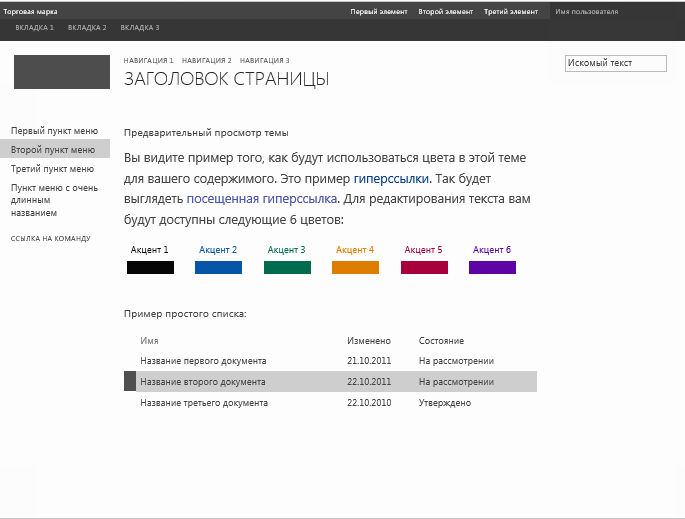

# Инструкции. Создание файла предварительного просмотра эталонной страницы в SharePoint 2013
Узнайте, как создавать файлы предварительного просмотра эталонных страниц, которые используются при работе с темами SharePoint для предварительного просмотра выбранных компонентов темы.
Мастер **изменения внешнего вида** служит отправной точкой работы с темами SharePoint. Библиотека макетов — это первая страница мастера **изменения внешнего вида**, на которой отображаются эскизы доступных макетов. Пользователи выбирают макет для своего сайта, а затем переходят к следующей странице, где можно настроить оформление. Затем пользователи могут просмотреть сайт, прежде чем применять к нему макет. Файл предварительного просмотра эталонной страницы используется для создания изображений эскиза и предварительного просмотра. Если эталонной странице не назначен файл предварительного просмотра, ее невозможно использовать при работе с темами.
  
    
    

Дополнительные сведения см. в статье  [Общие сведения о темах для SharePoint 2013](themes-overview-for-sharepoint-2013.md).
## Базовые концепции для работы с файлами предварительного просмотра эталонных страниц
<a name="Introduction"> </a>

В таблице 1 перечислены статьи, посвященные базовым концепциями для работы с файлами предварительного просмотра эталонных страниц.
  
    
    

**Таблица 1. Базовые концепции для работы с файлами предварительного просмотра эталонных страниц**


|**Название статьи**|**Описание**|
|:-----|:-----|
| [Общие сведения о темах для SharePoint 2013](themes-overview-for-sharepoint-2013.md) <br/> |Сведения о работе с темами в SharePoint 2013.  <br/> |
| [Выбор темы для сайта публикации](http://office.microsoft.com/ru-ru/office365-sharepoint-online-enterprise-help/choose-a-theme-for-your-publishing-site-HA102891580.aspx) <br/> |Узнайте, как изменить внешний вид и функции сайта SharePoint с помощью мастера **изменения внешнего вида**.  <br/> |
   

## Что такое файл предварительного просмотра эталонной страницы?
<a name="section1"> </a>

Файлы предварительного просмотра эталонных страниц (файлы предварительного просмотра) — это специально отформатированные файлы с разделами для палитры цветов и схемы шрифтов по умолчанию, CSS и HTML с токенами. Файл предварительного просмотра эталонной страницы должен иметь такое же имя (за исключением расширения файла), что и соответствующая эталонная страница. Например, если у вас есть эталонная страница с именем article.master, соответствующий файл предварительного просмотра будет иметь имя article.preview. Эталонные страницы и файлы их предварительного просмотра хранятся в коллекции эталонных страниц.
  
    
    
Файл предварительного просмотра эталонной страницы имеет следующую структуру:
  
    
    


```HTML
Default color palette
[SECTION]
Default font scheme
[SECTION]
CSS
[SECTION]
HTML
```

В файле предварительного просмотра эталонной страницы:
  
    
    

-  _Палитра цветов по умолчанию_ — это файл SPCOLOR в коллекции тем (http:// _ИмяСемействаСайтов_/_catalogs/theme/15/), который нужно использовать по умолчанию. Палитра цветов по умолчанию соответствует цветам, которые используются на эталонной странице в состоянии по умолчанию, то есть прежде чем пользователь выберет палитру цветов в мастере **изменения внешнего вида**.
    
  
-  _Схема шрифтов по умолчанию_ — это файл SPFONT в коллекции тем (http:// _ИмяСемействаСайтов_/_catalogs/theme/15/), который нужно использовать по умолчанию. Схема шрифтов по умолчанию соответствует шрифтам, используемым на эталонной странице в состоянии по умолчанию, то есть прежде чем пользователь выберет схему шрифтов в мастере **изменения внешнего вида**.
    
  
-  _CSS_ — это раздел, содержащий каскадные таблицы стилей (CSS). Все классы CSS должны иметь приставку[ID]. В следующем примере показан фрагмент раздела CSS в файле предварительного просмотра эталонных страниц.
    
  ```
  
[ID] #dgp-pageContainer
{
    background-color: [T_THEME_COLOR_PAGEBACKGROUND];
    color: [T_THEME_COLOR_BODYTEXT];
    width: 100%;
    height:100%;     
    background-image: url('[T_IMAGE]');       
    background-size: cover;
    font-family: [T_BODY_FONT];   
}
  ```

-  _HTML_ — это раздел HTML, который задает структуру HTML для предварительного просмотра.
    
  

> **Примечание**
> В файле предварительного просмотра эталонной страницы все значения размеров должны быть указаны как относительные единицы. Например, значения размеров можно указывать как проценты или единицы em. Дополнительные сведения о единицах em см. в разделе  [5.1.1. Длины, зависящие от шрифта: единицы em, ex, ch, rem](http://www.w3.org/TR/2012/WD-css3-values-20120308/#font-relative-lengths) рабочего проекта модуля 3-го уровня по значениям и единицам CSS W3C.
  
    
    

В файлах предварительного просмотра эталонных страниц используются маркеры. Маркеры — это строковые значения, которые будут заменены текстом, значениями цветов или значениями шрифтов на созданной предварительной странице. В следующих разделах описываются доступные маркеры и их использование.
  
    
    

### Дополнительные маркеры

Дополнительные маркеры заменяются при предварительном просмотре указанными значениями ширины и высоты.
  
    
    

**Таблица 2. Дополнительные маркеры**


|**Имя маркера**|**Описание**|
|:-----|:-----|
|[T_HEIGHT]  <br/> |Высота окна предварительного просмотра.  <br/> |
|[T_WIDTH]  <br/> |Ширина окна предварительного просмотра.  <br/> |
|[T_IMAGE]  <br/> |URL-адрес необязательного фонового изображения.  <br/> |
|[T_IMGHEIGHT]  <br/> |Высота изображения, если она требуется.  <br/> |
|[T_IMGWIDTH]  <br/> |Ширина изображения, если она требуется.  <br/> |
   

### Маркеры цвета

Маркеры цвета заменяются в изображении предварительного просмотра значениями цветов. В таблице 3 описываются два формата маркеров цвета. Замените  _ПозицияЦвета_ именем позиции цвета. Маркеры цвета должны быть в верхнем регистре (например, [T_THEME_COLOR_PAGEBACKGROUND]). Список доступных маркеров цвета см. в разделе [Сопоставление цветовых слотов](color-palettes-and-fonts-in-sharepoint-2013.md#colorSlots) статьи [Цветовые палитры и шрифты в SharePoint 2013](color-palettes-and-fonts-in-sharepoint-2013.md).
  
    
    

**Таблица 3. Маркеры цвета**


|**Имя маркера**|**Описание**|
|:-----|:-----|
|[T_THEME_COLOR_ _ПозицияЦвета_]  <br/> |Используйте этот формат, если вам нужно значение цвета позиции.  <br/> |
|[T_THEME_COLOR_ _ПозицияЦвета__AA]  <br/> |Используйте этот формат, если вам нужно 8-значное шестнадцатеричное значение позиции цвета. Этот формат полезен для фильтрующих значений, позволяющих управлять прозрачностью и градиентами в Internet Explorer.  <br/> |
   

### Маркеры шрифтов

Маркеры шрифтов заменяются в изображении предварительного просмотра значениями шрифтов.
  
    
    

- [T_ _ИмяПозиции__FONT]
    
  
Замените  _ИмяПозиции_ именем позиции шрифта. Маркеры шрифтов должны быть в верхнем регистре (например, [T_BODY_FONT]). Список позиций шрифтов и мест страницы, где они используются, см. в разделе [Слоты шрифтов](color-palettes-and-fonts-in-sharepoint-2013.md#fontSlot) статьи [Цветовые палитры и шрифты в SharePoint 2013](color-palettes-and-fonts-in-sharepoint-2013.md).
  
    
    

### Маркеры текстового контента

Маркеры, перечисленные в таблице 4, используются в разделе HTML файла предварительного просмотра эталонной страницы. Маркеры заменяются примером текста в изображении предварительного просмотра в коллекции макетов. Пример текста показан на том же языке, что и остальные элементы сайта.
  
    
    

**Таблица 4. Маркеры текстового контента**


|**Имя маркера**|**Описание**|
|:-----|:-----|
|[BRANDSTRING]  <br/> |Фирменный текст, который отображается на странице. В предустановленных темах он отображается в левом верхнем углу с надписью "Марка".  <br/> |
|[SUITELINK1]  <br/> [SUITELINK2]  <br/> [SUITELINK3]  <br/> |Ссылки, которые отображаются в комплексной панели. См. "Первый элемент", "Второй элемент", "Третий элемент" на рисунке 1.  <br/> |
|[WELCOME]  <br/> |Текст имени пользователя. См. "Имя пользователя" на рисунке 1.  <br/> |
|[RIBBONTAB1]  <br/> [RIBBONTAB2]  <br/> [RIBBONTAB3]  <br/> |Имена вкладок ленты. См. "ВКЛАДКА 1", "ВКЛАДКА 2", "ВКЛАДКА 3" на рисунке 1.  <br/> |
|[SEARCHBOX]  <br/> |Текст в поле поиска. См. "Текст поиска" на рисунке 1.  <br/> |
|[TN1]  <br/> [TN2]  <br/> [TN3]  <br/> |Элементы горизонтальной навигации. "НАВИГАЦИЯ 1", "НАВИГАЦИЯ 2", "НАВИГАЦИЯ 3".  <br/> |
|[TITLE]  <br/> |Заголовок страницы. "Заголовок страницы".  <br/> |
|[QL1]  <br/> [QL2]  <br/> [QL3]  <br/> [QL4]  <br/> |Элементы вертикальной навигации. "Первый элемент меню", "Второй элемент меню", "Третий элемент меню".  <br/> |
|[QLADD]  <br/> |Ссылка под элементами вертикальной навигации. См. "КОМАНДНАЯ ССЫЛКА" на рисунке 1.  <br/> |
|[CA TABLE HEADER]  <br/> |Заголовок над текстом страницы. На рис. 1 это "Добро пожаловать в предварительный просмотр вашей темы!".  <br/> |
|[CA TABLE DESCRIPTION]  <br/> |Текст описания. На рис. 1 это "Вы смотрите на пример использования цветов в этой теме для вашего контента. Это пример...".  <br/> |
|[CA ACCENT COLORS]  <br/> |Список цветов и блоков акцентов.  <br/> |
|[CA LIST TITLE]  <br/> |Заголовок списка. На рис. 1 это "Пример списка".  <br/> |
|[CA TABLE]  <br/> |Пример списка.  <br/> |
|[SITETITLE]  <br/> |Заголовок сайта. См. "Заголовок сайта" на рисунке 1.  <br/> |
   

**Рисунок 1. Предустановленная тема с примером текста**

  
    
    

  
    
    

  
    
    

  
    
    

  
    
    

## Создание файла предварительного просмотра эталонной страницы
<a name="section2"> </a>

Чтобы создать файл предварительного просмотра эталонной страницы, используйте имеющийся предварительный просмотр эталонной страницы в качестве отправной точки.
  
    
    

### Создание предварительного просмотра эталонной страницы


1. Создайте копию файла предварительного просмотра эталонной страницы. SharePoint 2013 включает файлы oslo.preview и seattle.preview.
    
  
2. Переименуйте копию файла предварительного просмотра согласно соответствующей эталонной странице. Например, если эталонная страница называется article.master, переименуйте файл предварительного просмотра в article.preview.
    
  
3. С помощью редактора HTML отредактируйте файл предварительного просмотра эталонной страницы. Обновите файл в соответствии с макетом и внешним видом эталонной страницы.
    
    > **Совет**
      > В файле предварительного просмотра эталонной страницы значения размеров указываются в процентах. В следующем примере показан один метод для преобразования абсолютных единиц (пикселей) в относительные (проценты). Предположим, у вас есть браузер размером 1024x768. Если эталонная страница имеет высоту элемента 32 пикселей, а родительским элементом является основной текст страницы, для вычисления процента необходимо разделить высоту элемента на высоту браузера. Относительный размер составляет 4 % (32/768). 
4. Отправьте файл предварительного просмотра эталонной страницы в коллекцию эталонных страниц.
    
  
5. С помощью мастера **изменения внешнего вида** испытайте предварительный просмотр эталонной страницы с контентом вашего сайта.
    
    > **Примечание**
      > Вы также можете создать макет, использующий новую эталонную страницу, добавив элемент в список "Варианты оформления". Макет будет доступен в коллекции макетов (первая страница мастера **изменения внешнего вида**). Дополнительные сведения см. в разделе  [Развертывание темы с помощью пользовательского интерфейса](how-to-deploy-a-custom-theme-in-sharepoint-2013.md#section2) статьи [Инструкции. Развертывание пользовательской темы в SharePoint 2013](how-to-deploy-a-custom-theme-in-sharepoint-2013.md). 
6. Повторяйте этапы 3-5 по мере необходимости.
    
  

## Дополнительные ресурсы
<a name="bk_addresources"> </a>


-  [Разработка макета сайта в SharePoint 2013](develop-the-site-design-in-sharepoint-2013.md)
    
  
-  [Инструкции. Развертывание пользовательской темы в SharePoint 2013](how-to-deploy-a-custom-theme-in-sharepoint-2013.md)
    
  
-  [Цветовые палитры и шрифты в SharePoint 2013](color-palettes-and-fonts-in-sharepoint-2013.md)
    
  
-  [Блог команды SharePoint: покажите свой стиль с помощью тем SharePoint](http://blogs.office.com/b/sharepoint/archive/2012/10/29/show-off-your-style-with-sharepoint-theming.aspx)
    
  

