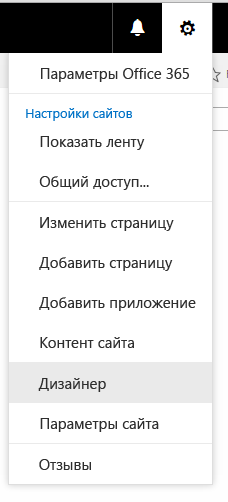

# Инструкции. Создание макета страницы в SharePoint 2013
При построении макета страницы с помощью Дизайнера создаются два файла: ASPX-файл, который использует SharePoint, и HTML-версия этого макета, которую можно изменять в редакторе HTML. HTML-файл и макет страницы связаны друг с другом, поэтому при каждом редактировании и сохранении HTML-файла изменения синхронизируются со связанным макетом страницы.
## Общие сведения о макетах страниц
<a name="Introduction"> </a>

При построении макета страницы с помощью Дизайнера создаются два файла: ASPX-файл, который использует SharePoint, и HTML-версия этого макета, которую можно изменять в редакторе HTML. HTML-файл и макет страницы связаны друг с другом, поэтому при каждом редактировании и сохранении HTML-файла изменения синхронизируются со связанным макетом страницы.
  
    
    
При создании эталонной страницы вы отправляете HTML-файл и преобразуете его непосредственно в эталонную страницу. Однако преобразовать HTML-файл в макет страницы аналогичным образом не удастся, так как основное назначение макета страницы — содержать в себе поля страницы, которые должны добавляться при создании макета страницы в Дизайнере.
  
    
    
При создании макета страницы:
  
    
    

- В коллекции эталонных страниц создаются ASPX-файл и HTML-файл с одинаковыми именами.
    
  
- В ASPX-файл добавляется вся разметка, необходимая SharePoint, поэтому макет страницы отображается правильно.
    
  
- Другая разметка, например комментарии, теги **<div>**, фрагменты кода и заполнители контента, добавляются в HTML-файл.
    
  
- Поля страницы, уникальные для типа контента, добавляются на макет страницы автоматически. Другие поля страницы можно добавить на ленте в коллекции фрагментов кода.
    
  
- HTML- и ASPX-файлы связаны, поэтому при сохранении HTML-файла любые дальнейшие изменения синхронизируются с ASPX-файлом. Другая разметка, например комментарии, теги **<div>**, фрагменты коды и заполнители контента, добавляется в файл.
    
  

> **Примечание**
> Синхронизация проходит только в одном направлении. Изменения макета HTML-страницы будут синхронизированы со связанным ASPX-файлом, однако если вы изменяете непосредственно ASPX-файл, внесенные изменения не будут синхронизированы с HTML-файлом. Каждый макет HTML-страницы (и каждая эталонная HTML-страница) имеет свойство **Связанный файл**, которое по умолчанию имеет значение **True** и устанавливает связь и процесс синхронизации между файлами.
  
    
    

Например, если у вас есть пара связанных файлов (HTML и ASPX) и вы редактируете ASPX-файл, не нарушая связь, внесенные изменения будут сохранены, но вы не сможете отметить или опубликовать этот файл, то есть по большому счету эти изменения не сохраняются. Любые изменения в файле HTML перезаписывают ASPX-файл. Если вы отметите или опубликуете HTML-файл, то его изменения перезапишут любые изменения, которые были сделаны в ASPX-файле. Изменения, внесенные в ASPX-файл, будут утрачены.
  
    
    
Если вы являетесь разработчиком и вам удобно работать с ASP.NET, вы можете разорвать связь и работать только с ASPX-файлами. Чтобы разорвать связь между HTML- и ASPX-файлами, в Дизайнере выберите для HTML-файла команду **Изменить свойства** и снимите флажок напротив пункта **Связанный файл**. Позже вы можете вновь связать эти файлы, изменив свойства и установив флажок. В этом случае изменения, сохраненные в HTML-файле, вновь перезапишут ASPX-файл.
  
    
    

## Общие сведения о связи между полями страницы и типом контента
<a name="UnderstandingPageFields"> </a>

Каждый макет страницы связан с типом контента, обычно одним из типов в группе "Макет страницы". Например, тип контента "Страницы статьи" связан с макетом страницы "Страницы статьи", они оба включены в веб-сайт публикации.
  
    
    
Тип контента состоит из столбцов сайта, которые вместе определяют схему допустимых типов данных. Вы можете сказать, что столбцы сайта являются уникальными для текущего типа контента, так как столбец "Источник" пустой (это значит, что данные столбцы сайта определены текущим типом контента и не наследуются от родительского типа контента).
  
    
    
Для любого заданного макета страницы столбцы сайта, образующие тип контента, непосредственно соответствуют полям страницы, которые доступны для данного макета страницы. Первая группа полей страницы на ленте — это поля страницы, которые автоматически добавляются на макет страницы при его создании. SharePoint добавляет эти поля автоматически, так как они являются уникальными для этого типа контента, и поэтому, вероятно, эти поля были созданы специально для того, чтобы использоваться макетом страницы в отличие от общих метаданных SharePoint.
  
    
    
Перед тем как создать макет страницы в Дизайнере, возможно, вам потребуется создать тип контента, который определяет поля страницы для макета страницы.
  
    
    

## Общие сведения о связи между заполнителями контента на макете страницы и на эталонной странице
<a name="UnderstandingContentPlaceholders"> </a>

Для корректного отображения макет страницы и эталонная страница должны иметь одинаковый набор заполнителей контента. Это просто, если для создания эталонных страниц и макетов страниц вы используете Дизайнера, так как при создании файлов в каждый из них добавляется правильный набор заполнителей контента. Это гарантирует работу каждого макета страницы по каждому каналу, который используется различными эталонными страницами. Вам не нужно знать о большинстве этих заполнителях контента или работать с ними. Они требуются SharePoint для правильного отображения страницы.
  
    
    
Однако, если вы изменяете макет HTML-страницы и вручную добавляете заполнитель контента, вам следует добавить такой же заполнитель контента на каждую эталонную страницу, которая требуется для работы с данным макетом страницы. Подобный случай не является общим.
  
    
    
Если для создания макетов страниц и эталонных страниц вы используете Дизайнера, то наиболее общим случаем станет работа только со следующими заполнителями контента:
  
    
    

- **PlaceHolderMain**. Эталонная страница содержит заполнитель контента с  `ID="PlaceholderMain"`, который содержит тег **DefaultContentBlock** **<div>** с желтым полем, который показывает, что **Эта область будет заполнена контентом, созданным в макетах страниц**. Не вводите ничего внутри этого заполнителя на эталонной странице. Макет страницы содержит заполнитель контента с таким же идентификатором. Поместите разметку внутри этого заполнителя в макете страницы, разметка за пределами заполнителя недопустима. Идентификаторы данных двух заполнителей ( **PlaceholderMain**) должны совпадать.
    
  
- **PlaceHolderAdditionalPageHead**. При работе с макетом страницы элементы в тег **<head>** обычно не вводятся. Вместо этого элементы добавляются в заполнитель контента с помощью `id="PlaceHolderAdditionalPageHead"`. При отображении страницы содержимого в браузере этот дополнительный заголовок страницы добавляется в конец заголовка эталонной страницы. 
    
  

## Создание макета страницы
<a name="CreatePageLayout"> </a>

Сначала необходимо узнать, какой тип контента и макет страницы будут связаны с макетом страницы.
  
    
    

### Чтобы создать макет страницы:


1. Перейдите на сайт публикации.
    
  
2. В правом верхнем углу страницы щелкните значок шестеренки и выберите **Дизайнер**.
    
   **Меню настроек**

  


  

  

  
3. В Дизайнере в левой области панели навигации выберите команду **Изменить макеты страниц**.
    
  
4. Выберите пункт **Создать макет страницы**.
    
  
5. В диалоговом окне **Создание макета страницы** укажите имя для макета страницы.
    
  
6. Выберите эталонную страницу.
    
    Выбранная эталонная страница должна отобразиться в окне предварительного просмотра для данного макета страницы. Эта эталонная страницы также определяет заполнители контента, которые добавляются к макету страницы.
    
    > **Примечание**
      > После выбора эталонной страницы вы не сможете выполнять предварительный просмотр макета страницы с другой эталонной страницей, даже если примените к действующему сайту другую эталонную страницу. 
7. Выберите тип контента. Он определяет поля, которые будут доступны для данного макета страницы в коллекции фрагментов кода.
    
  
8. Нажмите кнопку **OK**.
    
    На этой стадии SharePoint создает HTML- и ASPX-файлы с одинаковыми именами.
    
    Теперь в Дизайнере для вашего HTML-файла отображается столбец "Состояние", который показывает одно из двух возможных состояний:
    
  - **Предупреждения и ошибки**.
    
  
  - **Преобразование выполнено успешно**.
    
  
9. Щелкните ссылку в столбце "Состояние", чтобы выполнить предварительный просмотр файла и просмотреть ошибки или предупреждения, касающиеся эталонной страницы.
    
    Страница предварительного просмотра — это страница динамического просмотра макета страницы на стороне сервера. Верхняя часть области предварительного просмотра отображает предупреждения или ошибки, которые необходимо устранить, отредактировав HTML-файл в редакторе HTML. Для того чтобы во время предварительного просмотра макет страницы отображался правильно, все ошибки должны быть устранены.
    
    Более подробную информацию об устранении ошибок и предупреждений можно узнать в статье  [Как: Устранение ошибок и предупреждения при предварительном просмотре страницы в SharePoint 2013](how-to-resolve-errors-and-warnings-when-previewing-a-page-in-sharepoint-2013.md).
    
    Более подробную информацию о предварительном просмотре макета страницы можно узнать в статье  [Способ: изменение страницы предварительного просмотра в диспетчере оформления SharePoint 2013](how-to-change-the-preview-page-in-sharepoint-2013-design-manager.md).
    
    В правом верхнем углу страницы предварительного просмотра также содержится ссылка **Фрагменты кода**. При переходе по этой ссылке откроется коллекция фрагментов кода, которая позволяет заменять элементы управления макета в своем конструкторе на динамические элементы управления SharePoint. Дополнительную информацию можно узнать в статье  [Фрагменты кода дизайнер SharePoint 2013](sharepoint-2013-design-manager-snippets.md).
    
  
10. Для устранения ошибок с помощью HTML-редактора откройте и измените HTML-файл на подключенном диске на стороне сервера. Каждый раз при сохранении HTML-файла, все изменения синхронизируется со связанным ASPX-файлом.
    
  
11. Во время предварительного просмотра макета страницы отображаются поля страницы, которые были автоматически добавлены в макет страницы. Эти поля — это столбцы сайта, уникальные для текущего типа контента. Теперь вы можете задать стиль для макета шаблона в соответствии с вашими исходными макетами.
    
  

## Определение места выполнения стилей для макета страницы
<a name="WhereStyles"> </a>

При создании HTML-макетов для своего веб-сайта у вас могут быть HTML-файлы, которые представляют различные классы страниц, например страница статьи или страница сведений об элементе, содержащая веб-части для отображения сведений об одном элементе из каталога. После создания макета страницы, которая представляет этот класс страниц, вы можете перенести стили из своего HTML-макета в HTML-версию своего макета страницы.
  
    
    
Вы можете просто поместить стили для одной или нескольких макетов страниц в одну таблицу стилей, на которую ссылается эталонная страница. Однако если вы захотите уменьшить размер таблицы CSS, которая загружается для каждого файла, вы также можете использовать различные таблицы стилей для различных макетов страниц. При этом важно знать, что таблицу стилей нельзя помещать в тег **<head>** макета страницы. Вместо этого ссылка должна вести к заполнителю контента с именем **PlaceHolderAdditionalPageHead**. 
  
    
    

> **Примечание**
> В этом шаблоне атрибут  `ms-design-css-conversion="no"` исключает таблицу стилей из темы. Кроме того, ссылка на таблицу стилей должна находиться после строк с комментарием **<!--SPM**. 
  
    
    


```HTML

<!--MS:<asp:ContentPlaceHolder id="PlaceHolderAdditionalPageHead" runat="server">-->
            <!--SPM:<%@Register Tagprefix="SharePoint" Namespace="Microsoft.SharePoint.WebControls" Assembly="Microsoft.SharePoint, Version=15.0.0.0, Culture=neutral, PublicKeyToken=71e9bce111e9429c"%>-->
            <!--SPM:<%@Register Tagprefix="Publishing" Namespace="Microsoft.SharePoint.Publishing.WebControls" Assembly="Microsoft.SharePoint.Publishing, Version=15.0.0.0, Culture=neutral, PublicKeyToken=71e9bce111e9429c"%>-->
<link href="MyPageLayout.css" rel="stylesheet" type="text/css" ms-design-css-conversion="no" />
        <!--ME:</asp:ContentPlaceHolder>-->

```

Когда посетитель сайта просматривает страницы, которые используют этот макет, этот дополнительный заголовок страницы добавляется в конец заголовка эталонной страницы, поэтому стили макета страницы применяются после стилей эталонной страницы.
  
    
    
В этом случае каждый макет страницы может иметь собственную таблицу стилей. Например, тег **<div>** с `id="xyz"` может находиться в одном макете страницы, расположенном слева, и в другом макете страницы, расположенном справа.
  
    
    
Каждый макет страницы может также иметь одну или несколько таблиц стилей, специфических для каналов устройства. Например, вам может понадобиться макет страницы для телефонов, который отличается от макета, предназначенного для компьютеров. Для этого вы можете включить один или несколько панелей каналов устройств внутри **PlaceHolderAdditionalPageHead**, где каждая панель канала включает ссылку на таблицу стилей со специфическими для канала стилями. Таким образом, например, **<div>** с `id="abc"` может отображать крупный текст на одном канале и мелкий — на другом.
  
    
    
Ниже приведены несколько распространенных способов размещения ссылок на таблицу стилей для макетов страниц.
  
    
    

### Ссылка на стили из эталонной страницы

Самый простой способ — включить стили для одного или нескольких макетов страниц в состав одной таблицы стилей, на которую ссылается эталонная страница. В эталонной странице поместите ссылку на CSS-файл непосредственно перед закрывающим тегом **</head>**, чтобы он перезаписал таблицы стилей SharePoint по умолчанию, например corev15.css.
  
    
    

```HTML

<head>
…
<link rel="stylesheet" type="text/css" href="MyStyleSheet.css" />
</head>

```


### Ссылка на стили из макета страницы

Если вы хотите сократить размер таблицы CSS, которая загружается с каждым файлом, вы можете создать отдельные CSS-файлы для каждого макета страницы. В этом случае стили для макета страницы перейдут в заполнитель контента с именем **PlaceHolderAdditionalPageHead**.
  
    
    

```HTML

<!--MS:<asp:ContentPlaceHolder id="PlaceHolderAdditionalPageHead" runat="server">-->
            <!--SPM:<%@Register Tagprefix="SharePoint" Namespace="Microsoft.SharePoint.WebControls" Assembly="Microsoft.SharePoint, Version=15.0.0.0, Culture=neutral, PublicKeyToken=71e9bce111e9429c"%>-->
            <!--SPM:<%@Register Tagprefix="Publishing" Namespace="Microsoft.SharePoint.Publishing.WebControls" Assembly="Microsoft.SharePoint.Publishing, Version=15.0.0.0, Culture=neutral, PublicKeyToken=71e9bce111e9429c"%>-->
<link href="MyPageLayout.css" rel="stylesheet" type="text/css" ms-design-css-conversion="no" />
        <!--ME:</asp:ContentPlaceHolder>-->

```


### Ссылка на стили в макете страницы по каналам устройств

Если у вас есть несколько каналов устройств, вероятно, вы захотите, чтобы макеты страниц для различных каналов отображались по-разному. В этом случае укажите один или несколько панелей каналов устройств внутри **PlaceHolderAdditionalPageHead**, а затем на каждую панель каналов поместите ссылку на специфичные для каналов CSS-файлы.
  
    
    

```HTML

<!--MS:<asp:ContentPlaceHolder id="PlaceHolderAdditionalPageHead" runat="server">-->
<div data-name="DeviceChannelPanel">
    <!--CS: Start Device Channel Panel Snippet-->
    <!--SPM:<%@Register Tagprefix="Publishing" Namespace="Microsoft.SharePoint.Publishing.WebControls" Assembly="Microsoft.SharePoint.Publishing, Version=15.0.0.0, Culture=neutral, PublicKeyToken=71e9bce111e9429c"%>-->
    <!--MS:<Publishing:DeviceChannelPanel runat="server" IncludedChannels="Channel1">-->
…..
<link rel="stylesheet" type="text/css" href="MyStyleSheet.css" ms-design-css-conversion="no" />
    <!--ME:</Publishing:DeviceChannelPanel>-->
    <!--CE: End Device Channel Panel Snippet-->
</div><div data-name="DeviceChannelPanel">
    <!--CS: Start Device Channel Panel Snippet-->
    <!--SPM:<%@Register Tagprefix="Publishing" Namespace="Microsoft.SharePoint.Publishing.WebControls" Assembly="Microsoft.SharePoint.Publishing, Version=15.0.0.0, Culture=neutral, PublicKeyToken=71e9bce111e9429c"%>-->
    <!--MS:<Publishing:DeviceChannelPanel runat="server" IncludedChannels="Channel2">-->
…..
<link rel="stylesheet" type="text/css" href="CSS5.css" />
    <!--ME:</Publishing:DeviceChannelPanel>-->
    <!--CE: End Device Channel Panel Snippet-->
</div>

```


## Общие сведения о разметке в макете HTML-страницы
<a name="UnderstandMarkup"> </a>

При создании макета страницы создается ASPX-файл, который используется SharePoint, а в HTML-версию макета страницы добавляется несколько HTML-разметок. Когда вы редактируете макет HTML-страницы в HTML-редакторе, полезно понимать назначение некоторых из этих разметок. Большая ее часть похожа на разметку, которая добавляется в эталонную HTML-страницу. Более подробную информацию можно узнать в статье  [Инструкции. Преобразование HTML-файла в эталонную страницу SharePoint 2013](how-to-convert-an-html-file-into-a-master-page-in-sharepoint-2013.md).
  
    
    
Разметка, которая является уникальной для макетов страниц, — это поля страниц, добавленные на макет страницы на основе типа контента, с которым связан макет страницы. Поля страницы появляются внутри заполнителя страницы с  `id="PlaceHolderMain"`. Например, следующая разметка для **PlaceHolderMain** содержит два поля страницы, которые представляют поля **Title** и **Page Image** из связанного типа контента.
  
    
    


```HTML

<!--MS:<asp:ContentPlaceHolder ID="PlaceHolderMain" runat="server">-->
            <div>
                <!--CS: Start Page Field: Title Snippet-->
                <!--SPM:<%@Register Tagprefix="PageFieldTextField" Namespace="Microsoft.SharePoint.WebControls" Assembly="Microsoft.SharePoint, Version=15.0.0.0, Culture=neutral, PublicKeyToken=71e9bce111e9429c"%>-->
                <!--SPM:<%@Register Tagprefix="Publishing" Namespace="Microsoft.SharePoint.Publishing.WebControls" Assembly="Microsoft.SharePoint.Publishing, Version=15.0.0.0, Culture=neutral, PublicKeyToken=71e9bce111e9429c"%>-->
                <!--MS:<Publishing:EditModePanel runat="server" CssClass="edit-mode-panel">-->
                    <!--MS:<PageFieldTextField:TextField FieldName="fa564e0f-0c70-4ab9-b863-0177e6ddd247" runat="server">-->
                    <!--ME:</PageFieldTextField:TextField>-->
                <!--ME:</Publishing:EditModePanel>-->
                <!--CE: End Page Field: Title Snippet-->
            </div>
            <div>
                <!--CS: Start Page Field: Page Image Snippet-->
                <!--SPM:<%@Register Tagprefix="PageFieldRichImageField" Namespace="Microsoft.SharePoint.Publishing.WebControls" Assembly="Microsoft.SharePoint.Publishing, Version=15.0.0.0, Culture=neutral, PublicKeyToken=71e9bce111e9429c"%>-->
                <!--MS:<PageFieldRichImageField:RichImageField FieldName="3de94b06-4120-41a5-b907-88773e493458" runat="server">-->
                    <!--PS: Start of READ-ONLY PREVIEW (do not modify)--><div id="ctl02_label" style="display:none">Page Image</div><div id="ctl02__ControlWrapper_RichImageField" class="ms-rtestate-field" style="display:inline" aria-labelledby="ctl02_label"><div align="left" class="ms-formfieldcontainer"><div class="ms-formfieldlabelcontainer" nowrap="nowrap"><span class="ms-formfieldlabel" nowrap="nowrap">Page Image</span></div><div class="ms-formfieldvaluecontainer"><div class="ms-rtestate-field"></div></div></div></div><!--PE: End of READ-ONLY PREVIEW-->
                <!--ME:</PageFieldRichImageField:RichImageField>-->
                <!--CE: End Page Field: Page Image Snippet-->
            </div>
        <!--ME:</asp:ContentPlaceHolder>-->

```


## Дополнительные ресурсы
<a name="AdditionalResources"> </a>


-  [Обзор Дизайнера в SharePoint 2013](overview-of-design-manager-in-sharepoint-2013.md)
    
  
-  [Инструкции. Преобразование HTML-файла в эталонную страницу SharePoint 2013](how-to-convert-an-html-file-into-a-master-page-in-sharepoint-2013.md)
    
  
-  [Фрагменты кода дизайнер SharePoint 2013](sharepoint-2013-design-manager-snippets.md)
    
  

