# Инструкции. Создание рабочих процессов SharePoint 2013 с помощью Visual Studio
Основные сведения о создании рабочего процесса SharePoint на новой платформе рабочих процессов SharePoint 2013.
 **Автор:** [Эндрю Коннел (Andrew Connell)](http://social.msdn.microsoft.com/profile/andrew%20connell%20%5bmvp%5d/),  [AndrewConnell.com](http://www.andrewconnell.com)
  
    
    

  
    
    

> **Примечание**
> Эта статья сопровождается полным примером кода, который можно использовать при изучении этой статьи или как отправную точку для собственных проектом рабочих процессов SharePoint. Скачать код можно здесь: ССЫЛКА. 
  
    
    

  
    
    

  
    
    
Корпорация Майкрософт применила к рабочим процессам в SharePoint 2013 не такой подход, как в предыдущих версиях. Теперь рабочие процессы SharePoint основаны на Windows Workflow Foundation 4, а их выполнение управляется новым компонентом под названием Workflow Manager, который запускается независимо от SharePoint.Workflow Manager выступает в роли ведущего приложения с высоким уровнем доступа и масштабирования для среды выполнения Windows Workflow Foundation и всех необходимых служб. Он использует служебную шину для обеспечения производительности и масштабируемости, а при развертывании выполняется в локальной среде так же, как и в облачной службе, например Office 365, поскольку он поручает выполнение всех рабочих процессов и сопутствующие задачи ферме Workflow Manager.Резкое изменение архитектуры рабочих процессов потребовало некоторых изменений двух основных средств создания настраиваемых рабочих процессов — Visual Studio и SharePoint Designer. В этой статье рассматривается использование Visual Studio 2012 в качестве средства создания настраиваемых рабочих процессов для использования в развертываниях **sp15allshort** — локальных или Office 365
## Типы рабочих процессов в Visual Studio 2012

Хотя SharePoint Designer 2013 может создавать только рабочие процессы, состоящие их этапов, Visual Studio поддерживает еще один полезный тип рабочего процесса: процесс конечного автомата. Фактически, среды разработки рабочих процессов Visual Studio 2012 (и Visual Studio 2013) поддерживают создание трех типов рабочих процессов: последовательных, блок-схем и конечных автоматов.
  
    
    

### Последовательные

Последовательный рабочий процесс следует определенному пути. Он может включать ветки решений и циклы или не иметь конечной точки, но в процессе разработки легко отслеживается предсказуемый путь. На самом деле с этого начинаются все рабочие процессы при использовании шаблона проекта **Рабочий процесс** в Visual Studio.
  
    
    
Последовательный рабочий процесс содержит одно действие **Последовательность**, которое может включать любое число действий. Некоторые из них могут быть действиями **Последовательность**, которые используются, чтобы сгруппировать серию этапов меньшего размера.
  
    
    

### Блок-схема

В окне блок-схемы путь выполнения может переходить в различные разделы рабочего процесса в зависимости от указанных условий, как показано на рис. 1. Действие блок-схемы, а также связанные с ним действия FlowDecision и FlowSwitch, обычно помещаются внутри действия Sequence и выполняются либо как традиционное выражение **if**, либо как выражение **switch** в распространенных языках программирования.
  
    
    
Конструкция этапов в рабочем процессе SharePoint Designer 2013 основана на принципе блок-схемы. Рабочие процессы этих типов, в отличие от последовательных, не следуют предопределенному пути. Вместо этого путь выполнения рабочего процесса определяется событиями в ходе рабочего процесса.
  
    
    

**Рисунок 1. Окно блок-схемы в Visual Studio 2012**

  
    
    

  
    
    
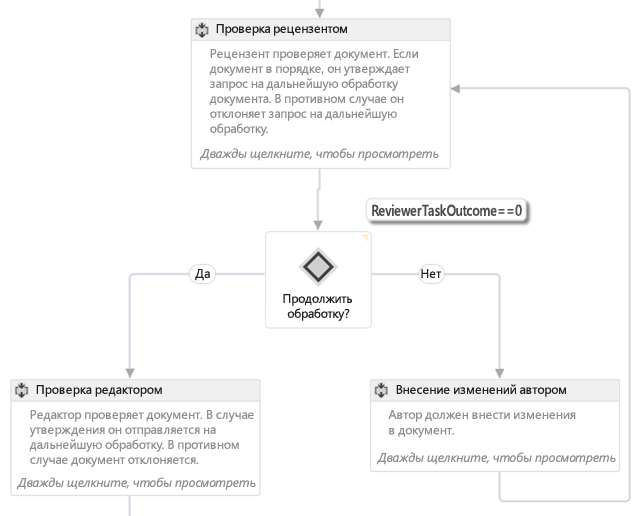
  
    
    

    
> **Примечание**
> Вы можете найти рабочий процесс, представленный на рис. 1, в виде примера в статье  [SharePoint 2013: рабочий процесс утверждения, использующий настраиваемую форму инфляции](http://code.msdn.microsoft.com/officeapps/SharePoint-2013-Approval-f5ac5eb2) MSDN.
  
    
    

### Конечный автомат

Рабочие процессы конечного автомата, как и рабочие процессы блок-схем, обычно не следуют определенному пути выполнения. Вместо этого они состоят из одного или нескольких состояний, как показано на рис. 2. 
  
    
    

**Рисунок 2. Рабочий процесс конечного автомата в Visual Studio 2012**

  
    
    

  
    
    
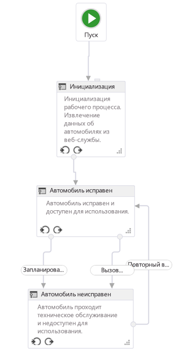
  
    
    

    
> **Примечание**
> Рабочий процесс, представленный на рисунке 1, можно скачать как пример рабочего процесса в статье  [SharePoint 2013: переключение состояний рабочих процессов в зависимости от действий и событий](http://code.msdn.microsoft.com/officeapps/SharePoint-2013-Route-25a25d87) MSDN.
  
    
    

Каждое состояние можно рассматривать как рабочий процесс меньшего размера, который содержит несколько действий. Определенные действия могут запускаться, когда рабочий процесс переходит в некоторое состояние. Самое интересное в конечных автоматах — возможность задавать переходы. У каждого состояния может быть один или несколько переходов, которые сообщают подсистеме рабочих процессов, как переходить от одного состояния к другому. 
  
    
    
Рабочий процесс конечного автомата всегда находится в одном из состояний. Переход заставляет триггер рабочего процесса менять состояние. Многие люди предпочитают рабочие процессы конечного автомата остальным типам рабочих процессов, поскольку они позволяют более точно отражать реальные бизнес-процессы. Тем не менее, такие рабочие процессы могут быстро усложняться.
  
    
    

## Интерфейс разработки рабочих процессов Visual Studio 2012

При добавлении нового рабочего процесса к проекту SharePoint шаблон добавляет одно действие Sequence, которое выступает в роли основного контейнера. Если вам нужно создать рабочий процесс блок-схемы или конечного автомата, просто удалите это действие и перетащите действие StateMachine или Flowchart на рабочую область конструирования.
  
    
    
Прежде чем создавать настраиваемый рабочий процесс, разработчикам нужно иметь хорошее представление об окнах инструментов и рабочей области конструирования, которые предоставляет Visual Studio 2012. Многие элементы встречаются довольно часто, как показано на рис. 3:
  
    
    

**Рисунок 3. Интерфейс создания рабочих процессов Visual Studio 2012**

  
    
    

  
    
    
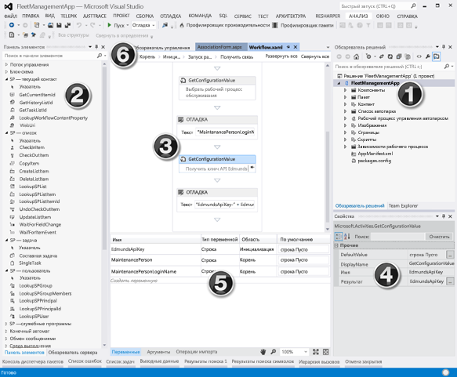
  
    
    
Интерфейс разработки рабочих процессов (то есть конструктор рабочих процессов) включает следующие основные элементы:
  
    
    

  
    
    

1. **Обозреватель решений** представляет проект в виде дерева файлов.
    
  
2. **Панель элементов рабочего процесса** содержит все действия, из которых можно собрать рабочий процесс. Их необходимо перетащить с панели элементов на рабочую область конструирования.
    
  
3. **Область конструктора рабочих процессов** используется для сборки и соединения элементов рабочего процесса.
    
  
4. **Таблица свойств** показывает свойства выбранного действия или элемента в **обозревателе решений**. Она позволяет задавать и изменять значения свойств.
    
  
5. **Область вывода** содержит сведения об элементах действия рабочего процесса — переменных, аргументах и импорте.
    
  
6. **Вкладки иерархической навигации** позволяет приближать и удалять различные части создаваемого рабочего процесса.
    
  
 **Область вывода** (№ 5 на рис. 3) важна, поскольку она позволяет просмотреть все переменные рабочего процесса в текущей области. Выбор области работает так же, как и в обычном объектно-ориентированном программировании: переменная в корне доступна всем областям нижних уровней (например, методам в классе), но переменная в области более низкого уровня (например, метод в классе) доступна только в этой области и ее дочерних областях, но не в параллельных и родительских областях.
  
    
    
Щелкните вкладку **Аргументы**, чтобы просмотреть список аргументов, которые используются для передачи значений в рабочий процесс, например аргументов, переданных из формы инфляции.
  
    
    

## Создание настраиваемого рабочего процесса

Чтобы создать настраиваемый рабочий процесс с помощью Visual Studio 2012 или более поздней версии, вам необходим доступ к сайту разработчика SharePoint 2013. Для данного примера рекомендуется использовать локальную установку SharePoint 2013. Это вызвано тем, что рабочие процессы, тестируемые локально, могут записывать данные отладки в служебную программу Test Service Host с помощью действия **WriteLine**. Эта программа входит в состав Инструменты разработчика Office для Visual Studio 2013 — части стандартной установки Visual Studio 2012 и более поздних версий в редакциях Professional, Premium и Ultimate.
  
    
    

### Создание нового проекта приложения

1. Создайте в Visual Studio новый проект Надстройки SharePoint и настройте его как приложение, размещаемое в SharePoint.
    
  
2. Добавьте к этому проекту новый экземпляр списка **Объявление**. Мы используем этот список как контейнер для элементов, которые будут использоваться для тестирования рабочего процесса.
    
  
3. Добавьте элемент рабочего процесса к проекту, щелкнув правой кнопкой мыши значок проекта в **обозревателе решений** и последовательно выбрав команды **Добавить** и **Создать элемент**.
    
  
4. В диалоговом окне **Добавление нового элемента** выберите элемент проекта **Рабочий процесс** в категории **Office/SharePoint** и назовите его "Мой первый рабочий процесс". Нажмите кнопку **Далее**.
    
  
5. Когда в **мастере настройки SharePoint** потребуется указать имя, оставьте имя по умолчанию и сделайте его **рабочим процессом списка**. Нажмите кнопку **Далее**.
    
  
6. На следующей странице мастера установите флажок для создания сопоставления, а затем выберите только что созданный список **Объявления**, а затем выберите команду **<Создать новый>** для необходимых списков журнала рабочего процесса и задач, после чего нажмите кнопку **Далее**.
    
  
7. На последней странице мастера установите флажок, чтобы запускать рабочий процесс вручную, а затем нажмите кнопку **Готово**. Visual Studio автоматически добавит необходимые элементы к проекту и загрузит файл Workflow.xaml в конструктор, как показано на рис. 4.
    
   **Рис 4. Область конструктора по умолчанию после добавления элемента рабочего процесса**

  

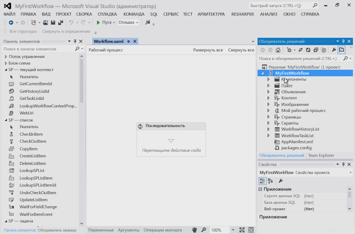
  

  

  

### Организация этапов рабочего процесса

Для автоматизации определенного бизнес-процесса можно использовать любое число действий, объединенных в этап, или **Sequence**. Тем не менее, если сгруппировать слишком много действий в один объект **Sequence**, рабочий процесс станет сложным для понимания и отладки. Аналогично, в обычных языках программирования не рекомендуется слишком длинные и сложные методы. Вместо этого следует группировать действия, которые вместе выполняют определенную задачу.
  
    
    
Пример рабочего процесса иллюстрирует методику сегментирования рабочих процессов. В области конструктора нового проекта добавьте к существующему действию Sequence два новых действия Sequence и назовите их "Дочерняя последовательность 1" и "Дочерняя последовательность 2", как показано на рис. 5. Кроме того, хотя это не показано на рис. 5, измените имя исходного действия Sequence на "Корневая".
  
    
    

**Рисунок 5. Добавление дочерних последовательностей к последовательности по умолчанию (корневой)**

  
    
    

  
    
    
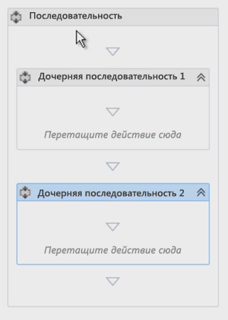
  
    
    

  
    
    

  
    
    

### Комментирование рабочего процесса с помощью заметок

При использовании распространенного языка программирования, например C#, VB.NET или C++ вы можете комментировать код с помощью соответствующих обозначений. Комментирование кода важно для тестирования и поддержания базы кода. Visual Studio также позволяет комментировать разработку рабочего процесса с помощью функции **annotations**.
  
    
    
Вы можете комментировать действие рабочего процесса, выделив его, а затем выбрав команды **Заметки** и **Добавить заметку**. Небольшой значок в виде обратных угловых скобок справа от заголовка действия обозначает, что к нему есть заметка. Наведите указатель на значок или щелкните его, чтобы увидеть сообщение (как показано на рис. 6). Вы можете закрепить заметку, чтобы она всегда была видна, как показано на рис. 6. 
  
    
    

**Рисунок 6. Заметка к действию**

  
    
    

  
    
    
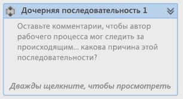
  
    
    

  
    
    

  
    
    

### Получение значений из элементов списка

Распространенная задача при создании рабочих процессов — получение свойств элемента списка. Для этого используется действие **LookupSPListItem**. Оно совершает вызов веб-службы, используя API REST SharePoint 2013 для поиска сведений об элементе списка. В следующей процедуре показано, как это сделать:
  
    
    
Для начала перетащите действие **LookupSPListItem** с панели элементов на действие **Дочерняя последовательность 1**.
  
    
    
После добавления действия в конструктор необходимо задать пару свойств: **ListId** и **ItemId**. Эти свойства позволяют искать сведения в любом списке, но если использовать ссылки на **текущий список** и **текущий элемент**, Workflow Manager будет определять эти значения автоматически.
  
    
    
Так как мы совершаем вызов веб-службы, возвращаемое из этого действия значение, отраженное свойством **Result**, имеет тип **DynamicValue**. Следовательно, нам необходимо переменная того же типа для хранения выходного значения вызова. На самом деле это очень просто сделать: нажав ссылку **Получить свойства** в действии **LookupSPListItem**, вы сделаете большую часть работы автоматически:
  
    
    

- Для начала создается новая переменная типа **DynamicValue**.
    
  
- Затем новая переменная назначается источником для свойства **Result** в действии **LookupSPListItem**.
    
  
- Затем действие **GetDynamicValueProperties** добавляется к рабочему процессу, чтобы из переменной можно было получить значение.
    
  
- Напоследок переменная сопоставляется со свойством **Source** действия **GetDynamicValueProperties**.
    
  
Конечно, все это можно сделать вручную, но инструменты упрощают процесс. При необходимости вы можете изменить имена переменных.
  
    
    
Конечно, наша цель — получить некоторые значения из элемента списка, который вызвал рабочий процесс. В столбце "Кому назначено" значения этих свойств сопоставляются с ранее созданными переменными. Кроме того, можно использовать ссылку "Заполнить переменные", чтобы создать переменные автоматически.
  
    
    

1. В свойстве **Properties** действия **GetDynamicValueProperties** нажмите кнопку с многоточием [ **…**], чтобы открыть диалоговое окно **Свойства**, показанное на рис. 7.
    
   **Рисунок 7. Извлечение значений с помощью диалогового окна "Свойства"**

  

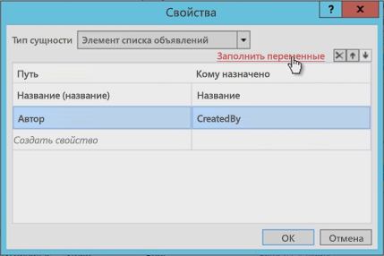
  

  

  
2. Затем измените **Тип сущности** в соответствии с типом элемента. В данном случае это **Элемент списка "Объявления"**.
    
  
3. Выберите два получаемых свойства: поля **Title** и **Created By**.
    
  
4. В столбце **Кому назначено** эти свойства сопоставляются с созданными переменными. Кроме того, можно использовать ссылку **Заполнить переменные**, которая назначает переменные автоматически.
    
  
Обратите внимание, что на рис. 7 инструмент создал переменные и даже правильно сопоставил типы данных. Кроме того, обратите внимание, что поле **Кем создано** является целым числом. Пользователю нет смысла показывать номер автора, не правда ли? Мы исправим это немного позже.
  
    
    

### Получение свойств пользователей

Еще одна распространенная задача при разработке рабочих процессов — поиск пользователей. Например, в данный момент наш рабочий процесс знает, кто создал элемент объявления, но только по его идентификатору. Это идентификатор пользователя, который был добавлен в **список данных пользователей** на сайте, являющийся кэшированной копией данных профиля. На самом деле нам нужны его имя или логин.
  
    
    
Чтобы получить сведения о пользователей, сделайте следующее:
  
    
    

1. Переименуйте первую последовательность ( **Дочерняя последовательность 1**) в "Получение свойств элемента", а вторую — в "Получение свойств автора".
    
    > **Примечание**
      > Убедитесь, что областью действия переменной с идентификатором пользователя является весь рабочий процесс, а не только последовательность, с которой мы работали. Теперь мы изменим область действия переменной, как показано на рис. 8. 

   **Рисунок 8. Изменение области переменных**

  

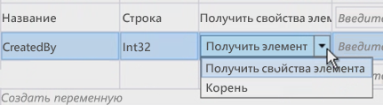
  

  

  
2. Теперь, чтобы получить данные пользователя, перетащите действие **LookupSpUser** в рабочий процесс и измените его имя на "Получение автора объявления". Это действие вызовет API REST SharePoint и передаст определенный идентификатор. Проверьте внешний вид службы REST с помощью браузера, перейдя по адресу `http://../_api/web/SiteUsers`. Запишите или запомните возвращенные свойства, поскольку они скоро потребуются.
    
  
3. Обратите внимание, что у каждого пользователя есть определенный URL-адрес, который включает его идентификатор для получения данных пользователя. Кроме того, обратите внимание, что действие, скорее всего, вызывает оператор службы **GetUserById** и передает идентификатор пользователя для поиска. Для этого настройте свойство **PrincipalId** действия **LookupSPUser**, чтобы оно было переменной **CreatedBy** — номером автора объявления.
    
  
4. Как и действие **LookupSPListItem**, действие **LookupSPUser** возвращает значение типа **DynamicValue**, поэтому необходимо создать переменную этого типа и сопоставить ее с нашим ответом, а затем привязать эту переменную к свойствам **Result** действия **LookupSPUser**, как показано на рис. 9.
    
   **Рисунок 9. Обновление вывода действия LookupSPUser**

  

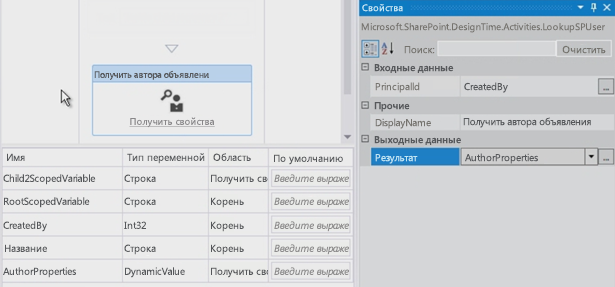
  

  

  
5. Как мы уже делали раньше, используйте действие **GetDynamicValueProperties**, чтобы извлечь результаты из значения **AuthorProperties**. Тем не менее, на этот раз обратите внимание, что у **Entity Type** нет параметров, которые можно задать. Это не проблема, ведь фактический ответ веб-службы с **LookupSPUser** можно увидеть в браузере. Для этого введите путь к нужному свойству (в данном случае — `d/results/(0)/LoginName`), а затем введите еще один, чтобы получить отображаемое имя автора, как показано на рис. 10.
    
   **Рисунок 10. Получение значений из действия LookupSPUser**

  

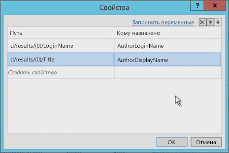
  

  

  

### Тестирование рабочего процесса

В завершение испытаем рабочий процесс. Для начала добавьте два действия **WriteLine**. Они позволяют показывать содержимое наших двух переменных. При тестировании рабочего процесса служебная программа Test Service Host будет выводить на экран два значения, как показано на рис. 11.
  
    
    

**Рисунок 11. Тестирование с помощью консоли Test Service Host**

  
    
    

  
    
    
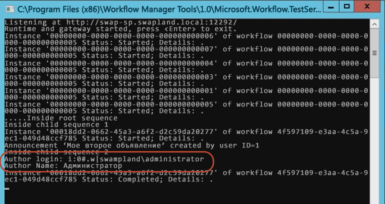
  
    
    

  
    
    

  
    
    

## Заключение

В начале этой статьи мы рассмотрели различные типы рабочих процессов, которые можно создать с помощью Visual Studio 2012, а затем для SharePoint 2013, подключенной к ферме диспетчера рабочих процессов. Затем мы показали, как создать рабочий процесс, который не только собирает значения из элемента списка, который вызвал рабочий процесс, но и выполняет такие распространенные действия, как получение логина и отображаемого имени пользователя с помощью действия **LookupSPUser**. Кроме того, в этой статье упоминается несколько хороших методик для организации рабочих процессов и добавления заметок.
  
    
    

## Дополнительные ресурсы

-  [Рабочие процессы в SharePoint 2013](workflows-in-sharepoint-2013.md)
    
  
-  [Рекомендации по разработке рабочих процессов SharePoint](sharepoint-workflow-development-best-practices.md)
    
  
-  [Примеры рабочих процессов SharePoint 2013](sharepoint-2013-workflow-samples.md)
    
  

  
    
    

