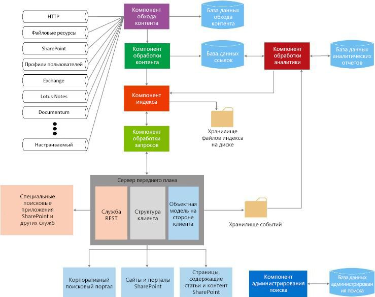

# Поиск в SharePoint 2013
Информация о расширяемости стандартных блоков в Поиск в SharePoint 2013 и об их использовании в подходящих для вас вариантах использования.
Поиск в SharePoint 2013 позволяет пользователям еще легче и быстрее находить необходимую информацию и облегчает настройку возможностей поиска для администраторов поиска. Кроме того, он предоставляет несколько наборов интерфейсов API для расширенной настройки и решений.
  
    
    

Перед тем как продолжить рекомендуем более детально ознакомиться с общими концепциями разработки SharePoint 2013, которые представлены в следующих статьях:
-  [Настройка общей среды разработки для SharePoint 2013](set-up-a-general-development-environment-for-sharepoint-2013.md)
    
  
-  [Выбор правильного набора API в SharePoint 2013](choose-the-right-api-set-in-sharepoint-2013.md)
    
  
-  [Сравнение надстроек SharePoint с решениями SharePoint](sharepoint-add-ins-compared-with-sharepoint-solutions.md)
    
  
-  [Выбор между надстройки SharePoint и решений SharePoint](deciding-between-sharepoint-add-ins-and-sharepoint-solutions.md)
    
  

## Общие сведения об архитектуре поиска

Поиск в SharePoint 2013 включает широкий ряд усовершенствований и новых функций. В этой версии Поиск в SharePoint 2013 реорганизован в единую корпоративную поисковую платформу. Архитектура поиска включает следующие области:
  
    
    

-  [Обход и обработка контента](#bk_crawl);
    
  
-  [Индекс](#bk_index);
    
  
-  [Обработка запросов](#bk_query);
    
  
-  [Администрирование поиска](#bk_searchadmin);
    
  
-  [Аналитика](#bk_analytics).
    
  
Эти области состоят из компонентов и баз данных, которые слаженно работают, чтобы выполнить операцию поиска. На рис. 1 представлен общий вид различных областей архитектуры поиска и внутренние компоненты и базы данных, чья слаженная работа направлена на выполнение операции поиска.
  
    
    

**Рис. 1. Взаимодействие компонентов поиска**

  
    
    

  
    
    

  
    
    
Более подробное представление можно посмотреть в статьях  [Технические графики, раздел "Поиск"](http://technet.microsoft.com/ru-ru/library/cc263199.aspx#search) и [Обзор поиска в SharePoint Server 2013](http://technet.microsoft.com/ru-ru/library/jj219738.aspx).
  
    
    

### Обход и обработка контента

Архитектура обхода и обработки контента включает представленные ниже компоненты.
  
    
    
 **Компонент обхода контента**
  
    
    
 Обходит источники контента, чтобы собрать свойства для обхода и метаданные из обойденных элементов, и отправляет эту информацию компоненту обработки контента.
  
    
    
 **База данных обхода**
  
    
    
Содержит информацию об обойденных элементах, например, последнее время обхода контента, идентификатор последнего обхода и тип обновления во время последнего обхода.
  
    
    
 **Компонент обработки контента**
  
    
    
Обходит источники контента, чтобы собрать свойства для обхода и метаданные из обойденных компонентов, и отправляет эту информацию в компонент индексирования.
  
    
    

### Индекс

Компонент индексирования получает от компонента обработки контента обработанные элементы и записывает их в индекс поиска. Кроме того, этот компонент обрабатывает входящие запросы, получает информацию от поисковых индексов и отправляет набор результатов обратно компоненту обработки контента.
  
    
    

### Обработка запросов

Компонент обработки запросов анализирует и обрабатывает поисковые запросы и результаты. Затем обработанный запрос отправляется в компонент индексирования, который возвращает набор результатов поиска для данного запроса.
  
    
    

### Администрирование поиска

Администрирование поиска состоит из компонента администрирования поиска и соответствующей базы данных.
  
    
    
 **Компонент администрирования поиска**
  
    
    
Запускает системные процессы для поиска и добавляет и инициализирует новые экземпляры компонентов поиска.
  
    
    
 **База данных администрирования поиска**
  
    
    
Хранит данные конфигурации поиска.
  
    
    

### Аналитика

Структура аналитики состоит из компонента обработки аналитики, базы данных отчетности аналитики и базу данных ссылок.
  
    
    
 **Компонент обработки аналитики**
  
    
    
Выполняет анализ поиска и использования.
  
    
    
 **База данных ссылок**
  
    
    
Хранит информацию, извлеченную компонентом обработки контента, и информацию по поисковым переходам.
  
    
    
 **База данных отчетности аналитики**
  
    
    
Хранит результаты анализа использования.
  
    
    
 **Хранилище событий**
  
    
    
Хранит события использования, которые захвачены на внешнем интерфейсе.
  
    
    

## Точки расширения поиска

Архитектура Поиск в SharePoint 2013 предоставляет несколько точек расширения для поддержки сценариев настройки. В этом разделе описаны эти точки и показано, где можно найти дополнительную информацию о разработке для этих сценариев.
  
    
    

### Инфраструктура компонентов

Компонент обхода обходит контент, вызывая соединителей или обработчиков протоколов, которые взаимодействуют с источниками контента, чтобы получить данные. Поиск в SharePoint 2013 включает инфраструктуру компонентов, которую можно использовать для настройки и создания соединителей для обхода новых источников контента. Более подробную информацию об архитектуре инфраструктуры компонентов и способах ее расширения можно узнать в статье  [Инфраструктура соединителей поиска в SharePoint 2013](search-connector-framework-in-sharepoint-2013.md).
  
    
    

### Настройка обработки контента

В компоненте обработки контента вы можете использовать выноски веб-службы обогащения контента, чтобы изменить управляемые свойства обходимых элементов перед тем, как они будут добавлены в индекс поиска. Эта выноска веб-службы обращается к любой созданной вами внешней веб-службе обогащения содержимого. Более подробную информацию можно узнать в статье  [Нестандартная обработка контента с использованием выноски веб-службы "Обогащение контента"](custom-content-processing-with-the-content-enrichment-web-service-callout.md). С пошаговой реализацией веб-службы обогащения контента можно ознакомиться в статье  [Как: используйте вызов повышения качества контента веб-службы для SharePoint Server](how-to-use-the-content-enrichment-web-service-callout-for-sharepoint-server.md). Также полезна будет запись блога  [Настройка поиска SharePoint 2013 с помощью веб-службы обогащения содержимого](http://blogs.msdn.com/b/sharepointdev/archive/2012/11/13/customize-the-sharepoint-2013-search-experience-with-a-content-enrichment-web-service.aspx).
  
    
    

### Интерфейсы API запроса

Поиск в SharePoint 2013 предусматривает несколько интерфейсов API запроса, которые предоставляют множество способов доступа к результатам поиска, чтобы вы могли вернуть различные типы пользовательских решений.
  
    
    
В таблице 1 показаны интерфейсы API, которые вы можете использовать для программирования Поиск в SharePoint 2013, и их расположение.
  
    
    

**Таблица 1. Поисковые интерфейсы API**

|**Имя API**|**Библиотека или схема классов и путь**|
|:-----|:-----|
|Клиентская объектная модель .NET (CSOM)    |Microsoft.SharePoint.Client.Search.dll          %ProgramFiles%\\Common Files\\Microsoft Shared\\web server extensions\\15\\ISAPI    |
|Silverlight CSOM    |Microsoft.SharePoint.Client.Search.Silverlight.dll          %ProgramFiles%\\Common Files\\Microsoft Shared\\web server extensions\\15\\TEMPLATE\\LAYOUTS\\ClientBin    |
|JavaScript CSOM    |SP.search.js          %ProgramFiles%\\Common Files\\Microsoft Shared\\web server extensions\\15\\TEMPLATE\\LAYOUTS    |
|Конечные точки службы передачи репрезентативного состояния (REST)    |http://server/_api/search/query          http://server/_api/search/suggest    |
|Объектная модель сервера    |Microsoft.Office.Server.Search.dll          %ProgramFiles%\\Common Files\\Microsoft Shared\\web server extensions\\15\\ISAPI    |
   
Более подробную информацию можно узнать в статье  [Использование API поисковых запросов SharePoint 2013](using-the-sharepoint-2013-search-query-apis.md).
  
    
    

### Аналитика

Чтобы помочь определить и обработать контент, который пользователи считают наиболее полезным и значащим, компонент обработки аналитики самостоятельно исследует оба контента, а также способ взаимодействия с ним пользователей. Данный анализ выполняется по заданиям таймера, которые отвечают за выполнение анализа задач жизненного цикла, например запуск, остановка, приостановка и возобновление анализа при необходимости. Вы можете управлять этими заданиями таймера через пространство имен  [Microsoft.Office.Server.Search.Analytics](https://msdn.microsoft.com/library/Microsoft.Office.Server.Search.Analytics.aspx) . Более подробную информацию об аналитике в SharePoint Server 2013 можно узнать в статье [Обзор обработки аналитических данных в SharePoint Server 2013](http://technet.microsoft.com/ru-ru/library/jj219554.aspx).
  
    
    

### Пользовательская модель ранжирования

Результаты поиска можно упорядочить различными способами, один из которых — по значению ранга. Значения ранга вычисляются поисковой системой с использованием моделей ранжирования. SharePoint Server 2013 предоставляет четырнадцать моделей ранжирования по умолчанию. Однако если вы не удовлетворены методом упорядочения результатов поиска, вы можете использовать пользовательские модели ранжирования. Дополнительную информацию о процессе создания пользовательской модели ранжирования и ее настройке можно узнать в статье  [Настройка моделей ранжирования для улучшения релевантности в SharePoint 2013](customizing-ranking-models-to-improve-relevance-in-sharepoint-2013.md).
  
    
    

### Точечная настройка особого метода безопасности

Поиск в SharePoint Server 2013 выполняет фильтрацию по ролям безопасности, которая основана на удостоверении пользователя, отправившего запрос, по времени запроса с использованием сведений о безопасности, полученных от компонента обхода контента. Однако в некоторых случаях вам может потребоваться выполнить точечную настройку особого метода безопасности. Для выполнения этой задачи SharePoint Server 2013 предоставляет два интерфейса:  [ISecurityTrimmerPre](https://msdn.microsoft.com/library/Microsoft.Office.Server.Search.Query.ISecurityTrimmerPre.aspx) и [ISecurityTrimmerPost](https://msdn.microsoft.com/library/Microsoft.Office.Server.Search.Query.ISecurityTrimmerPost.aspx) .
  
    
    
Интерфейс предварительного триммера ( **ISecurityTrimmerPre**) производит оценку предварительного запроса, где в поисковый запрос записываются сведения о безопасности до того, как он совпадет с индексом поиска. И наоборот, интерфейс последующего триммера ( **ISecurityTrimmerPost**) производит оценку после запроса, где результаты поиска обрезаются перед тем как вернуться к пользователю. Более подробную информацию об этих двух интерфейсах можно узнать в статье  [Фильтрация по ролям безопасности настраиваемые для поиска в SharePoint Server 2013](custom-security-trimming-for-search-in-sharepoint-server-2013.md). Пошаговые инструкции по реализации интерфейса триммера безопасности можно найти в статье  [Способ: использование пользовательского триммера безопасности для результатов поиска SharePoint Server](how-to-use-a-custom-security-trimmer-for-sharepoint-server-search-results.md).
  
    
    

### Веб-часть поиска контента

Веб-часть поиска контента — это веб-часть, которая может отображать динамический контент, который ранее был обойден и добавлен в индекс поиска. Каждый экземпляр веб-части связан с индексом поиска и отображает результаты для данного конкретного запроса. Когда пользователи просматривают страницу, которая содержит веб-часть поиска контента, автоматически выдается поисковый запрос, и от индекса поиска возвращаются результаты поиска. Вы можете использовать веб-часть поиска контента когда угодно, чтобы отобразить контент, который заполняется автоматически созданными поисковыми запросами. В некоторых случаях вам может потребоваться расширить веб-часть поиска контента, которую можно изменить через пространство имен  [Microsoft.Office.Server.Search.WebControls](https://msdn.microsoft.com/library/Microsoft.Office.Server.Search.WebControls.aspx) как [ContentBySearchWebPart](https://msdn.microsoft.com/library/Microsoft.Office.Server.Search.WebControls.ContentBySearchWebPart.aspx) . Информацию о том, как расширить [ContentBySearchWebPart](https://msdn.microsoft.com/library/Microsoft.Office.Server.Search.WebControls.ContentBySearchWebPart.aspx) , чтобы веб-часть распознала пользовательские свойства, можно узнать в статье [Сегментация пользователей в SharePoint 2013](user-segmentation-in-sharepoint-2013.md).
  
    
    

### Мобильные приложения на основе поиска с помощью интерфейсов навигации и ведения журнала событий REST

SharePoint Server 2013 предоставляет два новых интерфейса REST: навигацию и ведение журнала событий. Вы можете использовать их для создания мобильные приложения на основе поиска для мобильных устройств, например телефонов и планшетов, работающих под управлением операционной системы, отличной от Windows. Эта функция позволяет отображать на мобильном устройстве каталог продуктов не через мобильный канал, а другим способом. Подробный пример создания такого приложения описан в статье  [Как: создание на основе механизмов поиска мобильных приложений с помощью интерфейсов навигации и REST ведение журнала событий](how-to-build-search-driven-mobile-apps-with-the-navigation-and-event-logging-res.md).
  
    
    

## В этом разделе

-  [Новые возможности поиска в SharePoint для разработчиков (en)](what-s-new-in-sharepoint-2013-search-for-developers.md)
    
  
-  [Поиск по новому контенту с поиска SharePoint](searching-new-content-with-sharepoint-search.md)
    
  
-  [Настройка службы поиска в SharePoint 2013](configure-search-in-sharepoint-2013.md)
    
  
-  [Построение запросов поиска в SharePoint 2013](building-search-queries-in-sharepoint-2013.md)
    
  
-  [Общие сведения об API службы поиска REST для SharePoint](sharepoint-search-rest-api-overview.md)
    
  
-  [Настройка результатов поиска в SharePoint 2013](customizing-search-results-in-sharepoint-2013.md)
    
  
-  [Сортировка результатов поиска в SharePoint 2013](sorting-search-results-in-sharepoint-2013.md)
    
  
-  [Настройка моделей ранжирования для улучшения релевантности в SharePoint 2013](customizing-ranking-models-to-improve-relevance-in-sharepoint-2013.md)
    
  
-  [Фильтрация по ролям безопасности настраиваемые для поиска в SharePoint Server 2013](custom-security-trimming-for-search-in-sharepoint-server-2013.md)
    
  
-  [Экспорт и импорт параметров конфигурации поиска в SharePoint 2013](exporting-and-importing-search-configuration-settings-in-sharepoint-2013.md)
    
  

## Дополнительные ресурсы

-  [Отличия SharePoint 2010 от SharePoint 2013](http://technet.microsoft.com/ru-ru/library/ff607742.aspx)
    
  
-  [Технические графики, раздел "Поиск"](http://technet.microsoft.com/ru-ru/library/cc263199.aspx#search)
    
  
-  [Добавление возможностей SharePoint 2013](add-sharepoint-2013-capabilities.md)
    
  
