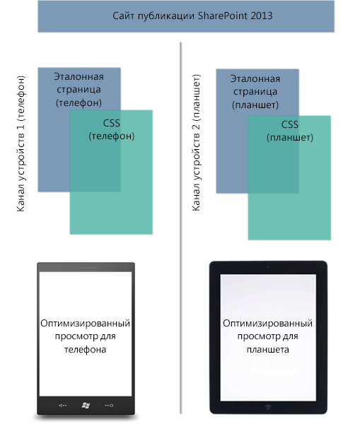
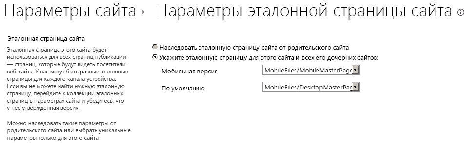

# Каналы устройств в компоненте "Дизайнер" SharePoint 2013
Сведения о настройке и планировании использования каналов устройств на сайте SharePoint 2013.
## Общие сведения о каналах устройств
<a name="Int"> </a>

Для просмотра веб-страниц все чаще используются мобильные устройства, поэтому сайт SharePoint нужно оптимизировать для смартфонов и прочих мобильных устройств, например планшетов. С помощью каналов устройств в SharePoint 2013 можно сделать так, что один сайт публикации будет отображаться по-разному в зависимости от устройства. Эта статья поможет вам спланировать использование каналов устройств в SharePoint 2013. В ней приведены подробные сведения о самой возможности, а также необходимая информация о создании канала устройств. Кроме того, после прочтения этой статьи вы узнаете, какие каналы устройств вам нужны и как их реализовать.
  
    
    
Каналы устройств доступны только для сайтов публикации SharePoint 2013. Прежде чем реализовывать каналы устройств, необходимо получить общее представление о функции "Дизайнер", о том, из чего состоит сайт SharePoint и как создать страницу SharePoint. Дополнительные сведения о модели страницы SharePoint, а также об эталонных страницах и макетах страниц см. в статье  [Обзор модели страниц в SharePoint 2013](overview-of-the-sharepoint-2013-page-model.md). Дополнительные сведения о компоненте "Дизайнер" см. в статье  [Обзор Дизайнера в SharePoint 2013](overview-of-design-manager-in-sharepoint-2013.md).
  
    
    

## Что такое канал устройств?
<a name="WhatDev"> </a>

Канал устройств — часть инфраструктуры публикации SharePoint 2013, которая позволяет отображать определенный контент сайта, стилизовать контент и даже изменять изображения, используя при этом один и тот же URL-адрес для пула разных устройств. Если сравнивать классическую и мобильную версии сайта SharePoint, то последняя должна предусматривать отображение более узких страниц, меньшего объема информации, увеличенных элементов навигации (для прикосновений), чтобы сайт был удобным. Можно разработать один сайт, создав и отредактировав контент сразу для всех мобильных устройств. Когда пользователь просматривает сайт SharePoint с мобильного устройства, например смартфона или планшета, браузер мобильного устройства отправляет на сайт запрос HTTP GET, включающий строку агента пользователя. Эта строка содержит сведения о типе устройства, которое пытается получить доступ к сайту. В зависимости от того, какая подстрока используется, браузер может перенаправить пользователя к определенному представлению эталонной страницы. Если, например, у вас есть коллекция устройств с Windows Phone и устройств iPad, можно назначить каждому пулу уникальное отображение сайта публикации SharePoint с помощью каналов устройств. Каждому каналу устройств можно назначить отдельную эталонную страницу и CSV-файл, чтобы обеспечить оптимальное отображение. На рисунке 1 показано использование двух каналов устройств для обеспечения двух вариантов отображения сайта (для телефона и планшета).
  
    
    
Рис. 1. Использование каналов устройств на различных платформах устройств
  
    
    

  
    
    

  
    
    
Можно создать и настроить канал устройств через меню **Параметры сайта** в разделе **Внешний вид и функции**, а также с помощью параметра **Дизайнер** в том же разделе. При создании элемента канала устройств понадобится заполнить пять полей (как обязательных, так и необязательных). В таблице 1 перечислены эти поля и описаны сведения, которые необходимо предоставить.
  
    
    

**Таблица 1. Обязательные и необязательные поля для создания канала устройств**


|**Поле**|**Обязательное значение**|**Значение**|
|:-----|:-----|:-----|
|Имя  <br/> |Да  <br/> |Это имя вашего канала устройств. Можно использовать понятное имя, чтобы легко распознавать канал.  <br/> |
|Псевдоним  <br/> |Да  <br/> |Псевдоним дает возможность определять канал устройств в коде, на панелях канала устройств (подробнее описаны ниже в статье), при предварительном просмотре и в другом контексте.  <br/> > **Важно!**> Если вы позже измените псевдоним канала, необходимо будет вручную обновить сопоставления эталонной страницы, панели каналов устройств, а также пользовательский код или разметку, если они есть.           |
|Описание  <br/> |Нет  <br/> |Поле для указания общего описания канала устройств.  <br/> |
|Правила включения устройств  <br/> |Да  <br/> |Поле для указания подстроки агента пользователя, например Windows Phone OS. От значения, введенного в это поле, зависит перенаправление устройств на определенную эталонную страницу. Дополнительные сведения о том, какие значения вводить в это поле, см. в разделе  [Подстроки агента пользователя и ранжирование каналов устройств](#PlanDeviceChannels_UserAgentSubstrings) этой статьи. <br/> |
|Активировать  <br/> |Нет  <br/> |Установка этого флажка активирует канал устройств. Если вы работаете над действующим сайтом, лучше не активировать канал до завершения его разработки. Чтобы протестировать работу сайта с помощью предварительного просмотра сайта при использовании определенного канала, можно использовать строку запроса  `?DeviceChannel=alias` в браузере. <br/> |
   

  
    
    

    
> **Примечание**
> Дополнительные сведения и инструкции по созданию канала устройств см. в разделе  [Создание канала устройств](sharepoint-2013-design-manager-device-channels.md#create) этой статьи.
  
    
    

После создания и активации канала устройств станет возможным перенаправление на определенную эталонную страницу, например на мобильную версию. Далее необходимо указать, какая именно эталонная страница должна отображаться для мобильных устройств на уровне сайта. Это можно сделать через **Параметры главной страницы сайта** или с помощью параметра **Публикация и применение** в компоненте "Дизайнер".
  
    
    

**Рис. 2. Настройка эталонных страниц для просмотра на мобильных устройствах и просмотра по умолчанию на компьютерах**

  
    
    

  
    
    

  
    
    
Как показано на рисунке 2, можно назначить определенную эталонную страницу для обычного просмотра сайта на компьютере и эталонную страницу для перенаправления мобильных устройств. От настроенного и активного канала устройств зависит, какая именно эталонная страница будет отображаться: мобильная или по умолчанию. В частности, это зависит от подстроки правила включения устройств, заполняемой при создании канала устройств.
  
    
    

### Подстроки агента пользователя и ранжирование каналов устройств
<a name="PlanDeviceChannels_UserAgentSubstrings"> </a>

При создании канала устройств вам будет предложено указать подстроку агента пользователя, которая отвечает за перенаправление устройств на указанную эталонную страницу. Если не указать это значение в поле **Правила включения устройств**, перенаправление устройств не будет работать и канал невозможно будет создать. В таблице 2 приведены примеры значений подстроки агента пользователя, которые можно использовать при создании канала устройств.
  
    
    

**Таблица 2. Примеры значений подстроки агента пользователя**


|**Устройство**|**Подстрока агента пользователя**|
|:-----|:-----|
|Windows Phone  <br/> | Windows Phone OS 7.5 (только для телефонов с Windows Phone 7.5) <br/>  Windows Phone OS (универсальная подстрока для всех версий Windows Phone) <br/> |
|iPhone  <br/> |iPhone  <br/> |
|iPad  <br/> |iPad  <br/> |
|Android  <br/> |Android  <br/> |
   
В поле **Правила включения устройств** необходимо ввести значение или значения подстроки для устройств, которые нужно включить.
  
    
    

> **Важно!**
> Значения подстроки агента пользователя отличаются в зависимости от производителя устройства, но могут также отличаться и на устройствах с одной торговой маркой, как в приведенном выше случае с Windows Phone. Для успешного перенаправления трафика в конкретный пул необходимо назначить подстроке агента пользователя уникальный идентификатор. Дополнительные сведения о том, как изолировать подстроку на различных устройствах, см. в разделе  [Планирование использования каналов устройств](sharepoint-2013-design-manager-device-channels.md#plan) этой статьи.
  
    
    

После создания каналов устройств они упорядочиваются и хранятся в списке. SharePoint 2013 поддерживает до 10 каналов устройств для одного сайта, поэтому для корректной маршрутизации трафика может понадобиться ранжировать каналы. Следует поставить наиболее уникальные правила в верхнюю часть списка, чтобы указать их более высокую важность. Это нужно сделать, если, например, в организации есть устройства с разными версиями Windows Phone, а вы хотите, чтобы на устройствах с Windows Phone 7.5 отображалась уникальная эталонная страница. На всех остальных устройствах с Windows Phone будет отображаться другая мобильная эталонная страница. В таблице 3 показаны три схемы упорядочивания, которыми можно воспользоваться, и описано их влияние на маршрутизацию.
  
    
    

> **Примечание**
> Дополнительные сведения об изменении порядка каналов устройств см. в разделе  [Создание канала устройств](sharepoint-2013-design-manager-device-channels.md#create) этой статьи.
  
    
    


**Таблица 3. Пример упорядочивания каналов устройств**


|**Порядок 1 (каналы устройств)**|**Порядок 2 (каналы устройств)**|
|:-----|:-----|
|Канал устройств 1: Windows Phone OS 7.5  <br/> |Канал устройств 1: Windows Phone OS  <br/> |
|Канал устройств 2: Windows Phone OS  <br/> |Канал устройств 2: Windows Phone OS 7.5  <br/> |
|Канал устройств 3: Default  <br/> |Канал устройств 3: Default  <br/> |
   
При выборе порядка 1, в котором подстроке правила включения устройств присвоено значение **Windows Phone OS 7.5**, пользователь с устройством с Windows Phone 7.5 будет перенаправлен на канал устройств 1 при переходе на сайт. Пользователь с любой другой версией Windows Phone будет перенаправлен на канал устройств 2, а пользователь, не использующий Windows Phone, перейдет на канал 3. Но при выборе порядка 2, в котором высший приоритет присвоен универсальной подстроке Windows Phone OS, весь трафик Windows Phone будет направляться на канал устройств 1. Устройства с Windows Phone 7.5 не будут перенаправлены на канал устройств 2 из-за того, что приоритет назначен каналу устройств 1, относящемуся к Windows Phone в общем. При создании нескольких каналов устройств очень важно понимать, как порядок и ранжирование влияют на перенаправление трафика для пулов устройств.
  
    
    

> **Примечание**
> Дополнительные сведения и инструкции для упорядочивания каналов устройств см. в разделе  [Изменение порядка каналов устройств](sharepoint-2013-design-manager-device-channels.md#reorder) этой статьи.
  
    
    


### Панели каналов устройств
<a name="PlanDeviceChannels_UserAgentSubstrings"> </a>

Панель каналов устройств — это контейнер, который можно использовать на эталонной странице или на макете страницы для отображения особого контента в зависимости от псевдонима данного канала устройств или набора каналов. Это может быть, например, веб-часть или элемент управления, который должен отображаться только при просмотре сайта с компьютера, но не с мобильного устройства. С помощью панели каналов устройств можно инкапсулировать эту веб-часть в код и разрешить ее отображение только через заданный канал устройств. Основное преимущество, связанное с использованием панелей каналов устройств, заключается в том, что контент на панели каналов устройств вообще не отображается для неуказанных каналов. Такая возможность отсутствует при использовании  `Display:None` в классе CSS. Кроме того, с помощью панелей каналов устройств можно уменьшить отображаемую страницу для устройств, устранив крупный контент. Это позволит повысить скорость реагирования сайта на устройствах с ограниченной пропускной способностью.
  
    
    
Фрагмент панели каналов устройств можно создать с помощью коллекции фрагментов кода при просмотре эталонной страницы или макета страницы. В приведенном ниже примере HTML показано, как создать панель каналов устройств. В этом сценарии есть абзац со вставленным текстом, который отображается только для определенного канала устройств. Псевдоним настроенного канала устройств нужно указывать в атрибуте **IncludedChannels**. Опять же, псевдоним — это имя, которое назначается при создании канала устройств и может указываться в коде.
  
    
    

  
    
    


```HTML

<div data-name="DeviceChannelPanel">
 <!--CS: Start device channel panel snippet.-->
<!--SPM:<%@Register Tagprefix="Publishing" Namespace="Microsoft.SharePoint.Publishing.WebControls" Assembly="Microsoft.SharePoint.Publishing, Version=15.0.0.0, Culture=neutral, PublicKeyToken=62TDCXXXXXXXXXX
<!--MS:<Publishing:MobilePanel runat="server" IncludedChannels="DEFAULT">-->
<p>
This paragraph of content shows up only in the default channel, which means that you can use the same page layout for all your different devices. You can put HTML content, page fields, web parts, or CSS/JavaScript links within a device channel panel so that the content loads only on your specified channels.
</p>
<!--ME:</Publishing:MobilePanel>-->
<!--CE: End Device Channel Panel Snippet-->
</div>
```

Если нужно, чтобы контент отображался для нескольких каналов, псевдонимы следует заключить в кавычки, разделив запятыми:  `IncludedChannels="alias1, alias2"`. Дополнительные сведения о панели каналов устройств см. в статье  [Обзор модели страниц в SharePoint 2013](overview-of-the-sharepoint-2013-page-model.md). Дополнительные сведения о фрагментах кода в компоненте "Дизайнер" см. в статье  [Фрагменты кода дизайнер SharePoint 2013](sharepoint-2013-design-manager-snippets.md).
  
    
    

## Планирование использования каналов устройств
<a name="plan"> </a>

Существует некоторые вопросы, на которые нужно ответить, и сведения, с которыми нужно ознакомиться, прежде чем использовать каналы устройств в организации. Этот раздел поможет с планированием использования каналов устройств. Здесь заданы соответствующие вопросы о вашем устройстве и нужных функциях, а также предоставлены подходящие инструкции. На указанные в этом разделе вопросы следует отвечать строго по порядку.
  
    
    

### Как сайт в результате должен отображаться на компьютере и других устройствах?

Как правило, каждая организация определяет уникальные требования к работе сайта в зависимости от своих потребностей. В идеале сайт должен соответствовать этим требованиям при отображении на любом устройстве, а не только на компьютере. Но несмотря на такое широкое обобщение, это по-прежнему сложный процесс, особенно при работе с различными разрешениями и меньшими областями для сенсорного ввода на экране. Кроме того, возможно, некоторым из имеющихся телефонов нужны уникальные настройки пользовательского интерфейса, которые другим не подходят или не нужны. В этих случаях разработка веб-страниц усложняется, особенно если вы не можете назначить одну эталонную страницу устройствам с различными торговыми марками.
  
    
    
Первая ваша задача — записать, что нужно реализовать, чтобы создать удобный пользовательский интерфейс для различных устройств. Каких возможностей целевая аудитория пользователей ждет от сайта публикации SharePoint 2013 на компьютере, телефоне, планшете? Можно обнаружить различные проблемы, включая возможные ограничения и особенности, связанные с отдельными устройствами, которые необходимо учитывать. Запишите всю эту информацию в любом формате. Это поможет вам понять конкретные цели, которых нужно достичь с помощью каналов устройств, и ответить на последовательные вопросы, перечисленные ниже (например, какие устройства должны поддерживаться и сколько нужно каналов устройств).
  
    
    
Кроме того, важно помнить о некоторых ключевых возможностях каналов устройств, с помощью которых можно решить различные проблемы планирования. Один из примеров — это поддержка нескольких каналов устройств для уникального сопоставления эталонных страниц с несколькими устройствами. Другой — использование панелей каналов устройств для выборочного отображения различных элементов контента для разных пулов устройств.
  
    
    

### Сколько каналов устройств нужно?

Вы можете создать до 10 каналов устройств, включая заданный по умолчанию на определенном сайте для локальной среды и один или два канала устройств для SharePoint Online. Возможно, для вашей организации достаточно будет создать один канал устройств и применить несколько правил включения устройств, которые относятся ко всем устройствам и перенаправляют их на заданную эталонную страницу. Чем меньше каналов устройств, тем лучше. Но из-за различий между устройствами или уникальных настроек HTML и CSS могут понадобиться дополнительные каналы устройств.
  
    
    
Чтобы определить необходимое количество каналов устройств, следует обратиться к собранным ранее сведениям насчет поддерживаемых устройств, целей в отношении этого сайта для различных устройств и необходимого уровня настройки. С помощь этой информации создайте список нужных каналов. Может ли одна мобильная эталонная страница, привязанная к одному каналу устройств, удовлетворить все требования? Или же нужна отдельная эталонная страница для планшетов, и, соответственно, несколько каналов? На этом этапе следует также назвать каналы и придумать для них подходящие псевдонимы, чтобы их можно было указывать в коде. Если псевдоним канала изменить позже, придется вручную изменить также и все ссылки на него.
  
    
    

### Где найти список всех возможных подстрок устройств?

Существуют некоторые универсальные подстроки агента пользователя, указывающие производителя, которые можно использовать для перенаправления устройств. Это, например, Windows Phone OS или iPhone, как видно из таблицы 2. Подстрока, которую нужно ввести в поле **Правила включения устройств**, обычно является подмножеством гораздо большей строки агента пользователя, предоставляемой при подключении устройства к сайту. Рекомендуем искать строки, соответствующие конкретным устройствам, на веб-сайте производителя или поставщика программного обеспечения, а также с помощью обычного веб-поиска. Иногда подстроку, относящуюся к конкретной версии операционной системы, может быть трудно выделить из-за схожести построения строк агента пользователя. В таблице 4 приведены два примера строк агента пользователя: для компьютера с Windows 8 и для планшета.
  
    
    

> **Примечание**
> Приведенные ниже строки — примеры, а не подлинные строки для указанных устройств с Windows. Они предназначены для демонстрации того, как выделить подстроку при необходимости. 
  
    
    


**Таблица 4. Различение строк агента пользователя**


|**Устройство**|**Строка агента пользователя**|
|:-----|:-----|
|Компьютер с Windows 8  <br/> |(compatible; MSIE 10.0; Windows NT 6.2; WOW64; Trident/6.0)  <br/> |
|Планшет с Windows 8 (пример)  <br/> |(compatible; MSIE 10.0; Windows NT 6.2; WOW64; Trident/6.0; touch)  <br/> |
   
Формат этих строк во многом схож. Единственное отличие — присутствие  `touch` в примере строки для планшета с Windows 8. В этом конкретном случае, если нужно, чтобы на планшете отображалась конкретная эталонная страница, следует ввести `touch` в качестве подстроки при создании правила включения устройств. В подобных ситуациях главное — найти отличие между похожими строками. Если вам нужно было бы создать канал устройств с правилом включения устройств с общим значением, таким как **MSIE 10.0**, отличить компьютер от планшета было бы невозможно.
  
    
    

### Нужно ли использовать панели каналов устройств?

Нет. Панели каналов устройств удобны, если нужно разрешить, настроить или запретить отображение некоторых элементов пользовательского интерфейса для разных устройств. К примеру, на сайте может быть текст или элемент управления, который должен отображаться на iPhone, но не на устройстве с Android. Причиной этого может быть, например, то, что у форм-фактора меньший размер экрана, что влияет на удобство использования. Для псевдонима созданного канала устройств можно назначить панели каналов устройств вне зависимости от условий и обеспечить гибкость, необходимую для этого уровня отличения. Хороший вопрос: почему бы не применить одну эталонную страницу к группе разных устройств в организации? В этом случае панель каналов устройств может быть лучшим вариантом для получения более тщательно проработанного результата, соответствующего требованиям конкретных устройств. Кроме того, панели каналов устройств можно использовать для добавления в макеты страниц CSS-кода, относящегося к конкретным каналам.
  
    
    

### Можно ли использовать файлы cookie для выбора канала устройств?

Да, можно принудительно выполнить или отменить выбор каналов устройств с помощью файлов cookie. Для этого нужно создать файл cookie с названием deviceChannel для браузера и внести в него псевдоним указанного канала устройств. Кроме того, каналам устройств можно задать переменную JavaScript под названием **effectiveDeviceChannel**, которая содержит псевдоним текущего канала. Эту переменную можно использовать, чтобы показать, какой канал используется в текущий момент. Чтобы ваш сайт выводил переменную JavaScript, добавьте свойство, приведенное ниже, в контейнер свойств корневого веб-сайта.
  
    
    

```

key = PublishingInformationControlIncludeEffectiveDeviceChannel, value = true
```

Эту переменную также можно использовать, чтобы повлиять на отображение контента и веб-частей на странице.
  
    
    

## Создание канала устройств
<a name="create"> </a>

Эта процедура используется для создания нового канала устройств.
  
    
    

### Чтобы создать канал устройств:


1. Запустите "Дизайнер". (Например, выберите **Дизайнер** в меню **Параметры**.)
    
  
2. Выберите **Управление каналами устройств** в нумерованном списке.
    
  
3. На странице компонента "Дизайнер" "Управление каналами устройств" выберите **Создать канал**.
    
  
4. На странице "Каналы устройств: новый элемент" введите имя канала устройств в текстовом поле **Имя**.
    
  
5. Введите псевдоним канала устройств в текстовом поле **Псевдоним**. Псевдоним должен состоять только из букв и цифр и не должен содержать пробелов. Он будет использоваться для ссылок на канал устройств в коде и другом контексте.
    
  
6. В текстовом поле **Описание** введите краткое описание устройств или браузеров, которые будет охватывать канал.
    
  
7. В текстовом поле **Правила включения устройств** введите подстроки агента пользователя для канала. Этот канал будет использован при запросе веб-страницы, если одна из введенных вами строк совпадет со строкой агента пользователя запроса.
    
  
8. Если вы готовы позволить каналу обрабатывать страницы, установите флажок **Активировать**.
    
  
9. Нажмите кнопку **Сохранить**.
    
  

## Изменение канала устройств
<a name="modify"> </a>

Чтобы изменить существующий канал устройств, следуйте этой процедуре.
  
    
    

> **Примечание**
> Канал по умолчанию невозможно изменить. 
  
    
    


### Чтобы изменить канал устройств:


1. Запустите "Дизайнер". (Например, выберите **Дизайнер** в меню **Параметры**.)
    
  
2. Выберите **Управление каналами устройств** в нумерованном списке.
    
  
3. На странице компонента "Дизайнер" "Управление каналами устройств" выберите **Редактирование существующих каналов или изменение их порядка**.
    
  
4. В списке **Каналы устройств** выберите канал устройств, который требуется изменить, а затем откройте вкладку **Элементы** и выберите пункт **Изменить элемент**.
    
  
5. Чтобы изменить имя канала устройств, введите новое имя в текстовом поле **Имя**.
    
  
6. Чтобы изменить псевдоним канала устройств, введите новый псевдоним в текстовом поле **Псевдоним**.
    
    > **Примечание**
      > При изменении псевдонима канала устройств необходимо вручную изменить его в других местах, где он используется. Например, вручную придется изменить псевдоним в пользовательском коде или разметке, а также поменять сопоставления между каналом устройств и эталонными страницами. 
7. Чтобы изменить описание канала устройств, введите новое описание в текстовом поле **Описание**.
    
  
8. Чтобы изменить правила включения устройств, измените строки в текстовом поле **Правила включения устройств**.
    
  
9. Чтобы активировать канал устройств, установите флажок **Активировать**. Чтобы сделать канал устройств неактивным, снимите флажок **Активировать**.
    
  
10. Нажмите кнопку **Сохранить**.
    
  

## Удаление канала устройств
<a name="delete"> </a>

Чтобы удалить существующий канал устройств, следуйте этой процедуре.
  
    
    

> **Примечание**
> Канал по умолчанию невозможно удалить. 
  
    
    


### Чтобы удалить канал устройств:


1. Запустите "Дизайнер". (Например, выберите **Дизайнер** в меню **Параметры**.)
    
  
2. Выберите **Управление каналами устройств** в нумерованном списке.
    
  
3. На странице компонента "Дизайнер" "Управление каналами устройств" выберите **Редактирование существующих каналов или изменение их порядка**.
    
  
4. В списке **Каналы устройств** выберите канал, который нужно удалить.
    
  
5. Откройте вкладку **Элементы** и выберите пункт **Удалить элемент**.
    
  
6. Нажмите кнопку **OK**.
    
  

## Изменение порядка каналов устройств
<a name="reorder"> </a>

Чтобы изменить порядок каналов устройств, следуйте этой процедуре.
  
    
    

### Чтобы изменить порядок каналов устройств:


1. Запустите "Дизайнер". (Например, выберите **Дизайнер** в меню **Параметры**.)
    
  
2. Выберите **Управление каналами устройств** в нумерованном списке.
    
  
3. На странице компонента "Дизайнер" "Управление каналами устройств" выберите **Редактирование существующих каналов или изменение их порядка**.
    
  
4. Откройте вкладку **Элементы** и выберите пункт **Изменить порядок каналов**.
    
  
5. На странице "Изменение порядка каналов" выберите канал, положение которого нужно изменить, и щелкните **Вверх** или **Вниз**.
    
  
6. Упорядочив каналы, нажмите кнопку **ОК**.
    
  

## Дополнительные ресурсы
<a name="PlanDeviceChannels_addresources"> </a>


-  [Разработка макета сайта в SharePoint 2013](develop-the-site-design-in-sharepoint-2013.md)
    
  
-  [Обзор модели страниц в SharePoint 2013](overview-of-the-sharepoint-2013-page-model.md)
    
  
-  [Обзор Дизайнера в SharePoint 2013](overview-of-design-manager-in-sharepoint-2013.md)
    
  
