# Новые возможности для разработчиков в SharePoint 2013
В этой статье описываются новые возможности и функции SharePoint 2013, в том числе новая модель облачных надстроек, средства разработки, улучшения платформы, мобильные надстройки и многое другое.
## Модель облачных надстроек

В SharePoint 2013 представлена модель облачных надстроек, которая позволяет создавать надстройки для SharePoint. Надстройки SharePoint — это изолированные функциональные компоненты, которые расширяют возможности веб-сайта SharePoint. Они могут содержать такие компоненты SharePoint, как списки, рабочие процессы и страницы сайта, но также могут предоставлять доступ к удаленному веб-приложению и удаленным данным в SharePoint. Надстройка практически не зависит от других программ на устройстве или платформе, на которой она установлена, кроме встроенного программного обеспечения платформы. Это позволяет просто устанавливать и удалять надстройки без ошибок. В приложениях нет пользовательского кода, который выполняется на серверах SharePoint. Вместо этого вся настраиваемая логика переносится "вверх" в облако или "вниз" на клиентские компьютеры. Кроме того, в SharePoint 2013 реализована инновационная модель доставки Надстройки SharePoint, которая включает в себя такие компоненты, как Магазин Office и каталог надстроек.
  
    
    
 [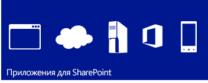
  
    
    
](http://msdn.microsoft.com/library/cd1eda9e-8e54-4223-93a9-a6ea0d18df70%28Office.15%29.aspx) [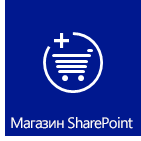
  
    
    
](http://msdn.microsoft.com/library/d15a74a7-3c10-485a-9885-7ef11aaa0d90%28Office.15%29.aspx) [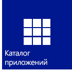
  
    
    
](http://msdn.microsoft.com/library/d15a74a7-3c10-485a-9885-7ef11aaa0d90%28Office.15%29.aspx)
  
    
    

## Знакомая модель программирования на основе веб-стандартов

С помощью SharePoint 2013 любые веб-разработчики, включая тех, что работают с платформами других компаний (не Майкрософт), могут легко создавать решения для SharePoint. Это стало возможным благодаря тому, что SharePoint 2013 основан на общепринятых веб-стандартах, таких как HTML, CSS и JavaScript. Кроме того, реализация зависит от распространенных протоколов, таких как OData и OAuth.
  
    
    
 [
  
    
    
](http://msdn.microsoft.com/library/cd1eda9e-8e54-4223-93a9-a6ea0d18df70%28Office.15%29.aspx) [
  
    
    
](using-odata-sources-with-business-connectivity-services-in-sharepoint-2013.md) [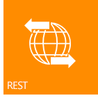
  
    
    
](get-to-know-the-sharepoint-2013-rest-service.md) [
  
    
    
](http://msdn.microsoft.com/library/bde5647a-fff1-4b51-b67b-2139de79ce4a%28Office.15%29.aspx)
  
    
    

## Инструменты разработчика

Текущий выпуск отражает огромные успехи в оптимизации существующих инструментов разработки, таких как Visual Studio и SharePoint Designer, а также предоставляет новое средство Средства разработки Napa для Office 365 для разработки надстроек. Новая унифицированная система проектов в Visual Studio позволяет создавать Надстройки SharePoint, Надстройки Office и Надстройки SharePoint, в том числе Надстройки Office и Надстройки Office, размещенные в SharePoint. Помимо шаблонов проекта SharePoint, которые были доступны в предыдущих версиях, Visual Studio 2012 теперь содержит новый шаблон проекта надстройки в папке "Надстройки", Надстройки для SharePoint 2013. Несколько новых свойств добавлены в окно свойств и на страницу свойств для поддержки проектов Надстройка SharePoint. В числе других улучшений полная поддержка разработки на основе модели облачных надстроек, включая поддержку OData и OAuth, и полную поддержку разработки для платформы Workflow Manager Client 1.0.
  
    
    
 [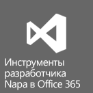
  
    
    
](http://msdn.microsoft.com/library/82a3645c-0911-4926-9176-236ac8d28bdd%28Office.15%29.aspx) [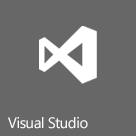
  
    
    
](http://msdn.microsoft.com/library/e00dc63f-b4a4-4c08-b058-729fcb09af41%28Office.15%29.aspx) [
  
    
    
](workflow-development-in-sharepoint-designer-and-visio.md)
  
    
    

## Основные улучшения платформы

В более общем смысле продукт SharePoint 2013 был усовершенствован для поддержки новой облачной архитектуры и платформы разработки на основе приложений. Во всем, начиная API-интерфейсами SharePoint на самом низком уровне и заканчивая интеграцией с социальными сетями, SharePoint 2013 разработан для поддержки среды разработки расширенных приложений. Помимо использования конечных точек REST для веб-служб, существует новый интерфейс API для разработки клиентских и серверных решений. Теперь, в дополнение к обработке на стороне клиента, поддерживаются и удаленные приемники событий. 
  
    
    
 [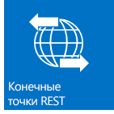
  
    
    
](e1ff2979-1c16-4cb0-a57e-9168dfe20a7c.md) [
  
    
    
](choose-the-right-api-set-in-sharepoint-2013.md) [
  
    
    
](how-to-customize-a-field-type-using-client-side-rendering.md) [
  
    
    
](http://msdn.microsoft.com/library/c050d056-8548-4496-a053-016779d723d9%28Office.15%29.aspx)
  
    
    

## Мобильность

С помощью SharePoint 2013 вы можете объединить приложения Windows Phone 7 с локальными или работающими в облаке удаленными службами и приложениями SharePoint (например, использующими SharePoint Online), для создания мощных и действительно портативных приложений, которые работают не только на традиционных настольных компьютерах и ноутбуках, но и на мобильных устройствах. Новые возможности для мобильных приложений в SharePoint 2013 основаны на существующих средствах и технологиях Майкрософт, такие как SharePoint, Windows Phone 7, Visual Studio и Microsoft Silverlight. Можно разрабатывать мобильные приложения на основе SharePoint для Windows Phone, используя новый шаблон мастера приложения SharePoint дл телефонов в Visual Studio. С его помощью можно создавать простые мобильные приложения на основе списков. Кроме того, вы можете интегрировать новые возможности, представленные в SharePoint 2013, такие как тип поля географического расположения и push-уведомления от SharePoint Server, в своих мобильных приложениях.
  
    
    
 [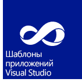
  
    
    
](overview-of-windows-phone-sharepoint-2013-application-templates-in-visual-studio.md) [
  
    
    
](how-to-configure-and-use-push-notifications-in-sharepoint-2013-apps-for-windows.md) [
  
    
    
](integrating-location-and-map-functionality-in-sharepoint-2013.md)
  
    
    

## Социальные сети и совместная работа

Новые и улучшенные возможности для взаимодействия с социальными сетями и совместной работы позволяют пользователям легко обмениваться данными и всегда оставаться в курсе событий. Улучшенные социальные веб-каналы Личный сайт помогают следить за интересующими людьми и контентом в социальных сетях. Новый сайт сообщества предоставляет расширенный интерфейс сообщества, позволяя пользователям легко находить информацию и обмениваться ей, а также находить людей с похожими интересами.
  
    
    
 [
  
    
    
](work-with-social-feeds-in-sharepoint-2013.md) [
  
    
    
](what-s-new-for-developers-in-social-and-collaboration-features-in-sharepoint-201.md#bkmk_Collab) [
  
    
    
](follow-people-in-sharepoint-2013.md) [
  
    
    
](follow-content-in-sharepoint-2013.md)
  
    
    

## Поиск

Система поиска в SharePoint 2013 получила ряд усовершенствований, в том числе обработка пользовательского контента с помощью веб-службы повышения качества контента, а также новая платформа представления типов результатов поиска. Кроме того, были внесены значительные улучшения в язык KQL.
  
    
    
 [
  
    
    
](custom-content-processing-with-the-content-enrichment-web-service-callout.md) [
  
    
    
](what-s-new-in-sharepoint-2013-search-for-developers.md) [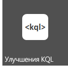
  
    
    
](building-search-queries-in-sharepoint-2013.md)
  
    
    

## Рабочие процессы

Workflow Manager Client 1.0 — это переработанная инфраструктура рабочих процессов, созданная на основе Windows Workflow Foundation 4. Она предоставляет новые, мощные и гибкие возможности разработки рабочих процессов в SharePoint 2013. Полностью декларативная среда разработки позволяет информационным сотрудникам использовать SharePoint Designer 2013 для создания функциональных рабочих процессов, а новый набор шаблонов проекта рабочего процесса Visual Studio 2012 предоставляет разработчикам доступ к расширенным функциям, таким как настраиваемые действия. Возможно, самое главное преимущество состоит в том, что Workflow Manager Client 1.0 полностью интегрирован с Модель для надстроек SharePoint. Кроме того, рабочие процессы выполняются в облаке, а не в SharePoint, что обеспечивает невероятную гибкость при проектировании Надстройки SharePoint на основе рабочих процессов.
  
    
    
 [
  
    
    
](what-s-new-in-workflows-for-sharepoint-2013.md) [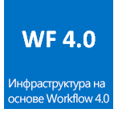
  
    
    
](sharepoint-2013-workflow-fundamentals.md) [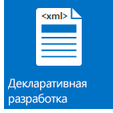
  
    
    
](workflow-development-in-sharepoint-designer-and-visio.md) [
  
    
    
](develop-sharepoint-2013-workflows-using-visual-studio.md)
  
    
    

## Управление корпоративным информационным содержимым

В SharePoint 2013 вы можете использовать API-интерфейсы клиента.NET, Silverlight, Windows Phone и JavaScript, а также недавно расширенный набор серверных управляемых интерфейсов API .NET, для настройки интерфейсов поведения корпоративного управления информационным содержимым (ECM).
  
    
    
 [
  
    
    
](what-s-new-with-sharepoint-2013-site-development.md) [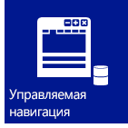
  
    
    
](managed-navigation-in-sharepoint-2013.md) [
  
    
    
](cross-site-publishing-in-sharepoint-2013.md) [
  
    
    
](ediscovery-in-sharepoint-2013.md)
  
    
    

## Службы Business Connectivity Services

Службы Business Connectivity Services (BCS) предоставляет SharePoint доступ к данным из внешних систем, таких как SAP, ERP и CRM, в дополнение к другим приложениям на основе данных, которые доступны через службы WCF или конечные точки OData. Службы BCS в SharePoint 2013 были усовершенствованы и расширены. Среди улучшений подключения OData, внешние события, внешние данные в надстройках, фильтрация и сортировка, поддержка REST и другое.
  
    
    
 [
  
    
    
](using-odata-sources-with-business-connectivity-services-in-sharepoint-2013.md) [
  
    
    
](add-in-scoped-external-content-types-in-sharepoint-2013.md) [
  
    
    
](external-events-and-alerts-in-sharepoint-2013.md)
  
    
    

## Службы приложений

SharePoint Server 2013 содержит несколько служб для работы с данными на сайтах SharePoint. В SharePoint представлена новая служба машинного перевода, которая переводит сайты, документы и потоки для многоязыковой поддержки. SharePoint Server 2013 также использует Службы Access и новую модель доступа к данным. Для преобразования файлов и потоков в другие форматы SharePoint Server 2013 использует Word Automation Services и Службы автоматизации PowerPoint (новый компонент SharePoint). SharePoint также предоставляет средства анализа данных, такие как Службы PerformancePoint Services и Службы Visio, реализующие функции бизнес-аналитики и новые функциональные возможности в Службы Excel.
  
    
    
 [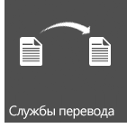
  
    
    
](machine-translation-services-in-sharepoint-2013.md) [
  
    
    
](powerpoint-automation-services-in-sharepoint-2013.md) [
  
    
    
](what-s-new-in-access.md) [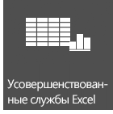
  
    
    
](09e96c8b-cb55-4fd1-a797-b50fbf0f9296.md)
  
    
    

## Дополнительные ресурсы

-  [Обзор разработки решений с помощью SharePoint 2013](sharepoint-2013-development-overview.md)
    
  
-  [Разработка надстроек для SharePoint](http://msdn.microsoft.com/library/71ddde4b-fac4-4d8c-aa2e-524f9c2c4c99%28Office.15%29.aspx)
    
  
-  [Сравнение надстроек SharePoint с решениями SharePoint](sharepoint-add-ins-compared-with-sharepoint-solutions.md)
    
  
-  [Выбор правильного набора API в SharePoint 2013](choose-the-right-api-set-in-sharepoint-2013.md)
    
  
-  [Специальные возможности в SharePoint 2013](accessibility-in-sharepoint-2013.md)
    
  

