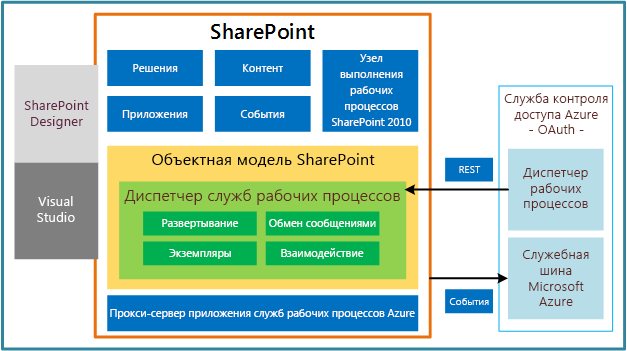

# Что нового в рабочих процессах для SharePoint 2013
Узнайте о новых возможностях и функциях рабочих процессов в SharePoint 2013.
В SharePoint 2013 существенно изменилась инфраструктура рабочих процессов. В разделах ниже кратко описаны наиболее важные обновления и улучшения в инфраструктуре рабочих процессов.
  
    
    

## Полностью обновленная инфраструктура рабочих процессов

Рабочие процессы SharePoint 2013 основаны на платформе Windows Workflow Foundation 4 (WF), которая значительно отличается от предыдущих версий. Платформа Windows Workflow Foundation, в свою очередь, основана на функциональности обмена сообщениями  [Windows Communication Foundation (WCF)](http://msdn.microsoft.com/ru-ru/netframework/aa663324).
  
    
    
Пожалуй, наиболее характерной особенностью новой инфраструктуры рабочих процессов стало внедрение Microsoft Azure в качестве нового узла выполнения рабочих процессов. Рабочие процессы теперь выполняются за пределами сервера SharePoint — в Microsoft Azure. На рис. 1 представлена обобщенная высокоуровневая схема новой инфраструктуры рабочих процессов. Более подробное описание понятий, представленных на рис. 1, см. в статье  [Основные сведения о рабочих процессах в SharePoint 2013](sharepoint-2013-workflow-fundamentals.md).
  
    
    

**Рис. 1. Высокоуровневая архитектура инфраструктуры рабочих процессов**

  
    
    

  
    
    

  
    
    

  
    
    

  
    
    

## Полностью декларативная среда разработки без программного кода

Другое важное изменение состоит в том, что рабочие процессы на платформе WF 4 являются полностью декларативными. Рабочие процессы больше не компилируются в управляемые сборки и не развертываются в кэш сборок. Вместо этого рабочие процессы и ход их выполнения определяют XAML-файлы.
  
    
    

## Улучшены возможности разработки в SharePoint Designer 2013

Мы попытались сделать SharePoint Designer 2013 наилучшей средой для разработки рабочих процессов SharePoint. В SharePoint Designer 2013 представлены рабочая область конструирования и текстовая среда разработки рабочих процессов. Вы можете создавать дополнительные действия рабочих процессов в Visual Studio 2012, а затем импортировать их в SharePoint Designer 2013, где они будут доступны из Конструктор рабочих процессов.
  
    
    
Таким образом, в средах разработки рабочих процессов SharePoint учтены потребности как разработчика, так и информационного работника ("опытного пользователя").
  
    
    

## Поддержка типов проектов рабочих процессов Visual Studio 2012

Чтобы упростить взаимодействие информационного работника и разработчика программного обеспечения, в Visual Studio 2012 представлены типы проектов рабочих процессов SharePoint и тип дополнительных действий рабочего процесса. Дополнительные сведения о разработке рабочих процессов с помощью Visual Studio 2012 и различиях между SharePoint Designer 2013 и Visual Studio 2012 см. в статье  [Разработка рабочих процессов в SharePoint 2013 с помощью Visual Studio](develop-sharepoint-2013-workflows-using-visual-studio.md).
  
    
    

## Поддержка создания дополнительных действий

В SharePoint Designer 2013 и Visual Studio 2012 представлены шаблоны, действия и операции, которые могут понадобиться авторам рабочих процессов. Однако невозможно предугадать, что может понадобиться каждому конкретному пользователю. Поэтому в Visual Studio 2012 доступен настраиваемый тип, который позволяет разработчикам создавать дополнительные действия. Чтобы узнать больше о дополнительных действиях рабочих процессов, см. статью  [Как: построение и развертывание настраиваемого действия рабочего процесса](how-to-build-and-deploy-workflow-custom-actions.md).
  
    
    

## Поддержка средств для рабочих процессов SharePoint

В Visual Studio 2012 представлены шаблоны и возможность создания рабочих процессов на базе инфраструктуры SharePoint 2013. Рабочие процессы SharePoint 2013 похожи на рабочие процессы предыдущих версий за исключением того, что они выполняются в Microsoft Azure на основе платформы WF 4. Кроме того, они являются полностью декларативными (XAML) и предназначены для взаимодействия с облаком и работы с Надстройки SharePoint. Одно из их основных преимуществ состоит в том, что они позволяют удаленно размещать и выполнять рабочие процессы за пределами SharePoint Server.
  
    
    

## Новые действия рабочих процессов

Ниже перечислены новые действия рабочих процессов, доступные в SharePoint 2013. Полное описание новых и устаревших действий см. в статье  [Справочник по действий рабочих процессов для SharePoint 2013](workflow-actions-and-activities-reference-for-sharepoint-2013.md). В SharePoint 2013 впервые внедрен набор действий рабочих процессов, которые обеспечивают интеграцию с Project 2013 и позволяют создавать рабочие процессы на основе проектов.
  
    
    

**Таблица 1. Новые действия рабочих процессов в SharePoint 2013**

|**Действие**|**Описание**|
|:-----|:-----|
|Назначить задачу    |Назначает одну задачу рабочего процесса пользователю или группе.    |
|Начать рабочий процесс    |Инициирует выполнение процесса задачи.    |
|Перейти к этой стадии    |Определяет следующую стадию рабочего процесса, которой необходимо передать управление потоком.    |
|Вызов веб-службы HTTP    |Используется для вызова конечной точки REST.    |
|Начать рабочий процесс списка    |Запускает рабочий процесс списка.    |
|Начать рабочий процесс сайта    |Запускает рабочий процесс сайта.    |
|Построить DynamicValue    |Создает новую переменную типа **DynamicValue**.    |
|Получить свойство из DynamicValue    |Получает значение свойства из указанной переменной типа **DynamicValue**.    |
|Количество элементов в DynamicValue    |Возвращает количество строк в переменной типа **DynamicValue**.    |
|Обрезать строку    |Удаляет все начальные и конечные пробелы из текущей строки.    |
|Найти подстроку в строке    |Возвращает индекс (отсчет ведется от 1) первого вхождения одного либо нескольких символов или первого вхождения строки (в пределах строки).    |
|Заменить подстроку в строке    |Возвращает новую строку, в которой все экземпляры указанного символа или строки заменены на другой указанный символ или строку.    |
|Перевести документ    |Используется в качестве оболочки действия HTTP, которое вызывает API синхронного перевода. Необходимо настроить приложение-службу машинного перевода для сайта SharePoint, на котором выполняется рабочий процесс.    |
|Изменить состояние рабочего процесса    |Обновляет состояние рабочего процесса, как указано в строке сообщения.    |
|Создать проект из текущего элемента [Microsoft Project]    |Создает проект Project Server на основе текущего элемента.    |
|Задать это значение текущего состояния стадии проекта [Microsoft Project]    |Задает два поля состояния на текущей стадии проекта.    |
|Изменить состояние объекта из списка идей на это значение [Microsoft Project]    |Обновляет поле состояния исходного элемента списка SharePoint.    |
|Дождаться события проекта [Microsoft Project]    |Приостанавливает текущий экземпляр рабочего процесса до наступления указанного события проекта: возвращение, выделение, отправление.    |
|Присвоить это значение этому полю в проекте [Microsoft Project]    |Задает значение корпоративного настраиваемого поля для указанного проекта.    |
   

## Дополнительные ресурсы

-  [Общие сведения о рабочих процессах в SharePoint 2013](get-started-with-workflows-in-sharepoint-2013.md)
    
  
-  [Новые возможности для разработчиков в SharePoint 2013](what’s-new-for-developers-in-sharepoint-2013.md)
    
  
-  [Справочник по действий рабочих процессов для SharePoint 2013](workflow-actions-and-activities-reference-for-sharepoint-2013.md)
    
  
-  [Краткий справочник по действиям рабочего процесса (платформа рабочих процессов в SharePoint 2013)](workflow-actions-quick-reference-sharepoint-2013-workflow-platform.md)
    
  

