# Работа с задачами в рабочих процессах SharePoint 2013 с использованием Visual Studio 2012
Сведения о новой и измененной платформе задач рабочего процесса, представленной в SharePoint 2013 на базе новой версии Workflow Manager. 
 **Кто предоставил:** [Эндрю Коннелл](http://social.msdn.microsoft.com/profile/andrew%20connell%20%5bmvp%5d/),  [AndrewConnell.com](http://www.andrewconnell.com)
  
    
    


  
    
    

> **Примечание**
> К этой статье прилагается образец полного кода. Его можно использовать для выполнения рекомендаций из статьи или взять за основу для разработки своих проектов с рабочими процессами SharePoint. Скачайте код  [тут](http://assets.andrewconnell.com/media/Default/Downloads/SP2013Wf-CustomTasks.zip). 
  
    
    


  
    
    
Одно из крупнейших преимуществ SharePoint для Windows Workflow Foundation — реализация новой и улучшенной платформы управления задачами, которая включает в себя новую версию Workflow Manager как среду внешнего размещения.
## Просмотр задач рабочего процесса в SharePoint 2007 и SharePoint 2010

В SharePoint 2007 и SharePoint 2010 задачи рабочего процесса реализованы аналогичным образом. Создавая сопоставление рабочего процесса для списка, типа контента или сайта (в SharePoint 2010), вы назначали определенный список как расположение, где будут создаваться задачи рабочего процесса. Этот список был стандартным списком **Task** (ID = 107) в SharePoint, для которого использовался стандартный тип контента **Task** (ID = 0x0108) в SharePoint. После этого пользователи могли получить доступ к элементам списка, чтобы просматривать, редактировать и выполнять задачу. Экземпляры рабочих процессов отслеживали обновления для элементов задач в списке, если рабочий процесс был настроен соответственно.
  
    
    
Однако отрисовка формы задачи по умолчанию в SharePoint была предварительно определена даже для настраиваемых рабочих процессов. Чтобы можно было использовать все возможности, при создании настраиваемых форм для выполнения задач нужны были  [веб-формы](http://www.asp.net/web-forms)ASP.NET или  [формы InfoPath](http://msdn.microsoft.com/ru-ru/library/ms540731%28v=office.14%29.aspx).
  
    
    

## Что нового в задачах SharePoint 2013

Результатом изменения архитектуры SharePoint стал другой способ создания и обработки задач в SharePoint 2013, а также управления ними.
  
    
    
Главное изменение коснулось рабочих процессов — для их обработки и управления ними больше не используется SharePoint. Вместо этого в SharePoint 2013 используется новый компонент, Workflow Manager, который запускается извне. В Workflow Manager размещается среда выполнения Windows Workflow Foundation и необходимые для Windows Workflow Foundation службы. Когда публикуется рабочий процесс или запускается новый экземпляр опубликованного рабочего процесса, SharePoint оповещает Workflow Manager, и в результате ведется обработка этапов опубликованного рабочего процесса. Когда рабочему процессу необходимо получить доступ к информации в SharePoint, например свойствам элементов списка или свойствам пользователей, выполняется его аутентификация по стандарту OAuth. После этого он опять обращается к SharePoint через вызовы веб-службы с помощью элементов API REST.
  
    
    
Кроме того, изменилась тенденция индивидуальной настройки платформы SharePoint в SharePoint 2013, хотя эти изменения начались еще с внедрения изолированные решения в SharePoint 2010. Корпорация Майкрософт SharePoint 2013 внесла нововведения, благодаря которым настройка выполняется не в SharePoint Server, а в браузере клиента или на внешних ресурсах. Эти изменения включают новую модель приложений SharePoint, возможность назначать удостоверение приложения, аутентификацию по стандарту OAuth, улучшения клиентской объектной модели (CSOM) и использование элементов API REST.
  
    
    

## Изменения архитектуры, связанные с задачами рабочих процессов в SharePoint 2013

Изменения архитектуры SharePoint 2013 повлияли на задачи рабочих процессов в основном незначительно. Исключение — работа с настраиваемыми формами задач. Раньше такие формы создавались с помощью InfoPath или веб-форм ASP.NET. А теперь SharePoint 2013 использует форму по умолчанию для отрисовки элементов списка в случае задач рабочего процесса. 
  
    
    
Иногда вам может понадобиться настроить внешний вид или поведение полей задач. Чтобы сделать это, создайте тип контента настраиваемой задачи, содержащий столбец сайта. Затем для столбца сайта можно будет использовать новую платформу отрисовки в SharePoint 2013 на стороне клиента. Для этого потребуется создать файл JavaScript, определяющий внешний вид и поведение этого поля в браузере. 
  
    
    
Дополнительные сведения об отрисовке на стороне клиента см. в статье  [Инструкция. Настройка представления списка в приложениях для SharePoint с использованием способа отображения на стороне клиента](http://msdn.microsoft.com/ru-ru/library/jj220045.aspx).
  
    
    
В основе отдельных элементов задачи лежат типы контента. Обратите внимание, что в типы контента SharePoint 2013 внесены некоторые изменения. В SharePoint 2007 и SharePoint 2010 задачи рабочих процессов создавались с помощью типа контента **Task** (ID = 0x0108). Это тот же тип контента, который позволяет вручную создавать задачи в списках задач, не связанные с рабочими процессами. В SharePoint 2013 на смену ему пришел новый тип контента, **Workflow Task (SharePoint 2013)** (ID = 0x0108003365C4474CAE8C42BCE396314E88E51F), который указывает на то, что задачи будут использоваться только для рабочего процесса.
  
    
    
 **Workflow Task** отличается от предыдущего типа контента **Task** тем, что в нем есть два новых столбца:
  
    
    

- **WorkflowInstanceId**. Содержит ссылку на идентификатор экземпляра рабочего процесса, с помощью которого была создана задача. Она может отображаться, например, на странице состояния экземпляра рабочего процесса. На этой странице такое поле может использоваться для запрашивания всех элементов из сопоставленного списка задач рабочего процесса, столбцы **WorkflowInstanceId** которых содержат указанный идентификатор.
    
  
- **TaskOutcome**. Поле выбора в представлении формы задачи, которое позволяет пользователю выбрать различные параметры условий выполнения. Форма редактирования задач отображает указанные результаты задач рабочего процесса как кнопки внизу, рядом с кнопками **Сохранить** и **Отмена**. Рабочие процессы в SharePoint 2013 не ограничены только двумя параметрами **Approved** и **Rejected**, как показано на рисунке 1.
    
   **Рисунок 1. Результаты задач рабочего процесса**

  

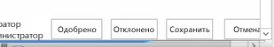
  

  

  
Конечно, типы контента — часть задач рабочего процесса. Типы контента просто задают структуру элементов в списке задач. Не менее важен шаблон списка задач, которого также коснулись изменения в SharePoint 2013.
  
    
    
До появления SharePoint 2013 для списка задач рабочего процесса использовался тот же шаблон списка, что и для стандартного списка задач (ID = 107). Это был стандартный список задач SharePoint, который мог также содержать задачи, не относящиеся к рабочему процессу. Но с выходом SharePoint 2013 все изменилось — добавлен новый тип списка, иерархический список задач. Он обеспечивает отображение расписания задач благодаря представлению временной шкалы в верхней части страницы, как показано на рисунке 2. Кроме того, с его помощью пользователи могут просматривать зависимости задач.
  
    
    

**Рисунок 2. Иерархический список задач**

  
    
    

  
    
    
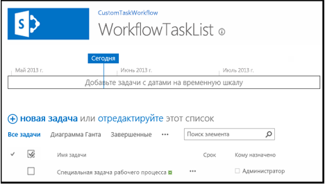
  
    
    

  
    
    

  
    
    

## Создание параметров задач рабочего процесса в SharePoint 2013

В SharePoint Designer 2013 и Visual Studio 2012 авторы рабочего процесса могут создавать задачи для него двумя способами. Первый — создание одиночной задачи, которая назначается пользователю или группе. Второй — создание задачи и ее назначение нескольким пользователям. Создавая одиночную задачу в настраиваемом рабочем процессе с помощью Visual Studio 2012, используйте действие **SingleTask**. Оно позволит вам изменить свойства в окне инструментов **Свойства** или с помощью мастера, как показано на рисунке 3.
  
    
    

**Рисунок 3. Мастер одиночных задач**

  
    
    

  
    
    
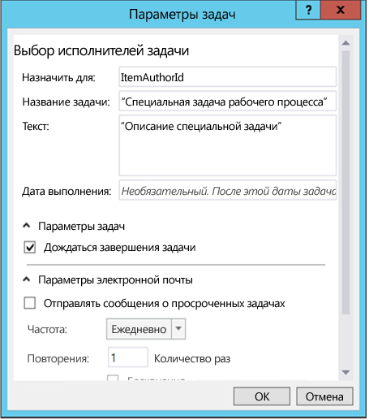
  
    
    
В SharePoint вы можете указать способ выполнения нескольких задач (по очереди или параллельно), а также условия их выполнения. Нужно ли, чтобы служба SharePoint ожидала завершения всех задач или какой-либо их части (в процентах) с указанным результатом? Чтобы создать несколько задач в Visual Studio 2012, используйте действие **CompositeTask**. По используемым свойствам и мастеру оно напоминает действие **SingleTask**, как показано на рисунке 4.
  
    
    

**Рисунок 4. Мастер составных задач**

  
    
    

  
    
    
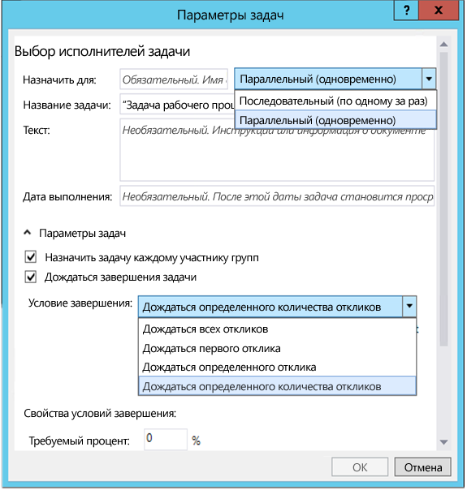
  
    
    

  
    
    

  
    
    

## Инструкции. Создание и назначение задач в настраиваемых рабочих процессах

Ниже приведен обзор, в котором показано создание и назначение задач в настраиваемом рабочем процессе. Перед началом убедитесь, что у вас есть доступ к Сайту разработчика SharePoint 2013.
  
    
    

### 1. Создание нового проекта приложения SharePoint 2013


1. Создайте новый проект приложения SharePoint 2013 и настройте этот его как Надстройки, размещаемые в SharePoint.
    
  
2. Добавьте к этому проекту новый экземпляр списка **Announcement**, который будет использоваться как контейнер для элементов, использующихся для тестирования рабочего процесса.
    
  
3. Добавьте к проекту элемент рабочего процесса, щелкнув по значку проекта правой кнопкой мыши в **обозревателе решений** и последовательно выбрав элементы **Добавить** и **Новый элемент**.
    
  
4. В диалоговом окне **Добавить новый элемент** выберите элемент проекта **Рабочий процесс** в категории **Office/SharePoint** и назовите его CustomTaskWorkflow, а затем нажмите кнопку **Далее**.
    
  

### 2. Сбор сведений об элементе нового извещения

В рабочем процессе создайте задачу и назначьте ее пользователю, создавшему элемент списка извещений, который запускает рабочий процесс. Этот элемент списка самостоятельно предоставит сведения для рабочего процесса. Используйте действие **LookupSPListItemProperties**, возвращающее динамическое значение из веб-службы REST, которую оно вызывает в SharePoint. После этого сохраните это значение в новой переменной с именем **AnnouncementItemProperties**, изменив тип ее данных на **DynamicValue**.
  
    
    

1. Создайте переменную **AnnouncementItemAuthorId** для хранения идентификатора пользователя, создавшего элемент списка, как показано на рисунке 5.
    
   **Рисунок 5. Действие LookupSPListItemProperties**

  

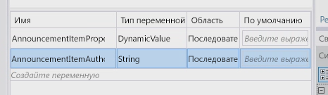
  

  

  
2. Перетащите действие **LookupSPListItem** в рабочую область конструирования рабочего процесса и задайте для свойства **ListID** значение _(current list)_.
    
  
3. Задайте для параметра **ItemId** значение _(current item)_.
    
  
4. Задайте для результата **Result** переменную **AnnouncementItemProperties**, созданную ранее.
    
  
5. Чтобы получить автора элемента из переменной, щелкните ссылку **Получить свойства** в области действия **LookupSPListItem** и добавьте действие **GetDynamicValueProperties** в рабочую область конструирования. Задайте для свойства **Source** результат действия **LookupSPListItem**.
    
  
6. Нажмите кнопку **[…]** на свойстве **Properties**, чтобы отобразить диалоговое окно **Свойства**.
    
  
7. В диалоговом окне **Свойства** выберите из списка **Тип сущности** пункт **Элемент списка извещений**, как показано на рисунке 6.
    
  
8. Назначьте для свойства пути **Автор** переменную **AnnouncementItemAuthorId**, как показано на рисунке 6.
    
   **Рисунок 6. Диалоговое окно "Свойства"**

  

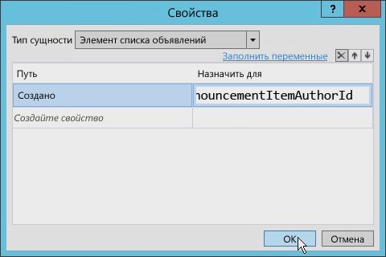
  

  

  

### 3. Создание и назначение задачи

На этом этапе можно создать и назначить задачу для автора элемента извещения.
  
    
    

1. На панели инструментов добавьте действие **SingleTask** в рабочую область конструирования рабочего процесса.
    
  
2. Щелкните ссылку **Настроить** в области действия, чтобы открыть диалоговое окно **Параметры задачи**.
    
  
3. Задайте для свойства **Кому назначено** переменную, которая используется для хранения идентификатора автора.
    
  
4. Измените заголовок и описание задачи, как показано на рисунке 7.
    
   **Рисунок 7. Диалоговое окно "Параметры задачи"**

  

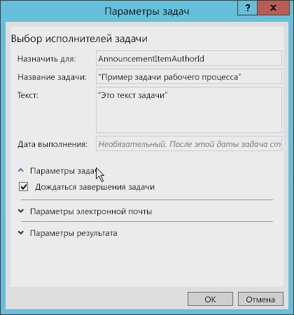
  

  

  
В диалоговом окне **Параметры задачи** можно задать несколько других параметров. Например, можно настроить рабочий процесс так, чтобы он ожидал завершения задачи, просто установив флажок в этом окне (см. рисунок 7). Чтобы сделать это в предыдущих версиях SharePoint, требовались сложные обходные пути.
  
    
    
Обратите внимание, что на рисунке 8 показаны параметры электронной почты, которые можно задать. Например, можно задать отправку электронных сообщений в случае просроченных задач, а также указать частоту отправки напоминаний. 
  
    
    

**Рисунок 8. Параметры электронной почты**

  
    
    

  
    
    
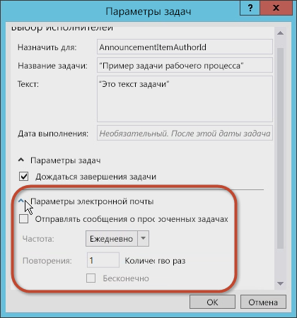
  
    
    
Можно также задать параметры результатов задачи. Выберите тип контента для задач рабочего процесса, а также значения для элементов **Поле результата** и **Результат по умолчанию**, как показано на рисунке 9.
  
    
    

**Рисунок 9. Параметры результатов**

  
    
    

  
    
    
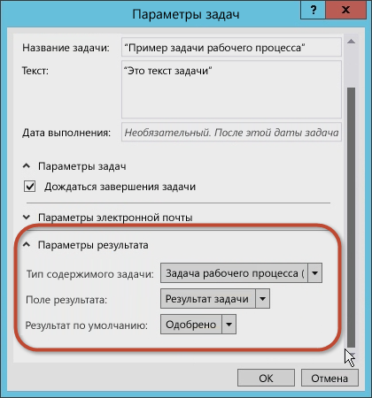
  
    
    

  
    
    

  
    
    

### 4. Проверка и изменение свойств задачи

Задав значения в диалоговом окне **Параметры задачи**, выберите действие **SingleTask** и изучите сетку свойств **Свойства** (см. рисунок 10).
  
    
    

**Рисунок 10. Окно инструментов "Свойства"**

  
    
    

  
    
    
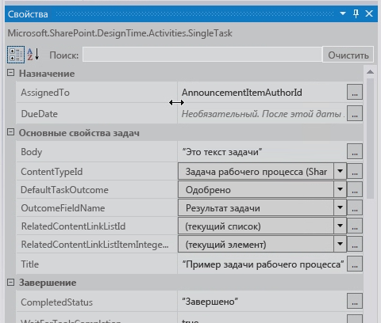
  
    
    
С помощью сетки свойств **Свойства** можно указать, нужно ли ожидать окончания задачи перед продолжением. Вы можете также настроить электронные сообщения, которые создаются при выполнении задачи, включая первоначальное электронное сообщение о назначении, сообщение о просроченной задаче и сообщение об отмене задачи.
  
    
    
Обратите внимание, что свойство **Outcome** автоматически создало для задачи переменную с именем **outcome_0**. Чтобы увидеть содержимое этой переменной, добавьте действие **WriteToHistory** в рабочую область конструирования и обновите сообщение, чтобы записывался результат, как показано на рисунке 11.
  
    
    

**Рисунок 11. Значение свойства Outcome**

  
    
    

  
    
    
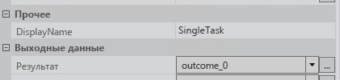
  
    
    

  
    
    

  
    
    

### 5. Тестирование рабочего процесса

Чтобы протестировать рабочий процесс:
  
    
    

1. Нажмите клавишу **F5**, чтобы создать и запустить, или кнопку **Начать** в Visual Studio 2012. Если вы тестируете локальную установку SharePoint 2013, Visual Studio 2012 запускает служебную программу Test Service Host в Workflow Manager и выполняет развертывание рабочего процесса на Сайте разработчика. Через некоторое время откроется Сайт разработчика.
    
  
2. Перейдите к списку **Извещения** и создайте элемент списка, а затем запустите настраиваемый рабочий процесс вручную.
    
  
3. Вернитесь на страницу состояния экземпляра рабочего процесса, чтобы найти задачу, созданную рабочим процессом. Щелкните задачу, чтобы открыть форму. Обратите внимание на поля **Имя задачи** и **Кому назначено**, заданные в рабочем процессе, как показано на рисунке 12.
    
   **Рисунок 12. Форма задачи**

  


  

  

  
4. Вернитесь к задаче, отредактируйте форму и нажмите кнопку **Утвердить** или **Отклонить**, чтобы завершить задачу. Обратите внимание, что результат задачи для экземпляра рабочего процесса отображается в списке **Журнал рабочего процесса**, как показано на рисунке 13.
    
   **Рисунок 13. Список "Журнал рабочего процесса"**

  

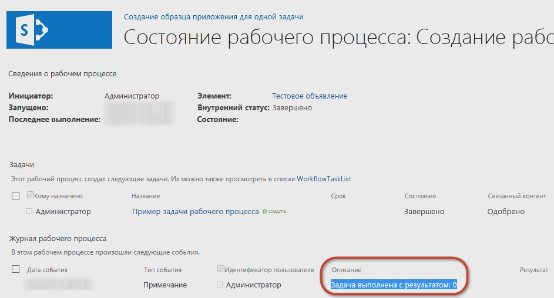
  

  

  

## Инструкции. Создание настраиваемого типа задачи с настраиваемым результатом

В предыдущем обзоре было описано, как создать простую задачу и настроить ее свойства. Однако иногда параметры по умолчанию могут не отвечать вашим потребностям. Возьмем, к примеру, задачу, в которой от кого-то требуется просмотреть документ. После рассмотрения чернового варианта документа рецензент должен выполнить одно из двух действий: отправить документ назад автору на доработку или переслать документ редактору. К сожалению, ни один из параметров по умолчанию ( **Утвердить** или **Отклонить**) не отвечает потребностям рецензента. Здесь бы больше подошли параметры "Вернуть автору" или "Переслать редактору".
  
    
    
При создании рабочих процессов с помощью SharePoint Designer 2013 или Visual Studio 2012 можно создать настраиваемые задачи рабочего процесса, в которые входят настраиваемые результаты задач. Для этого создайте настраиваемую задачу как отдельный тип контента, а затем добавьте настраиваемый столбец сайта, в котором определены желаемые результаты. Настраиваемый столбец можно получить из типа поля с именем **OutcomeChoice** (поля выбора).
  
    
    
Однако такой подход может вызвать затруднение. Оно связано с тем, настраиваемая задача создается на основе типа контента **Workflow Task (SharePoint 2013)**, включающего столбец сайта **TaskOutcome** по умолчанию с параметрами **Утверждено** и **Отклонено**. Однако этот параметр по умолчанию можно обойти, удалив столбец **TaskOutcome** из типа контента настраиваемой задачи и убедившись в его отсутствии в списке задач рабочего процесса. Иначе будут отображаться несколько параметров. Возьмем, к примеру, настраиваемый результат, в котором два параметра: "Реальные данные" и "Желаемые данные". Если не удалить результат по умолчанию, то пользователи, выполняющие эту задачу, увидят все доступные параметры результата, как показано на рисунке 14, даже если они неприменимы.
  
    
    

**Рисунок 14. Параметры результата**

  
    
    

  
    
    
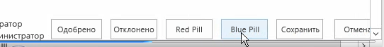
  
    
    
Рекомендуем для каждого типа создаваемой задачи создать свой список задач рабочего процесса. 
  
    
    

### Создание проекта приложения SharePoint 2013

Прежде чем приступать к пошаговому руководству по созданию настраиваемой задачи рабочего процесса с помощью Visual Studio 2012, получите доступ к Сайту разработчика SharePoint 2013. 
  
    
    

1. В Visual Studio 2012 создайте проект приложения SharePoint 2013, настроенный как Надстройки, размещаемые в SharePoint.
    
  
2. Добавьте к этому проекту новый экземпляр списка **Announcement**. Вы будете использовать его как контейнер для элементов, позволяющих протестировать рабочий процесс.
    
  
3. Добавьте к проекту элемент рабочего процесса, щелкнув по значку проекта правой кнопкой мыши в **обозревателе решений** и последовательно выбрав элементы **Добавить** и **Новый элемент**.
    
  
4. В диалоговом окне **Добавить новый элемент** выберите элемент проекта **Рабочий процесс** в категории **Office/SharePoint** и назовите его CustomTaskWorkflow, а затем нажмите кнопку **Далее**.
    
  

### Создание столбца настраиваемого результата

Создав список **Announcements**, создайте настраиваемый тип контента, содержащий настраиваемую задачу и столбец сайта для поля настраиваемого результата. 
  
    
    

1. Щелкните проект правой кнопкой мыши и последовательно выберите элементы **Добавить** и **Новый элемент**.
    
  
2. Выберите шаблон элемента проекта **Столбец сайта** и задайте для имени этого поля значение CustomOutcomeColumn. В шаблон столбца сайта не нужно вносить много изменений.
    
  
3. Задайте типу поля для столбца значение **OutcomeChoice** (обязательный для заполнения тип поля для столбца результата).
    
  
4. Удалите столбец **Обязательно**.
    
  
5. Так как в основе типа поля **OutcomeChoice** лежит тип поля выбора, вы можете добавить несколько своих вариантов.
    
  
Ниже приведена разметка нового настраиваемого столбца сайта.
  
    
    


```XML

<?xml version="1.0" encoding="utf-8"?>
<Elements xmlns="http://schemas.microsoft.com/sharepoint/">  
  <Field
       ID="{7b7edd9e-f5d1-4558-a2c8-e733dcfb0a5e}"
       Name="CustomSiteColumn"
       DisplayName="Better State"
       Type="Choice"
       Required="FALSE"
       Group="Custom Site Columns">
       <CHOICES>
         <CHOICE>Florida</CHOICE>
         <CHOICE>Georgia</CHOICE>
       </CHOICES>
       <Default>Florida</Default>
  </Field>
</Elements>
```


### Создание типа контента настраиваемой задачи

Создав столбец сайта, создайте специальный тип контента для настраиваемой задачи.
  
    
    

1. Добавьте элемент проекта нового типа контента в проект с именем **CustomTaskContentType**.
    
  
2. Когда отобразится запрос о выборе типа контента в качестве основы, выберите **Workflow Task (SharePoint 2013)**.
    
  
3. Затем добавьте столбец настраиваемого результата к списку доступных столбцов и удалите столбец результата по умолчанию, чтобы разметка типа контента выглядела так, как показано ниже.
    
  ```XML
  
<?xml version="1.0" encoding="utf-8"?>
<Elements xmlns="http://schemas.microsoft.com/sharepoint/">
  <!-- Parent ContentType: Workflow Task (SharePoint 2013) (0x0108003365C4474CAE8C42BCE396314E88E51F) -->
  <ContentType 
      ID="0x0108003365C4474CAE8C42BCE396314E88E51F00D368DFB2B31A447BB184BA1334E5119E" 
      Name="CustomContentType" 
      Group="Custom Content Types" 
      Description="My Content Type" 
      Inherits="TRUE" Version="0">
      <FieldRefs>
         <FieldRef 
            ID="{7b7edd9e-f5d1-4558-a2c8-e733dcfb0a5e}" 
            DisplayName="Better State" 
            Required="FALSE" 
            Name="CustomSiteColumn" />
            <RemoveFieldRef 
               ID="{55B29417-1042-47F0-9DFF-CE8156667F96}" 
               Name="TaskOutcome" />
      </FieldRefs>
  </ContentType>
</Elements>
  ```


### Создание рабочего процесса

Теперь создайте рабочий процесс, чтобы протестировать настраиваемый столбец сайта и тип контента. 
  
    
    

1. Добавьте рабочий процесс к проекту и настройте его как рабочий процесс списка.
    
  
2. Добавьте сопоставление с этим рабочим процессом, используя ранее созданный список **Извещения**.
    
  
3. Создайте новую переменную типа **DynamicValue** и назовите ее ItemProperties. Мы будем использовать эту переменную для хранения элемента, который запускает свойства рабочего процесса.
    
  
4. Создайте переменную **Int32** и назовите ее ItemAuthorId, как показано на рисунке 15.
    
   **Рисунок 15. Создание переменной рабочего процесса**

  

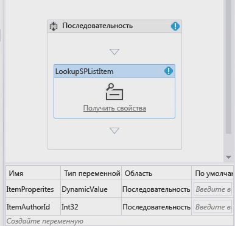
  

  

  

### Сбор свойств элементов списка

Теперь соберите свойства элементов списка.
  
    
    

1. Перетащите действие **LookupSPListItem** в рабочую область конструирования и задайте для свойства **ListID** значение _(current list)_, а для свойства **ItemId** — значение _(current item)_. 
    
  
2. Далее задайте для результата **Result** переменную **ItemProperties** **DynamicValue**, созданную ранее.
    
  
3. Чтобы получить автора элемента из переменной, щелкните ссылку **Получить свойства** в области действия **LookupSPListItem** и добавьте действие **GetDynamicValueProperties** в рабочую область конструирования.
    
  
4. Автоматически задайте для свойства **Source** элемента результат действия **LookupSPListItem**.
    
  
5. Нажмите кнопку **[…]** на свойстве **Properties**, чтобы отобразить диалоговое окно **Свойства**.
    
  
6. Задайте для поля **Entity Type** значение **List Item of Announcements**, чтобы создать контекст для диалогового окна, и назначьте для свойства пути **Created By** переменную **ItemAuthorId**, как показано на рисунке 16.
    
   **Рисунок 16. Диалоговое окно "Свойства"**

  

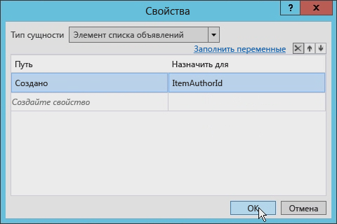
  

  

  

### Создание одиночной задачи

Теперь можно создать одиночную задачу. 
  
    
    

1. Добавьте действие **SingleTask** в рабочую область конструирования.
    
  
2. Щелкните ссылку **Настроить** в области действия, чтобы открыть диалоговое окно **Параметры задачи**.
    
  
3. Введите для поля **Основная часть** любую строку, а затем задайте для свойства **Кому назначено** переменную, которая используется для хранения идентификатора автора (в нашем случае это **ItemAuthorId**).
    
  
4. Измените заголовок задачи, как показано на рисунке 17.
    
   **Рисунок 17. Определение заголовка задачи**

  

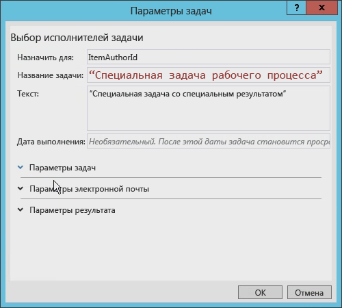
  

  

  
5. Настройте раздел **Параметры результата** так, чтобы использовать новый настраиваемый тип контента и столбец настраиваемого результата.
    
    В этом диалоговом окне определяются доступные варианты с учетом всех типов контента, созданных на основе типа контента **Workflow Task (SharePoint 2013)**, как показано на рисунке 18.
    

   **Рисунок 18. Настройки раздела "Параметры результата"**

  


  

  

  

### Обновление поля AssignedTo

Чтобы продолжить, обновите поле **AssignedTo** для действия **SingleTask**, так как пока в него можно ввести строку, а не целое число. Чтобы исправить это, добавьте **ToString()** в конце выражения.
  
    
    
Кроме того, обратите внимание, что свойство **Outcome** автоматически создало переменную с именем **outcome_0**. Чтобы увидеть содержимое переменной, добавьте действие **WriteToHistory** в рабочую область конструирования и обновите сообщение для отображения результата.
  
    
    

### Обновление списка задач рабочего процесса

Последний этап — настройка списка задач рабочего процесса. По умолчанию список задач, создаваемый приложением, допускает только тип контента **Workflow Task (SharePoint 2013)**. Этот рабочий процесс использует настраиваемый тип контента для настраиваемого результата. Откройте файл  `Elements.xml` для списка задач рабочего процесса и измените атрибут **ContentTypeId** для элемента **<ContentTypeBinding>** так, чтобы он соответствовал типу контента в проекте, как показано в примере кода ниже.
  
    
    

```XML

<?xml version="1.0" encoding="utf-8" ?>
<Elements xmlns="http://schemas.microsoft.com/sharepoint/">
  <ListInstance 
      FeatureId="{f9ce21f8-f437-4f7e-8bc6-946378c850f0}"
      TemplateType="171"
      Title="WorkflowTaskList"
      Description="This list instance is used for workflow Task items."
      Url="Lists/WorkflowTaskList"
      RootWebOnly="FALSE" />
  <!-- CustomContentType -->
  <ContentTypeBinding 
      ListUrl="Lists/WorkflowTaskList"
      RootWebOnly="FALSE"
      ContentTypeId="0x0108003365C4474CAE8C42BCE396314E88E51F00D368DFB2B31A447BB184BA1334E5119E"/>
</Elements>
```


### Тестирование задачи с настраиваемым контентом и настраиваемого результата задачи

Теперь протестируйте рабочий процесс. 
  
    
    

1. В Visual Studio 2012 нажмите клавишу **F5**, а затем — кнопку **Начать**. Если тестируется локальная установка SharePoint 2013, Visual Studio 2012 запустит служебную программу Test Service Host в Workflow Manager и выполнит развертывание рабочего процесса на Сайте разработчика. Через некоторое время откроется Сайт разработчика.
    
  
2. Перейдите к списку **Извещения** и создайте элемент, а затем запустите настраиваемый рабочий процесс вручную.
    
  
3. После этого вернитесь на страницу состояния экземпляра рабочего процесса, чтобы найти задачу, созданную рабочим процессом.
    
  
4. Выберите задачу и переключитесь в режим редактирования, нажав кнопку **Редактировать** на ленте. В нижней части формы должны быть четыре кнопки. Первые две кнопки — кнопки настраиваемого результата, с нажатием которых задача помечается как завершенная. Вторые две кнопки — кнопки **Сохранить** и **Отмена** по умолчанию, которые позволяют обновить элемент списка, не завершая задачу, как показано на рисунке 19.
    
   **Рисунок 19. Кнопки настраиваемого результата**

  

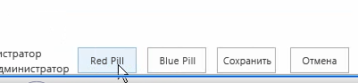
  

  

  

## Вывод

Корпорация Майкрософт представила рабочие процессы в платформе SharePoint 2007, и в SharePoint 2010 они практически не изменились (это касается и архитектуры, внедрения или процесса). То же самое можно сказать и о задачах в рабочих процессах SharePoint. Однако с выходом SharePoint 2013 было внесено много изменений в архитектуру и внедрение рабочих процессов.
  
    
    
Эта статья содержит описание изменений в задачах рабочих процессов, вызванных изменениями в рабочих процессах SharePoint 2013. В ней показано, как создать простой рабочий процесс, использующий задачи в SharePoint 2013 благодаря Visual Studio 2012. Такие типы задач подходят для многих разработчиков, хотя иногда нужны настраиваемые задачи и результаты, которых можно добиться с помощью Visual Studio 2012, как было показано выше.
  
    
    

## Дополнительные ресурсы
<a name="bk_addresources"> </a>


-  [Рабочие процессы в SharePoint 2013](http://msdn.microsoft.com/ru-ru/library/jj163986.aspx)
    
  
-  [Авторизация и проверка подлинности приложений для SharePoint 2013](http://msdn.microsoft.com/ru-ru/library/office/fp142384.aspx)
    
  
-  [Инструкция. Настройка представления списка в приложениях для SharePoint с использованием способа отображения на стороне клиента](http://msdn.microsoft.com/ru-ru/library/jj220045.aspx)
    
  

