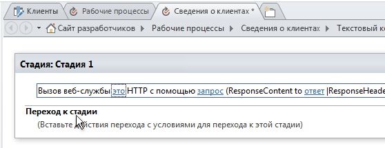
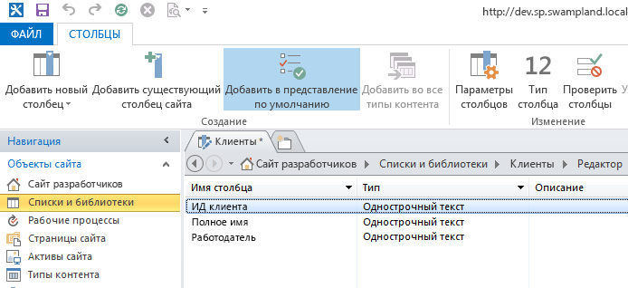
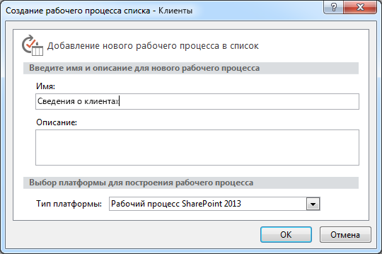
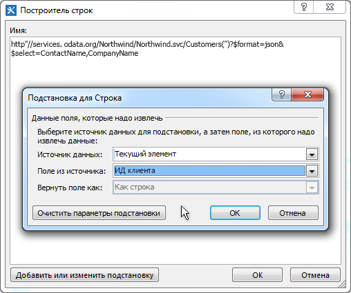
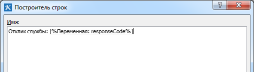
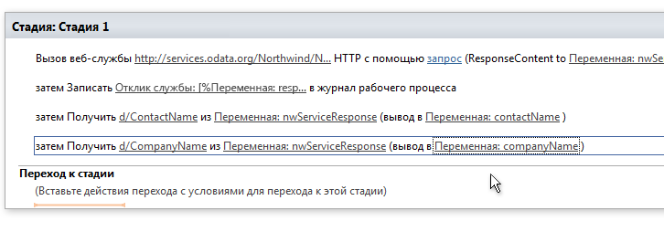
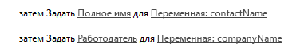
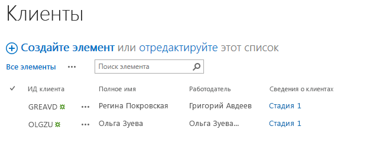

# Работа с веб-службами в рабочих процессах SharePoint 2013 с помощью SharePoint Designer 2013
В этой статье демонстрируется использование веб-служб в рабочих процессах SharePoint Designer 2013. 
 **Автор:** [Эндрю Коннелл (Andrew Connell)](http://social.msdn.microsoft.com/profile/andrew%20connell%20%5bmvp%5d/),  [www.AndrewConnell.com](http://www.andrewconnell.com)
  
    
    

Корпорация Майкрософт использует новых подход к рабочим процессам в SharePoint Server 2013. Группа, отвечающая за рабочие процессы, вместе с группой разработчиков Microsoft Azure создали новый продукт, Workflow Manager. Workflow Manager служит хостом для последней версии среды выполнения Windows Workflow Foundation и предоставляет все необходимые службы, а также использует шину обслуживания Microsoft Azure для улучшения производительности и масштабируемости. После развертывания он выполняется одинаковым образом в локальном развертывании или в облаке. Что наиболее важно, SharePoint 2013 делегирует выполнение всех рабочих процессов и связанных задач ферме Workflow Manager, внешней для SharePoint 2013.
Одно из существенных изменений архитектуры рабочих процессов состоит в том, что теперь все рабочие процессы создаются декларативно в области конструктора, в том числе процессы, созданные с помощью Visual Studio 2012. В предыдущих версиях SharePoint рабочие процессы, разработанные в Visual Studio 2012, не были полностью декларативными, а представляли собой смесь декларативного кода XAML и скомпилированной сборки, содержащей бизнес-логику рабочего процесса.
  
    
    

Для пользователей, создававших рабочие процессы с помощью SharePoint Designer ранее, ничего нового нет. Рабочие процессы в SharePoint Designer всегда были полностью декларативными. Это изменение не даст преимуществ пользователям, создававшим рабочие процессы в SharePoint Designer 2013, потому что теперь рабочие процессы SharePoint Designer 2013 поддерживают вызов и использование веб-служб.
## Важность веб-служб для рабочих процессов SharePoint 2013

Начнем со сценариев, в которых использование веб-служб имеет смысл. Во времена SharePoint 2007 или SharePoint 2010 часто требовалось написание настраиваемого кода при создании рабочих процессов с помощью Visual Studio, потому что это был лучший метод для вычислений или реализации настраиваемой бизнес-логики. Если же возникала ситуация, когда встроенных действий было недостаточно для ваших потребностей, вы обращались к настраиваемому коду в управляемой сборке.
  
    
    
С другой стороны, для пользователей SharePoint Designer 2013, не занимающихся разработкой, это было не так просто. В ситуациях, когда существующих действий рабочего процесса не хватало, приходилось призывать на помощь разработчика для написания настраиваемого действия. Зачастую это было сложно, так как можно было создать код только для песочницы (в размещенной среде) или можно было использовать только решения с полным доверием (в локальном развертывании). В других случаях рабочий процесс приходилось полностью отдавать в руки разработчика для создания решения с полным доверием, так как необходимые задачи было невозможно выполнить в SharePoint Designer.
  
    
    
Теперь хорошая новость: в мире SharePoint 2013, когда в SharePoint Designer 2013 отсутствует требуемое действие, вам необходимо создать пользовательскую веб-службу. А этом гораздо проще, чем создать настраиваемое действие. Кроме того, настраиваемое действие может использоваться только рабочим процессом, в котором оно установлена (или, в лучшем случае, только рабочим процессом SharePoint), пользовательскую веб-службу можно переносить и использоваться для любого количества задач.
  
    
    
Возможно, самое главное преимущество состоит в следующем: если вам необходим доступ к существующей веб-службе, общедоступной или частной, размещенной в вашей компании, SharePoint Designer 2013 теперь предоставляет действие для вызова веб-службы. Больше не нужно обращаться к разработчику для вызова существующей веб-службы.
  
    
    
Хотя SharePoint 2013 может использовать любой тип веб-службы, самый простой (и рекомендуемый способ) — использование веб-служб, которые принимают и возвращают данные в стандартных форматах  [OData](http://www.odata.org/) протоколов [Atom](http://msdn.microsoft.com/ru-ru/library/ff478141.aspx) или [JSON](http://json.org/) (JavaScript Object Notation).
  
    
    
Эта рекомендация основана на том, что они поддерживают эти форматы OData в средствах создания рабочих процессов SharePoint 2013 (SharePoint Designer 2013 и Visual Studio 2012). Оба средства поддерживают создание полезной нагрузки для передачи службе и обработки ответов от веб-служб. Кроме того, форматы OData поддерживают взаимодействие с анонимными веб-службами, а также службами, защищенными различными типами проверки подлинности. Проще говоря, вы получаете полный контроль на запросом и ответом каждого вызова службы. Это позволяет использовать последовательность действий в рабочем процессе сначала для проверки подлинности с помощью одной службы и получения маркера OAuth, а затем для добавления этого маркера в будущие запросы к службам, защищенным с помощью протокола  [OAuth 2.0](http://oauth.net/2/).
  
    
    

## Использование веб-служб в рабочих процессах SharePoint

Вызов веб-служб из рабочих процессов с помощью SharePoint 2013 состоит из двух этапов: вызов веб-службы и обмен данными с ней.
  
    
    
В рабочих процессах SharePoint 2013 вы вызываете веб-службу, используя новое действие, представленное в SharePoint 2013 — **Call HTTP Web Service**. Это гибкое действие, легко позволяющее выполнять простые вызовы к веб-службе. При необходимости вы можете создавать более сложные вызовы, используя HTTP-команды и добавляя заголовки HTTP. На рис. 1 показано действие **Call HTTP Web Service** в области SharePoint Designer 2013.
  
    
    

**Рис. 1. Этап SharePoint Designer 2013 с изображением действия "Вызов веб-службы HTTP"**

  
    
    

  
    
    

  
    
    
Действие **Call HTTP Web Service** позволяет указать любой из нескольких методов запроса, в том числе **GET**, **PUT**, **POST** и **DELETE**. Так вы сможете сообщить веб-службам, в частности, службам  [с поддержкой REST](http://msdn.microsoft.com/ru-ru/library/office/jj164022.aspx), что делать со службой, указанной в свойстве URI действия.
  
    
    
Например, чтобы получить все свойства определенного элемента, URL-адрес службы должен содержать уникальный адрес элементы, а в качестве метода необходимо выбрать **GET**. Чтобы удалить элемент, используется тот же процесс, только выбирается метод **DELETE**. Аналогично элемент и обновляется с помощью метода **POST**. При создании элемента присвойте URL-адресу уникальный адрес коллекции, где будет создан элемент, а затем выберите метод **POST**. При создании или обновлении элементов службам обычно нужны данные, которые передаются как содержимое запроса, поэтому укажите свойство **request** в действии **Call HTTP Web Service**.
  
    
    
Второй этап работы с веб-службами связан с передачей данных веб-службе и получением данных от нее, для чего используется свойство **request** или **response** действия **Call HTTP Web Service**. Но обратите внимание, что подобно потоку данные передаются как сложная структура с помощью объекта  [DynamicValue](http://msdn.microsoft.com/ru-ru/library/windowsazure/microsoft.activities.dynamicvalue%28v=azure.10%29.aspx). (Дополнительные сведения о динамических значениях см. в статье  [Общие сведения о динамических значениях](http://msdn.microsoft.com/ru-ru/library/windowsazure/jj193505%28v=azure.10%29.aspx).)
  
    
    
Структуры данных динамических значений форматируются как строки Нотация объектов JavaScript (JSON). Однако вместо того чтобы просить разработчика создавать и обрабатывать строки вручную в рабочем процессе, корпорация Майкрософт предоставила тип объекта **DynamicValue**, который можно использовать для хранения иерархических данных и ответа для вызова веб-службы. 
  
    
    
С типом **DynamicValue** связан ряд действий, с помощью которых можно подсчитывать число элементов в ответе, извлекать значения из ответа или создавать новую структуру для обновления и создания элементов. Обратите внимание, что SharePoint Designer 2013 не поддерживает работу напрямую с типом **DynamicValue**, поэтому авторам рабочих процессов необходимо использовать **Dictionary**.
  
    
    

## Создание веб-служб для рабочих процессов SharePoint 2013

Итак, мы узнали, что SharePoint Designer 2013 поддерживает вызов веб-служб, но  *не*  поддерживает вызов настраиваемого кода из рабочих процессов. Поэтому вам потребуется узнать, как создать веб-службу, чтобы расширить возможности рабочих процессов.
  
    
    
К счастью, существует множество вариантов для создания настраиваемых веб-служб, используемых в рабочих процессах SharePoint 2013. В частности, действие **HttpSend** и тип данных **DynamicValue** идеально подходят для создания веб-служб с поддержкой REST, которые соответствуют протоколу OData.
  
    
    
 OData — это протокол для создания и использования данных на основе принципов служб REST. Он был разработано для стандартизации обмена данными с использованием проверенных и надежных протоколов HTTP. После завершения спецификации OData различные организации реализовали этот протокол в собственных стеках технологий. Корпорация Майкрософт реализовала собственную версию OData под названием [WCF Data Services](http://msdn.microsoft.com/ru-ru/library/hh487257%28v=vs.103%29.aspx).
  
    
    
Ниже описываются два типичных сценария, в которых веб-службы с поддержкой REST будут полезны для разработчиков рабочих процессов:
  
    
    

- реализация операций CRUD-Q службы OData;
    
  
- реализация операций службы OData.
    
  

### Реализация операций CRUD-Q службы OData

Веб-службы часто используются для выполнения простых операций создания, чтения, обновления, удаления и запрос (CRUD-Q) с данными в базе данных. Создать веб-службу OData для рабочего процесса SharePoint 2013 с помощью WCF Data Services довольно просто. Вы можете изучить пошаговые руководства и примеры создания веб-служб на сайтах  [WCF Data Services](http://msdn.microsoft.com/ru-ru/library/cc668792.aspx),  [www.OData.org](http://www.odata.org) и других.
  
    
    
Предположим, что у вас уже есть база данных, с которой можно работать. Тогда необходимо выполнить четыре простых действия.
  
    
    

1. Создайте модель базы данных, используя Microsoft  [Entity Framework](http://msdn.microsoft.com/ru-ru/data/aa937723). Код для этого не требуется, поскольку используется мастер в Visual Studio. Дополнительные сведения см. в статье, посвященной  [Entity Framework 4.0 и WCF Data Services 4.0 в Visual Studio 2010](http://msdn.microsoft.com/ru-ru/magazine/ee336128.aspx), и статье, посвященной  [поддержке Entity Framework Designer в Visual Studio 2012](http://msdn.microsoft.com/ru-ru/magazine/jj721589.aspx).
    
  
2. Создайте службу WCF Data Services. Опять же, код не требуется, поскольку используется мастер Visual Studio. Дополнительные сведения см. в пошаговом руководстве  [Создание службы данных WCF и доступ к ней в Visual Studio](http://msdn.microsoft.com/ru-ru/library/vstudio/cc668184.aspx).
    
  
3. В файле кода службы задайте имя модели объекта, созданной на шаге 1, как источник службы. Затем настройте параметры доступа и разрешения для объектов в модели (оба шага реализуются двумя строками кода).
    
  
4. Опубликуйте службу в расположении, доступном Workflow Manager.
    
  

### Реализация операций службы OData

Довольно высока вероятность того, что вашему рабочему процессу потребуется выполнить определенную бизнес-логику в ограниченной модели CRUD-Q. Например, может существовать служба OData, поддерживающая операции CRUD-Q при создании нового банковского займа. Эта служба также может запрашивать кредитный рейтинг для получения текущей процентной ставки. Для такой задачи недостаточно простых операций CRUD-Q, поскольку она вызывает метод, передает в целое число и получает ответ.
  
    
    
Однако этот сценарий можно поддерживать с помощью OData и служб WCF Data Services, используя которых можно реализовать  [операции службы](http://msdn.microsoft.com/ru-ru/library/cc668788.aspx). Операции службы довольно распространены и используются даже в службах SharePoint 2013. Например, когда SharePoint извлекает определенный список, используя адрес в формате  `http://[..]/_api/web/lists/GetByTitle('ListTitle')`, функция **GetByTitle()** в адресе фактически представляет оператор службы, созданный группой SharePoint 2013. Как правило, разработчики создают свои пользовательские операции в веб-службах с помощью WCF Data Services.
  
    
    

## Создание рабочего процесса в SharePoint Designer 2013

В следующем примере показано, как создать настраиваемый рабочий процесс, вызывающий веб-службу OData базы данных Northwind, которая размещена в открытом доступе на сайте  [www.odata.org](http://www.odata.org). В этом примере пользователь вводит идентификатор клиента и затем запускает рабочий процесс, который принимает идентификатор клиента и использует его для отправки запроса к веб-службе, чтобы собрать дополнительные сведения о клиенте, в частности, полное имя и работодателя. Рабочий процесс получает эти сведения и обновляет элемент списка, добавляя имя клиента и работодателя.
  
    
    

### Создание списка клиентов

1. Создайте настраиваемый список в SharePoint Designer 2013 и назовите его "Клиенты".
    
  
2. Переименуйте поле **Заголовок** в **Идентификатор клиента**.
    
  
3. Добавьте два новых поля типа **String** и назовите их **Полное имя** и **Работодатель**, как показано на рис. 2.
    
   **Рис. 2. Создание списка клиентов в SharePoint Designer 2013**

  

  

  

  

### Создание рабочего процесса

1. В области навигации SharePoint Designer 2013 выберите параметр **Рабочие процессы**.
    
  
2. На ленте нажмите кнопку **Рабочие процессы списка** и выберите **Клиенты** в раскрывающемся списке.
    
  
3. Назовите рабочий процесс "Получение сведений о клиенте".
    
  
4. Выберите для параметра **Тип платформы** значение **Рабочий процесс SharePoint 2013**, как показано на рис. 3.
    
   **Рис. 3. Создание рабочего процесса списка с помощью SharePoint Designer 2013**

  

  

  

  

### Запрос сведений о клиенте у веб-службы

После создания рабочего процесса нам необходимо включить его, чтобы вызвать веб-службу, для чего мы добавим действие **Вызов веб-службы HTTP** в стадию рабочего процесса по умолчанию.
  
    
    

1. Щелкните ссылку **это**.
    
  
2. Справа от текстового поля **Введите URL-адрес веб-службы HTTP** нажмите кнопку построителя ( **…**), чтобы открыть диалоговое окно **Построитель строк**.
    
  
3. В окне **Построитель строк** введите следующий URL-адрес: `http://services.odata.org/Northwind/Northwind.svc/Customers('CUSTOMERID')?$format=json&amp;$select=ContactName,CompanyName`. Обратите внимание, что часть " `$select`" этого URL-адреса получает только поля, связанные с данным списком. 
    
  
4. Найдите сегмент  `CUSTOMERID` в URL-адресе и удалите его. Не трогайте круглые скобки и одинарные кавычки.
    
  
5. Чтобы затем динамически создать полный URL-адрес, нажмите кнопку **Добавить или изменить подстановку** в окне **Построитель строк**.
    
  
6. В появившемся диалоговом окне **Поиск строки** задайте для параметра **Источник данных** значение **Текущий элемент**, а для параметра **Поле из источника** — значение **CustomerId**, как показано на рис. 4.
    
   **Рис. 4. Динамическое создание URL-адреса для запроса веб-службы**

  

  

  

  
7. Нажмите **ОК**дважды, чтобы принять новый URL-адрес.
    
    Мы реализовали получение результатов от веб-службы, Теперь нам нужно сохранить результаты в другой переменной.
    
  
8. В действии **Вызов веб-службы HTTP** щелкните ссылку **ответ** и создайте переменную типа **Dictionary** с именем **nwServiceResponse**.
    
    Все действие **Вызов веб-службы HTTP**, скорее всего, не видно, так как оно слишком длинное. Прокрутите вправо, после чего вы увидите, что код состояния ответа хранится в переменной **responseCode**. Это довольно удобно, так как мы можем записать что-нибудь на страницу статистики экземпляра рабочего процесса, используя список журнала рабочего процесса.
    
  
9. Добавьте действие **Записать в журнал** после действия **Вызов веб-службы HTTP** и задайте его **сообщение**, чтобы записать код состояния ответа в журнал, как показано на рис. 5.
    
   **Рис. 5. Запись кода ответа веб-службы в список журнала**

  

  

  

  

### Извлечение значений из ответа

Мы сохранили ответ веб-службы в переменной **nwServiceResponse**. Следующий шаг — извлечь эти значения и поместить их в локальных переменных.
  
    
    
Для этого мы добавим два действия **Получить элемент из словаря** в рабочий процесс. Обратите внимание, что путь к элементу, из которого мы собираемся извлечь значение, должен соответствовать структуре ответа и должен быть в определенном формате. Чтобы выяснить это, можно ввести URL-адрес в браузере и просмотреть ответ. Обратите внимание, что результаты размещаются в объекте **d** во вложенном виде. Поэтому путем к полю **CompanyName** в ответе веб-службы будет `d/CompanyName`.
  
    
    

1. Добавьте два действия **Получить элемент из словаря** в рабочий процесс.
    
  
2. В первом из новых действий установите для параметра **элемента по имени или пути** значение `d/ComopanyName`.
    
  
3. Установите для ссылки **словарь** значение **nwServiceResponse**.
    
  
4. Присвойте ссылке **элемент** новую переменную типа **String** с именем **CompanyName**.
    
  
5. Повторите шаги 2, 3 и 4 со вторым действием **Получить элемент из словаря**, но теперь используйте **ContactName** вместо "CompanyName", как показано на рис. 6.
    
   **Рис. 6. Извлечение значений из ответа словаря веб-службы**

  

  

  

  

### Обновление элемента списка

Последний шаг — обновление элемента списка с помощью двух действий **Установка поля в текущем элементе**. Эти действия присваивают полям в элементе списка значения, хранящиеся в созданных нами переменных, как показано на рис. 7.
  
    
    

**Рис. 7. Обновление элемента списка**

  
    
    

  
    
    

  
    
    
И, наконец, мы завершаем раздел **Переход к стадии** рабочего процесса.
  
    
    

1. Добавьте действие **Перейти к стадии**.
    
  
2. Выберите **Конец рабочего процесса**.
    
  
3. Сохраните и опубликуйте рабочий процесс.
    
  

### Проверка рабочего процесса

1. Откройте браузер и перейдите к списку **Клиенты**.
    
  
2. Добавьте два идентификатора клиентов из службы Northwind в два новых элементы списка, **ALFKI** и **ANATR**.
    
  
3. Вручную запустите рабочие процессы, выбрав каждый элемент, а затем нажав кнопку **Рабочие процессы** на ленте.
    
  
4. Выберите рабочий процесс **Получить сведения о клиенте**.
    
    На этом этапе рабочий процесс будет запущен и запросит данные у веб-службы.
    
  
5. Вернитесь к списку **Клиенты** и обновите страницу. Может потребоваться несколько обновлений для завершения рабочих процессов, но в итоге результаты должны выглядеть, как показано на рис. 8. Вы увидите элементы списка, в которые добавлены полное имя клиента и работодатель, полученные из веб-службы Northwind.
    
   **Рис. 8. Обновление элементов списка настраиваемым рабочим процессом**

  

  

  

  

## Заключение

В SharePoint 2013 представлена новая архитектура рабочих процессов на основе нового продукта, Workflow Manager 1.0. Чтобы все настраиваемые рабочие процессы работали независимо от типа развертывания SharePoint 2013 (локального или размещенного в Office 365), все рабочие процессы теперь на 100 % декларативные. Поддержка вызова веб-служб из рабочих процессов, созданных в SharePoint Designer 2013, дает более гибкие и мощные способы создания рабочих процессов, чем в предыдущих версиях.
  
    
    
 Корпорация Майкрософт ввела поддержку вызова веб-служба в Workflow Manager с помощью нового действия **Call HTTP Web Service** в SharePoint Designer 2013. В Workflow Manager также представлена поддержка создания структур для передачи веб-службам, а также получения ответов с помощью типа переменной **Dictionary**. При создании рабочих процессов используйте тип **Dictionary** и связанные действия в рабочих процессах SharePoint, которые применяют внешние веб-службы.
  
    
    

## Дополнительные ресурсы

-  [Рабочие процессы в SharePoint 2013](workflows-in-sharepoint-2013.md)
    
  
-  [OData](http://www.odata.org/)
    
  
-  [Знакомство с JSON](http://json.org/)
    
  
-  [Начало работы со службой REST SharePoint 2013](http://msdn.microsoft.com/ru-ru/library/office/fp142380.aspx)
    
  
-  [Entity Framework 4.0 и WCF Data Services 4.0 в Visual Studio 2010](http://msdn.microsoft.com/ru-ru/magazine/ee336128.aspx)
    
  

  
    
    

