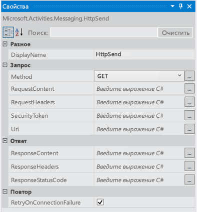
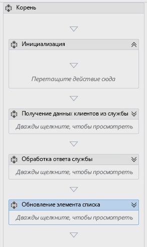
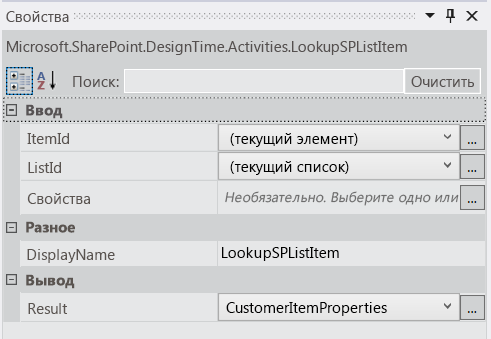
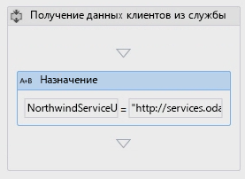
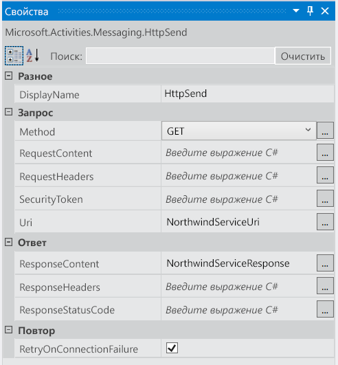
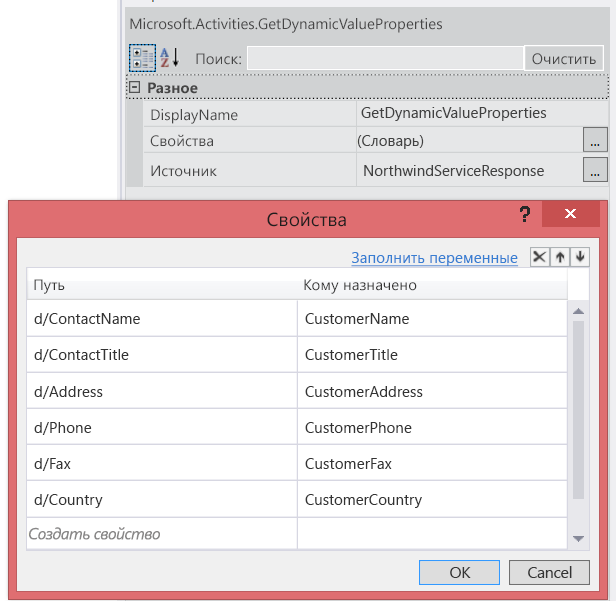
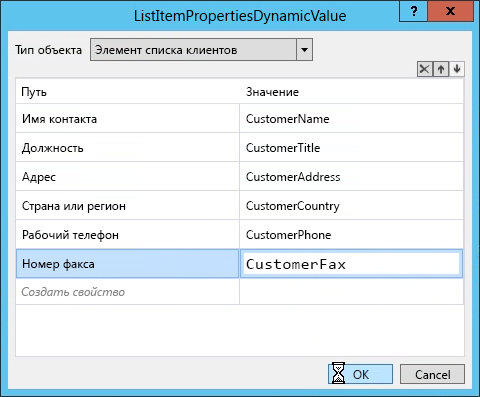
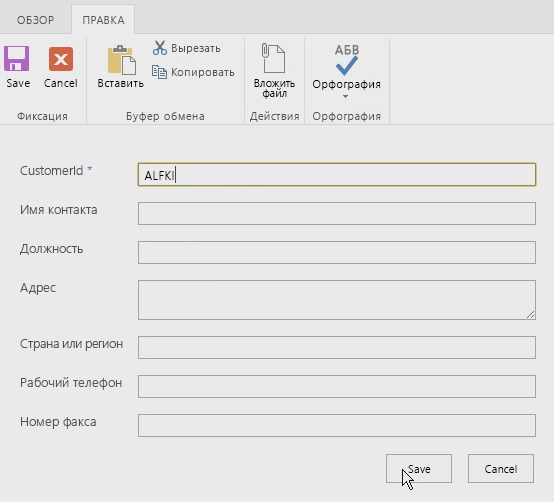
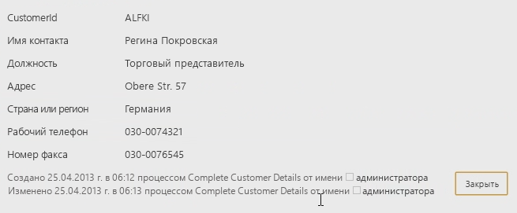

# Работа с веб-службами в рабочих процессах SharePoint 2013 с помощью Visual Studio 2012
Узнайте, как использовать веб-службы в рабочих процессах SharePoint 2013 с помощью Visual Studio 2012.
 **Кто предоставил:** [Эндрю Коннелл](http://social.msdn.microsoft.com/profile/andrew%20connell%20%5bmvp%5d/),  [AndrewConnell.com](http://www.andrewconnell.com)
  
    
    

  
    
    

> **Примечание**
> К этой статье прилагается пример законченного кода, который можно просматривать во время чтения или брать за основу при создании собственных проектов рабочих процессов SharePoint. Код можно скачать в коллекции исходных кодов MSDN:  [Работа с веб-службами в рабочих процессах SharePoint 2013 с помощью Visual Studio 2012](http://code.msdn.microsoft.com/Working-with-Web-in-46148199). 
  
    
    

  
    
    
В SharePoint Server 2013 корпорация Майкрософт существенно изменила подход к рабочим процессам. В сотрудничестве с командой Azure команда рабочих процессов создала продукт под названием Workflow Manager. В Workflow Manager размещается последняя версия среды выполнения Windows Workflow Foundation (4) и все необходимые службы (они характеризуются высоким уровнем доступности и масштабируемости). Производительность и масштабируемость обеспечивает служебная шина Microsoft Azure. Этот диспетчер работает одинаково в локальном развертывании и облаке. После подключения и настройки SharePoint 2013 выполнение всех рабочих процессов и сопутствующие задачи передаются в ферму Workflow Manager.В новой архитектуре все пользовательские рабочие процессы в SharePoint 2013, в том числе созданные с помощью Visual Studio 2012, являются полностью декларативными. В предыдущих версиях SharePoint рабочие процессы, разработанные в Visual Studio 2012, не были полностью декларативными, а представляли собой сочетание декларативной XAML и скомпилированной сборки. Управляемая сборка содержала бизнес-логику рабочего процесса.Это может шокировать опытных разработчиков SharePoint, которые могут задать следующий вопрос: "Как реализовать пользовательскую бизнес-логику без скомпилированной сборки?". Корпорация Майкрософт предлагает вместо этого создать настраиваемую веб-службу (в идеале — WCF, OData или RESTful), которая возвращает данные в формате Нотация объектов JavaScript (JSON), и использовать некоторые новые действия и объекты в этой новой версии. 
## Сценарии использования веб-служб в рабочих процессах SharePoint 2013

Не сложно представить сценарии, в которых используются настраиваемые веб-службы в рабочем процессе SharePoint 2013. Разработчики, которые создавали рабочие процессы в SharePoint 2007 или SharePoint 2010, привыкли работать с собственным кодом, так как эти рабочие процессы по своей природе были программными. В эти рабочие процессы не требовалось добавлять собственный код, но разработчики часто делали это.
  
    
    
Так как рабочие процессы SharePoint 2013 являются полностью декларативными, теперь часто, вместо того чтобы писать собственный код, необходимо использовать код, созданный во внешней веб-службе, которая вызывается и используется рабочим процессом. 
  
    
    
Рабочие процессы SharePoint 2013 могут использовать любые веб-службы. Тем не менее рабочим процессам проще всего взаимодействовать с веб-службами, которые передают данные по протоколу Open Data ( **OData** ) в форматах **Atom** или **json**. OData — это наиболее подходящий вариант, так как его полностью поддерживают средства разработки рабочих процессов SharePoint 2013 (как SharePoint Designer 2013, так и Visual Studio 2012).
  
    
    
Кроме того, поддерживаются как анонимные веб-службы, так и веб-службы, использующие различные типы проверки подлинности. На самом деле, вы полностью контролируете запросы и ответы при каждом вызове службы. Таким образом, например, с помощью ряда действий в рабочем процессе можно сначала выполнить проверку подлинности, используя одну службу для получения токена OAuth, а затем включить этот токен в последующие запросы к службам, защищенные с помощью  [OAuth 2.0](http://oauth.net/2/).
  
    
    

## Использование веб-служб в рабочих процессах

Работа с веб-службами в рабочих процессах SharePoint 2013 включает два этапа. Первый — вызов веб-службы с помощью нового действия **HttpSend**, представленного в SharePoint 2013. Действие **HttpSend** позволяет вызывать простейшие веб-службы, а также предоставляет HTTP-команды и определенные заголовки HTTP для более сложных задач. На рис. 1 показан ряд свойств действия **HttpSend**.
  
    
    

**Рис. 1. Окно "Свойства" для действия HttpSend**

  
    
    

  
    
    

  
    
    
Также необходимо указать тип метода, который вы хотите использовать в запросе на обслуживание. Обратите внимание, что на рисунке 1 в блоке **Запрос** можно указать тип метода (в этом случае — **GET**). Доступны (среди прочих) следующие типы: **GET**, **PUT**, **POST** и **DELETE**. Это основной способ определения действий, которые веб-службы, в частности службы RESTful, должны выполнять с ресурсами, определенными в универсальном коде ресурса (URI) действия.
  
    
    
Например, чтобы получить все свойства определенного элемента, **Uri** должен содержать уникальный адрес элемента, а в качестве метода необходимо задать **GET**. Чтобы удалить элемент, в качестве **Uri** используется тот же уникальный адрес элемента, только при этом задается метод **DELETE**. Это же касается и обновления элемента, при котором используется метод **POST**. При создании элемента **Uri** должен указывать на уникальный адрес коллекции, в которой будет создан элемент, а в качестве метода нужно задать **POST**. При создании или обновлении элементов службам обычно нужны данные, которые передаются в запросе и указываются с помощью свойства **RequestContent** в действии **HttpSend**.
  
    
    
Второй этап работы с веб-службами, который мы рассмотрим, включает отправку или получение данных из веб-службы. Независимо от того, какое свойство используется в действии **HttpSend** ( **RequestContent** или **ResponseContent**), данные можно передавать в виде сложной структуры в формате строк Нотация объектов JavaScript (JSON). Вам не придется создавать эти строки json и управлять ими вручную. Корпорация Майкрософт предоставляет новый тип объекта:  [DynamicValue](http://msdn.microsoft.com/ru-ru/library/windowsazure/jj193446%28v=azure.10%29.aspx), который значительно упрощает эту задачу. 
  
    
    
Объекты **DynamicValue** могут хранить иерархические данные, а также ответ веб-службы. Кроме того, с объектами **DynamicValue** связан ряд действий, с помощью которых можно подсчитать количество элементов в ответе, извлечь значения из ответа либо создать структуру для обновления или создания элементов.
  
    
    

## Создание веб-служб для рабочих процессов SharePoint 2013

Так как добавлена поддержка вызова веб-служб и прекращена поддержка пользовательского кода в рабочих процессах, разработчики теперь должны знать, как создавать службы. Настраиваемые веб-службы для использования в рабочих процессах SharePoint 2013 можно создавать по-разному. Действие **HttpSend** и тип данных **DynamicValue** лучше всего подходят для служб RESTful и служб, которые соответствуют протоколу OData.
  
    
    
OData — это протокол для создания и использования данных на основе принципов служб REST. Он разработан для стандартизации обмена данными с использованием проверенного и надежного протокола HTTP. После создания спецификации OData различные организации реализовали протокол в собственных технологических стеках. Корпорация Майкрософт реализовала собственную версию OData под названием  [Windows Communication Foundation (WCF) Data Services 5.0](http://msdn.microsoft.com/ru-ru/library/hh487257%28v=vs.103%29.aspx).
  
    
    
Службы RESTful, реализованные в SharePoint 2013, поддерживают протокол OData, так как они разработаны с помощью WCF Data Services, а именно WCF Data Services 5.0, которые используют спецификацию OData 3.0.
  
    
    

### Реализация операций CRUD-Q службы OData

Веб-службы обычно используются для простых операций по созданию, чтению, обновлению, удалению и отправке запросов (CRUD-Q) с данными в базе данных. WCF позволяет создать службу OData для использования с рабочим процессом SharePoint 2013. При наличии базы данных необходимо выполнить четыре простых действия, почти не требующих написания кода.
  
    
    

1. Создайте модель базы данных с помощью платформы  [Entity Framework](http://msdn.microsoft.com/ru-ru/library/bb399567%28v=vs.110%29.aspx). При этом не требуется писать код (в Visual Studio доступен мастер).
    
  
2. Создайте службу данных WCF. При этом не требуется писать код (в Visual Studio доступен мастер).
    
  
3. В файле кода службы укажите источник службы в качестве имени модели объекта (созданной на шаге 1), а затем настройте параметры доступа и разрешения для объектов в модели. Для этого требуется написать всего две строки кода.
    
  
4. Опубликуйте службу в расположении, доступном Workflow Manager.
    
  

### Реализация операций службы OData

Другая задача, для которой используются веб-службы, — реализация бизнес-логики, которая выходит за рамки модели CRUD-Q. Например, рассмотрим службу OData, которая поддерживает операции CRUD-Q для создания банковских кредитов. Предположим, что эта служба также поддерживает вызов со стороны клиентов и предоставление кредитного рейтинга для определения текущей процентной ставки по кредиту. Этот тип задачи выходит за рамки модели CRUD-Q, поскольку включает вызов метода и передачу целого числа для получения ответа.
  
    
    
Службы данных OData и WCF поддерживают этот сценарий с помощью  [операций службы](http://msdn.microsoft.com/ru-ru/library/cc668788%28v=vs.110%29.aspx). Операции службы широко распространены и даже используются в службах SharePoint 2013 (например, для получения определенного списка с помощью адреса  `http://[..]/_api/web/lists/GetByTitle('ListTitle')`). Метод **GetByTitle** — это оператор службы, созданный командой SharePoint 2013. Разработчики создают собственные операции службы в настраиваемых веб-службах, созданных с помощью WCF Data Services.
  
    
    

## Пошаговое руководство. Создание рабочего процесса с помощью Visual Studio 2012

В этом пошаговом руководстве показано, как создать собственный рабочий процесс, который вызывает веб-службу OData в базе данных Northwind. База данных Northwind размещается по адресу  [OData.org](http://www.odata.org). 
  
    
    
После завершения пользователи введут код идентификатор клиента, а затем запустят рабочий процесс. При запуске рабочий процесс получает дополнительные сведения о клиенте и обновляет элемент списка собранными данными.
  
    
    

1. Запустите Visual Studio 2012 и создайте проект приложения, размещенного в SharePoint.
    
  
2. В этом проекте создайте настраиваемый список и присвойте ему имя Customers.
    
  
3. В этом новом списке создайте перечисленные ниже поля. Для каждого поля оставьте тип данных по умолчанию **string**.
    
  - Идентификатор клиента (переименованное поле Title, используемое по умолчанию)
    
  
  - Имя клиента
    
  
  - Должность
    
  
  - Адрес
    
  
  - Страна или регион
    
  
  - Рабочий телефон
    
  
  - Номер факса
    
  
4. Теперь добавьте в проект рабочий процесс. Для этого в **обозревателе решений** выберите **Добавить** > **Новый элемент**, а затем в диалоговом окне **Добавление нового элемента** выберите элемент проекта **Рабочий процесс** в категории **Office/SharePoint**. 
    
  
5. Присвойте рабочему процессу имя CompleteCustomerDetails и нажмите кнопку **Далее**.
    
  
6. Когда появится запрос **мастера настройки**, присвойте рабочему процессу имя Complete Customer Details и задайте для него тип **Список**. Нажмите кнопку **Далее**.
    
  
7. На следующей странице мастера установите флажок, чтобы создать связь, выберите список **Клиент**, а затем команду **Создать новый** для журнала рабочих процессов и списков задач. Нажмите кнопку **Далее**.
    
  
8. На последней странице мастера установите флажок, чтобы запустить рабочий процесс вручную. **Не** устанавливайте флажок автоматического запуска. Нажмите кнопку **Готово**.
    
  
9. На этом этапе в Visual Studio отображается рабочая область конструирования рабочих процессов, содержащая одно действие **Sequence**.
    
  
10. Измените имя действия **Sequence** на **Root**.
    
  
11. Добавьте еще четыре действия **Sequence** внутри действия Root и назовите их, как показано ниже.
    
  - Инициализация
    
  
  - Получение данных клиентов из службы
    
  
  - Обработка ответа службы
    
  
  - Обновление элемента списка
  
    
    

    
  
12. На этом этапе рабочий процесс выглядит, как показано на рис. 2.
    
   **Рис. 2. Рабочий процесс Complete Customer Details с четырьмя пустыми последовательностями**

  

  

  

  

### Получение идентификатора клиента, введенного пользователем

Рабочий процесс в первую очередь должен получить идентификатор клиента, введенный пользователем. Для этого необходимо создать две переменные.
  
    
    

1. Перейдите на вкладку **Переменные** в нижней части конструктора рабочих процессов и создайте две переменные.
    
  - **CustomerItemProperties** (тип данных = **DynamicValue**; область = **Init**). Эта переменная используется для хранения результирующего набора, возвращаемого действием, которое получает все свойства из элемента списка.
    
    > **Примечание**
      > Тип данных **DynamicValue** не отображается по умолчанию. Чтобы найти его, выберите параметр **Выбор типов** в столбце **Тип переменной**. В поле поиска в верхней части диалогового окна введите **DynamicValue**, а затем выберите **Microsoft.Activities.DynamicValue**. 
  - **CustomerId** (тип данных = **String**; область = **Root**). Эта переменная используется для хранения идентификатора клиента, введенного пользователем.
    
  
2. Найдите действие **LookupSpListItem** в разделе панели элементов **SharePoint — список** и перетащите его в последовательность **Инициализация**. Задайте свойства действия, как показано на рис. 3.
    
   **Рис. 3. Окно инструментов "Свойства" для действия LookupSPListItem**

  

  

    Это действие для Workflow Manager определяет получение свойств текущего элемента списка с помощью REST API SharePoint и хранение ответа **JSON** в только что созданной переменной **DynamicValue**.
    
  
3. Извлеките идентификатор клиента из элемента списка. Для этого щелкните ссылку Получить свойства в действии **LookupSpListItem**. При этом действие **GetDynamicValueProperties** добавляется в рабочую область конструирования.
    
  
4. В диалоговом окне **Свойства** щелкните многоточие ( **...**), чтобы открыть окно "Свойства", показанное на рис. 4. В мастере для параметра **Тип объекта** установите значение **Элемент списка клиентов**, а затем добавьте одно свойство CustomerId, задав в столбце "Путь" значение CustomerId, а в столбце "Кому назначить" — значение CustomerId (ранее созданную переменную), как показано на рисунке ниже.
    
  
5. Нажмите кнопку **Создать свойство** и введите **CustomerId** в столбце **Путь**.
    
  
6. В столбце **Кому назначить** введите **CustomerId** (ранее созданную переменную). На рис. 4 показано заполненное диалоговое окно **Свойства**.
    
   **Рис. 4. Диалоговое окно "Свойства" для действия GetDynamicValueProperties.**

  

  

  

  

### Вызов веб-службы Northwind OData

Теперь рабочий процесс содержит ссылку на идентификатор клиента, поэтому следующим шагом является вызов веб-службы. Для этого мы в основном будем работать с последовательностью **Получение данных клиентов из службы**.
  
    
    

1. Выберите последовательность **Получение данных клиентов из службы** и создайте две переменные.
    
  - **NorthwindServiceUri** (тип данных = **String**; область = **Получение данных клиентов из службы**). В этой переменной хранится универсальный код ресурса (URI), который используется для запроса веб-службы.
    
  
  - **NorthwindServiceResponse** (тип данных = **DynamicValue**; область = **Root**). В этой переменной будет храниться ответ веб-службы.
    
  
2. Чтобы создать URL-адрес для запроса веб-службы, сначала найдите действие **Назначить** на панели элементов рабочего процесса, а затем перетащите его в последовательность **Получение данных клиентов из службы**. Обратите внимание, что действие **Назначить** состоит из двух частей, представляющий собой пару "имя-значение".
    
  
3. В левой части действия **Назначить** укажите **NorthwindServiceUri**.
    
  
4. В правой части действия введите строку  `"http://services.odata.org/Northwind/Northwind.svc/Customers('" + CustomerId + "')?$format=json"`. Завершенное действие показано на рис. 5.
    
   **Рис. 5. Действие "Назначить", используемое для задания переменной со службой OData**

  

  

  

  
5. Перетащите действие **HttpSend** с панели элементов в последовательность **Получение данных клиентов из службы** и поместите его сразу под действием **Назначить**.
    
  
6. Задайте для свойств действия **HttpSend** значения, показанные на рис. 6.
    
   **Рис. 6. Свойства HttpSend**

  

  

  

  

### Обработка ответа веб-службы Northwind OData

Следующим шагом после запроса веб-службы и сохранения результатов в локальной переменной является обработка ответа. Каждое значение в ответе необходимо добавить в отдельную переменную. 
  
    
    

1. Создайте переменную для каждого из полей, созданных в начале этого пошагового руководства (кроме поля "Идентификатор клиента"), которые показаны ниже.
    
  - Имя клиента
    
  
  - Должность
    
  
  - Адрес
    
  
  - Страна или регион
    
  
  - Рабочий телефон
    
  
  - Номер факса
    
  
2. Назовите каждую из этих переменных в соответствии с именем поля.
    
  
3. Для всех переменных необходимо задать тип **String** и область **Root**.
    
  
4. Добавьте действие **GetDynamicValueProperties** в последовательность **Обработка ответа службы**.
    
  
5. В окне **Свойства** задайте для параметра **Источник** значение **NorthwindServiceResponse**, как показано на рис. 7.
    
  
6. Нажмите кнопку **...** в окне **Свойства**, а затем укажите значения в столбцах **Путь** и **Кому назначить**, как показано на рис. 7. Обратите внимание, что значения в столбце **Кому назначить** являются переменными, созданными для каждого из полей списка **Клиенты**.
    
   **Рис. 7. Окно инструментов "Свойства" для действия GetDynamicValueProperties и содержимое диалогового окна "Свойства"**

  

  

  

  

### Обновление элемента списка клиентов

Вам остается лишь обновить элемент списка. 
  
    
    

1. Добавьте действие **UpdateListItem** в последовательность **Обновление элемента списка** и задайте следующие значения в окне **Свойства**:
    
  - **ListId**: (текущий список);
    
  
  - **ItemId**: (текущий элемент).
    
  
2. Нажмите кнопку **...** для свойства **ListItemPropertiesDynamicValues** и в появившемся диалоговом окне задайте для параметра **Тип объекта** значение **Элемент списка клиентов**. 
    
  
3. Наконец, для каждого из значений элементов списка, извлеченных из веб-службы, задайте переменные в рабочем процессе, как показано на рис. 8.
    
   **Рис. 8. Диалоговое окно ListItemPropertiesDynamicValue с заданными значениями**

  

  

  

  

### Проверка рабочего процесса

Рабочий процесс готов и должен работать. Чтобы убедиться в его стабильности, его следует проверить.
  
    
    

1. Нажмите клавишу **F5**, чтобы начать отладку. В Visual Studio будет создано и развернуто приложение, размещенное в SharePoint.
    
  
2. Когда откроется браузер, перейдите к списку **Клиенты**, создайте одну запись клиента с **идентификатором** ALFKI, как показано на рис. 9, а затем сохраните этот элемент.
    
   **Рис. 9. Новый элемент списка**

  

  

  

  
3. После этого вручную запустите рабочий процесс и вернитесь к элементу списка. Обновите страницу, чтобы увидеть элемент списка, обновленный рабочим процессом, как показано на рис. 10.
    
   **Рис. 10. Обновленный элемент списка**

  

  

    Обратите внимание, что элемент списка обновлен приложением, размещенным в SharePoint, от имени пользователя, который запустил рабочий процесс. Однако в этом пошаговом руководстве его запустил администратор.
    
  

## Заключение

В SharePoint 2013 представлена новая архитектура рабочих процессов на основе нового продукта: Workflow Manager 1.0. Чтобы все пользовательские рабочие процессы работали независимо от типа развертывания SharePoint 2013 (локального или путем размещения в Office 365), все рабочие процессы теперь на 100 % декларативные. Пользовательская бизнес-логика, которая в предыдущих версиях SharePoint реализовывалась в виде пользовательского кода в рабочих процессах, созданных с помощью Visual Studio, больше не поддерживается. 
  
    
    
 Корпорация Майкрософт добавила поддержку вызова веб-служб в Workflow Manager с помощью нового действия **HttpSend**. Кроме того, в Workflow Manager появилась поддержка создания структур для отправки в веб-службы, а также использования их ответов с помощью типа данных **DynamicValue**. Используйте этот тип данных и связанные действия, чтобы упростить создание и использование надежных бизнес-процессов в рабочих процессах SharePoint 2013 с помощью внешних веб-служб.
  
    
    

## Дополнительные ресурсы

-  [Работа со сложными данными в рабочем процессе](http://msdn.microsoft.com/ru-ru/library/windowsazure/jj193446%28v=azure.10%29.aspx)
    
  
-  [Рабочие процессы в SharePoint 2013](http://msdn.microsoft.com/ru-ru/library/jj163986.aspx)
    
  

