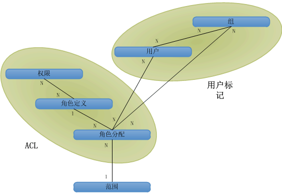

# SharePoint 2013 中的授权、用户、组和对象模型

在 SharePoint 2013 中，对网站、列表、文件夹和列表项的访问通过基于角色的成员资格系统进行控制，通过该系统用户将会被分配授权访问 SharePoint 2013 对象的角色。
  
    
    

若要授予某个用户访问某个对象的权限，您可以将该用户添加到对该对象已具有权限的组中，或者您可以创建角色分配对象，为角色分配设置用户，将角色分配可选绑定到具有基本权限的适当角色定义，然后将该分配添加到列表项、文件夹、列表或网站的角色分配集合。如果将用户分配给角色时您没有将角色分配绑定到角色定义，该用户就没有权限。
SharePoint 2013 提供了下列方式来控制对其对象的访问：
  
    
    

- 对象可以使用与父网站、列表或文件夹（继承父对象上可用的角色和用户）相同的权限，也可以使用独有权限。 
    
  
- 网站、列表、文件夹和项目各自提供角色分配集合，从而可以精细管理用户对对象的访问。
    
  
- 组由用户组成，可能分配也可能没有分配角色。默认情况下，SharePoint 2013 包括以下三个组：
    
  - **owners**（管理员）
    
  
  - **members**（参与者）
    
  
  - **visitors**（读者）
    
  

    在通过用户界面创建具有独有权限的网站时，您将被定向到一个页面，您可以在其中将用户分配给这些组，作为设置网站的一部分。
    
  
- 利用匿名访问，用户可以匿名参与列表和调查或者匿名查看页面。您还可以向"所有已验证用户"授予访问权，以允许域中的所有成员访问网站，而不必启用匿名访问。 
    
  
- 网站创建权限（ **CreateSSCSite** 和 **ManageSubwebs**）控制用户能否创建首要网站、子网站或工作区。
    
  
用户间接通过具有角色分配的组、或者直接通过角色分配成为 SharePoint 对象的成员。此外，用户还可以是添加到某个组或角色中的 Microsoft Windows NT 域组的成员。角色定义将用户或组与对应于  [Microsoft.SharePoint.SPBasePermissions](https://msdn.microsoft.com/library/Microsoft.SharePoint.SPBasePermissions.aspx) 枚举值的单个权限或权限组相关联。每个用户或组都具有唯一成员 [ID](https://msdn.microsoft.com/library/Microsoft.SharePoint.SPMember.ID.aspx) 。可以使用对象模型来创建或修改角色分配和定义，这与通过 addrole.aspx 和 editrole.aspx 文件执行操作不同。与用户界面中呈现的这些页面不同，对象模型不强制权限依赖性，因此您可以使用任意权限组合来创建角色定义。但是，在使用对象模型自定义角色定义和权限时，一定要周密规划，因为计划不周的角色定义和不适当的权限分配会导致糟糕的用户体验。有关 SharePoint 2013 权限的详细信息，请参阅  [SPBasePermissions](https://msdn.microsoft.com/library/Microsoft.SharePoint.SPBasePermissions.aspx) 。
## 安全策略

安全策略提供了一种强制 Web 应用程序（虚拟服务器）内所有网站集的安全性保持一致的手段。通过策略，您可以向各个 SharePoint 2013 用户以及使用 Windows 身份验证或可插入验证系统的域组分配角色或权限集，但不能向 SharePoint 组分配。每个策略项可为 Web 应用程序中的用户或组指定权限。
  
    
    
可在逻辑 Web 应用程序级别或区域级别设置策略。例如，用户可以在  `http://Server` 和 `http://Server.extranet.microsoft.com` 上设置不同的策略，即使这两个 Web 应用程序具有相同的内容也是如此。
  
    
    
可以通过策略来授予或拒绝权限。授予权限会将该权限授予 Web 应用程序内所有安全对象上的用户或组，而不管对象上的本地权限是什么。拒绝权限优先于授予权限，它主动阻止 Web 应用程序内所有安全对象上的用户或组的该权限。拒绝用户的所有权限会阻止该用户访问任何内容，即使该用户拥有特定内容的显式权限：策略优先于网站级别权限。
  
    
    
在策略角色中，用户和组由其安全标识符 (SID) 和登录名或用户名标识。应用策略角色类似于管理网站、列表、文件夹或文档的权限：添加用户或组，然后将其分配给一个或多个角色定义。每个 Web 应用程序都有自己的策略角色。策略角色与管理权限之间的另一个区别是中心管理员可以拒绝整个 Web 应用程序中某个用户的某种权限。
  
    
    

> **注释**
> 集中管理策略角色不同于网站集的角色定义。 
  
    
    

## 用户、组和安全主体

单个用户 ( [SPUser](https://msdn.microsoft.com/library/Microsoft.SharePoint.SPUser.aspx) ) 可直接通过单个角色分配获得对 SharePoint 对象的访问权限，或者间接通过具有角色分配的域组或 SharePoint 组 ( [SPGroup](https://msdn.microsoft.com/library/Microsoft.SharePoint.SPGroup.aspx) ) 中的成员资格获得此访问权限。在直接角色分配中，用户是安全主体 ( [SPPrincipal](https://msdn.microsoft.com/library/Microsoft.SharePoint.SPPrincipal.aspx) )，而在域组或 SharePoint 组角色分配中，域组或 SharePoint 组是安全主体。
  
    
    
SharePoint Server 同时支持 Windows 用户（例如， _DOMAIN_\\ _用户别名_）和外部用户（通过可插入验证）。用户标识由标识管理系统（例如，Active Directory 目录服务）进行维护。用户配置文件（包括用户的显示名称、电子邮件地址和其他信息）的作用范围限于网站集级别。更改显示名称会影响整个网站集。
  
    
    
组是 SharePoint Server 用于管理安全醒的用户集合。基于用户的管理对简单网站而言简单易行，但随着唯一受保护资源数量的不断增加 。例如用户可能对列表 1 具有 **Contribute**角色，对列表 2 具有 **Read** 角色，对列表 3 具有 **Design** 角色。此模型在有 50,000 名用户（以此为例）的情况下不能正常扩展，因为这会导致每个唯一受保护对象上的访问控制列表 (ACL) 包含多达 50,000 个访问控制项 (ACE) 。
  
    
    
组可以解决在进行基于用户的权限管理时出现的可管理性及缩放问题。基于组的管理可能更抽象或者更难以从概念上加以理解，但它可以更方便地管理包含众多唯一受保护对象的复杂网站，例如向已被授予系统中多个对象的适当角色的组中添加用户。组的权限检查可以更好地缩放，因为需要存储的组 ACE 要少得多。
  
    
    
SharePoint Server 支持两种类型的组：域组和 SharePoint 组。域组位于 SharePoint Server 控件外；用户不能使用 SharePoint Server 定义、浏览或修改域组成员身份。SharePoint 组的作用范围限于网站集级别，只能在网站集内使用它们，但却可以在 Active Directory 目录服务范围内的任何位置使用域组。
  
    
    
安全主体是用于控制安全性的用户或组。如果向网站中添加用户，则该用户就是安全主体，但如果向网站中添加组，则该组就是安全主体。在 SharePoint Server 中缩放安全性的关键是保证每个作用域内的安全主体数量合理。通过使用组，可以使用较少的安全主体为更多的用户授予访问权限。
  
    
    

## 对象关系的高级视图—作用域、用户、组和角色

图 1 显示了逻辑数据库关系图中 SharePoint Server 安全管理系统的高级视图。每个框表示系统中的一个安全对象。直线表示对象之间的关系。符号 **1** 和 **N** 表示关系类型。该图演示如何将权限数据构建到用户标记和 ACL 中。
  
    
    

**图 1. 授权对象关系**

  
    
    

  
    
    

  
    
    
作用域表示一个或一组唯一受保护对象。作用域包括网站、列表、文件夹或项级别。
  
    
    
用户与组具有多对多关系（N 到 N）。每个用户 ( [SPUser](https://msdn.microsoft.com/library/Microsoft.SharePoint.SPUser.aspx) ) 可以是多个组的成员，而每个组 ( [SPGroup](https://msdn.microsoft.com/library/Microsoft.SharePoint.SPGroup.aspx) ) 可以包含多个用户。
  
    
    
权限与角色定义也具有多对多关系（N 到 N）。每个权限 ( [SPBasePermissions](https://msdn.microsoft.com/library/Microsoft.SharePoint.SPBasePermissions.aspx) ) 可以是多个角色定义的一部分。例如， **Insert List Items** 权限包含在 **Contributor**、 **Designer** 和 **Administrator** 角色定义中。此外，每个角色定义 ( [SPRoleDefinition](https://msdn.microsoft.com/library/Microsoft.SharePoint.SPRoleDefinition.aspx) ) 还可以包含多个权限，例如， **Contributor** 包括插入、更新和删除列表项的权限。
  
    
    
角色定义与角色分配 ( [SPRoleAssignment](https://msdn.microsoft.com/library/Microsoft.SharePoint.SPRoleAssignment.aspx) ) 具有一对多关系（1 到 N）。每个角色定义可用于多个角色分配。列表 1 上的读者和列表 2 上的读者可能不同，但他们的角色分配可以共享一个角色定义： **Reader**。
  
    
    
用户或组与角色分配具有多对多关系（N 到 N）。每个用户或组可以是给定对象的多角色分配的成员。例如，用户可以对同一对象同时具有 **Designer** 和 **Administrator** 角色。
  
    
    
作用域与角色分配具有一对多关系（1 到 N）。每个作用域可包含多个角色分配，但每个角色分配只包含一个作用域。例如，一个用户可能是事件列表的读者，另一个用户可能是事件列表的参与者，但这两种角色分配都不适用于公告列表。两个列表共享同一角色分配的唯一方法是从父容器继承它们的权限，在这种情况下，安全作用域是容器，而不是这两个列表。
  
    
    

## 用户令牌和访问控制列表

为了更快地检查权限，SharePoint Server 在其安全模型中实现了用户标记和 ACL。用户标记可标识应用于用户的身份验证过程。Windows 用户拥有复杂的标记：一个是用户的唯一字符串 (SID)，另一个是用户的所有 Windows 域组列表（如  _DOMAIN_\\Department 15688）。未进行 Windows 身份验证的用户可能拥有一个包含用户名唯一字符串的非常简单的标记，也可能拥有一个包含 Windows 身份验证中所表示的组/角色成员身份的复杂标记。每个用户的 SharePoint 组成员身份通过用户标记来表示，以便 SharePoint Server 通过读取用户标记来标识当前用户的所有组。
  
    
    
ACL 是一个二进制对象，用于确定用户和组对给定对象所拥有的权限。ACL 包含多个 ACE，每个安全主体（用户或组）都是 ACL 中的一个 ACE。可针对每个作用域，将权限、角色定义和角色分配构建到 ACL 中，以便 SharePoint Server 能够了解允许每个用户或组在给定作用域中执行的操作。
  
    
    

## 对象模型更改：废弃但向后兼容的安全对象

在 SharePoint 2013 中，所有对象作用域都共享相同的基本权限管理体验。SharePoint 2013 通过角色定义来管理权限，这将使用户能够在列表、文件夹和项目级别上获得一致的体验。Windows SharePoint Services 2.0 中使用的以下安全对象已废弃，但是仍可以向后兼容：
  
    
    

-  [Microsoft.SharePoint.SPPermission](https://msdn.microsoft.com/library/Microsoft.SharePoint.SPPermission.aspx)
    
  
-  [Microsoft.SharePoint.SPPermissionCollection](https://msdn.microsoft.com/library/Microsoft.SharePoint.SPPermissionCollection.aspx)
    
  
-  [Microsoft.SharePoint.SPRights](https://msdn.microsoft.com/library/Microsoft.SharePoint.SPRights.aspx)
    
  
-  [Microsoft.SharePoint.SPRole](https://msdn.microsoft.com/library/Microsoft.SharePoint.SPRole.aspx)
    
  
-  [Microsoft.SharePoint.SPRoleCollection](https://msdn.microsoft.com/library/Microsoft.SharePoint.SPRoleCollection.aspx)
    
  
若要将用户分配给角色，请使用  [Microsoft.SharePoint.SPRoleAssignment](https://msdn.microsoft.com/library/Microsoft.SharePoint.SPRoleAssignment.aspx) 类和 [Microsoft.SharePoint.SPRoleAssignmentCollection](https://msdn.microsoft.com/library/Microsoft.SharePoint.SPRoleAssignmentCollection.aspx) 类的成员。 [SPBasePermisssions](https://msdn.microsoft.com/library/Microsoft.SharePoint.SPBasePermisssions.aspx) 枚举（取代了 [SPRights](https://msdn.microsoft.com/library/Microsoft.SharePoint.SPRights.aspx) ）不仅包括其他权限，而且 [SPBasePermisssions](https://msdn.microsoft.com/library/Microsoft.SharePoint.SPBasePermisssions.aspx) 枚举还包括映射到 [SPRights](https://msdn.microsoft.com/library/Microsoft.SharePoint.SPRights.aspx) 中的以前权限相同的常量值的旧权限。SharePoint 组概念将映射到表示跨网站组的现有 [SPGroup](https://msdn.microsoft.com/library/Microsoft.SharePoint.SPGroup.aspx) 对象和 [SPGroupCollection](https://msdn.microsoft.com/library/Microsoft.SharePoint.SPGroupCollection.aspx) 对象。
  
    
    

### 策略角色：创建或修改 URL 区域的安全策略

若要创建或修改 URL 区域的安全策略，请使用下面的类及其成员：
  
    
    

-  [Microsoft.SharePoint.Administration.SPPolicy](https://msdn.microsoft.com/library/Microsoft.SharePoint.Administration.SPPolicy.aspx)
    
  
-  [Microsoft.SharePoint.Administration.SPPolicyCollection](https://msdn.microsoft.com/library/Microsoft.SharePoint.Administration.SPPolicyCollection.aspx)
    
  
-  [Microsoft.SharePoint.Administration.SPPolicyRole](https://msdn.microsoft.com/library/Microsoft.SharePoint.Administration.SPPolicyRole.aspx)
    
  
-  [Microsoft.SharePoint.Administration.SPPolicyRoleCollection](https://msdn.microsoft.com/library/Microsoft.SharePoint.Administration.SPPolicyRoleCollection.aspx)
    
  
-  [Microsoft.SharePoint.Administration.SPPolicy.SPPolicyRoleBindingCollection](https://msdn.microsoft.com/library/Microsoft.SharePoint.Administration.SPPolicy.SPPolicyRoleBindingCollection.aspx)
    
  
-  [Microsoft.SharePoint.Administration.SPPolicyPermissions](https://msdn.microsoft.com/library/Microsoft.SharePoint.Administration.SPPolicyPermissions.aspx)
    
  

## 容纳共享资源的来宾角色（受限访问）

来宾角色的概念是指在平台上提供共享资源。例如，必须使用网站的主题和导航结构将页面呈现为列表视图。此概念扩展为包括文件夹和列表级权限。
  
    
    
SharePoint 对象模型继续称其为 **Guest** 角色以便在语义上与先前的对象模型兼容，尽管现在此角色在用户界面中已称为"受限访问"。
  
    
    

### 文件夹和项扩展

当用户被授予对某个文件夹的权限时，他们同时还获得该文件夹的父列表上的和该列表的父网站上（该文件上的每个独有安全作用域，一直到第一个独有祖先网站）的 **Guest** 角色的权限。这对列表项也适用：授予用户对某个项的权限，也就授予了该用户对所有父文件夹、列表和网站一直到第一个独有祖先网站上的 **Guest** 角色的权限。
  
    
    

## 从一个作用域或从所有作用域移除用户

从作用域移除用户也会从当前作用域下的所有独有安全作用域移除该用户。例如，从网站移除用户也会从网站中的独有安全列表中移除该用户。
  
    
    
从所有作用域中移除用户的唯一方式是从网站集中删除该用户，这将从网站集内的所有作用域的所有角色中移除此用户。
  
    
    

## 其他资源

-  [SharePoint 2013 中的身份验证、授权和安全性](authentication-authorization-and-security-in-sharepoint-2013.md)
    
  
-  [SharePoint 2013 中的角色、继承、权限提升和密码更改](role-inheritance-elevation-of-privilege-and-password-changes-in-sharepoint-2013.md)
    
  
-  [SharePoint 2013 中的基于声明的标识](claims-based-identity-in-sharepoint-2013.md)
    
  
-  [SharePoint 2013 中的基于声明的标识和概念](claims-based-identity-and-concepts-in-sharepoint-2013.md)
    
  
-  [SharePoint 2013 中的配置、管理和资源](configuration-administration-and-resources-in-sharepoint-2013.md)
    
  

