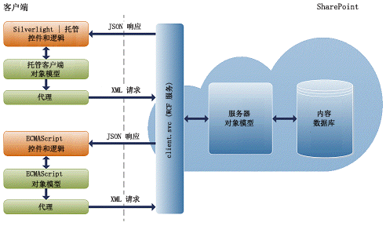
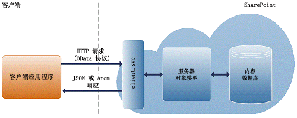

# 构建访问 SharePoint 2013 的 Windows Phone 应用程序
学习如何创建将 SharePoint 2013 以及 Windows Phone 8 和 Windows Phone 7 等移动设备相集成的 SharePoint 外接程序。
## 使用 SharePoint 2013 生成移动应用程序的简介

SharePoint 2013 为开发人员提供了一个令人兴奋的机会，使他们可以生成在用户间传播的移动应用程序，这些应用程序是交互式的，很精美，而且用户可以不论时间和地点地使用它们。您可以将 Windows Phone 8 和 Windows Phone 7 应用程序与内部部署的 SharePoint 服务和应用程序结合使用，或者与在云中运行的远程 SharePoint 服务和应用程序（例如使用 SharePoint Online 的服务和应用程序）结合使用，以创建功能强大的应用程序，这些应用程序可将功能扩展到传统台式机或便携式计算机以外，并将功能扩展到一个具有真正的便携性且更容易访问的环境中。
  
    
    
SharePoint 2013 提供的新的移动性功能基于 SharePoint、Windows Phone、Visual Studio 和 Silverlight 等现有的 Microsoft 工具和技术构建。熟悉这些技术及其相关工具的开发人员将无需过多的曲线学习，就能够为 Windows Phone 创建由 SharePoint 提供支持的移动应用程序。在本节中，我们探究了可以为 Windows Phone 8 和 Windows Phone 7 生成的由 SharePoint 提供支持的移动应用程序的某些类型，并探究了用来自定义这些应用程序的常见方法。SharePoint 2013 为开发人员提供了框架和工具（包括 Visual Studio 2010 项目模板）以便使用 SharePoint Online 创建与内部部署 SharePoint 安装和云中的 SharePoint 数据交互的移动解决方案。图 1 显示了一个简单的列表应用程序在 Windows Phone 上的外观。
  
    
    

**图 1. Windows Phone 应用程序中的 SharePoint 列表项**

  
    
    

  
    
    

  
    
    

  
    
    

  
    
    

## 创建移动应用程序需要哪些技能？

本节中，我们假设您熟悉 SharePoint, .NET Framework、Visual Studio 开发系统和 Visual C#。拥有一些使用 Silverlight 开发 Windows Phone 8 或 Windows Phone 7 应用程序的经验也是不错的，熟悉 Windows Phone 的 XAML、StackPanel 和透视控件，以及了解逻辑删除和 Silverlight 数据绑定等概念也很有帮助。如果您刚刚接触使用 Silverlight 开发 Windows Phone 应用程序，我们建议您查看以下资源。
  
    
    

-  [开发 Windows Phone 应用程序（从开始到完成）](http://msdn.microsoft.com/zh-cn/library/gg680270%28v=pandp.11%29.aspx)
    
  
-  [Windows Phone 的用户界面](http://msdn.microsoft.com/zh-cn/library/windowsphone/develop/ff967556%28v=vs.105%29.aspx)
    
  
-  [快速入门：使用 XAML 为 Windows Phone 创建用户界面](http://msdn.microsoft.com/zh-cn/library/windowsphone/develop/jj207025%28v=vs.105%29.aspx)
    
  
-  [Windows Phone 的 Pivot 控件体系结构](http://msdn.microsoft.com/zh-cn/library/windowsphone/develop/ff941097%28v=vs.105%29.aspx)
    
  

## 使用 SharePoint 2013 的移动应用程序开发概览

您可以使用 SharePoint 2013 生成大量不同的移动应用程序。本节描述了 SharePoint 2013 版本中使移动应用程序开发对开发人员而言变得简单的新增和更改的内容。
  
    
    

### Windows Phone SharePoint 2013 应用程序模板

这是您可以生成的最简单的移动应用程序以便为电话提供一个常规列表。SharePoint 2013 提供了 Visual Studio 模板，使您能够更快更容易地为 Windows Phone 创建 SharePoint 列表应用程序。例如，您可以生成"待办事项"类型的 Windows Phone 应用程序，将 SharePoint 中的任务列表导入 Windows Phone 中，并使您能够使用您的电话更新正在进行的任务的状态。另外一个示例是，在销售人员的电话上使用 SharePoint 中的库存列表的产品目录。安装 Windows Phone SharePoint SDK 使得两个 Windows Phone SharePoint 应用程序模板可供您在 Windows Phone 的 Visual Studio 2010 或 Visual Studio 2010 Express 中使用。（请参阅 [如何：设置用于为 SharePoint 开发移动应用程序的环境](how-to-set-up-an-environment-for-developing-mobile-apps-for-sharepoint.md)。）使用 Windows Phone SharePoint 列表应用程序模板，您可以按照向导的步骤来创建可以访问和处理 SharePoint 列表中的数据的功能齐全的 Windows Phone 应用程序。
  
    
    

### SharePoint 2013 中新增和增强的移动性对象模型

SharePoint 2013 将许多新类添加到了服务器和客户端对象模型，以实现上文介绍的 SharePoint 移动性应用场景。
  
    
    
为了启用位置感知应用程序，提供了一个新的本机字段类型类 **SPFieldGeoLocation** 以及许多用来构造位置字段的值并呈现它们的关联类。这些类也可在 Silverlight 的 SharePoint 2013 客户端对象模型中调用。新字段类型还具有一个添加到标准 SharePoint fldtypes.xml 文件的定义，以及用于在"显示"、"编辑"和"新建"表单上呈现字段的新用户控件。有关概览，请参阅 [集成 SharePoint 2013 中的位置和映射功能](integrating-location-and-map-functionality-in-sharepoint-2013.md)。
  
    
    
为了对 Windows Phone 用户启用 SharePoint 2013 身份验证，客户端对象模型包括一个新的 **Authenticator** 类和多个相关联的类。有关概览，请参阅 [SharePoint 2013 移动客户端身份验证对象模型概述](overview-of-the-sharepoint-2013-mobile-client-authentication-object-model.md)。
  
    
    
为了对 Windows Phone 用户启用 SharePoint 场上的事件的自动通知功能，服务器对象模型包括多个新类，每个新类还可以从客户端对象模型中调用。这些类包括的方法允许电话应用程序向 SharePoint 2013 服务器应用程序注册以接收有关指定事件类型的通知。服务器应用程序还可以一些方法向已注册订阅者发送通知。有关概览，请参阅 [创建 Windows Phone SharePoint 列表应用程序以接收推送通知](how-to-configure-and-use-push-notifications-in-sharepoint-2013-apps-for-windows.md#BKMK_NotificationPhoneApp)。
  
    
    
使用 SharePoint 2013，您不会受限于 Windows Phone 8 和 Windows Phone 7 的移动应用程序开发。使用 SharePoint 2013 提供的 JavaScript 编程接口和新的代表性状态传输 (REST) 编程接口，您可以为非 Windows Phone 移动设备创建应用程序；您可以与 SharePoint 站点进行交互（方法是使用作为浏览器中的脚本执行的 JavaScript 或使用任何支持标准 REST 功能的技术远程进行）。下一节将提供 REST 和 JavaScript 编程接口的概览。
  
    
    

#### ECMAScript (JavaScript, JScript) 对象模型体系结构

SharePoint Foundation 2010 引入了客户端对象模型，它使开发人员能够使用 .NET Framework、Silverlight 或 JavaScript 等网站编程技术执行与 SharePoint 的远程通信。
  
    
    
在 SharePoint Foundation 2010 中，客户端对象模型提供的 API 使开发人员能够根据在浏览器中执行的脚本、在 .NET Framework 托管应用程序中执行的代码（基于 .NET Framework 3.5 或更高版本）或在 Silverlight 2.0 应用程序中执行的代码，与 SharePoint 网站进行交互。构成客户端对象模型的代理程序 .js 和托管的 .dll 文件基于 client.svc Web 服务构建，可处理有效的批处理、请求序列化和回复分析。图 2 显示了 SharePoint 客户端对象模型体系结构的高级视图。
  
    
    

**图 2. SharePoint 客户端对象模型体系结构**

  
    
    

  
    
    

  
    
    
若要了解如何对 SharePoint 数据使用 JavaScript 客户端对象模型，请参阅  [ECMAScript 客户端对象模型](http://msdn.microsoft.com/zh-cn/sp2010devtrainingcourse_ecmascriptclientobjectmodel.aspx)
  
    
    

#### SharePoint 2013 中的 REST 端点

若要使用内置于 SharePoint 2013 的 REST 功能，您可以使用与所需客户端对象模型 API 相对应的开放式数据协议 (OData) 标准构建 RESTful HTTP 请求。Client.svc Web 服务以 Atom 或 JavaScript 对象表示法 (JSON) 格式处理该 HTTP 请求，并提供适当的响应。然后，客户端应用程序必须分析该响应。图 3 显示了 SharePoint REST 体系结构的高级视图。
  
    
    

**图 3. SharePoint REST 体系结构**

  
    
    

  
    
    

  
    
    
目前，SharePoint 2013 中的 REST 服务为只读。也就是说，只有表示 HTTP GET 操作的 REST 端点可用。
  
    
    
默认情况下，根据 OData 规范，SharePoint 2013 REST 服务响应使用 Atom 协议进行格式化。此外，REST 服务支持使开发人员能够指定以 JSON 格式返回的响应的 HTTP Accept 标头。若要了解 SharePoint 2013 中的 REST 服务的详细信息，请参阅 [使用 SharePoint 2013 REST 服务进行编程](use-odata-query-operations-in-sharepoint-rest-requests.md)。
  
    
    
SharePoint 2013 REST 服务支持以下 OData 查询运算符：
  
    
    

- Filter
    
  
- Take
    
  
- Expand
    
  

## 开始为 SharePoint 2013 开发移动应用程序

以下材料和概览深入介绍了开始移动应用程序开发所需的特定信息：
  
    
    

-  [如何：设置用于为 SharePoint 开发移动应用程序的环境](how-to-set-up-an-environment-for-developing-mobile-apps-for-sharepoint.md)
    
  
-  [Visual Studio 中的 Windows Phone SharePoint 2013 应用程序模板概述](overview-of-windows-phone-sharepoint-2013-application-templates-in-visual-studio.md)
    
  
-  ["Windows Phone SharePoint 列表应用程序"模板的体系结构](architecture-of-the-windows-phone-sharepoint-list-application-template.md)
    
  
-  [如何：创建 Windows Phone SharePoint 2013 列表应用程序](how-to-create-a-windows-phone-sharepoint-2013-list-app.md)
    
  
-  [如何：在 Windows Phone 上存储和检索 SharePoint 列表项](how-to-store-and-retrieve-sharepoint-list-items-on-a-windows-phone.md)
    
  
-  [如何：在针对 Windows Phone 的 SharePoint 2013 应用程序中实现业务逻辑和数据验证](how-to-implement-business-logic-and-data-validation-in-a-windows-phone-app-for-s.md)
    
  
-  [如何：为 Windows Phone 应用程序支持和转换 SharePoint 2013 字段类型](how-to-support-and-convert-sharepoint-2013-field-types-for-windows-phone-apps.md)
    
  
-  [如何：为 Windows Phone 应用程序自定义列表项查询和筛选数据](how-to-customize-list-item-queries-and-filter-data-for-windows-phone-apps.md)
    
  
-  [如何：自定义针对 Windows Phone 的 SharePoint 2013 列表应用程序的用户界面](how-to-customize-the-user-interface-of-a-sharepoint-2013-list-app-for-windows-ph.md)
    
  
-  [如何：在 Windows Phone 应用程序中使用多个 SharePoint 2013 列表](how-to-use-multiple-sharepoint-2013-lists-in-a-windows-phone-app.md)
    
  
-  [如何：在针对 Windows Phone 的 SharePoint 2013 应用程序中配置和使用推送通知](how-to-configure-and-use-push-notifications-in-sharepoint-2013-apps-for-windows.md)
    
  
-  [集成 SharePoint 2013 中的位置和映射功能](integrating-location-and-map-functionality-in-sharepoint-2013.md)
    
  
-  [如何：在 SharePoint 2013 中创建包含外部数据源中的数据的移动应用程序](how-to-create-a-mobile-app-in-sharepoint-2013-that-contains-data-from-an-externa.md)
    
  
-  [如何：将地图与 Windows Phone 应用程序和 SharePoint 2013 列表集成](how-to-integrate-maps-with-windows-phone-apps-and-sharepoint-2013-lists.md)
    
  
-  [如何：使用导航和事件日志记录 REST 界面构建搜索驱动移动应用程序](how-to-build-search-driven-mobile-apps-with-the-navigation-and-event-logging-res.md)
    
  

## 其他资源

  
    
    

-  [SharePoint 2013 中的编程模型](programming-models-in-sharepoint-2013.md)
    
  
-  [如何：设置用于为 SharePoint 开发移动应用程序的环境](how-to-set-up-an-environment-for-developing-mobile-apps-for-sharepoint.md)
    
  
-  [Windows Phone SDK 8.0](http://www.microsoft.com/zh-cn/download/details.aspx?id=35471)
    
  
-  [适用于 Windows Phone 8 的 Microsoft SharePoint SDK](http://www.microsoft.com/zh-cn/download/details.aspx?id=36818)
    
  
-  [Windows Phone SDK 7.1](http://www.microsoft.com/zh-cn/download/details.aspx?id=27570)
    
  
-  [适用于 Windows Phone 7.1 的 Microsoft SharePoint SDK](http://www.microsoft.com/en-us/download/details.aspx?id=30476)
    
  
-  [有关 Expression Blend](http://msdn.microsoft.com/zh-cn/library/cc296376%28Expression.40%29.aspx)
    
  

