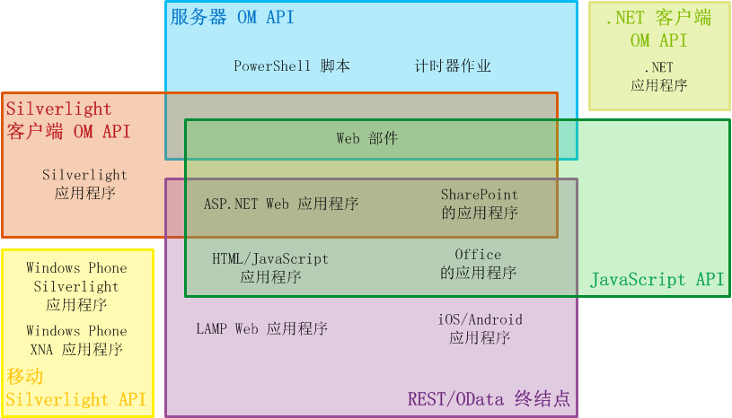

# 在 SharePoint 2013 中选择正确的 API 集
了解 SharePoint 2013 提供的几组 API，包括服务器对象模型、各种客户端对象模型和 REST/OData Web 服务。

**观看视频：针对 SharePoint 客户端对象模型 (CSOM) 和 REST 的 SharePoint 2013 策略**

  
    
    

  
    
    

  
    
    

  
    
    

  
    
    

## 决定使用哪个 API 集的因素

您可以在多个 API 集中选择一个来访问 SharePoint 2013 平台。您使用哪一个 API 集取决于以下因素：
  
    
    

- **应用程序的类型。** 可能的类型包括但不限于以下不相互排斥的类别：SharePoint 外接程序、SharePoint 页上的 Web 部件、在客户端计算机或客户端移动设备上运行的 Silverlight 应用程序、在 SharePoint 中由 IFrame 揭示的 ASP.NET 应用程序、在 SharePoint 网站页上运行的 JavaScript、SharePoint 应用程序页、在客户端计算机上运行的 Microsoft .NET Framework 应用程序、Windows PowerShell 脚本和在 SharePoint 服务器上运行的计时器作业。
    
  
- **现有技巧**若要达到一个令人惊喜的程度，您可以在 SharePoint 2013 创建应用程序，无需了解太多 SharePoint 编程。 如果您已经具有有关以下任何编程模型的经验，则可以直接跳到 SharePoint 开发：
    
  - JavaScript
    
  
  - ASP.NET
    
  
  - REST/OData
    
  
  - .NET Framework
    
  
  - Windows Phone
    
  
  - Silverlight
    
  
  - Windows PowerShell
    
  
- **运行代码的设备。** 可能的设备包括 SharePoint 场中的服务器，外部服务器（如，云、客户端计算机和移动设备中的服务器）。
    
  
此主题提供了由 SharePoint 2013 提供的各种 API 集的概览。图 1 演示了可以使用哪一个 API 集来对应开发 13 个常规的与 SharePoint 相关的应用程序。对于许多应用程序而言，您可以从多个 API 中进行选择。
  
    
    

**图 1. 所选 SharePoint 扩展类型和 SharePoint API 集**

  
    
    

  
    
    

  
    
    

  
    
    
下表提供了有关哪个程序集可用于 SharePoint 扩展项目的所选列表的指南。此主题的剩余部分介绍了各种 API 集。
  
    
    

|**如果您想进行此操作 ...**|**... 请使用这些 API**|
|:-----|:-----|
|创建一个跨 SharePoint 数据或外部数据（以 ASP.NET 外部内容类型呈现在 SharePoint 中）的防火墙执行创建/读取/更新/删除 (CRUD) 操作的 Microsoft Business Connectivity Services (BCS) Web 应用程序。    |JavaScript 客户端对象模型    |
|创建一个 ASP.NET Web 应用程序，它可以针对 SharePoint 数据或外部数据（以 BCS 外部内容类型呈现在 SharePoint 中）执行 CRUD 操作，但不必跨防火墙调用 SharePoint    |.NET Framework 客户端对象模型、Silverlight 客户端对象模型或 REST/OData 端点    |
|创建一个针对 SharePoint 数据或外部数据（以 BCS 外部内容类型呈现在 SharePoint 中）执行 (CRUD) 操作的 LAMP Web 客户端对象模型和 SharePoint REST/OData 端点的比较应用程序。    |REST/OData 端点    |
|创建一个针对 SharePoint 数据执行 CRUD 操作的 Windows Phone 应用程序    |移动设备客户端对象模型    |
|创建一个使用 Microsoft Push Notification Service 警告 SharePoint 中的事件的移动设备的 Windows Phone 应用程序    |移动设备客户端对象模型和服务器对象模型    |
|创建一个针对 SharePoint 数据执行 CRUD 操作的 iOS 或 Android 应用程序    |REST/OData 端点    |
|创建一个针对 SharePoint 数据执行 CRUD 操作的 .NET Framework 应用程序    |.NET Framework 客户端对象模型    |
|创建一个针对 SharePoint 数据执行 CRUD 操作的 Silverlight 应用程序    |Silverlight 客户端对象模型    |
|创建一个针对 SharePoint 数据执行 CRUD 操作的 HTML/JavaScript 应用程序    |JavaScript 客户端对象模型    |
|创建一个使用 SharePoint 的 Office 外接程序    |JavaScript 客户端对象模型    |
|创建一个自定义 Windows PowerShell 命令    |服务器对象模型    |
|创建一个计时器作业    |服务器对象模型    |
|创建一个扩展的中央管理    |服务器对象模型    |
|在整个 SharePoint 场中创建一致性品牌。    |服务器对象模型    |
|创建自定义 Web 部件、应用程序页或 ASP.NET 用户控件    |服务器对象模型    **重要信息**   如果您要提供个客户的功能不是以比网站集更广的范围面向 SharePoint 管理，那么我们建议不要使用该服务器对象模型，创建一个 SharePoint 外接程序，它包括含所需自定义 Web 部件和用户控件的远程 ASP.NET Web 应用程序。请参阅此表的前两行。           |
   

## 服务器对象模型

最大的 API 集在托管类的服务器对象模型中。在 SharePoint Foundation 2013 级别，此对象模型包括了启用基本网站的编程控件和 SharePoint Foundation 的列表结构的类和成员。大多数类都在  [Microsoft.SharePoint](https://msdn.microsoft.com/library/Microsoft.SharePoint.aspx) 命名空间中。此外，您可以使用该服务器对象模型扩展几乎每个 SharePoint Foundation 组件，包括工作流、警报、Web 部件、基本搜索和 Microsoft Business Connectivity Services (BCS)。该服务器对象模型还包括丰富的启用管理的扩展和 SharePoint Foundation 的安全系统的 API 集，包括备份、场运行状况和诊断、登录、场和 Web 应用程序管理、升级、部署、缓冲和 Windows PowerShell 自定义。
  
    
    
在 SharePoint Server 2013 级别，添加了更多类以启用"企业内容管理"(ECM)、用户配置文件、分类、高级搜索和 SharePoint Server 2013 的其他功能的编程。
  
    
    
您可以使用 [针对对象的 LINQ](http://msdn.microsoft.com/zh-cn/library/bb397919.aspx) 以查询记忆中的任何 **IEnumerable** 集，但是 [针对 SharePoint 提供程序的 LINQ](http://msdn.microsoft.com/library/3fa2dc5f-d308-4337-aefd-191a5df8dbbe%28Office.15%29.aspx)启用了直接查询 SharePoint 内容数据基中的列表。严格地说，此提供程序不可使用此主题讨论的任何 API 集。但是有方式可在多数其他 API 集中使用 LINQ 语法。
  
    
    
安装 SharePoint 2013 时，将定义内置服务器端类的程序集安装到每个服务器的全球程序集缓冲。当您针对服务器对象模型进行编程时，将您的程序集作为 服务器场解决方案 安装到全球程序集缓冲。
  
    
    

> **注释**
> 开发新的 沙盒解决方案 到 SharePoint 2013 被否决，支持开发 SharePoint 外接程序，但是仍可以安装 沙盒解决方案 到 SharePoint 2013 的网站集。当这些解决方案的程序集暂时被安装到服务器的文件夹时，它们保留在数据包中，除非它们正被使用。有关详细信息，请参阅 [沙盒解决方案中的程序集部署在何处？](http://msdn.microsoft.com/library/dadbb20b-1bf7-442c-9eeb-bd9f01dbda45%28Office.15%29.aspx)。 
  
    
    

### 您可以使用服务器对象模型时的限制

SharePoint 外接程序 中的自定义逻辑总是将"向下"分发给客户端，或将"向上"分发给云（或将"完毕"分发给 SharePoint 场外的一些服务器）。在所有这些分发模型中，必须使用其中一个客户端对象模型或 REST/OData 端点。 （您不能使用 SharePoint 外接程序 中的服务器对象模型。）例如，如果该应用程序包含了寄宿在 SharePoint 上的网页，这些网页可以通过使用 JavaScript 客户端对象模型来访问 SharePoint 数据。这些网页也可以暴露使用 SharePoint 2013 Silverlight 客户端对象模型的 Silverlight 应用程序。有关 SharePoint 外接程序 的详细信息，请参阅  [SharePoint 外接程序体系结构的重要方面和开发前景](http://msdn.microsoft.com/library/ae96572b-8f06-4fd3-854f-fc312f7f2d88%28Office.15%29.aspx)。
  
    
    

## 托管代码的客户端对象模型

SharePoint 2013 具有三个托管代码的客户端对象模型： .NET、Silverlight 和 移动设备。
  
    
    

### .NET 客户端对象模型

.NET Framework 的 SharePoint 2013 客户端模型用于在非电话式 Windows 客户端上运行的 .NET Framework 应用程序。以下任何一个都算作此类客户端：
  
    
    

- 用户的计算机
    
  
- SharePoint 2013 场外的服务器
    
  
- Microsoft Azure 上的 Web 角色或辅助角色
    
  
几乎每一个在核心站点和列表服务器对象模型中的类在 .NET Framework 中都有一个相应的类。此外，.NET Framework 客户端对象模型暴露了全套的 API 以扩展其他功能，包括 ECM、分类、用户配置文件、高级搜索、分析等 SharePoint Server 2013 功能。
  
    
    
为了提高性能，将在 .NET Framework 客户端对象模型中写入的代码行以批处理的方式方式到 SharePoint 服务器，在此处，将它们转换成服务器端代码并执行。然后，将查询结果和所有变量的新状态返回给客户端。作为开发人员，您可以确定同步还是异步运行批处理。 (在同步批处理中，.NET Framework 应用程序会先等待来自服务器的返回结果，然后再继续；在异步批处理中，客户端处理会立即继续，而且客户端用户接口 (UI) 会保持有反应。）
  
    
    
您可以使用客户端代码中的 LINQ 查询语法来查询任何 **IEnumerable** 对象，包括实现 **IEnumerable** 的SharePoint 2013 对象。但是，当您执行此操作时，您正在使用 [针对对象的 LINQ](http://msdn.microsoft.com/zh-cn/library/bb397919.aspx)，而不是 [针对 SharePoint 提供程序的 LINQ](http://msdn.microsoft.com/library/3fa2dc5f-d308-4337-aefd-191a5df8dbbe%28Office.15%29.aspx)，因此，后者的文档与客户端代码不相关。
  
    
    
.NET Framework 客户端对象模型的程序集必须安装在客户端上。他们包含在您可以在  [SharePoint 客户端组件](http://www.microsoft.com/en-us/download/details.aspx?id=35585)上获得的可再发行组件包中。
  
    
    
有关使用 .NET Framework 对象模型的示例，请参阅 [使用 SharePoint 2013 客户端库代码完成基本操作](http://msdn.microsoft.com/library/5a69c9e3-73bf-4ed5-bc19-182056bdb394%28Office.15%29.aspx)。
  
    
    

> **注释**
> 您还可以使用 .NET Framework 应用程序中的SharePoint REST/OData 端点。有关 .NET Framework 客户端对象模型和 SharePoint REST/OData 端点的比较，请参阅此章中的  [REST/OData 端点](#RESTOData)一节。 
  
    
    

### Silverlight 客户端对象模型

Silverlight 的 SharePoint 2013 对象模型用于 Silverlight 应用程序，不管已编译的 .xap 文件在何处是持久的。 它可能在 SharePoint 2013 网站的附件库、客户端计算机、云存储器或外部服务器。通常情况下，Silverlight 应用程序会出现在  [SilverlightWebPart](https://msdn.microsoft.com/library/Microsoft.SharePoint.WebPartPages.SilverlightWebPart.aspx) 对象的SharePoint 2013 中。 SharePoint 2013 中的 Silverlight 客户端对象模型几乎等同于 .NET Framework 客户端模型，它包括对相同的扩展区域的支持。主要的差异在于，在 Silverlight 版本中，所有批处理命令将被异步发送到服务器，所以该应用程序的 UI 保持活动。
  
    
    
Silverlight 客户端对象模型的程序集在 %ProgramFiles%\\Common Files\\Microsoft Shared\\web server extensions\\15\\TEMPLATE\\LAYOUTS\\ClientBin 的每个 SharePoint 2013 服务器上都是持久的。不必将它们安装到正在运行 Silverlight 应用程序的计算机上（即使您可以选择进行此操作）。您还可以将它们打包到该应用程序的 .xap 文件。
  
    
    
Silverlight .xap 文件可以被包括在 SharePoint 外接程序 中，也可以包括于寄宿在 SharePoint 上的应用程序。 在后一种情况中，将 .xap 文件部署到"应用程序 Web" 的库中。（有关应用程序 Web 的详细信息，请参阅 [SharePoint 2013 中的主机 Web、外接程序 Web 和 SharePoint 组件](http://msdn.microsoft.com/library/b791cdf5-8aa2-47fa-bc4c-aee437354759%28Office.15%29.aspx)。）这给 Silverlight 应用程序提供了一个有用的方法，使其包括应用程序中的自定义 SharePoint 代码，因为自定义服务器端代码在 SharePoint 外接程序 中不可用。这也使得 Silverlight 开发人员可以使用他们现有的技术，需要最少的曲线学习，便能创建 SharePoint 2013 应用程序。
  
    
    

> **注释**
> 您还可以使用 Silverlight 应用程序中的 SharePoint REST/OData 端点。有关 Silverlight 客户端对象模型和 SharePoint REST/OData 端点的比较，请参阅此章中的  [REST/OData 端点](#RESTOData)一节。 
  
    
    

### 移动设备对象模型

Silverlight 客户端对象模型的一个专用版本可用于 Windows Phone 设备。它包括一些只和移动电话相关的附加 API，如使电话应用程序可以注册来自 Microsoft Push Notification Service 的通知的 API。它支持所有核心 SharePoint 2013 功能；但是，它不针对托管代码的其他两个客户端对象模型支持的非核心扩展区域提供支持。若要访问这些附加区域，请使用您的移动设备应用程序中的 SharePoint REST/OData 端点。请参阅此章的  [REST/OData 端点](#RESTOData)一节。
  
    
    
移动设备对象模型的程序集在 %ProgramFiles%\\Common Files\\Microsoft Shared\\web server extensions\\15\\TEMPLATE\\LAYOUTS\\ClientBin 的每个 SharePoint 2013 服务器上都是持久的。您可以将它们打包到 Windows Phone 应用程序的 .xap 文件。
  
    
    

## JavaScript 对象模型

SharePoint 2013 提供了 JavaScript 对象模型以供在内连脚本或单独的 .js 文件中使用。它包括所有和 .NET Framework 以及 Silverlight 客户端对象模型相同的功能。和 Silverlight 客户端对象模型一样，JavaScript 对象模型是将自定义 SharePoint 代码包括在应用程序中的一个有用的方法，因为自定义服务器端代码在 SharePoint 外接程序 中不可用。这也使得 Web 开发人员可以使用现有的 JavaScript 技术，需要最少的曲线学习，就能创建 SharePoint 应用程序。
  
    
    
就像托管代码客户端对象模型一样，SharePoint 2013 的 JavaScript 基础结构与批处理中的场服务器相交互。这些批处理总是异步运行。此外，现在可以跨 JavaScript 中的域访问 SharePoint 数据（但是仅限于相同父级站点内的数据），这在 SharePoint 的上一个版本中是不允许的。 有关详细信息，请参阅 [使用跨域库从外接程序访问 SharePoint 2013 数据](http://msdn.microsoft.com/library/bc37ff5c-1285-40af-98ae-01286696242d%28Office.15%29.aspx)。数据是由 JavaScript 对象表示法 (JSON) 的服务器中返回。
  
    
    
在位于每个服务器的 %ProgramFiles%\\Common Files\\Microsoft Shared\\web server extensions\\15\\TEMPLATE\\LAYOUTS 处的一组 *.js 文件中定义了 JavaScript 对象模型。
  
    
    
有关使用 .NET Framework 对象模型的示例，请参阅 [使用 SharePoint 2013 中的 JavaScript 库代码完成基本操作](http://msdn.microsoft.com/library/29089af8-dbc0-49b7-a1a0-9e311f49c826%28Office.15%29.aspx)。
  
    
    

> **注释**
> 您还可以使用 JavaScript 应用程序中的 SharePoint REST/OData 端点。有关 JavaScript 客户端对象模型和 SharePoint 的 REST/OData 端点的比较，请参阅下一节  [REST/OData 端点](#RESTOData)。 
  
    
    

## REST/OData 端点

有关您需要访问其客户端技术中的 SharePoint 实体的方案（这些客户端技术不适用 JavaScript，也不是在 .NET Framework 或 Silverlight 平台上生成的），SharePoint 2013 实现了  [OData 协议](http://www.odata.org/) 的 Representational State Transfer (REST) Web 服务以针对 SharePoint 列表数据执行 CRUD 操作。此外，客户端对象模型中的几乎每个 API 都具有一个相应的 REST 端点。这使您的代码可以通过使用任何支持标准 HTTP 请求和响应的技术与 SharePoint 项目相交互。若要使用为 SharePoint 2013 生成的 REST 功能，您的代码可以构造一个 RESTful HTTP 请求到与所需客户端对象模型 API 相对应的端点。 Client.svc Web 服务处理了 HTTP 请求，并为 Atom 或 JSON 格式的响应提供服务。
  
    
    
有关使用 REST/OData Web 服务的详细信息，请参阅节点 [使用 SharePoint 2013 REST 服务进行编程](use-odata-query-operations-in-sharepoint-rest-requests.md)；例如，参阅主题 [使用 SharePoint 2013 REST 终结点完成基本操作](http://msdn.microsoft.com/library/e3000415-50a0-426e-b304-b7de18f2f7d9%28Office.15%29.aspx)。
  
    
    

### 比较 REST/OData 编程和客户端对象模型编程

在有些情况下，在可用 SharePoint 对象模型的应用程序中最好使用 REST 端点，特别是对于没有 Windows 开发经验的开发人员而言。下表提供了对于 在 Windows 平台或支持 JavaScript 的平台上创建应用程序的开发人员而言，这些编程选择的主要功能的比较。
  
    
    

|**功能**|**.NET Framework 或 Silverlight 对象模型**|**JavaScript 对象模型**|**从 Windows 平台或 JavaScript 中调用的 REST/OData 端点**|
|:-----|:-----|:-----|:-----|
|面向对象的编程    |是    |是    |否    |
|批处理    |是    |是    |是    |
|针对有条件处理和异常处理的 API    |是    |否    |否    |
|LINQ 语法的可用性    |是    |否    |否    |
|合并不同 SharePoint Web 应用程序中的列表数据    |是    |否    |是    |
|针对有经验的 REST/OData 开发人员的便利性    |否    |否    |是    |
|与 非 Windows 编程或 JavaScript 编程的相似性    |否    |是    |是    |
|列表项字段的强输入    |否（除了 LINQ）    |否    |Windows 平台中，是          JavaScript 中，否    |
|探查器 jQuery、Knockout 和其他 JavaScript 库    |否    |是    |Windows 平台中，否          JavaScript 中，是    |
   

## WCF 数据服务框架

如果您倾向于在 .NET Framework 或 Silverlight 客户端应用程序中使用 LINQ 语法，SharePoint 2013 将支持  [WCF 数据服务](http://msdn.microsoft.com/zh-cn/library/cc668792.aspx) 为 LINQ 提供程序。您可以将 SharePoint Foundation 的上一个版本中的 listdata.svc（仅限于列表数据）作为目标，您也可以将与支持 OData 接口访问除了列表数据的所有 SharePoint 实体相同的 client.svc 作为目标。有关详细信息，请参阅 [使用 ADO.NET 数据服务查询 SharePoint Foundation ](http://msdn.microsoft.com/library/3e3e16f7-620a-4710-a3f3-19d0236f4b4a%28Office.15%29.aspx)。
  
    
    
图 2 阐明了各种客户端 API 和 SharePoint 以及各种类型的客户端应用程序和 SharePoint 之间的关系。各种 _api* URL 是 REST 端点的相对于场的 URL。有关详细信息，请参阅 [了解更多 SharePoint 15 REST 服务](get-to-know-the-sharepoint-2013-rest-service.md#bk_learnmore)。
  
    
    

**图 2. SharePoint 中的客户端应用程序和 API**

  
    
    

  
    
    

  
    
    

  
    
    

  
    
    

## 被弃用的 API 集

在向后兼容性的 SharePoint 2013 框架中仍然支持两个 API 集，但是我们建议您不要将它们用于新项目： [ASP.NET (asmx) Web 服务](http://msdn.microsoft.com/library/c587ee90-1f88-43f3-b1a7-5f3072d038f8%28Office.15%29.aspx)和 [针对 owssvr.dll 的直接"远程过程调用"(RPC) 调用](http://msdn.microsoft.com/library/4aa5c82b-90fb-4be5-b30c-d35ecae42a81%28Office.15%29.aspx)文件。
  
    
    

## 其他资源

-  [SharePoint 2013 开发概述](sharepoint-2013-development-overview.md)
    
  
-  [SharePoint 2013 中的编程模型](programming-models-in-sharepoint-2013.md)
    
  
-  [SharePoint 加载项与 SharePoint 解决方案比较](sharepoint-add-ins-compared-with-sharepoint-solutions.md)
    
  
-  [使用 SharePoint 2013 REST 服务进行编程](use-odata-query-operations-in-sharepoint-rest-requests.md)
    
  
-  [使用 SharePoint 2013 REST 终结点完成基本操作](http://msdn.microsoft.com/library/e3000415-50a0-426e-b304-b7de18f2f7d9%28Office.15%29.aspx)
    
  
-  [使用 SharePoint 2013 客户端库代码完成基本操作](http://msdn.microsoft.com/library/5a69c9e3-73bf-4ed5-bc19-182056bdb394%28Office.15%29.aspx)
    
  
-  [使用 SharePoint 2013 中的 JavaScript 库代码完成基本操作](http://msdn.microsoft.com/library/29089af8-dbc0-49b7-a1a0-9e311f49c826%28Office.15%29.aspx)
    
  
-  [使用 ADO.NET 数据服务查询 SharePoint Foundation ](http://msdn.microsoft.com/library/3e3e16f7-620a-4710-a3f3-19d0236f4b4a%28Office.15%29.aspx)
    
  

  
    
    
