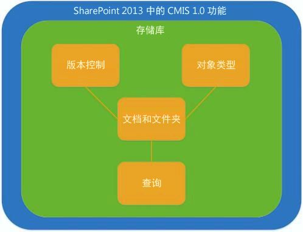
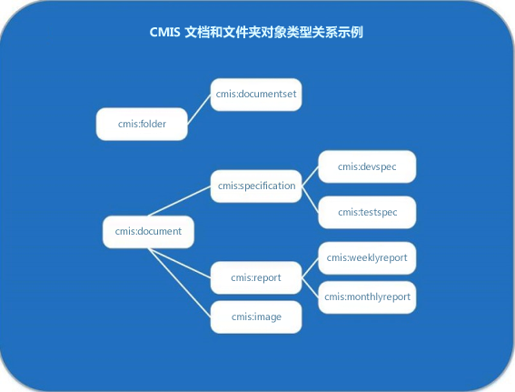

# SharePoint 2013 中的内容管理互操作性服务 (CMIS)
了解 OASIS 内容管理互操作性服务 (CMIS) 标准版本 1.0 的 SharePoint 2013 实施。
## SharePoint 2013 中的 CMIS 简介

SharePoint Server 符合  [OASIS 内容管理互操作性服务 (CMIS) 标准](https://www.oasis-open.org/committees/tc_home.php?wg_abbrev=cmis)版本 1.0，可使企业中的 SharePoint Server 内容库和其他企业内容管理 (ECM) 库之间实现集成。凭借 CMIS，用户可以根据 Internet 协议在文档系统、发布服务器和存储库之间，在企业内以及公司之间共享信息，信息均采用供应商中立格式。CMIS 标准支持基本文档管理操作，例如创建、读取、更新、删除、签入和签出。该标准支持文档及其元数据的版本管理。在"网站设置"的"管理网站功能"部分激活"内容管理互操作性服务(CMIS)创建器"功能后，CMIS 可用于任何本地 SharePoint 2013 网站。在 SharePoint 2013 中，可以使用 SharePoint CMIS 创建器，但在所有本地网站中都默认为关闭。
  
    
    
CMIS 在支持该服务的 API 之间提供互操作性，但它无法代替本地 API。CMIS 支持的对象与 SharePoint Server 开发人员通常使用的对象相交，包括文档和文件夹。但是，编写支持 CMIS 的应用程序的开发人员可能必须继续编写自定义 SharePoint Server 代码。CMIS 可以将实施该服务的解决方案的开发时间节约 60% 至 70%，但将其视为开发工具箱中的另一种工具。
  
    
    

## 在 SharePoint 2013 中实施 CMIS 的详细介绍

CMIS 规范的某些部分是强制性的，但其他很多部分是可选的。很多供应商（包括 Microsoft）实施该标准的强制性部分，以及一些可选组件。图 1 介绍了 SharePoint 2013 中实施的 CMIS 1.0 规范中指定的功能。
  
    
    
图 1. SharePoint 2013 中实施的 CMIS 1.0 功能。
  
    
    

  
    
    

  
    
    
CMIS 数据模型定义了包含其他 CMIS 数据类型（包括对象类型、版本控制、文档和文件夹以及查询功能）的存储库。
  
    
    

### CMIS 存储库和 SharePoint 文档库

CMIS 存储库是用于 CMIS 数据模型其余部分的容器。在 SharePoint 2013 中，文档库等效于 CMIS 存储库（SharePoint 2013 CMIS 创建器中不支持列表）。访问存储库通常是客户端应用程序的出发点。例如，考虑一个 SharePoint Server 网站，其中包含多个等效于 CMIS 存储库的文档库。CMIS 规范介绍了一项强制性服务 **getRepositories**，该服务会在 SharePoint Server 中获取当前  [SPWeb](https://msdn.microsoft.com/library/Microsoft.SharePoint.SPWeb.aspx) 对象中的所有有效存储库（文档库）。开发人员可以通过调用 **getRepositories** 服务或 **getRepositoryInfo** 服务连接到存储库； **getRepositoryInfo** 会获取开发人员指定的存储库。
  
    
    
CMIS 存储库包含 SharePoint Server 支持的其他 CMIS 功能，包括 CMIS 指定的文档和文件夹对象类型、CMIS 版本控制功能（反映 SharePoint Server 中的本地版本控制功能）和 CMIS 查询功能（使用类似于 SQL 的语法针对特定数据查询 CMIS 存储库）。
  
    
    

### CMIS 文档、文件夹和其他对象类型

CMIS 定义了一种对象类型功能，等效于 SharePoint Server 中的内容类型概念（特别是， [SPContentType](https://msdn.microsoft.com/library/Microsoft.SharePoint.SPContentType.aspx) 类）。每个只读 CMIS 对象类型都包含属性和属性定义。属性定义可针对对象执行的操作，例如，进行查询或版本控制。CMIS 支持为与 SharePoint 2013 中的等效对象类型相关联的属性提供属性定义（如果适用）。例如，CMIS 中的文档对象或文件夹对象可能具有使用 `cmis:LastModifiedBy` 语法的 **LastModifiedBy** 属性。与 **Document** 对象关联的 **Author** 属性编写为 `cmis:Author`。CMIS 标准定义了四种对象类型，用作基本类型。表 1 介绍了 CMIS 对象类型（无论是否受 SharePoint 2013 支持），及其在 SharePoint 中的等效功能（如果有）。
  
    
    

  
    
    

**表 1. CMIS 对象类型值及其 SharePoint 2013 等效值**

|**CMIS 对象类型**|**是否受 SharePoint Server 支持？**|**SharePoint 2013 等效功能**|**说明**|
|:-----|:-----|:-----|:-----|
|文档    |是    |**Document** 对象   |CMIS 文档对象类型直接映射到 SharePoint Server 中 **Document** 对象。   文档自身附带属性和内容流，可进行版本控制，并支持基本的创建、读取、更新和删除 (CRUD) 操作。    |
|文件夹    |是    | [SPFolder](https://msdn.microsoft.com/library/Microsoft.SharePoint.SPFolder.aspx) 对象   |CMIS 文件夹对象类型直接映射到 SharePoint Server 中的 **SPFolder** 对象。   文件夹可以包含文档和其他文件夹，但必须仅拥有一个父文件夹。文件夹自身附带属性，并且支持与文档对象相同的 CRUD 操作。    CMIS 文件夹无法进行版本控制。    |
|策略    |否    |无    |CMIS 策略对象类型并不等同于 SharePoint 中的策略概念，或者 SharePoint 对象模型中定义的任何策略对象。    |
|关系    |否    |无    |不受支持。    |
   

  
    
    
CMIS 不提供创建、修改或删除对象类型的方法。如果开发人员希望创建、修改或删除 SharePoint Server 文档对象类型或文件夹对象类型，可以使用专用的 SharePoint Server 对象模型。
  
    
    
图 2 介绍了 CMIS 文档和文件夹对象类型之间可能存在的示例关系。该图使用的标签可以在 SharePoint Server 文档管理方案中找到。例如，名称为 **cmis:folder** 的 CMIS 对象类型是 **cmis:documentset** 对象类型的父类型。 **cmis:documentset** 可以包含（但不一定要包含）组织到 [DocumentSet](https://msdn.microsoft.com/library/Microsoft.Office.DocumentManagement.DocumentSets.DocumentSet.aspx) 对象中的文档对象。
  
    
    
CMIS 文档对象类型也支持父/子关系，如此处所示， **cmis:document** 对象类型是 **cmis:specification**、 **cmis:report** 和 **cmis:image** 文档对象类型的父类型。这些文档可能会组织到 SharePoint Server 文档集中，但 CMIS 未定义此类构建。相反，CMIS 将各个对象识别为属于文档对象类型或文件夹对象类型，或者是任意这两种对象类型的子集。
  
    
    
图 2. CMIS 文档对象类型或文件夹对象类型示例
  
    
    

  
    
    

  
    
    

  
    
    

  
    
    

### SharePoint 2013 中的 CMIS 查询

查询是 SharePoint Server 支持的 CMIS 规范的可选部分。CMIS 查询使用类似于 SQL 的简单语法。CMIS 中每条查询的作用范围都限定为一个存储库，因此返回的所有查询结果都来自于查询所限定的单个存储库。针对多个存储库运行多条查询会从一个存储库为每条运行的查询返回结果，这会导致返回来自多个存储库的结果。表 2 显示了基本 CMIS 查询语句的一些示例。
  
    
    

  
    
    

**表 2. CMIS 查询语法示例**

|**CMIS 查询语句**|**说明**|
|:-----|:-----|
| `SELECT * FROM cmis:document`   |选择存储库中的所有文档。    |
| `SELECT cmis:name, cmis:author FROM cmis:document WHERE cmis:author='Tina Makovec'`   |在存储库中选择作者为 Tina Makovec 的所有文档的名称和作者。    |
| `SELECT * FROM cmis:document WHERE CONTAINS('4Q13')`   |这是使用 CONTAINS 的全文搜索的一个示例。该查询会返回存储库中包含字词 4Q13 的所有文档。   |
   

  
    
    
SharePoint Server 不支持连接，但 CMIS 1.0 规范支持。非 SharePoint CMIS 存储库可能支持在其 CMIS 查询实施中使用连接。所有支持 CMIS 查询的存储库都支持排序、选择要返回的属性及分页。
  
    
    

### CMIS 版本控制和 SharePoint 版本控制

CMIS 版本控制与 SharePoint Server 中的文档版本控制完全相同，即主要和次要版本控制，并且在 CMIS 中，签入和签出操作仅适用于文档。
  
    
    
文件夹不能进行版本控制。
  
    
    

### CMIS 更改日志支持

CMIS 指定了一个更改日志概念。CMIS 更改日志支持与对象 ID 和属性绑定的创建、更新和删除基本事件。当创建、更新或删除事件出现时，即会触发属性。更改日志支持分页，因此开发人员可以将其自己的更改日志存储在所需的任何位置。
  
    
    

## SharePoint 2013 中的身份验证和 CMIS

默认情况下，SharePoint Server 支持匿名身份验证、基本身份验证、NTLM 身份验证、摘要式身份验证、Kerberos 协议转换/约束委派身份验证、Windows 声明身份验证、声明多重身份验证和声明混合模式身份验证。
  
    
    
不支持入站 OAuth。
  
    
    

## SharePoint 2013 中的 CMIS 创建器

默认情况下，CMIS 创建器可用于在 SharePoint Server 中进行本地部署。该创建器会创建符合 CMIS 的端点，符合 CMIS 的使用者 Web 服务可以与之进行互操作。CMIS 支持和 CMIS 创建器功能适用于任何本地 SharePoint Server 实施，只要其中启用了 CMIS 创建器功能即可。SharePoint Online 不支持 CMIS。
  
    
    

## CMIS 方案和应用程序构思

通过 SharePoint 2013 中的 CMIS 功能，开发人员可以创建应用程序，以整合来自 SharePoint Server 及其他 CMIS 兼容应用程序的 CMIS 兼容数据。由于 CMIS 是供应商中立的格式，因此开发人员可编写生成符合 CMIS 的端点的代码，且这些端点能与符合 CMIS 的使用者应用程序共享，而无需针对本地应用程序 API 编写代码。例如，默认的 SharePoint 2013 CMIS 创建器可以与其他供应商的照片编辑应用程序共享一个 CMIS 库（例如，SharePoint Server 文档库）。用户可以打开存储在照片编辑应用程序创建器 CMIS 存储库中的图像文件，并在照片编辑应用程序内将其从 SharePoint Server 签出。进行更改并保存后，用户可以通过照片编辑应用程序，将最新版本签入到 SharePoint Server 文档库中。由于 CMIS 规范定义主要版本和次要版本的版本控制的方式与 SharePoint 相同，因此照片编辑应用程序用户可以使用与 SharePoint Server 中找到的逻辑完全相同的版本控制逻辑，将更改保存到 CMIS 存储库中的一个版本。
  
    
    
创建应用程序时，考虑实施能够初始化所有参数的字典的代码。参数用于针对存储库进行身份验证，以及指定数据，如使用的绑定（如 REST、AtomPub、SOAP）、服务器访问 REST 端点的 URL、用户名、密码和身份验证提供程序类（如基本身份验证）。设置参数后，开发人员可以使用 **getRepositories** 调用来连接到每个存储库。
  
    
    
CMIS 支持各种应用程序的开发，这些应用程序可使用来自多个 CMIS 创建器的数据。CMIS 用于针对企业在丰富、混合的环境中管理多个内容管理系统内容时通常遇到的情况提供支持，包括： 
  
    
    

- 将数据迁入和迁出企业内容管理系统。
    
  
- 图形用户界面 (GUI)，从多个内容库读取数据的应用程序。
    
  
- SharePoint Web 部件，使用 CMIS 汇总企业内多个旧版内容管理系统。
    
  
- 移动应用程序，可访问任何 ECM 系统中的文档。
    
  
- 照片编辑应用程序，将文件保存到启用了 ECM 功能（例如签入和签出文件的功能）的 CMIS 存储库。
    
  
- 业务线 (LOB) 系统，将报表数据导出到 ECM 存储库中。
    
  
- 合同审批应用程序，使用 SharePoint 用户界面 (UI) 元素管理中央审批过程，同时依然允许将合同发布到几个不同系统。
    
  

### 示例：Contoso 财务应用程序

考虑一个应用程序，一个使用来自多个 CMIS 数据提供程序（Contoso 财务应用程序）的数据的 SharePoint Server Web 部件。Contoso 财务应用程序收集分布在以下三个服务器中的财务数据，并将其制成表格：IBM 服务器、运行 SharePoint Server 的服务器，以及内部 Contoso 服务器。SharePoint Server 应用程序使用一个 Web 部件在任一 SharePoint Server 页面内显示来自所有三种数据源的数据。应用程序不需要特定于任何 CMIS 存储库（SharePoint Server 文档库）实施的自定义代码。
  
    
    

## CMIS 和 SharePoint 对象模型

SharePoint 对象模型为开发人员提供了大量可扩展性选项，但不受 CMIS 支持，包括用于管理对象类型的 API、用于管理网站或存储库列的 API、使用 SharePoint 专有关键字和语法的查询、社会性标签和访问控制项 (ACE)。 
  
    
    
CMIS 的 SharePoint Server 实施使用  [BlockedFileExtensions](https://msdn.microsoft.com/library/Microsoft.SharePoint.Administration.SPWebApplication.BlockedFileExtensions.aspx) 属性来获取文件扩展名列表，该列表无法通过 Web 应用程序中的网站进行上载或下载。CMIS 遵从 [SharePoint 默认情况下阻止的文件类型](http://technet.microsoft.com/zh-cn/library/cc262496.aspx)。
  
    
    
开发人员可以采用任何语言编写 CMIS 客户端。例如，SharePoint 开发人员可以使用 .NET 客户端对象模型 (CSOM) 或 JavaScript 对象模型 (JSOM) 创建客户端。开发人员还可以使用服务器端代码来开发 SharePoint 应用程序，该应用程序自动承载在 Microsoft Azure 中或由提供程序承载在任何服务器中，包括 Internet Information Services (IIS) 或 Microsoft Azure。
  
    
    

## 查找开源 CMIS 实施并与之进行互操作

目前存在很多开源项目，这些项目可通过 CMIS 1.0 标准的 SharePoint 2013 实施进行测试。其中一些示例包括  [Apache Chemistry 项目](http://chemistry.apache.org)； [Open CMIS 项目](http://chemistry.apache.org/java/opencmis.mdl)，该项目通过 Java 测试客户端和服务器 CMIS 实施；针对 .NET 客户端的  [DotCMIS](http://chemistry.apache.org/dotnet/dotcmis.mdl) 项目、 [cmislib（适用于 Python 的 CMIS 客户端库）](http://code.google.com/p/cmislib/)项目；以及  [phpclient（适用于 PHP 的 CMIS 客户端库）](http://chemistry.apache.org/php/phpclient.mdl)。
  
    
    
 [CMIS Workbench](http://chemistry.apache.org/java/developing/tools/dev-tools-workbench.mdl) 是面向开发人员的 CMIS 桌面客户端应用程序，支持浏览 CMIS 存储库并交互测试 Open CMIS 的 CMIS 开发项目。Workbench 可通过系统属性进行配置。如果使用专家登录对话框，开发人员还可以配置其他属性。
  
    
    

## CMIS 1.1 功能

CMIS 1.1 不受 SharePoint 2013 支持，但 CMIS 规范的较新版本将包含一些值得了解的新功能。其中一些亮点包括：
  
    
    

- **Type mutability**：创建并修改内容类型的功能。
    
  
- **Repository features**：扩展 **getRepositoryInfo** 服务以将一列扩展项发布至所支持标准的功能。
    
  
- **Retention and hold**：要求一篇文档在一段时间内或无限期地不被删除的服务。
    
  
- **Browser binding**：一种新的可选绑定，专门为支持运行 Web 浏览器的应用程序设计。该绑定使用 JSON，而不是 XML，并且始终使用 HTTP GET 和 POST 命令。
    
  
- **Secondary object types**：命名的属性集，可动态添加到 CMIS 项目或从中删除。
    
  
- **cmis:item type**：新的顶级数据模型类型，适用的存储库必须通过 CMIS 显示不符合 CMIS 模型关于文档、文件夹、策略或关系对象类型的定义的任何对象类型。
    
  
- **Bulk update properties**：支持在单个服务调用内对对象集进行批量属性更新的方法。
    
  
- **Append to a stream**：针对追加到内容流的支持。通过该功能，客户端可以将上载的大量文档内容划分为很多较小的调用。
    
  

## 其他资源

-  [添加 SharePoint 2013 功能](add-sharepoint-2013-capabilities.md)
    
  
-  [管理被阻止的文件类型](http://technet.microsoft.com/zh-cn/library/cc262496.aspx)
    
  
-  [OASIS 内容管理互操作性规范 (CMIS) 版本 1.0](http://docs.oasis-open.org/cmis/CMIS/v1.0/os/cmis-spec-v1.0.mdl)
    
  
-  [OASIS 内容管理互操作性规范 (CMIS) 版本 1.1](http://docs.oasis-open.org/cmis/CMIS/v1.1/cs01/CMIS-v1.1-cs01.mdl)（不受 SharePoint 2013 支持）
    
  

  
    
    

