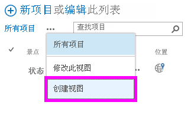
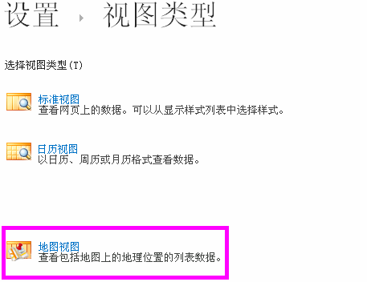
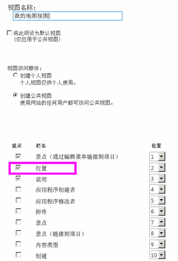
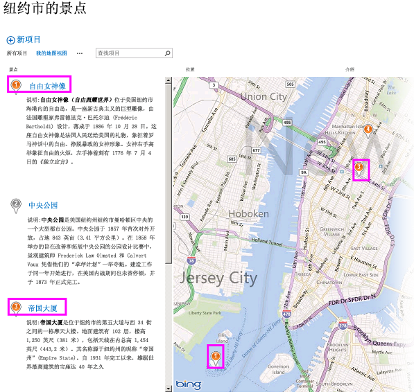
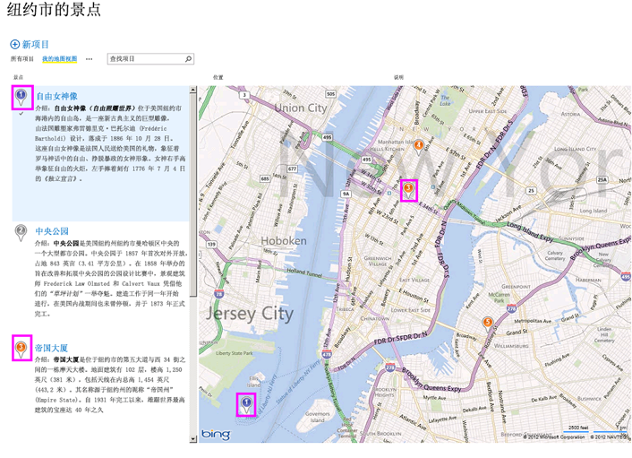
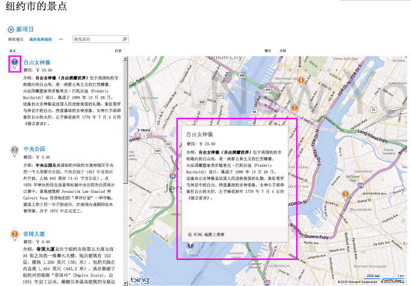

# 在 SharePoint 2013 中针对地理位置字段创建地图视图
了解如何通过在 SharePoint 2013 列表中使用地图视图来显示位置信息。您可以通过 SharePoint 用户界面 (UI) 手动创建地图视图，也可以使用新的 **Geolocation** 字段类型以编程方式创建地图视图。
SharePoint 2013 引入了一个名为 **Geolocation** 的新字段类型，可允许您使用位置信息批注 SharePoint 列表。例如，您现在可以使列表具有位置感知性并通过 Bing 地图显示经度和纬度坐标。通常，在地图视图中会将一个条目视作一个标注。
  
    
    

若要在 SharePoint 列表中显示地图视图，您必须使用 Bing 地图服务。如果您使用 UI 创建列表，则 **Geolocation** 字段将不可用。此字段必须以编程方式插入。有关如何以编程方式呈现和处理此数据类型的信息，请参阅 [集成 SharePoint 2013 中的位置和映射功能](integrating-location-and-map-functionality-in-sharepoint-2013.md)。
通过 **Geolocation** 字段和地图视图，您可以通过将 SharePoint 中的数据集成到 Web 和移动应用程序中的映射体验，从而为任何信息提供空间上下文。本文并未介绍如何呈现 **Geolocation** 字段或提供关于创建基于位置的移动应用程序的开发人员指导；但本文提供了关于以编程方式以及使用 Bing 地图从 SharePoint UI 中创建地图视图的说明。
  
    
    

必须在每台 SharePoint 前端 Web 服务器上均安装名为 SQLSysClrTypes.msi 的 MSI 包，才能查看 **Geolocation** 字段值或列表中的数据。此软件包安装的组件可在 SQL Server 2008 中实现新几何、地理和层次 ID 类型。默认情况下，为 SharePoint Online 安装此文件。但是，没有为 SharePoint Server 2013 的内部部署安装此文件。您必须是 Farm Administrators 组的成员才能执行此操作。若要下载 SQLSysClrTypes.msi，请参阅 Microsoft 下载中心中的 [Microsoft SQL Server 2008 R2 SP1 功能包](http://www.microsoft.com/zh-cn/download/details.aspx?id=26728)（针对 SQL Server 2008）或  [Microsoft SQL Server 2012 功能包](http://www.microsoft.com/zh-cn/download/details.aspx?id=29065)（针对 SQL Server 2012）。
## 创建地图视图的先决条件
<a name="SP15CreatingMapViews_Preqs"> </a>


- 对 SharePoint 2013 列表的访问权限，具有创建视图的足够权限。
    
  
- 包含 **Geolocation** 列的 SharePoint 2013 列表
    
  
- 场级别或网站级别的有效 Bing 地图密钥集，可从  [Bing 地图帐户中心](http://www.bingmapsportal.com/)获得
    
> **重要信息**
> 您负责遵守适用于您使用 Bing 地图密钥的条款和条件，以及就传递给 Bing 地图服务的数据向用户披露您的应用程序。 
- Visual Studio 2008 或 Visual Studio 2010
    
  

## 什么是地图视图？
<a name="SP15CreatingMapViews_AMapView"> </a>

地图视图是显示地图（采用从 Bing 地图服务获取的数据）的 SharePoint 视图，使用来自 **Geolocation** 字段类型的经度和纬度条目。当 SharePoint 列表上有可用的 **Geolocation** 字段类型时，即可以编程方式或从 SharePoint UI 中创建地图视图。在该列表中，SharePoint 2013 将地点显示在由 Bing 地图支持的地图上。此外，名为"地图视图"的新视图类型在 Bing 地图 Ajax 控件 V7 上将列表项显示为标注，其中列表项将以卡片的形式显示在左窗格中。
  
    
    

> **注释**
> 任何 SharePoint 2013 列表最多只能有两个 **Geolocation** 列；不能在同一列表中添加第三个 **Geolocation** 列。一个地图视图中只能有一个 **Geolocation** 列。您可以创建使用不同的 **Geolocation** 列的多个地图视图。
  
    
    


## 从 SharePoint UI 创建地图视图
<a name="SP15CreatingMapViews_FromSharePointUI"> </a>

以下步骤演示如何从 SharePoint 2013 UI 中创建地图视图。
  
    
    

1. 打开带有 **Geolocation** 列的 SharePoint 2013 列表。
    
  
2. 从 ECB（编辑控制块）菜单中选择"创建视图"，如图 1 所示。
    
   **图 1. 从 ECB 菜单中创建视图**

  


  

  

  
3. 在"选择视图类型"页上，选择"地图视图"，如图 2 所示。
    
   **图 2. 选择视图类型**

  


  

  

  
4. 选择视图类型后，您可以选择各种字段以在地图视图中显示，如图 3 所示。
    
   **图 3. 为地图视图选择字段**

  


  

    
> **注释**
> 创建地图视图至少需要一个 **Geolocation** 字段。不能为地图视图选择多个 **Geolocation** 字段，但可以创建使用两个不同的 **Geolocation** 字段的两个不同的地图视图。

5. 在添加完必需的 **Geolocation** 字段和您需要的任何其他字段后，选择"确定"。即会创建一个地图视图，如图 4 所示。
    
   **图 4. 完成后的地图视图**

  


  

  

  

## 以编程方式创建地图视图
<a name="SP15CreatingMapViews_ByProgramatically"> </a>

按照下列步骤以编程方式为 SharePoint 列表创建地图视图。
  
    
    

1. 启动 Visual Studio。
    
  
2. 在菜单栏上，选择"文件"、"新建项目"。将打开"新建项目"对话框。
    
  
3. 在"新建项目"对话框中，在"已安装的模板"框中选择"C#"，然后选择"控制台应用程序"模板。
    
  
4. 给项目命名，然后选择"确定"按钮。
    
  
5. Visual Studio 即会创建项目。添加对以下程序集的引用，并选择"确定"。
    
  - Microsoft.SharePoint.Client.dll
    
  
  - Microsoft.SharePoint.Client.Runtime.dll
    
  
6. 在默认的 .cs 文件中，按下列方式添加 **using** 指令。
    
     `using Microsoft.SharePoint.Client;`
    
  
7. 在 .cs 文件中，将下面的代码添加到 **Main** 方法。
    
    > **注释**
      > 调查列表或事件列表不支持 JSLink 属性。SharePoint 日历是事件列表。 

  ```cs
  
class Program
    {
        static void Main(string[] args)
        {
            CreateMapView ();
            Console.WriteLine("A map view is created successfully");
        }
        private static void CreateMapView()
        { 
         // Replace <Site URL> and <List Title> with valid values.
            ClientContext context = new ClientContext("<Site Url>"); 
            List oList = context.Web.Lists.GetByTitle("<List Title>");
            ViewCreationInformation viewCreationinfo = new ViewCreationInformation();
         // Replace <View Name> with the name you want for your map view.
             viewCreationinfo.Title = "<View Name>";
             viewCreationinfo.ViewTypeKind = ViewType.Html;
             View oView = oList.Views.Add(viewCreationinfo);
             oView.JSLink = "mapviewtemplate.js";
            oView.Update();
            context.ExecuteQuery();
        } 
    }
  ```

8. 将  _<Site Url>_ 和 _<List Title>_ 替换为有效值。
    
  
9. 导航到该列表。您应当可以看到新建的视图具有您在上述代码中指定的名称。
    
  

## 了解地图视图中的颜色编码标注
<a name="SP15CreatingMapViews_ColorCode"> </a>

地图视图提供三种颜色的标注（如图 5 所示），每种颜色均可提供不同的用户体验。地图上的标注的颜色与左窗格中相对应项的标注的颜色相同。
  
    
    

- **橙色** 表示该项的 **Geolocation** 字段是使用 Bing 地图服务映射的。
    
  
- **灰色** 表示该项的 **Geolocation** 字段为空。该项不能使用 Bing 地图服务来映射，因此，地图上不会出现对应于该项的任何标注。
    
  
- **蓝色** 当用户将鼠标悬停在某个列表项上时，该标注的颜色将由橙色变成蓝色。左窗格中的标注和地图上相对应的标注的颜色均会改变
    
  

**图 5. 带有不同标注颜色的地图视图**

  
    
    

  
    
    

  
    
    
在创建地图视图后，所有项均会显示为标注。用户可以通过将鼠标悬停在标注上来获取有关项的详细信息，如图 6 所示。
  
    
    

**图 6. 地图视图中用户的标注体验**

  
    
    

  
    
    

  
    
    

  
    
    

  
    
    

## 其他资源
<a name="SP15CreatingMapViews_AdditionalResources"> </a>


-  [集成 SharePoint 2013 中的位置和映射功能](integrating-location-and-map-functionality-in-sharepoint-2013.md)
    
  
-  [如何：在 SharePoint 2013 中以编程方式向列表添加 Geolocation 列](how-to-add-a-geolocation-column-to-a-list-programmatically-in-sharepoint-2013.md)
    
  
-  [如何：在 SharePoint 2013 中设置 Web 和服务器场级别的必应 Bing 地图密钥](how-to-set-the-bing-maps-key-at-the-web-and-farm-level-in-sharepoint-2013.md)
    
  
-  [如何：将地图与 Windows Phone 应用程序和 SharePoint 2013 列表集成](how-to-integrate-maps-with-windows-phone-apps-and-sharepoint-2013-lists.md)
    
  
-  [在移动应用程序中使用 SharePoint 2013 位置字段类型](http://technet.microsoft.com/zh-cn/library/fp161355%28office.15%29.aspx)
    
  

