# 使用 Visual Studio 2012 创建 SharePoint 工作流应用程序
逐步完成使用 Microsoft Visual Studio 2012 创建工作流 SharePoint 外接程序的过程。
## 必备组件
<a name="bmPreReq"> </a>

此开发方案假定安装了 SharePoint Server 2013 服务器场和 工作流管理器 1.0 服务器场并进行了配对。这两个服务器场可位于相同或单独的服务器计算机中。此外，该方案假定工作流开发远程进行（即在与两台服务器计算机分离的计算机上），并且使用 Microsoft Visual Studio 2012 或更高版本。
  
    
    

- 服务器平台：
    
  - Windows Server 2008 R2。
    
  
  - Microsoft SharePoint Server 2013
    
  
  - 工作流管理器 1.0
    
  
- 开发平台：
    
  - Microsoft Visual Studio 2012 或更高版本。
    
  
  - Visual Studio 2013 Office 开发人员工具。
    
    > **注释**
      > 只有在使用 Visual Studio 2008 的情况下才需要 Visual Studio 2013 Office 开发人员工具。Visual Studio 的更高版本包含 Office 开发人员工具。 
如需有关设置和配置 SharePoint 工作流开发环境的帮助，请参阅以下内容：
  
    
    

-  [准备设置和配置 SharePoint 工作流开发环境](prepare-to-set-up-and-configure-a-sharepoint-workflow-development-environment.md)
    
  
-  [在 SharePoint Server 2013 中配置工作流](http://technet.microsoft.com/zh-cn/library/jj658586%28v=office.15%29)
    
  
-  [视频系列：在 SharePoint Server 2013 中安装和配置工作流](http://technet.microsoft.com/zh-cn/library/dn201724%28v=office.15%29)
    
  

## 入门
<a name="bmGetStarted"> </a>

业务设置中的一种常见工作流应用场景是文档审阅和审批流程。在此演练中，我们创建了 SharePoint 外接程序，可使用 SharePoint 工作流自动化文档的传送、通知和批准（或拒绝）。我们在 Microsoft Visual Studio 2012 中使用 SharePoint 工作流设计器创建此工作流。
  
    
    
以下是一个流程图，描述了我们将创建的工作流的过程。
  
    
    

**图 1. 描述文档审批工作流的流程图。**

  
    
    

  
    
    
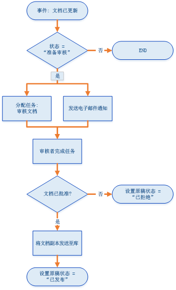
  
    
    
总的来说，工作流执行以下操作：
  
    
    

  
    
    

1. 与特定文档库相关的文档更改事件启动工作流实例。
    
  
2. 如果文档状态设置为"可供审阅"，工作流会向预先安排的审阅者分配一项任务，然后向审阅者发送关于任务的电子邮件通知。
    
  
3. 如果审阅者未能批准文档，文档文件将保留在草稿文档库中；但是，文档状态会设置为"已拒绝"。
    
  
4. 如果审阅者批准了文档，工作流会将文档复制到已发布文档库中。原始文件保留在草稿文档库中，但状态设置为"已发布"。
    
  

    
> **重要信息**
> 启动此演练之前，请确保正确安装并配置了工作流开发环境。有关详细信息，请参阅 [准备设置和配置 SharePoint 工作流开发环境](prepare-to-set-up-and-configure-a-sharepoint-workflow-development-environment.md)。此外，请确保具有 SharePoint Server 2013 实例，以便您针对其开发工作流。有关详细信息，请参阅 [安装 SharePoint 2013](http://technet.microsoft.com/zh-cn/library/cc303424.aspx)。 
  
    
    


## 准备环境
<a name="bmPrepare"> </a>

第一步是为我们的 SharePoint 网站准备工作流将使用的文档库。
  
    
    

1. 启动 Visual Studio 2008 并使用"SharePoint 2013 应用程序"模板创建新项目，如图 2 所示。
    
    > **注释**
      > 在此演练中，解决方案文件的名称为"DocApprovalWorkflow1"。建议您使用相同的名称。但是，如果您将解决方案命名为不同名称，请务必遵循指示进行必要的调整。 

   **图 2. 在 Visual Studio 2012 中创建新项目**

  

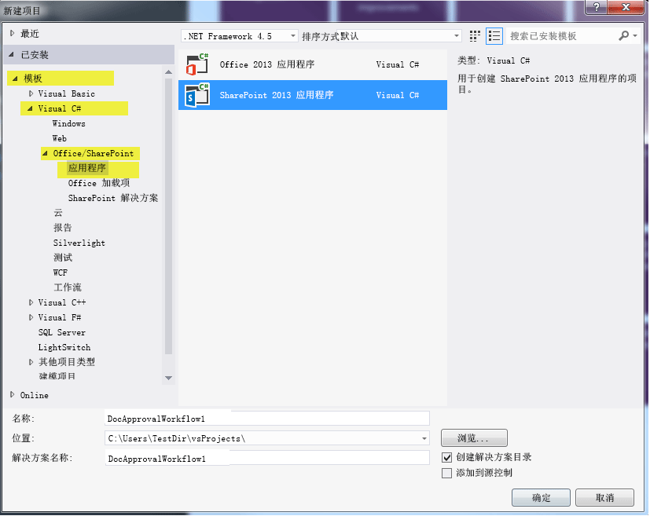
  

  

  
2. 在您的相关 SharePoint 网站上，通过执行以下操作创建两个新文档库：
    
  - 在"解决方案资源管理器"中，右键单击"DocApprovalWorkflow1"图标，然后依次选择"添加">"新项目"和"列表"。
    
  
  - 在生成的"SharePoint 自定义向导"中，在名称字段中输入"草稿文档"；然后，在第一个单选按钮下的下拉菜单中选择"文档库"，如图 3 所示。
    
  
  - 单击"下一步"，采用默认设置，然后单击"完成"。
    
   **图 3. 列表设置的 SharePoint 自定义向导。**

  

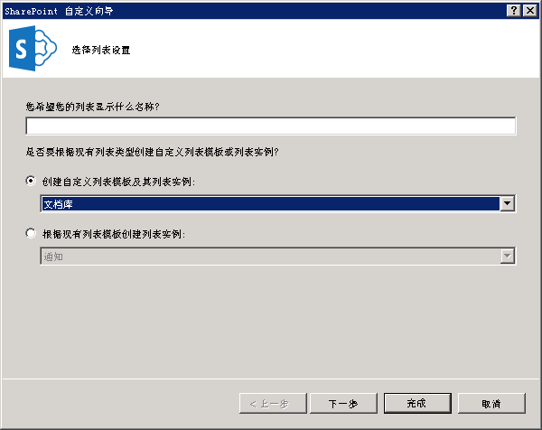
  

  

  
3. 使用如上所述的相同步骤创建第二个文档库，但将此第二个库命名为"已发布文档"。
    
  
4. 向刚创建的 **两个** 新文档库添加两个自定义列：
    
  - 创建名称为"审批者"的自定义列，并将其设置为"用户或用户组"列表列类型。
    
  
  - 创建名称为"文档状态"的自定义列，并将其设置为"选项"列表列类型（参见图 4）。
    
  
5. 在"文档状态"列中，通过展开属性网格中的 **Type** 属性添加 5 个选项，然后单击 **Items** 属性上的省略号按钮（"…"）。在显示的对话框中输入选项值，如图 4 所示。
    
  - 正在创作草稿
    
  
  - 可供审阅
    
  
  - 已批准发布
    
  
  - 已拒绝
    
  
  - 已发布
    
  

   ****

  

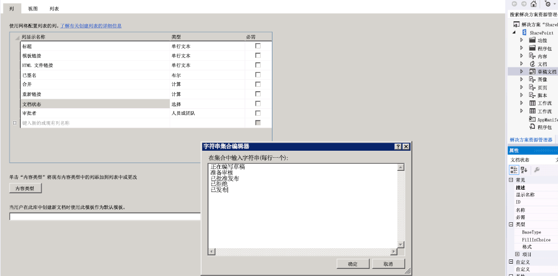
  

  

  

## 创建基本工作流
<a name="bmCreateWorkflow"> </a>

现在，我们准备好创建工作流本身。
  
    
    

1. 在 Visual Studio 中，右键单击"DocApprovalWorkflow1"图标（在"解决方案资源管理器"中），选择"添加">"新项目"，然后选择"工作流"，以创建新工作流（参见图 5）。
    
   **图 5. 添加新项目 > 工作流向导。**

  

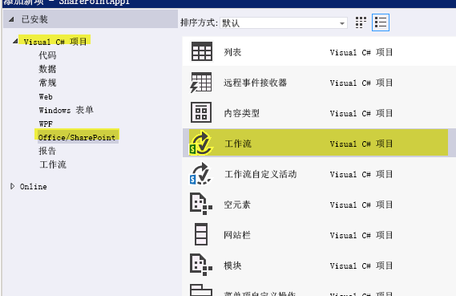
  

  

  
2. 提示后，将工作流命名为"DocumentApprovalWorkflow"，并选择"列表工作流"作为工作流类型（参见图 6）。
    
   **图 6. 指定工作流名称和类型。**

  

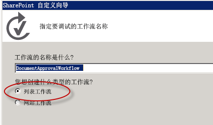
  

  

  
3. 在"SharePoint 自定义向导"中，将新工作流与草稿文档库相关联；然后，选择创建新历史记录列表和新工作流任务列表，如图 7 所示。完成后，单击"下一步"。
    
   **图 7. 为新工作流完成 SharePoint 自定义向导。**

  

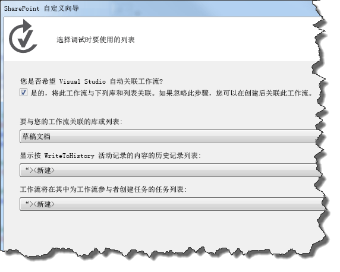
  

  

  
4. 将工作流设置为在草稿文档库中的项发生变化时自动启动。您也可以将手动启动工作流的复选框保留选中状态；这样，您无需更改文档即可轻松测试工作流。请参见图 8。
    
   **图 8. 设置工作流的激活参数。**

  

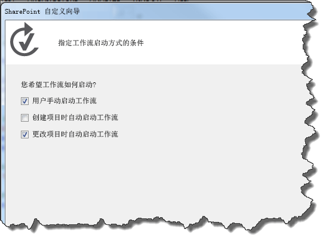
  

    
> **注释**
> 创建工作流后，您可以通过针对在"解决方案资源管理器"中选择的工作流使用属性网格，更改工作流关联类型（参见图 9）。然后，单击"完成"。 

   **图 9. 工作流属性网格。**

  

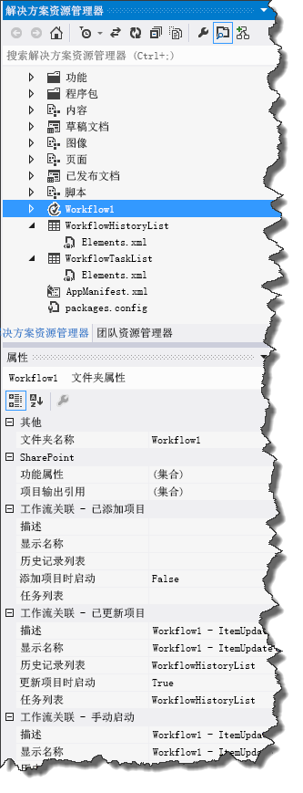
  

  

  
5. 最后，将 SharePoint Server 配置为使用 SMTP 服务管理传出电子邮件。有关说明，请参阅 [为 SharePoint 2013 服务器场配置传出电子邮件](http://technet.microsoft.com/zh-cn/library/cc263462.aspx)。若要允许工作流发送与工作流任务相关的电子邮件通知，则需要执行此操作。
    
  

## 实现工作流逻辑
<a name="bmImplementLogic"> </a>

现在，我们已设置 SharePoint Server 并创建基本工作流，可以开始设计工作流逻辑。
  
    
    

1. 通过双击"解决方案资源管理器"中的工作流项目项，打开工作流设计器。您会看到工作流设计器图面（和工作流工具箱）；设计器填充了名为"序列"的初始工作流容器。
    
  
2. 我们的第一步是从工具箱获取 **LookupSPListItem** 活动（参见图 10），然后将其置于设计器图面上的"序列"容器中。我们使用此活动以在任何给定时间获取文档状态， **LookupSPListItem** 活动以 [DynamicValue](http://msdn.microsoft.com/zh-cn/library/windowsazure/microsoft.activities.dynamicvalue%28v=azure.10%29.aspx) 对象形式返回文档状态，对象中包含一组键-值对形式的 SharePoint 列表项属性。
    
   **图 10. LookupSPListItem 活动选择器。**

  

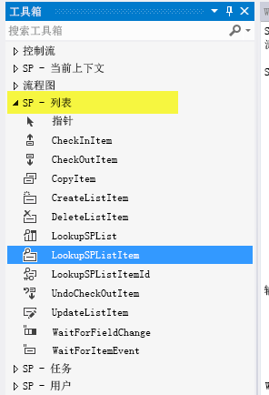
  

  

1. 若要配置"LookupSPListItem"活动，首先在设计器中单击该活动以进行选择。此操作会激活活动的属性网格。
    
  
2. 使用属性网格中的组合框配置"LookupSPListItem"活动，以使用" 当前项目"作为"ItemId"及使用"当前列表"作为"ListId"，如图 11 所示。
    
   **图 11. 配置 LookupSPListItem 属性。**

  

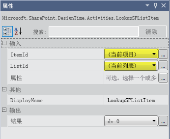
  

  

  
3. 在"LookupSPListItem"活动图块中，单击"获取属性"链接。此操作会为您完成两个重要步骤：
    
1. 首先，会创建一个 **DynamicValue** 类型的变量，并将其绑定到"LookupSPListItem"活动的输出参数（名称为 _Result_）。列表项的属性存储在此变量中。
    
  
2. 其次，会添加名称为"GetDynamicValueProperties"的新活动（参见图 12），并将新创建的 **DynamicValue** 变量设置为此新活动的输入参数。通过此活动，您可以从 **DynamicValue** 变量提取列表项属性。
    
  
4. 在"GetDynamicValueProperties"活动中，单击"定义…"打开对话框，您可以从中选择想要提取的属性。在选择属性过程中，请参阅图 12，其中显示了一部分与打开的"属性"对话框合并的设计器图面。
    
   **图 12. 选择想要提取的 DynamicValue 属性。**

  

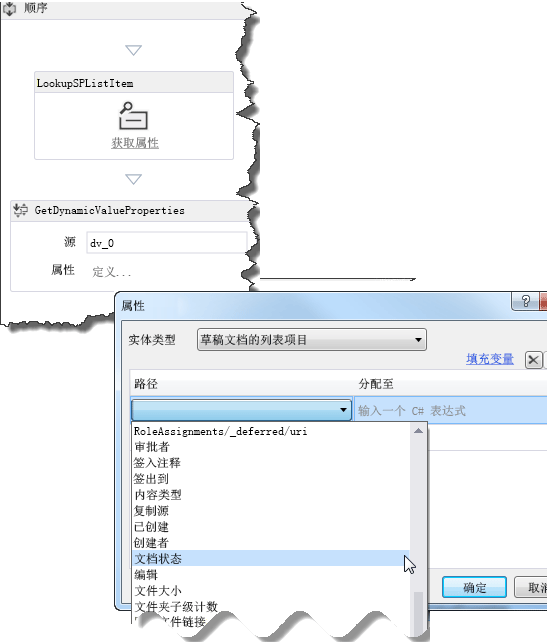
  

  

1. 对于"实体类型"，选择"草稿文档列表项"。
    
  
2. 在数据网格的"路径"列中，单击"创建属性"以打开组合框，其中包含草稿文档库中列表项的可用属性。从组合框选择"文档状态"。
    
  
3. 在数据网格的下一行中，再次单击"创建属性"；这次，从组合框选择"审批者"。
    
  
4. 现在，单击对话框中的"填充变量"链接。此操作会为每行创建一个适当数据类型的变量，并在数据网格的"分配到"列中进行分配，如图 13 所示。
    
   **图 13. 获取文档状态和审批者属性。**

  

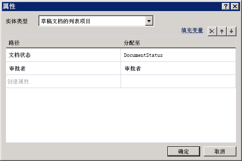
  

  

  
5. 我们现在已有所需的列表项值。下一步是设置工作流以检查文档是否"可供审阅"，并在文档可供审阅的情况下采取适当操作。
    
1. 从工具箱中，将 **If** 活动拖到工作流设计器图面。（您会看到 **If** 活动在工具箱的）"控制流"部分。
    
  
2. 将 **If** 条件设置为 `DocumentStatus.Equals("Ready for Review")`，如图 14 所示。
    
   **图 14. 创建 If/Then 语句以触发任务。**

  

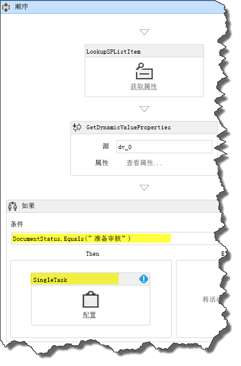
  

  

  
3. 接下来，从工具箱的"SP - 任务"部分，拖动"SingleTask"活动，并将其置于您的 **If** 活动的 **Then** 框中。实际上，您已配置工作流，从而 **If** 文档可供审阅， **Then** 工作流将完成此任务。
    
  
6. 我们的下一步是使用配置对话框配置刚创建的任务，如图 15 所示。
    
   **图 15. 任务配置对话框。**

  

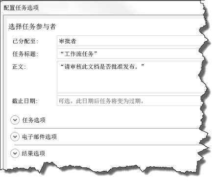
  

  

1. 首先，我们将任务分配给审批者。为此，单击"SingleTask"活动图块中的"配置"链接。
    
  
2. 将"分配到："字段设置为"审批者"。
    
  
3. 请注意，"任务标题："字段自动填充为"工作流任务"。
    
  
4. 在"正文："字段中，输入有关指示审批者的简单消息，如"请审阅此文档以批准发布"。
    
  
5. 单击"确定"以保存。
    
  

    请注意，您此时会在"SingleTask"活动中遇到身份验证错误。选择"SingleTask"图块后，查看属性网格中的"AssignedTo"属性，注意其中包含一个错误图标。将鼠标悬停在属性名称上可查看描述问题的工具提示。我们看到"AssignedTo"属性要求 **String** 值，但"审批者"变量的数据类型为 **Int32**。
    
    若要更正此错误，将".ToString()"附加到属性网格上的"AssignedTo"行中的"审批者"，以将变量转换为 **String** 数据类型，如图 16 所示。
    

   **图 16. 在属性网格中将"审批者"变量转换为字符串数据类型。**

  

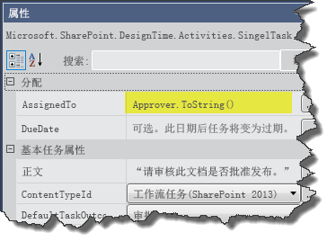
  

直至此演练当前，您已创建并配置了工作流任务，该任务执行了两项操作：设置对文档进行审阅，同时向任务受理人（在本例中为"审批者"）发送了一封电子邮件，通知其任务已分派并等待进行操作。
    
  
7. 让我们看一看"SingleTask"活动的属性网格。滚动到属性网格的底部，注意在"输出"部分中有"Outcome"和"TaskItemId"两个属性，它们是输出参数。
    
    注意"Outcome"变量的名称： _outcome_0_（或类似名称）。我们使用此变量检查任务的结果，即审批者是批准还是拒绝了文档。
    
    > **注释**
      > "Outcome"输出参数返回对应于结果索引的 **Int32** 值，即"已批准"为 **0** 和"已拒绝"为 **1**。这些整数是即用 SharePoint 网站列"任务结果"中提供的默认值。 
8. 现在，为了让工作流查看任务结果，我们需要添加另一个 **If** 活动，并将其置于"SingleTask"活动之后，但在 **Then** 区域内，如图 17 所示。将 **If** 条件设置为" `outcome_0 == 0`"可告知我们文档是否得到批准。
    
   **图 17. 添加 IF 活动以查看任务状态。**

  

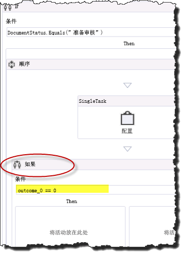
  

  

  
9. 如果审批者已将任务设置为"已批准"，则将文档状态更新为"已批准发布"，然后将文档文件复制到已发布文档库。或者，如果审批者拒绝了文档，我们需要将文档状态设置为"已拒绝"。
    
1. 在此新 **If** 活动中，将"UpdateListItem"活动拖到 **Then** 框中。
    
  
2. 在"UpdateListItem"活动的属性网格中进行配置，从而将"ItemId"设置为"(current item)"及将"ListId"设置为"(current list)"，如图 18 所示。
    
  
3. 接下来，选择"UpdateListItem"活动后，单击与属性网格中"ListItemPropertiesDynamicValue"字段相邻的省略号按钮（"…"）。此操作会打开一个对话框，您可以在对话框中指定想要更新的列表项属性。
    
   **图 18. 设置要更新的列表项属性。**

  

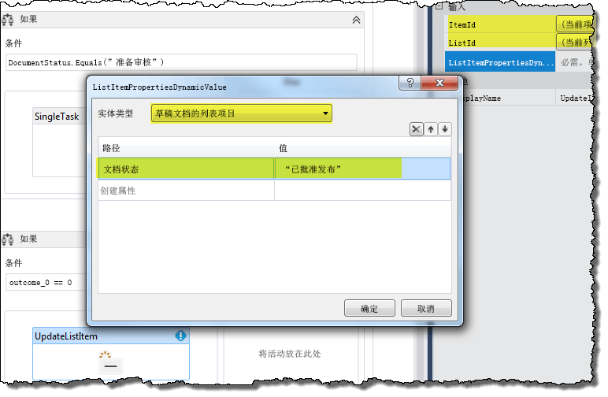
  

  

  
4. 在对话框中，首先使用组合框将"实体类型"设置为"草稿文档列表项"（如图 18 所示）。然后，在数据网格中，单击"创建属性"，并从下拉列表中选择"文档状态"。完成后，在"值"列表下，输入"已批准发布"（包括引号）并单击"确定"。
    
  
10. 在当前 **If** 活动的 **Then** 区域，拖动"CopyItem"活动并将其直接置于"UpdateListItem"活动下方，如图 19 所示。
    
   **图 19. 将 CopyItem 活动添加到工作流中。**

  

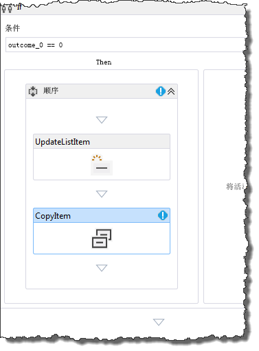
  

然后，在属性网格中配置"CopyItem"活动的属性，如图 20 所示。属性值已突出显示。
    

   **图 20. 配置 CopyItem 活动。**

  

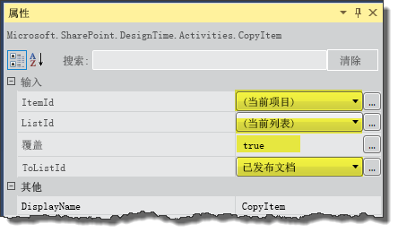
  

    
> **注释**
> 为了实现此演练的目的，我们将假定所有已发布文档来自草稿文档库；因此，我们无需担心对重复文件名称的控制。 

11. 最后，我们需要添加一个活动来处理审阅者拒绝文档的情况。为此，我们将"UpdateListItem"活动添加到当前 **If** 活动的 **Else** 区域。配置此"UpdateListItem"活动，步骤与之前步骤 9(c) 中的活动相同，但现在我们要将文档状态设置为"已拒绝"，如图 21 所示。
    
   **图 21. 为已拒绝文档配置 UpdateListItem 活动的属性。**

  

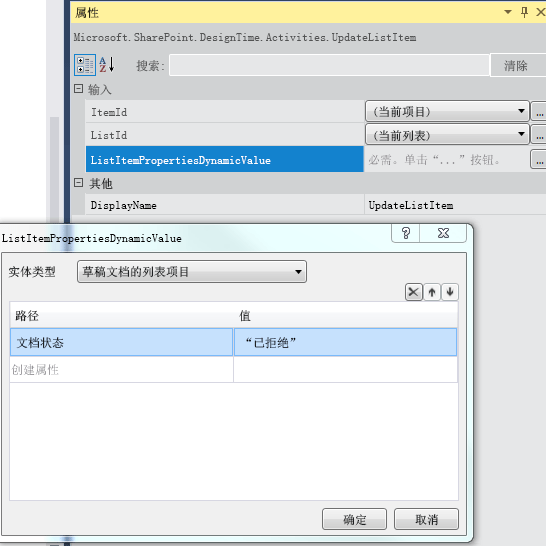
  

  

  
这样就完成了"创建 SharePoint 文档审批工作流"。完整的工作流显示在图 22 中。
  
    
    

**图 22. 完整的 SharePoint 文档审批工作流。**

  
    
    

  
    
    
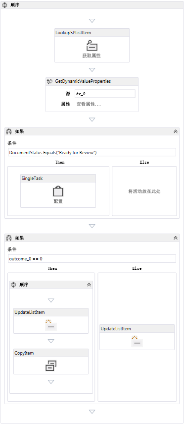
  
    
    

  
    
    

  
    
    

## 打包和部署工作流
<a name="bk_deploy"> </a>

以下资源提供了有关将工作流打包并部署为 SharePoint 外接程序的指南：
  
    
    

-  [部署和安装 SharePoint 应用程序：方法和选项](http://msdn.microsoft.com/zh-cn/library/fp179933.aspx)
    
  
-  [发布 SharePoint 应用程序](http://msdn.microsoft.com/zh-cn/library/jj164070.aspx)
    
  
-  [如何：在沙盒解决方案中创建和部署声明性工作流](http://msdn.microsoft.com/zh-cn/library/gg615452%28v=office.14%29.aspx)（使用 SharePoint Designer 2013）
    
  

> **警告**
> 可通过将应用程序包的  `workflowmanifest.xml` 文件中的以下标记更改为 **true**，来区分包含集成工作流（可与父 Web 上的列表相关联）的 SharePoint 外接程序与普通工作流应用程序： 
  
    
    


```XML

<SPIntegratedWorkflow xmlns="http://schemas.microsoft.com/sharepoint/2014/app/integratedworkflow">
    <IntegratedApp>true</IntegratedApp>
</SPIntegratedWorkflow>

```


## 其他资源
<a name="bk_addresources"> </a>


-  [SharePoint 2013 中的工作流](workflows-in-sharepoint-2013.md)
    
  
-  [准备设置和配置 SharePoint 工作流开发环境](prepare-to-set-up-and-configure-a-sharepoint-workflow-development-environment.md)
    
  
-  [SharePoint 工作流开发最佳实践](sharepoint-workflow-development-best-practices.md)
    
  
-  [使用 Visual Studio 开发 SharePoint 2013 工作流](develop-sharepoint-2013-workflows-using-visual-studio.md)
    
  

  
    
    

