# 使用 SharePoint 2013 工作流平台通过提升的权限创建工作流
了解如何使用 SharePoint 2013 工作流平台以提升的权限创建工作流。
## SharePoint Server 2013 应用程序目录和工作流
<a name="section1"> </a>

本文介绍如何创建用于访问 SharePoint 中的对象的 SharePoint 2013 工作流（需要提升的权限）。这些解决方案将使用两个功能：向工作流应用程序授予权限和使用仅限应用程序的步骤打包操作。
  
    
    

> **重要信息**
> 本文假设已安装和配置 SharePoint 2013 工作流平台，并且已为应用程序配置 SharePoint 2013。有关 SharePoint 2013 工作流和 SharePoint 2013 相关应用程序（包括安装和配置）的详细信息，请参阅  [SharePoint 2013 中的工作流](http://technet.microsoft.com/zh-cn/sharepoint/jj556245.aspx)和 [Install and manage apps for SharePoint 2013](http://msdn.microsoft.com/library/733647a3-a5d3-475b-967d-3bb627c2a0c2.aspx)。 
  
    
    


### 以提升的权限创建工作流的概述

假设作为 SharePoint 管理员，您想定义某些流程来管理从 Office 应用商店购买应用的用户请求。在最简单的情况下，您希望在用户请求应用时发送确认电子邮件。此外，您可能还希望添加请求审批流程的结构。
  
    
    
默认情况下，工作流没有权限访问应用程序请求目录。SharePoint 中的目录列表需要所有者（完全控制）权限。工作流通常在与写权限等效的权限级别运行。
  
    
    
若要解决此问题，必须以提升的权限创建工作流，具体方法是在网站集网站中执行以下操作：
  
    
    

1. 允许工作流使用应用程序权限。
    
  
2. 向工作流授予完全控制权限。
    
  
3. 开发工作流，以在仅限应用程序的步骤中打包操作。
    
  

### 允许工作流在 SharePoint Server 2013 网站中使用应用程序权限

第一步是允许工作流使用应用程序权限。在运行此工作流的 SharePoint Server 2013 网站的"网站设置"页上，将此工作流配置为使用应用程序权限。以下过程用于配置 SharePoint Server 2013 网站，以允许工作流使用应用程序权限。
  
    
    

> **重要信息**
> 该过程必须由拥有"网站所有者"权限的用户完成。 
  
    
    


### 允许工作流使用应用程序权限


1. 单击"设置"图标，如图所示。
    
   **图：打开"网站设置"页**

  

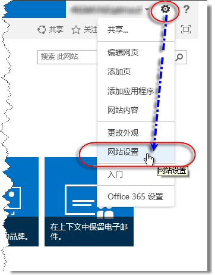
  

  

  
2. 转到"网站设置"。
    
  
3. 在"网站操作"部分，选择"管理网站功能"。
    
  
4. 找到名为"工作流可以使用应用程序权限"的功能（如图所示），然后单击"激活"。
    
    > **警告**
      > 如果没有正确配置 SharePoint 2013 工作流平台和 SharePoint 相关应用程序，则不能激活此功能。 

   **图：网站功能"工作流可以使用应用程序权限"**

  

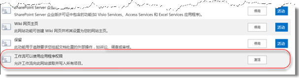
  

  

  

### 向工作流授予完全控制权限

要使工作流正常运行，必须在网站中向其授予完全控制权限。以下过程用于向工作流授予完全控制权限。
  
    
    

> **重要信息**
>  该过程假定满足以下条件：>  该过程必须由拥有"网站所有者"权限的用户完成。>  此工作流必须已发布到 SharePoint Server 2013 网站。
  
    
    


### 向工作流授予完全控制权限


1. 单击"设置"图标，如图所示。
    
   **图：打开"网站设置"页**

  


  

  

  
2. 转到"网站设置"。
    
  
3. 在"用户和权限"部分，选择"网站应用程序权限"。
    
  
4. 复制"应用程序标识符"的"客户端"部分。此部分是最后一个"|"和"@"符号之间的标识符，如图所示。
    
   **图：选择"应用程序标识符"**

  

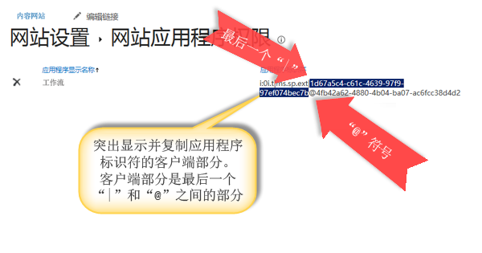
  

  

  
5. 导航到"为应用程序授予权限"页。为此，必须浏览到网站的 appinv.aspx 页。
    
    例如：http://{hostname}/{the Site Collection}/_layouts/15/appinv.aspx。 
    
    有关设置工作流的详细信息，请参阅  [Sympraxis 咨询博客文章：遍历 SharePoint 2013 网站工作流中的内容](http://sympmarc.com/2016/01/14/looping-through-content-in-a-sharepoint-2013-site-workflow-part-1-introduction)
    
    下图演示了一个示例。
    

   **图：appinv.aspx 页和 URL 示例**

  

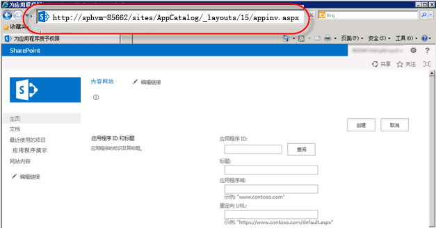
  

  

  
6. 在"应用程序 ID"字段中粘贴客户端 ID，然后单击"查询"，如图所示。
    
  
7. 粘贴以下"权限请求"XML 以授予完全控制权限。
    
  ```
  
<AppPermissionRequests>
    <AppPermissionRequest Scope="http://sharepoint/content/sitecollection/web" Right="FullControl" />
</AppPermissionRequests>

  ```


    > **警告**
      > 上面的"作用域"值中没有占位符。它是一个文本值。请完全按照它在此处显示的形式输入。 

    下图演示了一个完整页面示例。
    

   **图：查找应用程序 ID**

  

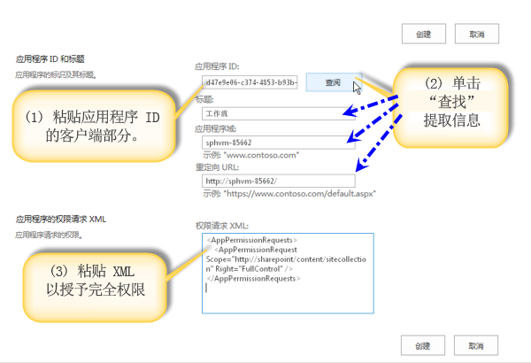
  

  

  
8. 单击"创建"。
    
  
9. 系统随后会询问您是否信任此工作流应用程序，如图所示。单击"信任它"。
    
   **图：信任工作流应用程序**

  

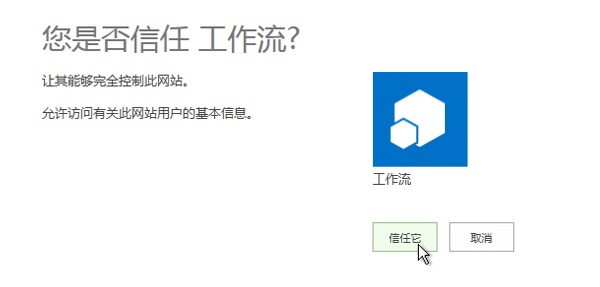
  

  

  

### 在仅限应用程序的步骤中打包操作

最后，需要在仅限应用程序的步骤中打包工作流操作。以下过程用于在仅限应用程序的步骤中打包"发送电子邮件"操作。该示例中的工作流会从自定义列表中发送确认电子邮件。
  
    
    

### 在仅限应用程序的步骤中打包操作


1. 在 SharePoint Designer 2013 中打开应用程序目录网站。
    
  
2. 创建运行工作流使用的新的自定义列表。在该示例中，列表名称为"应用程序演示"。
    
  
3. 在导航窗口中单击"工作流"。
    
  
4. 为"应用程序演示"列表创建新的列表工作流，如图所示。
    
   **图：创建新的列表工作流**

  

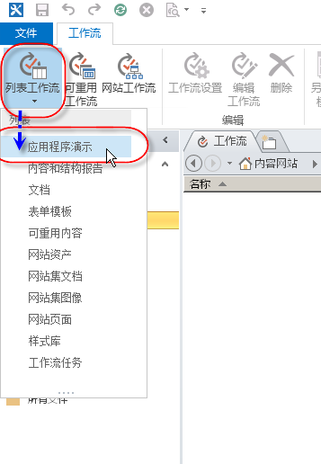
  

  

  
5. 插入"仅限应用程序的步骤"，如图所示。
    
   **图：添加仅限应用程序的步骤**

  

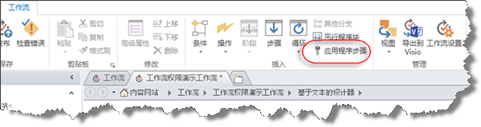
  

  

  
6. 在"仅限应用程序的步骤"中，插入"发送电子邮件"操作。
    
  
7. 单击"通讯簿"按钮。在"收件人"字段中，选择"工作流查找用户"，并单击"添加"，如图所示。
    
   **图：选择"工作流查找用户"**

  

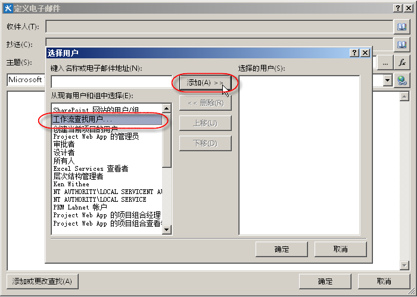
  

  

  
8. 在"创建者"字段中输入查询值，如图所示。
    
   **图："查找人员"对话框**

  

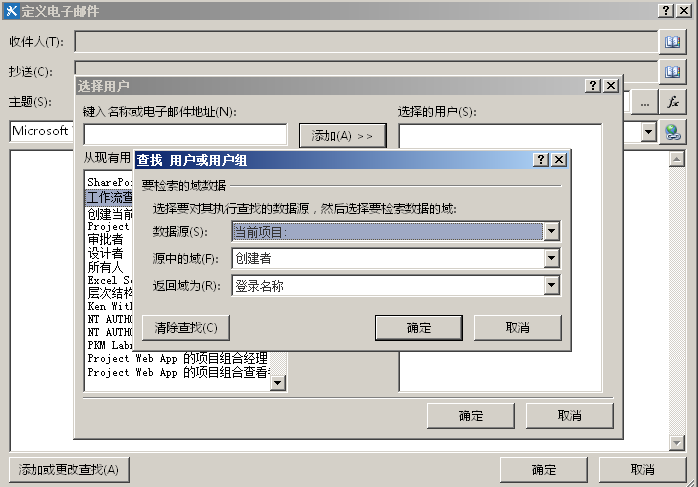
  

  

  
9. 在电子邮件正文中输入来自"应用程序演示"列表的电子邮件。
    
  
10. 单击"确定"以返回工作流。完成的工作流如图所示。
    
   **图：仅限应用程序的步骤中的电子邮件操作**

  

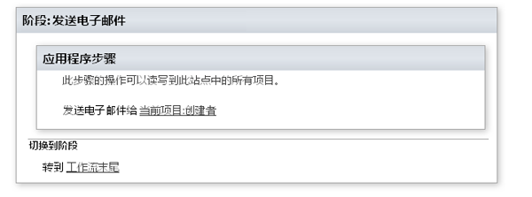
  

  

  
11. 在功能区中单击"工作流设置"图标，如图所示。
    
   **图：功能区中的"工作流设置"图标**

  

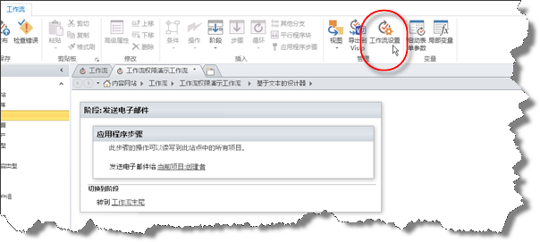
  

  

  
12. 清除"自动将工作流状态更新到当前阶段名"旁的复选框，然后单击"发布"，如图所示。
    
   **图：清除自动更新复选标记，然后发布**

  

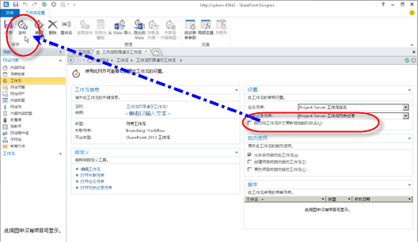
  

  

  

## 了解工作原理
<a name="section2"> </a>

若要了解工作流为什么需要提升的权限，请假定工作流基本上是 SharePoint 相关应用程序，它们需遵循相同的应用程序模型授权规则。工作流的默认配置为：工作流的有效权限是用户权限和应用程序权限的交集，如图所示。
  
    
    

**图：权限图**

  
    
    

  
    
    
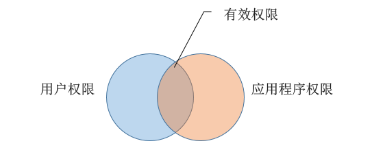
  
    
    
为何需要提升权限才能在应用程序请求列表中创建工作流的原因有两个。这些原因包括：
  
    
    

- 默认情况下，工作流只有写权限。
    
  
- 用户没有任何权限。
    
  
解决此问题的第一步是允许应用程序授权，具体方法是仅使用其身份，忽略用户的身份。为此，请启用"仅限应用程序的步骤"功能。第二步需向工作流授予完全控制权限。
  
    
    
下图阐明了权限变化
  
    
    

**图：权限矩阵**

  
    
    

  
    
    
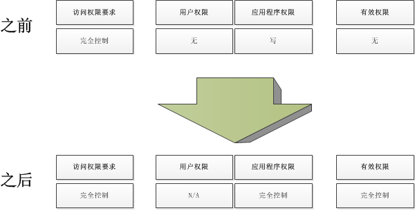
  
    
    

  
    
    

  
    
    

## 其他资源
<a name="section3"> </a>


-  [SharePoint 2013 中的工作流](http://technet.microsoft.com/zh-cn/sharepoint/jj556245.aspx)
    
  
-  [Install and manage apps for SharePoint 2013](http://msdn.microsoft.com/library/733647a3-a5d3-475b-967d-3bb627c2a0c2.aspx)
    
  
-  [What's new in workflow in SharePoint Server 2013](http://msdn.microsoft.com/library/6ab8a28b-fa2f-4530-8b55-a7f663bf15ea.aspx)
    
  
-  [Getting started with SharePoint Server 2013 workflow](http://msdn.microsoft.com/library/cc73be76-a329-449f-90ab-86822b1c2ee8.aspx)
    
  
-  [SharePoint Designer 和 Visio 中的工作流开发](workflow-development-in-sharepoint-designer-and-visio.md)
    
  
-  [工作流操作快速参考（SharePoint 2013 工作流平台）](workflow-actions-quick-reference-sharepoint-2013-workflow-platform.md)
    
  
-  [来自 SharePoint Designer 团队的博客文章：工作流封装和部署方案](http://blogs.msdn.com/b/sharepointdesigner/archive/2012/08/30/packaging-list-site-and-reusable-workflow-and-how-to-deploy-the-package.aspx)
    
  
-  [Sympraxis 咨询博客文章：遍历 SharePoint 2013 网站工作流中的内容](http://sympmarc.com/2016/01/14/looping-through-content-in-a-sharepoint-2013-site-workflow-part-1-introduction)
    
  

