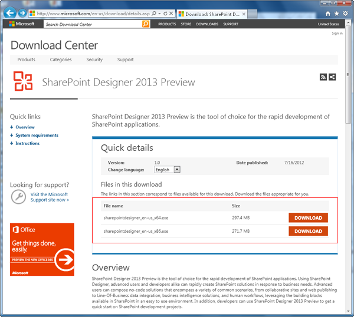
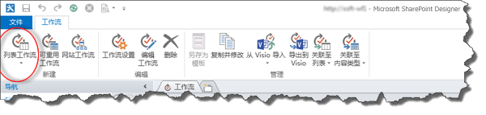
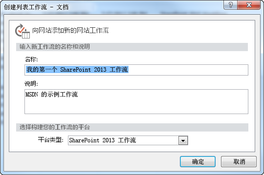
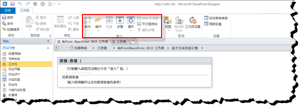

# 使用 SharePoint Designer 2013 和 SharePoint 2013 工作流平台创建工作流
了解如何使用 SharePoint Designer 2013 和 SharePoint 2013 工作流平台安装、打开和创建工作流。 
||
|:-----|
||
   

## 安装 SharePoint Designer 2013

SharePoint Designer 2013 供免费下载。如需下载并安装 SharePoint Designer 2013，请执行下列步骤： 
  
    
    

### 安装 SharePoint Designer 2013

1. 打开您的 Web 浏览器并导航至 Microsoft 下载中心： [http://www.microsoft.com/download](http://www.microsoft.com/download/zh-cn/.aspx)。 
    
  
2. 在搜索栏中输入 SharePoint Designer 2013。
    
  
3. 单击"SharePoint Designer 2013"的链接。 
    
  
4. 阅读概述、系统要求和安装说明。确保您的系统兼容。 
    
  
5. 选择您的平台类型：64 位（"x64"）或 32 位（"x86"），如图所示。 
    
  
6. 请按照说明安装 SharePoint Designer 2013。
    
  

**图：SharePoint Designer 2013 下载页面**

  
    
    

  
    
    

  
    
    

  
    
    

  
    
    

## 打开 SharePoint Designer 2013 并连接到 SharePoint 2013 网站

SharePoint Designer 2013 作为 Office 2013 应用程序进行安装。若要打开 SharePoint Designer 2013 并连接到 SharePoint 2013 网站，请执行以下步骤： 
  
    
    

### 打开 SharePoint Designer 2013 并连接到 SharePoint 2013 网站

1. 通过在"开始"菜单上选择 SharePoint Designer 2013 将其打开。依次单击"开始"图标、"所有程序"、"Microsoft Office 2013"，然后单击"SharePoint Designer 2013"。 
    
  
2. 单击 SharePoint Designer 2013 开始页上的"打开网站"。
    
  
3. 输入要连接的 SharePoint 2013 网站。例如 http://www.contoso.com/sites/a-sharepoint-site。
    
  
4. 请单击"打开"打开网站。
    
  
5. 如果提示，请输入您的凭据。（如果登录的计算机没有集成安全性，则将提示您输入凭据。）确保使用具有访问 SharePoint 2013 网站权限的凭据。
    
  

## 创建基于 SharePoint 2013 工作流平台的列表工作流

SharePoint Designer 2013 可应用于多项重要任务。导航窗格用于在 SharePoint Designer 2013 的不同视点之间进行切换。若要创建基于 SharePoint 2013 工作流平台的新列表工作流，请执行下列步骤：
  
    
    

### 创建基于 SharePoint 2013 工作流平台的工作流

1. 单击"导航"窗格中的"工作流"节点。
    
  
2. 单击功能区的"新建"部分中的"列表工作流"下拉菜单，如图所示。
    
  
3. 选择要与新工作流相关联的列表。
    
  
4. 在"创建列表工作流"对话框中，输入工作流的名称和说明，确保为"SharePoint 2013 工作流"设置了"平台类型"，如图所示。
    
    > **注释**
      > 如果不将 SharePoint 2013 工作流视为可用的平台类型，则不要将 工作流管理器 配置为与 SharePoint Server 2013 场一起使用。 
5. 请单击"确定"，创建工作流。
    
  

**图：用于创建新列表工作流的功能区按钮**

  
    
    

  
    
    

  
    
    

  
    
    

  
    
    

**图：创建列表工作流对话框**

  
    
    

  
    
    

  
    
    

  
    
    

  
    
    
现在已创建了工作流，您可以添加操作、条件、阶段、步骤和循环来构建您的工作流。这些工作流组件可以在 SharePoint Designer 2013 功能区中使用，如图所示。 
  
    
    

**图：SharePoint 2013 工作流平台的工作流项目**

  
    
    

  
    
    

  
    
    

    
> **注释**
> 上述过程用于创建列表工作流。可以将相同的过程经以下修改后用于创建可重复使用的工作流或网站工作流。而不必在创建工作流时通过在功能区中选择"列表工作流"按钮选择"可重用工作流"或"网站工作流"按钮。 
  
    
    

若要了解工作流开发的可用组件的详细信息，请参阅  [工作流操作快速参考（SharePoint 2013 工作流平台）](workflow-actions-quick-reference-sharepoint-2013-workflow-platform.md)。
  
    
    

## 其他资源

-  [What's new in workflow in SharePoint Server 2013](http://msdn.microsoft.com/library/6ab8a28b-fa2f-4530-8b55-a7f663bf15ea.aspx)
    
  
-  [Getting started with SharePoint Server 2013 workflow](http://msdn.microsoft.com/library/cc73be76-a329-449f-90ab-86822b1c2ee8.aspx)
    
  
-  [SharePoint Designer 和 Visio 中的工作流开发](workflow-development-in-sharepoint-designer-and-visio.md)
    
  

  
    
    

