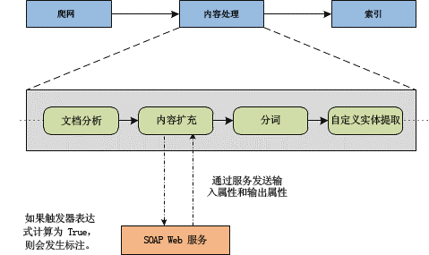

# 使用内容扩充 Web 服务标注进行自定义内容处理
了解 SharePoint 2013 中的内容扩充 Web 服务标注，它使开发人员能够创建外部 Web 服务以在内容处理期间修改已爬网项的托管属性。
SharePoint 2013 中的搜索功能使用户能够通过标注外部内容扩充 Web 服务来在对已爬网项编制索引之前修改其托管属性。在执行数据清除、实体提取、分类和标记等任务时，在内容处理期间修改项的托管属性的功能会很有帮助。
  
    
    


**图 1. 内容处理中的内容扩充**

  
    
    

  
    
    

  
    
    
图 1 显示了在内容处理组件中发生的过程的一部分。内容扩充 Web 服务是一种基于 SOAP 的服务，您可以创建它以接收来自内容处理组件中的 Web 服务客户端的标注。在图 1 中，Web 服务客户端 是指内容处理组件中的内容扩充操作员；Web 服务 是指您实施的 SOAP Web 服务。Web 服务从内容处理组件接收可配置的负载。然后，从 Web 服务生成的响应在添加到搜索索引之前合并到已爬网项中。 Web 服务客户端使用可配置为输入属性或输出属性的托管属性。输入属性是发送给 Web 服务的；输出属性是 Web 服务返回的。某些托管属性是隐藏的或只读的，并且无法发送给 Web 服务或从 Web 服务接收。有关如何验证哪些托管属性是只读的信息，请参阅 [如何为内容扩充 Web 服务列出所有只读的托管属性](#SP15contentprocess_read-only_managed_properties)。
    
> **重要信息**
> 内容扩充标注步骤只能使用单个 Web 服务终结点进行配置。各种容错功能或支持多个实现的传送功能必须由实施 Web 服务的开发人员处理。此外，开发人员可以将各种 Web 服务实现承载在不同终结点上；但在任何给定时间，只有这些终结点之一可用于配置。 
  
    
    


## 内容扩充 Web 服务协定
<a name="SP15webservcallout_enrich"> </a>

Web 服务客户端是具有预定义行为的 SOAP（版本 1.1）RPC 客户端。Web 服务协定具有以下特征：
  
    
    

- 内容处理组件通过 HTTP 将 SOAP RPC 调用发送到可配置的终结点。
    
  
- 负载包含一组属性对象。
    
  
- Web 服务对该组属性对象执行某种自定义逻辑并返回一组经修改的或新的属性对象。
    
  
- Web 服务必须在给定超时内将响应发送给 Web 服务客户端。
    
  
- 不支持将任何特定身份验证或加密机制作为协定的一部分。不过，您可以对传输机制应用自己的安全性。
    
  

## 配置内容扩充 Web 服务客户端
<a name="content_enrichment_configuration"> </a>

若要配置 Web 服务客户端，请使用以下 Windows PowerShell cmdlet：
  
    
    

-  [Get-SPEnterpriseSearchContentEnrichmentConfiguration](http://technet.microsoft.com/zh-cn/library/jj219783%28office.15%29.aspx)
    
  
-  [Set-SPEnterpriseSearchContentEnrichmentConfiguration](http://technet.microsoft.com/zh-cn/library/jj219659%28office.15%29.aspx)
    
  
-  [Remove-SPEnterpriseSearchContentEnrichmentConfiguration](http://technet.microsoft.com/zh-cn/library/jj219742%28office.15%29.aspx)
    
  
-  [New-SPEnterpriseSearchContentEnrichmentConfiguration](http://technet.microsoft.com/zh-cn/library/jj219502%28office.15%29.aspx)
    
  
表 1 列出了可通过前面提到的 Windows PowerShell cmdlet 配置的属性。
  
    
    

**表 1. 可使用 Windows PowerShell cmdlet 为客户端配置的属性**


|**配置属性**|**说明**|**默认值**|
|:-----|:-----|:-----|
|**Endpoint** <br/> |指定外部 Web 服务的 URL。  <br/> |空。  <br/> |
|**InputProperties** <br/> |外部 Web 服务接收的托管属性。  <br/> |空。  <br/> |
|**OutputProperties** <br/> |外部 Web 服务返回的托管属性。  <br/> |空。  <br/> |
|**Timeout** <br/> |Web 服务超时之前的时间量，以毫秒为单位。  <br/> 根据 **FailureMode** ，项处理失败或者向 ULS 日志中写入一条警告消息。 <br/> |5000 毫秒；有效范围 [100, 30000]。  <br/> |
|**SendRawData** <br/> |允许或禁止将原始数据发送给 Web 服务。  <br/> |False。  <br/> |
|**MaxRawDataSize** <br/> |发送给 Web 服务的原始数据的最大大小，以 KB 为单位。如果项的二进制数据超过了此限制，则不会发送该项。这不阻止发送 **InputProperties** 和接收 **OutputProperties** 。 <br/> |5120 KB。  <br/> |
|**FailureMode** <br/> |控制 Web 服务客户端在出错时的行为。当 **FailureMode** 设置为 **ERROR** 时，在内容扩充处理期间出现的任何问题都将为该特定项发送失败的回调。 <br/> 当 **FailureMode** 设置为 **WARNING** 时，将对项编制索引，Web 服务不进行任何修改，并向 ULS 日志中写入一条警告消息。 <br/> |错误。  <br/> |
|**DebugMode** <br/> |设置为 **true** 时允许内容扩充客户端将所有托管属性发送给客户端而不期望返回任何属性的模式。将忽略所有配置的 **Trigger** 属性、 **InputProperties** 属性和 **OutputProperties** 属性。 <br/> |False。  <br/> |
|**Trigger** <br/> |对每个已爬网项执行的 **Boolean** 谓词。如果该谓词的计算结果为 **true** ，则将记录发送给 Web 服务。否则，则将项传递给搜索索引。 <br/> |空。  <br/> |
   

### 如何为内容扩充 Web 服务列出所有只读的托管属性
<a name="SP15contentprocess_read-only_managed_properties"> </a>

某些托管属性是只读的，无法用作 Web 服务的输出。这些属性可通过使用  [Get-SPEnterpriseSearchServiceApplication](http://technet.microsoft.com/zh-cn/library/ff608050%28office.15%29.aspx) 和 [Get-SPEnterpriseSearchMetadataManagedProperty](http://technet.microsoft.com/zh-cn/library/ff607560%28office.15%29.aspx)Windows PowerShell cmdlet 来列出，如下面的示例所示：
  
    
    

```

$ssa = Get-SPEnterpriseSearchServiceApplication
Get-SPEnterpriseSearchMetadataManagedProperty -SearchApplication $ssa  | ?{$_.IsReadOnly -or $_.MappingDisallowed -or $_.DeleteDisallowed}

```


## 关于配置 Web 服务标注的触发条件
<a name="SP15contentprocess_trigger"> </a>

触发条件是用于配置 Web 服务标注的表达式。如果触发条件的计算结果为 **true** ，则 Web 服务客户端将为该记录执行标注。如果触发条件的计算结果为 **false** ，则 Web 服务客户端不执行标注，而是将已爬网项传递给搜索索引。或者，如果没有配置任何触发条件，则将所有项发送给 Web 服务。
  
    
    
触发条件使用表达式语言来引用托管属性的值。您可以使用表达式语言中的运算符和函数来构建简单或复杂的触发条件，以便您可以确定何时执行 Web 服务标注。 
  
    
    
表 2 列出了触发条件的示例。
  
    
    

**表 2. 有关配置内容扩充 Web 服务标注的触发条件示例**


|**表达式**|**说明**|**要求**|
|:-----|:-----|:-----|
|MP1 > 2  <br/> |如果名为 MP1 的托管属性的值大于 2，则返回 **true**。  <br/> |MP1 必须是数值类型。  <br/> |
|IsNull(MP2)  <br/> |如果已爬网项不存在名为 MP2 的托管属性或该属性为空/null，则返回 **true**。  <br/> |MP2 可以是任何类型。  <br/> |
|StartsWith(MP1, "sample") AND MP2 != 18  <br/> |如果托管属性 MP1 中的值以"sample"开头，并且托管属性 MP2 的值不为 18，则返回 **true**。  <br/> |MP1 必须是 **string** 类型，并且 MP2 必须是数值类型。 <br/> |
|IsDay(MP1, 2009, 12, 24)  <br/> |检查托管属性 MP1 是否包含属于 2009 年 12 月 24 日的 **DateTime**。  <br/> |MP1 必须是 **DateTime** 类型。 <br/> |
   
有关可在触发表达式中使用的元素和支持的函数列表，请参阅 [SharePoint 2013 中的触发器表达式语法](trigger-expressions-syntax-in-sharepoint-2013.md)。
  
    
    

## 实施内容扩充外部 Web 服务
<a name="SP15contentprocess_implement"> </a>

对于基本实施，执行以下操作： 
  
    
    

1. 将位于  `C:\\Program Files\\Microsoft Office Servers\\15.0\\Search\\Applications\\External` 中的 **Microsoft.Office.Server.Search.ContentProcessingEnrichment.dll** 作为引用包括在您的项目中。
    
  
2. 将 **IContentProcessingEnrichmentService** 作为 Web 服务来实施。
    
  

## 其他资源
<a name="bk_addresources"> </a>


-  [配置 SharePoint 2013 中的搜索功能](configure-search-in-sharepoint-2013.md)
    
  
-  [使用内容扩充 Web 服务标注进行自定义内容处理](custom-content-processing-with-the-content-enrichment-web-service-callout.md)
    
  

