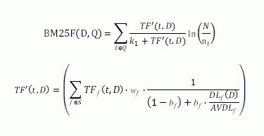
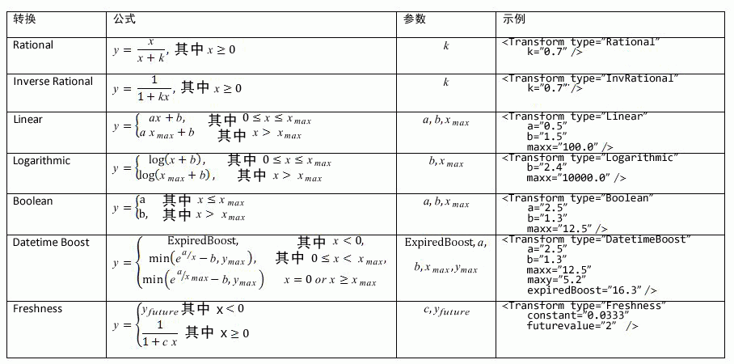
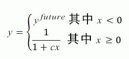
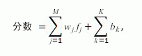
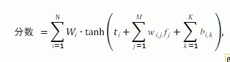
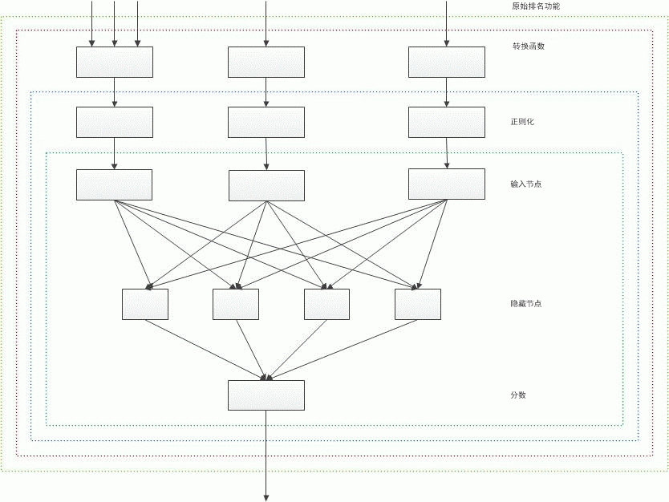

# 在 SharePoint 2013 中自定义排名模型以提高相关性
自定义排名模型以使用 SharePoint Server 2013 中的排名功能来精确计算排名分数（相关性排名），从而提高搜索相关性。
您可以通过四种方法 [在 SharePoint 2013 中对搜索结果进行排序](sorting-search-results-in-sharepoint-2013.md)，其中一种是按照排名分数。当您按排名分数对搜索结果进行排序时，SharePoint Server 2013 会将最相关的结果显示在搜索结果集的顶部。
  
    
    

如果搜索结果排名分数高，则说明它的相关性高。排名分数是由搜索引擎使用排名模型计算出的特定分数值。排名模型是包含一个或多个排名等级的列表，其中包含一系列排名功能。
排名模型定义搜索引擎如何使用各种因素来计算相关性排名，这些因素在排名模型中表现为排名功能。用于计算相关性排名的因素包括但不限于以下几点：
  
    
    


- 包含文档标题和正文等信息的全文检索中查询词的出现。
    
  
- 与文档文件类型或 URL 长度等某特定项关联的元数据。
    
  
- 与指向特定项的 URL 链接关联的定位文本。
    
  
- 有关每个项的用户单击数的信息。
    
  
- 文档正文或标题中查询词的邻近性。
    
  

## 基于一个 SharePoint 排名模型模板开始您的排名模型自定义
<a name="sp15_using_custom_ranking_model"> </a>

为简化您的自定义，首先将 SharePoint Server 2013 中的一个默认排名模型用作模板。然后修改该排名模型，使其与您的数据集相匹配。
  
    
    
SharePoint Server 2013 默认提供 14 个排名模型。请参阅 [什么是排名模型？](http://technet.microsoft.com/library/7c8ddec1-c8ff-4a90-afae-387b27a653f1.aspx#Ranking_Models)（位于 TechNet 上），了解有关这些排名模型及其用途的详细信息。
  
    
    

> **重要信息**
> 如果您安装了 SharePoint Server 2013 在 2013 年 8 月的累积更新，我们建议您使用 **Search Ranking Model with Two Linear Stages**作为您自定义排名模型的基础模型。 **Search Ranking Model with Two Linear Stages**是 **Default Search Model**的副本，其中带有一个线性第二阶段，而非神经网络第二阶段。 
  
    
    

您可以使用下列 Windows PowerShell cmdlet 对排名模型进行自定义：
  
    
    

-  [Get-SPEnterpriseSearchRankingModel](http://technet.microsoft.com/zh-cn/library/ff607990.aspx)
    
  
-  [New-SPEnterpriseSearchRankingModel](http://technet.microsoft.com/zh-cn/library/ff607980.aspx)
    
  
-  [Remove-SPEnterpriseSearchRankingModel](http://technet.microsoft.com/zh-cn/library/ff608045.aspx)
    
  
-  [Set-SPEnterpriseSearchRankingModel](http://technet.microsoft.com/zh-cn/library/ff607940.aspx)
    
  

### 列出所有可用的排名模型


1. 以管理员身份打开 SharePoint Management Shell。
    
  
2. 运行Windows PowerShell cmdlet 的以下序列。
    
  ```
  
$ssa = Get-SPEnterpriseSearchServiceApplication -Identity "Search Service Application"
$owner = Get-SPenterpriseSearchOwner -Level ssa
Get-SPEnterpriseSearchRankingModel -SearchApplication $ssa -Owner $owner
  ```


### 检索要用作模板的默认排名模型


1. 以管理员身份打开 SharePoint Management Shell。
    
  
2. 运行 Windows PowerShell cmdlet 的以下序列； *filename.xml*  是要在其中保存排名模型的文件的名称。
    
  ```
  
$ssa = Get-SPEnterpriseSearchServiceApplication
$owner = Get-SPenterpriseSearchOwner -Level ssa
$defaultRankingModel = Get-SPEnterpriseSearchRankingModel -SearchApplication $ssa -Owner $owner | Where-Object { $_.IsDefault -eq $True }
$defaultRankingModel.RankingModelXML > filename.xml

  ```

如果您安装了 SharePoint Server 2013 在 2013 年 8 月的累积更新，您可以使用下列程序来检索要用作自定义排名模型模板且带有两个线性阶段的搜索排名模型。
  
    
    

### 检索要用作模板且带有两个线性阶段的排名模型


1. 以管理员身份打开 SharePoint Management Shell。
    
  
2. 运行 Windows PowerShell cmdlet 的以下序列； *filename.xml*  是要在其中保存排名模型的文件的名称。
    
  ```
  
$ssa = Get-SPEnterpriseSearchServiceApplication
$owner = Get-SPenterpriseSearchOwner -Level ssa 
$twoLinearStagesRankingModel = Get-SPEnterpriseSearchRankingModel -SearchApplication $ssa -Owner $owner -Identity 5E9EE87D-4A68-420A-9D58-8913BEEAA6F2 
$twoLinearStagesRankingModel.RankingModelXML > filename.xml

  ```


### 部署自定义排名模型


1. 从可用排名模型的列表中，复制要用作模板的排名模型的 GUID。（请参阅 [列出所有可用的排名模型](#sp15_list_available_ranking_models)，获取要使用的 Windows PowerShell cmdlet 序列。
    
  
2. 使用步骤 1 中为  _<GUID>_ 复制的 GUID 运行 Windows PowerShell cmdlet 的以下序列。
    
  ```
  
$ssa = Get-SPEnterpriseSearchServiceApplication
$owner = Get-SPenterpriseSearchOwner -Level ssa
$rm = Get-SPEnterpriseSearchRankingModel -Identity <GUID> -SearchApplication $ssa -Owner $owner
$rm.RankingModelXML > myrm.xml 

  ```

3. 在 XML 编辑器中编辑  `myrm.xml` 文件。必须针对 _RankModel2Stage_ 元素和所有 _RankingModel2NN_ 元素中的 **id** 属性使用新的 GUID 值。若要获取用新 GUID 值，可以使用以下示例 Windows PowerShell 命令： `[guid]::NewGuid()`
    
  
4. 通过运行下列命令，使用  [New-SPEnterpriseSearchRankingModel](http://technet.microsoft.com/zh-cn/library/ff607980.aspx) cmdlet 创建一个新的排名模型。
    
  ```
  
$myRankingModel = Get-Content .\\myrm.xml
$myRankingModel = [String]$myRankingModel
$ssa = Get-SPEnterpriseSearchServiceApplication
$owner = Get-SPenterpriseSearchOwner -Level ssa
$newrm = New-SPEnterpriseSearchRankingModel -SearchApplication $ssa -Owner $owner -RankingModelXML $myRankingModel
  ```


### 排名详细信息


> **重要信息**
> 我们提供排名详细信息和相应的 ExplainRank 页只做便利之用，仅用于帮助您优化和调试自己的自定义排名模型。排名详细信息的内容和相应 ExplainRank 页的内容在未来的软件补丁和更新中不受支持，若有更改，恕不另行通知。 
  
    
    

排名详细信息时一个 XML 文档，它提供有关与给定用户查询匹配的单个项目的排名分数计算的详细信息。排名详细信息存储在一个名为 **rankdetail** 的特殊托管属性中。
  
    
    
排名模型中的各排名功能在说明排名分数计算详细信息的排名详细信息中都有一个单独的 XML 节点。排名详细信息仅针对搜索结果不超过 100 项的查询提供。
  
    
    
从概念上讲，排名详细信息的整体格式如下例所示。
  
    
    


```XML

<rank_log version='15.0.0000.1000' id='[internal guid of ranking model used for calculation]' >
    <query tree='[representation of user query used for ranking]'/>
    <stage type='linear'>
        [Details of rank calculation of the first ranking stage. One XML node for each rank feature.]
        <stage_model>
            [Definition of the first stage of the ranking model]
        </stage_model>
    </stage>
    <stage type='neural_net' >
        [Details of rank calculation of the second ranking stage. One XML node for each rank feature.]
        <stage_model>
            [Definition of the second stage of the ranking model]
        </stage_model>
    </stage>
</rank_log>
```

若要检索排名详细信息，您需要成为搜索服务应用程序 (SSA) 的管理员。
  
    
    

### 检索排名详细信息


1. 以管理员身份打开 SharePoint Management Shell。
    
  
2. 运行 Windows PowerShell cmdlet 的下列序列，并将  _<query_text>_ 和 _<url>_ 替换为实际值。
    
  ```
  
$app = Get-SPEnterpriseSearchServiceApplication
$searchAppProxy =  Get-spenterprisesearchserviceapplicationproxy | Where-Object { ($_.ServiceEndpointUri.PathAndQuery -like $app.Uri.PathAndQuery)}
$request = New-Object Microsoft.Office.Server.Search.Query.KeywordQuery($searchAppProxy)
$request.ResultTypes = [Microsoft.Office.Server.Search.Query.ResultType]::RelevantResults
$request.QueryText = "<query_text> AND path:""<url>"""
$request.SelectProperties.Add("rankdetail")
$searchexecutor = new-Object Microsoft.Office.Server.Search.Query.SearchExecutor 
$resultTables = $searchexecutor.ExecuteQuery($request) 
$resultTables[([Microsoft.Office.Server.Search.Query.ResultType]::RelevantResults)].Table

  ```


### 通过 ExplainRank 页了解排名分数计算

SharePoint Server 2013 提供了位于布局文件夹 ( `<searchCenter>/_layouts/15/`) 中的 **ExplainRank** 页面。此页面包含根据给定搜索查询、文档 ID 和可选排名模型 ID 为每个排名功能计算排名分数的相关详细信息。该信息可从排名详细信息中获取和进行分析。
  
    
    
您可以使用以下 URL 访问 **ExplainRank** 页面：
  
    
    
 `http://<searchCenter>/_layouts/15/ExplainRank.aspx?q={x}&amp;d={y}&amp;rm={z}`
  
    
    
其中：
  
    
    

-  *x*  是搜索查询。
    
  
-  *y*  是文档 ID。
    
  
-  *z*  是可选的排名模型 ID。如果没有提供排名模型 ID，则使用默认的排名模型。
    
  
和排名详细信息相同，若要查看 **ExplainRank** 页面，需要是搜索服务应用程序 (SSA) 的管理员。
  
    
    

## 使用排名功能优化您的排名模型
<a name="sp15_rank_features"> </a>

排名功能类似于为排名模型调整表盘。以下各部分描述了默认 SharePoint Server 2013 排名模型中可用的排名功能以及它们帮助进行相关性排名计算的方式。
  
    
    

### BM25

BM25 排名功能根据全文检索中查询词的出现来对项目进行排名。BM25 的输入可以是全文检索中的任意托管属性。
  
    
    

> **注释**
> 此上下文中使用的 BM25 排名功能为上市版 BM25F。 
  
    
    

BM25 排名功能使用以下公式计算相关性排名分数。
  
    
    

  
    
    

  
    
    
其中：
  
    
    

-  _D_ 是一个文档，表示标题或正文等文本域的列表。
    
  
-  _Q_ 是用户查询，表示查询词 _t_ 的列表。
    
  
-  _S_ 定义有助于相关性排名的域列表；由排名模型定义。
    
  
-  _w_f是一个数值，它定义域  _f_ ∈ _S_ 的相对权重；此值由排名模型定义。
    
  
-  _b_f是一个数字值，它定义每个域  _f_ ∈ _S_ 的文档长度正则化。
    
  
-  _TF_f _(t,D)_ 是查询词 _t_ 在文档 _D_ 的域 _f_ 中出现的次数。
    
  
-  _DL_f _(D)_ 是文档 _D_ 的域 _f_ 中的总字数。
    
  
-  _N_ 是索引中文档的总数。
    
  
-  _n_t是至少有一个属性包含词  _t_ 的文档的数量。
    
  
-  _AVDL_f是所有检索文档中的平均  _DL_f _(D)_。
    
  
-  _k_1是一个标量参数；此值由排名模型定义。
    
  
您必须在"选择高级的可搜索设置"UI 中将用于 BM25 排名功能的托管属性映射到默认全文检索。
  
    
    
在用户查询中，作为以下操作符一部分的查询词将排除在相关性排名计算之外：FQL 中的  `NOT(…)`、KQL 中的  `NOT(…)`和 FQL 中的  `FILTER(…)`。
  
    
    
此外，范围（如  `title:apple AND body:orange`）内的查询词将排除在相关性排名计算之外。
  
    
    
 **BM25 排名功能定义示例**
  
    
    


```XML

<BM25Main name="ContentRank" k1="1">
    <Layer1Weights>
        <Weight>0.26236235707678</Weight>
    </Layer1Weights>
    <Properties>
        <Property name="body" w="0.019391078235467" b="0.44402228898786156" propertyName="body" />
        <Property name="Title" w="0.36096989709360422" b="0.38179554361297785" propertyName="Title" />
        <Property name="Author" w="0.15808522836934547" b="0.13896219383271818" propertyName="Author" />
        <Property name="Filename" w="0.15115036355698144" b="0.96245017871125826" propertyName="Filename" />
        <Property name="QLogClickedText" w="0.3092664171701901" b="0.056446823262849853" propertyName="QLogClickedText" />
        <Property name="AnchorText" w="0.021768362296187508" b="0.74173561196103566" propertyName="AnchorText" />
        <Property name="SocialTag" w="0.10217215754116529" b="0.55968554315932328" propertyName="SocialTag" />
    </Properties>
</BM25Main>
```

 **BM25 排名功能的排名详细信息示例**
  
    
    


```

<bm25 name='ContentRank'>
<schema pid_mapping='[1:content::7:%default] [2:content::1:%default] [3:content::5:%default] [56:content::2:%default] [100:content::3:link] [10:content::6:link] [264:content::14:link] ' pids_not_mapped=''/>
<query_term term='WORDS(content:integration, content:integrations, content:integrations)'>
    <index name='content' N='10035' n='8'
           avdl='1 2.98018 2.00427 1 1 2.39394 1 637.308 1 1 1 1 1 1 1 1 '>
        <group id='%default'
               ext_doc_id='55' int_doc_id='16' precalc='0' tf_prime='0.500486' weight='1'
               tf='0 1 1 0 0 0 0 11 0 0 0 0 0 0 0 0 '
               dl='0 4 9 0 0 2 0 1291 0 0 0 0 0 0 0 0 '/>
        <group id='link'/>
    </index>
    <rank score='2.37967' score_acc='2.37967' term_weight='7.13439'/>
</query_term>

<query_term term='WORDS(content:effort, content:efforts, content:efforts)'>
    <index name='content' N='10035' n='9'
           avdl='1 2.98018 2.00427 1 1 2.39394 1 637.308 1 1 1 1 1 1 1 1 '>
        <group id='%default'/>
        <group id='link'/>
    </index>
    <rank score='0' score_acc='2.37967' term_weight='7.01661'/>
</query_term>

<query_term term='PHRASE(content:fastserver, content:plugin)'>
    <index name='content' N='10035' n='3'
           avdl='1 2.98018 2.00427 1 1 2.39394 1 637.308 1 1 1 1 1 1 1 1 '>
        <group id='%default'
               ext_doc_id='55' int_doc_id='16' precalc='0' tf_prime='0.0399696' weight='1'
               tf='0 0 0 0 0 0 0 3 0 0 0 0 0 0 0 0 '
               dl='0 4 9 0 0 2 0 1291 0 0 0 0 0 0 0 0 '/>
        <group id='link'/>
    </index>
    <rank score='0.311896' score_acc='2.69157' term_weight='8.11522'/>
</query_term>
<final score='2.69157' transformed='2.69157' normalized='2.69157' hidden_nodes_adds='0.706166 '/>
</bm25>

```


#### 权重组

在自定义的排名模型中，您可能会有两个或两个以上映射到搜索架构中同一权重组的托管属性。在此类情况下，这些托管属性的内容将合并在全文检索中，且无法在 BM25 计算中单独排名。这种效果与为每个映射到搜索架构中同一权重组的托管属性组中的  _w_f和  _b_f设置同等值的效果相同。为防止此情况的发生，可以将托管属性映射到搜索架构中可用的 16 个不同权重组之一。
  
    
    
权重组又称上下文。请参阅 [通过使用搜索架构影响搜索结果的排名](http://technet.microsoft.com/library/7c8ddec1-c8ff-4a90-afae-387b27a653f1.aspx#Ranking_Schema)（位于 TechNet 上），了解有关托管属性与其上下文的关系的详细信息。
  
    
    

### 静态

静态排名功能根据存储在搜索索引中的数值托管属性对项目进行排名。在静态排名功能中用于相关性排名计算的数值托管属性的类型必须是  [Integer](https://msdn.microsoft.com/library/System.Integer.aspx) ，并在搜索架构中设置为 [Refinable](https://msdn.microsoft.com/library/Microsoft.Office.Server.Search.Administration.ManagedProperty.Refinable.aspx) 或 [Sortable](https://msdn.microsoft.com/library/Microsoft.Office.Server.Search.Administration.ManagedProperty.Sortable.aspx) 。 您不能将多值托管属性与静态排名功能一起使用。
  
    
    
每个静态排名功能都要通过单个转换进行预处理，然后才能与其他排名功能聚合。表 1 列出了所有支持的转换函数。
  
    
    

**表 1. 静态和邻近排名功能支持的转换函数**

  
    
    

  
    
    

  
    
    
 **静态排名功能定义示例**
  
    
    


```XML

<Static name="clickdistance" default="5" propertyName="clickdistance">
    <Transform type="InvRational" k="0.27618729159042193" />
    <Layer1Weights>
        <Weight>0.616326852981262</Weight>
    </Layer1Weights>
</Static>

```

 **静态排名功能的排名详细信息示例**
  
    
    


```

<static_feature name='clickdistance' property_name='clickdistance'
    used_default='1' raw_value='5' raw_value_transformed='5' 
    transformed='0.420003' normalized='0.420003'
    hidden_nodes_adds='0.258859 '/>

```


### 已存储静态

已存储静态排名功能根据文档类型和语言对文档进行排名。排名模型中已存储静态排名功能的定义取决于该排名功能是线性模型还是神经网络的一部分。以下示例只适用于线性模型。对于神经网络，每个存储桶的  `<Add>` 属性数必须与神经网络中隐藏节点的数目相匹配。
  
    
    
在已存储静态排名功能中用于相关性排名计算的托管属性的类型必须为  [Integer](https://msdn.microsoft.com/library/System.Integer.aspx) ，并在搜索架构中设置为 [Refinable](https://msdn.microsoft.com/library/Microsoft.Office.Server.Search.Administration.ManagedProperty.Refinable.aspx) 或 [Sortable](https://msdn.microsoft.com/library/Microsoft.Office.Server.Search.Administration.ManagedProperty.Sortable.aspx) 。您不能将多值托管属性与已存储静态排名功能一起使用。
  
    
    
 **文件类型的已存储静态排名功能定义示例**
  
    
    
每个文档都有一个关联的文件类型，内容处理组件会检测它并将其作为从零开始的整数值存储在搜索索引中。当您使用已存储静态排名功能根据文件类型对文档进行排名时，每个文档类型都会与一个特定相关性排名分数关联。例如，在以下定义中，存储桶 **2** 对应于一个 .ppt 文档；节点 `<Add>0.680984743282165</Add>` 定义添加到所有 .ppt 文档的相关性排名分数的额外排名点。
  
    
    


```XML

<BucketedStatic name="InternalFileType" default="0" propertyName="InternalFileType">
    <Bucket name="Html" value="0">
        <HiddenNodesAdds>
            <Add>0.464062832328107</Add>
        </HiddenNodesAdds>
    </Bucket>
    <Bucket name="Doc" value="1">
        <HiddenNodesAdds>
            <Add>0.551558196047853</Add>
        </HiddenNodesAdds>
    </Bucket>
    <Bucket name="Ppt" value="2">
        <HiddenNodesAdds>
            <Add>0.680984743282165</Add>
        </HiddenNodesAdds>
    </Bucket>
    <Bucket name="Xls" value="3">
        <HiddenNodesAdds>
            <Add>-0.143152682829863</Add>
        </HiddenNodesAdds>
    </Bucket>
    <Bucket name="Xml" value="4">
        <HiddenNodesAdds>
            <Add>-1.29219869408375</Add>
        </HiddenNodesAdds>
    </Bucket>
    <Bucket name="Txt" value="5">
        <HiddenNodesAdds>
            <Add>-0.456669562992298</Add>
        </HiddenNodesAdds>
    </Bucket>
    <Bucket name="ListItems" value="6">
        <HiddenNodesAdds>
            <Add>0.170944938307345</Add>
        </HiddenNodesAdds>
    </Bucket>
    <Bucket name="Message" value="7">
        <HiddenNodesAdds>
            <Add>-0.0666769377412764</Add>
        </HiddenNodesAdds>
    </Bucket>
    <Bucket name="Image" value="8">
        <HiddenNodesAdds>
            <Add>0.106988843357609</Add>
        </HiddenNodesAdds>
    </Bucket>
</BucketedStatic>
```

 **文档语言的已存储静态排名功能定义示例**
  
    
    
内容处理组件会为每个文档自动检测语言，然后再将其添加到搜索索引中。当您使用已存储静态排名功能根据文档语言对其进行排名时，您可以根据自动检测出的文档语言是否与查询语言匹配来定义如何计算排名分数。
  
    
    
在查询时，有关用户语言的信息将作为查询属性写入搜索引擎中。
  
    
    

### 邻近度

邻近度排名功能根据全文检索内查询词之间的距离对项目进行排名。如果两个查询词出现在全文检索的同一托管属性中，则排名分数将提高。在磁盘活动和 CPU 消耗方面，邻近度计算成本很高；因此，邻近度提升仅在默认 SharePoint Server 2013 排名模型的第二阶段（如适用）使用。
  
    
    
您可以使用几个不同的选项来评估邻近度排名功能，这些选项由表 2 所示的属性控制。
  
    
    

**表 2. 控制邻近度排名功能评估的属性**


|**属性**|**说明**|
|:-----|:-----|
| `isExact=0` <br/> |在这种模式下，邻近度算法尝试在文档中找到查询词子集的最小跨度（距离）。  <br/> 邻近度算法将以包含查询词的片段在用户查询中出现的顺序考虑片段。如果对于所有查询词，不存在片段，那么邻近度算法会考虑除掉一个查询词以外的所有查询词的片段。每次查询词数量减少，这一过程便会重复一次，直到片段的长度超过  `maxMinSpan`。  <br/>  `maxMinSpan` 是邻近度排名功能中的一个属性，用于指定定义片段最大长度的阈值。 <br/> 一个理想的片段应包含所有查询词但小于  `maxMinSpan`。  <br/> |
| `isExact=1` <br/> |在这种模式下，邻近度算法尝试找到包含所有查询词（或查询短语）的文档的连续代码段。  <br/> |
| `isDiscounted` <br/> |这一属性适用于  `isExact=1` 和 `isExact=0`。启用  `isDiscounted` 时，邻近度值将乘以以下分：（最佳片段出现的次数或者精确命中数）除以（此上下文下最罕见查询词出现的次数）。 <br/> |
| `proximity="complete"` <br/> |在这种模式下，邻近度排名功能仅当整个用户查询文本在特定托管属性中出现时才提高文档排名。  <br/> |
| `proximity="perfect"` <br/> |这种模式类似于  `complete` 模式，但它适用于简短域，例如 **title**。邻近度排名功能仅当整个用户查询文本与特定托管属性中的精确 **title** 匹配时才会提高文档排名。如果 **title** 包含用户查询之外的其他词，邻近度算法不会考虑这一项。 <br/> |
| `default` <br/> |这一属性只适用于单个词的查询。对于包含这一查询词的项， `default` 值将被邻近度排名功能用作排名分数输出。 <br/>  `perfect` 邻近度是这一规则的例外。对于 `perfect` 邻近度，不会使用默认值。相反，它将以与其他查询相同的方式处理单个词查询。 <br/> |
   
 **临近度排名功能定义示例**
  
    
    
以下示例摘自默认 SharePoint Server 2013 排名模型。在这个模型中，邻近度功能只是第二阶段计算的一部分，其中涉及神经网络。因此，这一示例包含多个权重元素  `<LayerWeights>`，对应于神经网络隐藏层中神经元的数量。
  
    
    


```XML

<MinSpan name="Title_MinSpanExactDiscounted" default="0.43654446989518952" maxMinSpan="1" isExact="1" isDiscounted="1" propertyName="Title">
    <Normalize SDev="0.20833333333333334" Mean="0.375" />
    <Transform type="Linear" a="1" b="0" maxx="10000" />
    <Layer1Weights>
        <Weight>0.0399835450090479</Weight>
        <Weight>-0.00693681478614802</Weight>
        <Weight>0.0286196612755843</Weight>
        <Weight>0.11775902923563</Weight>
        <Weight>0.0885860088190342</Weight>
        <Weight>0.102859503886488</Weight>
    </Layer1Weights>
</MinSpan>

```

您必须将邻近度排名功能中使用的托管属性映射至搜索架构中的默认全文检索。
  
    
    
 **邻近度排名功能的排名详细信息示例**
  
    
    


```XML

<proximity_feature name='Title_MinSpanExactDiscounted' pid='2'
                   proximity_type='exact_discounted' 
                   used_default='0' raw_value='0' transformed='0'
                   normalized='-1.8' 
                   hidden_nodes_adds='-0.0719704 0.0124863 -0.0515154 -0.211966 -0.159455 -0.185147 ' />

```


### 动态

动态排名功能根据查询属性是否与给定托管属性匹配来对项目进行排名。如果存在匹配，则这一项的排名分数将乘以一个特定值，用于区分这一特定项。权重属性用于控制功能对整体排名分数的影响。
  
    
    

> **注释**
> 动态排名功能不可自定义，仅供内部使用。但如果您安装了 SharePoint Server 2013 在 2013 年 8 月的累积更新，AnchortextComplete 排名功能为可自定义的动态排名功能，是默认排名模型的一部分。 
  
    
    

 **动态排名功能定义示例**
  
    
    


```XML

<Dynamic name="AnchortextComplete" pid="501" default="0" property="AnchortextCompleteQueryProperty">
    <Transform type="Rational" k="0.91495552365614574" />
        <Layer1Weights>
            <Weight>0.715419978898093</Weight>
        </Layer1Weights>
</Dynamic>
```


### 新鲜度

默认 SharePoint 2013 排名模型无法根据搜索结果的新鲜度提高其排名。您可以通过添加一个新的静态排名功能来实现这一点，这一功能会使用新鲜度转换函数将来自 **LastModifiedTime** 托管属性的信息与 **DateTimeUtcNow** 查询属性相结合。对于这一新鲜度排名功能，新鲜度转换函数是您能使用的唯一一个转换，因为它会将项目的年龄从内部表示转换为天数。
  
    
    
新鲜度转换基于下列公式：
  
    
    

  
    
    

  
    
    
其中：
  
    
    

-  _c_ 和 _y_future在排名模型中定义。
    
  
-  _x_ 是项的年龄，以天为单位。
    
  
- 此  _y_future的值为 **LastModifiedTime** 早于当前日期和时间的项定义新鲜度提升。
    
  
 **新鲜度排名功能定义示例**
  
    
    


```XML

<Static name='freshboost' propertyName='LastModifiedTime' default='-1' convertPropertyToDatetime='1' rawValueTransform='compare' property='DateTimeUtcNow'>
    <Transform type="Freshness" constant="0.0333" futureValue="2" />
    <Layer1Weights>
        <Weight>1.0</Weight>
    </Layer1Weights>
</Static>
```

 **使用旧文档（年龄约为 580 天）的新鲜度排名功能的排名详细信息示例**
  
    
    


```XML

<static_feature name='freshboost' property_name='LastModifiedTime' raw_value_transform='compare' used_default='0' property_value_found='1' property_value='9807115930137649186' raw_value='9.80661e+018' raw_value_transformed='-5.03135e+014' transformed='0.0490396' normalized='0.0490396' hidden_nodes_adds='0.0490396 '/>

```

 **使用新文档（年龄小于 1 天）的新鲜度排名功能的排名详细信息示例**
  
    
    


```XML

<static_feature name='freshboost' property_name='LastModifiedTime' raw_value_transform='compare' used_default='0' property_value_found='1' property_value='9807115934928966979' raw_value='9.80712e+018' raw_value_transformed='-2.55529e+011' transformed='0.990248' normalized='0.990248'hidden_nodes_adds='0.990248 '/>

```


## 排名功能的聚合
<a name="sp15_aggregation_of_rank_features"> </a>

一个排名模型包含各种排名功能，这些功能共同用于计算排名分数。
  
    
    

### 两阶段排名模型

一个排名模型可以包含两个排名阶段。在第一阶段，排名模型采用代价相对低廉的排名功能获得对结果的总排名。在第二阶段，排名模型对具有最高排名分数的项应用另一个代价更高的排名功能。
  
    
    
SharePoint Server 2013 默认排名模型是两阶段排名模型的一个示例。在这个模型中，第二阶段处理具有最高排名分数的前 1000 个项目（结果来自第一阶段）。
  
    
    
第一阶段的排名过程完成后，搜索引擎会重新对所有项目进行排序，包括被第二阶段排除在外的项目。这通常会造成第二阶段项目的排名分数低于第一阶段的项目分数。
  
    
    
但是，为了确保搜索引擎对这些项进行精确排序，来自第二阶段的项目必须具有比第一阶段项目更高的排名分数。为了解决这一难题，第二阶段的排名分数都将提高。搜索引擎会根据排名功能的组合自动进行此计算。
  
    
    

> **注释**
> 如果您安装了 SharePoint Server 2013 在 2013 年 8 月的累积更新，则默认排名模型将使用线性第一阶段和神经网络第二阶段。 **The Search Ranking Model with Two Linear Stages**是带有两个线性阶段的 **Default Search Model**的副本。我们建议您使用这个模型作为您自定义排名模型的基础模型，因为调整线性模型比调整包含神经网络的模型更为简单。 
  
    
    


#### 线性模型

线性模型定义来自排名功能的排名分数的线性组合。
  
    
    
由线性模型提供的排名分数使用下列公式进行计算：
  
    
    

  
    
    

  
    
    

  
    
    

  
    
    
其中：
  
    
    

-  _score_ 是线性模型生成的输出排名分数。
    
  
-  _M_ 是排除已存储静态排名功能的排名功能的数量。
    
  
-  _K_ 是已存储静态排名功能的数量。
    
  
-  _f_j 是转换后 _j_th 功能的值。
    
  
-  _w_j 是向线性组合分配的 _j_th 功能的贡献权重。
    
  

#### 神经网络

神经网络定义来自排名功能的排名分数的非线性组合。目前，SharePoint Server 2013 支持的神经网络限制为一个最多带八个神经元的隐藏层。
  
    
    
神经网络生成的排名分数使用以下公式计算得出：
  
    
    

  
    
    

  
    
    

  
    
    

  
    
    
其中：
  
    
    

-  _score_ 是神经网络生成的输出排名分数。
    
  
-  _N_ 是神经网络隐藏层中神经元的数目。
    
  
-  _M_ 是排除已存储静态排名功能的排名功能的数量。
    
  
-  _K_ 是已存储静态排名功能的数量。
    
  
-  _W_i 是 _i_th 隐藏神经元的贡献权重。
    
  
-  _t_i 是 _i_th 隐藏神经元的阈值。
    
  
-  _W_i,j 是向 _i_th 隐藏神经元分配的 _j_th 功能的贡献权重。
    
  
-  _b_i,k 是从 _k_th 已存储静态功能到 _i_th 隐藏神经元的添加项。
    
  
下图中展示了带有一个双层神经网络的排名分数计算的整体架构。此图未考虑通过直接向隐藏节点添加自定义值来作用于神经网络的已存储静态排名功能，它没有进行任何转换或自定义。
  
    
    

**图 1. 带有一个双层神经网络的排名分数计算的整体架构**

  
    
    

  
    
    

  
    
    

  
    
    

  
    
    

## BM25 和静态排名功能中的预计算
<a name="sp15_precalculation_BM25_static_rank_features"> </a>

在排名模型中，BM25 和静态排名功能可从预计算中受益，从而改善项目中频繁出现的查询词的延迟。此查询延迟改善通过额外的索引代价来实现，包括搜索索引使用的磁盘空间以及 CPU 使用率。
  
    
    
您只应在排名模型的第一阶段使用预计算，如果启用预计算，第一阶段的排名详细信息会不完整。
  
    
    
若要启用预计算，请在排名阶段定义中将  `precalcEnabled` 属性设置为 **1**。您只可以在排名模型中使用一次预计算。
  
    
    

## 查询属性
<a name="sp15_query_properties_ranking"> </a>

查询属性是一种排名机制，用于填充对排名分数计算有用的其他信息。例如，在运行查询时，查询属性可以是时间和日期，这些可以为新鲜度排名功能所用。表 3 列出了排名可用的查询属性。查询属性无法配置。
  
    
    

**表 3. 排名的查询属性**


|**查询属性**|**说明**|
|:-----|:-----|
|AnchortextCompleteQueryProperty  <br/> |提高完整定位文本的排名。  <br/> |
|DateTimeUtcNow  <br/> |当前日期和时间。这一属性可用于新鲜度排名功能。  <br/> |
|DetectedLanguageRanking  <br/> |查询语言的 ID。这一查询属性用于 **DetectedLanguageRanking** 排名功能。 <br/> |
|PersonalizationData  <br/> |排名个性化数据。  <br/> |
|RecommendedforQueryProperty  <br/> |排名推荐。  <br/> |
   

## 示例 1：带有一个线性阶段且包含单个静态排名功能的基本排名模型
<a name="sp15_example_1_ranking"> </a>

这个排名模型假设客户已创建了一个名为 **CustomRating** 的托管属性。该静态排名功能要求 **CustomRating** 为 [Integer](https://msdn.microsoft.com/library/System.Integer.aspx) 数据类型，并在搜索架构中配置为 [Sortable](https://msdn.microsoft.com/library/Microsoft.Office.Server.Search.Administration.ManagedProperty.Sortable.aspx) 或 [Refinable](https://msdn.microsoft.com/library/Microsoft.Office.Server.Search.Administration.ManagedProperty.Refinable.aspx) 。 对于结果集中的每个文档，此排名模型生成的排名分数都等于该文档 **CustomRating** 的值。此模型的影响类似于使用 **CustomRating** 托管属性以递减方式对所有搜索结果进行排序。
  
    
    

```XML

<?xml version="1.0"?>
<RankingModel2Stage name="RankModel1"
    description="Rank model -- example 1"
    id="D3FAF680-D213-4916-A95A-0409031643F8"
    xmlns="urn:Microsoft.Search.Ranking.Model.2NN">
    <RankingModel2NN id="619F2ECD-24F7-41CD-824C-234FC2EFDDCA" precalcEnabled="0" >
        <HiddenNodes count="1">
            <Thresholds>
                <Threshold>0</Threshold>
            </Thresholds>
            <Layer2Weights>
                <Weight>1</Weight>
            </Layer2Weights>
        </HiddenNodes>
        <RankingFeatures>
            <Static name="CustomRating" propertyName="CustomRating" default="0.0">
                <Transform type="Linear" a="1" b="0" maxx="1000"/>
                    <Layer1Weights>
                        <Weight>1.0</Weight>
                    </Layer1Weights>
            </Static>
        </RankingFeatures>
    </RankingModel2NN>
</RankingModel2Stage>
```


## 示例 2：带有一个线性阶段和四个排名功能的复杂排名模型
<a name="sp15_example_2_ranking"> </a>

这个带有一个线性阶段的排名模型包含以下四个排名功能：
  
    
    

-  `BM25` 这个排名功能基于托管属性 **Title** 和 **body**；已设置 **title** 的 `w` 属性，这样，查询词在 **Title** 中的命中将比在 **body** 中的命中重要两倍 (2X)。
    
  
-  `UrlDepth` 这一排名功能基于 **UrlDepth** 托管属性，在 SharePoint 安装中默认提供。 **UrlDepth** 包含文档 URL 中反斜杠 (\\) 的数量。逆有理 ( `InvRational`) 转换可确保具有较短 URL 的文档获得更高排名分数。
    
  
-  `TitleProximity` 如果查询词在文档的 **title** 中出现的位置彼此靠近，则这一排名功能将提高文档的排名。
    
  
-  `InternalFileType` 这一排名功能会提高类型为 HTML、DOC、XLS 或 PPT 的文档的排名。排名模型定义中提供的存储桶名称仅供可读性之用。
    
    > **注释**
      > 默认提供的  `InternalFileType` 托管属性使用值 0 ( `0`) 来对 HTML 文档进行编码，值  `1` 用于 DOC，值 `2` 用于 XLS 等。请参阅默认 SharePoint 排名模型的定义，了解用于 **FileType** 托管属性的所有文件类型列表。

```XML

<?xml version="1.0"?>
<RankingModel2Stage name=" RankModel2"
                    description="Rank model -- example 2"
                    id="DE48A3A1-67CE-44A2-9712-E8A5128787CF"
                    xmlns="urn:Microsoft.Search.Ranking.Model.2NN">
    <RankingModel2NN id="A0A030D1-805D-437E-A001-CC151ED7473A" precalcEnabled="0">
        <HiddenNodes count="1">
            <Thresholds>
                <Threshold>0</Threshold>
            </Thresholds>
            <Layer2Weights>
                <Weight>1</Weight>
            </Layer2Weights>
        </HiddenNodes>
        <RankingFeatures>
            <BM25Main name="BM25" k1="1">
                <Layer1Weights>
                    <Weight>1</Weight>
                </Layer1Weights>
                <Properties>
                    <Property name="Title" propertyName="Title" w="2" b="0.5" />
                    <Property name="body" propertyName="body" w="1" b="0.5" />
                </Properties>
            </BM25Main>
            <Static name="UrlDepth" propertyName="UrlDepth" default="1">
                <Transform type="InvRational" k="1.5"/>
                <Layer1Weights>
                    <Weight>0.5</Weight>
                </Layer1Weights>
            </Static>
            <MinSpan name="TitleProximity" propertyName="Title" default="0" maxMinSpan="1" isExact="0" isDiscounted="0">
                <Normalize SDev="1" Mean="0"/>
                <Transform type="Linear" a="1" b="-0.5" maxx="2"/>
                <Layer1Weights>
                    <Weight>1.2</Weight>
                </Layer1Weights>
            </MinSpan>
            <BucketedStatic name="InternalFileType" propertyName="InternalFileType" default="0">
                <Bucket name="http" value="0">
                    <HiddenNodesAdds>
                        <Add>1.5</Add>
                    </HiddenNodesAdds>
                </Bucket>
                <Bucket name="doc" value="1">
                    <HiddenNodesAdds>
                        <Add>2.5</Add>
                    </HiddenNodesAdds>
                </Bucket>
                <Bucket name="ppt" value="2">
                    <HiddenNodesAdds>
                        <Add>0.5</Add>
                    </HiddenNodesAdds>
                </Bucket>
                <Bucket name="xls" value="3">
                    <HiddenNodesAdds>
                        <Add>-3.5</Add>
                    </HiddenNodesAdds>
                </Bucket>
            </BucketedStatic>
        </RankingFeatures>
    </RankingModel2NN>
</RankingModel2Stage>

```


## 其他资源
<a name="bk_addresources"> </a>


-  [SharePoint 2013 中的搜索](search-in-sharepoint-2013.md)
    
  
-  [关键字查询语言 (KQL) 语法参考](keyword-query-language-kql-syntax-reference.md)
    
  
-  [FAST 查询语言 (FQL) 语法参考](fast-query-language-fql-syntax-reference.md)
    
  
-  [SharePoint Server 2013 中的搜索结果排名概述](http://technet.microsoft.com/library/7c8ddec1-c8ff-4a90-afae-387b27a653f1.aspx)
    
  
-  [使用排名模型调整应用程序创建自定义排名模型](http://office.microsoft.com/zh-cn/office365-sharepoint-online-enterprise-help/create-a-custom-ranking-model-by-using-the-ranking-model-tuning-app-HA104104860.aspx?CTT=1)
    
  

  
    
    

