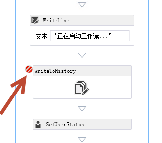
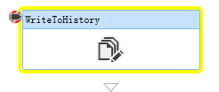
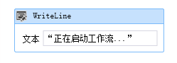
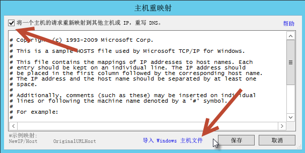
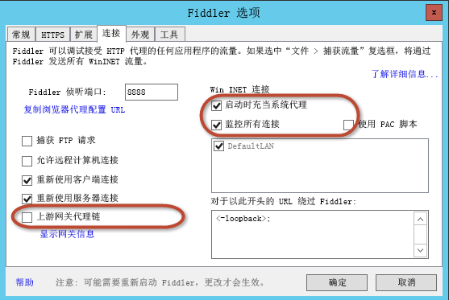
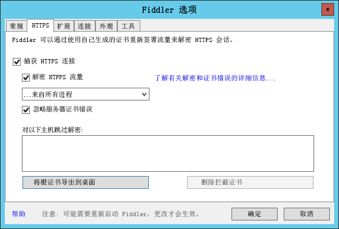
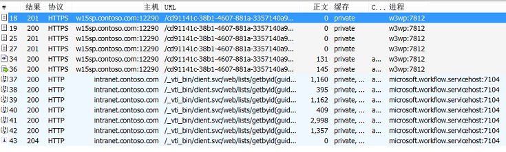
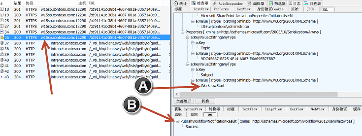
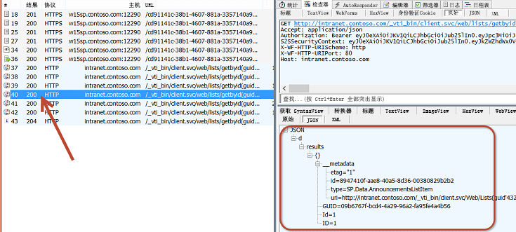
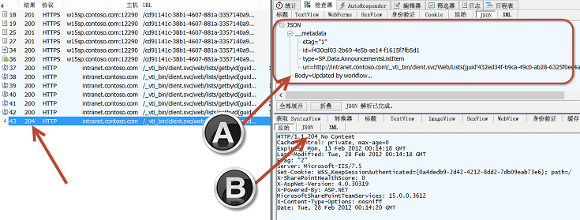

# 调试 SharePoint Server 2013 工作流
演示 SharePoint Server 2013 现在如何依赖于 工作流管理器 1.0 进行一切工作流处理和管理，并演示调试选项。
 **提供者：** [Andrew Connell](http://social.msdn.microsoft.com/profile/andrew%20connell%20%5bmvp%5d/)， [www.AndrewConnell.com](http://www.andrewconnell.com)
  
    
    


## 

Microsoft 对 SharePoint Server 2013 中的工作流采用了与之前 SharePoint 版本中不同的方法。工作流团队与 Azure 团队合作创建了新产品 工作流管理器。工作流管理器 以可用且可扩展的方式托管最新版本 Windows Workflow Foundation 运行时和所有必要服务的作用。该产品利用 Microsoft Azure 服务总线以实现性能和可扩展性，部署后（无论是本地部署还是在云中部署），运行情况完全相同，与 Office 365 类似。然后，连接 SharePoint 2013 并将其配置为不干预所有工作流执行和与 工作流管理器 服务器场相关的任务。
  
    
    
体系结构中的这项更改要求对客户用于创建自定义工作流的两个主要工作流创作工具（SharePoint Designer 2013 和 Visual Studio 2008）进行一些更改。但是，开发人员在 SharePoint 2007 和 SharePoint 2010 中利用的调试技术仍然适用。新体系结构为使用 SharePoint Designer 2013 或 Visual Studio 2008 创建的工作流提供了新选项，即可以在此类工作流中使用 Fiddler 监控 SharePoint Server 2013 和 工作流管理器 之间的流量。
  
    
    

## SharePoint 2013 工作流调试概述

调试为 SharePoint Server 2013 创建的自定义工作流与之前的版本类似，包括 SharePoint 2010 和 SharePoint 2007。某些调试选项是否可用取决于用于创建工作流的工具（SharePoint Designer 2013 或 Visual Studio 2008），以及 SharePoint 部署类型，如本地部署或 Office 365（托管）。
  
    
    
工作流作者可以利用 4 种工作流调试技术：
  
    
    

- 记录到工作流历史记录列表
    
  
- 设置断点
    
  
- 向控制台发送调试消息
    
  
- 通过 Fiddler 监控 SharePoint 和 工作流管理器 之间的流量
    
  
每个选项都有优点和缺点。了解使用两种工作流创作工具（SharePoint Designer 2013 或 Visual Studio 2008），以及工作流部署类型（本地部署或 Office 365）的情况下可用的选项会有所帮助。下表包含创作工具、部署目标和每种方案中可用选项的矩阵。
  
    
    


||**SharePoint 2013 本地**|**Office 365 SharePoint Online**|
|:-----|:-----|:-----|
|SharePoint Designer 2013, SharePoint Online  <br/> | 记录到历史记录列表 <br/>  Fiddler <br/> | 记录到历史记录列表 <br/> |
|Visual Studio 2008  <br/> | 记录到历史记录列表 <br/>  断点 <br/>  控制台调试消息 <br/>  Fiddler <br/> | 记录到历史记录列表 <br/>  断点 <br/> |
   

## 使用工作流历史记录列表调试

在每种 SharePoint 2013 部署类型中都可用的唯一调试选项是将记录消息写入工作流历史记录列表。通过使用此方法，你可以使用 SharePoint Designer 2013 中的"记录到历史记录列表"操作或 Visual Studio 2008 中的 **WriteToHistory** 活动，将字符串消息作为新项目写入列表，该列表在工作流关联中指定，是所有历史记录记录消息的容器。这些消息可以是简单的字符串，也可以通过连接工作流中变量内容构建。
  
    
    
使用历史记录列表作为调试工具不是理想做法，因为用户可以看到消息。因此，当调试会话完成且将工作流用于生产中后，工作流开发人员会希望删除这些消息，从而在调试和部署之间创建其他步骤。尽管如此，这是在所有方案中都可用的唯一选项，无论使用哪种工具创建工作流或使用哪种 SharePoint 2013 部署类型。
  
    
    

## 使用 Visual Studio 2012 断点调试

另一个调试选项是利用断点。断点仅适用于使用 Visual Studio 2008 创建的工作流，因为 SharePoint Designer 2013 无法设置断点或将调试程序附加到运行的过程。这些断点在 SharePoint 2013 本地部署和托管部署（如 Office 365）中都可用。在此方案中，你将在工作流的活动中设置断点，然后以调试模式启动工作流。
  
    
    

**图 1. 启动工作流**

  
    
    

  
    
    

  
    
    
Visual Studio 会将工作流部署到目标 SharePoint 环境中并附加一个调试程序。当工作流过程达到设置断点的活动时，Visual Studio 重新获得焦点，让你检查工作流变量的值并单步调试 Visual Studio 2008 中的每个活动，如下图所示。
  
    
    

**图 2. 工作流断点**

  
    
    

  
    
    

  
    
    

  
    
    

  
    
    

## 使用调试消息和测试服务主机调试工作流

将 工作流管理器 引入 SharePoint 2013 工作流层提供了两个新调试机会，可在使用 Visual Studio 2008 创建自定义工作流和在本地部署中进行测试时使用。Visual Studio 2008 包含 **WriteLine** 活动，该活动接受使用基于单一字符串的消息作为输入。
  
    
    

**图 3. WriteLine 活动**

  
    
    

  
    
    

  
    
    
此活动会写入与标准 .NET Windows 控制台应用程序中 **System.Diagnostics.Debug.WriteLine()** 方法类似的消息。工作流管理器 1.0 开发工具包含名为"测试服务主机"的控制台实用程序，当启动新调试会话和通过本地 SharePoint 2013 部署测试时，Visual Studio 2008 会打开此程序。此控制台实用程序（ **C:\\Program Files (x86)\\Workflow Manager Tools\\1.0** 中找到的 **Microsoft.Workflow.TestServiceHost.exe**）附加到注册的 工作流管理器 实例，并监听使用 **WriteLine** 活动写入的消息，如下图所示。
  
    
    

**图 4. WriteLine 活动的消息**

  
    
    

  
    
    

  
    
    
这些消息与控制台应用程序中的代码注释或调试消息类似。与写入工作流历史记录列表不同，你无需在将工作流部署到生产中之前删除这些消息。除非"测试服务主机"实用程序连接到 工作流管理器，否则消息是无害的。
  
    
    
此调试选项不适用于使用 SharePoint Designer 2013 创建的工作流，因为没有任何操作映射到 **WriteLine** 活动。不幸的是，此调试选项仅适用于 SharePoint 2013 本地部署安装，因为测试服务主机实用程序使用的端口通常无法在内部部署网络以外公开访问。对于 Office 365 也是如此。SharePoint 用于连接到 工作流管理器 的端口与测试服务主机使用的端口相同，并且这些端口仅可以在受信任网络中访问。然而，这并不意味着你需要更改其工作流，以在部署到 Office 365 之前删除任何 **WriteLine** 活动。这些活动可以保留在工作流中，因为除非"测试服务主机"连接到 工作流管理器，否则这些活动不会显示。
  
    
    

## 使用 Fiddler 监控 HTTP 流量以进行调控

SharePoint Server 2013 工作流的最后一个调试选项对工作流开发人员而言是一个新增功能，因为当前平台中处理工作流的方式发生了变化。回顾 SharePoint Server 2013 中的处理方式，所有工作流处理转给外部产品 工作流管理器 1.0。当工作流需要与 SharePoint 通信时（如更新工作流的当前状态、收集 SharePoint 网站中项目或用户的数据，或者处理任务时），工作流管理器的活动会利用 SharePoint 2013 REST API 执行这些操作。SharePoint 使用客户端库与 工作流管理器 进行通信，该客户端库充当 工作流管理器 公开的 REST 服务的代理。SharePoint 2013 和 工作流管理器 都使用标准 HTTP 和 HTTPS 协议进行彼此通信。
  
    
    
此体系结构为工作流作者生成了一个新调试选项。通过使用 HTTP 调试代理工具 Fiddler，你可以监控两种产品之间的每个请求和相应响应。此外，自定义工作流使用 Visual Studio 2008 中的 **HttpSend** 活动或 SharePoint Designer 2013 中的相应 **Call HTTP Web Service** 操作调用的任何自定义服务也可以通过 Fiddler 监控和检查。无论使用哪种工具创建自定义工作流（SharePoint Designer 2013 或 Visual Studio 2008），此调试模型都可用。
  
    
    
此选项不可用的唯一情况是，使用 SharePoint 2013 的 Office 365 部署测试工作流。由于 SharePoint Server 2013 和 工作流管理器 之间的所有流量都出现在服务器端，因此无法连接到 Office 365 中的某个服务器并从控制台启动 Fiddler。
  
    
    
此新选项可将工作流引擎透明化并让你深入了解引擎，这在 SharePoint Server 2013 之前的 SharePoint 版本中开发工作流时无法实现。
  
    
    
例如，你可以在 Web 服务调用中查看从 工作流管理器 或 SharePoint Server 2013 返回的原始响应。有时，工作流管理器 可能会响应特定错误消息。SharePoint Server 2013 包含易于用户理解的错误消息，但可能不是足够具体。使用 Fiddler，你可以查看返回的确切错误消息以帮助排查问题。
  
    
    
另一个使用案例是检查来自成功 Web 服务调用的响应。在工作流中使用 Web 服务时，无论使用哪种创作工具，你都需要了解包含在响应中的值的确切属性名称（和路径，如果是复杂响应）。通过使用 Fiddler，你可以查看完整的响应数据。
  
    
    

### 了解 SharePoint 和工作流管理器以使用 Fiddler 进行调试

若要通过 Fiddler 调试 SharePoint 2013 和 工作流管理器 1.0 中的工作流，在调试之前必须在开发人员环境中执行一些配置和设置步骤。完成这些步骤之前，了解 Fiddler 的工作原理及工作流在 SharePoint 2013 中的工作方式会有所帮助。
  
    
    

#### Fiddler 仅可以检查来自本地服务器的流量

Fiddler 唯一可以截获并检查的流量是源自启动 Fiddler 的本地服务器的请求。当 Fiddler 用作 SharePoint Server 2013 工作流的调试工具时，这可能会带来挑战。
  
    
    
如果 SharePoint Server 2013 和 工作流管理器 1.0 安装在不同服务器上且 Fiddler 从 SharePoint Server 启动，Fiddler 将显示的唯一流量是源自 SharePoint 的请求的流量。源自 工作流管理器 1.0 的所有流量（即使是定位到 SharePoint Server）都不会被截获。
  
    
    
因此，开发工作流时，如果同一台服务器上同时安装了 SharePoint Server 2013 和 工作流管理器 1.0，将更容易对工作流进行调试。请注意，这不是必要条件；你可以在同时在 SharePoint Server 和 工作流管理器 服务器上启动 Fiddler，但针对相同工作流过程在两台服务器上监控两个实例会更加复杂。
  
    
    

#### Fiddler 仅可以检查当前登录用户的流量

Fiddler 仅可以截获和检查当前登录用户的流量。若要查看源自 SharePoint 的流量，你必须使用 Windows 帐户登录到 SharePoint Server，该帐户配置为应用程序池（托管启动工作流的 SharePoint 网站的 Web 应用程序）的标识。
  
    
    
对 工作流管理器 而言也是如此。若要截获并检查源自 工作流管理器 的流量，你必须使用 Windows 标识登录到服务器，该标识在 工作流管理器 服务器场调配过程中配置为 工作流管理器 的服务帐户。
  
    
    
使用 Fiddler 调试工作流时，如果不仅相同服务器上安装并配置了 工作流管理器 和 SharePoint Server 2013，而且还使用相同的 Windows 标识作为服务帐户，则更容易进行调试。来自 工作流管理器 和 SharePoint Server 2013 的所有流量都可以通过 Fiddler 截获和检查。
  
    
    

#### SharePoint 必须信任 Fiddler 的证书

使用 Fiddler 调试 SharePoint Server 2013 工作流之前，你需要了解如何处理加密流量。通过 HTTP 加密的流量称为 HTTPS，通过使用证书的密钥加密一些数据，然后将其发送到其他收件人来实现。收件人具有与密钥配对的证书公钥。当收件人收到请求时，可以验证该请求是否来自发件人，因为加密内容的签名与公钥匹配，而只有在通过证书的密钥加密的情况下才会匹配。
  
    
    
Fiddler 可以截获 HTTPS 流量并进行配置以解密流量，从而使流量成为用户可读格式以供在工具中进行检查。显示请求后，Fiddler 可以使用自己的证书来重新加密流量，并将其发送给目标收件人。然而，这可能会导致一个问题，因为现在收件人已收到原始响应，但该响应不是使用原始发件人的证书保护。在调试 SharePoint 工作流时，这会是一个问题，因为 Fiddler 的证书不受 SharePoint 信任。因此，为了使用 Fiddler 来截获和检查 SharePoint Server 2013 和 工作流管理器 之间的 HTTPS 流量，Fiddler 证书必须受 SharePoint 支持。
  
    
    

### 配置 SharePoint Server 2013 和工作流管理器 1.0 以通过 Fiddler 调试工作流

以下部分介绍了如何针对工作流调试配置 Fiddler 和 SharePoint。
  
    
    

#### 配置 .NET Framework 默认代理配置

第一步是首先定义 .NET Framework 的默认代理配置。这些更改将允许 Fiddler 截获来自 SharePoint Server 2013 和 工作流管理器 的流量。打开以下两个位置的 **machine.config** 文件：
  
    
    

-  `%systemdrive%\\Windows\\Microsoft.NET\\Framework\\v4.0.30319\\Config\\machine.config`
    
  
-  `%systemdrive%\\Windows\\Microsoft.NET\\Framework64\\v4.0.30319\\Config\\machine.config`
    
  
接下来，将以下标记添加到每个文件的底部，添加到结束元素 **<configuration>** 之前：
  
    
    


```

<system.net>
  <defaultProxy enabled="true">
    <proxy bypassonlocal="false" usesystemdefault="true" />
  </defaultProxy>
</system.net>
```

保存更改并关闭文件。
  
    
    

#### 配置 Fiddler 以截获和检查 HTTPS 流量

下一步是配置 Fiddler 以截获加密流量并将其解密以进行配置。
  
    
    

1. 启动 Fiddler。
    
  
2. 如果你使用的是本地 HOSTS 文件，通过选择"工具 -> HOSTS"菜单选项确保条目包含在 Fiddler 中。
    
  
3. 选中"启用将一个主机的请求重新映射到另一个主机或 IP，覆盖 DNS"。
    
  
4. 单击"导入 Windows 主机文件"，然后单击"保存"按钮。
    
  

**图 5. 主机重新映射**

  
    
    

  
    
    

  
    
    
接下来，配置 Fiddler 的连接选项。
  
    
    

  
    
    

1. 选择"工具 -> Fiddler 选项"菜单选项。
    
  
2. 单击"连接"选项卡。
    
  
3. 清除"链至上游网关代理"选择。
    
  
4. 选择"在启动时充当系统代理"和"监控所有连接"选项，如下图所示。
    
   **图 6. Fiddler 连接选项。**

  


  

  

  
5. 选择"Fiddler 选项"对话框中的"HTTPS"选项卡。
    
  
6. 选中"捕获 HTTPS 连接"。
    
  
7. 选择"解密 HTTPS 流量"。
    
  
8. 选择"… 来自所有过程"。
    
  
9. 选中"忽略服务器证书错误"。
    
  
10. 单击"将根证书导出到桌面"按钮。
    
  
11. 出现警告提示后，单击"是"以"信任 Fiddler 根证书"。
    
  
此过程会将 Windows 配置为信任证书，尽管 SharePoint 尚不信任该证书。
  
    
    

**图 7. "HTTPS"选项卡**

  
    
    

  
    
    

  
    
    
 **注意** ：如果显示安全警告消息，指示不要信任 Fiddler 证书，请单击"是"以继续安装证书。
  
    
    

#### 配置 SharePoint 以信任证书

最后一步是配置 SharePoint 以信任在前一步中导出的 Fiddler 证书。
  
    
    

1. 以 SharePoint 服务器场管理员身份登录。
    
  
2. 启动 SharePoint 2013 命令行管理程序。
    
  
3. 加载 SharePoint 2013 管理单元。
    
  ```
  
PS C:\\> Add-PSSnapIn Microsoft.SharePoint.PowerShell
  ```

4. 使用证书实用程序安装 Fiddler 证书。
    
  ```
  PS C:\\> $fidderCertificatePath = [full path to exported FiddlerRoot.cer certificate file]
PS C:\\> certutil.exe -addstore -enterprise -f -v root $fidderCertificatePath
PS C:\\> $fiddlerCertificate = Get-PfxCertificate -FilePath $fidderCertificatePath
PS C:\\> New-SPTrustedRootAuthority -Name "Fiddler" -Certificate $fiddlerCertificate

  ```

5. 运行 IISRESET 以确保 SharePoint 获得了证书信任更改。
    
  

### 演练：使用 Fiddler 调试 SharePoint 2013 工作流

此简单演练演示了使用 Fiddler 调试使用 Visual Studio 2008 创作的 SharePoint Server 2013 工作流。工作流启动后，Fiddler 从客户列表中的一个字段检索客户 ID。此客户 ID 用于查询公开可访问服务以检索有关客户的其他详细信息。然后，使用这些值更新原始列表项。工作流可以在以下 MSDN 代码示例中找到： [SharePoint 2013 Workflow: Call an External Web Service](http://code.msdn.microsoft.com/zh-cn/officeapps/SharePoint-2013-workflow-48ea87d4.aspx)。
  
    
    
此演练具有以下先决条件：
  
    
    

- SharePoint Server 2013 和 工作流管理器 1.0 安装在同一服务器上。
    
  
- Windows 标识 **CONTOSO\\SP_Content** 针对应用程序池标识进行配置，该应用程序池托管提供启动工作流的 SharePoint 网站的 Web 应用程序。
    
  
- 用于启动工作流的 SharePoint Server 2013 网站是 **http://intranet.contoso.com**
    
  
- 工作流管理器 1.0 服务器场终结点是 **w15sp.contoso.com** 。
    
  
- SharePoint Server 2013 和 工作流管理器 1.0 配置为允许 OAuth（通过 HTTP）。
    
    > **警告**
      > 除非为了进行测试和调试，否则切勿在生产服务器上执行此操作。 

1. 通过配置为 工作流管理器 1.0 服务器场帐户和 SharePoint 2013 应用程序池标识的 Windows 标识登录到安装了工作流管理器和 SharePoint 2013 的服务器。
    
  
2. 启动 Fiddler。Fiddler 现在将截获当前用户的流量，但如果有任何现有连接或运行的过程，Fiddler 可能会错过这些流量，因为最初建立连接时 Fiddler 未运行。若要强制工作流管理器和 SharePoint Server 回收并让 Fiddler 截获彼此间的流量，请通过运行 IISRESET 回收 SharePoint 及通过停止和启动 Windows 服务"工作流管理器后端"回收工作流管理器。该过程可通过在管理命令提示符处执行以下两个命令完成。
    
  ```
  
PS C:\\> IISRESET
PS C:\\> net stop WorkflowServiceBackend
PS C:\\> net start WorkflowServiceBackend

  ```

3. 启动工作流。
    
  
在下图中，注意会话 18 至 36 源自 SharePoint 2013，会话 37 至 43 源自 工作流管理器。
  
    
    

**图 8. 启动工作流**

  
    
    

  
    
    

  
    
    
请注意，在会话 36 中，SharePoint Server 2013 请求 工作流管理器 启动工作流（图中以 [A] 表示），并且 工作流管理器 响应了（图中以 [B] 表示）一条"成功"消息：
  
    
    

**图 9."成功"消息响应**

  
    
    

  
    
    

  
    
    
在会话 40 中，工作流管理器 从 SharePoint 检索列表项 ID 和 GUID。
  
    
    

**图 10. 检索项目 ID 和 GUID**

  
    
    

  
    
    

  
    
    
在会话 43 中，工作流管理器 更新 SharePoint 中的列表项，通过作为负载传递 JavaScript 对象表示法 (JSON) 对象（图中以 [A] 表示）为公告项的"正文"字段提供新值。SharePoint 响应 HTTP 状态 204，指示已成功处理请求，但响应中没有任何消息。
  
    
    

**图 11. 更新列表项**

  
    
    

  
    
    

  
    
    

  
    
    

  
    
    

## 结论

SharePoint Server 2013 版本中的工作流层引入了新抽象层 工作流管理器 1.0。此新体系结构更改了处理工作流的方式。SharePoint Server 2013 现在依赖于 工作流管理器 1.0 进行一切工作流处理和管理。
  
    
    
在工作流中创建自定义应用程序和业务流程时，需要执行的一项任务是调试你的工作流。SharePoint Server 2013 的新工作流体系结构提供了之前 SharePoint 版本中存在的相同调试选项。但是，新的体系结构为使用新体系结构创建自定义工作流的情况提供了两个新选项。本文介绍了旧调试选项，以及使用 **WriteLine** 活动和使用 Fiddler 截获并检查 SharePoint Server 2013 和 工作流管理器 1.0 之间流量的新选项。
  
    
    

## 其他资源
<a name="bk_addresources"> </a>


-  [Fiddler](http://fiddler2.com/home)
    
  

  
    
    

