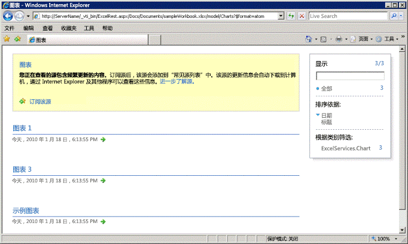
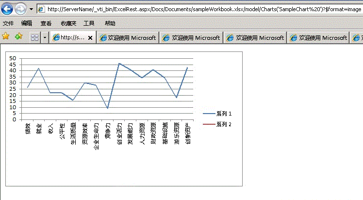

# Excel Services REST API 中的发现

本主题讨论了 Excel Services REST API 中内置的发现机制。
  
    
    


> **注释**
> Excel Services REST API 可本地应用于 SharePoint 2013 和 SharePoint 2016。对于 Office 365 教育版、商业版和企业版帐户，请使用作为  [Microsoft Graph](http://graph.microsoft.io/zh-cn/docs/api-reference/v1.0/resources/excel
) 终结点一部分的 Excel REST API。
  
    
    


## 发现基 URL 和发现示例

发现让开发人员和用户能够以手动或编程方式发现工作簿的相关信息和内容。发现机制提供了  [Atom](http://tools.ietf.org/html/rfc4287) 馈送，其中包含有关工作簿中资源的信息。通过使用发现，您可以浏览和查看工作簿中的资源。您可以浏览和访问的资源包括区域、图表、表格和数据透视表。
  
    
    
下面是指向工作簿中特定元素的 REST URL 的构造：
  
    
    


```

http://<ServerName>/_vti_bin/ExcelRest.aspx/<DocumentLibrary>/<FileName>/<ResourceLocation>
```

如 [基本 URI 结构和路径](basic-uri-structure-and-path.md)主题中所述，以下是访问名为"sampleWorkbook.xlsx"的工作簿和进一步查看名为"示例图表"的图表的 REST URL：
  
    
    


```
http://<ServerName>/_vti_bin/ExcelRest.aspx/Docs/Documents/sampleWorkbook.xlsx/model/Charts('SampleChart')
```

若要启动工作簿并浏览其中资源，以及使用发现来查看资源，请通过使用遵循以下示例的 URI 转到模型页面：
  
    
    


```
http://<ServerName>/_vti_bin/ExcelRest.aspx/<DocumentLibrary>/<FileName>/model
```

使用"sampleWorkbook.xlsx"示例，以下是 URI：
  
    
    


```
http://<ServerName>/_vti_bin/ExcelRest.aspx/Docs/Documents/sampleWorkbook.xlsx/model
```

以下是模型页面的屏幕截图。
  
    
    

**Excel Services REST 模型 URL**

  
    
    

  
    
    

  
    
    
指向模型页面的 URL 是启动发现位置。模型页面显示 Excel Services REST API 当前支持的四个资源集，包括区域、图表、表格或数据透视表。您可以通过以下方式浏览特定工作簿中的这些资源：单击模型页面上的"区域"、"图表"、"表格"或"数据透视表"。
  
    
    
例如，若要使用发现访问工作簿中的图表，请执行以下操作：
  
    
    

  
    
    

1. 在模型页面上，单击"图表"。单击"图表"链接会出现另一个 Atom 馈送，此生成的馈送会列出 sampleWorkbook.xlsx 工作簿中可用的所有图表。sampleWorkbook.xlsx 工作簿包含三个图表，名称分别为"图表 1"、"图表 3"和"示例图表"。因此，列出了三个图表名称，如下面的屏幕截图所示。
    
   **Excel Services REST 发现图列表**

  


  

  

  
2. 在模型页面上，单击"示例图表"。将显示驻留在"sampleWorkbook.xlsx"中的名为"示例图表"的图表，如下面的屏幕截图所示。
    
   **使用 REST 查看图表**

  


  

  

  
3. 同样，单击"图表 1"或"图表 3"将显示相应名称的图表。单击"示例图表"将导航到实际图表 URL。以下是转到"示例图表"图像的 URL（如屏幕截图中所示）：
    
  ```
  http://<ServerName>/_vti_bin/ExcelRest.aspx/Docs/Documents/sampleWorkbook.xlsx/model/Charts('SampleChart%20')?$format=image
  ```


## Atom 馈送

使用由 REST API 提供的  [Atom](http://tools.ietf.org/html/rfc4287) 馈送可让您轻松地获取感兴趣的数据。如果查看网页的源，将获取 XML。"sampleWorkbook.xlsx"中图表的示例如下所示。
  
    
    
从 XML 中可以看到，馈送包含可否认的元素，它使代码可以发现工作簿中存在的元素。每个 Atom 条目对应于一个可访问的图表。这种相同的机制适用于发现区域、表格和透视数据表。
  
    
    


```XML
<?xml version="1.0" encoding="utf-8" standalone="yes"?>
<feed xmlns="http://www.w3.org/2005/Atom" xmlns:x="http://schemas.microsoft.com/office/2008/07/excelservices/rest" xmlns:d="http://schemas.microsoft.com/ado/2007/08/dataservice" xmlns:m="http://schemas.microsoft.com/ado/2007/08/dataservices/metadata">
  <title type="text">Charts</title>
  <id>http://ServerName/_vti_bin/ExcelRest.aspx/Docs/Documents/sampleWorkbook.xlsx/model/Charts</id>
  <updated>2010-01-19T19:32:53Z</updated>
  <author>
    <name />
  </author>
  <link rel="self" href="http://ServerName/_vti_bin/ExcelRest.aspx/Docs/Documents/sampleWorkbook.xlsx/model/Charts?$format=atom" title="Charts" />
  <entry>
    <category term="ExcelServices.Chart" scheme="http://schemas.microsoft.com/ado/2007/08/dataservices/scheme" />
    <title>Chart 1</title>
    <id>http://ServerName/_vti_bin/ExcelRest.aspx/Docs/Documents/sampleWorkbook.xlsx/model/Charts('Chart%201')</id>
    <updated>2010-01-19T19:32:53Z</updated>
    <author>
      <name />
    </author>
    <link rel="alternate" title="Chart 1" href="http://ServerName/_vti_bin/ExcelRest.aspx/Docs/Documents/sampleWorkbook.xlsx/model/Charts('Chart%201')?$format=image" />
    <content type="image/png" src="http://ServerName/_vti_bin/ExcelRest.aspx/Docs/Documents/sampleWorkbook.xlsx/model/Charts('Chart%201')?$format=image" />
  </entry>
  <entry>
    <category term="ExcelServices.Chart" scheme="http://schemas.microsoft.com/ado/2007/08/dataservices/scheme" />
    <title>Chart 3</title>
    <id>http://ServerName/_vti_bin/ExcelRest.aspx/Docs/Documents/sampleWorkbook.xlsx/model/Charts('Chart%203')</id>
    <updated>2010-01-19T19:32:53Z</updated>
    <author>
      <name />
    </author>
    <link rel="alternate" title="Chart 3" href="http://ServerName/_vti_bin/ExcelRest.aspx/Docs/Documents/sampleWorkbook.xlsx/model/Charts('Chart%203')?$format=image" />
    <content type="image/png" src="http://ServerName/_vti_bin/ExcelRest.aspx/Docs/Documents/sampleWorkbook.xlsx/model/Charts('Chart%203')?$format=image" />
  </entry>
  <entry>
    <category term="ExcelServices.Chart" scheme="http://schemas.microsoft.com/ado/2007/08/dataservices/scheme" />
    <title>SampleChart </title>
    <id>http://ServerName/_vti_bin/ExcelRest.aspx/Docs/Documents/sampleWorkbook.xlsx/model/Charts('SampleChart%20')</id>
    <updated>2010-01-19T19:32:53Z</updated>
    <author>
      <name />
    </author>
    <link rel="alternate" title="SampleChart" href="http://ServerName/_vti_bin/ExcelRest.aspx/Docs/Documents/sampleWorkbook.xlsx/model/Charts('SampleChart%20')?$format=image" />
    <content type="image/png" src="http://ServerName/_vti_bin/ExcelRest.aspx/Docs/Documents/sampleWorkbook.xlsx/model/Charts('SampleChart%20')?$format=image" />
  </entry>
</feed>
```


## 另请参阅


#### 概念


  
    
    
 [Excel Services REST API 的资源 URI](resources-uri-for-excel-services-rest-api.md)
