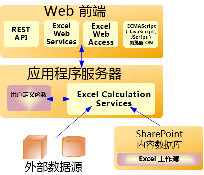

# Excel Services 体系结构

Excel Services 是 Microsoft SharePoint Server 2010 的一部分。Excel Services 构建于 ASP.NET 和 SharePoint Foundation 技术之上。下面是 Excel Services 中的核心组件：
  
    
    

- Excel Web Access
    
  
- Excel Web Services
    
  
- 用户定义函数 (UDF)
    
  
- ECMAScript (JavaScript, JScript)
    
  
- 代表性状态传输 (REST) 服务
    
  
- Excel Calculation Services
    
  

> **注释**
> Microsoft Excel Online 是 Office Online 的一部分，它也支持浏览器中的 Excel 工作簿。有关 Excel Online 的详细信息，请参阅 [关于 Office Web Apps 的文档](https://technet.microsoft.com/zh-cn/library/ee855124.aspx)。 
  
    
    

Excel Web Access、Excel Web Services、UDF、JavaScript、REST 服务和 Excel Calculation Services 组件也可以分为两个主要组：前端服务器（也称为"Web 前端"）上的组件和后端应用程序服务器上的组件。
**Web 前端和后端应用程序服务器的组件**

  
    
    

  
    
    

  
    
    

  
    
    

  
    
    

## Web 前端服务器和后端应用程序服务器

Excel Web Access、Excel Web Services、UDF、JavaScript、REST 服务和 Excel Calculation Services 组件可以分为 Web 前端服务器上的组件和后端应用程序服务器上的组件。Web 前端包括 Excel Web Access、JavaScript、REST 服务和 Excel Web Services。Excel Calculation Services 组件与管理员添加的任何 UDF 程序集一起驻留在后端应用程序服务器上。
  
    
    
在 SharePoint Server 2010 中最简单的配置中—即运行 SharePoint Server 2010 的单个计算机作为独立安装—所有五个组件安装在同一台计算机上。但是，在具有大量用户的典型企业环境中，Web 前端服务器上的组件和后端应用程序服务器上的组件位于服务器场配置中的不同计算机。可以独立于后端应用程序服务器横向扩展 Web 前端服务器。例如，您可能具有更多 Web 前端服务器或更多后端应用程序服务器，具体取决于您的组织需求。
  
    
    
有关 Excel Services 拓扑、可伸缩性、性能和安全性的信息，请参阅  [TechNet](https://technet.microsoft.com/zh-cn/library/cc303422%28office.14%29.aspx) 上的 SharePoint Server 2010 文档。
  
    
    

## Excel Web Access

Excel Web Access 是 SharePoint Server 2010 中您可以添加到任何 Web 部件页面的查看器页面和 Excel Services Web 部件。Excel Web Access 在网页上呈现在线 Excel 工作簿（换句话说，即为其创建 HTML），并使用户可以与这些工作簿进行交互并浏览这些工作簿。Excel Web Access 是对用户可见的 Excel Services 组件。您可以在 SharePoint Server 2010 中使用 Excel Web Access，就像任何其他 Web 部件一样。Excel Web Access 不要求用户在客户端计算机上安装任何程序。
  
    
    
Excel Web Access Web 部件属性也可以自定义。有关详细信息，请参阅  [Microsoft.Office.Excel.Server.WebUI](https://msdn.microsoft.com/library/Microsoft.Office.Excel.Server.WebUI.aspx) 命名空间参考文档。
  
    
    

## Excel Web Services

Excel Web Services 是 Excel Services 组件，可提供对 Web 服务的编程访问。您可以开发调用 Excel Web Services 的应用程序，以计算、设置和提取工作簿中的值，并刷新外部数据连接。通过使用 Excel Web Services，您可以将服务器端工作簿集成到应用程序中、自动更新 Excel 工作簿，并围绕服务器端计算创建应用程序特定的用户界面。 
  
    
    

> **注释**
> 对工作簿进行更改时—例如，使用 Excel Web Services 将值设置为范围—对工作簿的更改将仅为该会话保存。更改不会保存到原始工作簿中。当前工作簿会话结束时（例如，当您调用 **CloseWorkbook** 方法时，或当会话超时时），您所做的更改将丢失。> 如果您想保存对工作簿所做的更改，您可以使用 **GetWorkbook** 方法，然后保存工作簿。有关详细信息，请参阅 [Microsoft.Office.Excel.Server.WebServices](https://msdn.microsoft.com/library/Microsoft.Office.Excel.Server.WebServices.aspx) 。您也可以在编辑模式下打开工作簿并保存更改。
  
    
    

有关 Excel Web Services 的详细信息，请参阅  [Excel Services 开发路线图](excel-services-development-roadmap.md)。
  
    
    

## 用户定义函数 (UDF)

Excel Services UDF 使您可以在单元格中使用公式，以调用使用托管代码编写且部署到 SharePoint Server 2010 中的自定义函数。有关 Excel Services 中的 UDF 的详细信息，请参阅 [了解 Excel Services UDF](understanding-excel-services-udfs.md)。
  
    
    

## ECMAScript (JavaScript, JScript)

Excel Services 中的 JavaScript 对象模型使开发人员可以自定义、自动执行和驱动页面上的 Excel Web Access Web 部件控件。通过 JavaScript 对象模型，您可以构建与页面上的一个或多个 Excel Web Access Web 部件控件或页面上的 **iframe** 脚本交互的混合解决方案及其他集成解决方案。它还允许您向工作簿及相关代码中添加更多功能。
  
    
    
有关 Excel Services 中的 JavaScript 对象模型的详细信息，请参阅  [Ewa](http://msdn.microsoft.com/library/6fe73191-3213-b986-1ad6-2c3b918a2241%28Office.15%29.aspx) 命名空间参考文档。
  
    
    

## REST API

Excel Services 中的 REST API 使您可以直接通过 URL 访问工作簿部分或元素。URL 包含工作簿文件位置的"标记"路径（即 .aspx 页面的入口点）以及工作簿内所请求元素的路径。 
  
    
    
Excel Services REST API 中的内置发现机制使开发人员和用户可以手动或以编程方式浏览工作簿的内容。 
  
    
    
有关 Excel Services 中 REST API 的详细信息，请参阅  [Excel Services REST API](excel-services-rest-api.md)。 
  
    
    

## Excel Calculation Services

Excel Calculation Services 的角色是加载工作簿、计算工作簿、调用自定义代码 (UDF) 和刷新外部数据。它还负责维护会话状态以进行交互。Excel Calculation Services 在用户与呼叫者与同一工作簿进行交互时维护会话。当调用者明确关闭会话或当会话在服务器上超时时，会话将关闭。Excel Services 捕获打开的 Excel 工作簿、计算状态和外部数据查询结果，以改进多个用户访问同一工作簿集时的性能。
  
    
    

## 负载平衡

在多服务器配置中，Excel Services 在服务器场配置中的多个 Excel Calculation Services 之间对请求进行负载平衡。如果您的安装包含多个应用程序服务器，Excel Services 将尝试进行负载平衡，以确保应用程序服务器不会出现请求过载的情况。
  
    
    
管理员可以配置负载平衡行为。
  
    
    

## 另请参阅

#### 概念

  
    
    
 [Excel Services 概述](excel-services-overview.md)
  
    
    
 [Excel Services 开发路线图](excel-services-development-roadmap.md)
  
    
    
 [受支持和不受支持的功能](supported-and-unsupported-features.md)
#### 其他资源

  
    
    
 [演练：使用 Excel Web Services 开发自定义应用程序](walkthrough-developing-a-custom-application-using-excel-web-services.md)
