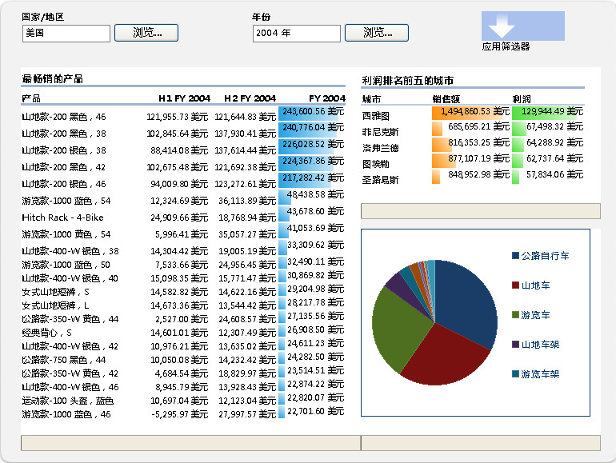
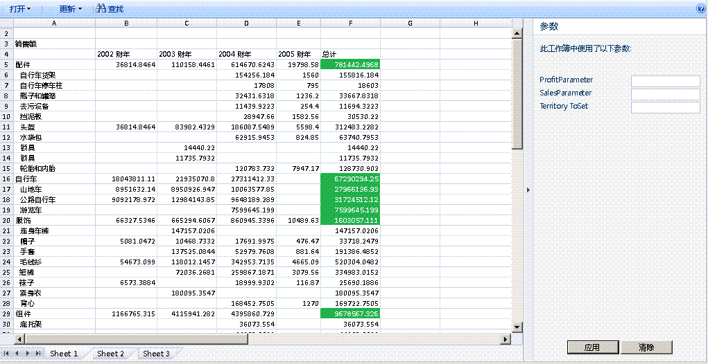

# Excel Services 概述

Excel Services 是一类服务应用程序，可利用它在 Microsoft SharePoint Server 2010 上加载、计算和显示 Microsoft SharePoint 2013 工作簿。Microsoft Office SharePoint Server 2007 中首先引入了 Excel Services。
  
    
    

通过使用 Excel Services，可在 SharePoint 2013 门户和仪表板中重用和共享 Excel 工作簿。例如，金融分析师、业务规划人员或工程师可在 Excel 中创建内容，并通过使用 SharePoint 2013 门户和仪表板与他人共享此内容，而无需编写自定义代码。可以控制要显示的数据，并可以维护 Excel 工作簿的单个版本。 
Excel Services 有四个主要接口： 
  
    
    

- Excel Web Access Web 部件，用于通过使用浏览器查看正在使用的工作簿并与之交互 
    
  
- Excel Web Services，用于编程访问
    
  
- 用于自动化和自定义的 ECMAScript (JavaScript, JScript) 对象模型，可驱动 Excel Web Access 控件并帮助构建更具吸引力的集成解决方案，以及为用户提供用户定义的函数，以扩展 ECMAScript (JavaScript, JScript) 对象模型
    
  
- 代表性状态传输 (REST) API，用于通过 URL 直接访问工作簿部件
    
  

> **注释**
> Excel 交互式视图功能已被禁用。有关如何从网站中移除此功能的信息，请参阅 [从网页中删除 Excel 交互式视图](removing-excel-interactive-view-from-a-webpage.md)。 
  
    
    

还可使用用户定义函数 (UDF) 来扩展 Excel Calculation Services。
> **注释**
> 有关 Excel Calculation Services 的详细信息，请参阅  [Excel Services 体系结构](excel-services-architecture.md)。 
  
    
    

通过使用 Excel Services，可仅使用浏览器来查看活动的交互式工作簿。这意味着，可在门户网站中保存 Excel 工作簿并与之交互。还可通过排序、筛选、展开或折叠数据透视表并通过传入参数，与基于 Excel 的数据进行交互；这将使您能够对发布的工作簿执行分析。可在不更改已发布工作簿的情况下，与工作簿进行交互，这对报告作者和报告使用者很有用。Excel Services 支持与外部数据源连接的工作簿。可以将与外部数据源的连接字符串嵌入工作簿中，或将这些连接字符串集中保存在数据连接库文件中。还可以通过使工作表中选定的单元格成为命名区域（参数），来使这些单元格可编辑。在保存到 Excel Services 时，选择设置为可查看的项将显示在 Excel Web Access 的"参数"窗格中。可以在"参数"窗格中更改这些命名区域的值并刷新工作簿。还可以使用门户的筛选器 Web 部件同时筛选多个 Web 部件（Excel Web Access 以及其他类型的 Web 部件）。 然而，您不能使用 Excel Services 创建新工作簿或编辑现有工作簿。若要创作工作簿以与 Excel Services 共同使用，可以使用 Microsoft Excel 2013。
> **注释**
> Microsoft Excel Online 作为 Office Online 的一部分，也支持浏览器中的 Excel 工作簿。有关 Excel Online 的详细信息，请参阅 [新版 Office 入门](http://office.microsoft.com/zh-cn/support/getting-started-with-office-2013-FX102809998.aspx)。 
  
    
    

Excel Services 还具有一类 Web 服务。可以使用 Excel Web Services 加载工作簿、设置单元格和范围中的值、刷新外部数据连接、计算工作表以及提取计算结果（包括单元格值、整个计算工作簿或工作簿快照）。在 SharePoint 2013 中，还可使用 Excel Web Services 保存和参与协作编辑会话，以及保存副本。
> **注释**
> 有关快照的详细信息，请参阅 [如何：获取整个工作簿或快照](how-to-get-an-entire-workbook-or-a-snapshot.md)。 
  
    
    

Excel Services 支持 UDF，这些 UDF 可用于扩展 Excel Calculation Services 的功能（例如，实现自定义计算库或从 Excel Services 本身不支持的 Web 服务和数据源中读取数据）。Excel Services 是一个可伸缩的稳固的企业级服务器，可利用 Excel 提供功能和计算保真度。
## 方案和功能

Excel Services 支持许多不同的方案和功能，本节对其中一些方案和功能进行了说明。 
  
    
    

### 商业智能门户和工作簿分析

商业智能门户会显示记分卡和报告，使用户能只通过使用浏览器来浏览数据。SharePoint Server 中的"商业智能中心"功能包括商业智能门户和仪表板功能。图 1 显示了一个带报告库、图表并已设置关键绩效指标 (KPI) 的报告中心仪表板。
  
    
    
还可利用 Excel Services 在服务器上计算数据。通过提供在集成的商业智能中心仪表板上计算和公开基于 Excel 的内容的能力，Excel Services 将参与"商业智能中心"。可通过使用 Excel Web Access Web 部件来显示 Excel 工作簿，连接到外部数据源，然后进一步与工作簿中的数据进行交互。 
  
    
    
 图 1 显示一个带筛选器 Web 部件的仪表板和使用 Excel Web Access Web 部件显示的 Excel 工作簿。
  
    
    

**图 1. 带筛选和 Excel 内容的仪表板**

  
    
    

  
    
    

  
    
    
除了参与集成的仪表板外，Excel Services 还可用于显示全部或部分 Excel 工作簿，以使用户能够在熟悉的 Excel 用户界面中与此内容进行交互。图 2 显示通过参数显示的范围和对用户输入公开的单元格。通过将特定单元格指定为参数，使用户能够使用右侧窗格中的编辑框来修改工作表中这些单元格的值。Excel Services 随后将基于新值重新计算工作表。
  
    
    
如果需要使用 Excel 中的某些功能，或者需要使用所有 Excel 功能来分析工作簿，则可单击"在 Excel 中打开"在 Excel 中打开一个工作簿。也可以在 Excel 中打开一个工作簿以对其进行打印，然后进行脱机使用。
  
    
    

    
> **注释**
> 若要使用"在 Excel 中打开"命令打开工作簿，则必须具有"打开"权限。有关详细信息，请参阅下一节"管理工作簿"和  [TechNet](http://technet.microsoft.com/zh-cn/library/cc263215.aspx) 上的 [用户权限和权限级别](http://technet.microsoft.com/zh-cn/library/cc721640.aspx)。不具有"打开"权限的用户仍可以在 Excel 中打开快照。 
  
    
    

**图 2. 使用"参数"窗格**

  
    
    

  
    
    

  
    
    
还可以使用 Excel Web Access 分析、透视数据并与之交互。
  
    
    
有关 Excel Services 和 SharePoint 2013 中的商业智能功能的详细信息，请参阅 SharePoint Server 帮助中的商业智能文档。 
  
    
    

### 管理工作簿

Excel Services 的工作簿管理和锁定功能使您能够执行以下操作：
  
    
    

- 仅在安全的中心位置保留一份由受信任的作者创建和更改的工作簿的副本，而不是在每个用户的计算机上保留多个副本。可以更轻松地通过 Excel、SharePoint 和其他应用程序查找、共享和使用工作簿的正确版本。 
    
  
- 保护工作簿模型和后端数据。可以向用户授予"仅查看"权限以限制对工作簿的访问。例如，可以阻止用户使用 Excel 打开工作簿，也可以控制用户可在工作簿中查看的内容。用户可具有对作者要共享的 Excel 工作簿中的内容的基于浏览器的访问权，但无法在 Excel 客户端中打开工作簿、查看公式或查看工作簿中可能具有的支持内容或其他知识属性。 
    
  
- 创建工作簿快照。
    
  
Excel Services 已针对多个用户和工作簿进行了优化。它还可以帮助对服务器场中的计算进行负载平衡。
  
    
    
有关使用 Excel Services 管理工作簿的详细信息，请参阅  [TechNet](http://technet.microsoft.com/zh-cn/library/ee424405%28office.14%29.aspx) 或 SharePoint Server 帮助中的 SharePoint Server 文档。
  
    
    

### 通过自定义 .NET 应用程序的编程访问

可以创建以下自定义应用程序（例如，ASP.NET 应用程序）：
  
    
    

- 可调用 Excel Web Services 以访问、参数化和计算工作簿。
    
  
- 打开、刷新外部数据、设置单元格或区域、重新计算、与其他应用程序或人员共同参与协作编辑会话、保存和另存为。 
    
  
- 使用自定义工作流安排计算操作或发送电子邮件通知。（这会使用 SharePoint 功能，并且它不是 Excel Services 的本机部分。）
    
  

### 用户定义函数 (UDF)

还可以使用 Excel Services UDF，它使您能够使用单元格中的公式来调用自定义函数，这些函数是用托管代码编写的并将部署到 SharePoint Server。
  
    
    
有关 Excel Services 中 UDF 的详细信息，请参阅 [了解 Excel Services UDF](understanding-excel-services-udfs.md)。
  
    
    

### ECMAScript（JavaScript、JScript）

还可使用 Excel Services 中的 JavaScript 对象模型来自动执行、自定义和驱动 Excel Web Access Web 部件控件。可使用 JavaScript 对象模型生成更引入注目的集成的解决方案。
  
    
    

### JavaScript 用户定义函数 (UDF)

ECMAScript (JavaScript, JScript) UDF 是 Microsoft Excel Services 和 Microsoft SharePoint 2013 中的新功能，让您能够在将嵌入的 Excel 工作簿用于 SharePoint 中的 OneDrive 或 Excel Web AccessExcel Web Access Web 部件时，向 Excel 添加自定义函数。除了在 Excel 中使用的内置函数之外，可以使用可从 中的公式内部调用的 JavaScript UDF 来添加您自己的自定义函数。
  
    
    
JavaScript UDF 类似于可为 Microsoft Excel 创建的 [UDF](http://msdn.microsoft.com/zh-cn/library/ms499792.aspx)。区别在于，JavaScript UDF 仅用于网页中嵌入的工作簿中，且仅在该网页上存在。
  
    
    

### JavaScript 对象模型

Excel Services JSOM API 现在包括：
  
    
    

- 重新加载嵌入的工作簿的功能。现在您可以将嵌入的工作簿重置为以下工作簿文件中的数据。
    
  
- 用户创建的浮动对象。EwaControl 对象包含新的方法，可用于添加/删除您创建的浮动对象。
    
  
- 对 Ewa 控件的可查看区域的更多控制。
    
  
- SheetChanged 事件。在对表单进行更改时（例如，更新单元格，删除或清除单元格，复制、剪切或粘贴范围以及撤消/重做操作），将引发此事件。
    
  
- 支持数据验证。您现在可以验证由用户输入的数据。
    
  

### REST API

可在 Excel Services 中使用 REST API，通过 URL 直接访问工作簿部件或元素。利用 Excel Services REST API 中内置的发现机制，开发人员和用户能够手动或以编程方式浏览工作簿内容。 
  
    
    
有关 Excel Services 中 REST API 的详细信息，请参阅  [Excel Services REST API](excel-services-rest-api.md)。
  
    
    

### REST ODATA

Microsoft Excel Services 和 Microsoft SharePoint 2013 中的新功能。通过使用 Excel Services REST API 中的新 OData 功能，您可以以 OData 方式来请求 Excel 工作簿中的表。例如，若要使用 REST 调用来请求有关 SampleWorkbook.xlsx 工作簿中可用资源的 Excel 元数据，可使用以下语法。
  
    
    
http://<ServerName>/_vti_bin/ExcelRest.aspx/Docs/Documents/SampleWorkbook.xlsx/model 有关 REST API 的详细信息，请参阅 
  
    
    
SharePoint 2013 SDK 文档中的  [Excel Services 2010 REST API](http://msdn.microsoft.com/zh-cn/library/ee556413.aspx)。
  
    
    
若要使用 OData 请求有关 SampleWorkbook.xlsx 工作簿中的可用资源的元数据，请使用相同的 REST 语法，只不过将 /Model 替换为 /Odata，如下面的请求所示。 
  
    
    
http://<ServerName>/_vti_bin/ExcelRest.aspx/Docs/Documents/sampleWorkbook.xlsx/OData
  
    
    
可从中使用 OData 系统查询选项来获取有关工作簿中的表的特定信息。
  
    
    

## 其他资源

-  [Excel Services 开发路线图](excel-services-development-roadmap.md)
    
  
-  [Excel Services 体系结构](excel-services-architecture.md)
    
  
-  [JavaScript 用户定义的功能概述](javascript-user-defined-functions-overview.md)
    
  
-  [在 SharePoint 2013 中将 OData 与 Excel Services REST 一起使用](using-odata-with-excel-services-rest-in-sharepoint-2013.md)
    
  
-  [演练：使用 Excel Web Services 开发自定义应用程序](walkthrough-developing-a-custom-application-using-excel-web-services.md)
    
  
-  [关于 Excel Services UDF 的常见问题](frequently-asked-questions-about-excel-services-udfs.md)
    
  
-  [Excel Services 中不支持的功能](http://msdn.microsoft.com/library/5868e672-4786-4fed-9168-07ff538f6f5c%28Office.15%29.aspx)
    
  
-  [Excel Services 博客、论坛和资源](excel-services-blogs-forums-and-resources.md)
    
  

