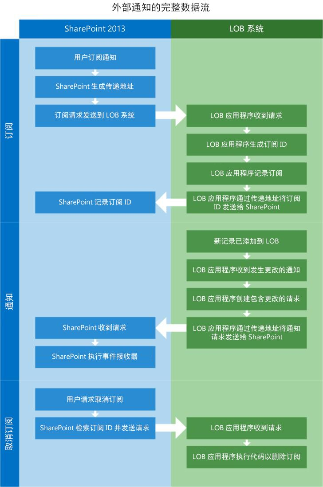
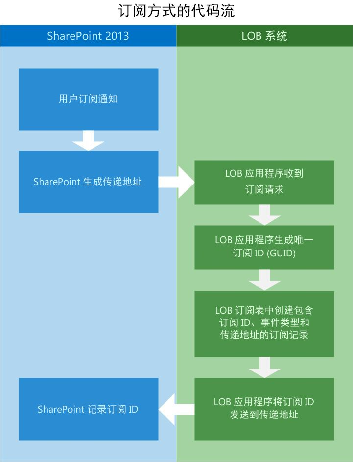
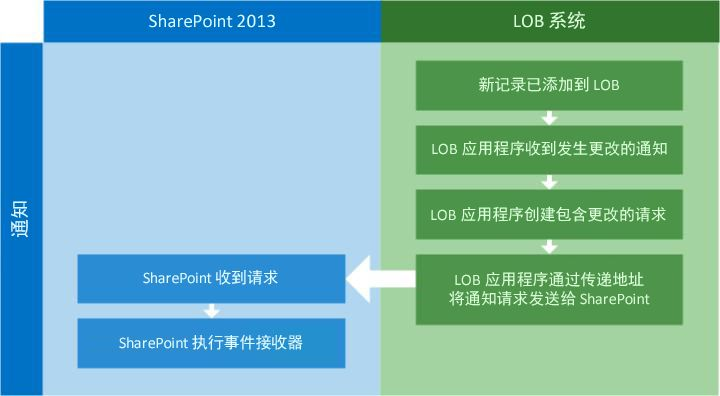
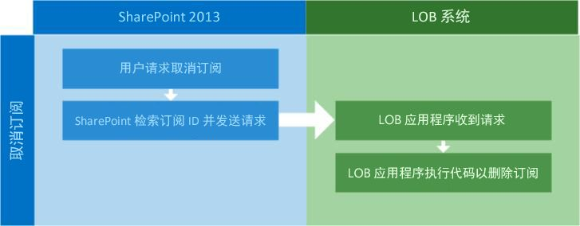

# SharePoint 2013 中的外部事件和警告
了解在 SharePoint 2013 中创建可连接到外部列表的远程事件接收器所代表的概念，以及列表中所示外部数据更新时事件接收器将执行的操作。
## 事件接收器是什么？
<a name="Externalevents_overview"> </a>

事件接收器是响应 SharePoint 触发事件（如添加、移动、删除、签入和签出）的一条托管代码。当这些事件发生，而且事件接收器的标准得到满足时，将执行您为提供其他功能而编写的代码。当 SharePoint 对象（如列表、工作流和功能）配置为等待这些事件发生时，它们称为事件宿主。 
  
    
    
事件接收器让您可以在特定事件发生时执行业务逻辑。实质上，这些是您可以在其中创建代码以处理特定条件、发出通知、更新其他系统等的挂钩。创建事件接收器时将生成 DLL。您可以将该 DLL 放入全局程序集缓存中，以便调用事件接收器来响应外部系统中的任何更改。
  
    
    
下面的示例包含 C# 中的一个简单外部事件接收器，它将在新的项添加到列表中时执行。
  
    
    


```cs

public class EntryContentEventReceiver : SPItemEventReceiver
{
   public override void ItemAdded(SPItemEventProperties properties)
   {
      base.ItemAdded(properties);

      // properties.ExternalNotificationMessage holds the message sent by the external 
      // system.
   }
```

也可以扩展外部事件接收器，让它依据实体事件接收器工作，正如将远程事件接收器部署为本地服务或部署在 Microsoft Azure 中一样。 
  
    
    

## 远程事件接收器是什么？
<a name="WhatIsARemoteEventReceiver"> </a>

对于 SharePoint 2013 而言，远程事件接收器是新概念。在传统的 SharePoint 解决方案中，使用事件接收器处理用户创建或删除列表或列表中的项等事件。在 SharePoint 外接程序中，使用远程事件接收器处理类似的事件。远程事件接收器的工作方式类似于常规事件接收器，唯一不同的是远程事件接收器从其主机 Web 应用程序处理 SharePoint 外接程序位于其他系统上时发生的事件。
  
    
    
Business Connectivity Services (BCS) 使用附加到外部列表和实体的远程事件接收器，这使您可以编写对外部系统中承载的数据的更改作出反应的代码。
  
    
    
为解决此问题，将两个构造型添加到 BDC 模型的架构： **EventSubscriber** 和 **EventUnsubscriber**。
  
    
    

> **注释**
> 沙盒解决方案不支持事件接收器。 
  
    
    


## 新的外部事件接收器基础结构将提供什么功能？
<a name="FeaturesAddedWithRER"> </a>

通过使用和扩展 SharePoint 2013 事件接收器特性，BCS 能够添加警告、外部列表事件接收器和实体接收器以提供扩展的功能。
  
    
    

- **警告：**警告一直是多个版本的 SharePoint 密不可分的一部分，但在 SharePoint 2013 之前它们不使用外部列表。现在用户可以在外部列表上创建警告，它们与标准 SharePoint 列表上的警告的行为相同。
    
  
- **外部列表事件接收器：**现在事件接收器可以附加到外部列表中，就像可以添加到标准列表中一样。这提供一种可扩展性机制，使您可以编写在特定时间执行的代码。
    
  
- **实体事件接收器：**实体事件接收器通过让您编写更稳固的代码来提供灵活性，该代码允许其他操作，如提供用于筛选数据的用户上下文。这可以允许更好的个性化和自定义安全。
    
  
SharePoint 2013 中的远程事件处理让多个有趣的方案成为可能。例如，您可能具有"销售线索跟踪"应用程序，当新的销售线索输入到外部线索应用程序中时，它将通知销售团队。当输入新的销售线索时，SharePoint 将通过作为线索应用程序一部分的通知系统得到通知。SharePoint 接收通知，然后为特定销售人员创建新任务，以跟进每一条新线索。通过配置外部系统上的销售线索输入应用程序，使之在创建新线索时向 SharePoint 发送通知，SharePoint 完全可以保持最新的状态。
  
    
    

## 为外部列表使用事件接收器的先决条件
<a name="bkmk_Prerequisites"> </a>

若要为外部列表使用事件接收器，您需要以下先决条件：
  
    
    

- SharePoint 2013
    
  
- Visual Studio 2008
    
  
有关设置 SharePoint 2013 开发环境的详细信息，请参阅 [设置 SharePoint 2013 的常规开发环境](set-up-a-general-development-environment-for-sharepoint-2013.md)。
  
    
    

## 配置外部系统以向 SharePoint 通知外部事件
<a name="Externalevents_components"> </a>

若要运行外部事件，需要在 SharePoint 主机和外部系统上安装和配置许多组件。
  
    
    
您必须配置外部系统，以便它执行以下操作：
  
    
    

- **确定基础数据变更的时间。**若要让外部系统知道何时发生了变更，您必须创建一种轮询特定变更的机制。您可以通过使用按特定时间间隔轮询数据源的定时服务来实现这一点。
    
  
- **接收和记录更改通知的订阅请求。**外部系统必须实现订阅存储，以便存储应该接收变更通知的用户。最简单的解决方案可能是数据库表。该表（或者任何您选择的机制）应记录 SubscriptionID、传递地址、事件类型和实体名称。
    
  
- **将通知发布到表示状态传输 (REST) 终结点。**为让 SharePoint 订阅者知道发生了更改，外部系统应用程序需要将 HTTP WebRequest 发送到记录在订阅存储中的传递地址。该传递地址是 SharePoint 在订阅过程中生成的 RESTful 终结点。
    
  

## 配置 SharePoint 2013 以允许与外部系统通信
<a name="bkmk_configureSP"> </a>

若要允许与外部系统通信，SharePoint 必须配置以下内容：
  
    
    

- 配置了 **EventSubscriber** 和 **EventUnsubscriber** 构造型的 BDC 模型
    
  
- 事件接收器
    
  

### 如何启用外部事件处理？

您可以通过"网站设置"或通过将下面的自定义特性 ID 添加到项目中，从而在 SharePoint 2013 中启用外部事件处理。
  
    
    

```XML

<ActivationDependency FeatureTitle="BCSEvents" FeatureId="60c8481d-4b54-4853-ab9f-ed7e1c21d7e4" />
```

在 Subscribe 过程中，当 SharePoint 创建传递地址并将其发送到外部系统时，将启用外部系统的事件处理。
  
    
    

## SharePoint 和外部系统之间的总体外部事件处理流
<a name="bkmk_overallflow"> </a>

在图 1 中请注意，使用外部事件接收器时有三个不同的步骤：订阅、通知和取消订阅。
  
    
    

**图 1 完成外部通知的数据流**

  
    
    

  
    
    

  
    
    

  
    
    

  
    
    

## EventSubscriber：订阅通知
<a name="bkmk_eventsubscriber"> </a>

用户（SharePoint 对象）若要在基础数据发生更改时接收到通知，用户必须订阅一个实体的通知。为了实现这一点，扩展 BDC 模型架构已包含 **Subscribe** 构造型。SharePoint 可以使用 **Subscribe** 构造型使外部系统知道发送者请求在基础数据发生更改时收到通知。
  
    
    
图 2 演示 Subscribe 过程中 SharePoint 和外部系统之间的信息流。
  
    
    

**图 2. Subscribe 过程流**

  
    
    

  
    
    

  
    
    
下面介绍订阅过程的常规流：
  
    
    

  
    
    

1. **用户请求订阅通知。**SharePoint 使用自定义用户界面（页面或功能区中的按钮）启动对外部系统应用程序的通知请求。
    
  
2. **SharePoint 生成传递地址。**作为 Subscribe 过程的一部分，SharePoint 将在传递通知的位置创建 REST 终结点。
    
  
3. **将订阅请求发送到外部系统。**然后 SharePoint 将请求者信息和动态生成的 REST URL 一起封装，将 Web 请求发送到外部系统。
    
  
4. **外部系统接收请求。**可能存在不同的方式来实现订阅存储。在本例中，您将使用 SQL Server 数据库表。
    
  
5. **外部系统生成 SubscriptionId。**使用业务线 (LOB) 应用程序中的代码生成新的 **subscriptionId**。 **subscriptionId** 应为 GUID。
    
  
6. **外部系统记录订阅。**外部系统应用程序记录从 SharePoint 发送至订阅存储中的 **subscriptionId**、传递地址、事件类型和其他信息。
    
  
7. **外部系统将 SubscriptionId 返回 SharePoint。**SharePoint 若要正确路由外部系统发送的更新，需要将 **subscriptionId** 返回 SharePoint，SharePoint 将信息记录在数据库中。
    
    BDC 模型根据 **Subscribe** 函数导入进行工作。本例显示了用于函数导入的元数据。
    


  ```XML
  FunctionImport
 
<EntityType Name="EntitySubscribe">
   <Key>
      <PropertyRef Name="SubscriptionId" />
   </Key>
   <Property Name="SubscriptionId" Type="Edm.Int32" Nullable="false" 
      p6:StoreGeneratedPattern="Identity" 
      xmlns:p6="http://schemas.microsoft.com/ado/2009/02/edm/annotation" />
   <Property Name="EntityName" Type="Edm.String" MaxLength="250" FixedLength="false" 
      Unicode="true" />
   <Property Name="DeliveryURL" Type="Edm.String" MaxLength="250" FixedLength="false" 
      Unicode="true" />
   <Property Name="EventType" Type="Edm.Int32" />
   <Property Name="UserId" Type="Edm.String" MaxLength="50" FixedLength="false" 
      Unicode="true" />
   <Property Name="SubscribeTime" Type="Edm.Binary" MaxLength="8" FixedLength="true" 
      p6:StoreGeneratedPattern="Computed" 
      xmlns:p6="http://schemas.microsoft.com/ado/2009/02/edm/annotation" />
   <Property Name="SelectColumns" Type="Edm.String" MaxLength="10" FixedLength="false" 
      Unicode="true" />
</EntityType>

  ```


### 代码示例：包含 Subscribe 的 BDC 模型

下面是添加了 **Subscribe** 方法的 BDC 模型示例。
  
    
    

```XML

<Method Name="SubscribeCustomer" DefaultDisplayName="Customer Subscribe" IsStatic="true">
   <Properties>
     <Property Name="ODataEntityUrl" Type="System.String">/EntitySubscribes</Property>
     <Property Name="ODataHttpMethod" Type="System.String">POST</Property>
     <Property Name="ODataPayloadKind" Type="System.String">Entry</Property>
     <Property Name="ODataFormat" Type="System.String">application/atom+xml</Property>
     <Property Name="ODataServiceOperation" Type="System.Boolean">false</Property>
   </Properties>
   <AccessControlList>
      <AccessControlEntry Principal="NT Authority\\Authenticated Users">
         <Right BdcRight="Edit" />
         <Right BdcRight="Execute" />
         <Right BdcRight="SetPermissions" />
         <Right BdcRight="SelectableInClients" />
      </AccessControlEntry>
   </AccessControlList>
   <Parameters>
      <Parameter Direction="In" Name="@DeliveryURL">
         <TypeDescriptor TypeName="System.String" Name="DeliveryURL" >
            <Properties>
               <Property Name="IsDeliveryAddress" Type="System.Boolean">true</Property>
            </Properties>
         </TypeDescriptor>
      </Parameter>
      <Parameter Direction="In" Name="@EventType">
         <TypeDescriptor TypeName="System.Int32" Name="EventType" >
            <Properties>
               <Property Name="IsEventType" Type="System.Boolean">true</Property>
            </Properties>
         </TypeDescriptor>
      </Parameter>
      <Parameter Direction="In" Name="@EntityName">
         <TypeDescriptor TypeName="System.String" Name="EntityName" >
            <DefaultValues>
               <DefaultValue MethodInstanceName="SubscribeCustomer" 
                  Type="System.String">Customers</DefaultValue>
            </DefaultValues>
      </TypeDescriptor>
    </Parameter>
    <Parameter Direction="In" Name="@SelectColumns">
      <TypeDescriptor TypeName="System.String" Name="SelectColumns" >
        <DefaultValues>
          <DefaultValue MethodInstanceName="SubscribeCustomer" Type="System.String">*</DefaultValue>
        </DefaultValues>
      </TypeDescriptor>
    </Parameter>
    <Parameter Direction="Return" Name="SubscribeReturn">
      <TypeDescriptor Name="SubscribeReturnRootTd" TypeName="Microsoft.BusinessData.Runtime.DynamicType">
        <TypeDescriptors>
          <TypeDescriptor Name="SubscriptionId" TypeName="System.String" >
            <Properties>
              <Property Name="SubscriptionIdName" Type="System.String">Default</Property>
            </Properties>
            <Interpretation>
              <ConvertType LOBType="System.Int32" BDCType="System.String"/>
            </Interpretation>
          </TypeDescriptor>
          <TypeDescriptor Name="DeliveryURL" TypeName="System.String" />
          <TypeDescriptor Name="SelectColumns" TypeName="System.String" >
          </TypeDescriptor>
          <TypeDescriptor Name="EntityName" TypeName="System.String" />
          <TypeDescriptor Name="EventType" TypeName="System.Int32" />
          <TypeDescriptor Name="UserId" TypeName="System.String" />
          <!--TypeDescriptor Name="SubscribeTime" TypeName="System." /-->
        </TypeDescriptors>
      </TypeDescriptor>
    </Parameter>
  </Parameters>
  <MethodInstances>
    <MethodInstance Type="EventSubscriber" ReturnParameterName="SubscribeReturn" ReturnTypeDescriptorPath="SubscribeReturnRootTd" Default="true" Name="SubscribeCustomer" DefaultDisplayName="Customer Subscribe">
      <AccessControlList>
        <AccessControlEntry Principal="NT Authority\\Authenticated Users">
          <Right BdcRight="Edit" />
          <Right BdcRight="Execute" />
          <Right BdcRight="SetPermissions" />
          <Right BdcRight="SelectableInClients" />
        </AccessControlEntry>
      </AccessControlList>
    </MethodInstance>
  </MethodInstances>
</Method>
```

表 1 列出了 **Subscribe** 构造型工作所需的重要的 BDC 模型属性。
  
    
    

**表 1. BDC 模型属性**


|**属性**|**说明**|
|:-----|:-----|
|**IsDeliveryAddress** <br/> |在 **TypeDescriptor** 上使用的 **Boolean** 标志，它可以指示是否使用所提供的传递地址来传递通知。 <br/> |
|**IsEventType** <br/> |在 **TypeDescriptor** 上使用的 **Boolean** 标志，它可以指示是否使用所提供的事件类型作为事件类型。有效的事件类型有 **ItemAdded**、 **ItemUpdated** 和 **ItemDeleted** 等。 <br/> |
|**SubscriptionIdName** <br/> |在 **TypeDescriptor** 上使用的表示 **subscriptionId** 部分名称的字符串。 <br/> |
   

## 通知
<a name="bkmk_notifications"> </a>

在 SharePoint 2013 中增强了事件处理基础结构，以允许外部数据源在外部系统内的信息发生修改时通知 SharePoint。然后，当 SharePoint 接收到通知时，与 SharePoint 外部列表或实体关联的事件接收器可以执行代码以执行指定操作。
  
    
    
创建订阅后，外部系统需要一种方式来通知 SharePoint 关于特殊实体发生的更改。外部系统预期将通知传输到传递地址，该地址是 SharePoint 在 Subscribe 过程中使用 OData Atom 格式化有效负载为外部系统提供的地址。
  
    
    
图 3 演示当新纪录添加到外部系统中的数据时，外部系统与 SharePoint 之间的通信流。
  
    
    

**图 3 通知过程**

  
    
    

  
    
    

  
    
    

  
    
    

1. **将新纪录添加到外部系统。**在本例中，使用应用程序用户界面将新纪录添加到外部系统，或直接将其添加到数据库。
    
  
2. **外部系统应用程序收到变更通知。**必须让外部系统应用程序知道基础数据在发生更改。有许多方式可以实现这一目的。您可以使用将在特定表的数据发生更改时触发的 SQL 触发器，或创建轮询机制在数据存储中查询更改。还有其他方式可以实现这一点，但是必须考虑性能并评估每种方式。
    
  
3. **外部系统通过传递地址将通知请求发送到 SharePoint。**为了针对更改进行通信，必须将 Atom 格式化请求发送到存储在 LOB 应用程序订阅存储中的传递地址。
    
  

### 通知有效负载

在构造通知时，LOB 系统必须创建 HTTP 有效负载，该有效负载包括已更改项的全部详细信息或仅包括已更改项的标识。
  
    
    

- **标识：**将有效负载作为标识发送时，有效负载预计仅包含已更改项的标识信息。例如，对于"客户"实体中的客户来说，有效负载将仅包含已更改的客户的 ID。
    
  
- **完整项：**在这种情况下，有效负载是外部系统内变更的完整记录。在客户的示例中，有效负载包含完整的已更改的客户记录。
    
  

> **注释**
> 仅在使用 OData 连接器时，支持完整项。 
  
    
    

在订阅过程中，必须指示外部系统发送的有效负载的类型。
  
    
    
以下是用于通知的 BDC 模型属性示例。
  
    
    


```XML

<Property Name="NotificationParserType" Type="System.String">
   ODataEntryContentNotificationParser
</Property>

```

如果未指定，则默认有效负载为标识有效负载。
  
    
    

### 通知传递地址（虚拟地址）

从 SharePoint 中启动的订阅过程使 SharePoint 创建出虚拟地址，让外部系统具有入口点可以发布通知。外部系统使用该传递地址发布通知。在订阅请求期间，传递地址也将传递到外部系统。
  
    
    

## EventUnsubscriber：删除通知列表中的订阅
<a name="bkmk_eventunsubscriber"> </a>

 **Unsubscribe** 操作删除通知列表中的订阅。
  
    
    
 图 4 表明 **UnSubscribe** 方法更加简单。因为订阅 ID 已返回 SharePoint，而且 SharePoint 已将它记录下来，需要做的仅仅是使用正确的订阅 ID 发送 UnSubscribe 请求。
  
    
    

**图 4 UnSubscribe 方法的代码流**

  
    
    

  
    
    

  
    
    

### Unsubscribe 的 BDC 模型

下面的 XML 示例将演示如何创建可以取消订阅外部系统事件通知的 BDC 模型。
  
    
    

```XML

<Method Name="UnSubscribeExpenseReport" DefaultDisplayName="ExpenseReport
    Unsubscribe">
    <Properties>
        <Property Name="ODataEntityUrl" Type="System.String">
            /Subscriptions(@ID)</Property>
        <Property Name="ODataHttpMethod" Type="System.String">DELETE</Property>
        <Property Name="ODataPayloadKind" Type="System.String">Property</Property>
        <Property Name="ODataServiceOperation" Type="System.Boolean">false</Property>
    </Properties>
    <AccessControlList>
        <AccessControlEntry Principal="NT Authority\\Authenticated Users">
            <Right BdcRight="Edit" />
            <Right BdcRight="Execute" />
            <Right BdcRight="SetPermissions" />
            <Right BdcRight="SelectableInClients" />
        </AccessControlEntry>
    </AccessControlList>
    <Parameters>
        <Parameter Name="@ID" Direction="In">
            <TypeDescriptor Name="ID" TypeName="System.Int32">
                <Properties>
                    <Property Name="SubscriptionIdName" Type="System.String">ID</Property>
                </Properties>
                <Interpretation>
                    <ConvertType LOBType="System.Int32" BDCType="System.String" />
                </Interpretation>
            </TypeDescriptor>
        </Parameter>
    </Parameters>
    <MethodInstances>
        <MethodInstance Name="UnSubscribeExpenseReport" DefaultDisplayName="ExpenseReport 
             Unsubscribe" Type="EventUnsubscriber" Default="true">
            <AccessControlList>
                <AccessControlEntry Principal="NT Authority\\Authenticated Users">
                    <Right BdcRight="Edit" />
                    <Right BdcRight="Execute" />
                    <Right BdcRight="SetPermissions" />
                    <Right BdcRight="SelectableInClients" />
                </AccessControlEntry>
            </AccessControlList>
        </MethodInstance>
    </MethodInstances>
</Method>


<Method IsStatic="false" Name="Unsubscribe">
    <AccessControlList>
        <AccessControlEntry Principal="NT AUTHORITY\\Authenticated Users">
            <Right BdcRight="Edit" />
            <Right BdcRight="Execute" />
            <Right BdcRight="SetPermissions" />
            <Right BdcRight="SelectableInClients" />
        </AccessControlEntry>
    </AccessControlList>
    <Parameters>
        <Parameter Direction="In" Name="subscriptionId">
            <TypeDescriptor TypeName="System.String" Name="subscriptionId" 
                IsSubscriptionId="true" />
         </Parameter>
    </Parameters>
    <MethodInstances>
        <MethodInstance Type="EventUnsubscriber" Default="true" Name="Unsubscribe" 
            DefaultDisplayName="UnSubscriber">
            <Properties>
                <Property Name="LastDesignedOfficeItemType" Type="System.String">None</Property>
            </Properties>
            <AccessControlList>
                <AccessControlEntry Principal=" NT AUTHORITY\\Authenticated Users ">
                    <Right BdcRight="Edit" />
                    <Right BdcRight="Execute" />
                    <Right BdcRight="SetPermissions" />
                    <Right BdcRight="SelectableInClients" />
                </AccessControlEntry>
            </AccessControlList>
        </MethodInstance>
    </MethodInstances>
</Method>

```


## 代码示例：将事件接收器附加到外部列表
<a name="AttachingRER"> </a>

下面的代码提供关于如何将事件接收器附加到外部列表的示例。将其附加后，事件接收器将从外部系统监听关于对本机数据执行的更新、添加和删除的通知。
  
    
    

```XML

private static void AddEventReceiver(string siteUrl, string listTitle)
{ 
   string assembly = "SampleEventReceiver, Culture=neutral, Version=1.0.0.0, 
      PublicKeyToken=1bfafa687d2e46a7";
   string className = "SampleEventReceiver.EntryContentEventReceiver"; 
   
   try
   {
      using (SPSite site = new SPSite(siteUrl)) 
      { 
         using (SPWeb web = site.OpenWeb()) 
         {
            SPList list = web.Lists[listTitle]; 
            list.EventReceivers.Add(SPEventReceiverType.ItemAdded, 
               assembly, className); 
         }
      }
   }
   catch (Exception e) 
   { 
      Console.WriteLine(e); 
   }
}

```


## 基本知识之外的内容：了解有关使用外部事件接收器的详细信息
<a name="Externalevents_Learnmore"> </a>

有关外部事件和警告的详细信息，请参阅以下内容。
  
    
    

**表 2. 处理外部事件接收器的高级概念**


|**文章**|**说明**|
|:-----|:-----|
| [如何：创建用作 BCS 外部系统的 OData 数据服务](how-to-create-an-odata-data-service-for-use-as-a-bcs-external-system.md) <br/> |了解如何创建 Internet 寻址 Windows Communication Foundation (WCF) 服务，该服务在基本数据更改时使用 OData 向 SharePoint 2013 发送通知。这些通知用于触发连接到外部列表的事件。  <br/> |
   

## 其他资源
<a name="Externalevents_Addres"> </a>


-  [SharePoint 2013 中的 Business Connectivity Services 的新增功能](what-s-new-in-business-connectivity-services-in-sharepoint-2013.md)
    
  
-  [SharePoint 2013 中的 Business Connectivity Services](business-connectivity-services-in-sharepoint-2013.md)
    
  
-  [SharePoint 2013 的 Business Connectivity Services 程序员参考](business-connectivity-services-programmers-reference-for-sharepoint-2013.md)
    
  
-  [如何：创建外部事件接收器](how-to-create-external-event-receivers.md)
    
  

