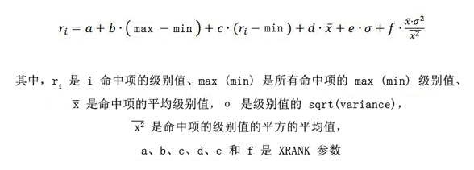

# FAST 查询语言 (FQL) 语法参考
了解使用 FAST 查询语言 (FQL) 为 SharePoint 2013 中的搜索功能 构建复杂的搜索查询。此引用介绍 FQL 查询的元素以及如何在您的 FQL 查询中使用属性规范、标记表达式和运算符。
## SharePoint Server 2013 中 FQL 及查询语言子表达式和表达式简介
<a name="SP15FQL_about"> </a>

FAST 查询语言 (FQL) 是一种功能强大的查询语言，可让开发人员执行准确的搜索并将您的搜索范围缩小到属于特定托管属性或全文本索引的值。
  
    
    
查询语言表达式可以包含其中包括查询词、属性规范和运算符的嵌套子表达式，如表 1 中所述。
  
    
    

**表 1. 查询语言表达式中的子表达式**


|**项目**|**说明**|
|:-----|:-----|
|标记表达式  <br/> |要在查询中搜索的一个或多个查询词、短语或数值。  <br/> |
|属性规范  <br/> |要与受影响的表达式相匹配的属性或全文检索。  <br/> |
|运算符  <br/> |指定布尔操作（例如 **AND**、 **OR**）或对操作数的其他约束（例如 **FILTER**）的关键字  <br/> |
   

### FQL 查询示例

以下 FQL 查询示例在索引项的 **body** 托管属性中搜索词"hello"和"world"：
  
    
    
 `body:string("hello world", mode="and")`
  
    
    
在该示例中：
  
    
    

-  `body:` 将查询范围限制为项中的 body 托管属性。
    
  
-  `"hello world"` 是 **STRING** 运算符的操作数，指示要搜索的词。
    
  
-  `mode="and"` 指示将对 `"hello world"` 应用逻辑查询运算符 **AND** 。
    
  
FAST 查询语言查询的长度限制为 2,048 个字符。
  
    
    

## FQL 中的属性规范
<a name="property_specification"> </a>

属性规范将受影响表达式的范围限制为索引内容的特定区域。此类区域可由全文检索或托管属性标识。 
  
    
    
将 **Text** 和 **YesNo** 类型的托管属性视为文本。将所有其他托管属性类型（包括 **Datetime** 类型）视为数值。
  
    
    
如果您没有为表达式包括属性规范，则搜索引擎将尝试与索引架构中定义的默认全文检索相匹配。
  
    
    
属性名称必须始终在冒号（ **In** 运算符）前面，数字运算符必须始终包括属性规范。
  
    
    
属性规范（ **In** 运算符）可以应用于以下查询实体：
  
    
    

- 单个词或短语，如下所示：
    
     `author:shakespeare`
  
    
    
 `title:"to be or not to be"`
    
  
- 运算符，例如 **STRING** 运算符，如下所示：
    
  ```
  
title:string("to be or not to be")
  ```


    在本例中，属性规范应用于完整的运算符表达式。
    
  

### 示例

以下每个表达式与 **title** 托管属性中同时具有"much"和"nothing"的项相匹配。
  
    
    
 `title:and(much, nothing)`
  
    
    
 `and(title:much, title:nothing)`
  
    
    
 `title:string("much nothing", mode="and")`
  
    
    

## FQL 中的标记表达式
<a name="token_expressions"> </a>

令牌表达式是根据索引匹配的字、短语或数值。
  
    
    
文本令牌表达式可以为单个字或用双引号引起的短语。
  
    
    
数值令牌表达式可以为单个值或一个值范围表达式。
  
    
    

### 通配符表达式

通配符表达式表示包含星号 (" *****") 字符的单个术语或短语；星号表示匹配零个或多个字符，但不包括空格。FQL 支持针对单个文本托管属性和全文本索引的前缀搜索。
  
    
    

#### 通配符表达式示例

以下是 FQL 中有效使用的通配符表达式的列表：
  
    
    

-  `text*`
    
  
-  `string("this examp*")`
    
  

### 数词表达式
<a name="fql_token_numeric"> </a>

每个数词表达式必须包括一个可兼容的索引架构数据类型的属性规范。表 2 列出 FQL 中可使用的数字数据类型。 
  
    
    

**表 2. FQL 中可使用的数字数据类型**


|**FQL 类型**|**可兼容的索引架构类型**|**说明**|
|:-----|:-----|:-----|
|**Int** <br/> |**Integer** <br/> |64 位整数。  <br/> |
|**Float** <br/> |**Double** <br/> |64 位（双精度）浮点数。  <br/> |
|**Decimal** <br/> |**Decimal** <br/> |128 位小数  <br/> |
|**Datetime** <br/> |**Datetime** <br/> |日期和时间值。  <br/> 利用 FQL 中的日期/时间支持，可以对日期/时间值执行与对其他数值执行的相同的数字运算。  <br/> |
   

#### 日期和时间查询表达式
<a name="fql_token_datetime"> </a>

FQL 提供了针对日期和时间的 **datetime** 数据类型。
  
    
    
查询中支持以下与 ISO 8601 兼容的 **datetime** 格式：
  
    
    

- YYYY-MM-DD 
    
  
- YYYY-MM-DDThh:mm:ss 
    
  
- YYYY-MM-DDThh:mm:ssZ 
    
  
- YYYY-MM-DDThh:mm:ssfrZ
    
  
在这些 **datetime** 格式中：
  
    
    

-  _YYYY_ 指定四位数年份。
    
    > **注释**
      > 仅支持四位数年份。 
-  _MM_ 指定二位数月份。例如，01 表示 1 月。
    
  
-  _DD_ 指定二位数日期（01 到 31）。
    
  
-  _T_ 指定字母"T"。
    
  
-  _hh_ 指定二位数小时（00 到 23）；不允许使用 A.M./P.M. 指示法。
    
  
-  _mm_ 指定二位数分钟（00 到 59）。
    
  
-  _ss_ 指定二位数秒钟（00 到 59）。
    
  
-  _fr_ 指定秒数的可选分数， _ss_；跟随秒数后 **.** 的 1 到 7 位数。例如，2012-09-27T11:57:34.1234567。
    
  
必须根据 UTC（协调世界时，也称为 GMT，即格林威治标准时间）指定所有日期/时间值。
  
    
    

### 保留字、特殊字符和转义
<a name="fql_token_numeric"> </a>

FQL 中会保留以下字。
  
    
    
 `and, or, any, andnot, count, decimal, rank, near, onear, int, in32, int64, float, double, datetime, max, min, range, phrase, scope, filter, not, string, starts-with, ends-with, equals, words, xrank.`
  
    
    
若要将这些字中的任一字表示为查询表达式中的词，则必须将它们用双引号引起来，如以下示例所示： 
  
    
    

-  `or("any", "and", "xrank")`
    
  
-  `string("any and xrank", mode="OR")`
    
  
-  `phrase(this, is, a, "phrase")`
    
  

> **提示**
> 保留字和字符不区分大小写，但为了将来兼容，建议使用小写字符。 
  
    
    

FQL 并不总是要求用双引号将字符串引起来。例如， `and(cat, dog)` 是有效的 FQL，即使未用双引号将 `cat` 和 `dog` 引起来。但建议您使用双引号，以避免与保留字发生冲突。
  
    
    
根据区域设置对查询词进行词汇切分。词汇切分过程会删除某些特殊字符。由于删除了特殊字符，因此下列 FQL 表达式等效。
  
    
    
 `and("[king]", "<queen>")`
  
    
    
 `and("king", "queen")`
  
    
    
当查询包括用户输入或另一个应用程序中的词时，请使用  `string("<query terms>", mode="AND|OR|PHRASE")` 运算符，以避免与查询语言中的保留字发生冲突。还必须从用户提供的查询中删除可能存在的双引号。
  
    
    

## FQL 运算符
<a name="fql_operators"> </a>

FAST 查询语言 (FQL) 运算符是一些关键字，它们指定布尔运算或对操作数的其他限制。FQL 运算符语法如下所示：
  
    
    
 `[property-spec:]operator(operand [,operand]* [, parameter="value"]*)`
  
    
    
在此语法中：
  
    
    

-  _property-spec_ 是后跟"in"运算符的可选属性规范。
    
  
-  _operator_ 是指定要执行的运算的关键字。
    
  
-  _operand_ 是一个字词表达式或其他运算符。
    
  
-  _parameter_ 是可更改运算符行为的值的名称。
    
  
-  _value_ 是用于参数名的值。
    
  
运算符名称、参数名和参数文本值都是不区分大小写的。运算符正文中允许有空格，但除非用引号将空格引起，否则将忽略空格。FAST 查询语言查询的长度限制为 2,048 个字符。
  
    
    
表 3 列出 FQL 所支持运算符的类型。 
  
    
    

**表 3. FQL 支持的运算符类型**


|**类型**|**说明**|**运算符**|
|:-----|:-----|:-----|
|字符串  <br/> |允许您指定针对字词字符串的查询操作。这是最常用于文本字词的运算符。  <br/> | [STRING](fast-query-language-fql-syntax-reference.md#fql_string_operator) <br/> |
|布尔值  <br/> |允许您在查询中组合字词和子表达式。  <br/> | [AND](fast-query-language-fql-syntax-reference.md#fql_and_operator)、 [OR](fast-query-language-fql-syntax-reference.md#fql_or_operator)、 [ANY](fast-query-language-fql-syntax-reference.md#fql_any_operator)、 [ANDNOT](fast-query-language-fql-syntax-reference.md#fql_andnot_operator)、 [NOT](fast-query-language-fql-syntax-reference.md#fql_not_operator)、 [COUNT](fast-query-language-fql-syntax-reference.md#fql_count_operator)、 [COUNT](fast-query-language-fql-syntax-reference.md#fql_count_operator) <br/> |
|邻近度  <br/> |允许您指定文本的匹配序列中的查询字词的近似度。  <br/> | [NEAR](fast-query-language-fql-syntax-reference.md#fql_near_operator)、 [ONEAR](fast-query-language-fql-syntax-reference.md#fql_onear_operator)、 [PHRASE](fast-query-language-fql-syntax-reference.md#fql_phrase_operator)、 [STARTS-WITH](fast-query-language-fql-syntax-reference.md#fql_startswith_operator)、 [ENDS-WITH](fast-query-language-fql-syntax-reference.md#fql_endswith_operator)、 [EQUALS](fast-query-language-fql-syntax-reference.md#fql_equals_operator) <br/> |
|Numeric  <br/> |允许您指定查询中的数字条件。  <br/> | [RANGE](fast-query-language-fql-syntax-reference.md#fql_range_operator)、 [INT](fast-query-language-fql-syntax-reference.md#fql_int_operator)、 [FLOAT](fast-query-language-fql-syntax-reference.md#fql_float_operator)、 [DATETIME](fast-query-language-fql-syntax-reference.md#fql_datetime_operator)、 [DECIMAL](#fql_decimal_operator) <br/> |
|相关性  <br/> |允许您影响查询的相关性评估。  <br/> | [XRANK](fast-query-language-fql-syntax-reference.md#fql_xrank_operator) 和 [FILTER](fast-query-language-fql-syntax-reference.md#fql_filter_operator) <br/> |
   
表 4 提供受支持运算符的列表。
  
    
    

**表 4. FQL 支持的运算符**


|**运算符**|**说明**|**类型**|
|:-----|:-----|:-----|
| [AND](fast-query-language-fql-syntax-reference.md#fql_and_operator) <br/> |只返回匹配所有 **AND** 操作数的项。 <br/> |布尔值  <br/> |
| [ANDNOT](fast-query-language-fql-syntax-reference.md#fql_andnot_operator) <br/> |只返回匹配第一个操作数且不匹配后续操作数的项。  <br/> |布尔值  <br/> |
| [ANY](fast-query-language-fql-syntax-reference.md#fql_any_operator) <br/> |与 **OR** 运算符类似，只是动态排名（结果集中的相关性分数）既不受匹配的操作数的数目影响，也不受项中各字词之间的距离的影响。 <br/> |布尔值  <br/> |
| [COUNT](fast-query-language-fql-syntax-reference.md#fql_count_operator) <br/> |用于指定查询词在某个项中要出现多少次才能作为结果返回。操作数可以是一个查询词、一个短语或通配符查询词。  <br/> |布尔值  <br/> |
| [DATETIME](fast-query-language-fql-syntax-reference.md#fql_datetime_operator) <br/> |提供数值的显式键入。  <br/> 显式类型转换是可选的，通常不需要。根据目标数字托管属性的类型检测查询词的类型。  <br/> |Numeric  <br/> |
| [DECIMAL](fast-query-language-fql-syntax-reference.md#fql_decimal_operator) <br/> |提供数值的显式键入。  <br/> 显式类型转换是可选的，通常不需要。根据目标数字托管属性的类型检测查询词的类型。  <br/> |Numeric  <br/> |
| [ENDS-WITH](fast-query-language-fql-syntax-reference.md#fql_endswith_operator) <br/> |指定必须在托管属性末尾显示的字词或短语。  <br/> |邻近度  <br/> |
| [EQUALS](fast-query-language-fql-syntax-reference.md#fql_equals_operator) <br/> |指定字词或短语必须提供与托管属性的准确标记匹配。  <br/> |邻近度  <br/> |
| [FILTER](fast-query-language-fql-syntax-reference.md#fql_filter_operator) <br/> |用于查询元数据或其他结构化数据。  <br/> |相关性  <br/> |
| [FLOAT](fast-query-language-fql-syntax-reference.md#fql_float_operator) <br/> |提供数值的显式键入。  <br/> 显式类型转换是可选的，通常不需要。根据目标数字托管属性的类型检测查询词的类型。  <br/> |Numeric  <br/> |
| [INT](fast-query-language-fql-syntax-reference.md#fql_int_operator) <br/> |提供数值的显式键入。  <br/> 显式类型转换是可选的，通常不需要。根据目标数字托管属性的类型检测查询词的类型。  <br/> |Numeric  <br/> |
| [NEAR](fast-query-language-fql-syntax-reference.md#fql_near_operator) <br/> |将结果集限制为相互之间的特定距离内有  `N` 个字词的项。 <br/> |邻近度  <br/> |
| [NOT](fast-query-language-fql-syntax-reference.md#fql_not_operator) <br/> |只返回排除操作数的项。  <br/> |布尔值  <br/> |
| [ONEAR](fast-query-language-fql-syntax-reference.md#fql_onear_operator) <br/> |**NEAR** 的有序变体，要求各字词按顺序匹配。 **ONEAR** 运算符可用于将结果集限制为相互之间特定距离内有 `N` 个字词的项。只返回与操作数不匹配的项。操作数可能是任何有效的 FQL 表达式。 <br/> |邻近度  <br/> |
| [OR](fast-query-language-fql-syntax-reference.md#fql_or_operator) <br/> |只返回至少与一个 **OR** 操作数匹配的项。如果与多个 **OR** 操作数匹配，则匹配的项将得到较高的动态排名（结果集中的相关性分数）。 <br/> |布尔值  <br/> |
| [PHRASE](fast-query-language-fql-syntax-reference.md#fql_phrase_operator) <br/> | 只返回与标记的字符串完全匹配的项。 <br/> |邻近度  <br/> |
| [RANGE](fast-query-language-fql-syntax-reference.md#fql_range_operator) <br/> | 启用范围匹配表达式。 **RANGE** 运算符用于数字和日期/时间托管属性。 <br/> |Numeric  <br/> |
| [STARTS-WITH](fast-query-language-fql-syntax-reference.md#fql_startswith_operator) <br/> |指定必须在托管属性的开头显示的字词或短语。  <br/> |邻近度  <br/> |
| [STRING](fast-query-language-fql-syntax-reference.md#fql_string_operator) <br/> |定义文本字符串的布尔值匹配条件。  <br/> |字符串  <br/> |
| [XRANK](fast-query-language-fql-syntax-reference.md#fql_xrank_operator) <br/> |使您能够基于特定字词的出现次数来提升项的动态排名，而无需更改要与查询匹配的项。 **XRANK** 表达式包含一个必须匹配的组件以及一个或多个只参与动态排名的组件。 <br/> |相关性  <br/> |
   

> **注释**
> 在 SharePoint 2013 中， **RANK** 运算符被弃用并将不再有效。请改为使用 **XRANK**。 
  
    
    


### AND
<a name="fql_and_operator"> </a>

只返回匹配所有 **AND** 操作数的项。操作数可以是一个字词或任何有效的 FQL 子表达式。
  
    
    

#### 语法

 `and(operand, operand [, operand]*)`
  
    
    

#### 参数

不适用。
  
    
    

#### 示例

下面的表达式匹配其默认全文本索引包含"cat"、"dog"和"fox"的项。
  
    
    
 `and(cat, dog, fox)`
  
    
    

### ANDNOT
<a name="fql_andnot_operator"> </a>

只返回匹配第一个操作数且不匹配后续操作数的项。操作数可以是一个字词或任何有效的 FQL 子表达式。
  
    
    

#### 语法

 `andnot(operand, operand [,operand]*)`
  
    
    

#### 参数

不适用。
  
    
    

#### 示例

 **示例 1.** 下面的表达式匹配其默认全文本索引包含"cat"而非"dog"的项。
  
    
    
 `andnot(cat, dog)`
  
    
    
 **示例 2.** 下面的表达式匹配其默认全文本索引包含"dog"而非"beagle"和"chihuahua"的项。
  
    
    
 `andnot(dog, beagle, chihuahua)`
  
    
    

### ANY
<a name="fql_any_operator"> </a>


> **注释**
> 在 SharePoint Server 2013 中， **ANY** 运算符被弃用。请改为使用 **OR** 运算符。
  
    
    

与  [OR](fast-query-language-fql-syntax-reference.md#fql_or_operator) 运算符类似，只是动态排名（结果集中的相关性分数）既不受匹配的操作数的数目影响，也不受项中各字词之间的距离的影响。操作数可以是一个字词或任何有效的 FQL 子表达式。
  
    
    
此查询部分的动态排名组件基于 **ANY** 表达式内的最佳匹配字词。
  
    
    

> **注释**
> 与 **OR** 的差别在于，它仅与结果集内的排名有关。将有总数相同的一组项与查询匹配。
  
    
    


#### 语法

 `any(operand, operand [,operand]*)`
  
    
    

#### 参数

不适用。
  
    
    

#### 示例

 下面的表达式与其默认全文本索引包含"cat"或"dog"的项匹配。
  
    
    
如果索引同时包含"cat"和"dog"，但将"cat"视为是更好的匹配项，则"项"的动态排名将基于"cat"，而不会考虑"dog"。
  
    
    
 `any(cat, dog)`
  
    
    

### COUNT
<a name="fql_count_operator"> </a>

指定将项必须包含的查询词的出现次数作为结果返回。操作数可以是一个查询词、一个短语或一个通配符查询词。
  
    
    

#### 语法

 `property-spec:count(operand [,from=<numeric value>, to=<numeric value>])`
  
    
    

#### 参数


|**参数**|**值**|**说明**|
|:-----|:-----|:-----|
| _From_ <br/> | _<numeric_value>_ <br/> | _from_ 参数的值必须是一个正整数，它指定必须匹配指定操作数的最小次数。 <br/> 如果未指定  _from_ 参数，则不存在下限。 <br/> |
| _to_ <br/> | _<numeric_value>_ <br/> | _to_ 参数的值必须是一个正整数，它指定必须匹配指定操作数的最大次数（不包括该次数）。例如， _to_ 值为 **11** 会指定次数小于或等于 10。 <br/> 如果未指定  _to_ 参数，则不存在上限。 <br/> |
   

#### 示例

 **示例 1.** 下面的表达式至少与单词"cat"匹配了 5 次。
  
    
    
 `count(cat, from=5)`
  
    
    
 **示例 2.** 下面的表达式至少与单词"cat"匹配了 5 次，但匹配次数不会大于或等于 10。
  
    
    
 `count(cat, from=5, to=10)`
  
    
    
 **示例 3.** 下面的每个表达式至少与单词"cat"或"dog"中的任意一个匹配了 3 次。
  
    
    
 `count(or(cat, dog), from=3)count(string("cat dog", mode="or"), from=3)`
  
    
    
下表包含托管属性字符串值的示例，并指明它们是否匹配示例 3 中的两个表达式。
  
    
    


|**是否匹配？**|**文本**|
|:-----|:-----|
|是  <br/> |My cat likes my dog, but my dog hates my cat.  <br/> |
|否  <br/> |My bird likes my newt, but my dog hates my cat.  <br/> |
   

### DATETIME
<a name="fql_datetime_operator"> </a>

提供日期/时间数值的显式键入。此操作数是一个日期/时间字符串，其格式是按  [FQL 中的标记表达式](fast-query-language-fql-syntax-reference.md#token_expressions)中指定的语法设置的。
  
    
    
显式类型转换是可选的，通常不需要。根据目标数字托管属性的类型检测查询词的类型。
  
    
    

#### 语法

 `datetime(<date/time string>)`
  
    
    

#### 参数

不适用。
  
    
    

### DECIMAL
<a name="fql_decimal_operator"> </a>

提供小数值的显示键入。依据  [FQL 中的标记表达式](fast-query-language-fql-syntax-reference.md#token_expressions)中指定的语法，此操作数是一个小数值。
  
    
    
显式类型转换是可选的，通常不需要。根据目标数字托管属性的类型检测查询词的类型。
  
    
    

#### 语法

 `decimal(<decimal point value>)`
  
    
    

#### 参数

不适用。
  
    
    

### ENDS-WITH
<a name="fql_endswith_operator"> </a>

指定必须在托管属性的末尾显示的单词或短语（边界匹配）。
  
    
    
数字托管属性不支持边界匹配。数字托管属性总是遵循完全匹配或值范围匹配。 
  
    
    
一些应用程序可能需要您能够执行托管属性的完全匹配。例如，有这样一个 **product name** 托管属性，其中一个产品的全名是另一个产品名的子字符串。
  
    
    

#### 语法

 `ends-with(<term or phrase>)`
  
    
    

#### 参数

不适用。
  
    
    

#### 示例

下面的表达式匹配其"author"托管属性中包含"Mr Adam Jones"和"Adam Jones"值的项。此表达式与带"Adam Jones sr"值的项不匹配。
  
    
    
 `author:ends-with("adam jones")`
  
    
    

#### 备注

可对托管属性的所有文本应用边界匹配，也可对包含字符串值列表（例如，名称列表）的托管属性中的单个字符串应用边界匹配。在此情况下，您可能需要准确匹配每个字符串的内容，并避免执行跨字符串边界的查询匹配。 
  
    
    
若要应用边界匹配查询，您必须在索引架构中配置相关的托管属性。 
  
    
    
通过启用托管属性的边界匹配功能，可执行以下操作： 
  
    
    

- 使用显式边界匹配查询。 
    
  
- 禁止短语跨字符串边界进行匹配。对于包含多个字符串的托管属性，此功能将确保字符串不与边界指示之前或之后的单词匹配。
    
  

### EQUALS
<a name="fql_equals_operator"> </a>

指定字词或短语必须提供与托管属性的准确标记匹配。
  
    
    

#### 语法

 `equals(<term or phrase>)`
  
    
    

#### 参数

不适用。
  
    
    

#### 示例

下面的示例将匹配其"author"托管属性中包含"Adam Jones"值的项。该示例不匹配带"Adam Jones sr"或"Mr Adam Jones"值的项。
  
    
    
 `author:equals("adam jones")`
  
    
    

#### 备注

另请参阅  [ENDS-WITH](fast-query-language-fql-syntax-reference.md#fql_endswith_operator)。
  
    
    

### FILTER
<a name="fql_filter_operator"> </a>

用于查询元数据或其他结构化数据。 
  
    
    
一旦使用 **FILTER** 运算符，即自动表明指定查询的以下内容：
  
    
    

- 语言将设置为 linguistics="OFF"。
    
  
- 排名将被禁用。
    
  
- 命中查询结果的命中突出显示摘要中将不使用任何查询突出显示。
    
  

> **提示**
> 如果在 **FILTER** 表达式中使用 **STRING** 运算符，则默认情况下，将禁用语言。可通过使用操作数 `linguistics="ON"`，在 **FILTER** 内的每个 **STRING** 表达式中启用语言处理。
  
    
    


#### 语法

 `filter(<any valid FQL operator expression>)`
  
    
    

#### 参数

不适用。
  
    
    

#### 示例

下面的表达式匹配具有一个包含"sonata"的 **Title** 托管属性和一个仅包含"audio"标记的 **Doctype** 托管属性的项。将不会对"audio"执行任何语言匹配。由于 **FILTER** 标记将用于匹配"audio"，因此该文本将不会在命中突出显示摘要中突出显示。
  
    
    
 `and(title:sonata, filter(doctype:equals("audio")))`
  
    
    

#### 备注

如果必须将您的查询限制为与数字属性中的一大组整数值中的至少一个整数值匹配，则可按照两种在功能上等效的方法来表达此查询： 
  
    
    

-  `and(string("hello world"), filter(property-spec:or(1, 20, 453, ... , 3473)))`
    
  
-  `and(string("hello world"), filter(property-spec:int("1 20 453 ... 3473", mode="or")))`
    
  
第二个示例通过将字符串与包含在双引号中的一组数值一起使用，来使用 **INT** 运算符。这将在筛选一大组数值时大大提高查询性能。
  
    
    
如果必须筛选一大组值，则应考虑使用数值而不是字符串值，并通过使用优化语法表达查询。
  
    
    

### FLOAT
<a name="fql_float_operator"> </a>

提供浮点数值的显式键入。 依据  [FQL 中的标记表达式](fast-query-language-fql-syntax-reference.md#token_expressions)中指定的语法，此操作数是一个浮点值。
  
    
    
显式类型转换是可选的，通常不需要。根据目标数字托管属性的类型检测查询词的类型。
  
    
    

#### 语法

 `float(<floating point value>)`
  
    
    

#### 参数

不适用。
  
    
    

### INT
<a name="fql_int_operator"> </a>

提供整数值的显式键入。 依据  [FQL 中的标记表达式](fast-query-language-fql-syntax-reference.md#token_expressions)中指定的语法，此操作数是一个整数值。
  
    
    
显式类型转换是可选的，通常不需要。根据目标数字托管属性的类型检测查询词的类型。
  
    
    
 **INT** 运算符还可用于将一组整数值表示为 FQL 布尔运算符的参数。这将能够采用在性能上有效的方式在查询中提供一组整数值，因为 FQL 查询分析程序不解析通过使用 **INT** 运算符传递的值，而是直接将这些值传递到查询匹配组件。
  
    
    

#### 语法

 `int(<integer value>)`
  
    
    
 `int("value, value, … , value")`
  
    
    
第一个语法指定一个整数。第二个语法指定括在双引号中的以逗号分隔的整数值列表。
  
    
    

#### 参数

不适用。
  
    
    

#### 示例

如果需要将您的查询限制为与数字属性中的一大组整数值中的至少一个整数值匹配，可通过使用 **INT** 运算符来表达此查询：
  
    
    
 `and(string("hello world"), filter(id:int("1 20 49 124 453 985 3473", mode="or")))`
  
    
    

### NEAR
<a name="fql_near_operator"> </a>

将结果集限制为相互之间的特定距离内有  _N_ 个字词的项。
  
    
    
查询词的顺序对于匹配并不重要，而只对距离重要。 
  
    
    
可将任意数量的字词与 **NEAR** 运算符结合使用。
  
    
    
 **NEAR** 操作数可以是单个字词、短语或 **OR** 或 **ANY** 布尔运算符表达式。通配符是可以接受的。
  
    
    
如果 **NEAR** 运算符的多个操作数与同一个索引标记匹配，则将这些操作数视为彼此相邻。
  
    
    

#### 语法

 `near(arg, arg [, arg]* [, N=<numeric value>])`
  
    
    

#### 参数


|**参数**|**值**|**说明**|
|:-----|:-----|:-----|
| _N_ <br/> | _<numeric_value>_ <br/> |指定两个字词之间允许显示的最大单词数（显式近似）。  <br/> 如果 **NEAR** 包含两个以上的操作数，则在整个表达式内计算两个字词之间允许的最大单词数 ( _N_)。  <br/> 默认值： **4** <br/> |
   

#### 示例

 **示例 1.** 下面的表达式匹配同时包含"cat"和"dog"的字符串（如果分隔它们的索引标记不超过 4 个（默认值））。
  
    
    
 `near(cat, dog)`
  
    
    
 **示例 2.** 下面的表达式匹配同时包含"cat"、"dog"、"fox"和"wolf"的字符串（如果分隔它们的索引标记不超过 4 个）。
  
    
    
 `near(cat, dog, fox, wolf)`
  
    
    
下表包含托管属性字符串值的示例，并指明它们是否匹配示例 2 中前面的表达式。
  
    
    


|**是否匹配？**|**文本**|
|:-----|:-----|
|是  <br/> |The picture shows a cat, a dog, a fox, and a wolf.  <br/> |
|是（使用词干分解）  <br/> |Dogs, foxes, and wolves are canines, but cats are felines.  <br/> |
|否  <br/> |The picture shows a cat with a dog, a fox, and a wolf.  <br/> |
   
下面的表达式匹配上表中的所有字符串。
  
    
    
 `near(cat, dog, fox, wolf, N=5)`
  
    
    

#### 备注

 **NEAR/ONEAR 字词距离注意事项**
  
    
    
 _N_ 指示在项的匹配段内查询词之间允许显示的单词的最大数目。如果 **NEAR** 或 **ONEAR** 包含两个以上的操作数，则在与所有 **NEAR** 或 **ONEAR** 字词匹配的项部分内计算查询词之间允许的最大单词数 ( _N_)。
  
    
    
对词汇切分文本使用 **NEAR** 或 **ONEAR** 。这表示将逗号（" **,** "）、句号（" **.** "）、冒号（" **:** "）或分号（" **;** "）等特殊字符视为空格。字词"distance"与索引文本中的标记相关。
  
    
    
如果使用操作数相等的 **ONEAR** 或 **NEAR**，则运算符将按如下方式工作： 
  
    
    
 `near(a, a, n=x)`
  
    
    
如果上下文中至少显示一个" `a`"实例，则此查询将始终返回 **true**。这还表示 **NEAR** 不能用作 **COUNT** 运算符。有关计算字词出现次数的详细信息，请参阅 [COUNT](fast-query-language-fql-syntax-reference.md#fql_count_operator) 运算符。
  
    
    
应用于短语的 **NEAR** 还将与文本中的重叠短语匹配。
  
    
    
如果匹配段中的标记与 **NEAR** 或 **ONEAR** 表达式的多个操作数匹配，则查询可以匹配，即使匹配段内的未匹配标记的数目超过了 **NEAR** 或 **ONEAR** 运算符表达式中的" _N_"值也是如此。例如，重叠可以为重叠短语。如果标记重叠匹配项的数目为" `O`"，则查询将匹配（如果项的匹配段中仅显示" `N+O`"个未匹配标记）。 
  
    
    
 ** **NEAR** 或带有 **NOT** 的 **ONEAR****
  
    
    
 **NEAR** 或 **ONEAR** 运算符内不能使用 **NOT** 运算符。以下是错误的 FQL 语法：
  
    
    
 `near(audi,not(bmw),n=2)`
  
    
    

### NOT
<a name="fql_not_operator"> </a>

只返回不匹配操作数的项。操作数可以是任何有效的 FQL 表达式。
  
    
    

#### 语法

 `not(operand)`
  
    
    

#### 参数

不适用。
  
    
    

### ONEAR
<a name="fql_onear_operator"> </a>

 **NEAR** 的有序变体，要求各字词按顺序匹配。 **ONEAR** 运算符可用于将结果集限制为相互之间的特定距离内有 _N_ 个字词的项。
  
    
    

#### 语法

 `onear(arg, arg [, arg]* [, N=<numeric value>])`
  
    
    

#### 参数


|**参数**|**值**|**说明**|
|:-----|:-----|:-----|
| _N_ <br/> | _<numeric_value>_ <br/> |指定两个字词之间允许显示的最大单词数（显式近似）。  <br/> 如果 **ONEAR** 包含两个以上的操作数，则在整个表达式内计算两个字词之间允许的最大单词数 ( _N_)。  <br/> 默认值： **4** <br/> |
   

#### 示例

 **示例 1.** 下面的表达式与依次出现的所有的"cat"、"dog"、"fox"和"wolf"单词匹配（如果分隔它们的索引标记不超过 4 个）。
  
    
    
 `onear(cat, dog, fox, wolf)`
  
    
    
下表包含托管属性字符串值的示例，并指明它们是否匹配上一个表达式。
  
    
    


|**是否匹配？**|**文本**|
|:-----|:-----|
|是  <br/> |The picture shows a cat, a dog, a fox, and a wolf.  <br/> |
|否  <br/> |Dogs, foxes, and wolves are canines, but cats are felines.  <br/> |
|否  <br/> |The picture shows a cat with a dog, a fox, and a wolf.  <br/> |
   
 **示例 2.** 下面的表达式（使用词干分解）与上表中第二行中的文本匹配。
  
    
    
 `onear(dog, fox, wolf, cat, N=5)`
  
    
    
 **示例 3.** 下面的表达式与上表中第一行和第三行的文本匹配。
  
    
    
 `onear(cat, dog, fox, wolf, N=5)`
  
    
    

#### 备注

另请参阅  [NEAR](fast-query-language-fql-syntax-reference.md#fql_near_operator)。
  
    
    

### OR
<a name="fql_or_operator"> </a>

只返回至少与一个 **OR** 操作数匹配的项。如果与多个 **OR** 操作数匹配，则匹配的项将得到较高的动态排名（结果集中的相关性分数）。操作数可以是一个字词或任何有效的 FQL 子表达式。
  
    
    

#### 语法

 `or(operand, operand [,operand]*)`
  
    
    

#### 参数

不适用。
  
    
    

#### 示例

下面的表达式与其默认全文本索引包含"cat"或"dog"的所有项匹配。如果项的默认全文本索引包含"cat"和"dog"，则将匹配该项，如果该项仅包含这些标记之一，则其动态排名将高于预期排名。
  
    
    
 `or(cat, dog)`
  
    
    

### PHRASE
<a name="fql_phrase_operator"> </a>

搜索标记的完整字符串。 
  
    
    
 **PHRASE** 操作数可以是一个字词。通配符是可以接受的。
  
    
    

#### 语法

 `phrase(term [, term]*)`
  
    
    

#### 参数

不适用。
  
    
    

#### 备注

另请参阅  [STRING](fast-query-language-fql-syntax-reference.md#fql_string_operator)。
  
    
    

### RANGE
<a name="fql_range_operator"> </a>

将 **RANGE** 运算符用于数字和日期/时间托管属性。此运算符支持范围匹配表达式。
  
    
    

#### 语法

 `range(start, stop [,from="GE"|"GT"] [,to="LE"|"LT"])`
  
    
    

#### 参数


|**参数**|**值**|**说明**|
|:-----|:-----|:-----|
| _start_ <br/> | _<numeric_value>|<date/time_value>_ <br/> |范围的开始值。  <br/> 若要指定范围没有下限，则使用保留字 **min** 。 <br/> |
| _stop_ <br/> | _<numeric_value>|<date/time_value>_ <br/> |范围的结束值。  <br/> 若要指定范围没有上限，则使用保留字 **max** 。 <br/> |
| _from_ <br/> |**GE|GT** <br/> | 可选参数，指示打开或关闭的开始间隔。 <br/>  有效值： <br/> **GE** 大于或等于开始值（大于或等于开始间隔）。 <br/> **GT** 大于开始值（大于开始间隔）。 <br/>  默认值： **GE** <br/> |
| _to_ <br/> |**LE|LT** <br/> | 可选参数，指示打开的或关闭的结束间隔。 <br/>  有效值： <br/> **LE** 小于或等于结束值（小于或等于结束间隔）。 <br/> **LT** 小于结束值（小于结束间隔）。 <br/>  默认值： **LT** <br/> |
   

#### 示例

下面的表达式与项中出现的以短语"olympic games"开头的说明属性（大小至少为 10,000 个字节）匹配。
  
    
    
 `and(size:range(10000, max), description:starts-with("olympic games"))`
  
    
    

### STARTS-WITH
<a name="fql_startswith_operator"> </a>

指定一个必须显示在托管属性开头的单词或短语。
  
    
    

#### 语法

 `starts-with(<term or phrase>)`
  
    
    

#### 参数

不适用。
  
    
    

#### 示例

下面的表达式将与其 **author** 托管属性中包含"Adam Jones sr"和"Adam Jones"值的项匹配。此表达式与带"Mr Adam Jones"值的项不匹配。
  
    
    
 `author:starts-with("adam jones")`
  
    
    

#### 备注

有关边界匹配的其他备注，请参阅  [ENDS-WITH](fast-query-language-fql-syntax-reference.md#fql_endswith_operator)。
  
    
    

### STRING
<a name="fql_string_operator"> </a>

定义文本字符串的布尔匹配条件。
  
    
    
此操作数是一个要匹配的文本字符串（一个或多个字词）。该字符串后跟零个或多个参数。 
  
    
    
 **STRING** 运算符还可用作类型转换。例如，查询 `string("24.5")` 会将数值"24.5"视为一个文本字符串。
  
    
    

#### 语法

 `string("<text string>"`
  
    
    
 ` [, mode=<mode>]`
  
    
    
 ` [, n=<near>]`
  
    
    
 ` [, weight=<n>]`
  
    
    
 ` [, linguistics=<on|off>]`
  
    
    
 ` [, wildcard=<on|off>])`
  
    
    

#### 参数


|**参数**|**值**|**说明**|
|:-----|:-----|:-----|
| _mode_ <br/> | _<mode>_ <br/> | _mode_ 参数指定如何计算 <文本字符串> 值。下表显示了有效值。 <br/> **"PHRASE"** - `phrase(term [,term]*)` <br/> |**Mode**|**等效运算符表达式**|
|:-----|:-----|
|**"PHRASE"** <br/> | `phrase(term [,term]*)` <br/> |
|**"AND"** <br/> | `and(term, term [,term]*)` <br/> |
|**"OR"** <br/> | `or(term, term [,term]*)` <br/> |
|**"ANY"** <br/> | `any(term, term [,term]*)` <br/> |
|**"NEAR"** <br/> | `near(term, term [,term]*, N)` <br/> |
|**"ONEAR"** <br/> | `onear(term, term [,term]*, N)` <br/> |
   
 默认值： **"PHRASE"** <br/> |
| _n_ <br/> | _<numeric_value>_ <br/> |此参数指示  _mode_= **"NEAR"** 或 _mode_= **"ONEAR"** 的最大字词距离。 <br/> 以下表达式是等效的：  <br/>  `string("hello world", mode="NEAR", n=5)` <br/>  `near(hello, world, n=5)` <br/> 默认值： **4** <br/> |
| _weight_ <br/> | _<numeric_value>_ <br/> |此参数是一个正数值，它指示动态排名的字词权重。  <br/> 较低的值指示一个字词应较少地参与排名。较高的值指示一个字词应较多地参与排名。weight 参数的值为零指定字词将不会影响动态排名。  <br/>  _weight_ 参数适用于 **STRING** 表达式中的所有字词。 <br/> > **提示**> weight 参数将只影响全文本索引查询。           默认值： **100** 。 <br/> |
| _linguistics_ <br/> |**on|off** <br/> |如果为查询启用了所有语言功能（词元化、同义词、拼写检查），则可以为字符串禁用/启用这些功能。  <br/> 在您仍希望给定字词或字符串参与排名时，可使用此参数关闭针对该字词或字符串的语言处理。  <br/> 默认值： **"ON"** <br/> |
| _wildcard_ <br/> |**on|off** <br/> | 此参数控制 _<text string>_ 内字词的通配符扩展。该设置将重写查询参数中的任何通配符设置，并允许对查询的特定部分启用或禁用扩展的通配符。 <br/>  以下是有效值： <br/> **"ON"** 指定将" *****"字符作为通配符进行评估。" *****"字符与零个或多个字符匹配。  <br/> **"OFF"** 指定不将字符" *****"作为通配符进行评估。  <br/>  默认值： **"ON"** <br/> |
   

> **注释**
> 在 SharePoint 2013 中， **STRING** 运算符的 _minexpansion_、 _maxexpansion_ 和 _annotation_class_ 参数已过时。
  
    
    


#### 示例

 **示例 1.** 由于默认字符串模式为" **PHRASE** "，因此下面的每个表达式都返回相同结果。
  
    
    
 `"what light through yonder window breaks"string("what light through yonder window breaks")string("what light through yonder window breaks", mode="phrase")phrase(what, light, through, yonder, window, breaks)`
  
    
    
 **示例 2.** 下面的字符串标记表达式和 **AND** 运算符表达式返回相同的结果。
  
    
    
 `string("cat dog fox", mode="and")and(cat, dog, fox)`
  
    
    
 **示例 3.** 下面的字符串标记表达式和 **OR** 运算符表达式返回相同的结果。
  
    
    
 `string("coyote saguaro", mode="or")or(coyote, saguaro)`
  
    
    
 **示例 4.** 下面的字符串标记表达式和 **ANY** 运算符表达式返回相同的结果。
  
    
    
 `string("coyote saguaro", mode="any")any(coyote, saguaro)`
  
    
    
 **示例 5.** 下面的字符串标记表达式和 **NEAR** 运算符表达式返回相同的结果。
  
    
    
 `string("coyote saguaro", mode="near")near(coyote, saguaro)`
  
    
    
 **示例 6.** 下面的字符串标记表达式和 **NEAR** 运算符表达式返回相同的结果。
  
    
    
 `string("cat dog fox wolf", mode="near", N=4)near(cat, dog, fox, wolf, N=4)`
  
    
    
 **示例 7.** 下面的字符串标记表达式和 **ONEAR** 运算符表达式返回相同的结果。
  
    
    
 `string("cat dog fox wolf", mode="onear")onear(cat, dog, fox, wolf)`
  
    
    
 **示例 8.** 下面的字符串标记表达式匹配已禁用语言功能的单词"nobler"，因此不使用词干分解来匹配该单词的其他形式（如"ennobling"）。
  
    
    
 `string("nobler", linguistics="off")`
  
    
    
 **示例 9.** 下面的表达式匹配包含"cat"或"dog"的项，但此表达式对包含"dog"的项的动态排名的提升程度高于比对包含"cat"的项的动态排名的提升程度。
  
    
    
 `or(string("cat", weight="200"), string("dog", weight="500"))`
  
    
    

#### 备注

 **动态排名的相关性权重**
  
    
    
 **weight** 参数主要对 **OR** 查询起作用。它还对 **AND** 查询起到一些作用。动态排名算法可以表示，不同的字词提供不同的排名参与，具体取决于字词匹配在项中出现的位置。
  
    
    
排名参与中的差异还可基于字词频率和反转项频率。下面是一个示例：
  
    
    

- 查询： `and(string("a"), string("b", weight=200))`
    
  
- 索引架构： **title** 托管属性的权重大于 **body** 托管属性的权重。
    
  
- 索引项 1 在 title 中包含字词"a"，在 body 中包含字词"b"。 
    
  
- 索引项 2 在 body 中包含字词"a"，在 title 中包含字词"b"。 
    
  
在此示例中，项 2 将获得最高总排名，因为具有更高动态排名参与的项将获得更多提升。
  
    
    

> **提示**
> 相关的字词提升（正或负）将应用于总排名的动态排名组件。但是，邻近提升（单词之间的距离）排名计算不受字词权重的影响。相关权重并不总是表示根据给定百分比修改项的总排名。 > 下面的查询将搜索字词"peter"、"paul"或"mary"，其中"peter"的排名参与是其他两个字词的两倍。 >  `or(peter, string("paul mary", mode="OR", weight=50))`
  
    
    

 **处理带特殊字符的字符串**
  
    
    
在用双引号引起的字符串表达式中，将特殊字符视为空格，如逗号（","）、分号（";"）、冒号（":"）、句号（"."）、减号（"-"）、下划线字符（"_"）或左斜线（"/"）。这与词汇切分过程有关。这些字符还表示由其分隔的标记的隐式短语划分。 
  
    
    
下列查询表达式是等效的。
  
    
    
 `title:string("animals birds", mode="phrase")title:"animals/birds"title:string("animals/birds", mode="and")title:string("animals/birds", mode="or")`
  
    
    
下列查询表达式是等效的。
  
    
    
 `title:or(string("animals birds", mode="phrase"), string("animals insects", mode="phrase"))title:string("animals/birds animals/insects", mode="or")`
  
    
    
下列查询表达式是等效的。
  
    
    
 `body:string("help contoso com", mode="phrase")body:string("help@contoso.com")`
  
    
    
 **词汇切分短语匹配**
  
    
    
通过将 **STRING** 运算符与 _mode_="phrase" 或 **PHRASE** 运算符一起使用，可搜索标记的准确字符串。
  
    
    
所有此类短语运算都表示词汇切分的短语匹配。这意味着特殊字符将视为空格，如逗号（" **,** "）、分号（" **;** "）、冒号（" **:** "）、下划线字符（" **_** "）、减号（" **-** "）或左斜线（" **/** "）。这与词汇切分过程有关。
  
    
    

### XRANK
<a name="fql_xrank_operator"> </a>

基于特定字词在  _match expression_ 中出现的次数来提升项的动态排名，而无需更改要与查询匹配的项。 **XRANK** 表达式包含一个必须匹配的组件（即 _match expression_）以及一个或多个仅对动态排名产生作用的组件（即  _rank expression_）。必须为有效的 XRANK 表达式指定至少 **1** 个参数（不包括 _n_）。
  
    
    
 _Match expressions_ 可能是任何有效的 FQL 表达式，包括嵌套的 **XRANK** 表达式。 _Rank expressions_ 可能是任何没有 **XRANK** 表达式的有效 FQL 表达式。如果您的 FQL 查询具有多个 **XRANK** 运算符，则最终的动态排名值将按所有 **XRANK** 运算符的提升值总和计算。
  
    
    

> **注释**
> 在 SharePoint Server 2010 中， **XRANK** 运算符有两个参数： _boost_ 和 _boostall_，以及下面的语法： `xrank(operand, rank-operand [, rank-operand]* [,boost=n] [,boostall=yes])`。在 SharePoint Server 2013 中，此语法及其参数被弃用。我们建议改为使用新的语法和参数。 
  
    
    


#### 语法

 `xrank(<match expression> [, <rank-expression>]*, rank-parameter[, rank-parameter]*)`
  
    
    

#### Formula


  
    
    

  
    
    

  
    
    

  
    
    

#### 参数


|**参数**|**值**|**说明**|
|:-----|:-----|:-----|
| _N_ <br/> | _<integer_value>_ <br/> |指定根据其来计算统计数据的结果数。  <br/> 此参数不会影响受动态排名影响的结果数；仅意味着从统计数据计算中排除不相关的项。  <br/> 默认值： **0** 。0 值表示 *所有文档*  。 <br/> |
| _Nb_ <br/> | _<float_value>_ <br/> | _nb_ 参数引用归一化提高。此参数指定结果集排名值的方差和平均分之积所乘以的因素。 <br/> XRANK 公式中的  _f_。  <br/> |
   
通常为归一化提高， _nb_ 是所修改的唯一参数，此参数对特定项目的升级或降级提供必要的控制，而不考虑偏差。
  
    
    

#### 高级参数

以下高级参数也可用。但是，通常不适用他们。
  
    
    


|**参数**|**值**|**说明**|
|:-----|:-----|:-----|
| _cb_ <br/> | _<float_value>_ <br/> | _cb_ 参数引用恒定提高。 <br/> 默认值： **0** 。 <br/> XRANK 公式中的  _a_。  <br/> |
| _stdb_ <br/> | _<float_value>_ <br/> |The  _stdb_ 参数引用标准偏差提高。 <br/> 默认值： **0** 。 <br/> XRANK 公式中的  _e_。  <br/> |
| _avgb_ <br/> | _<float_value>_ <br/> | _avgb_ 参数引用平均提高。此因数乘以结果集的平均排名值。 <br/> 默认值： **0** 。 <br/> XRANK 公式中的  _d_。  <br/> |
| _rb_ <br/> | _<float_value>_ <br/> |The  _rb_ 参数引用平均提高。此因数乘以结果集中排名值的范围。 <br/> 默认值： **0** 。 <br/> XRANK 公式中的  _b_。  <br/> |
| _pb_ <br/> | _<float_value>_ <br/> | _pb_ 参数引用比例提高。此因数乘以项本身相较于语料库中最小值的排名。 <br/> 默认值： **0** 。 <br/> XRANK 公式中的  _c_。  <br/> |
   

#### 示例

 **示例 1.** 下面的表达式与其默认全文本索引包含"cat"或"dog"的项匹配。此表达式会提升还包含"thoroughbred"且恒定提高 100 的项的动态排名。
  
    
    
 `xrank(or(cat, dog), thoroughbred, cb=100)`
  
    
    
 **示例 2.** 下面的表达式与其默认全文本索引包含"cat"或"dog"的项匹配。此表达式会提升还包含"thoroughbred"且归一化提高 1.5 的项的动态排名。
  
    
    
 `xrank(or(cat, dog), thoroughbred, nb=1.5)`
  
    
    
 **示例 3.** 下面的表达式与其默认全文本索引包含"cat"或"dog"的项匹配。此表达式会提升还包含"thoroughbred"且恒定提高 100，归一化提高 1.5 的项的动太排名。
  
    
    
 `xrank(or(cat, dog), thoroughbred, cb=100, nb=1.5)`
  
    
    
 **示例 4.** 以下表达式将与所有包含字词"动物"的项匹配，并将提升动态排名，如下所示：
  
    
    

- 包含字词"狗"的项的动态排名提升了 100 点。
    
  
- 包含字词"猫"的项的动态排名提升了 200 点。
    
  
- 包含字词"狗"和"猫"的项的动态排名提升了 300 点。
    
  
 `xrank(xrank(animals, dogs, cb=100), cats, cb=200)`
  
    
    

## 其他资源
<a name="SP15FQL_addlresources"> </a>


-  [在 SharePoint 2013 中生成搜索查询](building-search-queries-in-sharepoint-2013.md)
    
  
