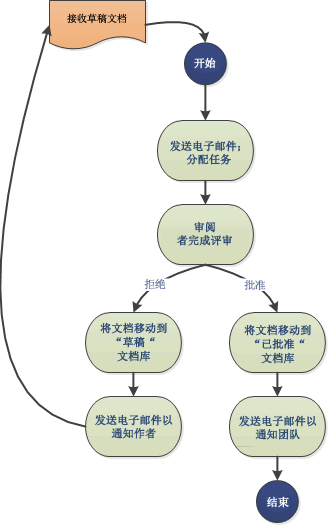
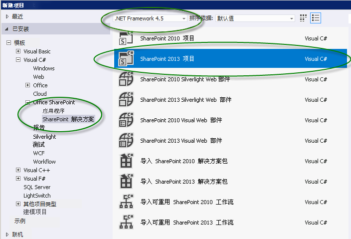

# SharePoint 2013 中的工作流入门
了解新构造的 Workflow Manager Client 1.0（其提供 SharePoint 2013 中工作流的基础架构）以及 SharePoint 工作流如何与新的 SharePoint 外接程序的模型集成。
> **重要信息**
> 有关设置和配置 SharePoint Server 2013 和 Microsoft Azure 的说明，请参阅 [设置和配置 SharePoint 2013 工作流管理器](set-up-and-configure-sharepoint-2013-workflow-manager.md)。 
  
    
    

## SharePoint 2013 中的工作流的概览

利用 SharePoint 2013 中的工作流，您可以建模并自动化业务流程。这些业务流程可以像只有一个审批者的文档审批流程一样简单（如图 1 所示），像使用 Web 服务调用和数据库支持的面向客户的产品目录一样复杂，还可以像任何虚拟构造的业务流程一样强大，满是条件、循环、用户输入、任务和自定义操作。
  
    
    

**图 1. 简单的 SharePoint 工作流**

  
    
    

  
    
    

  
    
    

  
    
    
SharePoint 2013 标志着 Workflow Manager Client 1.0作为适用于 Visual Studio 工作流的强大新奠基石的引入。构建于 Windows Workflow Foundation 4 之上，Workflow Manager Client 1.0 提供优于先前版本的优势，反映了 SharePoint 对 SharePoint 外接程序的模型和基于云的计算的承诺。有关这些更改的详细信息，请参阅  [SharePoint 2013 工作流的新增功能](what-s-new-in-workflows-for-sharepoint-2013.md)和  [SharePoint 2013 工作流基础](sharepoint-2013-workflow-fundamentals.md)。
  
    
    
也许对于工作流创作者来说最为重要的是，创建工作流的方式得到了巨大改善和简化。不仅仅工作流现在已完全是声明性的（即，基于设计器的无代码工作流），而且还简化了主要工作流创作环境（Visual Studio 2008 和 SharePoint Designer 2013）。
  
    
    
对 SharePoint 2013 中工作流的关键增强包括如下。有关 SharePoint 2013 工作流中新增功能的更多详细概览，请参阅 [SharePoint 2013 工作流的新增功能](what-s-new-in-workflows-for-sharepoint-2013.md)。
  
    
    

- 增强型连接性以启用基于云的工作流执行。事实上，在 SharePoint 2013 中内部和基于 Office 365 的工作流为 100% 奇偶校验。
    
  
- 在 SharePoint 2013 中与 SharePoint 2010 工作流之间存在完全的互操作性，可通过使用 [SharePoint 工作流互操作性 ](sharepoint-2013-workflow-fundamentals.md#bkm_InteropBridge)启用。
    
  
- 通过使用 Visual Studio 事件和操作、Web 服务和经典编程结构（全都在声明性的无代码环境中）的增强型创作表现性。
    
  
- 符合 Office 365 和云应用程序模型要求的可扩展性和稳健性
    
  
- 增强型连接以提升功能高度集成的系统。您可以从任何外部系统调用和控制工作流。此外，您的工作流还可以使用通用协议（如 HTTP、SOAP、开放数据协议 (OData), 和代表性状态传输 (REST)）对任何数据流或数据源进行 Web 服务调用。
    
  
- SharePoint Designer 2013 中针对非开发人员的增强型创作功能以及在 Visio 中撰写工作流逻辑的功能。
    
  
- Visual Studio 中增强的、但简化了的工作流开发。包括支持自定义工作流操作、在声明性环境中的快速开发、单步骤部署以hi支持开发 SharePoint 外接程序。
    
  
- 完全支持工作流驱动的 SharePoint 外接程序，其中工作流充当业务流程管理的中间层。
    
  

## Workflow Manager Client 1.0和 SharePoint 外接程序的模型

优化 Visual Studio 2008 以便开发工作流驱动的 SharePoint 外接程序以及利用 SharePoint 外接程序的模型的强大功能和灵活性。您可以使用 SharePoint 工作流对象模型，以最终用户体验 SharePoint 应用程序表面同时应用程序之下由工作流逻辑驱动的方式，启用该应用程序之下的工作流逻辑。
  
    
    
此外，Visual Studio 2008 还是开发 Office 外接程序的理想之选，后者可以从 Microsoft Office 应用程序内运行工作流。
  
    
    

## 创作 SharePoint 2013 工作流

存在两个适用于 Workflow Manager Client 1.0的主要创作环境：SharePoint Designer 2013 和 Visual Studio。此外，非技术信息工作者还可以使用 Visio 构造工作流逻辑，然后将其导入 SharePoint Designer 中并组装到 SharePoint 工作流对象中。
  
    
    
但是，主要创作环境是 Visual Studio 2008 和 SharePoint Designer 2013。为了帮您确定哪个才最符合您的需求，请参阅 [将 SharePoint Designer 与 Visual Studio 进行比较](develop-sharepoint-2013-workflows-using-visual-studio.md#bkm_Comparing)中的决策矩阵。
  
    
    

## SharePoint Designer 2013 作为工作流创作工具

在许多方面，SharePoint Designer 2013 都是 SharePoint 工作流的理想创作工具。尽管某些高级任务（如创建自定义操作）需要开发人员介入使用 Visual Studio，但是 SharePoint Designer 2013 为最广泛的工作流创作者提供了对工作流开发的最灵活的接触。
  
    
    

## 使用 Visual Studio 2008 创建工作流

Visual Studio 2008 具有内置的 SharePoint 2013 工作流项目类型。若要在 Visual Studio 中创建 SharePoint 工作流项目，请遵循这些步骤。
  
    
    

### 使用 Visual Studio 创建工作流

1. 打开 Visual Studio 2008 并创建一个新项目。在"新建项目"对话框中，依次选择"模板"、"Visual C#"、"Office SharePoint"、"SharePoint 解决方案"和"SharePoint 2013 项目"，如图 2 所示。
    
   **图 2."新建项目"对话框**

  

  

  

  
2. 创建项目后，在"项目"菜单上选择"添加新项"，然后在"Office SharePoint"项下选择"工作流"，如图 3 所示。
    
   **图 3."添加新项"对话框**

  

  

  

  
3. 创建工作流项目后，系统将向您显示一个设计器表面，您可以在其中创建工作流。工作流开发环境包括具有大量工作流创作元素的自定义工具箱。
    
   **图 4. Visual Studio 工作流创作工具箱**

  

  

  

  

## 其他资源

有关 **SharePoint 外接程序** 的详细信息，请参阅如下：
  
    
    

-  [SharePoint 外接程序](http://msdn.microsoft.com/library/cd1eda9e-8e54-4223-93a9-a6ea0d18df70%28Office.15%29.aspx)
    
  
-  [考虑 SharePoint 外接程序设计选项的三种方法](http://msdn.microsoft.com/library/0942fdce-3227-496a-8873-399fc1dbb72c%28Office.15%29.aspx)
    
  
-  [SharePoint 外接程序体系结构的重要方面和开发前景](http://msdn.microsoft.com/library/ae96572b-8f06-4fd3-854f-fc312f7f2d88%28Office.15%29.aspx)
    
  
-  [在 SharePoint 2013 中处理外部数据](http://msdn.microsoft.com/library/1534a5f4-1d83-45b4-9714-3a1995677d85%28Office.15%29.aspx)
    
  
有关使用 **Visual Studio 2008** 和 **SharePoint Designer 2013** 开发工作流的详细信息，请参阅如下》
  
    
    

-  [使用 Visual Studio 开发 SharePoint 2013 工作流](develop-sharepoint-2013-workflows-using-visual-studio.md)
    
  
-  [SharePoint Designer 和 Visio 中的工作流开发](workflow-development-in-sharepoint-designer-and-visio.md)
    
  
有关 Windows Workflow Foundation 4 的详细信息，请参阅如下： 
  
    
    

-  [开发人员对 .NET 4 中 Windows Workflow Foundation (WF) 的简介](http://msdn.microsoft.com/zh-cn/library/ee342461.aspx)
    
  
-  [Windows Workflow Foundation 中的新增功能](http://msdn.microsoft.com/zh-cn/library/dd489410.aspx)
    
  
-  [Windows Workflow Foundation 新手指南](http://msdn.microsoft.com/zh-cn/vstudio/first-steps-with-wf.aspx)
    
  
-  [工作流方法：了解 Windows Workflow Foundation](http://msdn.microsoft.com/zh-cn/library/dd851337.aspx)
    
  
-  [Windows Workflow Foundation 规则引擎简介](http://msdn.microsoft.com/zh-cn/library/dd554919.aspx)
    
  
-  [Windows Workflow Foundation 与 Windows Communication Foundation 相集成](http://msdn.microsoft.com/zh-cn/library/cc626077.aspx)
    
  

