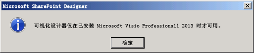
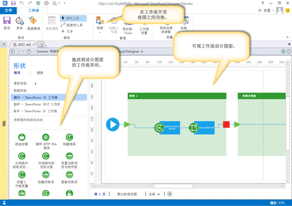
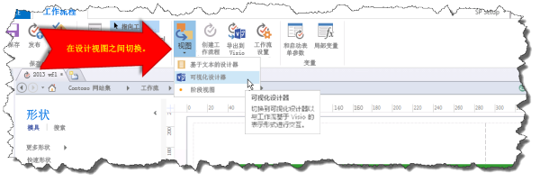

# 熟悉 SharePoint Designer 2013 中的工作流可视化设计器
了解 SharePoint Designer 2013 中的可视化设计器的基本功能。
## SharePoint Designer 2013 中的可视化设计器概述

SharePoint Designer 2013 包括一个称为可视化设计器的新工作流设计图面。您可以通过将形状拖到设计图面来使用可视化设计器开发工作流。
  
    
    

> **重要信息**
> 若要使用可视化设计器，必须在安装了 SharePoint Designer 2013 的同一台计算机上安装 Visio Professional 2013。如果您尚未安装 Visio，则会收到一条错误消息，所图所示。 
  
    
    

**图：Visio 2013 Professional 是使用可视化设计器的必备条件**

  
    
    

  
    
    

  
    
    
左侧的"形状"窗格包含工作流形状，您可以将这些形状拖到设计图面以创建工作流。下面是可用于生成工作流的三种类别的形状。 
  
    
    

- **操作：**可由工作流执行的特定操作。部分示例包括调用 HTTP Web 服务、添加注释和更新列表。 
    
  
- **组件：**添加后可为工作流操作提供结构化环境的常规组件。部分示例包括阶段容器、带有条件的循环和开始工作流形状。
    
  
- **条件：**可用于提供基于特定条件的工作流路径的条件逻辑形状。部分示例包括检查某个值是否等于另一个值、检查某个人是否是有效的 SharePoint 用户以及检查某项是否在特定的日期范围内创建。
    
  

    
> **提示**
> 有关 SharePoint Designer 2013 中可用形状的完整列表，请参阅  [Visio 中的 SharePoint Server 工作流模板中的形状](shapes-in-the-sharepoint-server-workflow-template-in-visio.md)
  
    
    

下图显示可视化设计器中的工作流。
  
    
    

**SharePoint Designer 2013 中的可视化设计器**

  
    
    

  
    
    

  
    
    

  
    
    

  
    
    

## 使用 SharePoint 2013 中的可视化设计器

可通过"工作流"选项卡的"视图"下拉菜单访问 SharePoint Designer 2013 中的可视化设计器。有三种不同的视图可用于开发工作流：
  
    
    

- **基于文本的设计器：**基于文本的工作流开发环境。
    
  
- **可视化设计器：**可将形状拖到设计图面以开发工作流的可视化工作流开发环境。（需要 Visio Professional 2013）
    
  
- **阶段视图：**通过显示工作流各个阶段的内在关系提供可视化设计图面的高级视图。它类似于"可视化设计器"视图，但不会显示形状级别的详细信息。（需要 Visio Professional 2013）
    
  
可以在"工作流"功能区的"管理"部分中的"视图"之间切换，如图所示。
  
    
    

**在 SharePoint Designer 2013 中的设计视图之间切换**

  
    
    

  
    
    

  
    
    
可以用基于文本的设计器和/或可视化设计器开发工作流。例如，如果使用基于文本的设计器开发工作流，则可以将该视图切换为可视化设计器，然后继续开发同一工作流。同样，您也可以使用可视化设计器开始开发工作流，然后再将视图切换为基于文本的设计器并继续开发同一工作流。在各视图之间来回移动可为您的工作流开发提供较大的灵活性。
  
    
    

## 其他资源

-  [SharePoint 2013 中的工作流](http://technet.microsoft.com/zh-cn/sharepoint/jj556245.aspx)
    
  
-  [What's new in workflow in SharePoint Server 2013](http://msdn.microsoft.com/library/6ab8a28b-fa2f-4530-8b55-a7f663bf15ea.aspx)
    
  
-  [Getting started with SharePoint Server 2013 workflow](http://msdn.microsoft.com/library/cc73be76-a329-449f-90ab-86822b1c2ee8.aspx)
    
  
-  [SharePoint Designer 和 Visio 中的工作流开发](workflow-development-in-sharepoint-designer-and-visio.md)
    
  
-  [工作流操作快速参考（SharePoint 2013 工作流平台）](workflow-actions-quick-reference-sharepoint-2013-workflow-platform.md)
    
  

