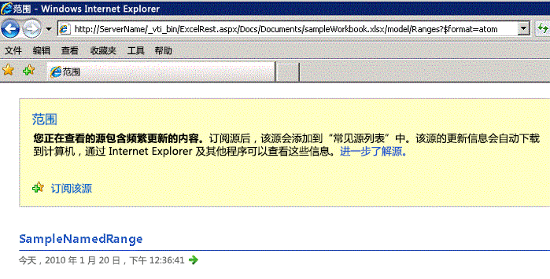
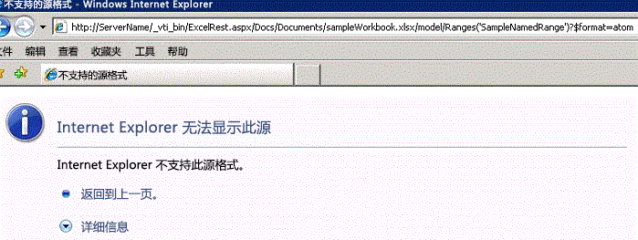
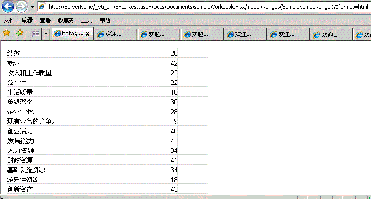

# 使用 Atom 馈送和 HTML 片段获取范围

本主题介绍使用 Excel Services 中的 REST API 访问范围的两种方式—Atom 馈送和 HTML 片段。。
  
    
    


> **注释**
> Excel Services REST API 可本地应用于 SharePoint 2013 和 SharePoint 2016。对于 Office 365 教育版、商业版和企业版帐户，请使用作为  [Microsoft Graph](http://graph.microsoft.io/zh-cn/docs/api-reference/v1.0/resources/excel
) 终结点一部分的 Excel REST API。
  
    
    


## 访问范围

Excel Services 中的 REST API 支持两种获取范围的机制。第一种主要用于使应用程序获取工作簿的原始数据，即工作簿中的原始数字或值。第二种用于从浏览器内部获取 HTML 片段。
  
    
    
如  [Excel Services REST API 中的发现](discovery-in-excel-services-rest-api.md)主题中所述，使用发现的模型页面的 REST URL 为：
  
    
    


```

http://<ServerName>/_vti_bin/ExcelRest.aspx/<DocumentLibrary>/<FileName>/model
```

因此，对于保存到  `http://` _<服务器名称>_ `/Docs/Documents/sampleWorkbook.xlsx` 的、文件名为"sampleWorkbook.xlsx"的工作簿，模型页面的 URI 如下：
  
    
    


```
http://<ServerName>/_vti_bin/ExcelRest.aspx/Docs/Documents/sampleWorkbook.xlsx/model
```

使用  [Excel Services REST API 中的发现](discovery-in-excel-services-rest-api.md)中所述的发现机制，如果您在服务器 ( `http://` _<服务器名称>_ `/_vti_bin/ExcelRest.aspx/Docs/Documents/sampleWorkbook.xlsx/model`) 上的模型页面上单击"范围"Atom 馈送，将显示一个页面，其中包含工作簿中的所有指定范围。sampleWorkbook.xlsx 包含一个指定范围，即 **SampleNamedRange**，如以下屏幕截图中所示：
  
    
    

> **重要信息**
> 您还可以指定任意范围，而不只是目录返回的范围。必须使用"|"替换冒号":"。例如，使用"A1|G5"，而不是"A1:G5"。 
  
    
    


> **注释**
> 不支持"?"和"#"等特殊字符。要正确引用包含特殊字符的工作表名称，基准准则是当引用包含特殊字符的工作表的公式时，"查看 Excel 客户端执行的操作"并遵循此示例。 
  
    
    


**发现 Excel Services REST 已命名范围**

  
    
    

  
    
    

  
    
    

### 使用 Atom 馈送访问范围

如果您在范围发现页面单击"SampleNamedRange"，您将导航到以下 URL：
  
    
    

```
http://<ServerName>/_vti_bin/ExcelRest.aspx/Docs/Documents/sampleWorkbook.xlsx/model/Ranges('SampleNamedRange')?$format=atom
```

请注意，在 Internet Explorer 中，生成的页面看起来像是一个错误，如以下屏幕截图中所示。
  
    
    

**使用 Atom 发现 Excel Services REST 范围**

  
    
    

  
    
    

  
    
    
Internet Explorer 无法显示单个条目的 Atom 馈送项目。但是查看页面的源代码将显示馈送项目包含的 XML：
  
    
    


```XML
<?xml version="1.0" encoding="utf-8"?>
<entry xmlns:x="http://schemas.microsoft.com/office/2008/07/excelservices/rest" xmlns:d="http://schemas.microsoft.com/ado/2007/08/dataservice" xmlns:m="http://schemas.microsoft.com/ado/2007/08/dataservices/metadata" xmlns="http://www.w3.org/2005/Atom">
  <title type="text">SampleNamedRange</title>
  <id>http://ServerName/_vti_bin/ExcelRest.aspx/Docs/Documents/sampleWorkbook.xlsx/model/Ranges('SampleNamedRange')</id>
  <updated>2010-01-20T21:28:10Z</updated>
  <author>
    <name />
  </author>
  <link rel="self" href="http://ServerName/_vti_bin/ExcelRest.aspx/Docs/Documents/sampleWorkbook.xlsx/model/Ranges('SampleNamedRange')?$format=atom" title="SampleNamedRange" />
  <category term="ExcelServices.Range" scheme="http://schemas.microsoft.com/ado/2007/08/dataservices/scheme" />
  <content type="application/xml">
    <x:range name="SampleNamedRange">
      <x:row>
        <x:c>
          <x:fv>Performance</x:fv>
        </x:c>
        <x:c>
          <x:v>26</x:v>
          <x:fv>26</x:fv>
        </x:c>
        <x:c />
      </x:row>
      <x:row>
        <x:c>
          <x:fv>Employment</x:fv>
        </x:c>
        <x:c>
          <x:v>42</x:v>
          <x:fv>42</x:fv>
        </x:c>
        <x:c />
      </x:row>
      <x:row>
        <x:c>
          <x:fv>Earnings And Job Quality</x:fv>
        </x:c>
        <x:c>
          <x:v>22</x:v>
          <x:fv>22</x:fv>
        </x:c>
        <x:c />
      </x:row>
    ... XML truncated for brevity. 
      <x:row>
        <x:c>
          <x:fv>Innovation Assets</x:fv>
        </x:c>
        <x:c>
          <x:v>43</x:v>
          <x:fv>43</x:fv>
        </x:c>
        <x:c />
      </x:row>
      <x:row>
        <x:c />
        <x:c>
          <x:fv>State</x:fv>
        </x:c>
        <x:c />
      </x:row>
    </x:range>
  </content>
</entry>
```

馈送项目包含表示范围内数据的 XML。下面是相关的 XML 元素：
  
    
    

- **<range>** 范围元素。表示返回的范围的容器。
    
  
- **<row>** 行元素。表示范围中的每一行。
    
  
- **<c>** 单元格元素。表示行中的每个单元格。
    
  
- **<fv>** 格式化的值元素。表示 Excel 格式化的值。如果值在工作簿中的类型的字符串，格式化的值元素将为 **<c>** 下的唯一元素。
    
  
- **<v>** 值元素。表示数值。如果单元格中的值为数字而不是字符串，值元素将包含该信息。
    
  
使用 XML 是从 Excel 范围中获取数据的一种更简单的方式，因此您可以将其用于您的应用程序中。
  
    
    

### 使用 HTML 访问区域

如果您查看使用 Atom 馈送访问指定范围的 URL，请注意，URL 的最终部分包含名为  `$format` 的参数，该参数设置为 `atom`。该参数的值还可为  `html`。如果您将  `atom` 值更改为 `html`，URL 将返回 HTML 片段，而不是 Atom 馈送。下面是一个 URL 示例：
  
    
    

```

http://<ServerName>/_vti_bin/ExcelRest.aspx/Docs/Documents/sampleWorkbook.xlsx/model/Ranges('SampleNamedRange')?$format=html
```

在 Internet Explorer 中，页面将如下图所示。
  
    
    

> **注释**
> 此 HTML 可直接在 **IFRAME** 中使用，也可在 JavaScript 中使用以提供更无缝的体验。
  
    
    


  
    
    

  
    
    

  
    
    

  
    
    

## 另请参阅


#### 概念


  
    
    
 [Excel Services REST API 的资源 URI](resources-uri-for-excel-services-rest-api.md)
