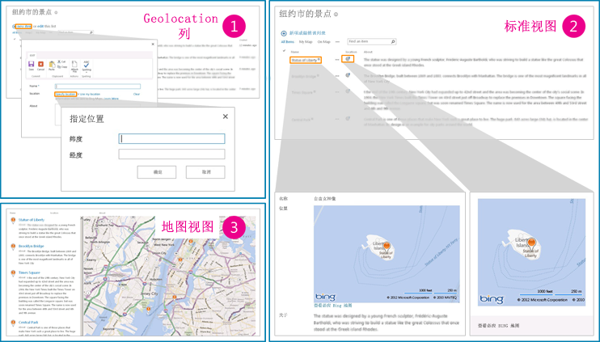

# 如何：在 SharePoint 2013 中以编程方式向列表添加 Geolocation 列
了解如何以编程方式将"地理位置"列添加到 SharePoint 2013 中的列表。使用新的"地理位置"字段创建您自己的基于"地理位置"的字段类型以在 SharePoint 列表和基于位置的网站中集成位置信息和地图。
SharePoint 2013 引入了一个名为 地理位置 的新字段类型，使您能够用位置信息注释 SharePoint 列表。在"地理位置"类型的列中，您可以将一对十进制的纬度和经度坐标作为位置信息输入，您也可以从浏览器中检索用户当前位置的坐标（如果浏览器实施了 W3C 地理位置 API）。有关地理位置列的详细信息，请参阅 [集成 SharePoint 2013 中的位置和映射功能](integrating-location-and-map-functionality-in-sharepoint-2013.md)。默认情况下，"地理位置"列在 SharePoint 列表中不可用。若要将该列添加到 SharePoint 列表中，您必须编写代码。请在本文中了解如何使用 SharePoint 客户端对象模型将"地理位置"字段以编程方式添加到列表中。
  
    
    

要查看列表中的"地理位置"字段值或数据，必须为每个 SharePoint 前端 Web 服务器上安装一个名为 SQLSysClrTypes.msi 的 MSI 软件包。此软件包安装各种组件以实现 SQL Server 2008 中新的几何、地理、层次 ID 类型。默认情况下，为 SharePoint Online 安装了该文件。但它不适用于 SharePoint Server 2013 的本地部署。只有在您是服务器场管理员群组的成员时，才能执行该操作。要下载 SQL server 2008 的 SQLSysClrTypes.msi，请参阅 Microsoft 下载中心提供的针对 SQL Server 2008 的  [Microsoft SQL Server 2008 R2 SP1 功能包](http://www.microsoft.com/zh-cn/download/details.aspx?id=26728)或针对 SQL Server 2012 的  [Microsoft? SQL Server? 2012 功能包](http://www.microsoft.com/zh-cn/download/details.aspx?id=29065)。
## 添加"地理位置"列的先决条件
<a name="SP15addgeo_prereq"> </a>


  
    
    

- 使用具有添加列的足够权限访问 SharePoint 2013 列表。
    
  
- 可以从 [Bing 地图帐户中心](https://www.bingmapsportal.com/)（https://www.bingmapsportal.com）获取场或 Web 级别的有效 Bing 地图密钥设置。
    
    > **重要信息**
      > 请注意您必须遵守使用 Bing 地图密钥的条款和条件，以及将任何与传递到 Bing 地图服务的数据有关的信息透露给应用程序用户的相关条款和条件。 
- Visual Studio 2010。
    
  

## 代码示例：以编程方式将地理位置列添加到列表
<a name="SP15addgeo_addcolumn"> </a>

请按照以下步骤使用 SharePoint 2013 客户端对象模型将"地理位置"列添加到列表中。
  
    
    

### 若要使用客户端对象模型将"地理位置"列添加到列表中


1. 启动 Visual Studio。
    
  
2. 在菜单栏中，选择"文件"和"新建项目"。"新建项目"对话框打开。
    
  
3. 在"新建项目"对话框的"已安装的模板"框中选择"C#"，然后选择"控制台应用程序"模板。
    
  
4. 为该项目命名一个名称，然后选择"确定"按钮。
    
  
5. Visual Studio 创建项目。向以下程序集添加一个引用，然后选择"确定"。
    
    Microsoft.SharePoint.Client.dll
    
    Microsoft.SharePoint.Client.Runtime.dll
    
  
6. 在默认的 .cs 文件中，添加 **using**指令，如下所示。
    
     `using Microsoft.SharePoint.Client;`
    
  
7. 将以下代码添加到 .cs 文件中的 **Main** 方法。
    
  ```cs
  
class Program
    {
        static void Main(string[] args)
        {
            AddGeolocationField();
            Console.WriteLine("Location field added successfully");
        }
        private static void AddGeolocationField()
        { 
         // Replace site URL and List Title with Valid values.
            ClientContext context = new ClientContext("<Site Url>"); 
            List oList = context.Web.Lists.GetByTitle("<List Title>");
            oList.Fields.AddFieldAsXml("<Field Type='Geolocation' DisplayName='Location'/>",true, AddFieldOptions.AddToAllContentTypes);                                        
            oList.Update();
            context.ExecuteQuery();
        } 
    }
  ```

8. 将 <Site Url> 和 <List Title> 替换为有效值。
    
  
9.  在"项目属性"中将目标框架设置为 .NET Framework 4.0 或 3.5，并运行该示例。
    
  
10. 导航至列表。您应该能够看到列表中名为"位置"的地理位置类型列。现在您可以输入一些值，并在操作中看到它。图 1 所示为您可以在列表中看到的默认位置和地图功能。
    
   **图 1. 默认位置和地图功能的摘要视图**

  


  

  

  

## 以编程方式将带有"地理位置"字段值的列表项添加到 SharePoint 列表
<a name="SP15addgeo_addlistitem"> </a>

将"地理位置"字段添加到 SharePoint 列表后，开发人员可以用编程方式将列表项添加至列表中。以编程方式添加列表项有两种方法：将"FieldGeolocationValue"对象传递到"地理位置"字段；将"原始值"传递到"地理位置"字段。
  
    
    

### 方法 A：将FieldGeolocationValue 对象传递到地理位置字段


- 以下方法通过将"地理位置"值作为对象传递来添加列表项。
    
  ```cs
  
private void AddListItem()
        {   // Replace site URL and List Title with Valid values.
            ClientContext context = new ClientContext("<Site Url>");
            List oList = context.Web.Lists.GetByTitle("<List Name>");

            ListItemCreationInformation itemCreationInfo = new ListItemCreationInformation();
            ListItem oListItem = oList.AddItem(itemCreationInfo);

            oListItem["Title"] = "New Title";

            FieldGeolocationValue oGeolocationValue = new FieldGeolocationValue();
            oGeolocationValue.Latitude = (double)17.4;
            oGeolocationValue.Longitude = (double)78.4;
            oListItem["location"] = oGeolocationValue;

            oListItem.Update();
            context.ExecuteQuery();
        }

  ```


### 方法 B：传递至原始值地理位置字段


- 以下方法通过将原始值传递到"地理位置"字段将列表项添加到 SharePoint 列表中。
    
  ```cs
  
private void AddListItem()
        {   // Replace site URL and List Title with Valid values.
            ClientContext context = new ClientContext("<Site Url>");
            List oList = context.Web.Lists.GetByTitle("<List Name>");

            ListItemCreationInformation itemCreationInfo = new ListItemCreationInformation();
            ListItem oListItem = oList.AddItem(itemCreationInfo);

            oListItem["Title"] = "New Title";
             // Data in WKT (World Known Text) format.
            oListItem["location"] = "POINT (78.4 17.4)" ; 

            oListItem.Update();
            context.ExecuteQuery();
        }

  ```


## 其他资源
<a name="SP15addgeo_addlresources"> </a>


-  [集成 SharePoint 2013 中的位置和映射功能](integrating-location-and-map-functionality-in-sharepoint-2013.md)
    
  
-  [如何：在 SharePoint 2013 中设置 Web 和服务器场级别的必应 Bing 地图密钥](how-to-set-the-bing-maps-key-at-the-web-and-farm-level-in-sharepoint-2013.md)
    
  
-  [如何：使用客户端呈现扩展地理位置字段类型](how-to-extend-the-geolocation-field-type-using-client-side-rendering.md)
    
  
-  [在 SharePoint 2013 中针对地理位置字段创建地图视图](create-a-map-view-for-the-geolocation-field-in-sharepoint-2013.md)
    
  
-  [如何：将地图与 Windows Phone 应用程序和 SharePoint 2013 列表集成](how-to-integrate-maps-with-windows-phone-apps-and-sharepoint-2013-lists.md)
    
  
-  [在移动应用程序中使用 SharePoint 2013 位置字段类型](http://technet.microsoft.com/zh-cn/library/fp161355%28office.15%29.aspx)
    
  

