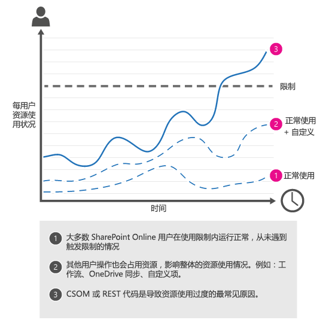
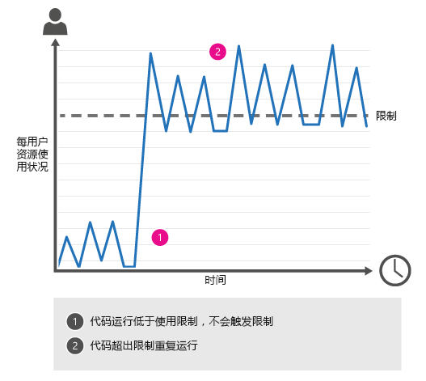
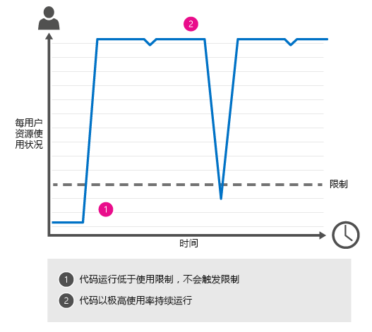

# 如何：避免在 SharePoint Online 中受限制或被阻止
了解 SharePoint Online 中的限制以及如何避免受限制或被阻。其中包括可用于简化任务的示例 CSOM 和 REST 代码。
 *本文内容：* 
  
    
    


-  [什么是限制？](how-to-avoid-getting-throttled-or-blocked-in-sharepoint-online.md#BKMK_Whatisthrottling)
    
  
-  [SharePoint Online 中常见的限制场景](how-to-avoid-getting-throttled-or-blocked-in-sharepoint-online.md#BKMK_Commonthrottlingscenarios)
    
  
-  [为什么不能告诉我确切的限制？](how-to-avoid-getting-throttled-or-blocked-in-sharepoint-online.md#BKMK_Whycantyoujusttellmetheexactthrottlinglimits)
    
  
-  [处理限制的最佳实践](how-to-avoid-getting-throttled-or-blocked-in-sharepoint-online.md#BKMK_Bestpracticestohandlethrottling)
    
  
-  [GitHub CSOM 代码示例：SharePoint Online 限制](how-to-avoid-getting-throttled-or-blocked-in-sharepoint-online.md#BKMK_GitHubCSOMandRESTcodesamplesSharePointOnlineThrottling)
    
  
-  [如果我在 SharePoint Online 中被阻止，该怎么办？](how-to-avoid-getting-throttled-or-blocked-in-sharepoint-online.md#BKMK_Whatshouldyoudoifyougetblocked)
    
  
-  [其他资源](how-to-avoid-getting-throttled-or-blocked-in-sharepoint-online.md#BKMK_Additionalresources)
    
  

这听起来是不是很熟悉？举例来说，您正在运行 CSOM 过程以迁移 SharePoint Online 中的文件，但一直受限制，甚至更糟糕的是，您完全被阻止。接下来会发生什么？您应该怎么阻止这一切？
  
    
    


## 什么是限制？
<a name="BKMK_Whatisthrottling"> </a>

SharePoint Online 使用限制来维护 SharePoint Online 服务的最佳性能和可靠性。限制会限制用户操作或并发调用数量（通过脚本或代码），以防止资源的过度使用。
  
    
    
也就是说，用户很少在 SharePoint Online 中被限制。这项服务非常强大，并且设计为具有极高的处理量。如果您被限制，99% 都是因为自定义代码。这并不是说不会被其他方式限制，只是那些方式并不常用。例如，您启动了 10 台计算机并在这 10 台计算机上均运行同步客户端。每台计算机上同步 1TB 内容。这可能会使您被限制。
  
    
    

  
    
    

  
    
    

### 在 SharePoint Online 中被限制时会发生什么？

当用户超过使用限制时，SharePoint Online 会限制该用户帐户发出的任何进一步请求，但通常只是短时间内。在用户限制的有效期内，将限制该用户的所有用户操作。
  
    
    

- 对于用户直接在浏览器中执行的请求，SharePoint Online 会将您重定向到限制信息页面，请求将失败。
    
  
- 对于所有其他请求（包括 CSOM 或 REST 调用），SharePoint Online 将返回 HTTP 状态代码 429（请求过多），请求将失败。
    
  
如果有问题的进程仍然超过使用限制，SharePoint Online 可能会完全阻止该进程；在这种情况下，您可能会看到 HTTP 状态代码 503（"服务不可用"），我们会在 Office 365 消息中心中通知您此阻止。错误消息如下所示：
  
    
    

  
    
    

  
    
    
503 服务器不可用消息。
  
    
    

## SharePoint Online 中常见的限制场景
<a name="BKMK_Commonthrottlingscenarios"> </a>

导致 SharePoint Online 中出现用户限制最常见的原因是以太高的频率执行太多操作的客户端对象模型 (CSOM) 或代表性状态传输 (REST) 代码。
  
    
    

- **突发通信**
    
    并非一直出现大量通信，但经过足够的时间，您可能会不时被限制和解除限制。
    
  - 例如，将文件迁移到 SharePoint Online 之后，您运行自定义 CSOM 或 REST 脚本以更新文件上的元数据。CSOM/REST 脚本以极高的频率更新大量文件，这将触发限制。与此类似，使用 REST 服务的自动完成 UI 小部件在每个最终用户操作中向列表发出太多的调用，也可能导致限制，具体取决于哪些其他操作也在同时消耗资源。
    

  

  

  
- **无比拥挤的通信**
    
    单个进程在很长一段时间内持续大大超出限制。
    
  - 您使用 Web 服务构建同步用户配置文件属性的工具。该工具将根据您的业务线 (LOB) 人力资源 (HR) 系统中的信息更新用户配置文件属性。该工具以太高的频率发出调用。
    
  
  - 您在 SharePoint Online 上运行负载测试脚本但受到限制。SharePoint Online 上不允许进行负载测试。
    
  
  - 例如，您在 SharePoint Online 上对您的工作组网站进行了自定义设置，方法是在主页上添加了一个状态指示器。此状态指示器频繁更新，这会导致页面向 SharePoint Online 服务发出太多调用，从而触发限制。
    

  

  

  

## 为什么不能告诉我确切的限制？
<a name="BKMK_Whycantyoujusttellmetheexactthrottlinglimits"> </a>

设置和发布确切的限制听起来非常直接，但事实上并非最好的办法。我们会持续监控 SharePoint Online 上的资源使用情况，并据此对限制进行微调，以便用户可以使用最大数量的资源，而不论 SharePoint Online 的可靠性和性能如何。这就是为什么您的 CSOM 或 REST 代码应包含增量退避以处理限制如此重要；这使您的代码在任何一天都能以最快的速度运行，并且可以在达到限制时退避。本文后面的代码示例将说明如何使用增量退避。
  
    
    

## 处理限制的最佳实践
<a name="BKMK_Bestpracticestohandlethrottling"> </a>


- 减少每个请求的操作数
    
  
- 减少调用频率
    
  
- 使用增量退避减少调用数量和频率，直至不再发生限制
    
  
增量退避逐渐延长两次重试之间的间隔，然后尝试再次运行被限制的代码。您可以使用本文后面的 GitHub 代码示例（编写为扩展方法），向您的代码添加增量退避。
  
    
    
退避是处理限制最快速的方式，因为 SharePoint Online 在用户被限制时仍会记录资源使用情况。换句话说，主动重试将对您不利，因为即使调用失败，它们仍会计入您的使用限制。您退避得越快，将能越快速地停止超过使用限制。 
  
    
    
有关 SharePoint Online 活动监视方式的详细信息，请参阅 [Diagnosing performance issues with SharePoint Online](http://msdn.microsoft.com/library/93502df4-552f-409b-971b-2e9b0f38588f.aspx)。
  
    
    
有关 Microsoft Cloud 上的限制的更广泛讨论，请参阅 [Throttling Pattern](http://msdn.microsoft.com/library/4baf5af2-32fc-47ab-8569-3e5c59a5ebd5.aspx)。
  
    
    

## GitHub CSOM 代码示例：SharePoint Online 限制
<a name="BKMK_GitHubCSOMandRESTcodesamplesSharePointOnlineThrottling"> </a>

 [Office 365 开发人员模式和做法存储库](http://github.com/OfficeDev/PnP)中的  [CoreThrottling ](https://github.com/OfficeDev/PnP/tree/dev/Samples/Core.Throttling) 是一个演示增量退避技术的代码示例。此技术只需对代码进行较少的更改。
  
    
    
运行此代码示例之前：
  
    
    

- 打开 **Program.cs** 并在 **Main** 方法中输入以下信息：
    
  - 您的 Office 365 开发人员帐户凭据。
    
  
  - 您的 Office 365 开发人员网站的 URL。
    
  
  - 您的 Office 365 开发人员网站上的测试文档库的名称。
    
  
- 如果您收到错误消息，指出 App.Config 文件无效，请转到"解决方案资源管理器"，右键单击 **App.config** ，然后选择"从项目中排除"。
    
  
 **Core.Throttling** 使用仅用户授权策略作为控制台应用程序运行，这意味着此代码示例使用当前用户的权限。在 Program.cs 的 **Main** 方法中，while 循环将在测试文档库中重复创建新文件夹。然后向 **ctx.ExecuteQueryWithExponentialRetry** 发出调用，该调用使用 CSOM 执行 **ExecuteQuery** 方法。 **ExecuteQueryWithExponentialRetry** 是 [ClientContext](https://msdn.microsoft.com/library/office/microsoft.sharepoint.client.clientcontext%28v=office.15%29.aspx) 对象的扩展方法，在 ClientContextExtension.cs 中定义。
  
    
    
如果 SharePoint Online 限制 **ExecuteQuery** 语句， **ExecuteQueryWithIncrementalRetry** 将通过执行下列操作，启动增量退避技术：
  
    
    

- 捕获 **WebException** 并检查 **HttpWebResponse.StatusCode** 。如果 SharePoint Online 限制 **ExecuteQuery** 语句， **HttpWebResponse.StatusCode** 将为 429。
    
  
- 当前线程将在 **backoffInterval** 中指定的时间内处于挂起状态。
    
  
- 当前线程恢复时， **backoffInterval** 将翻倍，执行的重试次数 ( **retryAttempts** ) 将增加。通过使 **backoffInterval** 翻倍，您的代码将在重试 SharePoint Online 限制的代码之前挂起一段较长的时间。
    
  
- 此过程将重复，直至 **ExecuteQuery** 语句成功，或者超过允许的重试次数 ( **retryCount** )。
    
  

### CSOM 代码示例：增量退避和重试（调用本文后面的 ExecuteQueryWithIncrementalRetry 方法）


```

using (var ctx = new ClientContext(serverUrl))
       {
           //Provide account and pwd for connecting to the source
           var passWord = new SecureString();
           foreach (char c in password.ToCharArray()) passWord.AppendChar(c);
           ctx.Credentials = new SharePointOnlineCredentials(login, passWord);
            try
           {
               int number = 0;
               // This loop will be executed 1000 times, which will cause throttling to occur
               while (number < 1000)
               {
                   // Try to create new folder based on Ticks to the given list as an example process
                   var folder = ctx.Site.RootWeb.GetFolderByServerRelativeUrl(listUrlName);
                   ctx.Load(folder);
                   folder = folder.Folders.Add(DateTime.Now.Ticks.ToString());
                   // Extension method for executing query with throttling checks
                   ctx.ExecuteQueryWithIncrementalRetry(5, 30000); //5 retries, with a base delay of 30 secs.
                   // Status indication for execution.
                   Console.WriteLine("CSOM request successful.");
                   // For loop handling.
                   number = number + 1;
               }
           }
           catch (MaximumRetryAttemptedException mex)
           {
               // Exception handling for the Maximum Retry Attempted
               Console.WriteLine(mex.Message);
           }
       }

```


### CSOM 代码示例：ExecuteQueryWithIncrementalRetry 方法


```

public static void ExecuteQueryWithIncrementalRetry(this ClientContext context, int retryCount, int delay)
        {
            int retryAttempts = 0;
            int backoffInterval = delay;
            if (retryCount <= 0)
                throw new ArgumentException("Provide a retry count greater than zero.");
           if (delay <= 0)
                throw new ArgumentException("Provide a delay greater than zero.");
           while (retryAttempts < retryCount)
            {
                try
                {
                    context.ExecuteQuery();
                    return;
                }
                catch (WebException wex)
                {
                    var response = wex.Response as HttpWebResponse;
                    if (response != null &amp;&amp; response.StatusCode == (HttpStatusCode)429)
                    {
                        Console.WriteLine(string.Format("CSOM request exceeded usage limits. Sleeping for {0} seconds before retrying.", backoffInterval));
                        //Add delay.
                        System.Threading.Thread.Sleep(backoffInterval);
                        //Add to retry count and increase delay.
                        retryAttempts++;
                        backoffInterval = backoffInterval * 2;
                    }
                    else
                    {
                        throw;
                    }
                }
            }
            throw new MaximumRetryAttemptedException(string.Format("Maximum retry attempts {0}, have been attempted.", retryCount));
       }

```


## 如果我在 SharePoint Online 中被阻止，该怎么办？
<a name="BKMK_Whatshouldyoudoifyougetblocked"> </a>

阻止是限制最极端的形式。我们极少阻止租户，除非我们检测到可能会影响 SharePoint Online 服务整体运行状况的长期超高通信量。我们将进行阻止，以防超高通信量使 SharePoint Online 的性能和可靠性降级。阻止通常发生在租户级别，它会阻止有问题的进程在特定时间段内或者在您解决问题之前运行。如果我们阻止了您的订阅，您必须执行操作修改有问题的进程，然后才能移除阻止。
  
    
    
如果我们阻止了您的订阅，您将看到 HTTP 状态代码 503，我们将在 Office 365 消息中心中通知您此限制。消息将描述导致限制的原因，提供有关如何解决违反问题的指导，并告诉您应该联系谁以移除阻止。
  
    
    

## 其他资源
<a name="BKMK_Additionalresources"> </a>


-  [Diagnosing performance issues with SharePoint Online](http://msdn.microsoft.com/library/93502df4-552f-409b-971b-2e9b0f38588f.aspx)
    
  
-  [Capacity planning and load testing SharePoint Online](http://msdn.microsoft.com/library/22fa7e7e-7554-4987-b56f-b39bbf303a0a.aspx)
    
  
-  [GitHub：SharePoint Online 限制代码示例](https://github.com/OfficeDev/PnP/tree/dev/Samples/Core.Throttling)
    
  

